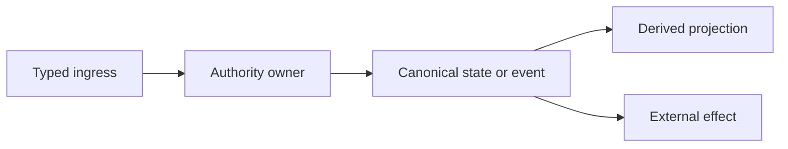

# Architecture Garden Project Entry Template

Replace placeholders and remove instructional comments before publishing. Preserve the snapshot/evidence, architecture/runtime, maturity, architecture-debt/open-law, and related-studies sections. Common vocabulary, mathematics, Zoo correlation, cross-project comparison, composable-API implications, and candidate ecosystem patterns are conditional: keep them when evidence supports a useful claim, or replace an expected section with a short explanation that no supported claim is currently available.

````markdown
---
title: Architecture Garden — <project>
aliases:
  - <project> architecture study
status: active
type: architecture-garden-project
created: YYYY-MM-DD
analyzed: YYYY-MM-DD
analysis_schema: architecture-garden-v1
repository: /absolute/path/to/repository
repository_remote: git@github.com:org/repository.git
repository_commit: 0000000000000000000000000000000000000000
repository_branch: main
repository_commit_date: YYYY-MM-DDTHH:MM:SSZ
repository_worktree: clean
go_module: github.com/org/repository
tags:
  - architecture-garden
  - <project>
  - <primary-topic>
related_files:
  - path/to/principal/runtime/file.go
  - path/to/principal/store/file.go
  - path/to/principal/test_file.go
related_notes:
  - "[[Research/Software Architecture Garden/README]]"
  - "[[Transcripts/Research/09 - RAG-MATHS Pattern Zoo]]"
  - "[[Transcripts/Research/10 - PBUI-MATHS Pattern Zoo Handbook]]"
---

# Architecture Garden — <project>

<One or two paragraphs explaining what the repository does, why it belongs in the Garden, and the central architectural separation.>

> [!summary]
> - <strongest established pattern>
> - <strongest candidate ecosystem pattern>
> - <important cross-project connection>
> - <most consequential debt or open law>

## Snapshot identity and evidence

| Field | Value |
|---|---|
| Repository | `/absolute/path` |
| Remote | `git@github.com:org/repo.git` |
| Branch | `<branch>` |
| Commit | `<40-character hash>` |
| Commit date | `<date>` |
| Commit subject | `<subject>` |
| Worktree | `<clean/dirty and inclusion rule>` |
| Analysis scope | `<whole repository or subsystem>` |

<Explain which source, tests, docs, consumers, and deployment artifacts were inspected. State exclusions.>

## Architecture and runtime path



<Walk through at least one concrete end-to-end path. Name types, symbols, stores, transaction boundaries, failure behavior, and tests.>

## Authority and state map

| Object | Owner | Identity/revision | Durable? | Rebuildable? | Must not be confused with |
|---|---|---|---|---|---|
| <command> | <client/handler> | <request key> | No | N/A | authority/effect |
| <event> | <service/store> | <event identity> | Yes | No | projection |
| <projection> | <projector> | <cursor/revision> | Maybe | Yes | canonical truth |

<!-- Conditional: retain only when cross-project evidence supports a vocabulary proposal. -->
## Candidate common vocabulary

| Proposed term | Project-local name | Invariant | Nearby ecosystem names | Difference retained |
|---|---|---|---|---|
| **<term>** | `<local>` | <law/role> | <aliases> | <non-equivalence> |

> [!important] Vocabulary discipline
> <Short list of distinctions that must survive normalization.>

<!-- Conditional: retain only when a law changes an API, invariant, validator, test, or review. -->
## Mathematical and computer-science foundations

### 1. <Foundation derived from concrete code>

<Introduce concrete values, then types/functions.>

$$
<law>
$$

**Operational consequence:** <what the law buys in production>.

**Limit:** <what the evidence does not establish>.

### 2. <Second foundation>

<Repeat as needed. Prefer a small set of useful laws.>

<!-- Conditional: retain only for exact strong, partial, adjacent, or negative relations. -->
## Correlation with the Pattern Zoos

| Project evidence | Zoo relation | Strength and boundary |
|---|---|---|
| <concrete source/test behavior> | [[Transcripts/Research/09 - RAG-MATHS Pattern Zoo#Exact heading|RAG N]] | Strong/partial/negative plus limit |
| <concrete source/test behavior> | [[Transcripts/Research/10 - PBUI-MATHS Pattern Zoo Handbook#Exact heading|PBUI N]] | Strong/partial/negative plus limit |

<State explicit non-equivalences. Do not force every project into both zoos.>

<!-- Conditional: retain when at least one independent comparison target exists. -->
## Cross-project comparison

| Project | Shared invariant | Important difference |
|---|---|---|
| [[Research/Software Architecture Garden/<project>/README|Project]] | <same law> | <different object, authority, or failure> |

## Pattern maturity assessment

| Pattern | Maturity | Evidence or limitation |
|---|---|---|
| <pattern> | Established locally | <source, test, consumer> |
| <pattern> | Candidate ecosystem pattern | <implementation plus comparison target> |
| <pattern> | Emergent | <missing contract> |
| <pattern> | Architecture debt | <duplication/failure> |
| <law> | Open correctness obligation | <unproven or violated invariant> |

## Architecture debt and open laws

### <Law or debt item>

**Required law:**

$$
<equation or precise invariant>
$$

**Current evidence:** <what code/tests establish>.

**Gap:** <race, bypass, stale state, missing validator, schema drift, etc.>.

**Likely validation:** <test, transaction, structural guard, model, or operational probe>.

<!-- Conditional: retain when the foundations imply concrete API design. -->
## Implications for composable APIs

1. <Typed intent/effect boundary>
2. <Identity/revision/cursor types>
3. <Recovery and outcome semantics>
4. <Lawful composition opportunity>
5. <Wire-format encapsulation>

<Include a small Go or JavaScript sketch only when it clarifies the contract.>

<!-- Conditional: retain only after local evidence and a credible comparison target exist. -->
## Candidate ecosystem patterns

1. **<Preferred name>** — <one-sentence invariant>.
2. **<Preferred name>** — <one-sentence invariant>.

<State what evidence another project must supply before promotion.>

## Recommended next investigations

1. <Focused source/concurrency/security audit>
2. <Independent consumer comparison>
3. <API experiment or law test>

## Related studies

- [[Research/Software Architecture Garden/README|Software Architecture Garden]]
- [[Transcripts/Research/09 - RAG-MATHS Pattern Zoo|RAG-MATHS Pattern Zoo]]
- [[Transcripts/Research/10 - PBUI-MATHS Pattern Zoo Handbook|PBUI-MATHS Pattern Zoo Handbook]]
- [[Research/Software Architecture Garden/<comparison>/README|Comparison project]]
````

## Optional companion-study layout

Use only when one README cannot coherently cover independent subsystems:

```text
Research/Software Architecture Garden/<project>/
├── README.md
├── 01 - Project Architecture Overview.md
├── 02 - <Coherent Pattern Study>.md
├── 03 - <Coherent Pattern Study>.md
├── 08 - Architecture Debt and Patterns Not to Repeat.md
└── 09 - Candidate Ecosystem Guidelines.md
```

The README must still explain the whole-system invariant and provide the reading path. Do not split merely to reduce file length.
