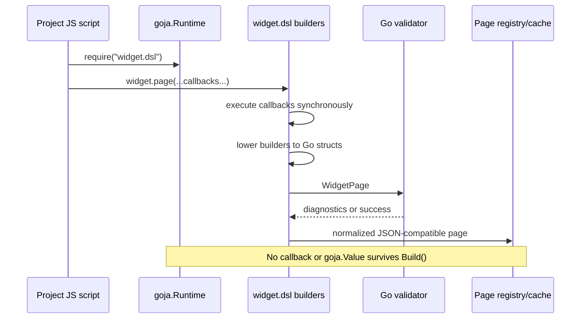
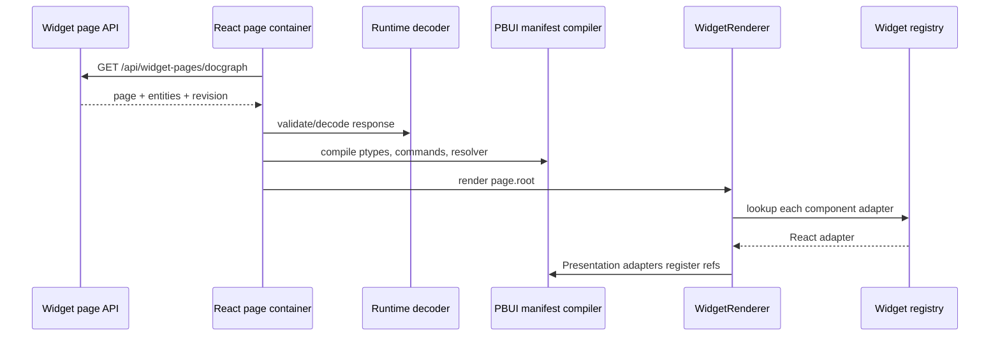
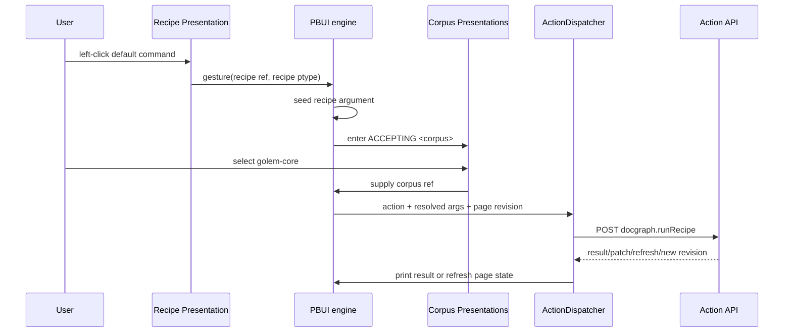

# Designing a Goja-Authored, React-Rendered PBUI Widget Framework

## A textbook guide to the Docgraph Workbench redesign

This chapter explains how to turn the attached Docgraph Workbench prototype into a framework in which Goja scripts author user interfaces, React renders those interfaces, and PBUI supplies the interaction model. The central design decision is simple to state and demanding to preserve:

> Goja describes a page as data. React renders that data. PBUI retains the semantic identity of what React rendered and computes interaction from typed commands.

By the end of the chapter, you should understand why the design has three separate contracts, how a script becomes a browser page, how a click becomes a typed command invocation, how the accept loop collects missing arguments, and how to organize the Go and React code so that neither side quietly takes over the other side's responsibilities.

The accompanying artifacts are:

- `docgraph-workbench-pbui.jsx`, a self-contained demonstrator applied directly to the original React script.
- `docgraph-workbench-pbui.patch`, the unified diff against the attached script.
- `pbui-widget-dsl-reference/`, a production-oriented repository layout with shared contracts, React seams, Go seams, an example script, and a test matrix.

The private PARC note at `parc.yolo.scapegoat.dev` was not retrievable from the authoring environment. The concrete design in this chapter therefore uses the attached workbench, `go-go-golems/react-pbui`, and the Widget DSL v3 implementation and documentation on the `task/rag-eval-ttc` branch of `wesen/rag-evaluation-system` as the executable source material.

---

## 1. The problem is not “render JSON in React”

A JSON renderer is the easiest part of this project. A recursive function can inspect a node, look up a component, render its children, and return JSX. That implementation is useful, but it does not create a coherent application framework.

The harder problem is preserving meaning across the server/browser boundary. When a script emits a visible document title, the framework must still know that the visible region represents a particular document. It must know which commands accept a document, which command is the default, how the document is described, how it can be entered through the keyboard, and whether it remains valid after the underlying data changes.

Ordinary React rendering usually discards this information. A component receives a document, extracts a title, and emits a `<span>`. The DOM contains text and styling, not the fact that the text represents `runbook/payments-latency` as a `doc`. A later right-click handler has to reconstruct that meaning through component-specific closures and props. The result is a collection of local interaction rules rather than one application-wide command system.

PBUI exists to retain that semantic association. Widget IR exists to let Goja author visible structure without shipping executable closures into the browser. The action dispatcher exists to keep effects out of both the IR and the reusable React components.

The framework therefore answers three different questions:

| Question | Owner | Example |
|---|---|---|
| What should be visible? | Widget IR and React adapters | A card containing a title, caption, badges, and a document presentation. |
| What does each visible region represent? | PBUI presentation types and object references | This card presents `{kind: "doc", id: "runbook/payments-latency"}` as `<doc>`. |
| What effect should an invocation produce? | The host action dispatcher and server action API | Set the search query, run a recipe, mutate server state, or refresh the page. |

A framework that merges these questions will work for a demo and become difficult to extend. A framework that separates them can add new renderers, new domain widgets, new commands, and new server actions without rewriting the entire interaction path.

### The three invariants

The implementation should be reviewed against three invariants.

1. **No authoring closure crosses the page boundary.** A Goja callback may configure a builder while the script runs. The built result contains JSON-compatible data only.
2. **No presented domain object receives a hand-wired semantic click handler.** A presentation registers meaning. PBUI routes gestures and invokes commands.
3. **No reusable React widget owns backend transport.** Containers fetch data and dispatch actions. Components render DTO-shaped props and emit declared actions.

These invariants are more important than any individual API name. APIs can evolve while the separation remains intact.

---

## 2. What the original workbench already gets right

The attached workbench is not a blank slate. Its strongest idea is the same idea the Widget DSL needs: authoring code executes once and lowers to normalized plans.

A search recipe callback creates operator nodes. The surviving `SearchPlan` contains operator identifiers, input bindings, and canonical configuration. The closure used to construct the recipe is gone. Build recipes and context recipes follow the same pattern. Script operators are the deliberate exception: they retain executable code behind a declared phase, typed ports, capabilities, and budgets.

That existing structure gives the redesign a sound starting point.

### Existing strengths

The original file already demonstrates the following architectural properties:

- Plugin configurators execute at registration time and produce a normalized `PluginPlan`.
- Search, build, and context recipes lower to data structures rather than retaining their configuration closures.
- Script operators are registered explicitly and executed through bounded contracts.
- Host capabilities such as `ctx.config`, `ctx.graph`, and `ctx.index` are gated.
- Unknown operators and definition conflicts fail visibly rather than silently replacing prior definitions.
- The UI already has a primitive presentation wrapper, right-click commands, a pointer documentation line, and an accept mode.

These are not details to discard. The Widget DSL should extend the same compiler model to visible pages and interaction declarations.

### Structural limits in the original file

The original implementation also exposes why a framework extraction is necessary.

| Current structure | Consequence |
|---|---|
| Corpora, compilers, executors, UI components, command menus, and styling live in one file. | Every change crosses unrelated responsibilities and is difficult to test in isolation. |
| The `P` wrapper checks `accepting.ptype === ptype`. | There is no subtype lattice; a command asking for a general type cannot accept a specialized presentation. |
| The `actions` object is a large switch keyed by presentation type. | Menus are application code, not computed from declarative command definitions. |
| Presented regions may contain local click behavior. | A click can bypass the accept loop or behave differently in different render locations. |
| A view registration stores only mounts. | Scripts cannot produce a serializable page tree or PBUI manifest. |
| `new Function` executes the script in the browser. | This is useful for the demonstrator but not the production Go/Goja trust boundary. |
| React components and host effects are interleaved. | Components cannot be stabilized, documented, or tested independently of the application. |

The redesign does not replace the workbench engine. It adds a second compiler product, `WidgetPage`, and reorganizes interaction around PBUI commands.

---

## 3. PBUI concepts, defined precisely

PBUI is not a visual theme. It is an interaction architecture. The React package is deliberately thin because the headless engine owns the semantics.

### 3.1 Domain object

A domain object is application data with identity and behavior-relevant fields. In Docgraph, examples include a corpus, document, recipe, operator, diagnostic, or search hit.

The browser should not place an entire mutable domain object inside every presentation. It should use a stable reference.

```ts
interface ObjectRef {
  kind: string;
  id: string;
}
```

For example:

```json
{"kind":"doc","id":"runbook/payments-latency"}
```

The reference is small, serializable, comparable, and suitable for command requests. A resolver turns it back into the current object.

### 3.2 Presentation

A presentation is an on-screen region that declares three pieces of semantic information:

1. the presentation type,
2. the object reference,
3. the printable label used by menus, echo lines, and documentation.

In React, the visible children remain ordinary JSX. The presentation wrapper registers semantic identity for the lifetime of that rendered region.

```tsx
<Presentation
  type="doc"
  object={{ kind: "doc", id: doc.id }}
  label={doc.title}
>
  <DocumentCard document={doc} />
</Presentation>
```

The important property is location independence. A document in the corpus browser, a search result, a trace line, and a transcript line can all present the same document. Commands apply because each region presents `<doc>`, not because four components copied the same click handler.

### 3.3 Presentation type

A presentation type, usually abbreviated **ptype**, is a named semantic type. Ptypes form a subtype lattice.

```text
<any>
  └── <thing>
      ├── <corpus>
      ├── <doc>
      │   └── <hit>
      └── <recipe>
```

If `<hit>` is a subtype of `<doc>`, a command asking for a document can accept a search hit. The hit remains a hit for specialized commands, but it is also a document for general commands.

A ptype may define:

- a printer that turns a resolved object into canonical text,
- a parser that turns typed text into a resolved object and reference,
- a describer that emits structured information,
- supertypes,
- an optional default command.

Because functions cannot cross the Widget IR boundary, remote ptype declarations use **codec descriptors**. Trusted React/PBUI code compiles those descriptors into local functions.

```json
{
  "name": "doc",
  "label": "Document",
  "supertypes": ["thing"],
  "print": {"kind":"field","field":"title"},
  "parse": {
    "kind":"entityLookup",
    "entityKind":"doc",
    "fields":["id","title","aliases"],
    "match":"prefix"
  }
}
```

### 3.4 Command

A command is a named operation with typed arguments. It is not a menu item and not a button callback. Menus, default gestures, typed command input, keyboard operations, and programmatic starts are all invocation paths into the same command.

```json
{
  "name": "run-recipe-on-corpus",
  "label": "Run recipe against…",
  "args": [
    {"name":"recipe","kind":"presentation","ptype":"recipe"},
    {"name":"corpus","kind":"presentation","ptype":"corpus"}
  ],
  "defaultFor": ["recipe"],
  "action": {
    "kind":"server",
    "name":"docgraph.runRecipe",
    "payload": {
      "recipeId":{"kind":"binding","source":"arg","name":"recipe"},
      "corpusId":{"kind":"binding","source":"arg","name":"corpus"}
    }
  }
}
```

The command declaration tells the engine enough to compute where the command applies and which arguments are still missing.

### 3.5 Input context and accept loop

Suppose the user invokes **Run recipe against…** from a recipe presentation. The invoking recipe seeds the first argument. The command still needs a corpus.

The engine enters an input context requesting `<corpus>`. Every visible corpus presentation becomes eligible. Other ordinary presentations become inert. Clicking an eligible corpus supplies the missing argument and resumes the command.

The sequence is deterministic:

```text
invoke command from <recipe acme:pbui-search/v1>
  -> recipe argument is filled
  -> corpus argument is missing
  -> enter ACCEPTING <corpus>
  -> highlight all visible corpus presentations
  -> user selects corpus golem-core
  -> resolve both references
  -> dispatch one action with recipe and corpus
```

Argument collection is therefore part of the command engine, not component-specific modal logic.

### 3.6 Resolver and stale objects

A presentation retains a reference, not a permanent object instance. Before printing, describing, or running a command, the engine resolves the reference against the current world.

```ts
interface Resolver {
  resolve(ref: ObjectRef): DomainObject | undefined;
}
```

`undefined` means the object is stale or gone. The framework handles that centrally. Command bodies should not all contain their own “does this still exist?” branches.

For a server-authored page, the response should include an entity snapshot or the application should already have a normalized entity store. The PBUI resolver reads synchronously from that local store. Asynchronous fetching belongs before or after the command boundary, not inside the synchronous ptype parser.

### 3.7 Transcript and chrome

The PBUI engine also owns the transcript, command history, pointer documentation, status mode, and context menus. The modified single-file prototype retains its existing trace pane and bottom documentation bar rather than importing the full PBUI chrome. Production code should use the actual PBUI listener, context-menu host, documentation bar, status line, invocation log, and undo integration.

This distinction matters. The demonstrator proves the data and interaction contract. The production package should not grow a second, incompatible PBUI engine.

---

## 4. Widget DSL concepts, defined precisely

The Widget DSL is a server-side authoring language that produces a browser-readable intermediate representation.

### 4.1 Authoring callback

A configuration callback is executable code used while building a value.

```js
const page = widget.page("Triage", (page) =>
  page.section("Current job", (section) =>
    section.view(widget.ui.card({ title: "Go API engineer" }))
  )
);
```

The callback executes in Goja. It mutates or returns builder state. When `page` is finalized, the callback is gone. It is not serialized, stringified, or recreated in React.

### 4.2 Widget IR

Widget IR is the serializable tree that survives authoring. The core node model is intentionally small.

```ts
type WidgetNode =
  | { kind: "text"; text: string }
  | { kind: "element"; tag: AllowedTag; attrs?: JsonObject; children?: WidgetNode[] }
  | { kind: "component"; type: string; props?: JsonObject; children?: WidgetNode[] };
```

A component node names a stable semantic React adapter.

```json
{
  "kind": "component",
  "type": "Card",
  "props": {
    "title": "Payments API p99 Latency Runbook",
    "subtitle": "runbook/payments-latency"
  },
  "children": [
    {"kind":"component","type":"Caption","props":{"value":"Diagnose elevated latency."}}
  ]
}
```

The IR should prefer semantic component types such as `Card`, `Metadata`, `DataTable`, `TraceTimeline`, or `Presentation`. Raw elements are a narrow escape hatch with an allowlist.

### 4.3 Registry-driven renderer

React maps component type names to adapters.

```ts
interface WidgetAdapter {
  type: string;
  render(
    props: Record<string, unknown>,
    children: ReactNode[],
    context: RenderContext,
  ): ReactNode;
}
```

The registry rejects duplicate adapter names. An unknown type renders a visible diagnostic rather than crashing the entire page or silently disappearing.

The renderer itself is mechanical:

```text
text node      -> return text
raw element    -> create allowlisted element
component node -> find adapter -> render children -> call adapter
```

No domain API calls belong in this recursion.

### 4.4 Action specification

An action is serializable intent. It does not contain a browser function.

```ts
type ActionSpec =
  | { kind: "event"; event: string; detail?: BindableObject }
  | { kind: "server"; name: string; payload?: BindableObject }
  | { kind: "navigate"; to: string; replace?: boolean }
  | { kind: "copy"; value: BindableValue }
  | { kind: "openOverlay" | "closeOverlay"; target?: string };
```

A central dispatcher interprets the action. Reusable buttons emit action data. Commands also dispatch action data. Visible controls and keyboard shortcuts can reuse the same action object.

### 4.5 Binding specification

The script cannot close over the future click event or future command arguments. It declares where values should come from when the interaction occurs.

```json
{"kind":"binding","source":"arg","name":"corpus"}
```

Other useful binding sources are:

- `context`: a trusted path in the action context,
- `field`: a path in the current data row,
- `const`: a literal JSON value,
- `template`: a restricted interpolation format.

Bindings are resolved centrally immediately before dispatch. For command arguments, the runtime keeps a typed envelope containing the ptype, object reference, and label. `widget.bind.arg("corpus")` resolves to the selected entity's `ref.id`; an explicit path such as `widget.bind.arg("corpus", "ref")` or `widget.bind.arg("corpus", "label")` retrieves a richer field. Text and number arguments resolve to their immediate values. This convention keeps the common server payload compact without discarding the reference metadata needed for validation and tracing.

Central resolution provides one place to enforce allowed paths, trace resolution, and reject missing values.

### 4.6 Page envelope

The visible tree, shortcuts, ptypes, and commands travel together in a versioned page.

```ts
interface WidgetPage {
  version: "ggwidget.page/v1";
  nodeVersion: "ggwidget.node/v1";
  id: string;
  title: string;
  root: WidgetNode;
  shortcuts: ShortcutSpec[];
  pbui: {
    ptypes: PresentationTypeSpec[];
    commands: PresentationCommandSpec[];
  };
}
```

This envelope is the point where Widget DSL and PBUI meet. The widget tree says which presentations exist. The PBUI manifest says what those presentations mean and which commands apply.

---

## 5. The synthesis: visible structure and semantic interaction

Widget IR and PBUI should not compete for ownership. They operate at different levels.

| Concern | Widget IR | PBUI |
|---|---:|---:|
| Layout and component composition | Yes | No |
| Design-system component selection | Yes | No |
| Object identity | Through `Presentation` nodes | Owns registration and lookup |
| Type hierarchy | Carries declarations in page manifest | Compiles and interprets hierarchy |
| Right-click menu | No | Computes from applicable commands |
| Left-click default | No | Computes from default command |
| Middle-click/describe key | No | Runs ptype describer |
| Missing argument collection | No | Owns input context and accept loop |
| Server mutation | Declares action data | Command invokes dispatcher; host performs effect |
| Data fetching | No | No; application container owns it |

The `Presentation` widget is the bridge.

```json
{
  "kind":"component",
  "type":"Presentation",
  "props": {
    "ptype":"doc",
    "ref":{"kind":"doc","id":"runbook/payments-latency"},
    "label":"Payments API p99 Latency Runbook"
  },
  "children":[
    {"kind":"component","type":"DocumentCard","props":{"documentId":"runbook/payments-latency"}}
  ]
}
```

The React adapter for this node does not invent interaction behavior. It wraps its rendered children in the real PBUI `<Presentation>` component.

```tsx
const presentationAdapter = defineWidget({
  type: "Presentation",
  render(props, children) {
    return (
      <Presentation type={props.ptype} object={props.ref} label={props.label}>
        {children}
      </Presentation>
    );
  },
});
```

This arrangement produces a strong property: the script can decide where a domain object appears without deciding how clicks and menus are implemented. The PBUI command table can change without regenerating every component. The same ptype declaration governs presentations in hand-written React and presentations emitted by Widget IR.

---

## 6. End-to-end architecture

### 6.1 Authoring and compilation path



The Go implementation must copy values out of Goja-owned objects before returning the page. A built page must not retain a runtime, JavaScript function, `goja.Value`, database connection, or host service.

### 6.2 Delivery and rendering path



The page container is backend-aware. The renderer and design-system components are not.

### 6.3 Command and accept path



The browser performs interaction semantics locally. The server still validates authorization, object existence, page revision, and action payload before executing an effect.

---

## 7. The page contract in detail

The complete TypeScript contract is in `pbui-widget-dsl-reference/contracts/widget-page.ts`. This section explains the design choices that matter most.

### 7.1 Version the envelope and the node vocabulary separately

`version` governs page-level semantics. `nodeVersion` governs the recursive node vocabulary.

```json
{
  "version":"ggwidget.page/v1",
  "nodeVersion":"ggwidget.node/v1"
}
```

This allows the action or PBUI manifest to evolve without automatically changing every component node. It also allows a renderer to report a precise incompatibility.

### 7.2 Use semantic component names as protocol identifiers

A type string such as `DocumentCard` is a protocol identifier. Renaming the React function should not change the wire type without a migration.

Good:

```ts
export const documentCardAdapter = defineWidget({
  type: "DocumentCard",
  render: (props) => <RunbookSummary {...props} />,
});
```

Risky:

```ts
registry.register(RunbookSummary.name, RunbookSummary);
```

Function names change during refactoring and minification. Protocol identifiers must be explicit and golden-tested.

### 7.3 Keep props DTO-shaped

Widget props should contain JSON data and stable variants. They should not reproduce the full flexibility of JSX.

Good:

```json
{"type":"Badge","props":{"value":"outage","tone":"danger"}}
```

Bad:

```json
{
  "type":"Badge",
  "props":{
    "style":{"position":"fixed","zIndex":999999},
    "onClick":"function source",
    "renderIcon":"arbitrary component"
  }
}
```

A finite variant system produces a testable protocol. Arbitrary styling and callbacks turn the protocol into an unsafe remote React API.

### 7.4 Carry references, not full objects, in presentations

A `Presentation` node should carry an `ObjectRef` and label. Data-heavy widgets can refer to entities through IDs or receive DTO slices. Commands should submit references.

This reduces page duplication, supports staleness checks, and prevents clients from treating a stale embedded object as authoritative.

### 7.5 Separate page data from the page tree

A production response should include normalized entities.

```ts
interface WidgetPageResponse {
  page: WidgetPage;
  entities: EntityRecord[];
  revision: string;
  etag?: string;
}
```

The page tree can remain compact while the entity store supports ptype printing, parsing, describing, and command predicates.

### 7.6 Make applicability declarative

PBUI commands normally support an `appliesTo` function. A server-authored manifest cannot send that function. Use a small predicate AST.

```json
{
  "kind":"and",
  "terms":[
    {"kind":"fieldEquals","path":"status","value":"open"},
    {"kind":"fieldNotEquals","path":"owner","value":null}
  ]
}
```

The client compiler turns this data into a cheap pure predicate. The server repeats authorization and state validation during action execution. Client applicability improves the UI; it is not a security boundary.

### 7.7 Bound the contract

Validation should enforce at least:

- maximum page bytes,
- maximum tree depth,
- maximum total nodes,
- maximum children per node,
- maximum string length,
- maximum ptypes, commands, arguments, and shortcuts,
- registered widget types only,
- allowlisted raw tags and attributes only,
- allowlisted action kinds and server action names,
- unique page, node, command, shortcut, and ptype identifiers,
- acyclic ptype hierarchy,
- JSON serializability with no non-finite numbers.

These are correctness limits and denial-of-service limits.

---

## 8. What was applied to the single-file workbench

`docgraph-workbench-pbui.jsx` is intentionally self-contained so it can replace the attached script in the same environment. It implements a reference subset of the production architecture without adding unavailable package dependencies.

### 8.1 `makeWidgetDSL`

The new `makeWidgetDSL` function exports these namespaces through the injected `docgraph` host:

```js
const { widget } = docgraph;

widget.page(...)
widget.ui.*
widget.pbui.presentation(...)
widget.act.*
widget.bind.*
widget.arg.*
widget.raw.*
```

Builder callbacks execute immediately. `toPage()` exposes the completed plain authoring object to the plugin compiler. The compiler validates that object *before* cloning it, because `JSON.stringify` would otherwise silently discard function-valued properties. Only a valid page is then cloned into the surviving plugin plan. This ordering turns a leaked closure into an explicit compile diagnostic instead of hidden data loss.

### 8.2 Widget page validation

`validateWidgetPage` checks:

- page and node versions,
- required ID and root,
- JSON serializability,
- ptype and command uniqueness,
- ptype supertype references,
- command argument ptypes,
- duplicate widget IDs,
- raw tag allowlisting,
- rejection of DOM event and HTML-injection attributes on raw elements,
- required node fields.

Diagnostics join the existing plugin diagnostics. A compiled view logs `widget_view_compiled` with node, ptype, and command counts.

### 8.3 Plugin view registration

The plugin builder now supports:

```js
p.view("pbui-workbench", (view) => {
  view.page(page);
});
```

The registered view validates the raw authoring result, rejects non-JSON values and unsafe raw attributes, and only then stores a cloned `WidgetPage`. The compiler does not retain the page builder or its callbacks. Invalid pages log `widget_view_failed` and do not enter the renderable view registry.

### 8.4 Preset 07

Preset 07 provides a complete vertical slice. It declares:

- a search recipe,
- ptypes for `thing`, `corpus`, `doc`, `hit`, and `recipe`,
- commands for inspecting, activating a corpus, using a document as a query, comparing two documents, and running a recipe against a corpus,
- a page shortcut for focusing search,
- a page composed from cards, callouts, badges, code text, stacks, sections, and presentations.

The host exposes a read-only serializable catalog to the authoring script. The script maps that data into Widget IR. In production, the route or application service should provide the data through an explicit, capability-controlled authoring context.

### 8.5 Registry renderer

The prototype adds `createWidgetRegistry` and `WidgetRenderer`. Core adapters include:

- `Text`, `Caption`, `CodeText`, `Badge`, and `StatusText`,
- `Stack`, `Inline`, `Divider`, `Card`, `Callout`, and `SectionBlock`,
- `Metadata` and `JsonView`,
- `Button`,
- `Presentation`.

Unknown types render a visible error. Duplicate adapter registration throws.

### 8.6 Upgraded presentation wrapper

The old `P` wrapper only supported exact-type accept and right-click menus. The new wrapper supports:

- subtype-aware eligibility,
- inert gating during input contexts,
- left-click and Enter for default commands,
- middle-click and `D` for describe,
- right-click and `M` for the command menu,
- keyboard focus,
- semantic `data-pbui-type` and `data-pbui-ref` attributes,
- pointer documentation derived from current mode.

It remains a local compatibility wrapper. Production should replace it with `@go-go-golems/pbui-react` rather than extending it into a parallel implementation.

### 8.7 Declarative command runner

`runPbuiCommand` seeds the first compatible presentation argument from the invoking presentation. It collects remaining presentation arguments through the accept loop. Text and number arguments have a minimal prompt fallback in the demonstrator.

Once every argument is available, the runner creates an action context and sends the command's `ActionSpec` through `dispatchWidgetAction`.

### 8.8 Central action dispatcher

The dispatcher resolves bindings and handles local demonstrator events such as:

- `docgraph.inspect`,
- `docgraph.activateCorpus`,
- `docgraph.useDocumentAsQuery`,
- `docgraph.compareDocuments`,
- `docgraph.runRecipe`,
- `docgraph.focusSearch`.

A `server` action displays the request that production would send. It does not pretend that a backend request occurred.

### 8.9 Computed menus and defaults

The context menu now combines transitional host actions with commands declared in the active page manifest.

```text
host-specific legacy actions
  +
all page commands whose first presentation argument accepts this ptype
```

The `defaultFor` declaration controls left-click behavior. Because `<hit>` is a subtype of `<doc>`, a search hit receives document commands without adding hit-specific click code.

### 8.10 Page and execution surfaces

The right-hand pane can display either:

- the compiled Widget page, or
- the existing search execution and stage trace.

This lets the reader inspect the authored surface and then observe the domain engine it invokes.

### Prototype coverage

| Capability | Single-file demonstrator | Production target |
|---|---:|---:|
| JSON-only Widget IR | Implemented | Implement in Go and validate again in React |
| Registry renderer | Implemented | Split into package modules and Storybook stories |
| Ptype lattice | Implemented subset | Use `@go-go-golems/pbui-core` |
| Computed menus/defaults | Implemented subset | Use PBUI command table |
| Multi-argument accept loop | Implemented | Use PBUI engine input contexts |
| Keyboard parity | Implemented subset | Use PBUI React bindings and accessibility tests |
| Page shortcuts | Implemented with user toggle | Use shared shortcut service and conflict checks |
| Actual Goja provider | Not in browser file | Implement `widget.dsl` provider in Go |
| PBUI transcript/listener | Existing trace only | Use PBUI listener and live output records |
| Undo | Not implemented | Separate local and remote undo policies |
| Server action transport | Displayed only | Versioned, authorized, idempotent API |
| Fine-grained registry subscriptions | Not implemented | Use PBUI React subscriptions |

---

## 9. React repository organization

The React code should be organized by responsibility before it is organized by page. A stable component library makes the IR protocol small and predictable.

### Recommended tree

```text
packages/pbui-widget-react/
  src/
    theme.css
    components/
      foundation/
        Text.tsx
        Caption.tsx
        Badge.tsx
      atoms/
        Button.tsx
        StatusText.tsx
      layout/
        Stack.tsx
        Inline.tsx
        Grid.tsx
      molecules/
        Card.tsx
        Callout.tsx
        Metadata.tsx
      organisms/
        DataTable.tsx
        TraceTimeline.tsx
        Inspector.tsx
      widgets/
        ir.ts
        registry.ts
        WidgetRenderer.tsx
        actions.ts
        adapters/
          coreAdapters.tsx
          presentationAdapter.tsx
    pbui/
      entityStore.ts
      compileManifest.ts
      codecs.ts
      predicates.ts
    index.ts

apps/docgraph-workbench/
  src/
    api/
      widgetPages.ts
      widgetActions.ts
    containers/
      DocgraphWorkbenchContainer.tsx
    domain-adapters/
      docgraphWidgets.tsx
      docgraphActions.ts
    pages/
      DocgraphWorkbenchPage.tsx
```

The `pbui-widget-dsl-reference/react` directory contains the important seams from this tree.

### 9.1 Foundation through organisms

The component layers should be API-free and domain-light.

- **Foundation** components establish typography, text roles, and tokens.
- **Atoms** are small controls and status forms.
- **Layout** components arrange children through finite variants.
- **Molecules** combine foundation and atoms into reusable structures.
- **Organisms** implement larger interaction-neutral displays such as tables and timelines.
- **Widget adapters** translate IR props into those stable React APIs.

A backend-connected page container does not belong in the package. A domain-specific adapter may live in the application if its props expose Docgraph concepts.

### 9.2 React first, IR second

Do not expose an experimental component immediately through Widget IR. First stabilize the ordinary React API.

A component is ready for IR exposure when:

1. its purpose is clear,
2. its props are DTO-shaped,
3. visual states are finite and named,
4. it has representative stories,
5. it has no backend hooks,
6. it does not require callback props for semantic application behavior,
7. its accessibility behavior is defined.

Then add a thin adapter. The IR protocol should not become a catalog of every intermediate React experiment.

### 9.3 Registry ownership

Use one base registry for generic widgets and merge application registries explicitly.

```ts
const registry = mergeWidgetRegistries(
  coreRegistry,
  pbuiRegistry,
  docgraphRegistry,
);
```

Duplicate names should fail during registry construction. Silent replacement creates page-dependent behavior that is almost impossible to diagnose.

### 9.4 Container ownership

`DocgraphWorkbenchContainer` should own:

- loading and decoding `WidgetPageResponse`,
- retry and error state,
- entity-store replacement,
- page revision and ETag,
- action dispatcher construction,
- refresh after server actions,
- application routing and authentication context.

`WidgetRenderer` should receive a decoded node, registry, and action handler. It should not know the endpoint URL.

### 9.5 PBUI manifest compiler

The browser receives serializable ptype and command declarations. `compileManifest.ts` turns them into local PBUI definitions.

This translator is a compiler and should be treated like one. It should:

- topologically order ptypes,
- compile trusted print and parse descriptors,
- compile predicate ASTs,
- translate argument specs into PBUI argument collectors,
- create local command bodies that dispatch the serialized action,
- reject unsupported declarations explicitly.

It should not silently downgrade an unsupported parser or action.

### 9.6 Entity store and resolver

The entity store provides synchronous resolution.

```ts
const resolver = {
  resolve(ref) {
    return entityStore.resolve(ref);
  },
};
```

Page refresh replaces or patches the store. Existing presentation references then resolve to current values or become stale. The render tree does not become the data authority.

### 9.7 Presentation adapter

The `Presentation` adapter is the only generic widget adapter that directly binds to PBUI semantics. Most adapters should know nothing about PBUI.

This keeps semantic registration explicit in the IR. It also avoids making every `Card` or `Badge` secretly present an object.

### 9.8 Semantic attributes

Stable components should expose semantic attributes such as:

```html
<div data-widget-type="DocumentCard" data-widget-id="doc-card-runbook-payments-latency">
```

PBUI presentations should expose their ptype and reference through the library's own DOM conventions or additional data attributes. These identifiers support integration tests, debugging, and automation without coupling tests to utility-class output.

---

## 10. Go and Goja organization

The Go package owns the canonical builder semantics and the canonical serialized result.

### Recommended tree

```text
pkg/widgetdsl/
  ir.go
  schema.go
  validate.go
  normalize.go
  loader.go
  page_builder.go
  ptype_builder.go
  command_builder.go
  action_namespace.go
  binding_namespace.go
  ui_namespace.go
  generated_typescript.go
  testdata/
    examples/
    golden/

pkg/xgoja/providers/widgetsite/
  provider.go
  doc/
```

The reference folder shows `ir.go`, `validate.go`, a loader seam, a builder seam, and provider registration.

### 10.1 One module name

Use one hard-cutover module:

```js
const widget = require("widget.dsl");
```

Do not maintain multiple aliases unless there is a concrete compatibility requirement. One canonical module keeps documentation, generated declarations, examples, and diagnostics aligned.

### 10.2 Provider registration

The go-go-goja provider registers the module loader and generated TypeScript declaration. The provider does not contain page logic. It connects the runtime to `pkg/widgetdsl`.

```go
registry.Package(PackageID, providerapi.Module{
    Name:             widgetdsl.ModuleName,
    DefaultAs:        widgetdsl.ModuleName,
    Description:      "Widget IR and PBUI declaration DSL",
    TypeScript:       widgetdsl.TypeScriptModule(),
    NewModuleFactory: loader(widgetdsl.ModuleName),
})
```

Use the repository's runtime-owner and provider conventions rather than constructing unmanaged Goja runtimes inside request handlers.

### 10.3 Builder lifetime

A builder may hold a pointer to its owning `goja.Runtime` while the configurator is running. The built page may not.

Correct lifecycle:

```text
create builder
  -> expose builder object to Goja
  -> invoke configuration callback
  -> validate builder state
  -> copy into plain Go structs
  -> discard builder and Goja values
  -> serialize plain structs
```

A practical review test is to search the canonical IR structs for `goja`, `func`, service interfaces, database types, or pointers to mutable host state. None should be present.

### 10.4 Fluent methods

Builder methods should return the same JavaScript builder object.

```js
page
  .id("docgraph")
  .ptype("doc", ...)
  .command("inspect", ...)
  .section("Documents", ...);
```

In Go, setters write ordinary values and return the object. Nested callbacks receive nested builders. All callback failures should include a path such as:

```text
page "docgraph" -> command "compare-documents" -> argument "right"
```

Path-rich diagnostics are necessary once scripts become larger than a single example.

### 10.5 Normalization

Normalize before hashing, caching, or golden testing.

Normalization should define:

- deterministic order for map-derived collections,
- default values,
- omitted empty fields,
- canonical numeric representation,
- canonical action and binding shape,
- stable generated IDs where explicit IDs are absent.

Do not use incidental Go map iteration order in serialized pages.

### 10.6 Schema and TypeScript generation

The Go structs, JSON Schema, and TypeScript declarations should not be maintained independently by hand for long. Choose one canonical schema model and generate the others.

A workable sequence is:

```text
Go schema descriptors
  -> Go IR structs or validation metadata
  -> JSON Schema
  -> TypeScript contract
  -> Goja module declarations
  -> documentation tables
```

Golden fixtures should detect drift even if generation is initially partial.

### 10.7 Authoring context and capabilities

A script often needs input data. Do not expose an unrestricted host object.

Use explicit capabilities:

```js
const data = widget.data.from("docgraph.catalog", { corpus: "acme-services" });
```

or inject a route-specific plain-data context:

```js
exports.render = function render(ctx) {
  return buildPage(ctx.catalog);
};
```

The script should receive JSON-compatible records and declared services only. Database handles, HTTP clients, file systems, and arbitrary Go objects should remain behind capability APIs.

### 10.8 Serving pages

The route handler should:

1. select the script and allowed capabilities,
2. run it through the runtime owner,
3. build and validate the page,
4. collect referenced entity data,
5. assign a page revision,
6. return a `WidgetPageResponse`,
7. cache by script version, data revision, and capability configuration where safe.

The route should not send raw script source to the browser as the production execution mechanism.

---

## 11. Compiling a remote PBUI manifest into the local engine

The PBUI engine expects executable printers, parsers, predicates, and command bodies. The server sends descriptions of those behaviors. The browser uses a trusted compiler to connect the two.

### 11.1 Ptype compilation

For each ptype:

1. verify that its parents are already defined or topologically sort the graph,
2. select a trusted printer implementation from `PrintCodecSpec`,
3. select a trusted parser implementation from `ParseCodecSpec`,
4. create a describer from allowlisted fields or a named describer adapter,
5. define the ptype in `PTypes`.

Unknown codec kinds fail page activation. They should not become generic `String(value)` behavior because that breaks the print/parse round-trip contract.

### 11.2 Command compilation

For each command:

1. compile its wire argument declarations into PBUI `ArgSpec` values,
2. compile the applicability expression into a trusted pure predicate,
3. mark defaults, global status, and accept participation,
4. create a local command body,
5. have that body normalize PBUI `ArgValues` into the action context and dispatch the original `ActionSpec`.

The command body is local trusted code created by the compiler. The server did not send a function. Presentation arguments remain reference envelopes rather than becoming anonymous object snapshots; typed text and number arguments become immediate JSON values.

```ts
run: (collected: ArgValues) => dispatcher(spec.action, {
  pageId,
  pageRevision,
  command: spec.name,
  args: normalizeArgValues(spec, collected),
  seed: firstPresentationSeed(spec, collected),
})
```

Applicability is the place where the compiler resolves a candidate reference into the current domain object. Dispatch retains both stable reference metadata and the binding-friendly scalar ID. This division lets the client compute menus from current state while giving the server enough identity information to revalidate the invocation.

### 11.3 Dynamic argument names

Remote commands have argument names at runtime. The low-level PBUI `CommandTable` already accepts an ordered `ArgSpec[]`, so the reference compiler uses that API rather than pretending the manifest is a compile-time TypeScript literal. The typed `commandBuilder` remains the preferred API for hand-written application commands, where literal keys can produce useful inferred argument types.

Keep dynamic manifest translation inside one compiler module. Runtime schema validation, PBUI argument collection, and the resolver still enforce the contract; the rest of the React application should not handle raw manifest argument records.

### 11.4 Synchronous parsing and remote data

PBUI ptype parsing is synchronous. A parser should not issue a network request while the user is typing.

Recommended v1 rule:

> A ptype may parse only against entities already hydrated in the local page/application store.

When the entity set is too large, use one of these explicit designs:

- disable typed parsing for that ptype and require visible selection,
- preload a compact search index,
- add a separate async completion command outside the core parser contract,
- extend PBUI with a carefully specified async parser in a later version.

Do not hide asynchronous behavior behind a synchronous interface.

### 11.5 Page scope versus application scope

Some ptypes and commands are universal; others are page-specific.

Recommended rule:

- Built-in and application ptypes are installed once.
- A page may reference them and add namespaced page-local ptypes.
- Page-local command definitions are installed in a page-scoped engine or command namespace.
- Page teardown removes page-local definitions.

Namespacing avoids two scripts both defining an incompatible `item` ptype.

```text
core:string
pbui:number
docgraph:doc
docgraph:recipe
plugin.acme:incident
```

The single-file demonstrator uses short names for readability; production should define a naming policy.

---

## 12. Action transport, revisions, and effects

A browser action request should carry enough information for the server to validate the invocation independently.

```ts
interface WidgetActionRequest {
  pageId: string;
  pageRevision: string;
  command?: string;
  action: ActionSpec;
  args: JsonObject;
  seed?: { ptype: string; ref: ObjectRef };
  idempotencyKey: string;
}
```

### 12.1 Do not trust the action name alone

The server must verify:

- the user may invoke the action,
- the action is allowed for this page/plugin,
- every referenced object exists and is visible/authorized,
- the current object state still satisfies command guards,
- the payload matches the action schema,
- the page revision is acceptable,
- the idempotency key has not already produced an effect where duplication matters.

Client-side menu applicability is not authorization.

### 12.2 Result contract

A result may request a page refresh or provide a constrained patch.

```ts
interface WidgetActionResult {
  ok: boolean;
  refresh?: boolean;
  patch?: JsonObject;
  toast?: string;
  error?: string;
  undo?: ActionSpec;
  nextRevision?: string;
}
```

Start with `refresh: true` for complex mutations if patch semantics are not yet stable. An explicit full refresh is safer than an underspecified patch language.

### 12.3 Local and server actions

Separate these categories:

| Category | Examples | Undo policy |
|---|---|---|
| Pure client action | copy, navigate, open panel | Usually no domain undo needed. |
| Local world mutation | select item, edit unsaved draft | PBUI snapshot or explicit inverse can work. |
| Server mutation | assign owner, delete record, trigger build | Requires server-confirmed inverse or a compensating action. |

Do not use whole-store local snapshots as if they can undo an already committed server mutation.

### 12.4 Revisions and staleness

The page response has a revision. Entity records may also have revisions. A command request carries the page revision it was invoked against.

The server can respond in three ways:

1. accept the invocation because relevant state is unchanged,
2. revalidate against current state and accept with a new revision,
3. reject as stale and request refresh.

The choice should be action-specific. A copy action does not care about revision. A destructive mutation usually does.

### 12.5 Observability

Every command invocation should have a correlation ID spanning:

```text
pointer/keyboard gesture
  -> PBUI invocation
  -> binding resolution
  -> action dispatch
  -> HTTP request
  -> server handler
  -> page refresh or patch
```

Trace records should contain identifiers and outcomes, not entire sensitive payloads by default.

---

## 13. Design alternatives considered

A strong design explains why nearby alternatives were not selected.

### 13.1 Serialize JSX or functions

**Rejected.** JSX is executable React construction logic, and functions are not a safe, portable, versionable wire format. Shipping source to `eval` in the browser breaks the trust boundary and makes validation superficial.

### 13.2 Render HTML on the server

**Not selected as the main architecture.** Server-rendered HTML can display content, but it does not naturally carry a typed component protocol, PBUI manifest, reusable React state, or client-side accept loop. It may be useful for static export or progressive fallback.

### 13.3 Use only low-level DOM IR

**Rejected as the default.** A page made from `div`, `span`, and style props exposes too much browser detail to scripts and too little domain meaning to the renderer. Semantic components produce a smaller and more stable protocol.

### 13.4 Put click actions directly on every widget

**Rejected for presented domain objects.** A local action may be appropriate for a plain button, but domain-object gestures must go through PBUI commands. Otherwise input contexts, defaults, menus, keyboard behavior, and command history diverge.

### 13.5 Run the PBUI engine on the server

**Rejected for ordinary browser interaction.** Eligibility highlights, pointer documentation, keyboard focus, and accept transitions need immediate access to the mounted presentation registry. The browser should run the PBUI engine. The server remains authoritative for effects.

### 13.6 Send complete domain objects in command arguments

**Rejected.** Send references and resolve them against current state. Embedded objects become stale and inflate requests.

### 13.7 Reimplement PBUI inside the Widget package

**Rejected for production.** The single-file demonstrator contains a compatibility subset because external packages are not available in its environment. The real repository should use `@go-go-golems/pbui-core`, `pbui-react`, listener, and chrome packages.

### 13.8 Expose every React component through IR immediately

**Rejected.** Components should stabilize through ordinary React use and stories first. IR exposure creates a compatibility obligation.

### 13.9 Allow arbitrary server action names

**Rejected.** Server actions must be registered, schema-validated, capability-scoped, and authorized. The action string is a reference into a trusted action table, not a remote procedure call to any method name.

### 13.10 Page-local versus global commands

**Chosen hybrid.** Built-in commands remain application-global. Script-authored commands are page- or plugin-scoped and namespaced. A page can declare `global: true` to place a page-scoped command on the background menu, but it does not become a permanent application command after page teardown.

---

## 14. Implementation roadmap

The sequence below reduces risk by proving contracts before expanding the widget inventory.

### Phase 0: freeze the vertical-slice contract

Deliverables:

- `WidgetPage`, node, action, binding, ptype, command, shortcut, entity, and action-result types,
- JSON Schema,
- one canonical example page,
- one golden JSON fixture,
- explicit versioning and size limits.

Exit criteria:

- Go can produce the fixture,
- TypeScript can decode it,
- the fixture validates against the schema,
- no executable value is present.

### Phase 1: implement the Goja module

Deliverables:

- `widget.dsl` provider registration,
- page, UI, PBUI, action, binding, and argument builders,
- normalization and diagnostics,
- generated module declarations,
- golden tests for all examples.

Exit criteria:

- callbacks run only during authoring,
- `Build()` returns plain Go structs,
- unsupported behavior fails explicitly,
- all definitions have path-rich diagnostics.

### Phase 2: stabilize React components and renderer

Deliverables:

- foundation, atom, layout, molecule, and initial organism components,
- Storybook stories for every exposed state,
- registry and recursive renderer,
- unknown-widget diagnostics,
- semantic data attributes.

Exit criteria:

- components are API-free,
- registry duplicates fail,
- representative pages render without domain containers inside the package.

### Phase 3: integrate the actual PBUI engine

Deliverables:

- entity store and resolver,
- ptype codec compiler,
- predicate compiler,
- command manifest compiler,
- `Presentation` adapter,
- PBUI provider, menu host, listener, documentation bar, and status line.

Exit criteria:

- the same object rendered in two components receives the same commands,
- subtype accept works,
- pointer and keyboard paths are equivalent,
- stale references fail centrally.

### Phase 4: implement action transport

Deliverables:

- client dispatcher,
- server action registry,
- payload schemas and authorization,
- revision and idempotency handling,
- refresh/result path,
- correlated tracing.

Exit criteria:

- no reusable widget fetches directly,
- server rejects unauthorized or stale mutations,
- action failures are visible and recoverable.

### Phase 5: migrate the workbench

Extract in this order:

1. pure corpora and domain types,
2. search/build/context compiler code,
3. execution services,
4. legacy host command adapters,
5. Widget page container,
6. PBUI shell and chrome,
7. domain widget adapters.

Keep the single-file preset as a regression fixture until the modular application covers the same behaviors.

### Phase 6: harden and expand

Add:

- schema generation,
- fuzz tests and page budgets,
- lazy widget bundles if needed,
- accessibility audits,
- performance measurement with thousands of presentations,
- server-confirmed undo or compensating actions,
- plugin signing/trust policy where scripts are not fully trusted,
- migration tooling for future page versions.

---

## 15. Testing strategy

A DSL framework fails at boundaries. Tests should be concentrated there.

### 15.1 Go golden tests

Each example script should produce normalized golden JSON. Golden changes require review because they change the wire contract.

Test deliberately broken scripts:

- duplicate ptype,
- duplicate command,
- unknown supertype,
- missing action,
- function in props,
- unsupported raw tag,
- unknown widget type,
- excessive depth,
- cyclic builder input,
- action binding to an unsupported source.

### 15.2 Cross-language contract tests

Use the same fixture in Go and TypeScript.

```text
Go builds JSON
  -> JSON Schema validates
  -> TypeScript decoder accepts
  -> React renderer renders
  -> PBUI compiler installs declarations
```

A contract fixture is more valuable than separate tests that construct slightly different objects on each side.

### 15.3 React component tests

Each IR-exposed component needs stories for normal, empty, dense, long-text, error, disabled, and loading states where applicable. Screenshot tests should target stable semantic forms, not incidental utility classes.

### 15.4 PBUI engine tests

These can run without a browser:

- ptype subtype resolution,
- printer/parser round trips,
- command applicability,
- seed argument selection,
- accept transitions,
- cancellation,
- stale resolution,
- output records,
- undo policy for local commands.

### 15.5 End-to-end tests

At minimum:

1. Right-click the same document in the corpus browser and Widget page; both menus contain the same PBUI commands.
2. Invoke compare from one document; only document-compatible presentations are eligible.
3. Select the second document by pointer and repeat by keyboard.
4. Invoke a recipe default, accept a corpus, and verify one action request contains both references.
5. Remove an entity, then invoke an old presentation and verify a stale-object response.
6. Disable page shortcuts and verify unmodified character shortcuts no longer fire.
7. Render an unknown widget and verify the rest of the page stays mounted.

The full test matrix is in `pbui-widget-dsl-reference/tests/contract-matrix.md`.

---

## 16. A guided exercise in the modified workbench

Load `docgraph-workbench-pbui.jsx`. Preset 07 loads by default.

### Exercise 1: inspect the compiled boundary

1. Compile the preset.
2. In the plan pane, right-click `pbui-workbench`.
3. Choose **Inspect JSON-only WidgetPage**.
4. Confirm that the page contains nodes, props, ptypes, commands, bindings, and actions, but no functions.

The trace should include `widget_view_compiled`. The page reports its node and command counts.

### Exercise 2: prove that rendering is registering

1. Find a document in the left corpus pane.
2. Find the same document in the Widget page.
3. Right-click each occurrence.

The PBUI command entries are the same because both regions present `<doc>`. The menu is not owned by either card component.

### Exercise 3: observe the type lattice

1. Switch to **Search execution** and run a query.
2. Right-click a search hit.

A hit receives document commands because `<hit>` is a subtype of `<doc>`. No command was copied into the search-result component.

### Exercise 4: collect two arguments

1. Right-click a document.
2. Choose **PBUI · Compare with another document…**.
3. Observe `ACCEPTING <doc>`.
4. Select a different document from either pane.

The inspector displays both documents. The trace shows `command_started`, `argument_accepted`, `widget_action_dispatched`, and `command_completed`.

### Exercise 5: seed one type and accept another

1. Return to the Widget page.
2. Left-click the recipe card or invoke its PBUI command from the menu.
3. Select any corpus while `ACCEPTING <corpus>` is active.

The action resolves the recipe and corpus bindings, switches to search execution, and runs the plan against the selected corpus.

### Exercise 6: use keyboard parity

Focus a presentation with Tab.

- Press Enter to invoke its default command.
- Press `M` to open its command menu.
- Press `D` to describe it.
- Press Escape during accept to cancel.
- Press `/` outside an input to switch to and focus search.

Disable page shortcuts with the checkbox and verify `/` no longer fires.

### Exercise 7: break the IR deliberately

Edit preset 07 and introduce one error at a time:

- emit an unsupported raw tag,
- duplicate a ptype,
- duplicate a widget ID,
- remove a command action,
- place a function inside a prop through `widget.raw.component`.

Compile after each change and inspect diagnostics. A DSL is trustworthy when bad behavior fails at the boundary rather than becoming an unexplained browser failure.

---

## 17. Common implementation mistakes

### Adding `onClick` to a presentation child

This bypasses PBUI gesture routing. During an input context, the click may run the local handler instead of supplying the requested argument. Define a command and make it default when appropriate.

### Keeping a Goja function in the built page

A callback is an authoring tool, not page data. Convert its effect into normalized structs before leaving the runtime owner.

### Treating a ptype as the backend schema type

A ptype describes interaction semantics. One backend type may have multiple ptypes, and one ptype may cover several backend representations through a common contract.

### Letting components fetch their own data

This couples visual components to transport, prevents deterministic stories, and creates N+1 behavior in recursive rendering. Fetch in containers and pass DTOs or references.

### Using last-write-wins registries

Duplicate widget, ptype, command, or action names should fail. Silent replacement makes plugin load order part of application behavior.

### Sending arbitrary CSS through IR

This expands the protocol into remote browser programming. Use tokens and finite variants. Add a new variant when a real design state is missing.

### Using client applicability as authorization

Menus are advisory. The server rechecks permissions and current state.

### Performing network requests inside a ptype parser

The parser contract is synchronous. Hydrate data first or disable typed parsing for that ptype.

### Returning an underspecified mutation patch

A patch language becomes a second state-management framework. Begin with page refresh for complex server effects and introduce constrained patches only after their semantics are specified.

### Rebuilding PBUI piecemeal in the widget package

Use the real PBUI engine for registry subscriptions, focus, transcript, undo, menus, and input contexts. The widget package should compile declarations into PBUI, not fork it.

---

## 18. Operational and security considerations

### Script trust

A project-local script is not automatically trusted because it lives in a repository. Activation scope and permissions are separate. The host should decide which modules, data sources, actions, and capabilities a script may access.

### Raw escape hatches

`widget.raw.element` and `widget.raw.component` are useful for framework development. In production:

- raw HTML tags are allowlisted,
- dangerous attributes and raw HTML are rejected,
- raw component types still require a registered adapter,
- raw usage is observable and may be restricted by plugin trust level.

### Server actions

Maintain a registry:

```go
type ActionHandler struct {
    Name         string
    InputSchema  Schema
    Capabilities []string
    Run          func(context.Context, ActionRequest) (ActionResult, error)
}
```

The page may reference only registered handlers allowed by its capability set.

### Content security policy

A JSON IR renderer should not need `unsafe-eval`. Removing browser script evaluation from production allows a stronger Content Security Policy. This is another reason not to ship authoring source and execute it in the page.

### Caching

Cache keys should include:

- script content/version,
- Widget DSL version,
- relevant data revision,
- locale and feature flags,
- capability configuration,
- user/tenant scope when output is personalized.

Do not reuse a page across authorization boundaries merely because the script is identical.

### Performance

PBUI's registry should subscribe presentations at record granularity. A pointer move should not rerender the entire page. Accept transitions legitimately affect many presentations because eligibility changes globally.

Widget rendering should also enforce list virtualization or bounded item counts for large collections. A script should not emit tens of thousands of cards because the IR technically permits arrays.

### Accessibility

Every pointer operation needs a keyboard path. Unmodified character shortcuts require a user-visible disable control and must not fire in editable fields. Context menus, descriptions, accept mode, focus outlines, and error messages need screen-reader semantics.

---

## 19. Questions the team must decide before production

The architecture is concrete, but several policy choices require product decisions.

1. **Are page scripts trusted application code, signed plugins, or workspace-authored code?** This determines capability defaults and review requirements.
2. **Does a page own a dedicated PBUI engine or install scoped definitions into an application engine?** Dedicated engines simplify teardown; a shared engine allows cross-page presentations and transcript continuity.
3. **Which ptypes support typed parsing in v1?** Only ptypes with locally hydrated, bounded entity sets should do so.
4. **Are server actions refresh-only initially, or is a patch protocol required immediately?** Refresh-only is simpler and safer.
5. **How should server undo work?** Options include explicit compensating actions, server-issued undo tokens, or no automatic undo for remote effects.
6. **Which component types form the initial stable widget vocabulary?** Start with the smallest set needed by two real pages, not the union of every prototype component.
7. **How are plugin namespaces assigned?** Namespacing must cover widget types, ptypes, commands, actions, and page IDs.
8. **How are page and entity revisions calculated?** The answer affects caching, stale-command policy, and action idempotency.
9. **Which declarations are generated from a schema source?** Manual parallel contracts will drift.
10. **What trace data is safe to retain?** Action payloads may contain sensitive values.

A good v1 makes these restrictions explicit rather than leaving them as accidental behavior.

---

## 20. Key points to retain

- Goja is an authoring runtime. It should produce normalized data and then leave the rendering path.
- Widget IR describes visible structure through a small, versioned, semantic component vocabulary.
- PBUI is the semantic interaction engine. It owns presentations, ptypes, commands, menus, defaults, descriptions, input contexts, and command history.
- A `Presentation` node connects Widget IR to PBUI without embedding gesture callbacks in the page.
- Commands are data on the wire and executable definitions in the local PBUI engine after compilation.
- Bindings defer values such as command arguments until interaction time without sending closures.
- React components remain API-free. Containers own fetch and action transport; adapters translate IR to stable component APIs.
- Object references and a resolver preserve identity and centralize stale-object handling.
- Client applicability improves interaction but never replaces server authorization.
- The single-file implementation is a demonstrator and migration aid. Production should use the actual PBUI packages and a real go-go-goja provider.

The architecture is coherent when a new widget changes rendering code, a new command changes semantic declarations, and a new server effect changes the action registry—without forcing all three layers to change together.

---

## Appendix A. Mapping the monolith to production modules

| Single-file function or area | Production destination |
|---|---|
| `makeWidgetDSL` | `pkg/widgetdsl` Go builders exposed by the `widget.dsl` provider |
| `validateWidgetPage` | Go validator plus generated JSON Schema/runtime decoder |
| `WIDGET_ALLOWED_TAGS` | Shared schema/validator policy |
| `createWidgetRegistry` | `packages/pbui-widget-react/src/widgets/registry.ts` |
| `WidgetRenderer` | `packages/pbui-widget-react/src/widgets/WidgetRenderer.tsx` |
| default adapters | Layered component adapters in the React package |
| local `P` wrapper | Actual `@go-go-golems/pbui-react` `Presentation` adapter |
| `ptypeIsA` | `@go-go-golems/pbui-core` type lattice |
| `runPbuiCommand` | PBUI command table and engine input context |
| `dispatchWidgetAction` | Application action dispatcher and server action client |
| `actions` legacy map | Domain command/action registrations during migration |
| bottom status line | PBUI `MouseDocBar` and `StatusLine` |
| trace pane | PBUI listener/invocation output plus application traces |
| `new Function` | Goja runtime owner and provider module |
| `host.catalog` | Explicit capability-controlled authoring data context |

## Appendix B. Reference files

The `pbui-widget-dsl-reference` folder contains:

- the language-independent TypeScript contract,
- a JSON Schema for the page envelope,
- a registry and renderer seam,
- central action binding and dispatch code,
- an entity store and PBUI manifest compiler outline,
- the PBUI `Presentation` adapter,
- a backend-connected `WidgetPageHost`,
- canonical Go IR structs and validation,
- a go-go-goja provider seam,
- an example `widget.dsl` script,
- a contract test matrix.

These files are deliberately smaller than a complete product package. They define the boundaries that the complete package must preserve.

## Appendix C. Source map and provenance

This design was derived from concrete implementation material rather than from a generic JSON-renderer pattern.

| Source | Material used |
|---|---|
| Attached `docgraph-workbench.jsx` | Existing compile-to-plan model, bounded script operators, capability-gated host context, primitive presentation wrapper, menus, accept mode, trace, inspector, and corpus/search/build/context demonstrations. |
| `go-go-golems/react-pbui` `README.md` | Package boundaries and the defining behaviors of typed presentations, computed menus, input contexts, and live transcript presentations. |
| `go-go-golems/react-pbui` `docs/user-guide.md` | Presentation database model, presenter/recognizer decomposition, references and staleness, ptype lattice, command seam, registry, and React/PBUI division of labor. |
| `go-go-golems/react-pbui` `docs/getting-started.md` and `docs/api-reference.md` | Concrete world/ptype/resolver/command/engine/view APIs, exact `ArgSpec` and command contracts, accessibility, and shell composition. |
| `wesen/rag-evaluation-system` branch `task/rag-eval-ttc` | `widget.dsl` v3 namespaces, builder-lambda authoring, action and binding boundary, Widget IR renderer and registry, React package layering, generated Goja provider, semantic examples, and package design-system rules. |
| Private PARC note named in the request | Not retrievable from this execution environment. No claim in this guide depends on unseen text from that note. |

The reference bundle intentionally distinguishes verified upstream APIs from proposed integration contracts. Imports from the PBUI packages follow the public API documentation. The Go builder setters and generated TypeScript declaration surface remain an implementation seam because their final breadth depends on the component vocabulary selected for the first production release.
