# Extending `widget.dsl` with Streaming Chat and Embedded Widgets

**Architecture and implementation report**  
**Date:** 2026-07-20  
**Audience:** developers joining the Widget DSL, chat runtime, Geppetto, and sessionstream work  
**Status:** design recommendation; implementation has not been applied by this report

---

## 1. Executive decision

The cleanest extension is **not** to make Widget IR itself continuously mutable and **not** to stream React/JSX from the model.

Add a first-class `widget.chat` namespace whose main intent lowers to an ordinary Widget IR component:

```javascript
widget.chat.assistant({
  id: "course-assistant",
  connection: "default-chat",
  session: {
    mode: "resume",
    storageKey: "course-assistant",
  },
  presentation: {
    mode: "inline",
    title: "Course assistant",
  },
  capabilities: {
    reasoning: true,
    stop: true,
    frontendTools: true,
    embeddedWidgets: true,
  },
})
```

The emitted IR remains static and serializable:

```json
{
  "kind": "component",
  "type": "ChatSession",
  "props": {
    "id": "course-assistant",
    "connectionRef": "default-chat",
    "session": {
      "mode": "resume",
      "storageKey": "course-assistant"
    },
    "presentation": {
      "mode": "inline",
      "title": "Course assistant"
    },
    "capabilities": {
      "reasoning": true,
      "stop": true,
      "frontendTools": true,
      "embeddedWidgets": true
    }
  }
}
```

The React adapter for `ChatSession` mounts a stateful chat runtime. The page IR does not have to be refetched for each token or widget patch.

The recommended ownership model is:

- **Widget DSL / Widget IR** describes where a chat surface appears, how it is presented, and which capabilities it may use.
- **`react-chat`** owns browser-side chat state, transport adaptation, timeline reduction, tool execution, and chat widget lifecycle rendering.
- **sessionstream** is the durable session, ordering, snapshot, projection, and live fanout layer.
- **Geppetto** remains the inference runtime and canonical model-event source.
- **go-go-goja/xgoja** remains the composition layer. JavaScript wires hubs, handlers, projections, agents, and HTTP endpoints together; Go owns long-lived transport machinery and runtime-thread safety.
- **Embedded widgets** are typed, versioned, allowlisted widget instances. The preferred renderer maps a catalog entry to Widget IR. A controlled `WidgetIRDocument` payload is the escape hatch for server-authored compositions.
- **Commands from embedded Widget IR** use a new serializable `command` action routed through a scoped command bus. They do not overload page-level `/api/widget/actions/...` behavior.

For transport:

1. Use the existing **sessionstream WebSocket plus HTTP commands** as the first production path.
2. Add **SSE plus HTTP commands** behind the same browser transport interface.
3. Do not add bidirectional chat commands to the sessionstream WebSocket protocol initially.
4. Do not stream directly from Geppetto to the browser as the canonical application protocol.

This approach reuses the strongest existing pieces and preserves the central Widget IR invariant: **the IR is data, while React owns live behavior**.

---

## 2. Scope and source note

The requested PARC pages did not resolve through the browsing environment. Their corresponding source notes and linked reports were inspected in the authoritative `go-go-golems/go-go-parc` repository:

- `Research/KB/Projects/widget-dsl.md`
- `Research/KB/Projects/go-go-goja.md`
- `Research/KB/Projects/geppetto.md`
- `Research/KB/Projects/sessionstream.md`
- `Research/KB/Tribal/typed-widget-instance-streaming-for-chat-overlays.md`
- the linked Widget IR, Widget DSL v3, chat overlay, HTTP composition, and canonical chat protocol reports

The implementation repositories inspected were:

- `go-go-golems/rag-evaluation-system`
- `go-go-golems/go-go-goja`
- `go-go-golems/geppetto`
- `go-go-golems/sessionstream`
- `go-go-golems/react-chat`

The report distinguishes current behavior from proposed behavior. “Current” means the code visible in those repositories on 2026-07-20.

---

## 3. The system in one diagram

```mermaid
flowchart LR
    subgraph Authoring["Authoring and page delivery"]
      JS["Goja JavaScript\nwidget.chat.assistant(...)"]
      DSL["widget.dsl v3\nvalidation + lowering"]
      PageIR["Static Widget IR page"]
      HTTPPage["GET /api/widget/pages/:id"]
    end

    subgraph Browser["Browser"]
      WR["WidgetRenderer"]
      ChatAdapter["ChatSession widget adapter"]
      ChatRuntime["react-chat runtime\nstore + reducers + tools"]
      Embedded["Embedded widget renderer\ncatalog -> Widget IR"]
      Cmd["HTTP command client"]
      Live["WS or SSE event transport"]
    end

    subgraph Server["Server runtime"]
      Routes["Goja/xgoja Express routes"]
      NativeTransport["Mounted Go transport handler"]
      Hub["sessionstream Hub"]
      Projection["backend -> UI/timeline projections"]
      Adapter["Geppetto -> chat protocol adapter"]
      GP["Geppetto session/agent"]
    end

    JS --> DSL --> PageIR --> HTTPPage --> WR
    WR --> ChatAdapter --> ChatRuntime
    ChatRuntime --> Embedded
    ChatRuntime --> Cmd --> Routes --> Hub
    ChatRuntime --> Live --> NativeTransport
    NativeTransport --> Hub
    Hub --> Projection
    Routes --> GP
    GP --> Adapter --> Hub
    Hub --> NativeTransport
```



A user prompt follows a different path from a page load:

```text
page load:
  widget.dsl -> Widget IR JSON -> WidgetRenderer -> ChatSession mounts

chat send:
  browser POST -> typed sessionstream command -> Geppetto run
  -> canonical Geppetto events -> chat backend events
  -> sessionstream projections -> timeline snapshot + live UI events
  -> WS/SSE -> react-chat reducers -> visible text/widgets/tools
```

This separation is the core design choice.

---

## 4. Current architecture: `rag-evaluation-system`

### 4.1 Widget IR is deliberately small

The current IR has three node categories:

- text
- element
- component

A component is essentially:

```typescript
interface ComponentNode {
  kind: "component";
  type: string;
  props?: Record<string, JsonValue>;
  children?: WidgetNode[];
}
```

This is a good fit for a chat surface. A component node does not have to be stateless. It only has to be *described* by serializable data. Its React adapter may open a socket, maintain a Redux store, run effects, and render continuously.

That distinction eliminates the main reason to introduce a new `kind: "stream"` node for the first implementation.

### 4.2 The renderer already has an extension seam

`WidgetRenderer` recursively renders nodes and dispatches components through a `WidgetRegistry`. Registry entries are adapters with a stable component type, module metadata, and a render function.

The default registry is already assembled from domain registries:

```text
uiWidgetRegistry
dataWidgetRegistry
timeWidgetRegistry
contextWindowWidgetRegistry
courseWidgetRegistry
cmsWidgetRegistry
```

Chat can be added as another registry module without rewriting the recursive renderer:

```typescript
export const chatWidgetRegistry = createWidgetRegistry([
  chatSessionWidget,
]);

export const defaultWidgetRegistry = mergeWidgetRegistries(
  uiWidgetRegistry,
  dataWidgetRegistry,
  timeWidgetRegistry,
  contextWindowWidgetRegistry,
  courseWidgetRegistry,
  cmsWidgetRegistry,
  chatWidgetRegistry,
);
```

The adapter should return a real React component:

```tsx
export const chatSessionWidget = defineWidget<ChatSessionWidgetProps>({
  type: "ChatSession",
  module: "widget.dsl",
  render: (props, children, ctx) => (
    <ChatSessionAdapter
      props={props}
      children={children}
      dispatchPageAction={ctx.dispatchAction}
    />
  ),
});
```

`ChatSessionAdapter` may use hooks and React contexts. The registry callback itself should not call hooks.

### 4.3 Current actions are serializable and centralized

The action union currently includes:

- `navigate`
- `download`
- `server`
- `event`
- `copy`
- `openOverlay`
- `closeOverlay`

The dispatcher resolves templates against action context, handles browser actions, and sends server actions to:

```text
POST /api/widget/actions/{name}
```

This mechanism is appropriate for page actions. It is not sufficient for a widget instance that must send a durable command into a specific chat session. Overloading `server` would make the target ambiguous.

A scoped `command` action should be added:

```typescript
export interface CommandActionSpec extends ActionSpecBase {
  kind: "command";
  channel?: string;
  name: string;
  payload?: JsonObject | PayloadTemplateSpec;
}
```

The outer page can bind channels through a host command registry. A nested renderer inside a chat widget can default the channel to its own chat runtime.

### 4.4 Pages are fetched as ordinary JSON

The current page hook performs an ordinary HTTP GET and replaces the page response. It is not a stream. Server actions can trigger a refresh.

That behavior should remain unchanged. Streaming chat state belongs below the page node, inside `ChatSession`. Otherwise every token would require page-level IR mutation, page reconciliation, and a second durable-state model.

### 4.5 `widget.dsl` v3 is intent-oriented

The v3 module provides one authoring surface with namespaces such as:

```text
raw, act, bind, app, ui, data, crm, cms, course,
context, schedule, time, style
```

Its public names describe author intent and lower to current React components. The descriptor layer tracks exports, namespaces, builders, declarations, and documentation.

Chat should follow that pattern:

```text
widget.chat.assistant(...)       public intent
          |
          v
ChatAssistantSpec               validated authoring spec
          |
          v
ChatSession component node      current lowering target
```

Do not make the public API only:

```javascript
widget.raw.component("ChatSession", props)
```

That is useful for a spike, but it bypasses the v3 authoring contract, generated declarations, docs, validation, examples, and migration tooling.

### 4.6 Surfaces that must change together

For a complete addition, update at least:

1. TypeScript IR contract
2. React component and registry adapter
3. Goja v3 runtime namespace and builder
4. v3 descriptor/declaration documentation
5. server schema/capability inventory
6. golden IR examples
7. Storybook fixtures
8. xgoja preview host
9. browser interaction tests
10. embedded SPA assets

The Widget DSL project already established that golden JSON alone does not prove browser behavior. Chat makes browser-level validation even more important.

---

## 5. Current architecture: `go-go-goja`

### 5.1 Goja runtime ownership is a hard boundary

A Goja runtime is not a general concurrent object. JavaScript callbacks and values must be accessed on the runtime owner thread.

The EventEmitter module itself exposes familiar Node-style methods, but synchronous emission is owner-thread behavior. `jsevents.Manager` and `EmitterRef` provide the safe bridge for Go goroutines: they schedule work onto the owner.

This matters for token streaming. A provider callback must not directly invoke arbitrary Goja functions from its goroutine.

### 5.2 Geppetto already uses the safe EventEmitter bridge

Geppetto’s JavaScript API can attach an EventEmitter to an agent:

```javascript
const gp = require("geppetto");
const EventEmitter = require("events");

const events = new EventEmitter();

events.on("text-delta", ev => {
  // observe ev.delta
});

const agent = gp.agent()
  .inference(settings)
  .events(events)
  .build();

const handle = agent.session()
  .id("example")
  .build()
  .next()
  .user("Hello")
  .runAsync();

const result = await handle.promise;
```

Internally, Geppetto converts canonical events to JSON-compatible payloads and schedules EventEmitter delivery through `jsevents`.

This is useful for orchestration and prototypes. It is not necessarily the best production data plane for every token, because all JavaScript callbacks serialize through the runtime owner queue.

### 5.3 Express can mount native Go handlers

The current HTTP composition API has the correct shape for WebSocket and SSE:

```javascript
app.mount("/api/chat/ws", sessionstream.webSocket.server(hub));
```

A JavaScript-visible object carries a hidden Go `http.Handler`. Express extracts it and mounts it on the Go HTTP host.

The current sessionstream Goja WebSocket wrapper:

- creates the Go WebSocket server
- attaches it as the Hub’s UI fanout
- attaches the hidden `http.Handler`
- exposes connection introspection

Therefore WebSocket upgrade handling stays in Go. JavaScript decides where it is mounted.

SSE should use exactly the same composition pattern. It should not be implemented as a long-running ordinary JavaScript route callback.

### 5.4 Why SSE should also be a native handler

A correct SSE server needs:

- a long-lived response
- explicit flushing
- disconnect cancellation
- bounded per-client buffering
- heartbeat management
- snapshot-before-live ordering
- proxy-buffering controls
- authentication and authorization around the handler

Those are Go HTTP transport concerns. A new `sessionstream.sse.server(hub)` should return a mountable Go handler, just like the WebSocket server.

---

## 6. Current architecture: Geppetto

### 6.1 Geppetto owns canonical inference events

Geppetto exposes structured lifecycle events for:

- run start/finish/failure/stop
- provider-call start/metadata/finish
- text segment start/delta/finish
- reasoning segment start/delta/finish
- tool-call argument and execution lifecycle
- errors, interrupts, logs, and informational events

The important rule is that provider-native streams are normalized into canonical state machines. Provider completion is not the same as assistant text completion. Sparse terminal events do not erase accumulated fields. Partial safe content survives failures.

### 6.2 Correlation is the join model

Session, inference, turn, provider call, segment, and tool call identity must survive the entire path to browser state.

Do not generate a fresh random browser message ID for every delta. Derive or carry stable identifiers from canonical correlation fields.

A typical mapping is:

```text
Geppetto CorrelationKey / SegmentID
        -> chat backend event message_id
        -> sessionstream timeline entity id
        -> react-chat timeline entity id
        -> React key
```

The same applies to tool calls and widget instances.

### 6.3 Geppetto should not own Widget IR

Geppetto should publish inference and tool-domain events. It should not import the RAG design system, React component names, or Widget DSL schemas.

A tool or application layer may decide that a domain result becomes a widget. That translation belongs in the adapter/projection layer around Geppetto.

### 6.4 Production adapter versus JavaScript prototype

There are two viable bridges.

#### Prototype bridge

```text
Geppetto EventEmitter
  -> JavaScript listener
  -> sessionstream publisher
```

Advantages:

- fast to build
- easy to inspect
- convenient in xgoja examples

Costs:

- every token crosses the Goja owner queue
- callback backpressure can delay unrelated JavaScript work
- runtime shutdown and reentrancy require care

#### Production bridge

```text
Geppetto EventSink implemented in Go
  -> typed chat protocol adapter
  -> sessionstream publisher
```

Advantages:

- no per-token Goja callback
- preserves typed correlation
- easier batching and backpressure
- lower runtime-owner contention

JavaScript can still configure the agent, session, hub, routes, and policies. The hot data path stays in Go.

The production bridge is the recommendation.

---

## 7. Current architecture: sessionstream

### 7.1 Sessionstream is already the right source of truth

The core model is:

```text
command
  -> backend events
  -> UI projection
  -> timeline projection
  -> snapshot store
  -> live fanout
```

This provides the properties chat requires:

- session identity
- monotonically ordered event application
- typed protobuf boundaries
- durable current state
- snapshot hydration
- reconnect convergence
- separation between durable entities and transient UI events

### 7.2 Current WebSocket protocol is server-streaming, not command ingress

`ClientFrame` currently supports:

- subscribe
- unsubscribe
- ping
- pong

`ServerFrame` supports:

- hello
- snapshot
- subscribed/unsubscribed
- UI event
- error
- ping/pong

There is no arbitrary command frame. The WebSocket server explicitly documents command ingress as out of scope.

That is a useful boundary. Keep commands on authenticated HTTP endpoints initially:

```text
POST /api/chat/sessions
POST /api/chat/sessions/{id}/messages
POST /api/chat/sessions/{id}/stop
POST /api/chat/sessions/{id}/tools/manifest
POST /api/chat/sessions/{id}/tools/results
POST /api/chat/sessions/{id}/widgets/{instance}/actions
```

The WS or SSE connection remains a server-to-browser state stream.

### 7.3 Snapshot-before-live is implemented correctly

On subscribe, the current WebSocket transport:

1. registers the subscription as hydrating
2. buffers live UI batches
3. loads and sends the current snapshot
4. sends buffered events newer than the snapshot ordinal
5. catches late buffered events
6. marks the subscription live
7. sends the subscribed acknowledgement

This is exactly the convergence model the browser should rely on.

### 7.4 `sinceSnapshotOrdinal` is advisory

The current server accepts and echoes a prior ordinal, but it does not replay missed UI events. Reconnection therefore means:

```text
reconnect
  -> request subscription
  -> receive complete current snapshot
  -> replace browser projection
  -> apply buffered/new live events
```

Do not design the first client around hidden replay assumptions.

### 7.5 Production wrappers are mandatory

The default WebSocket upgrader allows all origins. The server documentation requires callers to provide:

- authentication
- session authorization
- origin policy
- rate limiting

The Chat IR must never be allowed to weaken those host policies.

### 7.6 Backpressure is bounded

The current WebSocket implementation has:

- a bounded hydration batch buffer
- a bounded per-connection send queue
- connection closure on overflow or slow-consumer failure

A chat implementation should expose these events as metrics, not silently retry forever.

### 7.7 One fanout slot is a current limitation

`Hub.SetUIFanout` replaces the existing fanout. The current Goja WebSocket factory calls it.

If WebSocket and SSE are both enabled on one Hub, or if transport fanout and an EventEmitter observer are both required, a fanout multiplexer is needed:

```go
type MultiUIFanout []UIFanout

func (m MultiUIFanout) PublishUI(
    ctx context.Context,
    sid SessionId,
    ordinal uint64,
    events []UIEvent,
) error {
    // publish to all configured fanouts according to an explicit error policy
}
```

Recommended API direction:

```javascript
const ws = ss.webSocket.server(hub, { attach: false });
const sse = ss.sse.server(hub, { attach: false });

hub.uiFanout(
  ss.fanout.multi(ws, sse)
);
```

A smaller backward-compatible alternative is `hub.addUIFanout(fanout)` that internally upgrades the single fanout to a composite.

This is required before claiming simultaneous SSE and WebSocket support.

---

## 8. Current architecture: `react-chat`

### 8.1 Existing capabilities

The current package already contains most of the browser runtime needed:

- provider-scoped Redux store
- HTTP client for session creation, send, stop, tool manifest, and tool result
- WebSocket subscribe/hydrate/live manager
- timeline adapter registry
- canonical message/reasoning/run reducers
- typed widget lifecycle reducer
- frontend/human/backend tool registry
- widget outlet registry
- extension installation
- optional overlay UI

The current widget lifecycle recognizes:

```text
ChatWidgetInstanceStarted
ChatWidgetInstancePatched
ChatWidgetInstanceCompleted
ChatWidgetInstanceRemoved
```

and hydrates `ChatWidgetInstance` timeline entities.

This should be reused rather than reimplemented in the WidgetRenderer package.

### 8.2 Current widget registry gap

The widget registry currently stores only:

```typescript
type WidgetDefinition = {
  name: string;
  component: React.ComponentType<WidgetProps>;
};
```

It has no:

- version
- prop schema
- result/action schema
- capability metadata
- migration function
- renderer kind
- security policy

The tool registry already uses Zod and exports JSON Schema. The widget registry should adopt a similar contract.

### 8.3 Current transport gap

`createChatClient` hardcodes:

- HTTP endpoint layout
- one WebSocket manager
- WebSocket URL construction
- localStorage/URL session persistence

The WebSocket manager:

- supports one active session
- has no automatic reconnect/backoff
- buffers browser UI frames until the snapshot
- clears state on snapshot
- does not maintain a durable last-applied ordinal
- converts ordinals to JavaScript numbers only when they are safe, then discards the result

A transport abstraction is required before adding SSE cleanly.

### 8.4 Current lifecycle cleanup gap

`ChatProvider` creates stores, registries, extensions, and a `WsManager` inside `useMemo`, but the returned extension cleanup is not retained and the socket is not automatically disconnected by an effect cleanup.

Embedding multiple ChatSession components makes lifecycle cleanup mandatory:

- disconnect transport on unmount
- cancel active frontend tools
- uninstall extensions
- ignore late frames after disposal
- avoid recreating the runtime because an equivalent config object got a new identity

### 8.5 Current patch semantics are too implicit

The timeline merge helper currently:

- appends text patches unless replace/snapshot mode is specified
- shallow-merges widget props
- appends arrays for selected patch paths

This is workable for a demo, but it is not a versioned protocol contract. Array append is not safely idempotent.

For the first production widget protocol, prefer complete state upserts. Add explicit patches later.

---

## 9. Requirements

### 9.1 Functional requirements

A chat node should support:

- inline, panel, and overlay presentation
- automatic or explicit connection
- create, resume, or explicit session identity
- text streaming
- optional reasoning streaming
- tool lifecycle display
- stop/cancel
- typed frontend tools
- typed human approval tools
- embedded widget instances
- embedded Widget IR
- lifecycle error and disconnected states
- reconnection and snapshot hydration
- multiple host pages
- more than one chat node without storage-key collisions
- page context passed into session creation and messages
- action dispatch from embedded widgets
- host-defined authentication and authorization

### 9.2 Nonfunctional requirements

- all IR remains JSON-serializable
- no secrets in page IR
- stable identifiers
- explicit schema versions
- unknown widgets degrade visibly
- bounded buffers
- deterministic snapshot/live convergence
- testable without a real model provider
- observable across correlation IDs
- usable in xgoja hosts
- no Goja runtime access from arbitrary goroutines
- no design-system dependency in Geppetto

### 9.3 Non-goals for the first implementation

- arbitrary model-generated JSX
- arbitrary HTML or executable scripts in chat payloads
- full-page Widget IR JSON Patch streaming
- browser command ingress over the existing sessionstream WebSocket
- multi-region replay semantics
- exact historical visual replay across arbitrary future renderer versions
- a generic reactive query language inside Widget IR

---

## 10. Architecture options

### Option A — `ChatSession` as a normal Widget IR component

**Mechanism**

- `widget.chat.assistant(...)` emits `type: "ChatSession"`.
- The adapter mounts `react-chat`.
- The page remains static.
- Chat state streams independently.

**Advantages**

- fits the existing IR and registry
- smallest change to WidgetRenderer
- reuses current chat runtime
- limits rerenders to the chat subtree
- easy to test in Storybook
- supports inline composition naturally

**Costs**

- requires a bridge package or adapter
- current `react-chat` needs transport and registry hardening
- multiple ChatSession instances require session-key and cleanup work

**Recommendation:** use this as the core architecture.

---

### Option B — add a generic `kind: "live"` or `kind: "stream"` node

Example:

```json
{
  "kind": "live",
  "source": {
    "transport": "sessionstream",
    "session": "..."
  },
  "reducer": "chat.timeline",
  "render": {
    "type": "ChatSurface"
  }
}
```

**Advantages**

- potentially useful beyond chat
- makes live-state ownership explicit in IR
- could support dashboards, jobs, logs, and collaborative state

**Costs**

- requires a generic reducer/runtime protocol in WidgetRenderer
- risks encoding browser execution concepts into IR
- duplicates capabilities already present in `react-chat`
- needs service references, lifecycle, auth, and caching semantics
- substantially increases the public IR contract

**Recommendation:** do not use for the first chat integration. Revisit only after two or three non-chat streaming use cases reveal a stable common abstraction.

---

### Option C — stream full page IR patches

**Mechanism**

The server sends JSON Patch or replacement Widget IR over WS/SSE. The browser mutates the page tree.

**Advantages**

- backend can change any visible component
- superficially generic
- no chat-specific browser state model

**Costs**

- duplicates sessionstream’s timeline/source-of-truth role
- expensive page-wide reconciliation
- difficult component identity and focus preservation
- actions and local input state become fragile
- JSON Patch into arrays is error-prone
- reconnect requires a second snapshot protocol
- high security exposure: every stream event can reshape the page
- poor fit for high-rate text deltas

**Recommendation:** reject as the default. A restricted `LiveRegion` may be useful later for low-frequency admin dashboards, but it should not be the chat architecture.

---

### Option D — mount the existing chat overlay outside Widget IR

**Mechanism**

The application shell always mounts a chat overlay. Page metadata turns it on or configures it.

**Advantages**

- fastest proof of concept
- minimal Widget DSL changes
- reuses overlay UI directly

**Costs**

- not composable inline
- difficult to have multiple chat surfaces
- chat does not participate in page layout
- configuration becomes shell metadata rather than a node
- weaker Storybook/golden correspondence

**Recommendation:** acceptable as a two-day spike, not as the final Widget DSL feature.

---

### Option E — direct Geppetto SSE to the browser

**Mechanism**

The browser POSTs a prompt and consumes raw Geppetto events directly.

**Advantages**

- very small demo
- fast token latency
- fewer components

**Costs**

- no durable timeline
- no snapshot hydration
- no widget/tool session lifecycle
- browser becomes coupled to inference protocol
- reconnect cannot converge reliably
- application state disappears when the stream closes
- Geppetto becomes an accidental UI transport

**Recommendation:** reject except for isolated provider-debug tooling.

---

### Option F — iframe or Web Component chat

**Mechanism**

`ChatSession` renders an iframe or custom element whose internals own chat.

**Advantages**

- strong CSS/runtime isolation
- useful for third-party embedding
- independent deployment

**Costs**

- harder theme integration
- action and host-context bridge required
- iframe accessibility and sizing complexity
- embedded Widget IR needs cross-boundary messaging
- duplicates package initialization

**Recommendation:** treat as a packaging target. The IR contract should still be `ChatSession`; its adapter may choose a direct React implementation, Web Component, or iframe under host policy.

---

## 11. Recommended public IR

Create a dedicated IR module, for example:

```text
packages/rag-evaluation-site/src/widgets/ir/chat.ts
```

Proposed shape:

```typescript
export type ChatTransportKind = "websocket" | "sse" | "auto";

export interface ChatConnectionRefSpec {
  /**
   * Host-registered connection. The IR does not contain credentials or
   * arbitrary request-header functions.
   */
  ref: string;

  /**
   * Optional preference. The host may reject unsupported transports.
   */
  transport?: ChatTransportKind;
}

export interface ChatSessionPolicySpec {
  mode?: "new" | "resume" | "explicit" | "ephemeral";
  id?: string;
  storageKey?: string;
  urlParam?: string | false;
  scope?: "component" | "page" | "browser";
}

export interface ChatPresentationSpec {
  mode?: "inline" | "panel" | "overlay";
  title?: RenderableValue;
  subtitle?: RenderableValue;
  startOpen?: boolean;
  height?: "sm" | "md" | "lg" | "viewport" | number;
  showHeader?: boolean;
  showStatus?: boolean;
  showDebug?: boolean;
}

export interface ChatCapabilitySpec {
  reasoning?: boolean;
  stop?: boolean;
  frontendTools?: boolean;
  humanTools?: boolean;
  embeddedWidgets?: boolean;
  uploads?: boolean;
}

export interface ChatWidgetPolicySpec {
  catalogs?: string[];
  allowWidgetIR?: boolean;
  allowedWidgetTypes?: string[];
  unknownWidget?: "fallback" | "hide" | "error";
  invalidWidget?: "fallback" | "hide" | "error";
}

export interface ChatLifecycleActionSpec {
  onSessionCreated?: ActionSpec;
  onConnected?: ActionSpec;
  onDisconnected?: ActionSpec;
  onError?: ActionSpec;
  onWidgetAction?: ActionSpec;
}

export interface ChatSessionWidgetProps extends WidgetComponentProps {
  id: string;
  connection: ChatConnectionRefSpec;
  session?: ChatSessionPolicySpec;
  presentation?: ChatPresentationSpec;
  capabilities?: ChatCapabilitySpec;
  widgetPolicy?: ChatWidgetPolicySpec;

  /**
   * JSON context sent by host-controlled request builders.
   * It must be size-limited and must not contain secrets.
   */
  context?: JsonObject;

  actions?: ChatLifecycleActionSpec;
  autoConnect?: boolean;
}
```

### Why use a connection reference

Do not put this in IR:

```json
{
  "token": "secret",
  "authorizationHeader": "...",
  "wsURL": "wss://arbitrary-host/..."
}
```

Instead, the host registers:

```typescript
chatConnections.register({
  ref: "default-chat",
  apiBase: "/",
  eventTransport: createSessionstreamWebSocketTransport({
    path: "/api/chat/ws",
  }),
  commandClient: createChatHttpCommandClient({
    apiBase: "/api/chat",
    credentials: "same-origin",
  }),
  extensions: [
    ragWidgetCatalogExtension,
    documentToolExtension,
  ],
});
```

The IR says *which configured connection* to use. The host owns URLs, credentials, headers, origin policy, and extensions.

For trusted internal hosts, a policy may allow same-origin path overrides. That should be explicit and disabled by default.

---

## 12. Recommended `widget.dsl` v3 API

### 12.1 Namespace

Add:

```text
widget.chat
widget.chat.intent
```

Main factory:

```javascript
widget.chat.assistant(options, configure?)
```

Possible builder:

```javascript
const assistant = widget.chat.assistant(
  {
    id: "review-assistant",
    connection: "default-chat",
    context: {
      evaluationId: evaluation.id,
      documentId: selectedDocument.id,
    },
  },
  (c) =>
    c
      .session("resume", {
        storageKey: "review-assistant",
      })
      .presentation("inline", {
        title: "Evaluation assistant",
        height: "lg",
      })
      .capabilities({
        reasoning: true,
        stop: true,
        frontendTools: true,
        embeddedWidgets: true,
      })
      .widgets({
        catalogs: ["rag-evaluation"],
        allowWidgetIR: true,
        unknownWidget: "fallback",
      })
      .onError(
        widget.act.event("chat:error")
      )
);
```

### 12.2 Intent helpers

Embedded widgets need actions that target the containing chat session:

```javascript
widget.chat.intent.command("widget.select", {
  widgetInstanceId: widget.bind.context("chatWidget.instanceId"),
  selectedId: widget.bind.context("item.id"),
});

widget.chat.intent.sendMessage({
  prompt: widget.bind.context("value"),
});

widget.chat.intent.stop();
widget.chat.intent.reset();
```

These should lower to the generic `command` action:

```json
{
  "kind": "command",
  "channel": "chat",
  "name": "widget.select",
  "payload": {
    "kind": "payloadTemplate",
    "fields": {
      "widgetInstanceId": {
        "kind": "path",
        "path": "chatWidget.instanceId"
      },
      "selectedId": {
        "kind": "path",
        "path": "item.id"
      }
    }
  }
}
```

### 12.3 Descriptor changes

Add a namespace descriptor:

```go
{
    ExportName:     "chat",
    TypeName:       "ChatNamespace",
    Description:    "Streaming assistant, session, presentation, widget, and chat-intent helpers.",
    RuntimeFactory: "v3ChatObject",
    Members:        v3Members([]string{"assistant"}, "intent"),
}
```

Add:

```text
ChatAssistantBuilder
chat.intent.command
chat.intent.sendMessage
chat.intent.stop
chat.intent.reset
```

Descriptor parity tests should fail if runtime exports, declarations, and docs drift.

### 12.4 Validation

Validate before lowering:

- `id` nonempty and provider-safe
- `connection` nonempty
- explicit session mode requires an ID
- ephemeral mode rejects storage/URL persistence
- `widgetPolicy.catalogs` contains safe identifiers
- `height` is bounded
- context size and depth are bounded
- action payloads are JSON-compatible
- no token/header/credential fields
- unknown options fail rather than silently passing through

The lowering target can remain a single `ChatSession` component.

---

## 13. Browser package design

### 13.1 Split event transport from command transport

Refactor `react-chat` around two interfaces.

```typescript
export interface ChatEventTransport {
  kind: "websocket" | "sse" | string;

  open(args: {
    sessionId: string;
    sinceOrdinal?: Ordinal;
    signal: AbortSignal;
    onFrame: (frame: CanonicalFrame) => void;
    onStatus: (status: ChatConnectionStatus) => void;
  }): Promise<ChatEventConnection>;
}

export interface ChatEventConnection {
  close(): void;
}

export interface ChatCommandClient {
  createSession(body: Record<string, unknown>): Promise<{ sessionId: string }>;
  sendMessage(sessionId: string, body: Record<string, unknown>): Promise<void>;
  stop(sessionId: string): Promise<void>;
  syncToolManifest(sessionId: string, manifest: ToolManifest): Promise<void>;
  submitToolResult(sessionId: string, result: ToolResultSubmission): Promise<void>;
  submitWidgetAction(
    sessionId: string,
    instanceId: string,
    command: WidgetActionCommand,
  ): Promise<void>;
}
```

Then compose:

```typescript
createChatRuntime({
  eventTransport,
  commandClient,
  store,
  tools,
  widgets,
  timelineAdapters,
});
```

This removes WebSocket assumptions from the high-level client and makes mock transport testing straightforward.

### 13.2 WebSocket adapter

`SessionstreamWebSocketTransport` should:

- construct or receive the URL from host configuration
- open the socket
- send subscribe
- parse the existing `ServerFrame` JSON
- implement reconnect with exponential backoff and jitter
- resubscribe after reconnect
- treat a new snapshot as authoritative
- expose connection state
- stop reconnecting on explicit close
- pause or reduce retries while offline
- enforce maximum frame size
- preserve ordinals as strings

### 13.3 SSE adapter

`SessionstreamSSETransport` should:

- connect to a session-specific event URL
- parse the same canonical frame envelope used by WebSocket
- reconnect automatically
- close on disposal
- surface authentication failures distinctly
- use native EventSource for cookie-authenticated same-origin deployments
- use a fetch-stream implementation when bearer headers are required

Do not maintain separate reducer logic for SSE and WebSocket.

### 13.4 Ordinal type

Use:

```typescript
export type Ordinal = string;

export function compareOrdinal(a: Ordinal, b: Ordinal): number {
  const aa = BigInt(a || "0");
  const bb = BigInt(b || "0");
  return aa < bb ? -1 : aa > bb ? 1 : 0;
}
```

Never treat a sessionstream `uint64` ordinal as a JavaScript `number`.

Track:

- last snapshot ordinal
- last applied live ordinal
- last event ordinal per timeline entity

Ignore stale duplicates.

### 13.5 Provider lifecycle

The ChatSession adapter should create a stable runtime once and clean it up:

```tsx
function ChatSessionRuntime({ definition, children }: Props) {
  const runtime = useMemo(
    () => createRuntime(definition),
    [definition.identityKey],
  );

  useEffect(() => {
    runtime.connect();
    return () => runtime.dispose();
  }, [runtime]);

  return (
    <ChatRuntimeProvider runtime={runtime}>
      {children}
    </ChatRuntimeProvider>
  );
}
```

`dispose()` must:

- abort reconnect timers
- close WS/EventSource
- cancel frontend tools
- unregister extensions
- ignore late async work
- release debug subscriptions

### 13.6 Session persistence

The current global default localStorage key is unsafe for multiple embedded chat nodes.

Derive a key:

```text
widget-chat:{page-id}:{chat-component-id}
```

Support explicit modes:

| Mode | Behavior |
|---|---|
| `ephemeral` | create on mount; do not persist |
| `new` | create if no current in-memory session |
| `resume` | load from configured storage/URL, otherwise create |
| `explicit` | use the supplied ID; do not silently create another |

URL parameters should be opt-in for embedded chats. A global `chatSessionId` query parameter is useful for an overlay, but ambiguous when a page has multiple chats.

### 13.7 Multiple chats and connection pooling

There are two stages.

#### Stage 1: independent runtime per ChatSession

Advantages:

- minimal changes
- isolation
- easy disposal
- sufficient for one or two chat nodes

Costs:

- one socket per chat
- repeated registries
- more memory

#### Stage 2: pooled transport

Sessionstream can subscribe multiple sessions on one WebSocket, but the current `WsManager` supports one session.

A future `SessionstreamConnectionPool` may own one socket per `connectionRef`:

```text
connectionRef
  -> physical WebSocket
      -> subscription session A
      -> subscription session B
      -> subscription session C
```

Each ChatSession still has a separate timeline store. Frames are routed by session ID.

Do not block the first implementation on pooling. Make the transport API capable of supporting it later.

---

## 14. Embedded widget model

### 14.1 Durable typed instances

A widget is a durable entity, not a transient React callback:

```typescript
interface ChatWidgetInstance {
  instanceId: string;
  parentMessageId?: string;
  descriptor: ChatWidgetDescriptor;
  status: "STREAMING" | "READY" | "ERROR" | "REMOVED";
  revision: string;
  props: Record<string, unknown>;
}
```

The lifecycle is:

```text
started
  -> zero or more updated/patched events
  -> completed or error
  -> optional removed
```

Snapshot hydration contains the current complete instance state.

### 14.2 Recommended renderer union

```protobuf
message ChatWidgetDescriptor {
  string catalog = 1;
  string name = 2;
  string version = 3;

  oneof renderer {
    CatalogWidget catalog_widget = 10;
    WidgetIRDocument widget_ir = 11;
  }
}

message CatalogWidget {
  google.protobuf.Any props = 1;
}

message WidgetIRDocument {
  string schema_version = 1;
  google.protobuf.Struct root = 2;
}
```

The exact proto package location is an implementation decision, but the semantics should be explicit.

### 14.3 Preferred path: catalog to Widget IR

A catalog definition should be versioned and validated:

```typescript
type IRWidgetDefinition<TProps> = {
  catalog: string;
  name: string;
  version: string;
  propsSchema: ZodType<TProps>;
  toWidgetIR: (props: TProps, context: WidgetRecipeContext) => WidgetNode;
};
```

Example:

```typescript
defineIRChatWidget({
  catalog: "rag-evaluation",
  name: "retrieval-evidence",
  version: "1",
  propsSchema: RetrievalEvidenceSchema,
  toWidgetIR: (props) =>
    component("Panel", { title: props.title }, [
      component("DataTable", {
        rows: props.hits,
        columns: evidenceColumns,
      }),
    ]),
});
```

Benefits:

- compact protocol payload
- allowlisted names
- typed validation
- WidgetRenderer reuse
- no arbitrary code from the model
- renderer details remain browser-owned
- version can be pinned

### 14.4 Controlled escape hatch: `WidgetIRDocument`

For trusted server-authored rich compositions, carry a complete Widget IR root.

The client must validate:

- supported IR schema version
- maximum node count
- maximum depth
- maximum string/payload size
- allowed component types
- allowed action kinds
- allowed URL schemes and targets
- no unknown executable fields
- no raw HTML component unless explicitly enabled

The client renders through a restricted registry, not automatically through every host component.

### 14.5 Why not one registry entry per design-system component

Registering `Panel`, `DataTable`, `Button`, and every other component directly in `react-chat` would duplicate the WidgetRenderer registry and action semantics.

Instead, register:

```text
chat widget "widget-ir"
  -> validates WidgetIRDocument
  -> invokes WidgetRenderer
```

Catalog widgets may all lower to that same bridge.

### 14.6 Proposed `react-chat` widget registry

```typescript
type WidgetRendererDefinition<TProps = unknown> =
  | {
      kind: "react";
      component: React.ComponentType<WidgetProps<TProps>>;
    }
  | {
      kind: "widget-ir";
      toWidgetIR: (props: TProps, context: WidgetContext) => WidgetNode;
    };

type WidgetDefinition<TProps = unknown> = {
  catalog?: string;
  name: string;
  version: string;
  propsSchema: ZodType<TProps>;
  renderer: WidgetRendererDefinition<TProps>;
  capabilities?: string[];
  migrate?: (
    fromVersion: string,
    props: unknown,
  ) => { version: string; props: unknown };
};
```

Lookup key:

```text
{catalog}:{name}@{version}
```

Unknown or invalid widgets render a visible fallback containing:

- catalog/name/version
- instance ID
- status
- validation error summary in development mode

### 14.7 Patch semantics

The current shallow patch behavior is not strong enough for a long-lived protocol.

#### Recommended v1

Send complete props on every widget update:

```text
ChatWidgetInstanceUpserted {
  instance_id
  revision
  descriptor
  complete_props
  status
}
```

This is idempotent and easy to hydrate.

#### Recommended later optimization

Add typed field-mask updates:

```protobuf
message ChatWidgetInstancePatched {
  string instance_id = 1;
  string base_revision = 2;
  string revision = 3;
  google.protobuf.FieldMask update_mask = 4;
  google.protobuf.Any props = 5;
}
```

Array operations require explicit semantics:

- replace
- append unique by key
- remove by key

Do not infer array append merely because both sides are arrays.

For raw Widget IR, replace the entire root in v1. Arbitrary JSON Patch can wait.

---

## 15. Action routing from embedded Widget IR

### 15.1 Three action scopes

There are three distinct destinations:

1. **Browser-local/page action**
   - copy
   - navigate
   - overlay
   - print/fullscreen event

2. **Page server action**
   - existing `/api/widget/actions/{name}`

3. **Chat session command**
   - widget selection
   - approval
   - form submission
   - send follow-up
   - tool result
   - regenerate/stop

These should not be conflated.

### 15.2 Nested renderer bridge

The embedded widget renderer can intercept actions:

```tsx
<WidgetRenderer
  node={widgetIR.root}
  registry={restrictedWidgetRegistry}
  onAction={(action, context) => {
    const enriched = {
      ...context,
      chat: {
        sessionId,
        widgetInstanceId: instance.instanceId,
        parentMessageId: instance.parentMessageId,
      },
    };

    if (action.kind === "command") {
      return chatCommandBus.dispatch(action, enriched);
    }

    return pageActionHandler(action, enriched);
  }}
/>
```

The command bus resolves the implicit `"chat"` channel to the containing runtime.

### 15.3 Command endpoint

A generic endpoint is sufficient:

```text
POST /api/chat/sessions/{sessionId}/commands
```

Body:

```json
{
  "name": "widget.select",
  "idempotencyKey": "instance-7:revision-4:selection-a",
  "payload": {
    "widgetInstanceId": "instance-7",
    "selectedId": "a"
  }
}
```

A more REST-shaped widget endpoint may be added, but the underlying operation should still become a typed sessionstream command.

### 15.4 Idempotency

User actions can be retried by browsers, proxies, or application logic.

Every state-changing command should carry an idempotency key. The server should record or reject duplicates at the session/application layer.

---

## 16. Frontend tools

`react-chat` already distinguishes:

- frontend tools
- human tools
- backend tool UI

The host registers executable tools. Widget IR only requests or invokes allowed capabilities. It never contains executable JavaScript.

A connection definition may install extensions:

```typescript
chatConnections.register({
  ref: "default-chat",
  extensions: [
    defineChatExtensions({
      tools: [
        openDocumentTool,
        selectAnnotationTool,
        copyCitationTool,
      ],
      widgets: [
        retrievalEvidenceWidget,
        evaluationScoreWidget,
      ],
    }),
  ],
});
```

The server receives a manifest. It should intersect that manifest with server policy. A browser declaring a tool does not grant itself authorization.

Tool failures must still send a terminal result so the model run does not hang waiting indefinitely.

Human approval widgets should use the same durable tool-call entity and action/command bridge rather than a separate local modal protocol.

---

## 17. Server-side command and inference flow

### 17.1 Message endpoint

Recommended behavior:

```text
POST /api/chat/sessions/{id}/messages
  -> authenticate and authorize session
  -> validate request
  -> submit typed StartChatTurn command
  -> publish accepted user message
  -> start Geppetto run asynchronously
  -> return 202 Accepted
```

Do not hold the HTTP response open for the duration of inference.

### 17.2 Run registry

Maintain a server-side registry keyed by session and inference:

```text
session ID
  -> active inference handle
  -> cancel function
  -> started time
  -> correlation metadata
```

The stop endpoint cancels the active handle.

### 17.3 Canonical mapping

A representative mapping:

| Geppetto event | Chat backend event | UI event | Timeline entity |
|---|---|---|---|
| run started | `ChatRunStarted` | `ChatRunStatusChanged` | `ChatRun` |
| text segment started | `AssistantMessageStarted` | `ChatMessageStarted` | `ChatMessage` |
| text delta | `AssistantTextDelta` | `ChatMessagePatched` | `ChatMessage` |
| text finished | `AssistantMessageCompleted` | `ChatMessageCompleted` | `ChatMessage` |
| reasoning started/delta/finished | reasoning lifecycle | message reasoning patch | `ChatMessage` or separate reasoning entity |
| tool requested | `ToolCallRequested` | `ChatToolCallRequested` | `ChatToolCall` |
| tool result ready | `ToolResultReady` | `ChatToolResultReceived` | `ChatToolCall` |
| run failed | `ChatRunFailed` | `ChatRunStatusChanged` | `ChatRun` |
| widget upsert | application widget event | `ChatWidgetInstanceUpserted` | `ChatWidgetInstance` |

Text and reasoning IDs come from correlation. Tool IDs come from canonical tool-call identity.

### 17.4 High-rate event batching

Do not necessarily publish one transport frame per provider token.

A protocol adapter can coalesce deltas by:

- 20–50 ms window
- byte threshold
- punctuation/boundary
- explicit provider segment completion

This reduces:

- Goja owner work
- sessionstream event count
- protobuf allocations
- WebSocket frames
- Redux dispatches
- React renders

Preserve canonical sequence information in debug logs even when UI updates are batched.

---

## 18. WebSocket design

### 18.1 Use the current native handler

The current composition is viable:

```javascript
const express = require("express");
const ss = require("sessionstream");

const app = express.app();
const hub = ss.hub({ schemas });

const ws = ss.webSocket.server(hub);
app.mount("/api/chat/ws", ws);
```

### 18.2 Command separation

Commands remain HTTP. This simplifies:

- CSRF and authorization middleware
- idempotency
- request size limits
- ordinary response/error semantics
- observability
- retries

The WebSocket remains subscription/fanout.

### 18.3 Reconnect policy

Recommended browser policy:

```text
0.5s, 1s, 2s, 4s, 8s, 15s, 30s maximum
+ random jitter
```

Reset backoff after a stable connected interval.

On reconnect:

1. open socket
2. subscribe to the session
3. wait for snapshot
4. replace local timeline
5. apply buffered live events
6. mark ready

### 18.4 Error policy

Differentiate:

- authentication failure: do not retry forever
- session forbidden/not found: visible terminal state
- protocol mismatch: visible terminal state
- network close: retry
- slow consumer/buffer overflow: reconnect, then snapshot
- malformed payload: report and drop only if policy allows; otherwise close

---

## 19. SSE design

### 19.1 Server API

Add:

```text
pkg/sessionstream/transport/sse
pkg/js/modules/sessionstream/api_sse.go
```

Go API:

```go
type Server struct {
    snapshots SnapshotProvider
    // subscriptions, queues, heartbeat, observer, policies
}

var _ http.Handler = (*Server)(nil)
var _ sessionstream.UIFanout = (*Server)(nil)
```

Goja API:

```javascript
const sse = ss.sse.server(hub, {
  heartbeatMs: 15000,
});

app.mount("/api/chat/events", sse);
```

### 19.2 URL shape

Native EventSource cannot send a subscribe frame, so the session must be encoded in the request:

```text
GET /api/chat/events?sessionId={id}
```

or:

```text
GET /api/chat/sessions/{id}/events
```

The native Go handler parses and authorizes it.

### 19.3 Frame format

Reuse the sessionstream `ServerFrame` JSON representation:

```text
event: frame
id: 18446744073709551600
data: {"uiEvent":{...}}

```

Snapshot:

```text
event: frame
id: 42
data: {"snapshot":{...}}

```

The browser sends `event.data` through the same `normalizeServerFrame` function used for WebSocket.

### 19.4 Snapshot-before-live

SSE must implement the same hydration algorithm as WS:

1. register hydrating client
2. buffer fanout
3. load snapshot
4. write and flush snapshot
5. write buffered events with ordinal greater than snapshot
6. mark live

Do not implement SSE as “subscribe only to future events.”

### 19.5 Reconnect and `Last-Event-ID`

EventSource sends `Last-Event-ID`. The current sessionstream store does not replay UI events through the transport.

For v1:

- record `Last-Event-ID` for diagnostics
- always send a current snapshot
- then send future events

If replay is added later, make it an explicit store/API contract.

### 19.6 Headers and proxy behavior

Set at least:

```text
Content-Type: text/event-stream
Cache-Control: no-cache, no-transform
Connection: keep-alive          (HTTP/1.1 where appropriate)
X-Accel-Buffering: no
```

Send heartbeat comments:

```text
: ping 1712345678

```

### 19.7 Authentication caveat

Native EventSource cannot attach arbitrary authorization headers.

Use one of:

- same-origin secure cookies
- a short-lived signed event URL
- fetch-based SSE when bearer headers are mandatory

Never put long-lived bearer tokens into Widget IR or query parameters.

### 19.8 Fanout multiplexer

Because the Hub currently has one fanout slot, simultaneous WS and SSE requires `MultiUIFanout` or `hub.addUIFanout`.

Define an explicit error policy:

- fail all on any fanout error
- best effort and report individual transport errors
- classify slow-client errors as connection-local, not Hub-fatal

For live browser transports, best-effort with observation is generally appropriate. One slow SSE client must not fail projection for every session consumer.

---

## 20. Security model

### 20.1 Trust boundaries

Treat these inputs independently:

- page IR from server
- chat event payloads
- embedded Widget IR
- frontend tool manifest
- widget action payloads
- user prompt/input
- session IDs
- connection configuration

A trusted backend can still contain malformed data. Validation remains useful.

### 20.2 Required controls

- host-owned connection registry
- no credentials in IR
- same-origin defaults
- strict WebSocket origin policy
- session authorization on every HTTP and stream request
- CSRF protection for cookie-authenticated POSTs
- unguessable IDs plus authorization; ID entropy is not authorization
- rate limits for session creation, sends, stops, tools, and widget actions
- request/frame size limits
- Widget IR node/depth limits
- widget catalog allowlists
- schema/version validation
- action-kind allowlists
- URL scheme/host restrictions
- no raw HTML or scripts
- frontend tool allowlist intersection on the server
- visible unknown/invalid widget fallback
- audit log for human approvals and state-changing widget actions

### 20.3 Restricted embedded registry

An embedded chat widget should normally receive a subset:

```text
Text, Caption, CodeText, Divider
Stack, Inline, Panel, SectionBlock
Button, IconButton, Tag, StatusText
DataTable with bounded rows
selected RAG/course/context widgets
```

Large host-only capabilities such as unrestricted upload, arbitrary download URLs, or admin forms should require an explicit catalog policy.

---

## 21. Observability

Carry these identifiers end to end:

- session ID
- inference ID
- turn ID
- correlation key
- message/segment ID
- tool call ID
- widget instance ID
- sessionstream ordinal
- transport connection ID
- action idempotency key

Recommended browser debug events:

```text
chat.runtime.created
chat.session.created/resumed
chat.transport.connecting/connected/closed/retrying
chat.snapshot.received/applied
chat.ui_event.received/applied/dropped
chat.widget.validated/rendered/invalid/unknown
chat.command.sent/accepted/failed
chat.tool.started/completed/failed
```

Recommended server metrics:

- active WS/SSE connections
- subscriptions per session
- hydration duration
- hydration buffer high-water mark/overflow
- send queue high-water mark/overflow
- frames and bytes by type
- reconnect count
- projection latency
- Geppetto-to-sessionstream lag
- delta coalescing ratio
- invalid widget payload count
- unknown catalog/version count
- command latency and failure rate

The current `react-chat` debug hook is a useful starting point.

---

## 22. Testing strategy

### 22.1 Contract tests

- IR JSON schema accepts valid `ChatSession`
- invalid connection/session policies fail
- `command` actions serialize and resolve templates
- DSL examples lower deterministically
- declarations match runtime exports
- catalog/version lookup is deterministic
- Widget IR validator enforces limits and allowlists

### 22.2 Reducer tests

For every chat lifecycle, test:

- live-only sequence
- snapshot-only state
- snapshot followed by live
- reconnect snapshot replacing partial local state
- duplicate ordinal
- stale ordinal
- partial text followed by failure
- reasoning separate from answer text
- tool sparse terminal update
- widget started/upserted/completed/removed
- invalid patch revision

Critical invariant:

```text
reduce(snapshot at N + events N+1..M)
==
reduce(all durable events through M)
```

### 22.3 Transport tests

WebSocket:

- subscribe roundtrip
- UI event during snapshot load
- late hydration event
- hydration buffer overflow
- send queue overflow
- malformed frame
- strict origin
- auth failure
- reconnect and resubscribe

SSE:

- snapshot first
- flush behavior
- heartbeat
- disconnect cleanup
- slow consumer
- proxy-like buffering test
- `Last-Event-ID`
- cookie auth
- fetch-SSE bearer auth

### 22.4 Browser tests

Storybook:

- idle ChatSession
- connecting
- streaming text
- reasoning
- tool call
- unknown widget
- invalid widget props
- Widget IR action
- disconnect/reconnect
- multiple chat nodes

Playwright:

- create session
- send prompt
- text appears incrementally
- stop
- embedded widget appears
- interact with widget
- reload page
- snapshot restores message and widget
- no duplicate rows after reconnect
- navigation/action context still works
- two chat widgets use separate session storage

### 22.5 Server integration tests

- xgoja mounts sessionstream WS handler
- JavaScript creates Hub and projections
- Geppetto mock engine emits deterministic canonical events
- adapter publishes typed chat events
- browser client receives snapshot/live sequence
- widget action becomes typed command
- stop cancels run
- runtime shutdown closes transports and active runs

Use a deterministic mock inference provider for most tests. Real provider smoke tests should be small and optional.

---

## 23. Package and dependency boundaries

### 23.1 Immediate implementation

Keep the dependency direction simple:

```text
react-chat
  does not import rag-evaluation-site

rag-evaluation-site
  imports react-chat through ChatSession adapter

WidgetIR chat bridge
  lives initially in rag-evaluation-site
```

This avoids coupling the generic chat package to the RAG design system.

### 23.2 Better long-term package graph

```text
@go-go-golems/widget-ir-contract
  - JsonValue
  - WidgetNode
  - ActionSpec
  - schemas

@go-go-golems/widget-renderer-core
  - WidgetRenderer
  - registry contracts
  - runtime/action contexts

@go-go-golems/chat-provider
  - headless chat runtime
  - transports
  - tools/widgets/timeline adapters

@go-go-golems/widget-chat-bridge
  - ChatSession adapter
  - WidgetIR chat widget
  - command action bridge

@go-go-golems/rag-evaluation-site
  - design-system components
  - default registries
  - RAG widget catalog
```

Do not begin with a large package extraction unless current build constraints require it. The bridge can be local first, then extracted after its contract stabilizes.

---

## 24. File-level implementation map

### 24.1 `rag-evaluation-system`

Add or modify:

```text
packages/rag-evaluation-site/src/widgets/ir/chat.ts
packages/rag-evaluation-site/src/widgets/ir/actions.ts
packages/rag-evaluation-site/src/widgets/actions.ts
packages/rag-evaluation-site/src/components/organisms/ChatSession/
packages/rag-evaluation-site/src/widgets/chat/
packages/rag-evaluation-site/src/widgets/defaultRegistry.ts
packages/rag-evaluation-site/src/widgets/WidgetRenderer.chat.stories.tsx

pkg/widgetdsl/v3_chat.go                 (or a focused section/package)
pkg/widgetdsl/v3.go
pkg/widgetdsl/v3_descriptors.go
pkg/widgetdsl/testdata/v3/examples/chat-*.js
pkg/widgetdsl/testdata/v3/golden/chat-*.json
pkg/widgetschema/schema.go
pkg/xgoja/providers/widgetsite/doc/...
examples/xgoja-widgetdsl-v3/...
```

### 24.2 `react-chat`

Add or modify:

```text
packages/chat-provider/src/transport/ChatEventTransport.ts
packages/chat-provider/src/transport/SessionstreamWebSocketTransport.ts
packages/chat-provider/src/transport/SessionstreamSSETransport.ts
packages/chat-provider/src/commands/ChatCommandClient.ts
packages/chat-provider/src/core/createChatRuntime.ts
packages/chat-provider/src/react/ChatProvider.tsx
packages/chat-provider/src/ws/protocol.ts
packages/chat-provider/src/ws/timelineSnapshot.ts
packages/chat-provider/src/store/timelineTypes.ts
packages/chat-provider/src/widgets/widgetRegistry.ts
packages/chat-provider/src/widgets/WidgetOutlet.tsx
```

Add:

- versioned widget definitions
- Zod validation
- disposal
- reconnect
- string ordinals
- explicit widget update semantics

### 24.3 `sessionstream`

Add or modify:

```text
pkg/sessionstream/fanout_multi.go
pkg/sessionstream/transport/sse/server.go
pkg/sessionstream/transport/sse/observer.go
pkg/js/modules/sessionstream/api_sse.go
pkg/js/modules/sessionstream/api_fanout.go
proto/... chat application payloads, if this repo owns them
examples/goja-chatdemo/...
```

No change to the generic WebSocket `ClientFrame` is required for the first implementation.

### 24.4 Geppetto integration

Prefer a separate adapter package rather than core UI imports:

```text
integration/chatprotocol/geppetto_sink.go
integration/chatprotocol/projector.go
```

The exact repository depends on protocol ownership. It may live with the chat application/protocol rather than Geppetto itself.

### 24.5 `go-go-goja`

No fundamental HTTP or EventEmitter feature is required for the WebSocket path. The existing mountable-handler and owner-thread primitives are sufficient.

Only documentation/examples may be needed unless SSE exposes a new general streaming-response API. The recommended SSE design does not require such an API because it is a native mountable handler.

---

## 25. Phased roadmap

### Phase 0 — contract decision

Decide and record:

- protocol package owner
- `ChatSession` IR name
- connection registry API
- widget descriptor/version format
- command action shape
- session persistence modes
- whether raw Widget IR is enabled in v1
- initial auth model

Deliverable: design ADR and TypeScript/protobuf contract drafts.

### Phase 1 — text-only Widget DSL vertical slice

- add `widget.chat.assistant`
- lower to `ChatSession`
- add registry adapter
- mount existing `react-chat`
- use current WS + HTTP endpoints
- one session per component
- text streaming and stop
- mock Storybook transport
- xgoja preview example

Do not add embedded widgets or SSE yet.

### Phase 2 — runtime hardening

- transport/command split
- cleanup/dispose
- reconnect/backoff
- ordinal strings
- deduplication
- component-specific session keys
- strict error states
- host connection registry
- auth/origin example

### Phase 3 — Widget IR inside chat

- add `command` ActionSpec
- add restricted nested WidgetRenderer
- register `widget-ir` chat widget
- validate schema/depth/types/actions
- add durable complete widget upserts
- add browser and reload tests

### Phase 4 — typed widget catalog

- versioned widget registry
- Zod schemas
- `toWidgetIR` recipes
- RAG catalog examples
- unknown/version mismatch fallback
- migration hooks only if required

### Phase 5 — Geppetto production adapter

- Go EventSink
- canonical event mapping
- stable IDs from correlation
- batching/coalescing
- active-run registry
- deterministic mock-provider integration test

### Phase 6 — SSE

- `MultiUIFanout`
- native SSE server
- Goja wrapper and `app.mount`
- browser SSE transport
- cookie and fetch-stream auth modes
- parity tests against WS

### Phase 7 — scale and polish

- pooled WebSocket subscriptions
- multi-chat page tests
- explicit field-mask widget patches
- performance profiling
- transport metrics
- Web Component/iframe packaging if needed

---

## 26. Recommended pull-request sequence

A low-conflict sequence:

1. **`react-chat`: lifecycle and transport seam**
   - no visible protocol change
   - add disposal, event transport interface, command client interface
   - preserve existing WS behavior through an adapter

2. **`rag-evaluation-system`: ChatSession IR and DSL**
   - mock runtime first
   - complete descriptors, golden, schema, Storybook

3. **Integration example**
   - xgoja Express + sessionstream WebSocket + mock chat protocol
   - page contains inline ChatSession

4. **Geppetto adapter**
   - deterministic streaming text
   - stop/cancel
   - correlation mapping

5. **Embedded Widget IR**
   - command action
   - restricted nested renderer
   - snapshot/reload test

6. **Typed catalog**
   - RAG-specific examples

7. **SSE and multi-fanout**
   - parity with WS

This sequence keeps each repository buildable and demonstrates value early.

---

## 27. Major risks and mitigations

| Risk | Consequence | Mitigation |
|---|---|---|
| Treating page IR as live session state | duplicate sources of truth | keep streaming inside ChatSession |
| Goja callback per token | owner queue contention | production Go EventSink and batching |
| Raw model-generated Widget IR | security and compatibility problems | typed catalog first; restricted escape hatch |
| Ambiguous widget patches | duplicate arrays and replay bugs | complete upserts first |
| JavaScript number ordinals | lost ordering above 2^53 | decimal strings/BigInt |
| No reconnect in current client | frozen chat after network change | explicit reconnect state machine |
| Global localStorage key | multiple chats share a session accidentally | key by page/chat ID |
| Missing provider cleanup | leaked sockets and tool tasks | runtime `dispose()` |
| WS and SSE overwrite Hub fanout | only last transport receives events | `MultiUIFanout` |
| permissive WS origin | cross-site connection exposure | strict production upgrader wrapper |
| secrets in IR | credential disclosure | host connection refs |
| stale embedded SPA | `Unknown widget` in xgoja host | asset rebuild in smoke/CI |
| only golden IR tests | interactions fail despite valid JSON | Storybook + Playwright |
| tool error without result | model run stalls | always submit terminal tool result |
| catalog/version drift | wrong UI after deploy | versioned definitions and visible fallback |

---

## 28. Open decisions

These should be answered before Phase 3:

1. **Where does the generic chat protobuf live?**  
   Sessionstream should remain generic. A chat protocol package may live in a dedicated module or application layer.

2. **Is `WidgetIRDocument` enabled in the first release?**  
   Catalog-only is safer. Raw IR is more flexible and demonstrates direct integration sooner.

3. **What is the first widget patch contract?**  
   The recommendation is complete upserts. Confirm acceptable payload sizes.

4. **Should reasoning be stored in the message entity or a separate entity?**  
   The current frontend uses message props. Separate entities are cleaner for complex reasoning/tool timelines.

5. **How are sessions authorized?**  
   Cookie session, bearer token, signed session capability, or host-specific middleware.

6. **What does “resume” mean across pages and tabs?**  
   Per component, per page, or per user/browser.

7. **Will one page support many simultaneous ChatSession nodes?**  
   This determines how soon transport pooling matters.

8. **Which WidgetRenderer components are safe in chat?**  
   Define the restricted registry explicitly.

9. **Can chat widget actions invoke page server actions?**  
   If yes, document the capability policy and context enrichment.

10. **What is the SSE authentication requirement?**  
    Native EventSource is simplest with same-origin cookies.

---

## 29. New developer reading order

Start in this order:

### Widget IR and DSL

1. `rag-evaluation-system/packages/rag-evaluation-site/src/widgets/ir/core.ts`
2. `.../widgets/registry.ts`
3. `.../widgets/WidgetRenderer.tsx`
4. `.../widgets/actions.ts`
5. one component `.widget.tsx` adapter
6. `pkg/widgetdsl/v3.go`
7. `pkg/widgetdsl/v3_descriptors.go`
8. `examples/xgoja-widgetdsl-v3/jsverbs/server.js`

### Chat browser runtime

1. `react-chat/packages/chat-provider/src/react/ChatProvider.tsx`
2. `.../core/createChatClient.ts`
3. `.../ws/wsManager.ts`
4. `.../ws/timelineEvents.ts`
5. `.../store/timelineMerge.ts`
6. `.../widgets/widgetRegistry.ts`
7. `.../tools/toolRegistry.ts`

### Sessionstream

1. `sessionstream/README.md`
2. `proto/sessionstream/v1/transport.proto`
3. `pkg/sessionstream/hub.go`
4. `pkg/sessionstream/transport/ws/server.go`
5. `pkg/js/modules/sessionstream/api_websocket.go`

### Geppetto and Goja

1. `geppetto/pkg/doc/topics/04-events.md`
2. `geppetto/pkg/js/modules/geppetto/api_session.go`
3. `geppetto/pkg/js/modules/geppetto/api_event_emitters.go`
4. `go-go-goja/modules/events/events.go`
5. `go-go-goja/pkg/jsevents/manager.go`
6. `go-go-goja/pkg/doc/18-express-module.md`

Then read the PARC reports listed in the source appendix.

---

## 30. Definition of done

The feature is done when a new developer can run one xgoja example that:

1. serves a Widget DSL page containing `widget.chat.assistant`
2. creates or resumes a session
3. mounts a native sessionstream WebSocket handler
4. sends a user message through HTTP
5. runs a deterministic Geppetto inference
6. streams text into the inline chat
7. emits a typed embedded widget
8. renders that widget through WidgetRenderer
9. sends a widget action back as a typed chat command
10. reloads the page and restores both the message and widget from a snapshot
11. disconnects/reconnects without duplication
12. rejects an unknown or invalid widget visibly
13. passes golden IR, Go tests, TypeScript typecheck, Storybook, and Playwright

SSE parity can be a subsequent milestone, but its addition must not change reducers or widget semantics.

---

## 31. Final recommendation

Implement the system as a **stateful component inside a static IR**.

The immediate architectural unit is:

```text
widget.chat.assistant
  -> ChatSession Widget IR node
  -> ChatSession React adapter
  -> react-chat runtime
  -> sessionstream snapshot/live transport
  -> Geppetto-backed command processing
```

For generative UI:

```text
typed/versioned chat widget instance
  -> validated catalog recipe
  -> WidgetNode
  -> existing WidgetRenderer
```

Use a restricted `WidgetIRDocument` only as an explicit escape hatch.

Use sessionstream WebSocket plus HTTP commands first. Add SSE as a native handler behind the same transport interface, after adding multi-fanout support.

This preserves each project’s strongest boundary:

- Widget DSL remains an authoring and lowering system.
- Widget IR remains serializable data.
- React remains the behavior and rendering owner.
- `react-chat` remains the browser chat runtime.
- sessionstream remains the durable session and projection source of truth.
- Geppetto remains the inference event runtime.
- Goja remains the composition language, not the concurrent transport engine.

---

# Appendix A — Example end-to-end authoring

```javascript
const widget = require("widget.dsl");

exports.renderPage = function renderPage(query) {
  const assistant = widget.chat.assistant(
    {
      id: "evaluation-assistant",
      connection: "default-chat",
      context: {
        evaluationId: query.evaluationId || "",
      },
    },
    (c) =>
      c
        .session("resume", {
          storageKey: "rag-evaluation-assistant",
          scope: "page",
        })
        .presentation("inline", {
          title: "Evaluation assistant",
          height: "lg",
          showStatus: true,
        })
        .capabilities({
          reasoning: true,
          stop: true,
          frontendTools: true,
          embeddedWidgets: true,
        })
        .widgets({
          catalogs: ["rag-evaluation"],
          allowWidgetIR: true,
          unknownWidget: "fallback",
        })
  );

  return widget
    .page("RAG evaluation", (p) =>
      p
        .section("Evaluation", (s) =>
          s.view(
            widget.ui.splitPane(
              widget.context.workspace(/* ... */),
              assistant
            )
          )
        )
    )
    .toPage();
};
```

---

# Appendix B — Example embedded Widget IR payload

```json
{
  "instanceId": "widget-ev-204",
  "parentMessageId": "msg-assistant-17",
  "status": "READY",
  "revision": "3",
  "descriptor": {
    "catalog": "rag-evaluation",
    "name": "retrieval-evidence",
    "version": "1",
    "renderer": "widget-ir"
  },
  "widgetIR": {
    "schemaVersion": "0.1.0",
    "root": {
      "kind": "component",
      "type": "Panel",
      "props": {
        "title": "Top retrieval evidence"
      },
      "children": [
        {
          "kind": "component",
          "type": "DataTable",
          "props": {
            "rows": [
              {
                "id": "hit-1",
                "document": "policy.md",
                "score": 0.91
              }
            ],
            "columns": [
              {
                "key": "document",
                "header": "Document"
              },
              {
                "key": "score",
                "header": "Score"
              }
            ],
            "rowAction": {
              "kind": "command",
              "channel": "chat",
              "name": "evidence.open",
              "payload": {
                "kind": "payloadTemplate",
                "fields": {
                  "hitId": {
                    "kind": "path",
                    "path": "row.id"
                  }
                }
              }
            }
          }
        }
      ]
    }
  }
}
```

---

# Appendix C — Example xgoja server composition

```javascript
const express = require("express");
const ss = require("sessionstream");
const gp = require("geppetto");
const chatpb = require("example.chat.v1");

const app = express.app();

const schemas = ss.schemas()
  .registerCommand("StartChatTurn", chatpb.StartChatTurnCommand)
  .registerCommand("StopChatTurn", chatpb.StopChatTurnCommand)
  .registerCommand("ChatWidgetAction", chatpb.ChatWidgetActionCommand)
  .registerEvent("AssistantTextDelta", chatpb.AssistantTextDeltaEvent)
  .registerUIEvent("ChatMessagePatched", chatpb.ChatMessagePatched)
  .registerTimelineEntity("ChatMessage", chatpb.ChatMessageEntity);

const hub = ss.hub({ schemas });

const ws = ss.webSocket.server(hub);
app.mount("/api/chat/ws", ws);

// Ordinary command routes remain HTTP.
app.post("/api/chat/sessions/:id/messages", async (req, res) => {
  const command = chatpb.StartChatTurnCommand.builder()
    .prompt(req.body.prompt)
    .build();

  await hub.submit(req.params.id, "StartChatTurn", command);
  res.status(202).json({ ok: true });
});
```

For production, the command handler should start Geppetto asynchronously and return after accepting the work rather than waiting for the full model response.

---

# Appendix D — Source index

## Widget DSL and IR

- https://github.com/go-go-golems/rag-evaluation-system/blob/main/packages/rag-evaluation-site/src/widgets/ir/core.ts
- https://github.com/go-go-golems/rag-evaluation-system/blob/main/packages/rag-evaluation-site/src/widgets/ir/actions.ts
- https://github.com/go-go-golems/rag-evaluation-system/blob/main/packages/rag-evaluation-site/src/widgets/WidgetRenderer.tsx
- https://github.com/go-go-golems/rag-evaluation-system/blob/main/packages/rag-evaluation-site/src/widgets/registry.ts
- https://github.com/go-go-golems/rag-evaluation-system/blob/main/packages/rag-evaluation-site/src/widgets/defaultRegistry.ts
- https://github.com/go-go-golems/rag-evaluation-system/blob/main/packages/rag-evaluation-site/src/widgets/actions.ts
- https://github.com/go-go-golems/rag-evaluation-system/blob/main/pkg/widgetdsl/v3.go
- https://github.com/go-go-golems/rag-evaluation-system/blob/main/pkg/widgetdsl/v3_descriptors.go
- https://github.com/go-go-golems/rag-evaluation-system/blob/main/pkg/widgetschema/schema.go
- https://github.com/go-go-golems/rag-evaluation-system/blob/main/examples/xgoja-widgetdsl-v3/jsverbs/server.js

## PARC project maps and reports

- https://github.com/go-go-golems/go-go-parc/blob/main/Research/KB/Projects/widget-dsl.md
- https://github.com/go-go-golems/go-go-parc/blob/main/Research/KB/Projects/go-go-goja.md
- https://github.com/go-go-golems/go-go-parc/blob/main/Research/KB/Projects/geppetto.md
- https://github.com/go-go-golems/go-go-parc/blob/main/Research/KB/Projects/sessionstream.md
- https://github.com/go-go-golems/go-go-parc/blob/main/Research/KB/Tribal/typed-widget-instance-streaming-for-chat-overlays.md
- https://github.com/go-go-golems/go-go-parc/blob/main/Projects/2026/05/29/ARTICLE%20-%20Chat%20Overlay%20API%20-%20Sessionstream%20Widget%20Runtime%20Deep%20Dive.md
- https://github.com/go-go-golems/go-go-parc/blob/main/Projects/2026/05/29/ARTICLE%20-%20Chat%20Overlay%20API%20-%20Two%20Proposals%20for%20a%20Typed%20Widget%20Streaming%20Architecture.md
- https://github.com/go-go-golems/go-go-parc/blob/main/Projects/2026/06/07/ARTICLE%20-%20Widget%20IR%20-%20Building%20a%20Data-First%20React%20Rendering%20Pipeline%20for%20RAG%20Evaluation.md
- https://github.com/go-go-golems/go-go-parc/blob/main/Projects/2026/07/08/ARTICLE%20-%20Widget%20DSL%20v3%20-%20From%20Split%20Modules%20to%20a%20Real%20Host%20Migration.md
- https://github.com/go-go-golems/go-go-parc/blob/main/Projects/2026/06/12/ARTICLE%20-%20Goja%20HTTP%20Composition%20-%20Mountable%20Handlers%20and%20Sessionstream%20WebSockets.md
- https://github.com/go-go-golems/go-go-parc/blob/main/Projects/2026/05/09/ARTICLE%20-%20Canonical%20Chat%20Event%20Protocol%20-%20Provider%20Streams%20to%20Browser%20State.md

## go-go-goja

- https://github.com/go-go-golems/go-go-goja/blob/main/modules/events/events.go
- https://github.com/go-go-golems/go-go-goja/blob/main/pkg/jsevents/manager.go
- https://github.com/go-go-golems/go-go-goja/blob/main/pkg/doc/18-express-module.md

## Geppetto

- https://github.com/go-go-golems/geppetto/blob/main/pkg/doc/topics/04-events.md
- https://github.com/go-go-golems/geppetto/blob/main/pkg/js/modules/geppetto/api_session.go
- https://github.com/go-go-golems/geppetto/blob/main/pkg/js/modules/geppetto/api_event_emitters.go
- https://github.com/go-go-golems/geppetto/blob/main/pkg/js/modules/geppetto/api_event_payloads.go
- https://github.com/go-go-golems/geppetto/blob/main/examples/js/geppetto/31_event_emitter_run_async.js

## sessionstream

- https://github.com/go-go-golems/sessionstream/blob/main/README.md
- https://github.com/go-go-golems/sessionstream/blob/main/proto/sessionstream/v1/transport.proto
- https://github.com/go-go-golems/sessionstream/blob/main/pkg/sessionstream/hub.go
- https://github.com/go-go-golems/sessionstream/blob/main/pkg/sessionstream/transport/ws/server.go
- https://github.com/go-go-golems/sessionstream/blob/main/pkg/js/modules/sessionstream/api_websocket.go
- https://github.com/go-go-golems/sessionstream/blob/main/pkg/js/modules/sessionstream/README.md

## react-chat

- https://github.com/go-go-golems/react-chat/blob/main/packages/chat-provider/src/react/ChatProvider.tsx
- https://github.com/go-go-golems/react-chat/blob/main/packages/chat-provider/src/core/createChatClient.ts
- https://github.com/go-go-golems/react-chat/blob/main/packages/chat-provider/src/core/extensions.ts
- https://github.com/go-go-golems/react-chat/blob/main/packages/chat-provider/src/ws/wsManager.ts
- https://github.com/go-go-golems/react-chat/blob/main/packages/chat-provider/src/ws/protocol.ts
- https://github.com/go-go-golems/react-chat/blob/main/packages/chat-provider/src/ws/timelineEvents.ts
- https://github.com/go-go-golems/react-chat/blob/main/packages/chat-provider/src/store/timelineMerge.ts
- https://github.com/go-go-golems/react-chat/blob/main/packages/chat-provider/src/widgets/widgetRegistry.ts
- https://github.com/go-go-golems/react-chat/blob/main/packages/chat-provider/src/widgets/WidgetOutlet.tsx
- https://github.com/go-go-golems/react-chat/blob/main/packages/chat-provider/src/tools/toolRegistry.ts
