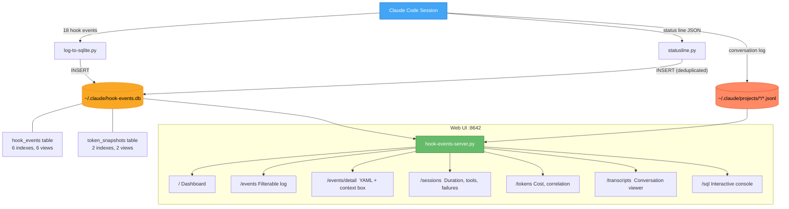
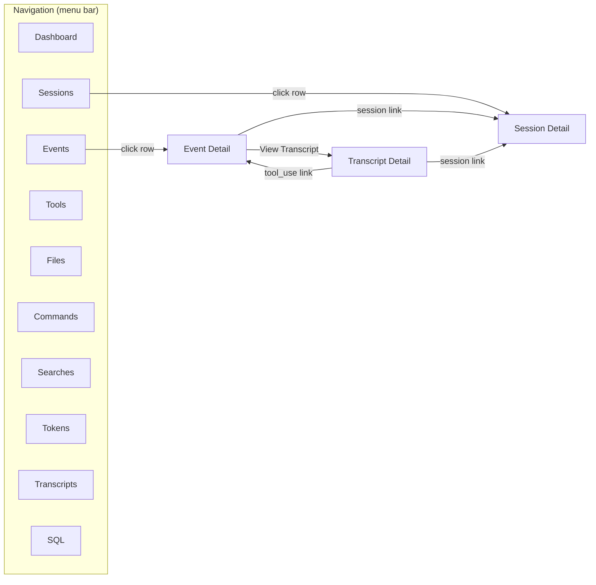

# Claude Code Hook Analytics

A full-stack observability system for Claude Code sessions. Three data collection layers — hook event logging, status line token tracking, and transcript parsing — feed into a shared SQLite database and a retro Macintosh-styled web UI. The system captures every tool invocation, tracks token consumption and cost in real time, cross-correlates events to transcripts via `tool_use_id`, and provides an interactive conversation viewer where you can drill from a high-level session summary down to the exact YAML parameters of a single Bash command, then jump to the same tool call in the full transcript with thinking blocks and tool results visible.

> [!summary]
> 1. Three data collection layers: hook events, token snapshots, and transcript files — all joined by `session_id`
> 2. A retro-Mac web UI with 12 pages including filterable event logs, token-tool correlation, and a full conversation viewer with expandable tool I/O panes
> 3. Complete CLI query interface via `sqlite3` + `json_extract()` and `jq` for transcripts

## Why this project exists

Claude Code generates a rich stream of telemetry data — hook events fire on every tool use, the status line receives token counts after each turn, and transcripts capture the full conversation — but there is no built-in way to query, correlate, or visualize this data. Without instrumentation you cannot answer basic questions:

- How much did this session cost and how many tokens did it consume?
- Which files do I touch most across sessions?
- What's my tool failure rate?
- How does context window usage grow over a session?
- What were the exact parameters and results of a specific tool call?
- Can I search across all my transcripts for prompts mentioning a topic?

This project answers all of them.

## Current project status

The system is complete and operational. It evolved during a single session from a basic SQLite logger to a full analytics platform.

What exists:

- **Hook event logger** (`log-to-sqlite.py`) — captures all 18 hook event types into `hook_events` table with 6 indexes and 6 analytical views
- **Status line** (`statusline.py`) — displays token/cost bar in terminal, logs snapshots to `token_snapshots` table with deduplication
- **Web UI** (`hook-events-server.py`) — 12-page retro Mac web server with:
  - Dashboard with stats cards and bar charts
  - Filterable event list with context window % cross-referenced from token snapshots
  - Event detail with YAML-highlighted tool I/O, clipboard copy, context window state box
  - Session and tool usage analytics
  - Token-tool correlation tables
  - Transcript browser across all `~/.claude/projects/`
  - Full conversation viewer with expandable user/assistant/system entries, thinking blocks, tool_use cross-linked to hook events, and collapsible results
  - Interactive SQL console
- **Full documentation** (`HOOK-ANALYTICS.md`) — comprehensive querying guide with `sqlite3`, `jq`, and Python recipes

What could be built next:

- Global installation across all projects
- Automated retention/pruning
- CLI query tool (`claude-stats sessions`, `claude-stats cost`)
- Grafana or similar dashboarding
- Cost alerting (warn when session exceeds threshold)

## Project shape

```
.claude/hooks/
  log-to-sqlite.py      — hook event collector (stdin JSON → SQLite)
  statusline.py          — token display + logger (stdin JSON → SQLite + stdout)
  hook-events-server.py  — web UI (SQLite + transcripts → HTTP)
  diary-reminder.sh      — debounced INSTRUCTIONS.md reminder
  HOOK-EVENTS-DB.md      — schema reference (original)
  HOOK-ANALYTICS.md      — full querying guide

.claude/settings.local.json  — hook + statusline registration

~/.claude/hook-events.db     — shared SQLite database (global)
~/.claude/projects/*/        — transcript .jsonl files (per-project)
```

## Architecture



The three data sources join on `session_id`. Hook events and transcripts also join on `tool_use_id` for per-tool-call cross-linking.

Key code locations:

- `/home/manuel/code/wesen/2026-03-17--smalltalk/.claude/hooks/log-to-sqlite.py`
- `/home/manuel/code/wesen/2026-03-17--smalltalk/.claude/hooks/statusline.py`
- `/home/manuel/code/wesen/2026-03-17--smalltalk/.claude/hooks/hook-events-server.py`
- `/home/manuel/code/wesen/2026-03-17--smalltalk/.claude/hooks/HOOK-ANALYTICS.md`

## Implementation details

### Three data collection layers

The system deliberately separates collection into three independent scripts rather than one monolithic logger. Each has a different trigger mechanism, receives different data, and can fail independently without affecting the others.

**Layer 1: Hook events** (`log-to-sqlite.py`). Registered on all 18 Claude Code hook event types via `settings.local.json`. Each invocation receives a JSON payload on stdin with common fields (`session_id`, `hook_event_name`, `cwd`, `permission_mode`, `transcript_path`) plus event-specific fields (`tool_name`, `tool_input`, `tool_response` for tool events; `stop_hook_active`, `last_assistant_message` for stop events). The script extracts structured columns and preserves the full JSON in `raw_json`. This is the highest-frequency data source — it fires for every `PreToolUse`, `PostToolUse`, `PermissionRequest`, etc.

**Layer 2: Token snapshots** (`statusline.py`). Triggered by the status line mechanism after each assistant message. Receives a different JSON payload containing `context_window` (token counts, cache stats, window size, usage percentage) and `cost` (cumulative USD, duration, lines changed). The script displays a colored terminal progress bar and inserts a row into `token_snapshots` — but only if `total_input_tokens` or `total_output_tokens` actually changed since the last snapshot for that session, avoiding redundant writes from permission mode changes or vim mode toggles that re-trigger the status line without new API calls.

**Layer 3: Transcripts** (`.jsonl` files). Written by Claude Code itself to `~/.claude/projects/<project-slug>/<session-id>.jsonl`. Each line is a JSON object with types: `user` (prompts), `assistant` (responses with `usage`, `content` blocks including `text`, `thinking`, `tool_use`), `system` (turn duration), `progress` (streaming), `file-history-snapshot`. These files are not ingested into SQLite — the web UI parses them on demand. The transcript filename (minus `.jsonl`) is the `session_id`, which is the join key to both database tables.

### The join keys

Two join keys connect the three data sources:

```
session_id
├── hook_events.session_id
├── token_snapshots.session_id
└── transcript filename (e.g. 744a92c4-cbf7-4a23-a1f5-25bf1d6413e2.jsonl)

tool_use_id
├── hook_events.tool_use_id
└── transcript assistant.message.content[].id (where type == "tool_use")
```

The `session_id` join lets you correlate "what tools were used" with "how many tokens that cost" and "what the user actually asked for." The `tool_use_id` join lets you go from a hook event to the exact tool call in the transcript, seeing the full conversation context around it.

### Cross-correlating hook events with token snapshots

Hook events and token snapshots fire at slightly different times — the status line updates after the assistant message completes, while tool hooks fire during execution. This means a token snapshot's timestamp is typically 10-100ms after the corresponding hook events in the same turn. The web UI handles this with a `COALESCE` pattern that tries the nearest snapshot before the event, falling back to the nearest after:

```sql
COALESCE(
  (SELECT ts.used_percentage FROM token_snapshots ts
   WHERE ts.session_id = he.session_id AND ts.timestamp <= he.timestamp
   ORDER BY ts.id DESC LIMIT 1),
  (SELECT ts.used_percentage FROM token_snapshots ts
   WHERE ts.session_id = he.session_id AND ts.timestamp > he.timestamp
   ORDER BY ts.id ASC LIMIT 1)
) AS ctx_pct
```

This pattern is used in the events list (Context column), event detail (context window box), and the Tokens page (context-at-tool-use table). SQLite's correlated subqueries can reference outer table columns in `WHERE` but not in `ORDER BY`, which is why the before/after split is necessary instead of a simpler `ORDER BY ABS(...)` approach.

### The web UI

The server is a single-file Python HTTP server (~2200 lines) using only standard library modules — no Flask, no npm, no build step. It renders HTML server-side with a CSS theme modeled after the 1984 Macintosh: Chicago font loaded from CDN, 1-bit window chrome with striped title bars, outset/inset button borders, dithered desktop background via `repeating-conic-gradient`, and custom scrollbar styling.



Key UI features:

- **YAML syntax highlighting** for tool input/response in event detail — keys bold, strings gray, numbers bold-italic, booleans underline-dotted, null italic-dim. Each code block has a clipboard copy button.
- **Context window box** on event detail — shows input/output tokens, cost, cache stats, and a visual progress bar at the time of that event, cross-referenced from the nearest token snapshot.
- **Conversation viewer** on transcript detail — renders the full session as an expandable chat timeline. User messages are collapsible with a preview. Assistant messages show per-turn token usage, text blocks, collapsible thinking blocks, and tool_use blocks with YAML-highlighted input, collapsible results, and cross-links to hook event detail pages.
- **Token-tool correlation** on the Tokens page — for each session, shows total tokens, tool use count, tokens per tool call, cost per tool call. A separate table shows average context window size at the time each tool type was used.

### Transcript conversation viewer in detail

The transcript detail page parses the full `.jsonl` file and renders a conversation timeline. The implementation pre-builds two indexes:

1. **Hook events by `tool_use_id`** — fetched from SQLite at page load, keyed by `tool_use_id`. When a transcript `tool_use` block is rendered, the corresponding hook events are looked up and rendered as clickable links (`Pre #123 | Post #124`).

2. **Tool results by `tool_use_id`** — extracted from `user` entries in the transcript where `message.content` is a list containing `tool_result` objects. These are keyed by `tool_use_id` and displayed as collapsible "Result (N chars)" sections under each tool_use block.

Each assistant turn shows a cumulative token counter, so you can see how the session's total token consumption grows across turns. Thinking blocks are rendered as collapsible italic-gray sections with character counts.

### Database safety design

Both writer scripts (`log-to-sqlite.py` and `statusline.py`) follow the same safety contract:

- **WAL mode** (`PRAGMA journal_mode=WAL`) — concurrent readers never block writers
- **Busy timeout** (`PRAGMA busy_timeout=3000` / `2000`) — wait for locks instead of failing immediately
- **Schema creation on every run** (`CREATE TABLE IF NOT EXISTS`, `CREATE VIEW IF NOT EXISTS`) — handles first-run and schema additions without migrations
- **All errors caught and swallowed** — `try/except sqlite3.Error: pass` wraps every database operation. Losing a log row is always acceptable; hanging a Claude session is never acceptable.
- **Parameterized queries** — all values inserted via `?` placeholders, preventing SQL injection from arbitrary tool inputs (file paths with quotes, code snippets, etc.)

## Important project docs

- `/home/manuel/code/wesen/2026-03-17--smalltalk/.claude/hooks/HOOK-ANALYTICS.md` — comprehensive querying guide with SQLite, jq, and Python recipes, cross-correlation patterns, and 10 copy-paste recipes
- `/home/manuel/code/wesen/2026-03-17--smalltalk/.claude/hooks/HOOK-EVENTS-DB.md` — original schema reference with design decisions and maintenance commands
- `/home/manuel/code/wesen/2026-03-17--smalltalk/.claude/hooks/log-to-sqlite.py` — hook event collector (~200 lines)
- `/home/manuel/code/wesen/2026-03-17--smalltalk/.claude/hooks/statusline.py` — token display + logger (~200 lines)
- `/home/manuel/code/wesen/2026-03-17--smalltalk/.claude/hooks/hook-events-server.py` — web UI server (~2200 lines)
- [[PROJ - Claude Code Hook Events Logger - SQLite Analytics for Claude Sessions]] — earlier project note covering the initial hook logger before the web UI and transcript features were added

## Open questions

- Should this be packaged as a Claude Code plugin for one-command installation across all projects?
- What retention policy makes sense — keep everything forever, or auto-prune after N days?
- Would a `claude-stats` CLI tool be worth building for quick terminal queries?
- Should transcript data be ingested into SQLite (e.g. a `transcript_turns` table) for cross-table SQL joins, or is on-demand parsing fast enough?
- Could the web UI serve as a live dashboard during sessions (auto-refresh, WebSocket push)?
- Is the cost-per-tool-call metric meaningful, or is per-turn the better unit?

## Near-term next steps

- Install the hook + statusline config globally in `~/.claude/settings.json` so all projects benefit
- Let the database accumulate real data across multiple sessions and projects, then analyze patterns
- Add a token-per-turn chart (sparkline or bar) to the transcript detail page
- Consider adding search across all transcripts for prompt content
- Explore exporting data to Grafana or similar for time-series dashboarding

## Project working rule

> [!important]
> The hook must never interfere with Claude Code's operation. Silent failure is always correct. If in doubt, swallow the error and lose the row — never hang the session. The web UI is read-only and serves on localhost only.

## KB reviews

- [[KB-BATCH10-minitrace-transcript-analysis]] (2026-05-11) — Batch F analysis; contributed to [[Tribal/transcript-analysis-with-go-minitrace]] and hook telemetry candidates.

## Related KB entries

- [[Tribal/transcript-analysis-with-go-minitrace]] — transcript evidence workflow, hook/token/transcript joins, and reportable analysis.

**Tribal candidates** (not yet written / covered by broader entry):
- Join by `session_id` and `tool_use_id` (1/3) — correlation keys across hook events, token snapshots, and transcript tool calls.
- Silent telemetry hook failure (2/3) — telemetry must never hang Claude Code.
- Raw JSON plus structured columns (3/3, candidate) — indexed common fields plus raw payload escape hatch.
