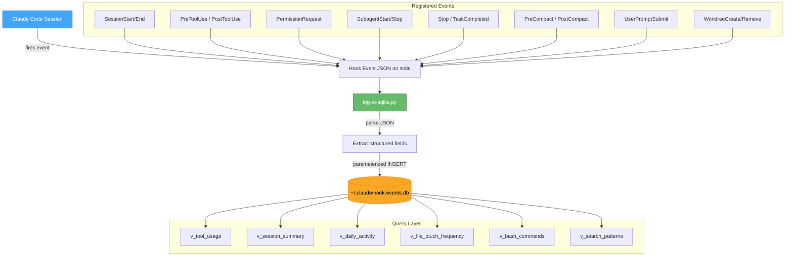

# Claude Code Hook Events Logger

A SQLite-based telemetry layer for Claude Code sessions. A single Python script is registered as a command hook on all 18 Claude Code hook events. Every time Claude reads a file, runs a command, spawns a subagent, compacts context, or stops generating, the hook captures the full event payload and writes a structured row to a shared SQLite database. The result is a queryable log of everything Claude does across sessions and projects.

> [!summary]
> 1. Full-fidelity event capture for every Claude Code hook event type
> 2. Structured columns for fast indexed queries, plus raw JSON for ad-hoc extraction
> 3. Pre-built SQL views for tool usage, session summaries, file touch frequency, and failure analysis

## Why this project exists

Claude Code's hook system fires events at every meaningful point in a session — tool invocations, permission checks, context compaction, session lifecycle — but there is no built-in way to accumulate this data for later analysis. If you want to answer questions like "which files do I touch most across sessions?", "what's my tool failure rate?", "how long do my sessions last?", or "what shell commands do I run most often?", you need to capture the raw event stream first.

This project solves the capture problem: get every event into a durable, queryable store with zero friction, so that analysis tools can be built on top without worrying about data collection.

## Current project status

The logger is complete and operational. It was built as part of the Smalltalk-80 VM project (`ST80-001`) but is designed to be reusable across any Claude Code project.

What already exists:

- a Python hook script that handles all event types
- registration on all 18 hook events via `settings.local.json`
- a SQLite schema with structured columns, 6 indexes, and 6 analytical views
- WAL mode and silent error handling for production safety
- full reference documentation in `.claude/hooks/HOOK-EVENTS-DB.md`

What is still potential future work:

- a CLI or dashboard for querying stats interactively
- global installation (currently project-local config, global DB)
- retention policies or automatic pruning
- cross-project comparative analysis tooling

## Project shape

The project is small — two files and a configuration block:

1. **Hook script** (`log-to-sqlite.py`) — the data collection layer
2. **Hook registration** (`settings.local.json`) — wires the script to all events
3. **SQLite database** (`~/.claude/hook-events.db`) — the durable store

The design philosophy is capture everything, extract what's common, and preserve the rest as raw JSON so nothing is ever lost.

## Architecture



Key code locations:

- `/home/manuel/code/wesen/2026-03-17--smalltalk/.claude/hooks/log-to-sqlite.py`
- `/home/manuel/code/wesen/2026-03-17--smalltalk/.claude/settings.local.json`
- `/home/manuel/code/wesen/2026-03-17--smalltalk/.claude/hooks/HOOK-EVENTS-DB.md`

Database location:

- `~/.claude/hook-events.db` (configurable via `CLAUDE_HOOK_EVENTS_DB` env var)

## Implementation details

### The single-table schema

All 18 event types share a single `hook_events` table. This is deliberate: every event carries a common set of context fields (`session_id`, `hook_event_name`, `cwd`, `permission_mode`, `transcript_path`), and tool-specific events add `tool_name`, `tool_input`, `tool_response`, and `tool_use_id`. Stop events add `stop_hook_active` and `last_assistant_message`. Non-applicable columns are simply NULL — SQLite stores NULLs efficiently, and the single-table design means every query is a simple `SELECT ... WHERE` with no JOINs.

```sql
CREATE TABLE hook_events (
    id              INTEGER PRIMARY KEY AUTOINCREMENT,
    timestamp       TEXT NOT NULL,       -- ISO 8601 UTC
    session_id      TEXT,                -- groups events to a session
    hook_event_name TEXT NOT NULL,       -- the event type
    cwd             TEXT,                -- working directory
    permission_mode TEXT,                -- default|plan|acceptEdits|...
    transcript_path TEXT,                -- path to session transcript
    agent_id        TEXT,                -- set inside subagents
    agent_type      TEXT,                -- set inside subagents
    tool_name       TEXT,                -- Bash, Read, Edit, Grep, ...
    tool_use_id     TEXT,                -- unique tool invocation ID
    tool_input      TEXT,                -- JSON: the tool's parameters
    tool_response   TEXT,                -- JSON: the tool's output
    stop_hook_active    INTEGER,         -- 0/1 boolean
    last_assistant_message TEXT,         -- Claude's last response
    raw_json        TEXT NOT NULL        -- full original payload
);
```

The `raw_json` column is the escape hatch. If Claude Code adds new event fields tomorrow, they're already captured. SQLite's `json_extract()` function can pull any nested value out of that column without a schema migration:

```sql
-- Example: extract a field that doesn't have its own column
SELECT json_extract(raw_json, '$.some_new_field') FROM hook_events;
```

### The hook script pipeline

The Python script follows a strict pipeline: read stdin, parse JSON, connect to SQLite, create schema if needed, insert one row, commit, close. The entire flow is wrapped in try/except blocks that swallow errors silently — the hook must never block Claude, and losing a log row is always preferable to hanging a session.

```python
# Simplified pipeline pseudocode
raw = stdin.read()
data = json.loads(raw)
conn = sqlite3.connect(DB_PATH)
conn.execute("PRAGMA journal_mode=WAL")     # concurrent read safety
conn.execute("PRAGMA busy_timeout=3000")     # wait up to 3s if locked
init_schema_if_needed(conn)
conn.execute("INSERT INTO hook_events (...) VALUES (?, ?, ...)", extracted_fields)
conn.commit()
conn.close()
```

Python was chosen over shell scripting for two reasons: parameterized queries prevent SQL injection from tool inputs that may contain arbitrary strings (file paths with quotes, user code snippets, etc.), and `json.loads()` is more reliable than piping through `jq` for structured extraction.

### JSON columns and ad-hoc queries

The `tool_input` and `tool_response` columns store JSON text. This means every tool's specific parameters are preserved in full. SQLite's JSON1 extension (available by default in modern SQLite) lets you reach into these columns as if they were structured:

```sql
-- What Bash commands were run?
SELECT json_extract(tool_input, '$.command') FROM hook_events WHERE tool_name = 'Bash';

-- What files were edited, and how large were the edits?
SELECT
    json_extract(tool_input, '$.file_path') AS file,
    length(json_extract(tool_input, '$.new_string')) AS edit_size
FROM hook_events WHERE tool_name = 'Edit';

-- What subagent types were spawned?
SELECT json_extract(tool_input, '$.subagent_type') FROM hook_events WHERE tool_name = 'Agent';
```

### Pre-built analytical views

Six views ship with the schema so common questions are one-liners:

| View | Question it answers |
|------|-------------------|
| `v_tool_usage` | Which tools are used most, across how many sessions? |
| `v_session_summary` | How long was each session, how many tools, how many failures? |
| `v_daily_activity` | What does my Claude usage look like by day? |
| `v_file_touch_frequency` | Which files are read/edited/written most often? |
| `v_bash_commands` | Full chronological log of every shell command |
| `v_search_patterns` | What Grep/Glob patterns are used most frequently? |

The `v_session_summary` view is particularly useful — it computes session duration from the timestamp spread, counts tool uses and failures, and concatenates the distinct tool names used:

```sql
SELECT
    session_id,
    MIN(timestamp) AS started, MAX(timestamp) AS ended,
    ROUND((julianday(MAX(timestamp)) - julianday(MIN(timestamp))) * 86400) AS duration_secs,
    COUNT(CASE WHEN hook_event_name = 'PostToolUse' THEN 1 END) AS tool_uses,
    COUNT(CASE WHEN hook_event_name = 'PostToolUseFailure' THEN 1 END) AS tool_failures,
    GROUP_CONCAT(DISTINCT tool_name) AS tools_used
FROM hook_events GROUP BY session_id;
```

### Safety and performance tradeoffs

The script uses WAL (Write-Ahead Logging) mode, which means concurrent readers never block the writer and vice versa. This matters because multiple Claude sessions could theoretically write to the same database simultaneously.

The 3-second `busy_timeout` is a safety net for rare lock contention. If another process holds the database lock for more than 3 seconds, the insert silently fails rather than blocking Claude.

Every SQLite error is caught and swallowed. The contract is: the hook must be invisible to the user. If the database file is missing, locked, corrupted, or on a full disk, the session continues as if the hook didn't exist.

### Hook registration pattern

The `settings.local.json` registers the same command on all 18 event types. Each entry follows the same shape:

```json
{
  "matcher": "",
  "hooks": [{
    "type": "command",
    "command": "python3 ./.claude/hooks/log-to-sqlite.py",
    "timeout": 5
  }]
}
```

The empty `matcher` string matches all tool names. For events that don't support matchers (like `SessionStart` or `Stop`), the matcher is ignored. The 5-second timeout is generous — the script typically completes in under 100ms (Python startup ~30ms, SQLite insert ~1ms).

## Important project docs

- `/home/manuel/code/wesen/2026-03-17--smalltalk/.claude/hooks/HOOK-EVENTS-DB.md` — full reference documentation with schema, views, example queries, design decisions, and maintenance commands
- `/home/manuel/code/wesen/2026-03-17--smalltalk/.claude/hooks/log-to-sqlite.py` — the hook script itself (well-commented, ~200 lines)

## Open questions

- Should this be packaged as a Claude Code plugin rather than a per-project hook registration?
- What retention policy makes sense — keep everything forever, or auto-prune after N days?
- Would a lightweight TUI dashboard (e.g. using `sqlite3` + `column` output, or a Python curses app) be worth building for quick stats?
- Should the schema evolve to include per-tool extracted columns (e.g. `bash_command`, `file_path`) for faster queries without `json_extract()`?
- How should cross-project analysis work when the hook config is project-local but the DB is global?

## Near-term next steps

- Install the hook globally in `~/.claude/settings.json` so all projects benefit from event capture
- Build a small query script or alias set for common stats (e.g. `claude-stats sessions`, `claude-stats tools`)
- Let the database accumulate real data across multiple sessions, then analyze usage patterns
- Consider adding a `UserPromptSubmit` text extraction column for prompt analysis

## Project working rule

> [!important]
> The hook must never interfere with Claude Code's operation. Silent failure is always correct. If in doubt, swallow the error and lose the row — never hang the session.
