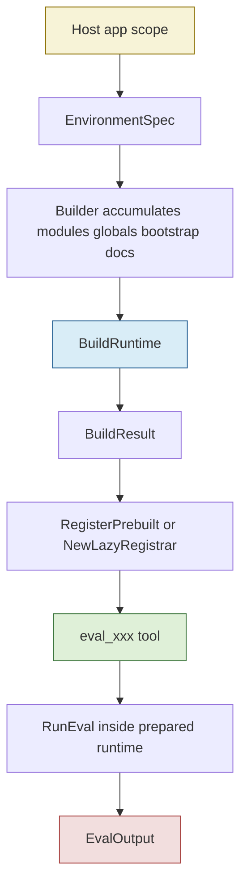
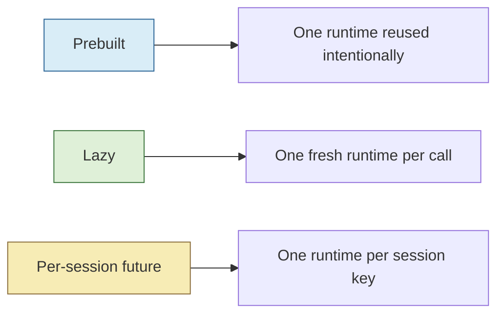

# Scopedjs Runtime Final State

This note is the final-state companion to the earlier historical snapshot at `Projects/2026/03/16/PROJ - Scopedjs Runtime and Demo - Geppetto and Pinocchio.md`. The older note is still useful as a mid-flight picture. This one is the consolidated project description after the Geppetto `scopedjs` feature, its bug fixes, and its first cleanup passes landed on the branch.

The center of gravity is `geppetto/pkg/inference/tools/scopedjs`. Pinocchio still matters because it provides the teaching/demo surface, but the stable abstraction lives in Geppetto and the most important diff to understand is the Geppetto diff from `origin/main`.

> [!summary]
> The final scopedjs slice in Geppetto now has four clear outcomes:
> 1. a reusable `pkg/inference/tools/scopedjs` package with tests and runnable examples
> 2. a developer tutorial that explains how host apps should adopt it
> 3. cleanup fixes that made the API and tool descriptions more honest
> 4. a remaining future ticket for true `per_session` runtime reuse, while the current shared-runtime path is now explicitly serialized

## Why this project exists

Some model-facing behaviors are too awkward when broken into many tiny tools. If a model needs to read files, query a scoped data facade, create a note, and stand up a fake route in one reasoning step, the orchestration burden shifts onto the model and the host application. That usually produces worse prompts, brittle tool chains, and duplicated application-specific glue.

`scopedjs` exists to make that composition boundary explicit. A host application prepares one bounded JavaScript environment for one scope and Geppetto exposes that environment as one LLM-facing tool such as `eval_dbserver` or `eval_project_ops`. The model then writes a small bounded script against that prepared environment instead of juggling several half-related tools.

This is the same product move that `scopeddb` made for bounded SQLite access, but applied to JavaScript runtime composition.

## Current project status

The Geppetto side of the feature is implemented and in a good first stable shape.

What exists now in Geppetto:

- `pkg/inference/tools/scopedjs`
  - reusable package API, runtime builder, eval engine, description builder, and tool registrars
- `cmd/examples/scopedjs-tool`
  - minimal example of a prepared runtime exposed as one tool
- `cmd/examples/scopedjs-dbserver`
  - composed example with several capabilities in one environment
- `pkg/doc/tutorials/07-build-scopedjs-eval-tools.md`
  - intern-facing adoption guide
- follow-up cleanup and future-planning tickets:
  - `GP-35` fixed JavaScript `Error` rejection formatting
  - `GP-36` documented and executed the first cleanup pass
  - `GP-37` tracks future `per_session` runtime support
  - `GP-38` landed the serialized shared-runtime executor cleanup

What is done versus still future:

- done:
  - core package
  - examples
  - tutorial
  - honest lifecycle description cleanup
  - lazy/prebuilt capability description parity
  - tri-state eval option overrides
  - shared-runtime serialized execution wrapper
  - JavaScript `Error` rejection preservation
- future:
  - a true `per_session` runtime strategy in Geppetto
  - any reusable fake-module support layer if a second non-demo adopter appears

So the feature is no longer “implemented but rough.” The primary rough edges identified in the first review have either been fixed or deliberately moved into explicit future tickets.

## Geppetto diff since `origin/main`

The most useful single fact about the Geppetto-side feature is that it is a self-contained addition, not a sprawling rewrite.

The scopedjs-related Geppetto diff since `origin/main` currently covers these files:

- `cmd/examples/scopedjs-dbserver/main.go`
- `cmd/examples/scopedjs-tool/main.go`
- `pkg/doc/tutorials/07-build-scopedjs-eval-tools.md`
- `pkg/inference/tools/scopedjs/builder.go`
- `pkg/inference/tools/scopedjs/description.go`
- `pkg/inference/tools/scopedjs/description_test.go`
- `pkg/inference/tools/scopedjs/eval.go`
- `pkg/inference/tools/scopedjs/executor.go`
- `pkg/inference/tools/scopedjs/helpers.go`
- `pkg/inference/tools/scopedjs/runtime.go`
- `pkg/inference/tools/scopedjs/runtime_test.go`
- `pkg/inference/tools/scopedjs/schema.go`
- `pkg/inference/tools/scopedjs/schema_test.go`
- `pkg/inference/tools/scopedjs/tool.go`
- `pkg/inference/tools/scopedjs/tool_test.go`

High-level diff size for that feature slice:

- 15 files
- about 3032 added lines
- no broad invasive edits to unrelated Geppetto subsystems

The commit arc that matters most is:

- `6221675` `feat(scopedjs): add core api and description layer`
- `e4253c5` `feat(scopedjs): add runtime build and eval execution`
- `cf45f92` `feat(scopedjs): register prebuilt and lazy eval tools`
- `9d63530` `feat(scopedjs): add runnable examples and adoption docs`
- `014f095` `:books: Add documentation`
- `77df909` `refactor(scopedjs): clarify lazy descriptions and option overrides`
- `6f620b2` `refactor(scopedjs): add serialized runtime executor`
- `fa88cb2` `docs(GP-38): record serialized runtime cleanup slice`

The important thing about that sequence is that the feature grew in layers: API, runtime, registration, examples, docs, then cleanup. That makes the codebase easier to read because the package still has a clear internal separation of concerns.

## Project shape

There are three durable layers now.

### 1. Reusable Geppetto package

This is the real product:

- `geppetto/pkg/inference/tools/scopedjs/schema.go`
- `geppetto/pkg/inference/tools/scopedjs/builder.go`
- `geppetto/pkg/inference/tools/scopedjs/runtime.go`
- `geppetto/pkg/inference/tools/scopedjs/eval.go`
- `geppetto/pkg/inference/tools/scopedjs/description.go`
- `geppetto/pkg/inference/tools/scopedjs/tool.go`
- `geppetto/pkg/inference/tools/scopedjs/executor.go`

What those files mean now:

- `schema.go`
  - public API surface such as `EnvironmentSpec`, `BuildResult`, `EvalInput`, `EvalOutput`, and option types
- `builder.go`
  - mutable build plan for modules, globals, bootstrap files, and helper docs
- `runtime.go`
  - live runtime construction and bootstrap loading
- `eval.go`
  - JavaScript execution, promise waiting, console capture, error/result export
- `description.go`
  - model-facing tool description generation from manifest docs
- `tool.go`
  - `RegisterPrebuilt(...)` and `NewLazyRegistrar(...)`
- `executor.go`
  - explicit runtime wrapper for safe reused-runtime evaluation

### 2. Geppetto examples and tutorial

These are the adoption surfaces:

- `geppetto/cmd/examples/scopedjs-tool`
- `geppetto/cmd/examples/scopedjs-dbserver`
- `geppetto/pkg/doc/tutorials/07-build-scopedjs-eval-tools.md`

This matters because `scopedjs` is only useful if app authors can understand how to wrap their own capabilities into one environment.

### 3. Pinocchio downstream demo

Pinocchio remains the demonstration and teaching layer:

- `pinocchio/cmd/examples/scopedjs-tui-demo`
- related Pinocchio internal demo helpers shared with the scopeddb TUI demo

That code is still worth understanding, but it is not the stable abstraction. It is the best live visualization of the stable abstraction.

## Architecture

The shortest honest architecture summary is:



The main product idea is not “run arbitrary JavaScript.” It is “prepare one coherent runtime and expose it as one well-described tool.”

## Implementation details

The package works because it keeps environment declaration, runtime construction, and runtime ownership separate.

### Environment declaration

A host app creates an `EnvironmentSpec[Scope, Meta]`. That spec answers four questions:

- what is this tool called?
- what are its default eval options?
- how can its capabilities be described before runtime construction?
- how do we actually populate one runtime for one scope?

The core host-side mental model is:

```go
spec := scopedjs.EnvironmentSpec[Scope, Meta]{
    RuntimeLabel: "dbserver",
    Tool: scopedjs.ToolDefinitionSpec{...},
    DefaultEval: scopedjs.DefaultEvalOptions(),
    Describe: func() (scopedjs.EnvironmentManifest, error) { ... },
    Configure: func(ctx context.Context, b *scopedjs.Builder, scope Scope) (Meta, error) {
        b.AddNativeModule(...)
        b.AddGlobal(...)
        b.AddBootstrapSource(...)
        b.AddHelper(...)
        return meta, nil
    },
}
```

That split between `Describe` and `Configure` is one of the important cleanup outcomes. Earlier review work found that lazy tools were weaker because the description path did not know enough about runtime capabilities before a runtime existed. The current shape fixes that by giving lazy registration a static manifest path.

### Runtime construction

`BuildRuntime(...)` translates the builder output into a live goja runtime and a manifest. The important output is not only the raw runtime object. It is the owned runtime bundle.

Current conceptual shape:

```go
handle, err := BuildRuntime(ctx, spec, scope)
// handle.Runtime   -> raw runtime
// handle.Executor  -> serialized reused-runtime execution wrapper
// handle.Manifest  -> capability docs
// handle.Meta      -> app-owned metadata
// handle.Cleanup   -> close runtime
```

This is a good design because the package now distinguishes three things that were easy to blur together before:

- the runtime as a low-level VM object
- the executor as the safe reused-runtime eval surface
- the manifest as the model-facing capability description

### Eval pipeline

The package-level `RunEval(...)` still does the actual eval work. The important phases are:

```text
normalize options
-> inject input
-> optionally replace console
-> wrap code in async function
-> execute
-> if promise pending, poll until settled
-> export result or error
-> cleanup temporary globals and console
```

That design is why the `GP-38` cleanup mattered. One eval call is not one atomic owner call. It is several phases. On a reused runtime, those phases must not interleave across callers.

### Serialized reused-runtime execution

The final cleanup shape from `GP-38` is the most important current detail for an intern to understand.

A shared runtime now has an explicit executor wrapper:

```go
type RuntimeExecutor struct {
    Runtime *gojengine.Runtime
    mu      sync.Mutex
}

func (r *RuntimeExecutor) RunEval(ctx context.Context, in EvalInput, opts EvalOptions) (EvalOutput, error) {
    r.mu.Lock()
    defer r.mu.Unlock()
    return RunEval(ctx, r.Runtime, in, opts)
}
```

That wrapper fixes the concurrency bug class where one reused runtime could otherwise interleave:

```text
call A prepare
call A execute -> pending promise
call B prepare
call B execute
call B cleanup
call A cleanup
```

With the executor wrapper, reused-runtime eval is serialized around the whole eval lifecycle instead of only around one internal owner call.

### Lifecycle strategies

The package now has two honest current runtime strategies and one planned future one.



Current truth:

- prebuilt is implemented and safe for shared-runtime eval because of `RuntimeExecutor`
- lazy is implemented and uses fresh runtime construction per call
- per-session is not implemented yet and lives in `GP-37`

This is a much better state than the earlier `StateMode` story, because the API no longer promises lifecycle flexibility that the package does not actually implement.

### What the tests now prove

The scopedjs test suite is valuable because it encodes the feature contract, not just line coverage.

The important test groups are:

- schema tests
  - API shapes and option semantics
- runtime tests
  - globals, bootstrap, console capture, promises, timeout behavior, JS `Error` formatting
- tool tests
  - prebuilt vs lazy registration semantics
  - manifest-driven description behavior
  - concurrent prebuilt serialization on one shared runtime

That last test is especially important because it proves the current shared-runtime ownership story with executable behavior instead of only comments.

## What changed after the earlier historical note

The March 16 note was an accurate mid-flight snapshot, but several things that were open there are now resolved.

Resolved since that snapshot:

- JavaScript `Error` promise rejection messages were fixed in `GP-35`
- lazy tools gained a static manifest description path
- eval option overrides moved to a real tri-state override model
- the misleading lifecycle prose around `StateMode` was cleaned up
- the shared prebuilt runtime path now evaluates through a serialized executor wrapper
- the Geppetto playbook was merged into the main tutorial at `pkg/doc/tutorials/07-build-scopedjs-eval-tools.md`

Still future:

- true `per_session` runtime pooling and lifecycle support in `GP-37`
- any extraction of reusable fake modules if a second non-demo adopter appears

## Important project docs

The most important repo-local docs now are:

- `/home/manuel/workspaces/2026-03-15/add-scoped-js/geppetto/ttmp/2026/03/15/GP-34--create-reusable-scoped-javascript-tool-runtime-for-llm-eval/design-doc/01-scoped-javascript-eval-tools-architecture-design-and-implementation-guide.md`
- `/home/manuel/workspaces/2026-03-15/add-scoped-js/geppetto/ttmp/2026/03/16/GP-35--preserve-javascript-error-messages-in-scopedjs-promise-rejections/index.md`
- `/home/manuel/workspaces/2026-03-15/add-scoped-js/geppetto/ttmp/2026/03/16/GP-36--review-and-cleanup-scopedjs-and-scopedjs-demo-work-since-origin-main/design-doc/01-scopedjs-and-demo-review-cleanup-analysis-design-and-implementation-guide.md`
- `/home/manuel/workspaces/2026-03-15/add-scoped-js/geppetto/ttmp/2026/03/17/GP-37--add-per-session-runtime-lifecycle-support-to-scopedjs/design-doc/01-per-session-scopedjs-runtime-lifecycle-analysis-design-and-intern-implementation-guide.md`
- `/home/manuel/workspaces/2026-03-15/add-scoped-js/geppetto/ttmp/2026/03/17/GP-38--refactor-scopedjs-shared-runtime-execution-around-a-serialized-runtime-wrapper/design-doc/01-serialized-shared-runtime-executor-cleanup-plan.md`
- `/home/manuel/workspaces/2026-03-15/add-scoped-js/geppetto/pkg/doc/tutorials/07-build-scopedjs-eval-tools.md`
- `/home/manuel/workspaces/2026-03-15/add-scoped-js/pinocchio/cmd/examples/scopedjs-tui-demo/README.md`

## Open questions

- What should the public API for true `per_session` runtime reuse look like in Geppetto?
- Should missing session ID default to hard error or explicit per-call fallback once `per_session` exists?
- At what point does it become worth extracting reusable fake modules for examples and tests?
- Does the Pinocchio demo need any further cleanup beyond what was already extracted into shared internal helpers?

## Near-term next steps

- implement `GP-37` if session-scoped runtime reuse becomes important soon
- keep examples and tutorial aligned with the actual package API as it evolves
- avoid reintroducing hidden lifecycle semantics into per-call eval options
- treat the current executor wrapper as the base ownership primitive for any future reused-runtime mode

## Project mental model in one sentence

> `scopedjs` gives Geppetto a reusable way to package one prepared JavaScript runtime as one well-described tool, and the first cleanup wave made that runtime contract honest enough that future lifecycle work can build on it instead of rewriting it.

## Project working rule

> [!important]
> Preserve the separation between environment declaration, runtime construction, and runtime ownership.
> When a runtime is reused, make that reuse explicit in the API and protected in the implementation.
