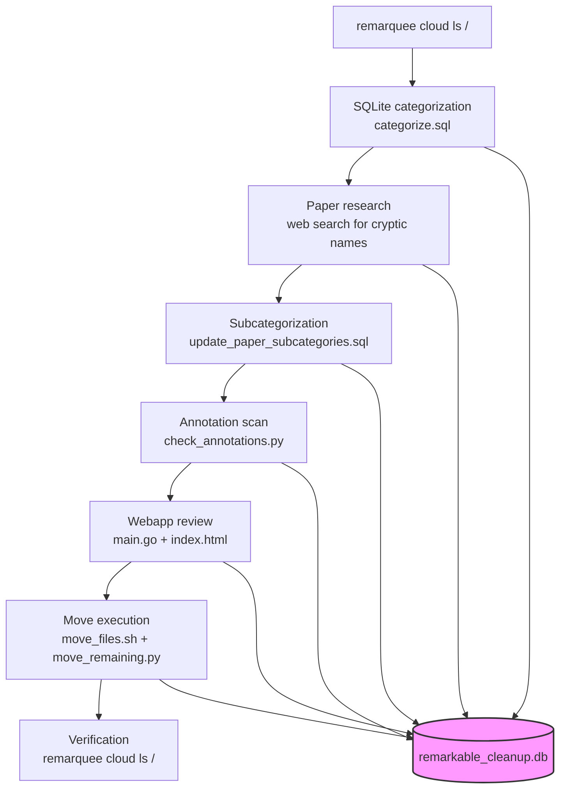
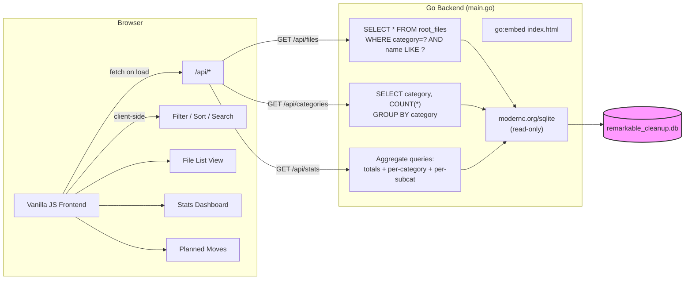
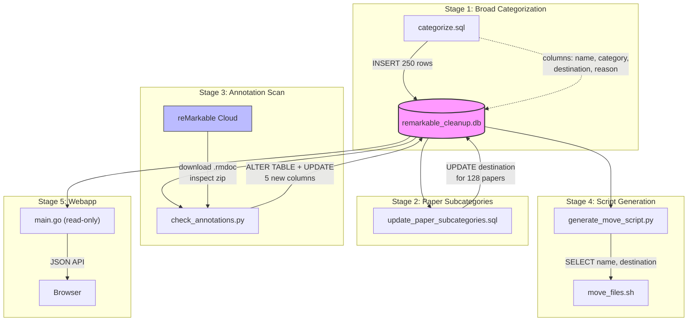
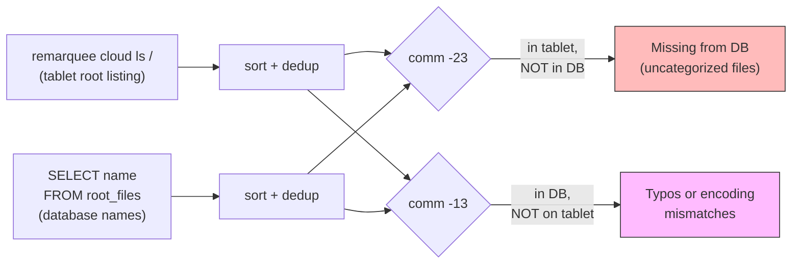
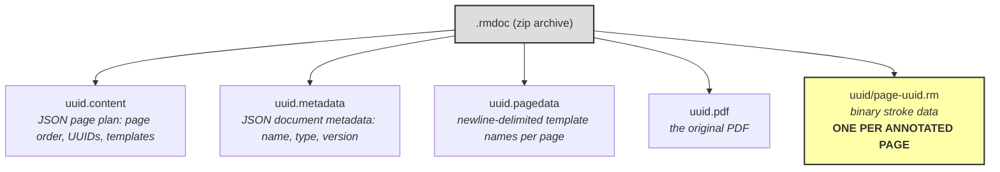
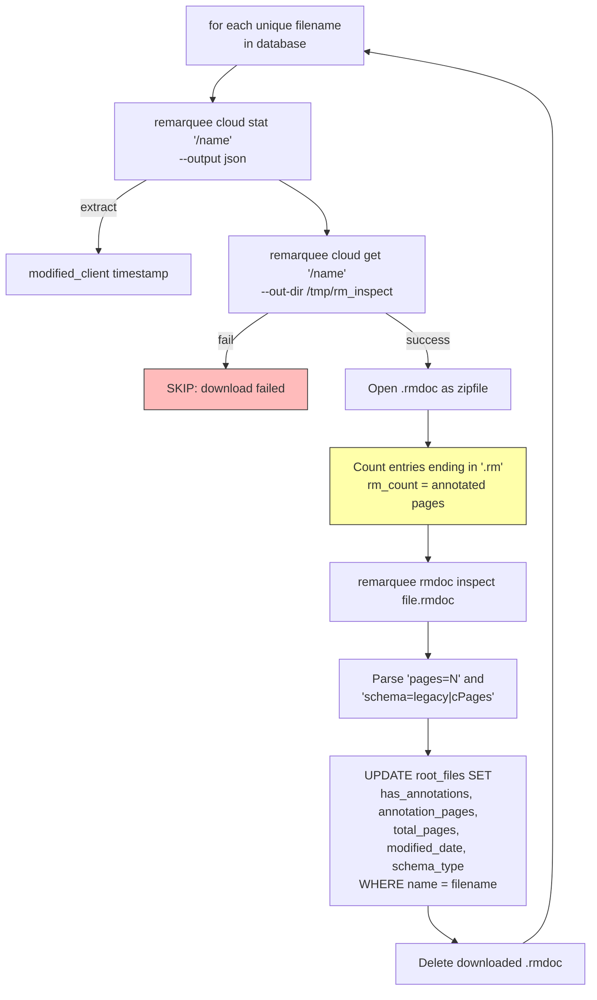
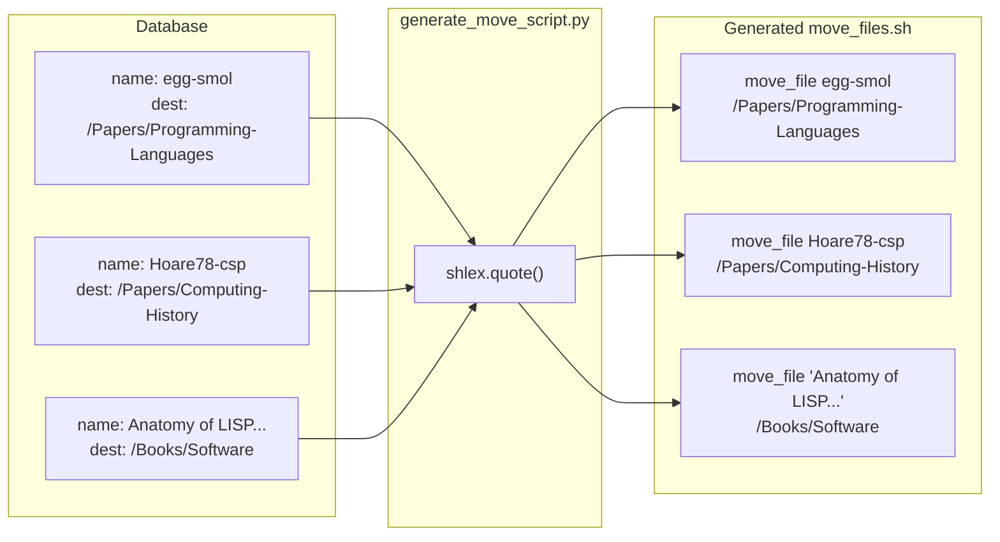
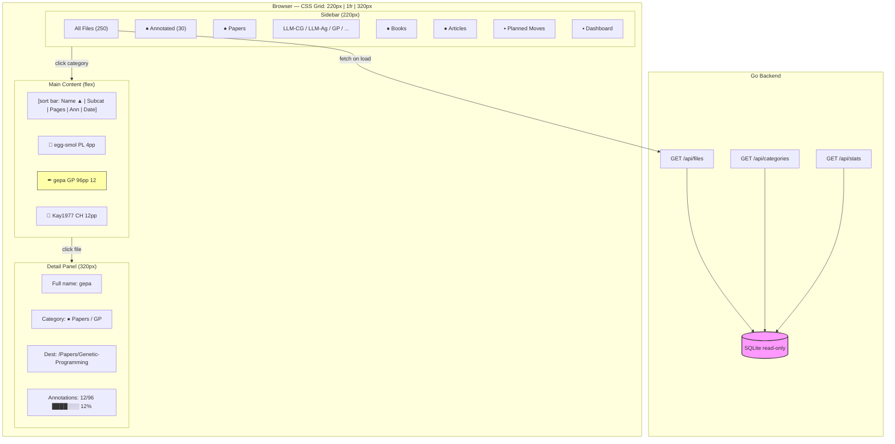

# reMarkable Cleanup

This project is a one-session bulk reorganization of the reMarkable tablet's cloud storage, where 250 unsorted files had accumulated at the root directory. The work combined automated categorization, academic paper identification, annotation analysis, and a custom webapp for review — all coordinated through a SQLite database and executed via the `remarquee` CLI.

> [!summary]
> The project has three layers that built on each other over a single evening:
> 1. a SQLite-backed categorization pipeline that classified 250 files into 8 categories and 30 destination folders, including 15 new topic-based paper subcategories
> 2. an annotation scanner that downloaded every file and inspected the `.rmdoc` zip archives for handwritten stroke data, revealing that only 30 of 245 files had ever been read
> 3. a Go + vanilla JS webapp with a retro Mac System 1 aesthetic for browsing the categorization, reviewing planned moves, and exploring annotation statistics

## Why this project exists

The reMarkable tablet accumulates documents at the root directory by default. Every PDF uploaded via the web, email, or third-party tools lands at `/` unless manually filed. Over months of use, 250 files had piled up — arxiv papers with bare numeric IDs, z-library book downloads with 200-character filenames, blog posts clipped from the web, own manuscript drafts, French retro computing guides, and files with names like `5D8798F0-C64C-11F0-87C0-A9ADE637C2C9`.

The tablet already had 18 well-organized subdirectories (`Books/Software`, `Papers/2026/01`, `Articles/`, `Writing/Drafts/`, etc.), but nothing was routing new uploads into them. This project exists because the manual effort of filing 250 documents one by one on the tablet's touchscreen would have taken hours, while an automated pipeline with human review could do it in one evening.

## Current project status

The project is complete. The root went from 250 files to 2 files. The remaining 2 (FAQ documents with `[square brackets]` in their filenames) are stuck due to an rmapi glob-interpretation bug and need manual filing via the tablet.

What was accomplished:

- 243 files moved successfully via `remarquee cloud mv`
- 5 duplicate files resolved (first copy moved, second was already gone)
- 15 new paper subcategories created under `/Papers/`
- 125 of 128 papers identified by title and author through web search
- 30 annotated files discovered out of 245 scanned
- 29,041 total pages catalogued across the library
- A browsable webapp built for reviewing the categorization

What remains:

- 2 FAQ files need manual move (rmapi `[]` glob bug)
- Deduplication pass not yet done for known duplicate pairs already in destination folders
- The annotation scanner only covered root files, not the full tablet library

## How the cleanup worked

The project followed a pipeline pattern: inventory → categorize → research → scan → review → execute. Each stage fed data into the same SQLite database, and each stage's output was verifiable before proceeding.

### Stage 1: Inventory

The starting point was `remarquee cloud ls /` which returned all 250 files and 18 directories. The existing directory structure revealed the organizational patterns already in use:

- `Books/` used topic subcategories (Software, AI, Mathematics, Philosophy, etc.)
- `Papers/` used a date hierarchy (`2026/01/13/`)
- `Articles/` also used dates
- `Writing/Drafts/` was flat

### Stage 2: Categorize

Every file was inserted into a SQLite table with a category, destination path, and reason. The categorization used pattern recognition on filenames:

- `(z-library.sk, 1lib.sk, z-lib.sk)` suffix → Books
- `YYMM.NNNNN` numeric pattern → Papers (arxiv)
- `MIT-LCS-*`, `AITR-*` → Papers (tech reports)
- `| Site Name` or `– Blog Name` suffix → Articles
- WAMR/FPGA chapter titles → Writing/Drafts
- UUID-like names → Notes (catch-all)

The categorization was verified by doing a set difference between the actual cloud listing and the database contents, which caught duplicates and encoding mismatches.

### Stage 3: Research

About 30% of papers had uninformative names — bare arxiv IDs like `2201.11227`, ACM DL numeric IDs like `3434304`, or abbreviated author-year codes like `arvind90`. A research agent web-searched each one and returned the full title, authors, and topic.

Notable identifications:

- `3434304` = egg: Fast and Extensible Equality Saturation (Willsey et al.)
- `gepa` = Genetic Parallel Programming (Cheang, Leung, Lee) — turned out to be the most heavily annotated paper
- `siamreview` = Nineteen Dubious Ways to Compute the Exponential of a Matrix (Moler, Van Loan)
- `kephart03a` = The Vision of Autonomic Computing (Kephart, Chess)
- `p74-papadopoulos` = Monsoon: Explicit Token-Store Architecture

This research enabled the creation of 15 topic-based subcategories under `/Papers/`, turning a flat dump of 128 papers into a navigable research library.

### Stage 4: Annotation scan

The reMarkable stores annotations as `.rm` binary stroke files inside `.rmdoc` zip archives. The cloud API doesn't expose annotation metadata, so a Python script (`scripts/check_annotations.py`) downloaded each file, opened the zip, and counted `.rm` files. This took about 15 minutes for 245 files.

The scan revealed that only 12% of the library had been read. The most annotated files were:

| File | Annotated pages | Total pages |
|------|----------------|-------------|
| gepa (Genetic Parallel Programming) | 12 | 96 |
| unit-textbook | 12 | 42 |
| Distributed Operating Systems (Tanenbaum) | 10 | 588 |
| smalltalk-Bluebook | 9 | 742 |
| lindaGenerative (Linda/Gelernter) | 9 | 33 |
| CLIM Presentations | 8 | 8 (100%) |

### Stage 5: Webapp and review

A Go + vanilla JS webapp was built to browse the categorization data before executing moves. The frontend uses a retro Mac System 1 aesthetic — VT323 font, striped title bars, close boxes, black-and-white base with category accent colors. Features include sortable file lists, category/subcategory filtering, annotation indicators, a stats dashboard with bar charts, and a "Planned Moves" view showing all files grouped by destination.

The user reviewed the categorization in the webapp and approved execution.

### Stage 6: Execution

Three passes were needed to handle all files:

1. **Bash script** (`scripts/move_files.sh`): generated from the SQLite database using Python's `shlex.quote()` for shell escaping. Moved 238 files, failed on 12 (5 duplicates + 7 encoding issues).

2. **Python script** (`scripts/move_remaining.py`): used `subprocess.run()` with direct argument lists instead of shell escaping. Moved 5 more files that had curly quotes (`'`) and `ü` in their names.

3. **Python script** (`scripts/move_faq_files.py`): attempted three strategies for the 2 remaining FAQ files with `[brackets]`. All failed — the brackets are interpreted as glob patterns by rmapi with no escape mechanism.

## Project shape

The repository has four layers:

1. **SQLite database and SQL scripts** — the coordination backbone
2. **Python scripts** — annotation scanner, move script generator, move executors
3. **Go + JS webapp** — categorization browser and review interface
4. **Documentation** — diary, playbook, tool review, improvement proposals

The mental model is:



## Architecture

### Database schema

```sql
CREATE TABLE root_files (
    id INTEGER PRIMARY KEY AUTOINCREMENT,
    name TEXT NOT NULL,
    category TEXT NOT NULL,        -- Books, Papers, Articles, Writing, Notes, ...
    destination TEXT NOT NULL,     -- /Books/Software, /Papers/LLM-Agents, ...
    reason TEXT,                   -- why this categorization
    moved INTEGER DEFAULT 0,
    has_annotations INTEGER DEFAULT 0,
    annotation_pages INTEGER DEFAULT 0,
    total_pages INTEGER DEFAULT 0,
    modified_date TEXT DEFAULT '',
    schema_type TEXT DEFAULT ''    -- legacy or cPages
);
```

### Webapp



### Key code locations

| File | Purpose |
|------|---------|
| `remarkable_cleanup.db` | SQLite database with all categorization + annotation data |
| `scripts/categorize.sql` | Schema + INSERT statements for all 250 files |
| `scripts/update_paper_subcategories.sql` | Paper topic assignments |
| `scripts/check_annotations.py` | Downloads + inspects .rmdoc zips for annotations |
| `scripts/generate_move_script.py` | Generates bash move script from database |
| `scripts/move_files.sh` | Main move script (250 `remarquee cloud mv` calls) |
| `scripts/move_remaining.py` | Second pass for Unicode failures |
| `scripts/move_faq_files.py` | Third pass for bracket failures |
| `main.go` | Go webapp backend |
| `index.html` | Webapp frontend (retro Mac styling, vanilla JS) |

## Implementation details

This section walks through the technical implementation of each major component — the categorization pipeline, the annotation scanner, the move script generator, and the webapp — with prose explanation, pseudocode, and diagrams showing how data flows through the system.

### The SQLite coordination pattern

The central design decision was using a single SQLite database as the coordination backbone across all stages. Every script reads from and writes to `remarkable_cleanup.db`, which means any stage can be re-run independently, the state is always inspectable with `sqlite3` queries, and the move script can be regenerated after any categorization change without re-running the full pipeline.

The data lifecycle through the database looks like this:



This pattern worked because the dataset is small (250 rows) and the operations are idempotent. Each SQL file can be re-applied to rebuild the database from scratch:

```bash
sqlite3 remarkable_cleanup.db < scripts/categorize.sql
sqlite3 remarkable_cleanup.db < scripts/update_paper_subcategories.sql
python3 scripts/check_annotations.py
python3 scripts/generate_move_script.py
```

### How the categorization works

The categorization is done entirely in SQL INSERT statements. Each file gets a row with a human-written reason explaining the classification. The SQL file (`scripts/categorize.sql`) is structured as grouped INSERTs with comments:

```sql
-- Books: z-library downloads (recognizable by suffix)
INSERT INTO root_files (name, category, destination, reason) VALUES
('Anatomy of LISP (John Allen) (z-library.sk, 1lib.sk, z-lib.sk)',
 'Books', '/Books/Software', 'z-library book, Lisp'),
...

-- Papers: arxiv IDs (YYMM.NNNNN pattern)
INSERT INTO root_files (name, category, destination, reason) VALUES
('2201.11227', 'Papers', '/Papers', 'arxiv paper'),
...
```

The categorization rules are implicit in the grouping — there is no classifier code. The human reads each filename, recognizes the pattern, and writes the INSERT. This is viable for 250 files but would not scale to thousands. The `reason` column is the key design element: it records *why* a file was categorized a certain way, making the decisions reviewable and debuggable.

After the initial categorization, paper subcategories were applied as UPDATE statements in a separate SQL file. This two-phase approach meant the broad categorization could be verified before the finer subcategorization was applied:

```sql
-- scripts/update_paper_subcategories.sql
UPDATE root_files SET destination='/Papers/LLM-Code-Generation'
WHERE name IN ('2201.11227', '2306.10763', '2411.15100', ...);

UPDATE root_files SET destination='/Papers/Dataflow'
WHERE name IN ('arvind90', 'ArvindCuIa83', 'p365-veen', ...);
```

### Coverage verification

After categorization, a set-difference check verified that every file on the tablet was accounted for in the database and vice versa:



This check caught two classes of problems:

1. **Duplicate files** — the reMarkable allows multiple files with the same name at the same directory level. When `remarquee cloud ls` returns `Kay1977` twice, the database needs two rows for it.

2. **Encoding mismatches** — filenames from Anna's Archive contain curly quotes (`'` U+2019) while the SQL INSERT used straight quotes (`'` U+0027). The set difference revealed these as "in DB but not on tablet" entries, which were fixed by matching the exact Unicode characters from the cloud listing.

### How the annotation scanner works

The annotation scanner (`scripts/check_annotations.py`) exploits the fact that reMarkable `.rmdoc` files are zip archives with a predictable internal structure:



The key insight is that `.rm` files only exist for pages that have been annotated with the stylus. A document with no annotations contains only the four metadata files. A document where 3 out of 12 pages have been marked up will contain those four files plus three `.rm` files in a subdirectory.

The scanner's algorithm per file:



The scanner dynamically adds columns to the database using `PRAGMA table_info` to check which columns already exist, then `ALTER TABLE ADD COLUMN` for any missing ones. This means the scanner can be re-run without destroying the categorization data.

One important detail: the scanner iterates over `SELECT DISTINCT name` rather than all rows, because duplicate files (same name, different database rows) would cause redundant downloads. The UPDATE then applies to all rows matching that name.

### How the move script generator works

The generator (`scripts/generate_move_script.py`) reads the database and produces a self-contained bash script. The key technical challenge is shell escaping for filenames that contain parentheses, semicolons, curly quotes, and other shell metacharacters.



The generator uses Python's `shlex.quote()` to produce shell-safe quoted strings. It also:

1. Identifies which destination directories don't yet exist on the tablet by comparing against a hardcoded list of known existing directories
2. Emits `remarquee cloud mkdir` commands at the top of the script for new directories
3. Groups move commands by category with comments, and within each category by destination, for readability
4. Wraps each move in a `move_file()` function that logs success/failure to a separate log file

The generated script's `move_file()` function:

```bash
move_file() {
  local src="$1"
  local dst="$2"
  echo "  Moving: $src -> $dst"
  if remarquee cloud mv "/$src" "$dst" 2>&1; then
    echo "OK: $src -> $dst" >> "$LOGFILE"
    ((MOVED++)) || true
  else
    echo "FAIL: $src -> $dst" >> "$LOGFILE"
    ((FAILED++)) || true
  fi
}
```

The `|| true` after the arithmetic is necessary because `((MOVED++))` returns exit code 1 when MOVED was 0 (since 0 is falsy in bash arithmetic), and `set -e` would otherwise abort the script on the first successful move.

### Why bash failed and Python succeeded for Unicode filenames

The first-pass bash script failed on 7 files with Unicode characters. The root cause is a mismatch between how `shlex.quote()` escapes and how rmapi's internal path resolver interprets the arguments.

Consider a filename containing a curly quote: `Anna's Archive`. Python's `shlex.quote()` produces:

```bash
'Anna'"'"'s Archive'
```

This is correct bash quoting — it closes the single-quoted string, inserts an escaped single quote, and reopens the single-quoted string. But the resulting argument that reaches the rmapi binary through bash's argument splitting is `Anna's Archive` with a straight quote (`'` U+0027), while the actual cloud filename uses a curly quote (`'` U+2019). The shell quoting process normalized the character.

The Python second-pass script (`scripts/move_remaining.py`) avoids this entirely by using `subprocess.run()` with an argument list:

```python
subprocess.run(
    ["remarquee", "cloud", "mv", f"/{name}", dest],
    capture_output=True, text=True
)
```

This passes the filename directly to the `execve` system call without any shell interpretation. The Unicode characters are preserved byte-for-byte because there is no shell layer to normalize them.

The `[]` bracket problem is different — it's not a shell quoting issue but an rmapi glob interpretation bug. rmapi itself treats `[` and `]` as glob metacharacters when resolving paths, and there is no escape syntax. This was confirmed by trying three approaches in `scripts/move_faq_files.py`:

1. Direct mv with the exact name — rmapi reports "no matches" (the glob `[Monthly posting]` matches nothing)
2. Search to find the file, then mv — search finds it, but mv still applies glob interpretation
3. Rename to remove brackets, then mv — rename also applies glob interpretation on the source path

All three fail at the rmapi layer, confirming this is an upstream bug rather than a quoting issue.

### Webapp architecture

The webapp is intentionally minimal — a single Go file and a single HTML file, with no build step, no npm, no framework.



The Go backend is 180 lines. It uses `modernc.org/sqlite` (a pure-Go SQLite implementation, no CGO required) and the standard `net/http` mux. The database is opened read-only with `?mode=ro` to guarantee the webapp cannot modify the categorization data. All SQL queries use parameterized arguments to prevent injection, even though the data is trusted.

The frontend uses a single global `state` object as a poor man's store:

```javascript
const state = {
  allFiles: [],        // all 250 files, fetched once on load
  files: [],           // filtered/sorted subset currently displayed
  categories: [],      // [{name: "Papers", count: 128}, ...]
  stats: null,         // aggregate stats for dashboard
  subcategories: [],   // [{destination: "/Papers/LLM-Agents", ...}, ...]
  selectedCategory: null,
  selectedSubcat: null,
  selectedFile: null,
  searchQuery: '',
  sortField: 'name',
  sortOrder: 'asc',
  view: 'list'         // 'list' | 'stats' | 'moves'
};
```

On load, `init()` fires three parallel fetches (`Promise.all`) for files, categories, and stats. All 250 files are loaded into `state.allFiles` and all subsequent filtering, sorting, and searching happens client-side in JavaScript. This makes the UI feel instant — there are no network round-trips when switching categories, typing a search query, or changing sort order.

The rendering is direct DOM manipulation via `innerHTML`. Each view function (`renderSidebar`, `renderFileList`, `renderDetail`, `renderStatsDashboard`, `renderMoves`) builds an HTML string and assigns it to the appropriate container. This is not elegant but it is simple, fast for 250 items, and required zero dependencies.

The retro Mac styling uses CSS to approximate classic Macintosh System 1 window chrome:

```css
.title-bar::before {
  /* horizontal pinstripes behind the title text */
  background: repeating-linear-gradient(
    0deg,
    #fff 0px, #fff 1px,
    #000 1px, #000 2px,
    #fff 2px, #fff 3px
  );
}
.close-box {
  /* the small square in the top-left of each window */
  width: 13px; height: 13px;
  border: 1.5px solid #000;
}
```

The color accents (`#4A90D9` for Papers, `#D4A037` for Books, etc.) are applied as category dots in the sidebar, left borders on annotated file rows, badge backgrounds in the detail panel, and bar fills in the dashboard charts. The contrast between the monochrome chrome and the colored data creates the "retro with modern touches" effect.

## Paper subcategories

The 128 papers were organized into 15 topic-based subcategories:

| Subcategory | Count | Key papers |
|-------------|-------|------------|
| LLM-Code-Generation | 16 | XGrammar, Synchromesh, TreeCoder, DSLSynthesis |
| LLM-Agents | 15 | ChatHTN, ThunderAgent, ReAcTree, Pel |
| Genetic-Programming | 15 | GenProg, GEPA, Self-Healing Software |
| LLM-Theory | 13 | Philosophical Intro to LMs, Recursive LMs |
| STEPS-Viewpoints | 12 | Alan Kay's STEPS project memos, OMeta, PEG |
| Computing-History | 12 | Kay1977, Engelbart1962, Hoare CSP, Dynabook |
| Programming-Languages | 11 | egg/e-graphs, Dedalus/Datalog, Sketchpad |
| MIT-Reports | 7 | AITR-794, MIT-LCS-TR/TM series |
| Distributed-Systems | 7 | Linda (Gelernter), autonomic computing |
| Dataflow | 5 | Arvind tagged-token, Monsoon, Veen survey |
| Cognitive-Science | 4 | Extended cognition, Berber sky myths |
| Lisp-CLIM | 3 | CLIM presentation types (Moore) |
| Plan9-Systems | 2 | Hensbergen (9P2000), Styx protocol |
| AI-Classical | 2 | IMPALA distributed RL |
| Hardware-FPGA | 1 | FPGA database acceleration |

These subcategories reflect the reading interests visible in the collection: a strong focus on LLM-augmented programming, genetic improvement / program repair, computing history (especially Smalltalk/Kay/Engelbart lineage), and distributed systems (especially coordination models like Linda and aggregate computing).

## What the annotation data reveals

The annotation scan uncovered reading patterns that the file listing alone could not show:

- **Reading breadth is narrow**: only 30 of 245 files (12%) had any annotations at all
- **Reading depth varies enormously**: CLIM Presentations was read cover-to-cover (8/8 pages), while the Smalltalk Blue Book had only 9 annotated pages out of 742
- **The most-read topics are OS/distributed systems and Lisp/Smalltalk**: Tanenbaum's Distributed Operating Systems (10 pages), lindaGenerative (9 pages), the Smalltalk Blue Book (9 pages), CLIM Presentations (8 pages)
- **Genetic programming is both collected and read**: gepa had 12 annotated pages, making it the most heavily annotated paper
- **29,041 total pages** across 250 documents — roughly equivalent to a small university library shelf

## Lessons about remarquee and rmapi

The cleanup exposed several tool limitations that are documented in detail in `reports/improvements.md`:

1. **`[]` in filenames is a data accessibility bug** — rmapi interprets square brackets as glob patterns with no escape mechanism. Two files were permanently unmanageable via CLI.

2. **No annotation metadata in the cloud API** — checking annotation status requires downloading every file. A `stat --annotations` flag would eliminate this.

3. **No batch operations** — 250 sequential `mv` calls is slow and fragile. A `mv --batch` reading pairs from stdin would help.

4. **Shell quoting fails on Unicode filenames** — curly quotes (`'`), umlauts (`ü`), and em-dashes (`—`) from z-library and Anna's Archive filenames broke bash scripts. Python's `subprocess.run()` with direct argument lists was the workaround.

5. **Duplicates can't be targeted by ID** — when multiple files share a name, there's no way to move a specific one.

## Important project docs

- `/home/manuel/code/wesen/2026-03-16--remarkable-cleanup/DIARY.md` — detailed narrative of all six phases with exact commands, error messages, and decision rationale
- `/home/manuel/code/wesen/2026-03-16--remarkable-cleanup/PLAYBOOK.md` — step-by-step guide for reproducing this work on another tablet
- `/home/manuel/code/wesen/2026-03-16--remarkable-cleanup/reports/improvements.md` — proposed improvements to remarquee and five new tool concepts for reMarkable document management
- `/home/manuel/code/wesen/2026-03-16--remarkable-cleanup/REMARQUEE-REVIEW.md` — tool review with feature wishlist
- `/home/manuel/code/wesen/2026-03-16--remarkable-cleanup/scripts/move_log.txt` — log of all 250 move attempts with OK/FAIL status

## Open questions

- Should the webapp be extended to browse the entire tablet library, not just root files?
- Should the annotation scanner be run across the full library to build complete reading statistics?
- Would an auto-filing daemon (watching for new files at `/`) prevent this problem from recurring?
- Should paper names be cleaned up (renaming bare arxiv IDs to their actual titles)?
- Is it worth building a `remarkable-librarian` tool that auto-classifies uploads based on PDF metadata and arxiv/DOI lookups?

## Near-term next steps

- Manually move the 2 remaining FAQ files via the reMarkable app
- Consider running the annotation scanner against the full library for a complete reading profile
- Consider building the auto-filing daemon proposed in `reports/improvements.md`
- Report the rmapi `[]` glob bug upstream

## Project working rule

> [!important]
> Use SQLite as the coordination backbone for any bulk file operations.
> Always verify categorization coverage with set-difference checks before executing moves.
> Use Python (not bash) for file operations involving Unicode filenames.
> Review planned moves visually before committing — the webapp paid for itself in the first review pass.
