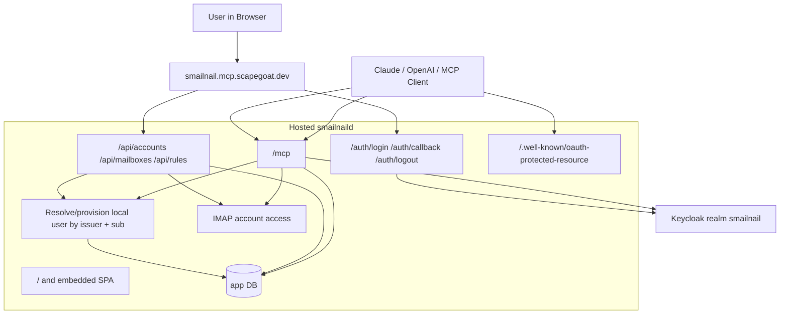
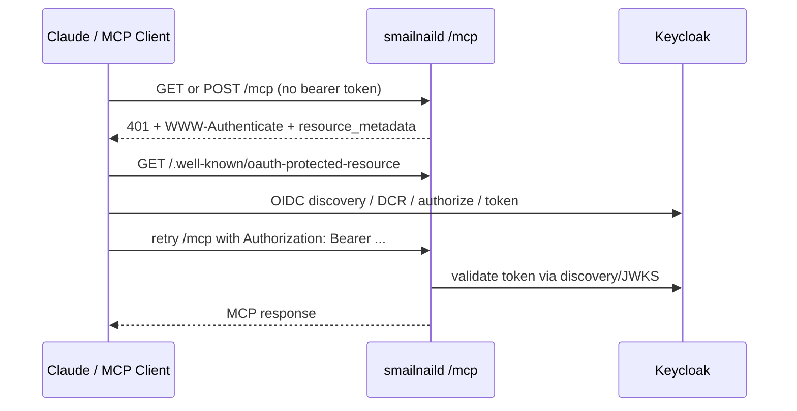
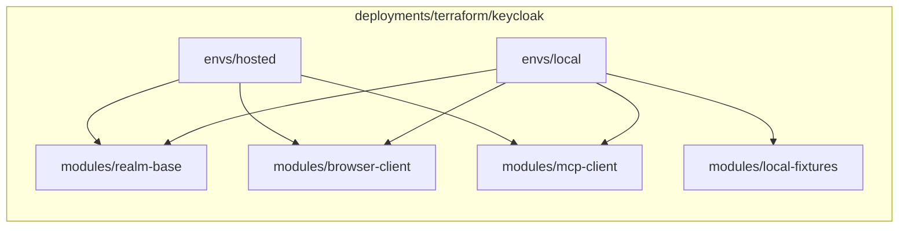

# Smailnail Hosted Identity, Terraform, and Claude Fix

This note is the project-level report for the work that landed on `task/update-imap-mcp` since `origin/main` across both `smailnail` and `go-go-mcp`. It is not one ticket summary. It is the stitched-together story from the implementation tickets, diaries, deployment notes, and the final production debugging cycle that ended with Claude working against the hosted MCP server.

> [!summary]
> Since `origin/main`, the project crossed four thresholds:
> 1. `smailnail` stopped being only a local CLI/MCP experiment and became a hosted backend plus SPA with persistent account/rule storage.
> 2. browser auth and MCP bearer auth were unified around one Keycloak-backed OIDC identity model and then deployed as one merged hosted server on Coolify.
> 3. the Keycloak setup stopped being only a pile of realm JSON, ad hoc `kcadm.sh`, and docs; it now has a real Terraform scaffold with local apply, hosted import, drift review, and a hosted operator playbook.
> 4. the final production blocker for Claude was isolated to Keycloak dynamic client registration policy and fixed by widening the anonymous DCR allowed-scope set to include `service_account`.

## Related notes

- [[PROJ - Smailnail Hosted Backend and SPA]]
- [[PROJ - Smailnail OIDC Identity and Hosted Auth]]
- [[PROJ - Smailnail Coolify Deployment]]

## Why this report exists

The March 16 project notes already described three separate slices:

- the hosted backend and SPA
- the hosted OIDC identity model
- the Coolify deployment shape

What they did not capture yet was the whole branch arc from `origin/main` through the final hosted auth stabilization and Terraform adoption. That arc matters because the project’s center of gravity changed. The branch is no longer “some incremental smailnail features.” It is now a full hosted system with:

- a web application
- a browser-login OIDC flow
- a bearer-protected MCP endpoint
- a shared Keycloak realm
- a production deployment path on Coolify
- and the first real infrastructure-as-code boundary for the identity layer

This note is meant to be the durable high-level answer to: “what actually happened on this branch, what exists now, what was tricky, and what should I read next if I need to continue it?”

## Scope and evidence

This report is based on:

- Git history from `origin/main..HEAD`
- `smailnail` and `go-go-mcp` ticket docs under `ttmp/`
- implementation diaries for the hosted backend, shared OIDC, merged deployment, Claude auth debugging, and Keycloak Terraform migration
- the new Glazed help tutorial:
  - `/home/manuel/workspaces/2026-03-08/update-imap-mcp/go-go-mcp/pkg/doc/topics/08-oidc-keycloak-coolify-hosted-mcp.md`

Key quantitative scope:

- `smailnail`: 39 commits over `origin/main`
- `go-go-mcp`: 46 commits over `origin/main`
- `smailnail`: 143 files changed, 16,138 insertions
- `go-go-mcp`: 94 files changed, 17,495 insertions

The raw numbers matter less than the shape: one repo grew the hosted product, the other repo grew the auth framework and the long-form operational documentation around it.

## Current project status

The branch is now in a materially different state from `origin/main`.

### What now exists

- `smailnaild` is a real hosted Go backend with account, mailbox, and rule APIs.
- The embedded React/Vite SPA can create IMAP accounts, test them, browse mailboxes, inspect message content, and dry-run rules.
- Browser login goes through Keycloak and lands in a local application user/session model.
- `/mcp` is served by the same hosted server and protected by OIDC bearer tokens.
- The live hosted system is on `https://smailnail.mcp.scapegoat.dev`.
- Keycloak realm state now has a Terraform home under:
  - `/home/manuel/workspaces/2026-03-08/update-imap-mcp/smailnail/deployments/terraform/keycloak`
- Hosted Keycloak import and no-op drift review are proven.
- Claude now works against the hosted MCP server.

### What changed the most conceptually

The project used to be shaped like:

```text
local tools
  + local MCP experiments
  + local mail credentials
```

It is now shaped like:

```text
hosted product
  + web app
  + browser OIDC login
  + stored per-user IMAP credentials
  + hosted MCP endpoint
  + shared Keycloak identity model
  + Terraform-managed identity operations boundary
```

## Workstream summary since `origin/main`

The easiest way to understand the branch is as four workstreams rather than a flat list of commits.

### 1. Hosted application and SPA

This started with the `smailnaild` SQL bootstrap, local Dovecot/Keycloak stack, and the account/rules backend. The backend gained:

- database bootstrap and migrations
- encrypted IMAP credential storage
- account CRUD and account-test flows
- mailbox listing and message fetch
- rule CRUD and dry-run execution

On top of that, the branch added a full embedded React/Vite SPA with:

- account onboarding and test-progress UI
- mailbox explorer
- rule editing and dry-run views

This is the largest pure product slice in the branch and lives mostly in:

- `pkg/smailnaild/`
- `ui/`
- `cmd/smailnaild/`

### 2. Shared OIDC identity and merged hosted server

The next major shift was identity. Instead of treating the browser app and the MCP endpoint as unrelated consumers, the branch introduced one local application identity model keyed by:

- `issuer`
- `subject`

That identity is used by both:

- the browser-login path through web sessions
- the bearer-token path for `/mcp`

After that, the hosted deployment shape was simplified from “web app and MCP server as separate hosted units” to one hosted `smailnaild` process serving:

- `/`
- `/auth/*`
- `/api/*`
- `/mcp`
- `/.well-known/oauth-protected-resource`

This removed a large amount of operational duplication and made the hosted system easier to reason about.

### 3. Production debugging, challenge cleanup, and Claude login analysis

Once the merged host was live, the branch moved into production debugging:

- `/readyz` probe noise in hosted request logs
- OIDC logout behavior
- Keycloak/OpenAI/Claude connector behavior

Two especially important fixes landed here:

- the MCP bearer challenge was simplified to advertise only `resource_metadata`
- `/readyz` was removed from the noisy hosted debug request logging

Those were necessary but not sufficient for Claude. The real Claude blocker was eventually proven to be in Keycloak’s anonymous dynamic client registration policy, not in the MCP transport.

### 4. Keycloak Terraform migration and production DCR remediation

The final workstream took the Keycloak setup from “partly declarative locally, imperative in production” to a reproducible Terraform-managed baseline.

That work produced:

- local and hosted Terraform envs
- reusable realm/client modules
- local sandbox apply against Keycloak
- hosted import of the live realm and clients
- a no-op hosted drift baseline
- a hosted operator playbook

After that baseline existed, the Claude fix itself was encoded into the hosted Terraform path via an admin-API helper that updates the anonymous DCR allowed-scope whitelist.

That sequence matters. The DCR policy change was not only a production hotfix. It was also the first proof that the new Terraform boundary can carry a real production auth remediation.

## Ticket map

The branch is best understood through these tickets:

- `SMAILNAIL-008`: hosted `smailnaild` bootstrap
- `SMAILNAIL-009`: local Dovecot + Keycloak stack
- `SMAILNAIL-010`: Coolify MCP deployment and hosted Dovecot fixture
- `SMAILNAIL-011`: OIDC identity and credential-storage guide
- `SMAILNAIL-012`: hosted UI/UX research
- `SMAILNAIL-013`: hosted account setup, mailbox, and rules implementation
- `SMAILNAIL-014`: shared OIDC identity across web app and MCP
- `SMAILNAIL-015`: merged hosted server deployment
- `SMAILNAIL-016`: Claude MCP login analysis and fix
- `SMAILNAIL-017`: Keycloak Terraform migration

For code readers, the two most important “why the system looks like this” tickets are:

- `SMAILNAIL-014`
- `SMAILNAIL-017`

## Architecture

The current mental model is:



The most important non-obvious point is that browser auth and bearer auth do not merely share an issuer. They share the same local user resolution boundary.

## Implementation details

This section is the shortest version of “how the current system actually works.”

### 1. Local identity model

The durable application identity key is not email or username. It is:

```text
(issuer, subject)
```

That choice keeps the local model tied to the OIDC identity semantics rather than to any provider-specific display field.

At a high level:

```text
if request is browser login callback:
    validate provider response
    extract issuer + sub
    resolve or provision local user
    create web session

if request is /mcp with bearer token:
    validate JWT against issuer + JWKS
    extract issuer + sub
    resolve or provision local user
    run MCP request in that user context
```

This is the core reason the hosted app and the hosted MCP server are now conceptually one system instead of two adjacent systems.

### 2. Account and rule execution model

The hosted app stores IMAP credentials encrypted at rest, then decrypts them only at service execution time.

Pseudo-flow:

```text
create_account(input):
    validate input
    encrypted_password = aead_encrypt(input.password)
    persist account row

test_account(account_id):
    account = load_and_decrypt(account_id)
    dial IMAP
    login
    list mailboxes
    fetch sample data
    return structured step results

dry_run_rule(rule_id):
    rule = load rule yaml
    account = load_and_decrypt(rule.account_id)
    run IMAP DSL fetch logic
    return matches and planned actions
```

This is why the hosted backend mattered before the identity work was fully complete: there needed to be an application state layer capable of holding user-owned mail configuration.

### 3. Hosted MCP auth path

The hosted MCP server intentionally expects the first anonymous request to fail.

The healthy version of that flow is:



The key lesson from the Claude debugging cycle is that a healthy first `401` does not mean the server is broken. The question is whether the client then follows the metadata trail successfully.

### 4. Why Claude was broken and what fixed it

Claude was not failing because the smailnail server returned the wrong challenge after the bearer-challenge simplification. It was failing because Keycloak was rejecting anonymous dynamic client registration.

The important observed policy object was:

```json
{
  "name": "Allowed Client Scopes",
  "subType": "anonymous",
  "config": {
    "allowed-client-scopes": ["mcp:tools", "openid", "web-origins"]
  }
}
```

Claude’s DCR request wanted `service_account`, so Keycloak rejected it.

The implemented remediation was:

```text
desired anonymous DCR scopes =
    [mcp:tools, openid, service_account, web-origins]

terraform apply
    -> local-exec helper
    -> Keycloak admin API
    -> update anonymous Allowed Client Scopes component
    -> verify resulting config
```

After that change:

- direct DCR probe changed from `403` to `201`
- user-reported Claude login started working

### 5. Terraform shape

The Keycloak Terraform layout is intentionally split into:

- shared modules
- `envs/local`
- `envs/hosted`

That lets the team prove behavior locally, import production safely, and treat hosted drift explicitly before any apply.

High-level shape:



The hosted env was deliberately reconciled to a no-op baseline before it was allowed to carry a real production change. That was the right move. It meant the Claude fix could be recognized as a deliberate auth-policy change instead of getting mixed into unrelated drift.

### 6. Tricky details and failure modes

Several things were more subtle than they first looked.

- Coolify health checks run inside the container, so the runtime image needed `curl`.
- The first anonymous MCP `401` is expected in a healthy OAuth flow.
- OIDC logout has at least three sessions in play:
  - app session
  - Keycloak session
  - upstream GitHub session
- Keycloak DCR policy is stricter than discovery metadata alone suggests.
- The Terraform provider can import realm and client resources but not every scope-attachment helper resource.
- Keycloak may reorder multivalued config values, so verification logic must compare normalized arrays rather than raw JSON order.

These are exactly the kinds of details that make the diaries worth reading. None of them are obvious if you only skim the final code.

## Important code locations

If I had to hand this project to someone and give them only a few places to start, I would use:

- `smailnail/pkg/smailnaild/http.go`
- `smailnail/pkg/smailnaild/auth/oidc.go`
- `smailnail/pkg/smailnaild/identity/`
- `smailnail/pkg/smailnaild/accounts/`
- `smailnail/pkg/smailnaild/rules/`
- `smailnail/pkg/mcp/imapjs/`
- `smailnail/deployments/terraform/keycloak/`
- `go-go-mcp/pkg/embeddable/auth_provider.go`
- `go-go-mcp/pkg/embeddable/auth_provider_external.go`
- `go-go-mcp/pkg/doc/topics/08-oidc-keycloak-coolify-hosted-mcp.md`

## Important docs

The most useful docs from this branch are:

- `go-go-mcp/ttmp/2026/03/16/SMAILNAIL-013-ACCOUNT-SETUP-IMPLEMENTATION--implement-hosted-smailnail-account-setup-phases-1-and-2/reference/01-implementation-diary.md`
- `go-go-mcp/ttmp/2026/03/16/SMAILNAIL-014-SHARED-OIDC-IMPLEMENTATION--implement-shared-oidc-identity-across-smailnaild-and-smailnail-mcp/reference/01-implementation-diary.md`
- `go-go-mcp/ttmp/2026/03/16/SMAILNAIL-015-MERGED-HOSTED-SERVER-DEPLOYMENT--merge-smailnaild-and-smailnail-mcp-into-one-hosted-server-and-deploy-it/reference/01-implementation-diary.md`
- `go-go-mcp/ttmp/2026/03/18/SMAILNAIL-016-CLAUDE-MCP-LOGIN-ANALYSIS--analyze-claude-mcp-login-failures-against-keycloak-backed-smailnail-mcp/reference/01-diary.md`
- `go-go-mcp/ttmp/2026/03/18/SMAILNAIL-017-KEYCLOAK-TERRAFORM-MIGRATION--move-the-full-smailnail-keycloak-setup-to-terraform/reference/01-diary.md`
- `go-go-mcp/ttmp/2026/03/18/SMAILNAIL-017-KEYCLOAK-TERRAFORM-MIGRATION--move-the-full-smailnail-keycloak-setup-to-terraform/reference/02-hosted-keycloak-import-and-apply-playbook.md`
- `go-go-mcp/pkg/doc/topics/08-oidc-keycloak-coolify-hosted-mcp.md`

## Current production state

As of this note:

- hosted app root: `https://smailnail.mcp.scapegoat.dev`
- hosted MCP: `https://smailnail.mcp.scapegoat.dev/mcp`
- issuer: `https://auth.scapegoat.dev/realms/smailnail`
- Terraform hosted plan: no-op after apply
- Claude: working

The branch’s most important operational improvement is not just that “it works.” It is that the work is now documented well enough that another engineer can reconstruct why it works.

## Open questions

- Should anonymous DCR remain the long-term approach, or should the project move back toward pre-provisioned clients for external MCP products?
- Should the Keycloak provider gap around registration-policy components be closed later with native Terraform resources if support arrives?
- When should the human-facing deployment docs switch fully from imperative Keycloak setup to the Terraform-first model?
- When should the hosted Terraform state move to a remote backend with locking?
- What is the right long-term persistence story for the hosted application DB?

## Near-term next steps

- Commit and push the final Claude-fix Terraform and Makefile cleanup changes if they are still local.
- Update the human-facing deployment docs so Terraform is the obvious source of truth.
- Decide whether to broaden or tighten DCR policy now that Claude works.
- Re-run OpenAI connector validation against the current policy and see whether the widened allowed-scope set changes its behavior.

## Project working rule

> [!important]
> For identity and deployment changes, do not trust the “looks right” layer.
> Verify each boundary separately:
> - app routes
> - `WWW-Authenticate`
> - protected-resource metadata
> - issuer discovery
> - Keycloak DCR / authorize / token behavior
> - Terraform drift state
>
> Most auth bugs here came from fixing the wrong layer first.
