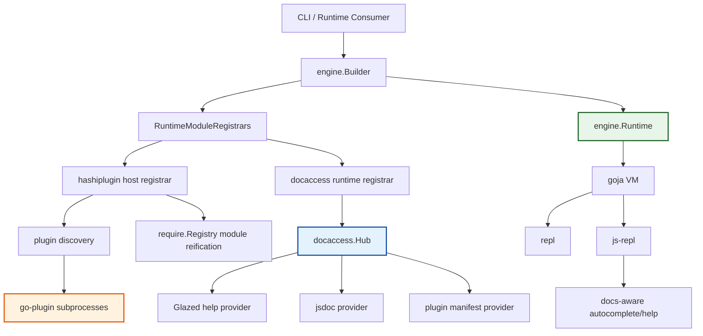

# go-go-goja Plugins Since origin main

This note is the branch-level project writeup for everything that landed from `origin/main` to the current `task/add-goja-plugins` branch. It is broader than the earlier plugin project note. That earlier note centered on the HashiCorp runtime plugin feature itself; this one describes the whole branch as a sustained architecture and productization pass across the engine, plugin host/SDK, documentation access layer, REPLs, examples, and review-driven cleanup.

It is best read as the durable answer to: what changed, why it changed, how the pieces fit together technically, and what shape the codebase now has after the full run of GOJA-08 through GOJA-13.

> [!summary]
> This branch did not add “just plugins.”
> 1. It changed the engine so runtimes can own runtime-scoped registration and cleanup.
> 2. It added a full external plugin stack: contract, host runtime loading, authoring SDK, examples, discovery UX, and tests.
> 3. It added a unified docs hub and then pushed that hub into `js-repl` help and autocomplete.
> 4. It finished with a review-and-cleanup pass that removed legacy help paths, reduced duplication, and tightened lifecycle handling.

## Why this branch exists

The starting problem was concrete: `go-go-goja` could expose built-in Go modules to a `goja` runtime, but it did not have a principled way to register dynamic, per-runtime modules that also owned external resources. HashiCorp `go-plugin` support immediately stresses that weakness because a plugin module is not only a module declaration. It is also:

- a subprocess lifecycle,
- a transport contract,
- a trust boundary,
- a runtime integration problem,
- and eventually a documentation problem once users can discover and call those modules.

The branch therefore became a sequence of dependent architecture tasks:

1. teach the engine about runtime-scoped registration and cleanup
2. load plugin modules safely into runtimes
3. make plugin authoring reasonable through an SDK
4. make the feature usable through examples, default install paths, and REPL wiring
5. expose docs through one shared system rather than one-off wrappers
6. audit the branch against long-lived codebase criteria and pay down the obvious debt before moving on

## Scope of change

The diff from `origin/main` to `HEAD` is large enough that it really is a branch-level project:

- 118 changed files
- roughly 18,161 insertions and 562 deletions
- major new directories under `pkg/hashiplugin`, `pkg/docaccess`, `plugins/examples`, and `ttmp/2026/03/18/GOJA-*`

The biggest code concentrations are:

- `pkg/hashiplugin/host`
- `pkg/hashiplugin/sdk`
- `pkg/docaccess`
- `engine`
- `pkg/repl/evaluators/javascript`
- the user-facing docs and ticket artifacts

The major commit clusters are:

- engine runtime registrar foundation
- plugin transport and host loading
- SDK authoring layer
- example plugins and install/productization
- docs hub and docs module
- `js-repl` doc-aware help/autocomplete
- review-driven cleanup and consolidation

## Ticket map

The work was organized into six linked tickets, all now complete:

- `GOJA-08`: runtime-scoped HashiCorp plugin loading
- `GOJA-09`: plugin authoring SDK
- `GOJA-10`: result normalization before `structpb` encoding
- `GOJA-11`: unified documentation access surfaces
- `GOJA-12`: doc-aware `js-repl` help and autocomplete
- `GOJA-13`: branch-wide architecture/code review and cleanup

Important repo docs from that work are:

- `ttmp/2026/03/18/GOJA-08-.../design-doc/01-hashicorp-plugin-support-for-go-go-goja-architecture-and-implementation-guide.md`
- `ttmp/2026/03/18/GOJA-09-.../design-doc/01-plugin-authoring-sdk-layer-for-hashicorp-go-go-goja-plugins-architecture-and-implementation-guide.md`
- `ttmp/2026/03/18/GOJA-11-.../design-doc/01-unified-documentation-access-architecture-and-implementation-guide.md`
- `ttmp/2026/03/18/GOJA-12-.../design-doc/01-doc-aware-js-repl-autocomplete-and-help-architecture-and-implementation-guide.md`
- `ttmp/2026/03/18/GOJA-13-.../design-doc/01-origin-main-review-report-for-plugin-and-documentation-architecture.md`

There is also an earlier sibling project note here in the vault:

- [[PROJ - go-go-goja Plugins - HashiCorp Runtime Plugins]]

That note is still useful as the feature-centered story. This note is the branch-centered story.

## Current project status

The branch is in a strong “implemented and hardened first version” state.

What exists now:

- runtime-scoped module registrars in the engine
- runtime-owned cleanup hooks and runtime-scoped retained values
- HashiCorp plugin discovery, loading, manifest validation, reification, diagnostics, and teardown
- plugin authoring SDK with module/export/method builders and call helpers
- plugin result normalization for common Go values before protobuf encoding
- example plugins and a `make install-modules` workflow
- line REPL and TUI REPL plugin wiring with shared defaults
- a runtime-scoped docs hub exposed through `require("docs")`
- `js-repl` autocomplete/help/drawer support for plugin docs
- branch-level cleanup from the GOJA-13 review, including removal of `modules/glazehelp`

What still looks like future work rather than missing fundamentals:

- extending the docs resolver beyond plugin docs to native modules like `fs`, `path`, `url`, and `docs`
- stronger trust policy than directory allowlisting
- additional polish around plugin-facing docs, quickstarts, and broader doc navigation
- more explicit validation for string-encoded plugin doc IDs that currently depend on `/` and `.`

## High-level branch shape

The branch now has a much cleaner architecture than `origin/main`, but also a noticeably broader one.



The key architectural change is that runtime setup is now explicit and runtime-scoped. That one change is what makes the rest of the branch coherent rather than ad hoc.

## Major workstreams

### 1. Engine runtime composition

The foundational change is in:

- `/home/manuel/workspaces/2026-03-18/add-goja-plugins/go-go-goja/engine/factory.go`
- `/home/manuel/workspaces/2026-03-18/add-goja-plugins/go-go-goja/engine/runtime.go`
- `/home/manuel/workspaces/2026-03-18/add-goja-plugins/go-go-goja/engine/runtime_modules.go`
- `/home/manuel/workspaces/2026-03-18/add-goja-plugins/go-go-goja/engine/module_specs.go`

Before this branch, the engine could not naturally express “during runtime creation, let some subsystem register modules and later clean up runtime-owned resources.” After this branch, it can.

The core changes are:

- `RuntimeModuleRegistrar` as the extensibility seam
- runtime-scoped setup values
- runtime-owned lifecycle context
- runtime-owned cleanup hooks
- runtime persistence of setup-time values so later consumers can read them

This is the architectural hinge of the whole branch. Without it, everything else would have become entrypoint-specific wiring or package-global hacks.

### 2. HashiCorp plugin host and contract

The plugin stack is split into four clear layers:

- `pkg/hashiplugin/contract`
- `pkg/hashiplugin/shared`
- `pkg/hashiplugin/host`
- `pkg/hashiplugin/sdk`

That split is correct and worth preserving.

`contract` owns protobuf types and shared service shape. `shared` owns `go-plugin` handshake and GRPC plugin registration. `host` owns policy, discovery, validation, reporting, and JS-side reification. `sdk` owns author ergonomics.

Important host files:

- `/home/manuel/workspaces/2026-03-18/add-goja-plugins/go-go-goja/pkg/hashiplugin/host/config.go`
- `/home/manuel/workspaces/2026-03-18/add-goja-plugins/go-go-goja/pkg/hashiplugin/host/discover.go`
- `/home/manuel/workspaces/2026-03-18/add-goja-plugins/go-go-goja/pkg/hashiplugin/host/client.go`
- `/home/manuel/workspaces/2026-03-18/add-goja-plugins/go-go-goja/pkg/hashiplugin/host/registrar.go`
- `/home/manuel/workspaces/2026-03-18/add-goja-plugins/go-go-goja/pkg/hashiplugin/host/reify.go`
- `/home/manuel/workspaces/2026-03-18/add-goja-plugins/go-go-goja/pkg/hashiplugin/host/report.go`
- `/home/manuel/workspaces/2026-03-18/add-goja-plugins/go-go-goja/pkg/hashiplugin/contract/validate.go`

### 3. Plugin authoring SDK

The SDK is one of the best outcomes of the branch because it narrows the author mental model from “implement protobuf RPC manually” to “declare a module and serve it.”

The important files are:

- `/home/manuel/workspaces/2026-03-18/add-goja-plugins/go-go-goja/pkg/hashiplugin/sdk/module.go`
- `/home/manuel/workspaces/2026-03-18/add-goja-plugins/go-go-goja/pkg/hashiplugin/sdk/export.go`
- `/home/manuel/workspaces/2026-03-18/add-goja-plugins/go-go-goja/pkg/hashiplugin/sdk/call.go`
- `/home/manuel/workspaces/2026-03-18/add-goja-plugins/go-go-goja/pkg/hashiplugin/sdk/dispatch.go`
- `/home/manuel/workspaces/2026-03-18/add-goja-plugins/go-go-goja/pkg/hashiplugin/sdk/convert.go`
- `/home/manuel/workspaces/2026-03-18/add-goja-plugins/go-go-goja/pkg/hashiplugin/sdk/serve.go`

The SDK started with:

- `MustModule`
- `Function`
- `Object`
- `Method`
- `Call`
- `Serve`

Then the branch tightened the docs side by making method metadata explicit:

- `MethodSummary`
- `MethodDoc`
- `MethodTags`

That is an important correction because it aligns the SDK with the richer method metadata in the plugin manifest contract.

### 4. Examples, install flow, and REPL productization

The branch moved from bare test plugins to a real example catalog under:

- `/home/manuel/workspaces/2026-03-18/add-goja-plugins/go-go-goja/plugins/examples`

The examples are:

- `plugin:examples:greeter`
- `plugin:examples:clock`
- `plugin:examples:validator`
- `plugin:examples:kv`
- `plugin:examples:system-info`
- `plugin:examples:failing`

This is more important than it looks. It turns the feature from “internal plumbing” into something that teaches users and exercises the SDK shape.

The branch also normalized the default plugin installation/discovery story:

- default plugin discovery under `~/.go-go-goja/plugins/...`
- `make install-modules`
- `--plugin-dir` in both `repl` and `js-repl`
- allowlisting controls
- plugin status reporting

### 5. Unified docs hub and docs module

The docs workstream became its own subsystem:

- `/home/manuel/workspaces/2026-03-18/add-goja-plugins/go-go-goja/pkg/docaccess/model.go`
- `/home/manuel/workspaces/2026-03-18/add-goja-plugins/go-go-goja/pkg/docaccess/hub.go`
- `/home/manuel/workspaces/2026-03-18/add-goja-plugins/go-go-goja/pkg/docaccess/glazed/provider.go`
- `/home/manuel/workspaces/2026-03-18/add-goja-plugins/go-go-goja/pkg/docaccess/jsdoc/provider.go`
- `/home/manuel/workspaces/2026-03-18/add-goja-plugins/go-go-goja/pkg/docaccess/plugin/provider.go`
- `/home/manuel/workspaces/2026-03-18/add-goja-plugins/go-go-goja/pkg/docaccess/runtime/registrar.go`

The important move here is conceptual: docs stopped being one-off wrappers and became runtime-scoped provider-backed data.

That allows one runtime to have:

- its own loaded plugin manifests
- its own Glazed help sources
- its own jsdoc stores
- one uniform JS-facing module: `require("docs")`

### 6. `js-repl` doc-aware help

The last major feature slice connected the docs hub to the Bobatea evaluator:

- `/home/manuel/workspaces/2026-03-18/add-goja-plugins/go-go-goja/pkg/repl/evaluators/javascript/evaluator.go`
- `/home/manuel/workspaces/2026-03-18/add-goja-plugins/go-go-goja/pkg/repl/evaluators/javascript/docs_resolver.go`

This matters because it turns the docs hub from “queryable if you know it exists” into “visible during normal interactive use.”

The first implementation is plugin-first:

- resolve `require()` aliases
- map `kv`, `kv.store`, and `kv.store.get` to doc entries
- enrich completion rows
- enrich the help bar
- render method/module/export docs in the help drawer

That is the right first cut because plugin manifests already have the structure needed for this.

## Implementation details

This is the section to read if the goal is to rebuild the branch mentally rather than skim its outcomes.

### Runtime creation now has a registrar phase

The most important algorithmic shift in the branch is that runtime construction is no longer “build everything statically, then enable the runtime.” It is now:

```text
create VM + event loop + runtime owner
create fresh require.Registry
register static built-in modules
run runtime module registrars
persist runtime-scoped values
enable require.Registry on the VM
return owned runtime
```

That registrar phase is what allows:

- plugin discovery to happen per runtime
- docs hubs to be built from the loaded plugin set for that runtime
- cleanup hooks to be registered for that runtime only

Pseudocode:

```text
factory.NewRuntime(ctx):
  vm := goja.New()
  reg := new require.Registry()
  rt := &Runtime{...}
  moduleCtx := RuntimeModuleContext{
    VM: vm,
    Context: runtimeCtx,
    AddCloser: rt.AddCloser,
    Values: map[string]any{},
  }

  registerDefaultModules(reg)

  for registrar in runtimeModuleRegistrars:
    registrar.RegisterRuntimeModules(&moduleCtx, reg)

  rt.Values = copy(moduleCtx.Values)
  reg.Enable(vm)
  return rt
```

The non-obvious part is that this is not only a plugin hook. It is a new general engine seam.

### Plugin registration is host-owned and manifest-driven

The host registrar does not let plugins mutate the runtime directly. Instead, the host:

1. discovers candidate binaries
2. starts each binary through `go-plugin`
3. requests a manifest
4. validates the manifest
5. turns the manifest into native module loaders in the host `require.Registry`
6. keeps the client handles for later invocation and cleanup

That means the plugin process never receives the `goja.Runtime` and never owns module loading itself.

```mermaid
flowchart LR
    A[Plugin binary path] --> B[start go-plugin client]
    B --> C[dispense JSModule service]
    C --> D[Manifest RPC]
    D --> E[Validate manifest]
    E --> F[LoadedModuleInfo]
    F --> G[RegisterModule]
    G --> H[require('plugin:...')]
    H --> I[JS call]
    I --> J[Invoke RPC]

    style E fill:#ffebee,stroke:#b71c1c,stroke-width:2px
    style G fill:#e8f5e9,stroke:#1b5e20,stroke-width:2px
```

The main benefit is coherence. JavaScript semantics stay local to the host runtime. The plugin system only extends the module surface through a controlled RPC bridge.

### The SDK compiles a declarative module into a transport-ready service

The SDK path is compact on the author side but more structured internally.

Author code:

```go
sdk.MustModule(
  "plugin:examples:kv",
  sdk.Version("v1"),
  sdk.Object("store",
    sdk.Method(
      "get",
      store.get,
      sdk.MethodSummary("Get a key, returning null if it is absent"),
      sdk.MethodDoc("Get a key, returning null if it is absent"),
      sdk.MethodTags("kv", "lookup"),
    ),
  ),
)
```

Internally, this becomes:

```text
moduleDefinition
  -> validate authoring shape
  -> build contract.ModuleManifest
  -> build dispatch table keyed by export + method
  -> implement contract.JSModule
  -> publish over go-plugin via sdk.Serve(...)
```

The most useful property of the SDK is not just convenience. It is that it centralizes the semantics of:

- manifest construction
- argument decoding
- result encoding
- method/summary/tag metadata
- dispatch errors

That makes plugin behavior more uniform across examples and future third-party plugins.

### Result normalization is a necessary buffer around `structpb`

One subtle but important improvement in the branch is GOJA-10: normalize common Go result shapes before `structpb` encoding.

Without that, plugin authors had to know odd transport details like:

- `[]string` may fail
- `[]any{"a", "b"}` works

The normalization layer in `pkg/hashiplugin/sdk/convert.go` now recursively rewrites common Go values into `structpb`-friendly shapes before RPC encoding.

Pseudocode:

```text
encodeResult(v):
  if v is *structpb.Value:
    return v
  normalized := normalize(v)
  return structpb.NewValue(normalized)

normalize(v):
  scalars -> scalar
  []T -> []any with recursive normalization
  map[string]T -> map[string]any with recursive normalization
  nested pointers/interfaces -> unwrap then normalize
  unsupported -> explicit error
```

This is one of the branch’s good examples of choosing pragmatic ergonomics over “let authors learn protobuf edge cases.”

### Docs are now provider-backed runtime state, not ad hoc wrappers

The docs hub is an actual architecture, not a convenience package.

The runtime registrar builds a `docaccess.Hub` and attaches providers for whatever this runtime has:

- Glazed help systems
- jsdoc stores
- loaded plugin manifests

Then it exposes that hub to JavaScript via `require("docs")` and to Go-side runtime consumers via runtime-scoped retained values.

That means the docs module is not faking or flattening other systems; it is indexing them.

```mermaid
flowchart TD
    A[Runtime setup] --> B[docaccess runtime registrar]
    B --> C[docaccess.Hub]
    C --> D[Glazed provider]
    C --> E[jsdoc provider]
    C --> F[plugin provider]
    C --> G[runtime value: docaccess.hub]
    C --> H[require('docs')]
    G --> I[js-repl evaluator resolver]
    H --> J[JS-side docs queries]

    style C fill:#e3f2fd,stroke:#0d47a1,stroke-width:2px
```

That architecture is what made GOJA-12 possible without inventing a second docs index.

### `js-repl` help is now plugged into the docs system rather than bypassing it

Before the last slices, help/completion mostly depended on:

- static signatures
- parser-derived candidates
- runtime property inspection

After GOJA-12, the evaluator has a docs resolver that:

- reads the runtime docs hub
- knows which providers are plugin-doc providers
- resolves alias chains like `const kv = require("plugin:examples:kv")`
- maps `kv.store.get` to plugin method docs
- contributes completion candidates from manifest docs, not just runtime object inspection

This matters because nested plugin expressions are not naturally discoverable from the runtime alone during typing. The docs resolver fills that gap with manifest-backed structure.

### GOJA-13 was a real cleanup pass, not just a report

The review ticket produced documentation, but it also changed code:

- removed legacy `modules/glazehelp`
- centralized shared manifest validation
- persisted runtime-scoped values onto `engine.Runtime`
- routed plugin calls through a runtime-owned context
- strengthened diagnostics/reporting
- consolidated duplicated plugin setup

That is a good pattern for this repo. The review was close enough to the implementation work that it could still change the code while the architecture was fresh.

## User-facing commands and workflows

The branch materially changed the top-level workflows.

### Install example plugins

```bash
make install-modules
```

This installs example plugin binaries under:

```text
~/.go-go-goja/plugins/examples
```

### Run the line REPL

```bash
go run ./cmd/repl
```

Optional flags:

- `--plugin-dir`
- `--allow-plugin-module`
- `--plugin-status`

### Run the TUI REPL

```bash
go run ./cmd/js-repl
```

Same plugin discovery model as `repl`, now including docs-aware plugin help.

### Query the docs module from JavaScript

```javascript
const docs = require("docs")
docs.sources()
docs.byID("plugin-manifests", "plugin-method", "plugin:examples:kv/store.get")
```

### Manual plugin smoke test

```javascript
const kv = require("plugin:examples:kv")
kv.store.set("name", "Manuel")
kv.store.get("name")
kv.store.keys()
```

## Important repo docs

The user-facing docs added on this branch are meaningful, not placeholder material:

- `/home/manuel/workspaces/2026-03-18/add-goja-plugins/go-go-goja/pkg/doc/12-plugin-user-guide.md`
- `/home/manuel/workspaces/2026-03-18/add-goja-plugins/go-go-goja/pkg/doc/13-plugin-developer-guide.md`
- `/home/manuel/workspaces/2026-03-18/add-goja-plugins/go-go-goja/pkg/doc/14-plugin-tutorial-build-install.md`
- `/home/manuel/workspaces/2026-03-18/add-goja-plugins/go-go-goja/pkg/doc/15-docs-module-guide.md`

Those pages matter because the branch is now large enough that the code is no longer sufficient as the only orientation mechanism.

## Notable improvements over the earlier project note

Compared to the earlier vault note for this repo, the codebase moved forward in a few important ways:

- method-level docs are now first-class in the plugin contract
- `js-repl` can actually use plugin docs during autocomplete/help
- plugin result normalization covers common Go types better
- method metadata is explicit in the SDK
- the default plugin docs source ID is centralized
- all six GOJA tickets from this branch have been completed and marked `complete`

## Open questions

- Should the docs resolver grow to native modules next, or should that come with a broader module-doc schema pass?
- Should plugin export and method names be validated against the `/` and `.` delimiters used in doc entry IDs?
- How far should plugin trust policy go beyond explicit directory selection and allowlisting?
- Should the `docs` module eventually bridge into `docmgr` metadata, or should that remain a looser future influence?
- Is there one more bootstrap consolidation pass left across runtime consumers, or is the current shared setup helper enough?

## Near-term next steps

If I were continuing this branch, I would do the next work in this order:

1. extend the docs resolver to native modules like `fs`, `path`, `url`, and `docs`
2. harden plugin doc ID validation
3. add stronger trust-policy options if plugins are moving beyond local experimentation
4. keep examples and docs synchronized as the SDK evolves

That order keeps visible product value moving while still paying down the most obvious correctness/maintainability risks.

## Project working rule

The branch’s biggest success came from one consistent rule:

> keep the host runtime as the center of truth, and make external/plugin/doc systems runtime-scoped extensions rather than parallel ownership models

That rule explains why the good parts of this branch feel coherent:

- plugin processes do not own the JS VM
- docs are indexed into a runtime hub rather than queried through ad hoc wrappers
- cleanup belongs to the runtime lifecycle
- REPL surfaces consume runtime-owned state instead of inventing their own state model

If that rule holds for future work, the branch should stay maintainable even as the feature surface grows.

## KB reviews

- [[KB-BATCH3-goja-ecosystem]] (2026-05-11) — concept extraction + classification

## Related KB entries

- [[Tribal/goja-embedding-in-go]] — the Go+JS runtime pattern

**Tribal candidates** (not yet at 3-project threshold):
- HashiCorp go-plugin for JS modules (1/3)
- Plugin authoring SDK (1/3)
- Runtime-scoped docs hub (1/3)
