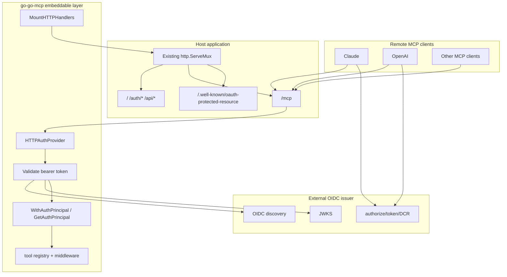

# go-go-mcp Hosted OIDC and Smailnail Delivery

This note describes what changed in `go-go-mcp` on `task/update-imap-mcp` since `origin/main`. The short version is that the repo became much more than a protocol library during this branch. It turned into:

- the hosted-auth substrate used by `smailnail`
- the place where the embeddable HTTP/OIDC model was tightened
- and the long-form engineering memory for the whole hosted Smailnail rollout

> [!summary]
> Since `origin/main`, `go-go-mcp` added 48 commits and 97 changed files. Most of the line count is documentation, but the important code changes are real:
> 1. embedded MCP HTTP handlers can now be mounted into an existing application server
> 2. verified auth principals can now be carried through request context into tool execution
> 3. external OIDC bearer challenges were simplified around `resource_metadata`, which mattered for hosted MCP interoperability
> 4. the repo now contains the operational and design record for the Smailnail hosted rollout, including Coolify deployment, shared OIDC identity, Claude debugging, and Keycloak Terraform adoption

## Why this project exists

`go-go-mcp` already existed as a Go implementation of MCP with an embeddable server, client commands, and protocol plumbing. What this branch clarified is the repo’s second identity:

- it is not only an MCP implementation
- it is also the infrastructure and runtime layer for real hosted MCP applications

That mattered because `smailnail` needed a production-shape auth story:

- one hosted app serving `/mcp`
- external OIDC with Keycloak
- protected-resource metadata
- remote clients like OpenAI and Claude
- and a way for the host app to recover verified identity inside tool execution

Without those pieces, `go-go-mcp` would have remained a mostly generic protocol implementation. With them, it became a framework that can carry a real hosted product.

## Current project status

This branch is a substantial expansion over `origin/main`.

### What changed numerically

- 48 commits over `origin/main`
- 97 files changed
- 17,607 insertions
- 72 deletions

### What changed structurally

There are two kinds of work on this branch.

#### Framework/runtime work

- new auth principal context plumbing
- embeddable HTTP handler mounting
- external OIDC challenge cleanup
- tests for those auth and mounting behaviors
- dependency bumps:
  - `geppetto` `v0.10.11 -> v0.10.17`
  - `glazed` `v1.0.4 -> v1.0.5`

#### Documentation-system work

- a new first-class Glazed tutorial:
  - `pkg/doc/topics/08-oidc-keycloak-coolify-hosted-mcp.md`
- multiple ticket workspaces under `ttmp/` covering:
  - hosted Smailnail deployment
  - shared OIDC identity
  - merged hosted server
  - Claude MCP login analysis
  - Keycloak Terraform migration
- scripts, playbooks, and diaries that make the hosted auth work reproducible

The second category dominates the line count, but it exists because the first category made the hosted rollout possible and worth documenting.

## What this branch made `go-go-mcp` into

The repo’s mental model changed.

Before this branch, the easiest description was:

```text
MCP server/client implementation
  + CLI
  + embeddable transport support
```

After this branch, the better description is:

```text
MCP framework and hosted-auth substrate
  + embeddable transports
  + external OIDC resource-server behavior
  + host-app integration points
  + long-form deployment and debugging knowledge base
```

That second form matches how the repo was actually used by `smailnail`.

## Workstreams since `origin/main`

The branch makes the most sense as four workstreams.

### 1. Make the embeddable server fit a real host app

The key runtime change here is in:

- `/home/manuel/workspaces/2026-03-08/update-imap-mcp/go-go-mcp/pkg/embeddable/mcpgo_backend.go`

The new `MountHTTPHandlers` path lets an existing Go application own the top-level `http.Server` and mount MCP routes into its mux instead of forcing `go-go-mcp` to own the entire listener.

That matters because `smailnaild` needed to serve all of this on one server:

- `/`
- `/auth/*`
- `/api/*`
- `/mcp`
- `/.well-known/oauth-protected-resource`

Without handler mounting, the application would have needed either:

- a second listener/process
- or a more awkward reverse-proxy split

This is a good example of a small framework change with large product impact.

### 2. Carry verified identity into tool execution

The most important new auth-runtime file is:

- `/home/manuel/workspaces/2026-03-08/update-imap-mcp/go-go-mcp/pkg/embeddable/auth_context.go`

This adds:

- `WithAuthPrincipal(ctx, principal)`
- `GetAuthPrincipal(ctx)`

The principal object carries:

- subject
- client id
- issuer
- scopes
- email / username / display metadata
- raw-ish claims map

This matters because validating a bearer token at the HTTP boundary is not enough for a host app. The application needs to recover the verified identity downstream when it decides which user data to expose. For Smailnail, that identity is what lets the MCP route resolve the same local user/account data as the browser-authenticated app.

### 3. Tighten the hosted OIDC contract

The auth provider layer changed in:

- `/home/manuel/workspaces/2026-03-08/update-imap-mcp/go-go-mcp/pkg/embeddable/auth_provider.go`
- `/home/manuel/workspaces/2026-03-08/update-imap-mcp/go-go-mcp/pkg/embeddable/auth_provider_external.go`

The most important externally visible change was simplifying the bearer challenge to:

```text
Bearer realm="mcp", resource_metadata="https://.../.well-known/oauth-protected-resource"
```

That seems small, but it matters in hosted interoperability work. The branch’s debugging trail showed that remote clients are sensitive to the exact shape of the metadata trail. A noisy or non-standard challenge can become the difference between a client starting OAuth correctly or stalling after the first `401`.

The external OIDC provider also became clearer as a real resource-server implementation:

- fetch discovery
- fetch and cache JWKS
- validate issuer and optional audience
- enforce required scopes
- project validated claims into an `AuthPrincipal`

### 4. Turn the repo into a durable engineering memory

This branch used `go-go-mcp/ttmp/` as the working memory for the entire hosted Smailnail rollout. That is a big part of why the repo diff is so large.

The important thing here is not “lots of docs were added.” The important thing is that the docs are operationally serious:

- design docs
- implementation diaries
- operator playbooks
- smoke scripts
- incident-like debugging guides

This means the repo is now serving as both:

- framework code
- and the primary explanation of how that framework was used in a real production-grade deployment

That dual role is unusual, but it was effective on this branch.

## Architecture

The framework shape that emerged on this branch looks like this:



The key point is that `go-go-mcp` is acting as the protected resource layer and host-app integration layer, not as the whole application.

## Implementation details

### The embeddable backend model

`pkg/embeddable/mcpgo_backend.go` now supports two modes of using the framework:

```text
Mode 1: Start your own server
    NewBackend(cfg) -> backend.Start(ctx)

Mode 2: Mount into an existing app
    MountHTTPHandlers(existingMux, cfg)
```

That second mode is what unlocked the merged Smailnail host.

Pseudo-flow:

```text
build server config
create mcp-go server
register tools from registry
choose transport

if standalone:
    start stdio / sse / streamable_http backend

if embedded:
    mount transport-specific handlers into existing mux
```

This is a better abstraction boundary for real applications because the app can keep owning:

- sessions
- auth routes
- metrics
- static asset serving
- non-MCP APIs

while `go-go-mcp` owns only the MCP-specific part.

### The auth provider contract

The auth provider interface is intentionally small:

```text
MountRoutes(mux)
ValidateBearerToken(ctx, token) -> AuthPrincipal
ProtectedResourceMetadata()
WWWAuthenticateHeader()
```

That separation is good because it splits four concerns that often get blurred:

- route mounting
- token verification
- protected-resource metadata publication
- `401` challenge composition

In practice, the hosted flow becomes:

```text
anonymous request -> 401 + WWW-Authenticate
client fetches metadata
client completes OAuth
request retried with bearer token
provider validates token
principal stored in context
tool call sees verified identity
```

### Why principal propagation matters

Without principal propagation, token validation is only useful for yes/no access control.

With principal propagation, a host application can do this:

```text
principal = GetAuthPrincipal(ctx)
localUser = resolve_or_provision(issuer=principal.Issuer, sub=principal.Subject)
return only that user's resources
```

That is the bridge between OAuth correctness and application correctness.

For Smailnail, that bridge is the reason the hosted `/mcp` route can act on a user’s stored IMAP accounts instead of only accepting ad hoc credentials.

### Why the simplified bearer challenge mattered

This branch’s production debugging work showed that the first anonymous `/mcp` request often looks scary in logs even when it is normal:

```text
POST /mcp -> 401
GET /.well-known/oauth-protected-resource -> 200
```

The actual question is not “did `/mcp` return 401?” The question is:

```text
did the client learn enough from the challenge and metadata to continue OAuth?
```

The simplified challenge reduced one source of client-side ambiguity. It did not solve all remote-client problems, but it made the protected-resource side more spec-shaped and less brittle.

### The documentation system as part of the implementation

The `ttmp/` tree is not auxiliary on this branch. It is part of how the repo was used.

The note-worthy pattern is:

```text
ticket workspace
    -> design doc
    -> implementation diary
    -> changelog
    -> tasks
    -> scripts / smoke tools / playbooks
```

That pattern did three useful things:

1. It made debugging reproducible.
2. It let architectural decisions accumulate instead of being re-derived.
3. It turned a complicated multi-repo rollout into something that an intern could actually read.

That is why the branch has giant docs diffs but still feels coherent.

### Failure modes and tricky details

The tricky parts on this branch were mostly integration details rather than algorithmic complexity.

- A healthy hosted MCP flow begins with a `401`; that is not itself a bug.
- The exact `WWW-Authenticate` header shape matters more than it first appears.
- Token validation alone is not enough; the identity has to survive into the tool call context.
- A library that can start its own server is not automatically easy to embed in a real application.
- Dynamic client registration failures can look like server bugs even when the protected resource is fine and the authorization server policy is the real blocker.
- Documentation debt becomes operational debt very quickly in hosted auth systems.

## Important files

If I needed to explain the branch through a minimal file set, I would start with:

- `/home/manuel/workspaces/2026-03-08/update-imap-mcp/go-go-mcp/pkg/embeddable/mcpgo_backend.go`
- `/home/manuel/workspaces/2026-03-08/update-imap-mcp/go-go-mcp/pkg/embeddable/auth_context.go`
- `/home/manuel/workspaces/2026-03-08/update-imap-mcp/go-go-mcp/pkg/embeddable/auth_provider.go`
- `/home/manuel/workspaces/2026-03-08/update-imap-mcp/go-go-mcp/pkg/embeddable/auth_provider_external.go`
- `/home/manuel/workspaces/2026-03-08/update-imap-mcp/go-go-mcp/pkg/doc/topics/07-embedded-oidc.md`
- `/home/manuel/workspaces/2026-03-08/update-imap-mcp/go-go-mcp/pkg/doc/topics/08-oidc-keycloak-coolify-hosted-mcp.md`

For the branch history and operator memory, I would then read:

- `ttmp/2026/03/16/SMAILNAIL-010-MCP-COOLIFY-DEPLOYMENT--deploy-smailnail-mcp-to-coolify-with-keycloak-external-oidc/`
- `ttmp/2026/03/16/SMAILNAIL-014-SHARED-OIDC-IMPLEMENTATION--implement-shared-oidc-identity-across-smailnaild-and-smailnail-mcp/`
- `ttmp/2026/03/16/SMAILNAIL-015-MERGED-HOSTED-SERVER-DEPLOYMENT--merge-smailnaild-and-smailnail-mcp-into-one-hosted-server-and-deploy-it/`
- `ttmp/2026/03/18/SMAILNAIL-016-CLAUDE-MCP-LOGIN-ANALYSIS--analyze-claude-mcp-login-failures-against-keycloak-backed-smailnail-mcp/`
- `ttmp/2026/03/18/SMAILNAIL-017-KEYCLOAK-TERRAFORM-MIGRATION--move-the-full-smailnail-keycloak-setup-to-terraform/`

## Important project docs

The most useful docs added on this branch are:

- `pkg/doc/topics/08-oidc-keycloak-coolify-hosted-mcp.md`
- `ttmp/2026/03/16/SMAILNAIL-010.../reference/03-openai-keycloak-dcr-debug-guide.md`
- `ttmp/2026/03/18/SMAILNAIL-016.../design-doc/01-claude-mcp-oauth-and-keycloak-dynamic-client-registration-guide-for-smailnail.md`
- `ttmp/2026/03/18/SMAILNAIL-017.../design-doc/01-intern-guide-to-migrating-the-full-smailnail-keycloak-setup-to-terraform.md`
- `ttmp/2026/03/18/SMAILNAIL-017.../reference/02-hosted-keycloak-import-and-apply-playbook.md`

These docs are part of the repo’s value now. They explain the practical hosted use cases in a way the generic README does not.

## Open questions

- Should client-registration policy become a first-class managed surface in the framework docs, or stay treated as application-specific operator work?
- How much of the Smailnail operator knowledge should be generalized into reusable `go-go-mcp` examples rather than ticket docs?
- Should the top-level README be rewritten to surface hosted HTTP/OIDC usage more prominently?
- Is there a better long-term place for large deployment playbooks than `ttmp/`, or is the current structure good enough?
- Should the library eventually expose a more native registration-policy management abstraction, or is that correctly outside the framework boundary?

## Near-term next steps

- Push the latest local commits if the branch tip should be shared remotely.
- Decide whether to turn the Smailnail hosted OIDC tutorial into a broader “hosted MCP auth playbook” for other apps.
- Revisit the README so the hosted embeddable story is easier to discover.
- Keep the ticket/diary discipline for the next major hosted integration, because it clearly paid off on this branch.

## Project working rule

> [!important]
> Treat `go-go-mcp` changes in two layers:
> 1. framework behavior
> 2. operational explanation
>
> On this branch, the highest-value work was rarely one without the other.
