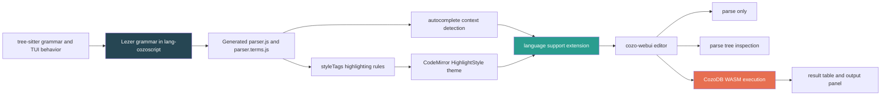
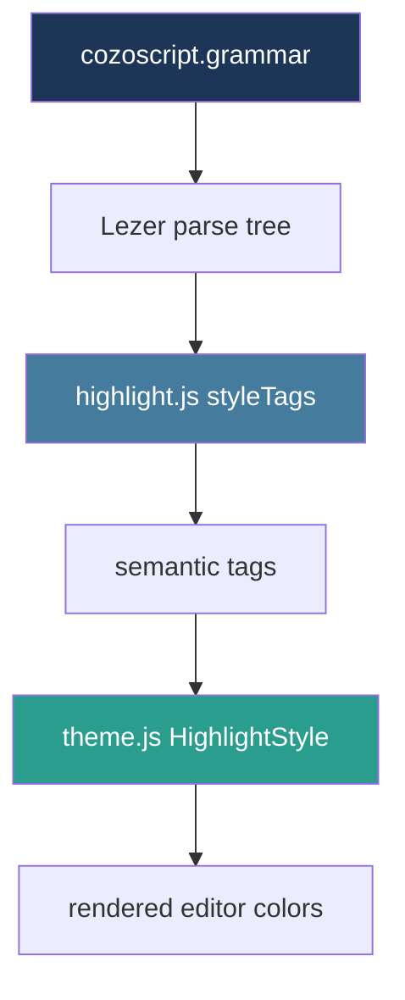

# CozoScript Web UI

This project is a browser-based CozoScript editor built around CodeMirror 6, a Lezer grammar, and a small CozoDB WASM-backed web application. It started from an older tree-sitter grammar and Python TUI, but the interesting current work is the port to a reusable browser language package and a runnable web UI that feels like a real CozoScript workbench rather than a bare demo.

> [!summary]
> The project currently has three important identities:
> 1. a Lezer port of the existing CozoScript grammar for CodeMirror 6
> 2. a standalone language package with highlighting and context-aware autocomplete
> 3. a browser editor shell that can parse, inspect, and execute CozoScript queries against CozoDB WASM

## Why this project exists

The older terminal editor proved that CozoScript benefits from editor-aware tooling: syntax highlighting, autocomplete, examples, and fast parse feedback all materially improve usability. But the TUI path is narrow. It is hard to embed in other tools, hard to turn into a shareable demo, and not the natural home for browser-facing interaction patterns like sidebars, result tables, or live WASM execution.

This repo exists to answer a more durable question: what is the smallest coherent web-native CozoScript editor that still preserves the useful semantics of the old system?

That question splits naturally into two technical goals:

- build a proper CodeMirror language package for CozoScript instead of a one-off editor script
- wrap it in a web UI that can actually execute queries, browse examples, and expose parser/debugging feedback

The result is not just a syntax demo. It is a bridge project between language tooling, developer ergonomics, and a future browser-facing CozoDB editing experience.

## Current project status

The repository is in an active but already usable state.

What already exists:

- a `lang-cozoscript` package with:
  - Lezer grammar
  - generated parser
  - syntax highlighting rules
  - Catppuccin-themed CodeMirror highlight style
  - context-aware autocomplete
- a `cozo-webui` Vite app with:
  - editor panel
  - output panel
  - example browser
  - parse-only and parse-tree actions
  - live execution through `cozo-lib-wasm`
- a substantial parser corpus:
  - 88 parser tests covering examples plus inline cases
- repo-level documentation for the port:
  - design guide
  - debugging/testing guide
  - implementation diary
  - handoff notes
- a top-level `Makefile` that unifies install/build/test/dev commands

What is still incomplete:

- the `*` prefix in stored relation access is still uncolored
- raw string support is not yet implemented
- the web UI does not yet persist query history
- panels are fixed-size rather than resizable
- the browser shell is still intentionally simple and mostly contained in one file

The project is beyond toy status, but still in the stage where architectural clarity matters more than polish.

## Project shape

At a high level the repo has five layers:

1. **Historical source material**
   - `tree-sitter-cozoscript/`
   - `cozo_tui/`
2. **The new language package**
   - `lang-cozoscript/`
3. **The browser application**
   - `cozo-webui/`
4. **The shared example corpus**
   - `cozo_examples/`
5. **The design and investigation workspace**
   - `ttmp/2026/03/19/COZO-WEBUI-001--cozoscript-web-ui-codemirror-editor-with-lezer-grammar-port/`

The modern center of gravity is clearly `lang-cozoscript` plus `cozo-webui`. The tree-sitter grammar and TUI matter mainly as reference implementations and as source material for the port.

## Architecture

The cleanest mental model is: grammar first, editor second, web shell third.



In practical terms:

- `lang-cozoscript` defines the language
- `cozo-webui` consumes that package as a local file dependency
- the web app is thin compared to the language layer
- the ticket docs in `ttmp/` are effectively the design memory for the project

## Key code locations

The files that define the current system are:

- `/home/manuel/code/wesen/2026-02-24--cozoscript-treesitter-autocomplete/lang-cozoscript/src/cozoscript.grammar`
- `/home/manuel/code/wesen/2026-02-24--cozoscript-treesitter-autocomplete/lang-cozoscript/src/highlight.js`
- `/home/manuel/code/wesen/2026-02-24--cozoscript-treesitter-autocomplete/lang-cozoscript/src/theme.js`
- `/home/manuel/code/wesen/2026-02-24--cozoscript-treesitter-autocomplete/lang-cozoscript/src/complete.js`
- `/home/manuel/code/wesen/2026-02-24--cozoscript-treesitter-autocomplete/lang-cozoscript/src/index.js`
- `/home/manuel/code/wesen/2026-02-24--cozoscript-treesitter-autocomplete/lang-cozoscript/test/test-parser.mjs`
- `/home/manuel/code/wesen/2026-02-24--cozoscript-treesitter-autocomplete/lang-cozoscript/test/check-highlighting.mjs`
- `/home/manuel/code/wesen/2026-02-24--cozoscript-treesitter-autocomplete/cozo-webui/src/main.js`
- `/home/manuel/code/wesen/2026-02-24--cozoscript-treesitter-autocomplete/cozo-webui/src/examples.js`
- `/home/manuel/code/wesen/2026-02-24--cozoscript-treesitter-autocomplete/Makefile`

## Implementation details

The most important technical fact about this repo is that the browser UI is downstream of the grammar port. The project works because the parser is treated as the primary artifact, not because the UI contains clever editor hacks.

### 1. The grammar port is the real foundation

The original system had a tree-sitter grammar and a Python TUI. The port replaces the parser runtime, but keeps the language intent. That means the implementation had to translate tree-sitter constructs into Lezer in a way that still supported:

- inline rules, constant rules, and fixed rules
- system operations and query options
- stored relation access in both bracket and brace forms
- aggregation operators in rule heads
- expressions with precedence
- built-in functions and graph algorithms

The resulting Lezer grammar lives in `lang-cozoscript/src/cozoscript.grammar`, and the generated parser is treated as build output rather than hand-edited code.

A useful pseudocode sketch of the grammar workflow is:

```text
edit src/cozoscript.grammar
  -> run lezer-generator
  -> produce src/parser.js and src/parser.terms.js
  -> bind styleTags to node names
  -> bind autocomplete logic to parse-tree contexts
  -> bundle package
  -> consume from cozo-webui
```

This matters because many apparent UI bugs are actually grammar or parse-tree shape bugs in disguise. If a token does not exist in the right place in the tree, highlighting and autocomplete both degrade.

### 2. Highlighting is a three-layer system

The highlighting pipeline is easy to misunderstand if you only look at browser colors.

There are three distinct layers:

1. the grammar decides which node types exist
2. `styleTags` maps those node types to semantic highlight tags
3. the CodeMirror `HighlightStyle` maps those tags to actual CSS



A useful mental rule is:

- grammar bugs produce wrong or missing nodes
- `styleTags` bugs produce missing or misclassified semantics
- theme bugs produce correct semantics with wrong colors

The project uncovered one subtle trap here: `classHighlighter` is very good for coverage and missing-style debugging, but it can collapse modified tags like `standard(function(variableName))` into a generic-looking class. That means the browser can be correct even when the debug script output looks more generic than expected.

### 3. Autocomplete is parse-context driven rather than regex driven

The autocomplete system is not just a bag of strings shown on `Tab`. It infers context from the parser and surrounding syntax, then narrows the completion set. The key contexts already implemented include:

- system operations after `::`
- query options after `:`
- fixed-rule algorithms after `<~`
- aggregation operators in rule heads
- functions in expression position
- relation-spec contexts
- general fallback completion

The structure looks roughly like this:

```text
on completion request:
  inspect cursor position
  inspect syntax tree node around cursor
  detect context kind
  choose completion source for that context
  return completions with descriptions
```

This is a materially better design than a flat keyword list because CozoScript has overlapping vocabularies. `count` means something different in a rule head than `PageRank` after `<~`, and `:limit` belongs to a different syntactic zone than `::relations`.

### 4. The web UI is intentionally thin

The web UI in `cozo-webui/src/main.js` is mostly a shell around the language package. That is a good thing. The editor package does the language work, and the web app does the browser work:

- create the layout
- host the editor
- load example queries
- show parse results
- dump parse trees for debugging
- execute queries through CozoDB WASM
- render returned rows as readable output

The shell is not deeply componentized yet. It is still mostly one-file application code. For the current stage, that is acceptable because the main design pressure has been language correctness rather than UI abstraction. If the project grows further, `main.js` is the obvious refactor target.

### 5. CozoDB WASM turns the editor into a real tool

Without execution, this would still be a useful language-package project. With `cozo-lib-wasm`, it becomes a self-contained CozoScript playground. The browser can initialize a database instance, accept a query from the editor, run it locally, and show results without requiring a server round-trip.

That changes the character of the project:

- examples are executable rather than illustrative only
- parse-only mode and run mode can be compared directly
- UI affordances like output tables and query chaining become meaningful

This is the difference between "language support" and "language workbench."

## Tricky details and failure modes

The most valuable knowledge in this repo is not the happy path. It is the set of sharp edges discovered during the port.

### Vite cache invalidation is a real operational hazard

`cozo-webui` imports `lang-cozoscript` through a local `file:../lang-cozoscript` dependency. Vite prebundles dependencies aggressively, so rebuilding the language package is not enough by itself. If the `.vite` cache is not cleared, the browser may keep running stale grammar or highlighting code.

That means the real edit loop is:

```text
change lang-cozoscript source
  -> rebuild lang-cozoscript
  -> clear cozo-webui/node_modules/.vite
  -> restart or re-optimize Vite
```

The repo now has a top-level `Makefile` partly to encode that rule so it is harder to forget.

### Lezer node naming rules matter a lot

Lezer only exposes named nodes that exist with the right capitalization and specialization strategy. This led to a few important working rules:

- lowercase names often disappear into anonymous nodes
- `@extend` creates literal leaf nodes like `count` and `sum`
- highlighting rules must usually target the leaf rather than the wrapper
- parse-tree debugging is often the fastest way to explain a styling anomaly

### The project has two truth surfaces: `src/` and `dist/`

Because the web UI depends on the built package, `src/highlight.js` or `src/cozoscript.grammar` can be correct while the browser is still wrong if `dist/` is stale. This is easy to miss when debugging because local node scripts may be reading from source while the browser is reading from the package build.

### The current remaining syntax gaps are narrow, not foundational

The unresolved work is mostly edge and polish work rather than evidence of a failed port:

- stored-relation `*` prefix highlighting
- raw-string parsing
- query history persistence
- panel resizing

That is a healthy project state. The core architecture is working; the remaining items are incremental improvements.

## Current user-facing commands

The top-level `Makefile` is now the best entry point:

```bash
make install
make build
make test
make dev
make preview
make clean
```

Direct package commands still matter when working inside `lang-cozoscript`:

```bash
cd /home/manuel/code/wesen/2026-02-24--cozoscript-treesitter-autocomplete/lang-cozoscript
npm run build
node test/test-parser.mjs
node test/verify-tree.mjs
node test/check-highlighting.mjs
```

And the manual web workflow remains:

```bash
cd /home/manuel/code/wesen/2026-02-24--cozoscript-treesitter-autocomplete/cozo-webui
rm -rf node_modules/.vite
npm run dev
```

## Current examples and user experience

The web UI already contains a real browsing experience rather than a single canned demo. `cozo-webui/src/examples.js` ships examples for:

- hello world
- basic stored-relation queries
- aggregation
- recursive path queries
- shortest path
- PageRank
- relation creation and insertion
- transaction chaining
- negation and disjunction
- string functions
- list operations
- BFS
- community detection
- `:yield` chaining
- fraud detection

This matters because it doubles as:

- a user onboarding surface
- an informal regression corpus
- a design check for coverage breadth

## Important project docs

The repo contains unusually strong internal documentation for a prototype. The most important documents are:

- `/home/manuel/code/wesen/2026-02-24--cozoscript-treesitter-autocomplete/README.md`
- `/home/manuel/code/wesen/2026-02-24--cozoscript-treesitter-autocomplete/Makefile`
- `/home/manuel/code/wesen/2026-02-24--cozoscript-treesitter-autocomplete/ttmp/2026/03/19/COZO-WEBUI-001--cozoscript-web-ui-codemirror-editor-with-lezer-grammar-port/design-doc/01-cozoscript-web-ui-complete-design-and-implementation-guide.md`
- `/home/manuel/code/wesen/2026-02-24--cozoscript-treesitter-autocomplete/ttmp/2026/03/19/COZO-WEBUI-001--cozoscript-web-ui-codemirror-editor-with-lezer-grammar-port/reference/01-diary.md`
- `/home/manuel/code/wesen/2026-02-24--cozoscript-treesitter-autocomplete/ttmp/2026/03/19/COZO-WEBUI-001--cozoscript-web-ui-codemirror-editor-with-lezer-grammar-port/reference/02-lezer-grammar-testing-and-debugging-guide.md`
- `/home/manuel/code/wesen/2026-02-24--cozoscript-treesitter-autocomplete/ttmp/2026/03/19/COZO-WEBUI-001--cozoscript-web-ui-codemirror-editor-with-lezer-grammar-port/reference/03-handoff-notes-for-next-developer.md`

The ticket workspace is valuable enough that it effectively acts as the project's second memory system after the source code itself.

## Open questions

- Should the browser shell remain a compact single-file application until the feature set stabilizes, or is it time to extract a more explicit component structure?
- Should relation browsing and schema inspection become first-class UI features rather than only query-driven behaviors?
- Is raw-string support worth the cost of an external tokenizer now, or should editor ergonomics focus first on history and panel management?
- Should the language package be published independently once the edge highlighting gaps are closed?
- Should the long-term direction stay "editor plus examples," or evolve toward a notebook-like CozoDB environment?

## Near-term next steps

- fix `*` prefix highlighting for stored relation access
- add raw-string support
- persist editor history in `localStorage`
- make the panels resizable
- split `cozo-webui/src/main.js` if the UI keeps growing
- keep the parser/debugging docs aligned with the actual build and runtime behavior

## Project working rule

> [!important]
> Treat `lang-cozoscript` as the product and `cozo-webui` as its consumer.
> When debugging browser behavior, always distinguish between source truth, built package truth, and Vite cache state before changing the grammar.

## Related projects

- [[Projects/2026/03/22/PROJ - CozoDB Editor - Notebook Packaging and JavaScript Preset]] — The notebook packaging arc answers this project's own open question: *"Should the long-term direction stay 'editor plus examples,' or evolve toward a notebook-like CozoDB environment?"* The CozoDB Editor's `CozoScriptEditor.tsx` consumes the `lang-cozoscript` Lezer grammar package built here, and the notebook preset architecture is the notebook-like environment this project was considering.

## KB reviews

- [[KB-BATCH13-cozo-editor-structured-browser-tools]] (2026-05-11) — Batch D analysis; surfaced the grammar-first editor-workbench pattern and new CodeMirror-oriented on-ramp material.

## Related KB entries

**Tribal candidates** (not yet written / needs review):
- Language package as product, browser shell as consumer (2/3 with later Cozo editor modularization).
- Parse-context-driven autocomplete rather than regex-driven autocomplete (1/3).
- Browser shell intentionally thin over language package (1/3).

**On-Ramp candidates** (not yet written):
- CodeMirror 6 language package mental model (2/5 🌐).

