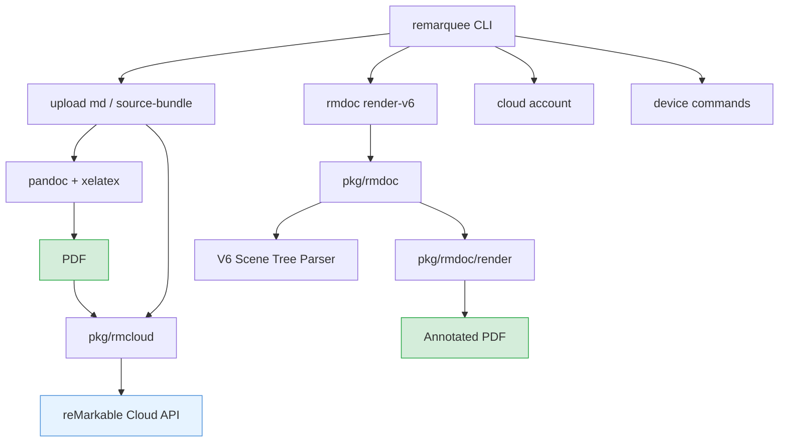

# Remarquee

Remarquee is a unified Go CLI for reMarkable workflows. It wraps rmapi for cloud sync and auth, adds document rendering (V6 rmdoc format), markdown-to-PDF upload via pandoc/xelatex, OCR, device capture, and a domain-specific language for document manipulation. The project lives under the go-go-golems org as `github.com/go-go-golems/remarquee`.

> [!summary]
> 1. A CLI (`remarquee`) that uploads markdown, renders rmdoc annotations to PDF, and manages reMarkable cloud/device interactions
> 2. A library layer (`pkg/rmdoc`, `pkg/rmcloud`, `pkg/mdpdf`) for programmatic reMarkable document handling
> 3. An in-progress web UI (`cmd/remarquee-ui`) for browsing and rendering documents

## Why this project exists

The reMarkable tablet ecosystem has several disconnected tools: rmapi for cloud sync, the remarks reference implementation for rendering annotations, and ad-hoc scripts for uploading content. Remarquee unifies these into a single CLI with a shared auth layer, consistent document model, and Glazed-based command framework. The immediate use case is uploading daily reading material (markdown notes, source code bundles) and retrieving annotated documents as rendered PDFs.

## Current project status

What already exists:

- cloud auth with OAuth refresh, device token bootstrap, and bounded retry on transient failures
- `remarquee upload md <paths>` -- converts markdown to PDF via pandoc/xelatex and uploads, now with directory mirroring by default
- `remarquee upload source-bundle` -- bundles source files into a single PDF with ToC
- `remarquee rmdoc render-v6` / `render-legacy` -- renders rmdoc annotations onto background PDFs
- `remarquee cloud account` -- cloud account info and re-auth
- `remarquee device` -- device interaction commands
- `remarquee ocr` -- OCR extraction
- `remarquee rmdsl` -- DSL for document operations
- V6 scene tree parser with stroke colors, highlights, and anchor support
- PDF merge pipeline that composites annotations onto background PDFs

What is still incomplete:

- web UI frontend (`cmd/remarquee-ui`) -- Go backend exists but `frontend/dist` is not built, causing `go:embed` failures in CI
- some test fixtures still reference old workspace paths (mostly fixed)

## Architecture

Key code locations:

- `cmd/remarquee/main.go` -- CLI entry point
- `cmd/remarquee/cmds/upload/md.go` -- markdown upload with directory mirroring
- `cmd/remarquee/cmds/upload/source_bundle.go` -- source code bundling
- `cmd/remarquee/cmds/rmdoc/` -- document rendering commands
- `cmd/remarquee/cmds/cloud/` -- cloud account management
- `pkg/rmcloud/auth.go` -- OAuth auth with retry/backoff
- `pkg/rmdoc/` -- V6 rmdoc parser, scene tree, stroke extraction
- `pkg/rmdoc/render/` -- PDF merge and annotation rendering
- `pkg/mdpdf/` -- pandoc wrapper for markdown-to-PDF
- `pkg/rmdsl/` -- document DSL compiler

## Implementation details

### Upload pipeline

The `upload md` command walks input paths, converts each `.md` file to PDF via pandoc with xelatex, then uploads through rmapi's cloud API. Directory structure is mirrored by default: `remarquee upload md foo/ --remote-dir /bla` with `foo/a/b.md` creates `/bla/a/b.pdf` on the device. The `--flatten` flag reverts to the old flat behavior. Collision detection runs before any conversion, keyed on `(remoteDir, relDir, docName)`.

The remote directory defaults to `/ai/YYYY/MM/DD/` (today's date) and can be overridden with `--remote-dir` or `--date`. Existing documents are skipped unless `--force` is set, which deletes the existing entry before re-uploading.

### rmdoc V6 rendering

The V6 scene tree parser (`pkg/rmdoc/`) reads reMarkable's binary `.rm` annotation format, extracting strokes with color, tool type, and positional anchors. The render pipeline (`pkg/rmdoc/render/`) composites these annotations onto the original background PDF using unipdf, producing a merged PDF with stroke overlays and highlight annotations. Smart highlights map V6 `PenColorHighlight` markers with trailing RGBA bytes to concrete highlight color IDs.

### Auth hardening

The rmapi auth layer was hardened to avoid `log.Fatal` on transient cloud failures. Token refresh now returns errors up the call stack, and the `/user/new` token exchange uses bounded exponential backoff (up to 3 retries) for HTTP 500 responses.

## Important project docs

- `/home/manuel/workspaces/2026-03-04/fix-remarquee-oauth-refresh/remarquee/ttmp/` -- ticket workspaces with design docs, diaries, and changelogs
- Recent ticket: `ttmp/2026/03/19/RMQ-001--upload-md-mirror-directory-structure-by-default/` -- directory mirroring feature

## Near-term next steps

- fix the `cmd/remarquee-ui` frontend build so `go:embed` works and CI passes cleanly
- clean up remaining hardcoded fixture paths in `cmd/remarquee-ui/testdata/gen_fakes/main.go`
- consider adding `--recursive` vs `--no-recursive` flags for finer directory walk control
