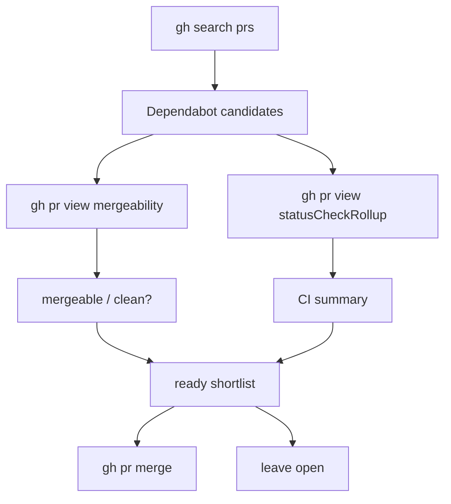

# close-dependabot-prs

This project packages the Dependabot PR scanning and merge workflow into a reusable Codex skill. It bundles a deterministic Python scanner with `gh`-based merge operations so open Dependabot PRs across an org can be filtered, reviewed, and closed with a consistent rule set instead of manual spot checks.

> [!summary]
> - The scanner is bundled at `scripts/scan_dependabot_prs.py`.
> - Readiness is conservative: mergeable, clean, and CI-passing only.
> - The workflow we used is scan, merge the clean PRs, then rescan.

## Why this project exists

Dependabot cleanup is repetitive but not trivial. A PR is only safe to merge when mergeability, branch state, and CI all agree. This project turns that judgment into a repeatable toolchain so the same pass can be run across many `go-go-golems` repositories without re-checking each PR by hand.

## Current project status

The skill now exists as a reusable unit under `/home/manuel/.codex/skills/close-dependabot-prs`, with the scanner bundled alongside it and optional UI metadata in `agents/openai.yaml`. In use, it successfully found ready Dependabot PRs, merged the clean ones, and left conflicting PRs for later handling.

## Project shape

- Skill root: `/home/manuel/.codex/skills/close-dependabot-prs`
- Scanner: `scripts/scan_dependabot_prs.py`
- UI metadata: `agents/openai.yaml`

## Implementation details

The scanner is intentionally simple and deterministic. It uses `gh` to search for open Dependabot PRs, then queries each candidate PR for mergeability metadata and the CI check rollup. That gives the script enough information to produce both a human table and JSON without relying on ad hoc GitHub UI state.

The readiness rule is strict:

```python
ready = mergeable == "MERGEABLE" and merge_state == "CLEAN" and ci.overall == "passing"
```

That is the key guardrail. It avoids merging PRs that still have hidden conflicts, pending checks, or ambiguous check states. The scan output is also sorted and repeatable, so it works well as a “what can be merged now?” report before any destructive action.



The main failure mode is workflow or permissions friction, especially around workflow-file PRs. In those cases the scan still gives the correct shortlist, but GitHub may require a local git merge and push instead of the normal API merge path.

## Near-term next steps

- Reuse the skill whenever Dependabot PRs need org-wide cleanup.
- Merge only the `ready=true` PRs from the scan output.
- Leave conflicting PRs out of the automated path and handle them separately.
