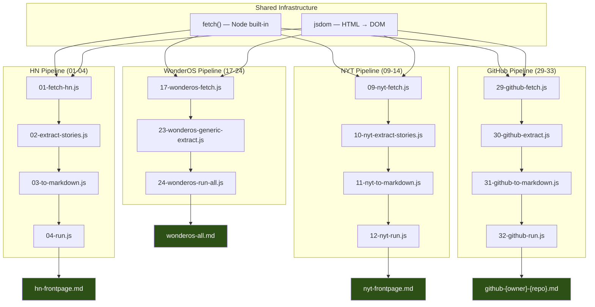
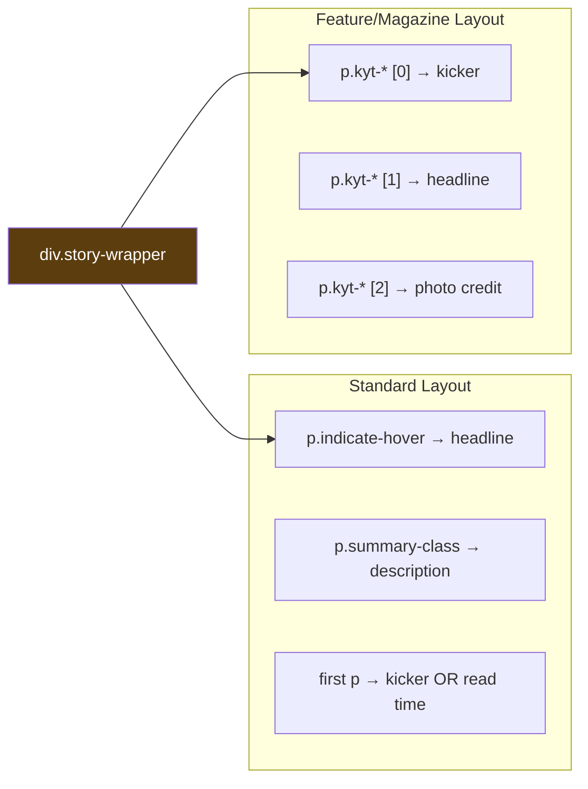
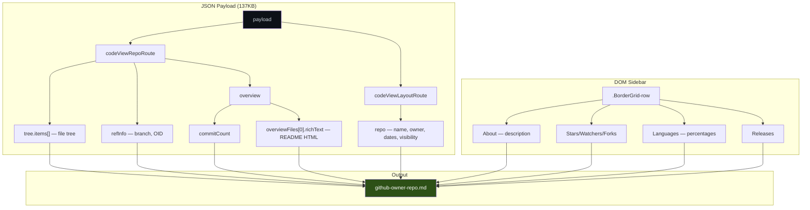

# DOM Scraping Experiment

This project explores how to fetch real web pages, parse them into a DOM with `jsdom`, extract structured data using standard JavaScript DOM queries (`querySelectorAll`, `querySelector`, `textContent`, `getAttribute`), and render the results as clean Markdown. The work covers four very different site types — a news feed (Hacker News), a major newspaper (NYTimes), a small project page (WonderOS), and a GitHub repository — each requiring different extraction strategies but sharing a common modular architecture.

> [!summary]
> The project has three identities:
> 1. a reusable pattern for turning any web page into structured Markdown via Node.js + jsdom
> 2. a collection of 33 numbered JS scripts that form a reproducible exploration and extraction trail
> 3. an exercise in understanding how different sites structure their HTML — from HN's simple tables to GitHub's 137KB JSON data islands

## Why this project exists

Most web scraping tools aim for automation at scale. This project has a different goal: to understand how websites structure their content at the DOM level, and to prove that standard JS DOM queries are sufficient to extract that content into readable Markdown — without browser automation, without AI-powered extraction, and without site-specific APIs.

The practical value is a set of scripts that can be pointed at different sites and adapted quickly. But the deeper value is the exploration process itself: each site taught something different about how the modern web renders content, from server-rendered HTML (HN, NYT, WonderOS) to React-powered JSON islands (GitHub).

## Current project status

The repository contains four complete extraction pipelines, all working and producing clean Markdown output.

What already exists:

- **Hacker News pipeline** (`01-04`): fetches the front page, extracts 30 stories with rank, title, URL, domain, score, author, age, and comment count. Outputs `hn-frontpage.md`.
- **NYTimes pipeline** (`09-14`): extracts 35+ news stories grouped by section (U.S., World, Opinion, Sports, etc.) with headlines, summaries, kickers, read times, and related links. Handles two distinct layout patterns (standard and feature/magazine). Outputs `nyt-frontpage.md`.
- **WonderOS pipeline** (`17-24`): extracts content from all three pages on the site (`/`, `/hello/`, `/poster/`) with a generic extractor that adapts to each page's structure. Outputs `wonderos-all.md`.
- **GitHub pipeline** (`29-33`): extracts repo metadata, file tree, README structure, languages, and social stats from any public GitHub repo. Uses a dual-source approach (JSON payload + DOM sidebar). CLI accepts any repo URL. Outputs `github-<owner>-<repo>.md`.
- **Exploration scripts** (`05-08`, `15-16`, `21-22`, `25-28`): 14 numbered scripts documenting the iterative DOM investigation for each site.
- **Detailed implementation diary** in `ttmp/` with 16 steps covering every decision, discovery, and bug fix.

What is incomplete or could be extended:

- No recursive directory browsing for GitHub repos (only root tree)
- No pagination support for any site (HN page 2, etc.)
- No caching or rate limiting
- The NYT `kyt-*` class detection is fragile and based on one example

## Project shape

The project follows a consistent four-file modular pattern for each site:

1. **Fetch** — downloads HTML, parses with `jsdom`, returns a `document` object
2. **Extract** — runs DOM queries against the document, returns structured data objects
3. **Markdown** — transforms data objects into formatted Markdown strings
4. **Run** — orchestrates the pipeline: fetch → extract → markdown → write file

Before each pipeline, **exploration scripts** investigate the site's DOM structure iteratively. These are numbered sequentially and preserved as a reproducible trail of discovery.

```text
Site pipeline:
  XX-fetch.js       → HTTP fetch + jsdom parse → document
  XX-extract.js     → querySelectorAll + DOM traversal → structured data
  XX-to-markdown.js → template rendering → markdown string
  XX-run.js         → orchestrator → .md file

Exploration trail:
  XX-explore-*.js   → console.log DOM inventory, parent chains, class patterns
  XX-debug-*.js     → verify extraction completeness, investigate missing data
```

## Architecture

The project is pure Node.js with a single dependency: `jsdom`. No browser automation (Playwright was considered but unnecessary), no AI extraction, no APIs — just `fetch()` + `new JSDOM(html)` + standard DOM queries.



## Implementation details

### The core pattern: fetch → jsdom → querySelectorAll

Every pipeline starts the same way. Node's built-in `fetch()` retrieves the HTML, and `jsdom` parses it into a standard DOM that supports the full `querySelector` / `querySelectorAll` / `textContent` / `getAttribute` API. This means the same JS expressions you'd type in a browser console work identically in the scripts.

```js
const { JSDOM } = require('jsdom');
const res = await fetch(url);
const html = await res.text();
const { document } = new JSDOM(html).window;
// Now use document.querySelectorAll() etc. exactly like a browser
```

This works because all four sites server-render their content. Even GitHub, despite being a React app, embeds all data in the initial HTML response (as JSON payloads inside `<script>` tags). No JavaScript execution is needed.

### Hacker News: table-based extraction

HN has the simplest DOM of the four sites. Stories are `<tr class="athing">` rows, with metadata in the next sibling `<tr>`. The extraction is a single `querySelectorAll` + `.map()`:

```js
[...document.querySelectorAll('tr.athing')].map(row => {
  const rank = row.querySelector('.rank')?.textContent;
  const titleLink = row.querySelector('.titleline > a');
  const metaRow = row.nextElementSibling;
  const score = metaRow?.querySelector('.score')?.textContent;
  const author = metaRow?.querySelector('.hnuser')?.textContent;
  // ...
});
```

HN uses semantic, stable class names (`.rank`, `.titleline`, `.score`, `.hnuser`). The only subtlety is that the comment count is the last `<a>` in `.subline`, and for new stories it says "discuss" instead of "N comments".

### NYTimes: dual-layout story extraction

NYT is the most complex extraction. The page is 1.3MB of server-rendered HTML with CSS-module hashed class names (`css-1e505by`, `kyt-+7LQ2`). Stories live in `div.story-wrapper` elements inside `[data-testid="programming-node"]` containers.

The key discovery was that NYT has 9 `programming-node` containers, but only the first one contains all unique stories — the rest are duplicates (likely for responsive layout variants). Deduplication by `href` eliminates the copies.

NYT uses two distinct layout patterns for story content:



The standard layout covers ~95% of stories. The feature layout was discovered only through a debug script (`14-nyt-find-missing-stories.js`) that investigated why the Baby Reindeer/Richard Gadd magazine story was silently dropped. The fix adds a fallback: if `p.indicate-hover` yields no headline, scan for `<p>` elements with `kyt-*` class prefixes.

The kicker field is particularly tricky — it occupies the same DOM position but carries five different semantic meanings depending on section:

| Kicker text           | Actual meaning           | Section      |
| --------------------- | ------------------------ | ------------ |
| "Analysis"            | Section label            | U.S.         |
| "6 min read"          | Read time (not a kicker) | any          |
| "LIVE"                | Live indicator           | Live Updates |
| "Maureen Dowd"        | Author name              | Opinion      |
| "Times Investigation" | Investigation label      | World        |
| "From The Athletic"   | Source attribution       | Sports       |
|                       |                          |              |

Disambiguation uses regex: if the kicker matches `/^\d+ min read$/`, it's extracted as `readTime` instead. Section inference comes from the URL path: `nytimes.com/2026/03/21/us/politics/...` → section "us".

### WonderOS: heading-grouped content extraction

WonderOS is a 10KB Svelte-generated site with only 3 pages. Unlike the news sites (which have repeating story patterns), WonderOS is a content page — extraction walks the DOM tree sequentially, grouping paragraphs under headings.

The three pages have completely different DOM structures:

- `/` — `.container` > `#summary` (pillar pairs) + `article` (3 sections)
- `/hello/` — no `.container`, `#cover` + `article` (12 handbook chapters with `[WIP]` markers)
- `/poster/` — `.container` > `#main` (product info), no article

The generic extractor adapts by detecting which structural elements are present:

```js
const summaryDiv = document.querySelector('#summary');   // home page
const mainDiv = document.querySelector('#main');          // poster page
const article = document.querySelector('article');        // home + hello

if (summaryDiv) { /* extract pillars from paired <p> elements */ }
if (mainDiv && !article) { /* extract product page */ }
if (article) { /* walk <section> children, group under headings */ }
```

Two non-obvious quirks: the page title and hero question exist only as `` attributes (not text), and the first description paragraph starts with "is an ongoing research project" because "WonderOS" is rendered as an image. The extractor prepends the missing word.

### GitHub: JSON data island extraction

GitHub is architecturally the most interesting. Despite being a React app, it embeds a 137KB JSON payload inside `react-app > script[type="application/json"]` containing the complete file tree, README HTML, repo metadata, and branch info. This is essentially an embedded API response.



Star count extraction has a subtle problem: small repos display "25 stars" but popular repos display "81k stars". The `parseInt("81k")` gives `81`, not `81000`. The fix uses three fallback layers:

1. `#repo-stars-counter-star` `aria-label="80976 users starred this repository"` — exact count
2. `<a class="Link--muted">` text with k/m suffix parsing (`parseCount("81k")` → 81000)
3. Default to 0

The README HTML from `overviewFiles[0].richText` is a pre-rendered HTML string. The extractor parses it with a second `jsdom` instance to extract headings (for table of contents), paragraphs (for summary), code block count, and external links.

### Exploration methodology

Each site follows the same discovery process:

1. **Inventory** — fetch the page, count tags, list `data-*` attributes, dump headings and first N links. Answer: "what's in this HTML?"
2. **Zoom in** — for each candidate container pattern, examine children, parent chains, and class names. Answer: "what wraps each piece of content?"
3. **Deep dive** — extract all fields from each container instance. Answer: "can I reliably get headline, summary, metadata?"
4. **Section mapping** — understand the macro layout: which containers are sections, which are duplicates. Answer: "what's the extraction strategy?"
5. **Build** — write the pipeline with the knowledge from steps 1-4.
6. **Debug** — verify completeness, investigate any missing items.
7. **Fix** — patch the extractor based on debug findings.

This methodology is encoded in the numbered script files, which form a reproducible trail. Someone new to the project can re-run `node 05-nyt-explore-structure.js` through `node 08-nyt-explore-sections.js` to see the raw data that informed the extraction design.

## Current user-facing commands

```bash
# Hacker News → markdown
node 04-run.js

# NYTimes → markdown
node 12-nyt-run.js

# WonderOS (all 3 pages) → markdown
node 24-wonderos-run-all.js

# GitHub repo → markdown (accepts any public repo URL)
node 32-github-run.js
node 32-github-run.js https://github.com/anthropics/claude-code

# Re-run any exploration script to see raw DOM data
node 05-nyt-explore-structure.js
node 25-github-explore-structure.js
```

All runner scripts write their output to a `.md` file and also print to stdout.

## Important project docs

- `/home/manuel/code/wesen/2026-03-21--experiment-dom/ttmp/2026/03/21/DOM-SCRAPE--dom-scraping-experiment-hn-and-nytimes-to-markdown/reference/01-diary.md` — detailed implementation diary with 16 steps, covering every exploration discovery, design decision, bug, and fix. This is the authoritative record of how each extraction strategy was developed.

## Key code locations

| Scripts | Purpose |
|---|---|
| `01-04` | HN pipeline: fetch, extract, markdown, run |
| `05-08` | NYT DOM exploration trail |
| `09-14` | NYT pipeline + debug scripts |
| `15-16` | WonderOS DOM exploration |
| `17-20` | WonderOS single-page pipeline |
| `21-22` | WonderOS multi-page exploration |
| `23-24` | WonderOS generic multi-page pipeline |
| `25-28` | GitHub DOM + JSON exploration |
| `29-33` | GitHub pipeline + debug scripts |

## Open questions

- Could the four pipelines be unified into a single generic extractor, or are the site differences too fundamental?
- How stable are the CSS class selectors over time? HN's are very stable; NYT's `kyt-*` classes are build-hashed and could change any deploy.
- Would it be valuable to add a diffing mode that compares today's front page to yesterday's?
- Should the GitHub extractor use the `gh` CLI or GitHub API for more reliable data, or is DOM/JSON extraction the point?
- Could the exploration scripts be generalized into a "site exploration toolkit" that works on any URL?

## Near-term next steps

- Add support for GitHub subdirectory browsing (follow tree links, extract nested file listings)
- Add HN comment thread extraction (fetch individual story pages)
- Investigate whether the NYT extraction breaks on different days / different story layouts
- Consider a unified runner: `node run.js https://any-url.com` that auto-detects the site type
- Add timestamp/caching to avoid redundant fetches during development

## Project working rule

> [!important]
> Every exploration step must be saved as a numbered `.js` file before execution — no inline `node -e` one-liners.
> The numbered file trail is the primary artifact of this project: it documents the DOM discovery process and makes every extraction strategy reproducible.
