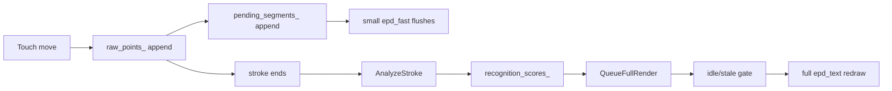

# Glyph Protractor Algorithm for PaperS3 Handwriting Recognition

This project note documents how the Protractor-style glyph recognizer is implemented in the PaperS3 firmware work, especially in `0076-papers3-protractor-trainer` and `0077-papers3-alphabet-graffiti`. The recognizer is not a general handwriting engine. It is a compact, user-trained, single-stroke classifier designed to run locally on an ESP32-S3 with an e-paper UI and touch input.

> [!summary]
> The recognizer works by converting a stroke into a normalized vector and comparing that vector to saved template vectors.
>
> The operational pipeline is:
> 1. capture raw touch points from the GT911 path through `M5Unified`
> 2. resample the stroke to a fixed point count
> 3. center the points around their centroid
> 4. rotate them into a canonical frame
> 5. flatten them into a normalized vector
> 6. compare against each recorded template with `OptimalCosineDistance`
> 7. rank matches by cosine similarity
> 8. in `TRAIN` mode, optionally save the vector as a template
> 9. in `WRITE` mode, append the best glyph if it clears an acceptance threshold
>
> In `0077`, the recognizer also persists templates to `/spiffs/glyph_templates.txt`, allowing the user to train part of the alphabet and still switch immediately into writing mode.

## Why this project exists

A touch display alone is not enough to make handwriting usable. The system needs a way to turn a path of points into a compact representation that survives translation, scale differences, and some rotational variation. On the PaperS3, the problem is stricter than in a browser demo because the device has limited resources and a slow e-paper display. The algorithm must therefore be:

- lightweight
- deterministic
- understandable by a firmware developer
- easy to integrate into a touch-first UI

The Protractor-style recognizer fits those constraints well. It gives a clean pipeline, predictable math, and a simple "best template wins" interpretation that is easy to present to a user.

## Scope and limits

This recognizer is intentionally narrower than a phone keyboard or ML handwriting model.

It assumes:

- one stroke per glyph
- user-specific templates
- finite template set
- no language model correction layer

It does not try to solve:

- multi-stroke letters
- cursive word segmentation
- writer-independent recognition
- punctuation-heavy freeform text

That narrow scope is a feature, not a bug. It keeps the system teachable and debuggable.

## Current implementation status

The algorithm appears in two stages in this repo.

`0076-papers3-protractor-trainer` proved that the browser demo could be translated into ESP-IDF C++ and exercised on PaperS3 with a slot-based trainer UI.

`0077-papers3-alphabet-graffiti` extended that into a real app with:

- `A-Z` and `0-9` template slots
- `TRAIN` mode
- `WRITE` mode
- persistent SPIFFS storage
- live text appending
- deferred UI refresh in write mode so input capture stays ahead of e-paper refresh latency

## Top-level architecture

```mermaid
flowchart TD
    A[Finger or stylus] --> B[GT911 touch controller]
    B --> C[M5GFX touch driver]
    C --> D[M5Unified Touch facade]
    D --> E[AlphabetApp raw_points_]
    E --> F[Resample]
    F --> G[Vectorize]
    G --> H[OptimalCosineDistance]
    H --> I[Recognition ranking]
    I --> J[TRAIN: save template]
    I --> K[WRITE: append glyph]
    J --> L[SPIFFS glyph store]
    L --> M[/spiffs/glyph_templates.txt]
```

The architecture has three layers:

- input collection
- recognition math
- mode-specific action and persistence

That separation matters. If recognition quality is bad, you need to know whether the issue is in the raw stroke capture, the normalization math, or the post-match decision logic.

## Important files

The most important implementation files are:

- `0077-papers3-alphabet-graffiti/main/protractor_math.h`
- `0077-papers3-alphabet-graffiti/main/protractor_math.cpp`
- `0077-papers3-alphabet-graffiti/main/alphabet_app.h`
- `0077-papers3-alphabet-graffiti/main/alphabet_app.cpp`
- `0077-papers3-alphabet-graffiti/main/glyph_store.h`
- `0077-papers3-alphabet-graffiti/main/glyph_store.cpp`
- `0076-papers3-protractor-trainer/main/protractor_math.cpp`
- `0076-papers3-protractor-trainer/main/trainer_app.cpp`

If an intern can explain those files end to end, they understand the whole recognizer.

## Data model

The recognizer operates on a few simple data structures.

### Raw points

The app stores the points sampled from the current stroke in `raw_points_`. These are touch points in screen coordinates, clamped to the canvas rectangle.

### Resampled points

The app creates `resampled_points_` by forcing the stroke into a fixed number of evenly spaced points. In `0077`, the constant is:

```cpp
static constexpr std::size_t kResampleCount = 16;
```

That fixed-length representation is critical because template matching only makes sense when vectors have the same dimension.

### Vectorized gesture

The normalized representation is `VectorizedGesture`, which includes:

- `centroid`
- `indicative_angle_rad`
- `rotation_delta_rad`
- `vector`
- `valid`

The only field used for matching is the final `vector`, but the other values are useful for understanding and debugging the transformation.

### Glyph templates

The persistent training table is an array of `GlyphTemplate`. Each template contains:

- a glyph label such as `A` or `7`
- a `recorded` flag
- a saved normalized vector

In `0077`, the table size is fixed at `36` entries:

- `A-Z`
- `0-9`

## Recognition pipeline in prose

When the user touches the screen inside the drawing canvas, the app starts a new stroke. As the finger moves, the app records points and queues short display segments so the e-paper canvas shows ink without forcing a full screen redraw. When the finger lifts, the stroke is finalized and passed through the recognition pipeline.

The pipeline is intentionally short:

1. the stroke is resampled to a fixed point count
2. the resampled points are centered around their centroid
3. the stroke is rotated into a canonical orientation
4. the centered and rotated points are flattened into a 2D vector
5. the vector is normalized to unit magnitude
6. the vector is compared against every recorded template
7. the best score becomes the candidate match

That pipeline is used in both modes. The difference is not in the math. The difference is in what the app does after a match is produced.

## Step 1: resampling

`Resample()` is implemented in `protractor_math.cpp`. It converts a variable-length point stream into `target_count` equally spaced points along the path length.

This solves a major problem: two users can draw the same shape with wildly different numbers of raw touch points depending on speed, finger pressure, and polling cadence.

Conceptually:

- compute the total path length
- divide by `target_count - 1` to get the desired interval
- walk segment by segment
- insert interpolated points whenever the accumulated distance reaches the next interval
- pad with the last point if necessary

Pseudocode:

```text
Resample(points, target_count):
  if empty: return []
  if one point: repeat it target_count times

  interval = PathLength(points) / (target_count - 1)
  resampled = [first point]
  accumulated = 0

  walk each segment:
    d = distance(segment)
    if accumulated + d >= interval:
      interpolate new point at exact interval boundary
      append point
      insert point into working list
      reset accumulated
    else:
      accumulated += d

  while resampled too short:
    append last point

  return resampled
```

This step is often where low-quality data first becomes visible. If the raw stroke is too short, too jagged, or mostly stationary, the downstream vector will also be poor.

## Step 2: centroid normalization

`Vectorize()` first computes the centroid of the resampled points. The centroid is the average of all x coordinates and the average of all y coordinates.

Why this matters:

- it removes translation as a source of error
- the user can draw the glyph anywhere inside the canvas
- template matching should care about shape, not absolute screen position

After the centroid is computed, every point is shifted so the stroke is centered around `(0, 0)`.

## Step 3: canonical rotation

After centering, `Vectorize()` computes an indicative angle using the first centered point:

```cpp
result.indicative_angle_rad = std::atan2(centered.front().y, centered.front().x);
```

Then it rotates the whole gesture toward a canonical frame.

In the default mode used by the handwriting app, the rotation delta is:

```cpp
result.rotation_delta_rad = -result.indicative_angle_rad;
```

That means the gesture is rotated so its indicative direction is normalized. The implementation also supports an `orientation_sensitive` mode that snaps to a 45-degree bucket, but the handwriting app uses the default orientation-insensitive behavior.

This is one of the core reasons the recognizer is practical: the user does not need to reproduce the exact same absolute angle every time.

## Step 4: vectorization and magnitude normalization

Each centered point is rotated by the computed delta. The rotated coordinates are flattened into a single alternating vector:

```text
[x0, y0, x1, y1, x2, y2, ...]
```

Then the vector is normalized by its Euclidean magnitude so the entire representation has unit length.

That normalization helps absorb scale differences. A larger letter and a smaller letter can still produce similar normalized vectors if the shape is consistent.

Pseudocode:

```text
Vectorize(points):
  if fewer than 2 points: invalid

  centroid = average(points)
  centered = points - centroid
  angle = atan2(centered[0].y, centered[0].x)
  delta = -angle

  vector = []
  mag2 = 0

  for point in centered:
    rx = point.x * cos(delta) - point.y * sin(delta)
    ry = point.y * cos(delta) + point.x * sin(delta)
    vector.append(rx)
    vector.append(ry)
    mag2 += rx*rx + ry*ry

  if mag2 == 0: invalid
  magnitude = sqrt(mag2)
  divide every component by magnitude
  return valid vectorized gesture
```

## Step 5: similarity with `OptimalCosineDistance`

The matching function is:

`OptimalCosineDistance(lhs, rhs)`

This compares two normalized 2D vectors of equal length. If the vectors are incompatible, it returns `pi`, which behaves like a worst-case distance.

The implementation accumulates two values, `a` and `b`, over component pairs, computes an optimal alignment angle with `atan2(b, a)`, and then converts the best achievable cosine-style similarity into an angular distance through `acos(...)`.

The result is:

- smaller distance = more similar
- higher `cos(distance)` = better match

The app therefore stores and sorts recognition scores by `cosine_score = cos(distance)`.

Pseudocode:

```text
OptimalCosineDistance(lhs, rhs):
  if size mismatch or odd length: return pi

  a = 0
  b = 0
  for each xy pair:
    a += lhs.x * rhs.x + lhs.y * rhs.y
    b += lhs.x * rhs.y - lhs.y * rhs.x

  angle = atan2(b, a)
  value = clamp(a*cos(angle) + b*sin(angle), -1, 1)
  return acos(value)
```

## Recognition ranking

In `AlphabetApp::RecognizeCurrentStroke()`, the app:

- skips unrecorded glyphs
- computes distance against every recorded template
- computes `cos(distance)` for each one
- sorts descending by cosine score

That yields an ordered list from best to worst candidate.

This is a straightforward brute-force classifier, but that is acceptable here because:

- the template set is tiny
- the vectors are short
- the recognizer runs only on stroke completion, not every frame

## Training mode and write mode share one engine

This is the most important architectural choice in `0077`.

`TRAIN` mode and `WRITE` mode are not separate recognizers. They are two different consumers of the same recognition result.

In `TRAIN` mode:

- the user selects one glyph slot
- draws a sample
- optionally saves the resulting vector into that slot
- can also delete or reload stored templates

In `WRITE` mode:

- the user draws a stroke
- the stroke is recognized against all recorded templates
- the best glyph is appended to `write_buffer_` if it clears the acceptance threshold

This shared-pipeline design is the correct one because it prevents training and inference from diverging over time.

## Acceptance threshold

In `0077`, write mode uses:

```cpp
static constexpr float kWriteAcceptanceThreshold = 0.82f;
```

This is a policy value, not a mathematical truth. It controls when the best match is considered good enough to auto-append.

Tradeoff:

- lower threshold: more aggressive typing, more false positives
- higher threshold: fewer mistakes, more missed intended glyphs

An intern should treat this as a tuning knob derived from user testing, not as a permanent constant ordained by the algorithm.

## Persistence layer

The persistent storage module is `GlyphStore`.

The SPIFFS mount path is:

`/spiffs`

The saved template file is:

`/spiffs/glyph_templates.txt`

The partition label is:

`storage`

The file begins with a version header:

`glyph-store-v1`

Each subsequent line stores:

- the glyph label
- the vector length
- the vector components

Example logical format:

```text
glyph-store-v1
A 32 0.123456 -0.234567 ...
B 32 ...
7 32 ...
```

This format is intentionally simple.

Why that is a good choice:

- easy to inspect manually
- easy to version
- easy to rewrite fully on save
- no binary parsing or alignment issues

## Glyph indexing model

The glyph mapping is fixed:

- indices `0-25` map to `A-Z`
- indices `26-35` map to `0-9`

That mapping lives in:

- `GlyphStore::GlyphForIndex()`
- `GlyphStore::IndexForGlyph()`

This is much simpler than letting users name templates dynamically, which would require a keyboard, metadata UI, and more storage bookkeeping.

## Touch capture and queued drawing

The handwriting app has an important performance refinement that the project note should make explicit.

PaperS3 redraws are slow enough that naive drawing can make fast writing feel laggy. To reduce that coupling, `0077` keeps two kinds of display work separate:

- queued live stroke segments in `pending_segments_`
- deferred full UI redraws via `QueueFullRender()`

The constants are:

- `kMaxQueuedSegmentsPerFlush = 8`
- `kWriteUiIdleRefreshMs = 180`
- `kWriteUiMaxRefreshLatencyMs = 600`

The behavior is:

- while the user is drawing, raw points keep accumulating
- short line segments are flushed in small batches in `epd_fast`
- expensive full-screen updates are delayed until the user is idle long enough or the UI has been stale too long

This is not part of Protractor math itself, but it is part of making the recognizer usable on an e-paper device.

Diagram:



## Recognition pseudocode end to end

```text
OnTouchBegin(point):
  clear current stroke state
  raw_points = [ClampToCanvas(point)]
  pending_segments = [(point, point)]

OnTouchMove(point):
  clamped = ClampToCanvas(point)
  raw_points.append(clamped)
  pending_segments.append((last_draw_point, clamped))
  last_draw_point = clamped

OnTouchEnd():
  resampled_points = Resample(raw_points, 16)
  current_gesture = Vectorize(resampled_points)
  recognition_scores = []

  for each recorded template:
    distance = OptimalCosineDistance(template.vector, current_gesture.vector)
    score = cos(distance)
    recognition_scores.append(template, score)

  sort recognition_scores by score descending

  if mode == TRAIN:
    show results and allow save to selected glyph
  if mode == WRITE:
    if best_score >= 0.82:
      append best glyph to write buffer
    else:
      show rejected status
```

## Failure modes and debugging clues

### Too few raw points

If the stroke is very short or nearly a tap, the vectorization step may be invalid or low quality. Watch for strokes that visually look like dots rather than letters.

### Similar-looking templates

If the user trains templates that are too visually close, the recognizer can rank the wrong glyph first even though the math is behaving correctly. This is a dataset problem, not always an algorithm bug.

### Inconsistent user drawing style

Because this is template-based recognition, the user trains the recognizer with their own style. If they later draw the same glyph in a substantially different style, the match quality will drop.

### Threshold too high or too low

If recognition feels conservative, inspect the acceptance threshold. If it feels noisy, the same constant is still one of the first places to look.

### Storage looks empty after reboot

If trained templates disappear:

- confirm the `storage` partition exists
- confirm SPIFFS mounted successfully
- inspect `/spiffs/glyph_templates.txt`
- verify the version header matches `glyph-store-v1`

### Display feels too slow

If writing feels laggy, the recognizer may not be the problem. The display scheduling may be the real bottleneck. Inspect `pending_segments_`, deferred render logic, and e-paper mode selection before changing the math.

## Design choices worth preserving

Several choices in the current implementation are correct and should not be casually removed:

- one recognition pipeline shared across training and writing
- simple fixed glyph table instead of dynamic labels
- text-file SPIFFS persistence
- result ranking by cosine score
- deferred full redraws in write mode
- explicit runtime state in one application class for a still-small UI

Those choices reduce complexity without blocking future extension.

## Likely future extensions

The next useful improvements would be:

- multiple templates per glyph instead of one
- punctuation support
- better rejection logic for ambiguous matches
- per-glyph statistics so the user can see weak templates
- optional visual preview of the best template match
- a compact on-device export or backup format for templates

If those are added, keep the same core principle: new features should wrap the normalization and distance pipeline, not fork it into separate implementations.

## Companion documents

For deeper implementation detail, the best long-form docs in this repo are:

- `ttmp/2026/03/21/ESP-32-PAPERS3-PROTRACTOR--papers3-protractor-gesture-trainer-and-recognizer/design-doc/01-papers3-protractor-gesture-trainer-analysis-design-and-implementation-guide.md`
- `ttmp/2026/03/21/ESP-33-PAPERS3-ALPHABET-GRAFFITI--papers3-alphabet-graffiti-recognizer-with-persistent-templates/design-doc/01-papers3-alphabet-graffiti-analysis-design-and-implementation-guide.md`

Those documents are better than this project note for ticket-level implementation history, but this note is the better short entry point for understanding how the recognizer actually works.

## Project working rule

Do not tune thresholds, storage, UI, and vector math all at once. Change one layer, measure its effect, and keep the recognition pipeline itself understandable.
