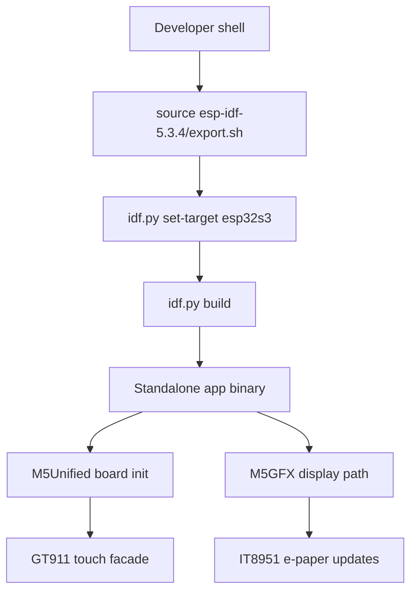
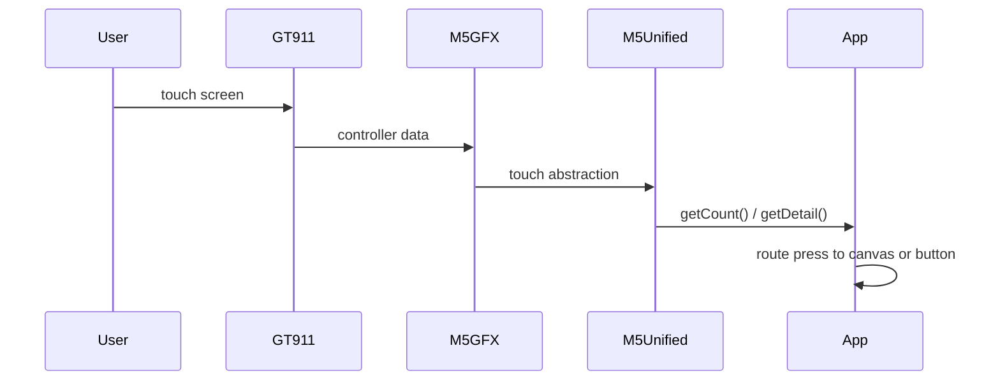

# PaperS3 Firmware Setup and Build Workflow

PaperS3 firmware development in this repo is built around one practical decision: do not rediscover board support from scratch. The correct display bring-up, GT911 touch path, and e-paper update behavior already exist in the donor `M5PaperS3-UserDemo` project, so new firmware apps in `esp32-s3-m5` are structured as small product-specific shells layered on top of those donor components.

> [!summary]
> The working model for PaperS3 firmware in this repo is:
> 1. create a new standalone ESP-IDF app directory such as `0075`, `0076`, or `0077`
> 2. point `EXTRA_COMPONENT_DIRS` at `../../M5PaperS3-UserDemo/components`
> 3. pin the project to ESP-IDF `5.3.4`
> 4. prefer the USB Serial/JTAG console instead of UART
> 5. keep the app entrypoint tiny and move device behavior into one explicit runtime class
> 6. build with `source /home/manuel/esp/esp-idf-5.3.4/export.sh && idf.py set-target esp32s3 && idf.py build`
>
> If a new intern understands that pattern, they can build, clone, and extend every PaperS3 app in this repo without reverse-engineering the full donor firmware.

## Why this project exists

The PaperS3 board is not just another generic ESP32-S3 target. It has a large e-paper display, a GT911 touch controller, and board-specific display behavior exposed through M5Stack's `M5Unified` and `M5GFX` abstractions. Those abstractions already exist in the donor firmware, but the donor app itself is too large and too product-specific to be a good day-one learning target for an intern.

This project note exists to document the repeatable build workflow that was used to create the current PaperS3 examples in this repository:

- `0075-papers3-touch-draw-demo`
- `0076-papers3-protractor-trainer`
- `0077-papers3-alphabet-graffiti`

These are not separate hardware integration efforts. They are separate applications that all reuse the same proven board support path.

## Current project status

As of 2026-03-21, the repo already contains three validated PaperS3 firmware examples:

- `0075-papers3-touch-draw-demo`
  A minimal touch drawing app with a clear button.
- `0076-papers3-protractor-trainer`
  A trainer UI for experimenting with Protractor-style gesture templates.
- `0077-papers3-alphabet-graffiti`
  A two-mode handwriting app with persistent `A-Z` and `0-9` templates stored on SPIFFS.

All three were built against ESP-IDF `5.3.4`. The newer handwriting app also adds a storage partition and a deferred redraw strategy so fast input is not as tightly coupled to the e-paper refresh latency.

## Repo shape

The important directories are:

```text
echo-base-documentation/
├── M5PaperS3-UserDemo/
│   ├── components/
│   │   ├── M5Unified/
│   │   └── M5GFX/
│   └── main/
│       └── hal/
└── esp32-s3-m5/
    ├── 0075-papers3-touch-draw-demo/
    ├── 0076-papers3-protractor-trainer/
    ├── 0077-papers3-alphabet-graffiti/
    └── ttmp/2026/03/21/
```

The donor project and the example apps live next to each other. That is why the relative donor component path is `../../M5PaperS3-UserDemo/components` from each example project root.

## Core architecture



The build stack is conceptually simple:

- ESP-IDF provides the toolchain, Kconfig system, partitioning, flash tools, and runtime.
- The app project provides `CMakeLists.txt`, `sdkconfig.defaults`, `partitions.csv`, and `main/`.
- `EXTRA_COMPONENT_DIRS` pulls in the donor M5Stack components without copying them.
- Application-specific code stays in the app folder and should not modify donor code unless a true platform bug is discovered.

## The donor firmware relationship

The donor firmware is:

`/home/manuel/workspaces/2025-12-21/echo-base-documentation/M5PaperS3-UserDemo`

This matters for three reasons.

First, it proves the board support already works. A new app should not reimplement low-level display or touch setup if the donor stack already does that correctly.

Second, it gives a stable path into the abstractions that matter to application code:

- `M5.begin(...)`
- `M5.update()`
- `M5.Touch.getCount()`
- `M5.Touch.getDetail()`
- `M5.Display.setEpdMode(...)`
- `M5.Display.startWrite()`
- `M5.Display.endWrite()`

Third, it defines the physical behavior of the board more reliably than memory or guesswork. When something feels unclear, the donor code is the source of truth.

Important donor references:

- `M5PaperS3-UserDemo/main/hal/hal.cpp`
- `M5PaperS3-UserDemo/main/hal/hal.h`
- `M5PaperS3-UserDemo/components/M5Unified/src/utility/Touch_Class.hpp`
- `M5PaperS3-UserDemo/components/M5GFX/src/lgfx/v1/touch/Touch_GT911.cpp`
- `M5PaperS3-UserDemo/components/M5GFX/src/lgfx/v1/panel/Panel_IT8951.cpp`
- `M5PaperS3-UserDemo/components/M5GFX/src/lgfx/v1/LGFXBase.hpp`

## How a new PaperS3 app should be structured

The current apps all follow the same pattern.

```text
0077-papers3-alphabet-graffiti/
├── CMakeLists.txt
├── README.md
├── sdkconfig.defaults
├── partitions.csv
└── main/
    ├── CMakeLists.txt
    ├── app_main.cpp
    ├── runtime-specific headers and cpp files
```

This is the preferred shape for a new app:

- `app_main.cpp` should stay tiny.
- A single runtime class should own the application loop for small apps.
- Algorithm-heavy or storage-heavy code should be split into its own module.
- The donor stack should be reused, not vendored into each app.

An intern should read this as a rule of thumb: keep board setup consistent, and vary only the product logic.

## Minimal build-critical files

### `CMakeLists.txt`

At project root, the important line is:

```cmake
set(EXTRA_COMPONENT_DIRS "../../M5PaperS3-UserDemo/components")
```

That line is the bridge to the donor M5Stack components. If it points to the wrong path, CMake configuration fails before any code is compiled.

### `sdkconfig.defaults`

The app defaults are responsible for:

- `esp32s3` target selection
- custom partition table selection
- flash and PSRAM assumptions
- console transport selection

The repo policy for ESP32-S3 apps is to prefer USB Serial/JTAG:

```text
CONFIG_ESP_CONSOLE_USB_SERIAL_JTAG=y
# CONFIG_ESP_CONSOLE_UART is not set
```

That matters because UART pins on these devices are often reused for peripherals, and a UART console can collide with actual product I/O.

### `partitions.csv`

Every PaperS3 app needs an explicit partition story.

For the simple demos, the partition table is mostly standard. For the graffiti app, a `storage` partition is also required for SPIFFS template persistence.

### `main/CMakeLists.txt`

This defines the app sources and `REQUIRES` list. In the handwriting app, the main component requires `M5Unified` and `spiffs`, which is exactly what you would expect from a touch + storage UI.

## Build procedure

The verified build flow used in this repo is:

```bash
cd /home/manuel/workspaces/2025-12-21/echo-base-documentation/esp32-s3-m5/0077-papers3-alphabet-graffiti
source /home/manuel/esp/esp-idf-5.3.4/export.sh
idf.py set-target esp32s3
idf.py build
```

The same pattern applies to `0075` and `0076`.

Why each step exists:

- `cd ...` ensures relative paths such as `EXTRA_COMPONENT_DIRS` resolve correctly.
- `source .../export.sh` loads the ESP-IDF toolchain, Python environment, and build helpers.
- `idf.py set-target esp32s3` aligns the build with the actual MCU target.
- `idf.py build` runs CMake configure, Kconfig resolution, compilation, linking, and image generation.

## Flash and monitor procedure

The README pattern used by these projects is:

```bash
cd /home/manuel/workspaces/2025-12-21/echo-base-documentation/esp32-s3-m5/0077-papers3-alphabet-graffiti
source /home/manuel/esp/esp-idf-5.3.4/export.sh
idf.py -p /dev/ttyACM0 flash monitor
```

For practical use, the serial port may vary. The important part is that the console transport is still USB Serial/JTAG, not a repurposed UART line.

## Runtime model

The app runtime in the current PaperS3 examples follows this shape:

```cpp
extern "C" void app_main(void)
{
    SomeApp app;
    app.Run();
}
```

Inside `Run()`, the app typically:

1. initializes the board
2. sets display rotation and text defaults
3. builds UI layout rectangles
4. loads persistent state if needed
5. renders the initial UI
6. enters an infinite event loop using `M5.update()`

Pseudocode:

```text
Run():
  InitBoard()
  BuildLayout()
  LoadStateIfNeeded()
  RenderFullUi()

  loop forever:
    M5.update()
    HandleTouch()
    ProcessPendingDisplayWork()
    delay(loop_interval_ms)
```

This is intentionally direct. For device demos, explicit control flow is easier to debug than an over-abstracted framework.

## Display behavior and why it matters

The PaperS3 is e-paper, not a fast LCD. That changes how you think about UI work.

The current apps rely on two practical update styles:

- full UI redraws in `epd_text`
- live stroke or localized updates in `epd_fast`

That distinction is visible in the handwriting apps. Static UI panels, text labels, and stable screen states use a slower but better-looking mode. Live drawing paths use a faster mode because user interaction must remain responsive.

An intern should internalize this immediately: a PaperS3 UI is always a negotiation between readability, ghosting, latency, and how much of the screen you redraw.

## Touch path

The touch route is:



The important practical interface for application code is not the GT911 register set. It is the `M5Unified` touch facade:

- `M5.Touch.getCount()`
- `M5.Touch.getDetail()`

That is enough for the existing demos.

## A good new-app checklist

When building a new PaperS3 firmware app, do the work in this order:

1. create the new app directory and root `CMakeLists.txt`
2. wire `EXTRA_COMPONENT_DIRS` to `../../M5PaperS3-UserDemo/components`
3. add `sdkconfig.defaults`
4. add `partitions.csv`
5. add `main/CMakeLists.txt`
6. add a tiny `app_main.cpp`
7. add one runtime class with `Run()`
8. verify `idf.py build`
9. only after a successful build, add real UI or algorithm behavior

This order is not stylistic. It isolates integration failures before product code complicates the picture.

## Common failure modes

### Wrong donor component path

This already happened once during the PaperS3 work. The first attempted path was wrong and CMake reported that the directory specified in `EXTRA_COMPONENT_DIRS` did not exist.

What that teaches:

- always resolve the relative path from the app directory, not from memory
- a path that looks visually correct may still be one directory off

### Forgetting to source ESP-IDF 5.3.4

If the expected Python environment, toolchain, or CMake macros are missing, the first thing to check is whether `export.sh` for the correct ESP-IDF version was sourced in the current shell.

### Mixing console assumptions

If someone changes the console back to UART without checking pin usage, they can create a bug that looks like random peripheral corruption. In this repo, USB Serial/JTAG is the safe default and should remain the default unless there is a documented reason to override it.

### Missing partition support for storage

If an app needs SPIFFS and there is no `storage` partition, persistence will fail regardless of how correct the C++ logic looks.

### Over-redrawing the screen

On e-paper, a brute-force redraw loop can make the app feel broken even when the code is technically correct. If responsiveness matters, redraw less, localize updates, and defer expensive full refreshes until idle periods.

## File references worth learning first

If a new intern has one afternoon to get oriented, these are the best first reads:

- `0075-papers3-touch-draw-demo/sdkconfig.defaults`
- `0075-papers3-touch-draw-demo/CMakeLists.txt`
- `0075-papers3-touch-draw-demo/main/app_main.cpp`
- `0076-papers3-protractor-trainer/main/trainer_app.cpp`
- `0077-papers3-alphabet-graffiti/main/alphabet_app.cpp`
- `0077-papers3-alphabet-graffiti/main/glyph_store.cpp`
- `0077-papers3-alphabet-graffiti/partitions.csv`
- `M5PaperS3-UserDemo/main/hal/hal.cpp`
- `M5PaperS3-UserDemo/components/M5Unified/src/utility/Touch_Class.hpp`
- `M5PaperS3-UserDemo/components/M5GFX/src/lgfx/v1/panel/Panel_IT8951.cpp`

These files cover the board path, the build path, and the application path.

## Mental model for an intern

The easiest way to think about this codebase is:

- donor project = proven board support and low-level behavior
- numbered tutorial project = one product idea built on that support
- ticket docs = why the project was designed that way

That means when you are confused, you should ask three questions in this order:

1. is this a hardware/platform question or an application question?
2. if it is platform-related, does the donor code already answer it?
3. if it is application-related, which numbered tutorial app is closest to the behavior I want?

That sequence prevents unnecessary rewriting.

## Implementation pseudocode for a fresh PaperS3 app

```text
create_new_app(name):
  add root CMakeLists.txt with EXTRA_COMPONENT_DIRS
  add sdkconfig.defaults for esp32s3 + USB Serial/JTAG
  add partitions.csv
  add main/CMakeLists.txt
  add app_main.cpp
  add app runtime class

app_main():
  app = AppRuntime()
  app.Run()

AppRuntime.Run():
  initialize M5
  set rotation
  set text defaults
  compute layout rectangles
  draw initial UI
  loop:
    poll touch
    update app state
    perform deferred display work
```

## Important companion documents

The best long-form design docs already written for this repo are:

- `ttmp/2026/03/21/ESP-31-PAPERS3-DRAW-DEMO--papers3-touch-drawing-demo-firmware-and-implementation-guide/design-doc/02-papers3-touch-draw-demo-analysis-design-and-implementation-guide.md`
- `ttmp/2026/03/21/ESP-32-PAPERS3-PROTRACTOR--papers3-protractor-gesture-trainer-and-recognizer/design-doc/01-papers3-protractor-gesture-trainer-analysis-design-and-implementation-guide.md`
- `ttmp/2026/03/21/ESP-33-PAPERS3-ALPHABET-GRAFFITI--papers3-alphabet-graffiti-recognizer-with-persistent-templates/design-doc/01-papers3-alphabet-graffiti-analysis-design-and-implementation-guide.md`

Those are the best references when you need more implementation detail than a project note should carry.

## Near-term next steps

- add a fourth PaperS3 app only by reusing the same donor/build pattern, not by forking the donor app directly
- keep `sdkconfig.defaults` aligned with the local USB Serial/JTAG policy
- treat partition changes as part of product design, not as an afterthought
- document hardware test results separately from build success

## Project working rule

Do not modify PaperS3 product logic and board integration at the same time unless the bug genuinely spans both layers. First confirm the donor/build path is sound, then change the app.
