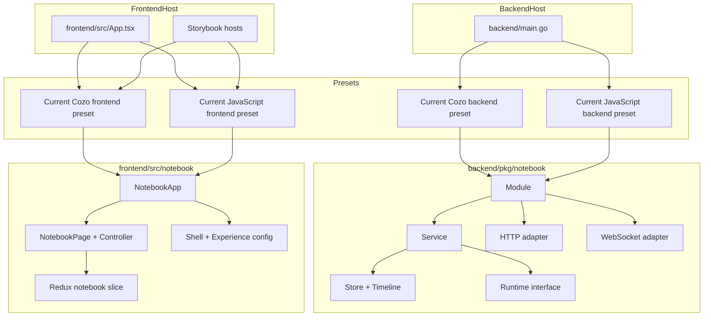
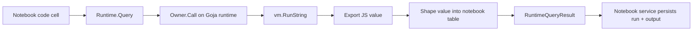

# CozoDB Editor

This project started as a Cozo-focused notebook environment with a Go backend, React frontend, notebook persistence, and AI hints. It has now crossed an important architectural boundary: the original Cozo app has been turned into one preset family, and the repository also supports a second preset family where JavaScript is the primary language through a `go-go-goja` runtime.

> [!summary]
> The project currently has three important identities:
> 1. a reusable notebook package split across backend and frontend
> 2. a current Cozo preset that still works on top of that package
> 3. a current JavaScript preset that proves the package can host a second runtime family without forking

## Why this project exists

The original problem was not just "run Cozo queries in a browser." The deeper problem was how to build a notebook-like environment that could support:

- durable notebook documents
- executable code cells
- runtime resets
- AI assistance
- multiple host environments
- multiple language/runtime families

The repository therefore evolved from a single-purpose Cozo editor into a packaging exercise: can one notebook system support multiple presets without collapsing into duplicated frontend pages and duplicated backend services?

That question now has a credible "yes" answer.

## Current project status

The project is still active, but the packaging foundation is much stronger than before.

What already exists:

- shared backend notebook module in `backend/pkg/notebook`
- shared frontend notebook module in `frontend/src/notebook`
- current Cozo preset on backend and frontend
- current JavaScript preset on backend and frontend
- Storybook + MSW validation for isolated UI work
- AI hint/diagnosis transport via WebSockets
- notebook persistence and timeline state
- a detailed JavaScript preset postmortem for onboarding and architecture review
- a repeatable playbook for adding the next language preset on backend and frontend

What is still incomplete:

- a richer JavaScript-specific structured event vocabulary
- a more neutral naming cleanup around legacy `Relation`-style runtime methods
- richer non-tabular rendering for more complex JavaScript values
- additional host surfaces beyond the current app shell and Storybook hosts

## Project shape

At a high level, the project now has three layers:

1. **Shared notebook infrastructure**
   - backend notebook service, store, timeline, HTTP, WebSocket
   - frontend notebook page, store, shell, experience config
2. **Preset families**
   - current Cozo preset
   - current JavaScript preset
3. **Host entrypoints**
   - Go `main.go`
   - React `App.tsx`
   - Storybook hosts for isolated validation

## Architecture



Key code locations:

- `backend/main.go`
- `backend/pkg/notebook/`
- `backend/pkg/api/`
- `frontend/src/notebook/`
- `frontend/src/storybook/notebookApiHandlers.ts`
- `ttmp/2026/03/22/COZODB-014--javascript-notebook-preset-with-go-go-goja-runtime-and-frontend-surface/`

## Ticket progression

The project’s current shape is easiest to understand through the recent tickets:

- `COZODB-011`
  - React/Redux decomposition
  - Storybook isolation
  - CSS convergence work
- `COZODB-012`
  - backend notebook package ownership
  - current app rewired through notebook-owned HTTP/WS
- `COZODB-013`
  - packaging API design
  - preset framing
  - current app reframed as preset `#1`
- `COZODB-014`
  - current JavaScript preset implemented as preset `#2`

The important idea is that `COZODB-014` only worked cleanly because the earlier tickets had already moved the system toward preset composition.

## Current documentation surface

The repository now has a much better documentation surface than it did when the project was still mostly a single Cozo app. A new engineer does not have to reverse-engineer the architecture entirely from code anymore.

The most important current docs are:

- packaging guide:
  - `/home/manuel/code/wesen/2026-03-14--cozodb-editor/ttmp/2026/03/22/COZODB-013--notebook-packaging-api-design-and-current-app-preset-guide/design-doc/01-notebook-packaging-api-design-and-current-app-preset-implementation-guide.md`
- JavaScript preset implementation guide:
  - `/home/manuel/code/wesen/2026-03-14--cozodb-editor/ttmp/2026/03/22/COZODB-014--javascript-notebook-preset-with-go-go-goja-runtime-and-frontend-surface/design-doc/01-javascript-notebook-preset-implementation-guide.md`
- JavaScript preset postmortem:
  - `/home/manuel/code/wesen/2026-03-14--cozodb-editor/ttmp/2026/03/22/COZODB-014--javascript-notebook-preset-with-go-go-goja-runtime-and-frontend-surface/design-doc/02-javascript-notebook-preset-postmortem-and-intern-analysis.md`
- add-a-language playbook:
  - `/home/manuel/code/wesen/2026-03-14--cozodb-editor/ttmp/2026/03/22/COZODB-014--javascript-notebook-preset-with-go-go-goja-runtime-and-frontend-surface/playbook/01-add-a-new-language-preset-on-backend-and-frontend.md`

That last playbook matters because the project is no longer only about "support JavaScript." The architecture is now trying to support a pattern for future language presets.

## Implementation details

The implementation details below are the part a new engineer should read most carefully. This section is intentionally detailed because it is the shortest path to understanding how the repository actually works.

### Shared backend notebook module

The shared backend notebook package is responsible for the notebook workflow itself. It does not care whether the runtime is Cozo or JavaScript.

Its responsibilities are:

- notebook document storage
- cell order and mutation
- run records and runtime outputs
- runtime reset plumbing
- timeline snapshot storage
- HTTP route mounting
- WebSocket hint/diagnosis transport

The runtime is only one dependency inside that workflow.

Read these files first:

- `/home/manuel/code/wesen/2026-03-14--cozodb-editor/backend/pkg/notebook/service.go`
- `/home/manuel/code/wesen/2026-03-14--cozodb-editor/backend/pkg/notebook/http.go`
- `/home/manuel/code/wesen/2026-03-14--cozodb-editor/backend/pkg/notebook/websocket.go`
- `/home/manuel/code/wesen/2026-03-14--cozodb-editor/backend/pkg/notebook/store.go`

### Why the runtime seam mattered so much

The most important backend refactor was changing the runtime seam so that the shared notebook package owned its own runtime types.

Before that shift, the contract effectively said:

```go
type Runtime interface {
    Query(...) (*cozo.QueryResult, error)
    DescribeRelation(...) (*cozo.RelationInfo, error)
}
```

That is architecturally wrong for a multi-preset notebook package.

After the refactor, the notebook package owns its own result vocabulary:

```go
type RuntimeQueryResult struct {
    OK      bool
    Headers []string
    Rows    [][]any
    Took    float64
    Code    string
    Message string
    Display string
}
```

This let Cozo become an adapter and JavaScript become a sibling runtime instead of a compatibility hack.

### Backend preset composition

The backend now composes presets like this:

```pseudocode
switch preset:
    case "cozo":
        runtime = cozo manager -> notebook adapter
        profile = current Cozo defaults
        websocket = current Cozo websocket config
    case "javascript":
        runtime = go-go-goja runtime manager
        profile = current JavaScript defaults
        websocket = current JavaScript websocket config

module = notebook.NewModule(
    runtime,
    store,
    timeline,
    http routes,
    websocket routes,
)
```

That composition happens in:

- `/home/manuel/code/wesen/2026-03-14--cozodb-editor/backend/pkg/notebook/current_cozo.go`
- `/home/manuel/code/wesen/2026-03-14--cozodb-editor/backend/pkg/notebook/current_javascript.go`
- `/home/manuel/code/wesen/2026-03-14--cozodb-editor/backend/main.go`

### JavaScript runtime manager

The JavaScript runtime manager lives in:

- `/home/manuel/code/wesen/2026-03-14--cozodb-editor/backend/pkg/notebook/javascript_runtime.go`

It uses the explicit runtime lifecycle from:

- `/home/manuel/code/wesen/corporate-headquarters/go-go-goja/engine/factory.go`
- `/home/manuel/code/wesen/corporate-headquarters/go-go-goja/engine/runtime.go`

Why this was the right choice:

- the runtime is owned
- reset is naturally implemented by replacement
- module registration is explicit
- runtime calls can be serialized through the runtime owner

Execution flow:



The shaping rules are intentionally simple:

- arrays of objects become tables
- arrays of arrays become tables
- objects become key/value tables
- primitives become one-cell tables
- nested values become JSON strings in cells

This was chosen because the existing frontend already had a strong table renderer.

### JavaScript globals and the `globalThis` rule

One of the most important lessons of the JavaScript preset is that "state that persists across evaluations" is not identical to "state that appears in the global object."

Top-level `const` and `let` bindings can persist between evaluations, but they do not automatically become enumerable properties on `globalThis`.

That matters because the notebook runtime still exposes a schema/listing surface used by hints and by host APIs. The current rule is:

- the JavaScript runtime lists preset-native modules
- plus `globalThis`-visible user objects

That is why the JavaScript starter cell uses `globalThis.users = ...` instead of a plain `const users = ...` assignment.

This rule keeps the runtime introspection contract honest.

### Shared frontend notebook package

The frontend shared package now feels much closer to a real library surface than to app-local code.

Its responsibilities include:

- notebook page controller
- Redux-driven notebook state
- card rendering and output rendering
- shell config and experience config
- sem event projection integration

Important files:

- `/home/manuel/code/wesen/2026-03-14--cozodb-editor/frontend/src/notebook/NotebookApp.tsx`
- `/home/manuel/code/wesen/2026-03-14--cozodb-editor/frontend/src/notebook/NotebookPage.tsx`
- `/home/manuel/code/wesen/2026-03-14--cozodb-editor/frontend/src/notebook/useNotebookPageController.ts`
- `/home/manuel/code/wesen/2026-03-14--cozodb-editor/frontend/src/notebook/state/notebookSlice.ts`

### Frontend preset composition

The frontend preset wrappers are deliberately parallel:

- Cozo preset
  - `currentCozo.tsx`
  - `currentCozoConfig.ts`
- JavaScript preset
  - `currentJavaScript.tsx`
  - `currentJavaScriptConfig.ts`

Each preset wrapper decides:

- which store factory to use
- which shell config to use
- which experience config to use
- which sem handler registration path to use
- which websocket path to use

That means the shared page, state, and CSS do not have to fork.

### Why `semHandlers.ts` was a meaningful cleanup

Before the JavaScript preset, the sem handler type lived in a Cozo-named file. That sounds minor, but it means shared notebook code was importing a shared type from a preset-specific module.

The new file:

- `/home/manuel/code/wesen/2026-03-14--cozodb-editor/frontend/src/notebook/semHandlers.ts`

fixes that by making the generic sem handler boundary truly generic. This is exactly the kind of cleanup that keeps preset systems healthy over time.

### Storybook and MSW as architecture tests

Storybook is not just UI candy in this repo. It is one of the main proofs that the package boundary is real.

The JavaScript preset coverage includes:

- `/home/manuel/code/wesen/2026-03-14--cozodb-editor/frontend/src/notebook/CurrentJavaScriptNotebookApp.stories.tsx`
- `/home/manuel/code/wesen/2026-03-14--cozodb-editor/frontend/src/notebook/NotebookApp.stories.tsx`
- `/home/manuel/code/wesen/2026-03-14--cozodb-editor/frontend/src/storybook/notebookApiHandlers.ts`

These stories prove:

- the preset wrapper can boot without the live app
- the shared notebook package can be embedded into a different host shell
- the CSS still fits when the preset changes
- the transport layer can be mocked cleanly through MSW

### The new "add a language" path

One of the most useful outcomes of the JavaScript preset work is that the repository now has a clearer recipe for adding the next language.

That recipe is now captured explicitly in:

- `/home/manuel/code/wesen/2026-03-14--cozodb-editor/ttmp/2026/03/22/COZODB-014--javascript-notebook-preset-with-go-go-goja-runtime-and-frontend-surface/playbook/01-add-a-new-language-preset-on-backend-and-frontend.md`

The core rule in that playbook is simple:

- add a new backend preset constructor
- add a new runtime implementation or adapter
- add a new frontend preset config + wrapper
- add Storybook/MSW coverage
- do **not** fork the shared notebook package

In practice, that means the repository has crossed from "interesting refactor" into "repeatable architecture pattern."

## Current user-facing commands

Backend:

```bash
cd /home/manuel/code/wesen/2026-03-14--cozodb-editor/backend
go run . --preset cozo
go run . --preset javascript
```

Frontend:

```bash
cd /home/manuel/code/wesen/2026-03-14--cozodb-editor/frontend
npm run dev
VITE_NOTEBOOK_PRESET=javascript npm run dev
```

Validation:

```bash
cd /home/manuel/code/wesen/2026-03-14--cozodb-editor/backend
go test ./...

cd /home/manuel/code/wesen/2026-03-14--cozodb-editor/frontend
npm test
npm run lint
npx tsc --noEmit
npm run build
VITE_NOTEBOOK_PRESET=javascript npm run build
npm run build-storybook
```

## Important project docs

Ticket docs:

- `/home/manuel/code/wesen/2026-03-14--cozodb-editor/ttmp/2026/03/22/COZODB-011--react-and-redux-granular-component-refactor-with-storybook-isolation/`
- `/home/manuel/code/wesen/2026-03-14--cozodb-editor/ttmp/2026/03/22/COZODB-012--backend-notebook-package-cutover-and-current-app-rewiring/`
- `/home/manuel/code/wesen/2026-03-14--cozodb-editor/ttmp/2026/03/22/COZODB-013--notebook-packaging-api-design-and-current-app-preset-guide/`
- `/home/manuel/code/wesen/2026-03-14--cozodb-editor/ttmp/2026/03/22/COZODB-014--javascript-notebook-preset-with-go-go-goja-runtime-and-frontend-surface/`

Most important current ticket docs:

- `/home/manuel/code/wesen/2026-03-14--cozodb-editor/ttmp/2026/03/22/COZODB-014--javascript-notebook-preset-with-go-go-goja-runtime-and-frontend-surface/design-doc/01-javascript-notebook-preset-implementation-guide.md`
- `/home/manuel/code/wesen/2026-03-14--cozodb-editor/ttmp/2026/03/22/COZODB-014--javascript-notebook-preset-with-go-go-goja-runtime-and-frontend-surface/design-doc/02-javascript-notebook-preset-postmortem-and-intern-analysis.md`
- `/home/manuel/code/wesen/2026-03-14--cozodb-editor/ttmp/2026/03/22/COZODB-014--javascript-notebook-preset-with-go-go-goja-runtime-and-frontend-surface/reference/01-diary.md`
- `/home/manuel/code/wesen/2026-03-14--cozodb-editor/ttmp/2026/03/22/COZODB-014--javascript-notebook-preset-with-go-go-goja-runtime-and-frontend-surface/playbook/01-add-a-new-language-preset-on-backend-and-frontend.md`

## Open questions

- Should the JavaScript preset expose more `go-go-goja` modules by default?
- Should richer JavaScript success outputs get a non-tabular renderer?
- Should the legacy `Relation`-style naming in runtime APIs be cleaned up now that two presets exist?
- Should a future preset add a richer JS-specific structured-event vocabulary and renderer?

## Near-term next steps

- decide whether the JavaScript preset should get richer structured help and diagnosis rendering
- evaluate whether the JS runtime should expose additional host-native modules
- consider a third preset or host environment to pressure-test the package boundary further
- continue tightening generic names where preset-specific leaks remain
- use the new language playbook as the default process for the next preset, instead of inventing another one-off integration path

## Project working rule

> [!important]
> Keep shared notebook seams honest, and keep preset-specific behavior behind preset wrappers. If a change only makes sense for one language or one host, it should not be introduced as shared package behavior by default.

## Related projects

- [[Projects/2026/03/15/PROJ - CozoDB Editor - SEM Streaming, Widgetization, and Hydration Refactor]] — The SEM projector, structured extraction pipeline, and editor seams from the earlier phase were packaged into preset composition in this project. The `semHandlers.ts` cleanup (COZODB-011) moved the generic sem handler boundary from a Cozo-named file into the shared notebook package.
- [[Projects/2026/03/19/PROJ - CozoScript Web UI - CodeMirror Language Package and Browser Editor]] — The `lang-cozoscript` Lezer grammar package built in that project is consumed by the current Cozo preset's `CozoScriptEditor.tsx`. The CozoScript CodeMirror editor landed on `origin/main` and was integrated during the COZODB-015 merge.
- [[Projects/2026/03/23/PROJ - CozoDB Editor - Merge Resolution, SQLite Preset, and Editor Highlighting]] — The follow-up to this project that added a third preset (SQLite), extracted a reusable CodeMirror editor layer, and survived a real upstream merge — validating that the preset architecture is durable, not just aspirational.
- [[Projects/2026/04/02/PROJ - SQLide Browser - Go Wasm SQL IDE]] — A separate browser-based SQLite IDE using Go/Wasm instead of a Go server. Compares to the SQLite preset added in 03/23: same problem domain (browser SQL IDE), different architecture (pure browser vs. Go backend + React frontend).
- [[Projects/2026/05/24/ARTICLE - xgoja - Generated Goja Applications Provider Architecture and Runtime Profiles]] — The JavaScript preset's ad-hoc go-go-goja runtime integration (COZODB-014) was a precursor to the generalized xgoja provider architecture. The cozodb-editor proved that Goja could serve as a notebook runtime; xgoja systematized that pattern into a build-time composition system with provider packages and runtime profiles.

## KB reviews

- [[KB-BATCH13-cozo-editor-structured-browser-tools]] (2026-05-11) — Batch D analysis; used as the core preset-architecture report in the Cozo notebook line.

## Related KB entries

**Tribal candidates** (not yet written / needs review):
- Preset adapter over notebook core behavior (2/3 here; 3/3 across the Cozo line).
- Shared notebook seams own runtime result vocabulary (1/3).
- Storybook/MSW as architecture test for preset surfaces (1/3).

**On-Ramp candidates** (not yet written):
- Notebook preset architecture (2/5).

