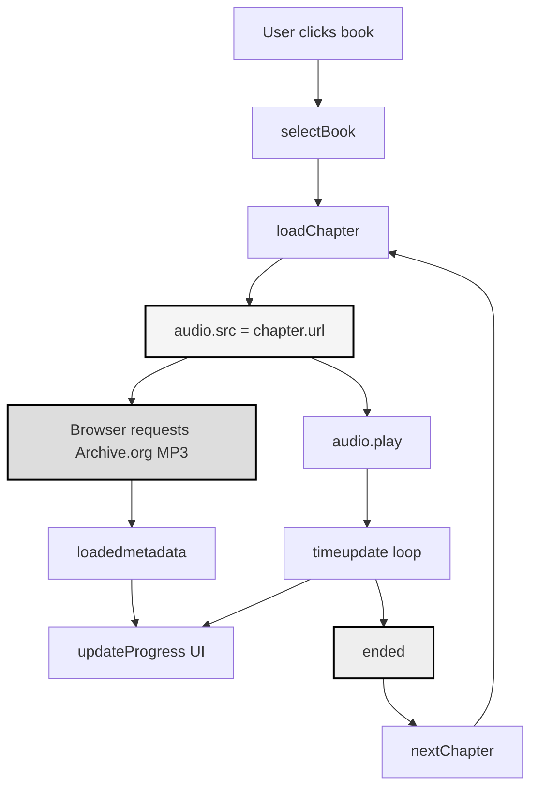
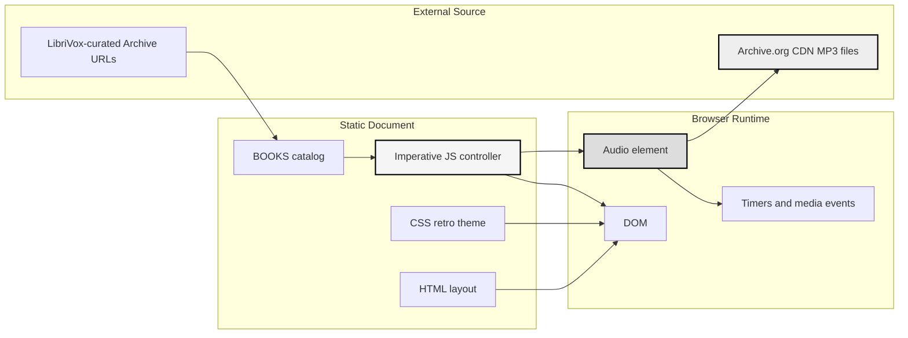

# LibriVox Player

This project is a single-file browser prototype for a retro Macintosh-styled audiobook player that streams public-domain LibriVox recordings from the Internet Archive. It combines a pixelated late-1980s desktop aesthetic with a deliberately simple playback model: no build step, no framework, no backend, and one HTML file that contains the entire interface, dataset, styling, and playback logic.

> [!summary]
> The project currently has three important identities:
> 1. a visual design experiment in retro Macintosh UI language
> 2. a static browser audio player built entirely in one HTML document
> 3. a data-curation prototype for mapping LibriVox titles to live Internet Archive stream URLs

## Why this project exists

The immediate goal is to prove that a nostalgic desktop UI can still feel usable for long-form audio playback inside the browser. The project is intentionally lightweight: instead of introducing a frontend stack, it asks how far plain HTML, CSS, and the browser's built-in `Audio` element can go when the interface is strongly art directed.

It also exists as a practical test of public-domain audio sourcing. LibriVox titles are available through Archive.org, but the mapping from a human-readable book choice to a working stream URL is not stable if it is hardcoded carelessly. This repository therefore doubles as a small experiment in curating a stable subset of books and wiring them into a browser player.

## Current project status

The repository is in active prototype form.

What already exists:

- a complete static UI in one file:
  `/home/manuel/code/wesen/2026-03-22--librivox-player/librivox_retro_mac_player.html`
- a left-hand library browser with search and simple tab modes
- a right-hand player with progress, chapter navigation, speed controls, volume, and status line
- a hardcoded sample library of eight books
- working browser playback through `new Audio()` with chapter switching
- corrected Archive.org URLs for the current sample set, based on live LibriVox-linked paths

What is still incomplete:

- no automatic synchronization with LibriVox metadata or RSS feeds
- no persistent state for the current book, chapter, or playback position
- no cover-art lookup, true chapter metadata loading, or duration verification
- no richer error recovery than status-bar messages when a stream fails
- no packaging beyond opening the HTML in a browser

## Project shape

At a high level, the project has four layers:

1. **Visual shell**
   - retro Macintosh chrome
   - patterned background
   - faux windows, title bars, tabs, buttons, and status bars
2. **Static content model**
   - the `BOOKS` array
   - per-book metadata
   - per-chapter display labels, durations, and stream URLs
3. **Playback controller**
   - one shared `Audio` instance
   - play/pause/seek/skip/chapter transitions
   - playback speed and volume state
4. **View synchronization**
   - render book list
   - render chapter list
   - update status text
   - update progress bar and timestamps

## Architecture

The implementation is deliberately collapsed into a single document rather than split into modules.

```text
HTML structure
  -> defines faux desktop windows and controls
CSS theme
  -> creates the retro Macintosh visual language
BOOKS constant
  -> supplies local metadata and Archive stream URLs
JavaScript controller
  -> owns one Audio object and all UI state
Browser media stack
  -> streams cross-origin MP3 files from Archive.org CDN
```

Key code locations:

- `/home/manuel/code/wesen/2026-03-22--librivox-player/librivox_retro_mac_player.html`
  - CSS theme and window chrome: lines 2-438
  - static app structure: lines 440-581
  - book catalog: lines 583-689
  - playback state and event handling: lines 691-940

## Implementation details

The simplest mental model is that the page is a stateful skin wrapped around one browser audio object. There is no component tree, no data store, and no async orchestration layer beyond the browser media events. Every visible change in the interface comes from mutating a handful of top-level variables and then repainting one portion of the DOM.

### Core state model

The player keeps a small mutable state surface:

- `currentBook`
- `currentChapter`
- `isPlaying`
- `audio`
- `playbackSpeed`
- `filteredBooks`

That state is enough to drive every visible control. The static `BOOKS` constant acts as a small in-memory catalog and is the project's only content source right now.

### Playback flow

The key logic path is:

```js
selectBook(book)
  currentBook = book
  currentChapter = 0
  audio.pause()
  renderChapters()
  loadChapter(0, false)

loadChapter(idx, autoplay)
  ch = currentBook.chapters[idx]
  audio.src = ch.url
  audio.playbackRate = playbackSpeed
  reset progress UI
  if autoplay
    await audio.play()

audio events
  timeupdate -> updateProgress()
  loadedmetadata -> updateProgress()
  ended -> nextChapter()
  error -> show failure status
```

This is intentionally direct. The browser itself remains the real streaming engine. The application does not fetch bytes manually, decode audio itself, or manage MediaSource buffers.

### Why `Audio.src` matters here

One of the tricky details in this prototype is that browser audio playback is more reliable than a copied DevTools `fetch(...)` request for the same asset. A browser-generated `fetch` snippet often includes credential or browser-managed headers that are not the right abstraction for this problem. The player avoids that complexity by setting `audio.src` directly and letting the browser negotiate the media request.

That design choice is important because the project recently hit a confusing failure mode:

- some hardcoded Archive item identifiers were stale
- a copied `fetch(..., { credentials: "include" })` shape suggested a CORS problem
- the underlying fix was mostly data correction, not a playback-engine rewrite

The result is that this project is as much about maintaining good source URLs as it is about media controls.

### Data-flow diagram



### UI rendering strategy

Rendering is split into small imperative functions:

- `renderBooks()` rebuilds the filtered library list
- `renderChapters()` rebuilds the chapter panel for the selected book
- `updateProgress()` updates fill width, thumb position, and time displays
- `setStatus()` updates the status bar only

This is not component-based rendering. Instead, each function owns one visual region and rehydrates it from current state. For a small static prototype, that is a reasonable tradeoff:

- the code stays dependency-free
- UI behavior is easy to trace top to bottom
- the cost of rerendering is low because the dataset is tiny

### Visual system

The CSS is not generic app styling. It is a pixel-art and window-chrome simulation. The key techniques are:

- a two-color patterned desktop background via inline SVG data URL
- heavy borders and box-shadows to mimic classic monochrome window controls
- bitmap-adjacent typography and small font sizes
- fake tabs, scrollbars, title bars, and status indicators
- inline SVG for book-like icons and album-art placeholders

This makes the interface legible as an aesthetic object even though the app itself is functionally simple.

### Tricky details and failure modes

The most important non-obvious details are:

- **Source URL stability is the real backend problem.**
  The app has no backend, but it still depends on an external content naming scheme. If the Archive item slug or filename pattern is wrong, playback fails even though the browser logic is correct.
- **Durations are hand-entered.**
  The chapter durations in `BOOKS` are used as placeholders before metadata loads. They may diverge from real stream lengths.
- **Autoplay and browser media policy can diverge.**
  `audio.play()` after a chapter click or book switch can reject if the browser treats it as disallowed autoplay rather than direct user playback.
- **The error message currently conflates upstream failures.**
  A stale URL, an Archive outage, and a network interruption all surface through a small set of user-facing status messages.
- **The entire project is single-file state.**
  That keeps it easy to move around, but it also means data, UI, and behavior can drift together without clear module boundaries if the prototype grows.

### Architecture diagram



## Current user-facing entry point

The project currently has one real entry point:

- open `/home/manuel/code/wesen/2026-03-22--librivox-player/librivox_retro_mac_player.html` in a browser

There is no build step, local server requirement, or install path in the repo itself.

## Important project docs

At the moment, the main documentation is the code:

- `/home/manuel/code/wesen/2026-03-22--librivox-player/librivox_retro_mac_player.html`

There is no separate README, ticket document, or design note in the repository yet.

## KB reviews

- [[KB-BATCH16-media-audio-video-pipelines]] (2026-05-11) — Batch H media/audio/video review; advanced ASR, browser audio, WebRTC/media-plane, and media pipeline candidates.

## Related KB entries

**Candidate concepts**: media/audio pipeline orchestration, browser audio playback, ASR transcript state, and media delivery boundaries tracked in [[KB-BATCH16-media-audio-video-pipelines]].

## Open questions

- Should the book catalog remain hand-curated, or should it be generated from LibriVox pages or feeds?
- Should the app stay single-file, or should data and controller logic be split once the catalog grows?
- Should the player prefer `64kb` assets consistently, or expose higher bitrate options where available?
- Should playback position and current selection persist in `localStorage`?
- How much more of the old Macintosh interaction model should be simulated versus keeping controls modern and minimal?

## Near-term next steps

- add a small repo-local README so the prototype has an explicit purpose and test path
- separate the catalog from the UI code if more books or metadata fields are added
- improve the stream error message so it distinguishes bad paths from temporary network failures
- add optional cover art and true chapter metadata where LibriVox or Archive identifiers make that practical
- decide whether this remains an artful static demo or becomes a fuller audiobook player

## Project working rule

> [!important]
> Keep the browser playback path simple.
> Prefer direct `Audio.src` assignment and verified live Archive URLs over clever fetch wrappers or premature frontend infrastructure.
