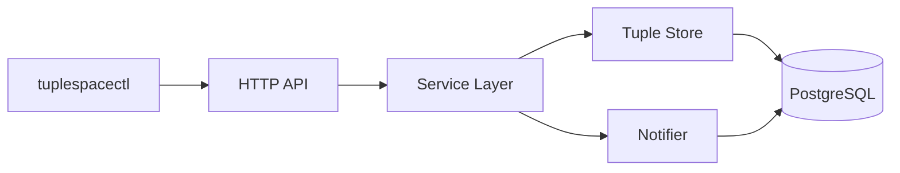
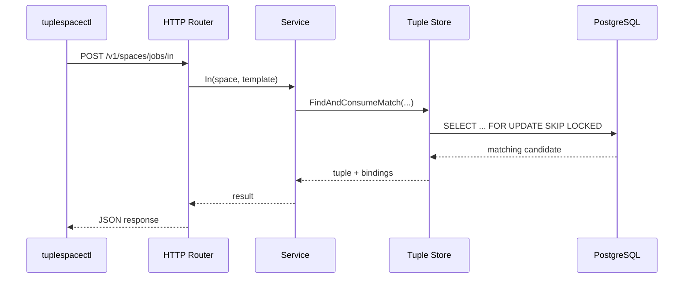

# TupleSpace

This project implements a small Linda-style TupleSpace system in Go. The repository contains a server binary, an HTTP API, a Postgres-backed tuple store, a notifier for blocked reads and takes, and a Glazed-powered command-line client for operational use. The immediate goal of the project was not just to sketch the design, but to carry it through to a real working implementation with automated tests, a manual smoke test against a live Postgres instance, ticket documentation, and a durable implementation diary.

> [!summary]
> TupleSpace is now implemented as a real system rather than only a design exercise. The current shape is a `tuplespaced` server plus a `tuplespacectl` client, backed by PostgreSQL and designed around Linda-style operations: `out`, `rd`, and `in`, plus a growing admin surface for inspection and maintenance. The repo now includes Glazed-backed root help pages, Docker Compose startup for local Postgres and server workflows, environment-variable defaults for the CLI, and a fixed blocking-read timeout model so large `--wait-ms` values no longer fail at the old client timeout boundary. The main remaining technical follow-up is still startup robustness around migration discovery when the built server binary is launched outside the repository root.

## Why this project exists

The point of the project is to provide a coordination primitive rather than a queue with a fixed routing model. A TupleSpace lets producers write tuples into a shared space, and lets consumers read or consume tuples by matching on a template. That gives the system a useful level of decoupling: producers do not need to know which consumer will handle a task, and consumers do not need to subscribe to a rigid topic graph.

This implementation is intentionally conservative. It uses PostgreSQL as the source of truth, keeps matching logic in Go where the semantics are easy to reason about, and uses database notifications only as a wake-up mechanism rather than as the correctness boundary. That tradeoff reduces initial complexity and makes the system much easier to explain to a new engineer.

## Current project status

The implementation is complete enough to run and test today.

- The main service binary exists and starts an HTTP server.
- The Postgres schema and migrations exist.
- Tuple writes, non-destructive reads, and destructive takes are implemented.
- Blocking semantics are supported via a notifier loop.
- The CLI is implemented with Glazed command structure, root-level help topics, and logging setup.
- The server binary now uses the same Glazed-style root initialization pattern for logging and help.
- The admin surface includes read-only inspection commands and destructive maintenance commands.
- Docker Compose can run both Postgres and the server for a local learning and test loop.
- The CLI supports both JSON-file inputs and a compact tuple/template DSL.
- The CLI supports environment defaults through `TUPLESPACECTL_SERVER_URL` and `TUPLESPACECTL_SPACE`.
- The HTTP client timeout for blocking `rd` and `in` now scales with `--wait-ms`.
- Automated tests pass.
- A real manual smoke test was run against Docker-backed PostgreSQL.
- Ticket docs, tasks, changelog, and an implementation diary were written.

The repository is currently at a point where a new engineer can run the service, inspect the HTTP contracts, use the CLI, and make incremental improvements without having to re-derive the architecture from scratch.

## Project shape

The system is split into two main executables and a set of internal packages:

- `cmd/tuplespaced/main.go`
  - starts the server
  - loads config
  - runs migrations
  - wires the store, notifier, and HTTP router
- `cmd/tuplespacectl/main.go`
  - starts the Glazed-based CLI
  - exposes admin and tuple commands
  - loads embedded Glazed help pages
- `internal/api/httpapi`
  - HTTP request routing and request/response translation
- `internal/service`
  - operation-level business logic for `out`, `rd`, and `in`
- `internal/store`
  - Postgres persistence and transaction-safe tuple lookup and consume behavior
- `internal/notify`
  - Postgres `LISTEN/NOTIFY` integration for waking blocked readers/takers
- `internal/client`
  - HTTP client used by the CLI
- `internal/types`
  - tuple, template, and value model definitions
- `internal/match`
  - template matching logic
- `internal/validation`
  - payload validation before persistence or matching
- `internal/config`
  - configuration loading
- `internal/migrations`
  - migration execution support
- `migrations/001_init_tuplespace.sql`
  - initial schema creation

## Architecture

At a high level, the design is intentionally simple:

1. A client sends `out`, `rd`, or `in` over HTTP.
2. The HTTP layer validates and normalizes the request.
3. The service layer decides whether the operation can complete immediately or needs to wait.
4. The store uses PostgreSQL as canonical state.
5. For blocking operations, the notifier waits for a wake-up signal and retries matching.



The crucial design choice is that PostgreSQL owns correctness, while notifications only improve responsiveness. If a notification is delayed or missed, the blocked operation still retries by timeout or context cancellation boundaries and never depends on `NOTIFY` for correctness. This makes the behavior much easier to reason about under failure.

## Core semantics

The Linda-style operations are:

- `out`
  - write a tuple into a named space
- `rd`
  - read a matching tuple without removing it
- `in`
  - read and remove a matching tuple exactly once

The implementation currently supports typed tuple values and template matching over a practical subset needed for the first version. The current value model is intentionally small and explicit:

- `string`
- `int`
- `bool`

This is enough to make the matcher and persistence logic predictable while leaving room for later extension if the system needs richer value kinds.

## Data model

The Postgres schema stores tuples as a tuple row plus associated field rows. That keeps ordering explicit and avoids forcing the whole matcher into JSON-only SQL expressions. The database does not try to perform the full Linda match semantics by itself. Instead, the database returns candidate tuples, and the Go matcher performs final semantic evaluation.

Conceptually:

```text
tuples
  id
  space
  created_at

tuple_fields
  tuple_id
  position
  value_type
  string_value
  int_value
  bool_value
```

That shape makes the following things straightforward:

- preserve field order
- support typed values
- load complete tuples for matcher evaluation
- lock tuple rows when `in` needs destructive consume behavior

## API surface

The HTTP API is intentionally narrow. The current important routes are:

- `GET /healthz`
- `POST /v1/spaces/{space}/out`
- `POST /v1/spaces/{space}/rd`
- `POST /v1/spaces/{space}/in`

The health endpoint supports operational checks and is also used by the CLI smoke path. The tuple endpoints map directly to the core semantic operations. This keeps the transport simple and helps the CLI remain a thin wrapper over the server rather than embedding parallel business logic.

Representative request flow:



## Implementation details

The project is easiest to understand if you read it from the outside in: executable, router, service, store, notifier, and then matcher and types. That reading order mirrors actual runtime flow and makes the codebase feel much smaller.

The server startup path begins in [main.go](/home/manuel/code/wesen/2026-03-22--tuplespace/cmd/tuplespaced/main.go). It loads configuration, opens the database, applies migrations, creates the store and notifier, constructs the service, and finally exposes the HTTP routes. This file matters because it is where lifecycle concerns live: startup failure, migration failure, and shutdown boundaries.

The API layer in [router.go](/home/manuel/code/wesen/2026-03-22--tuplespace/internal/api/httpapi/router.go) is responsible for request translation, not system semantics. Its job is to parse input, validate shape, call the correct service method, and encode a stable response. This separation matters because it keeps the transport replaceable. If a future version adds a Go API, RPC API, or message-driven adapter, the service logic can stay intact.

The actual behavior of `out`, `rd`, and `in` lives in [service.go](/home/manuel/code/wesen/2026-03-22--tuplespace/internal/service/service.go). The service layer is where blocking behavior becomes clear. The basic mental model is:

- try the store immediately
- if a matching tuple exists, return now
- if not and blocking is allowed, wait on a notifier signal and retry
- stop waiting if the context expires or is cancelled

Pseudocode for the destructive take path looks like this:

```text
function In(space, template, wait):
    validate(template)
    deadline = computeDeadline(wait)

    loop:
        result = store.findAndConsume(space, template)
        if result.found:
            return result

        if deadline expired:
            return not_found

        notifier.wait(space, until next wake or deadline)
```

The non-destructive `rd` path is similar, but the store call does not delete the winning tuple. The write path is simpler:

```text
function Out(space, tuple):
    validate(tuple)
    store.insert(space, tuple)
    notifier.notify(space)
    return success
```

The store implementation in [tuple_store.go](/home/manuel/code/wesen/2026-03-22--tuplespace/internal/store/tuple_store.go) is the most important correctness boundary in the system. This package is responsible for the details that make concurrent consumers safe:

- loading candidate tuples from the requested space
- preserving tuple field order
- evaluating template matches consistently
- locking tuples when a destructive consume is attempted
- deleting only the single winning tuple for an `in`

The key concurrency technique is row locking with `FOR UPDATE SKIP LOCKED` during destructive consume. That means one taker can acquire a tuple while other concurrent takers skip already-locked rows instead of blocking behind them. This is a practical way to get exactly-once destructive behavior without turning the design into a distributed consensus problem.

The notifier implementation in [notifier.go](/home/manuel/code/wesen/2026-03-22--tuplespace/internal/notify/notifier.go) uses PostgreSQL `LISTEN/NOTIFY`. The important thing for an intern to understand is that notifications are not the data path. They are just a wake-up hint. The tuple still has to be re-queried from the canonical store after wake-up. This distinction is subtle, but it is one of the major reasons the design is robust.

The CLI binary in [main.go](/home/manuel/code/wesen/2026-03-22--tuplespace/cmd/tuplespacectl/main.go) and the command group files under [cmds](/home/manuel/code/wesen/2026-03-22--tuplespace/cmd/tuplespacectl/cmds) provide the operator-facing interface. The current commands are:

- `tuplespacectl tuple out`
- `tuplespacectl tuple rd`
- `tuplespacectl tuple in`
- `tuplespacectl admin health`
- `tuplespacectl admin spaces`
- `tuplespacectl admin dump`
- `tuplespacectl admin peek`
- `tuplespacectl admin export`
- `tuplespacectl admin stats`
- `tuplespacectl admin config`
- `tuplespacectl admin schema`
- `tuplespacectl admin waiters`
- `tuplespacectl admin notify-test`
- `tuplespacectl admin purge`
- `tuplespacectl admin tuple get`
- `tuplespacectl admin tuple delete`

This is built with Glazed so the command definitions can provide consistent flag handling, structured output, root-level logging configuration, and embedded help pages. One implementation detail that already surfaced during development is that Glazed reserves some flag names; a custom tuple template flag originally called `template-file` had to be renamed to `template-json-file` to avoid a collision with an existing framework-level output flag. Another follow-up was that the CLI roots needed to be initialized the same way as `glaze` itself so help pages render properly and show up through `help --topics` and `help <slug>`.

## How to read the system as a new engineer

If you are new to the codebase, read it in this order:

1. [main.go](/home/manuel/code/wesen/2026-03-22--tuplespace/cmd/tuplespaced/main.go)
2. [router.go](/home/manuel/code/wesen/2026-03-22--tuplespace/internal/api/httpapi/router.go)
3. [service.go](/home/manuel/code/wesen/2026-03-22--tuplespace/internal/service/service.go)
4. [tuple_store.go](/home/manuel/code/wesen/2026-03-22--tuplespace/internal/store/tuple_store.go)
5. [notifier.go](/home/manuel/code/wesen/2026-03-22--tuplespace/internal/notify/notifier.go)
6. [001_init_tuplespace.sql](/home/manuel/code/wesen/2026-03-22--tuplespace/migrations/001_init_tuplespace.sql)
7. [main.go](/home/manuel/code/wesen/2026-03-22--tuplespace/cmd/tuplespacectl/main.go)

That order matches the real control flow and will help you understand the system before you get lost in helper types.

## Testing and real validation

This project was tested in both automated and manual ways.

Automated test coverage included:

- `go test ./internal/store -count=1`
- `go test ./internal/notify ./internal/service ./internal/api/httpapi -count=1`
- `go test ./cmd/tuplespacectl/... ./internal/client -count=1`
- `go test ./... -count=1`
- `go test ./internal/client -count=1`
- `go build ./cmd/tuplespacectl ./cmd/tuplespaced`

The store tests were run against real Docker-backed PostgreSQL rather than only mocks, because this project’s main failure risks are transactional and concurrency-related, not purely structural.

Manual smoke validation was also performed with built binaries and a live Postgres instance. The exercised path was:

1. start PostgreSQL in Docker
2. start `tuplespaced`
3. run `tuplespacectl admin health`
4. run `tuplespacectl tuple out`
5. run `tuplespacectl tuple in`
6. run `tuplespacectl tuple rd`

The important observed outcome was that `tuple in` returned the tuple and bindings, and a following `tuple rd` correctly returned `not_found`, proving the consume semantics worked in a live system rather than only in unit tests.

There was also a later live regression test for blocking reads with a very large wait setting. The original failure mode was that the client’s hard-coded HTTP timeout was shorter than `--wait-ms`, which caused `context deadline exceeded (Client.Timeout exceeded while awaiting headers)` before the server-side wait elapsed. That path is now fixed so blocking tuple commands derive their request timeout from `wait-ms` with additional buffer time.

## Debugging history and lessons learned

Several practical issues came up during implementation. These are worth preserving because they explain why some parts of the code look the way they do.

- The initial testcontainers usage used an outdated helper and failed with `undefined: tcpostgres.WithWaitStrategy`.
  - The fix was to switch to `tcpostgres.BasicWaitStrategies()`.
- An early CLI smoke test hard-coded a port that was already in use.
  - That created a false negative and forced the smoke path to become more deliberate about runtime isolation.
- A `go run` based smoke test left orphaned child processes.
  - Building binaries and executing them directly made the test path more deterministic.
- A built server process launched from the wrong working directory failed to discover migrations.
  - Error shape: `read migrations: open .: no such file or directory`
  - The immediate fix in test code was to run with the repository root as the process directory.
- Glazed reserved flag behavior caused a collision on `template-file`.
  - The flag was renamed to `template-json-file`.
- The first server image behind the CLI admin commands was stale and returned plain `404 page not found` for newer admin routes.
  - The client error decoding was improved so plain-text HTTP failures no longer show up as a misleading JSON decode problem.
- The first Glazed help integration assumption used `help topics` as if it were a subcommand.
  - In this checkout of Glazed, the correct discovery path is `help --topics` plus `help <slug>`.
- Blocking `rd` and `in` requests originally used the same fixed 15 second HTTP client timeout as fast admin calls.
  - The client now uses a larger timeout for blocking requests based on `wait-ms`, which preserves long waits without changing the default behavior for normal requests.

These failures are all normal integration problems, and they are valuable because they reveal which boundaries are fragile in real usage.

## Current user-facing commands

The current happy-path commands look like this:

```bash
export TUPLESPACECTL_SERVER_URL=http://127.0.0.1:18081
export TUPLESPACECTL_SPACE=jobs

go run ./cmd/tuplespacectl admin health --output json
go run ./cmd/tuplespacectl tuple out 'job,42,true' --output json
go run ./cmd/tuplespacectl tuple rd 'job,?id:int,?ready:bool' --output json
go run ./cmd/tuplespacectl tuple in 'job,?id:int,?ready:bool' --output json
go run ./cmd/tuplespacectl admin dump --space jobs --output json
go run ./cmd/tuplespacectl help --topics
go run ./cmd/tuplespacectl help tuple-dsl
```

The CLI is intentionally thin. That is a good property. It means the CLI is mostly transport and operator ergonomics, while the real semantic behavior stays concentrated in the server.

For local stack startup, the current learning path is now Docker Compose based:

```bash
docker compose up -d postgres tuplespaced
docker compose ps
curl -sS http://127.0.0.1:18081/healthz
```

## Important project docs

The implementation work also produced a detailed ticket bundle that serves as the larger reference set for onboarding and historical context:

- [index.md](/home/manuel/code/wesen/2026-03-22--tuplespace/ttmp/2026/03/22/TUPLESPACE-IMPLEMENTATION--implement-tuplespace-service-and-glazed-cli/index.md)
- [01-tuplespace-system-analysis-design-and-implementation-guide.md](/home/manuel/code/wesen/2026-03-22--tuplespace/ttmp/2026/03/22/TUPLESPACE-IMPLEMENTATION--implement-tuplespace-service-and-glazed-cli/design-doc/01-tuplespace-system-analysis-design-and-implementation-guide.md)
- [01-investigation-diary.md](/home/manuel/code/wesen/2026-03-22--tuplespace/ttmp/2026/03/22/TUPLESPACE-IMPLEMENTATION--implement-tuplespace-service-and-glazed-cli/reference/01-investigation-diary.md)
- [tasks.md](/home/manuel/code/wesen/2026-03-22--tuplespace/ttmp/2026/03/22/TUPLESPACE-IMPLEMENTATION--implement-tuplespace-service-and-glazed-cli/tasks.md)
- [changelog.md](/home/manuel/code/wesen/2026-03-22--tuplespace/ttmp/2026/03/22/TUPLESPACE-IMPLEMENTATION--implement-tuplespace-service-and-glazed-cli/changelog.md)

If this Obsidian project note is the front door, the ticket bundle is the full project archive.

## Open questions

The implementation is usable, but a few follow-up questions remain:

- Should migrations be embedded into the server binary rather than discovered from a working-directory-relative path?
- Should the supported value types stay intentionally small, or is there a near-term need for floats, nulls, arrays, or object payloads?
- Should blocking semantics remain HTTP request scoped, or should longer-running operations eventually move to a streaming or RPC-style transport?
- Does the first production use case need authentication and multi-tenant space ownership, or is this still an internal trusted-network service?
- Should the admin surface stay HTTP/JSON only, or should some operator workflows move to richer streaming or interactive diagnostics later?

The most immediate one is the migration discovery issue, because it is the only current behavior that can surprise an operator running the compiled binary from a different directory.

## Near-term next steps

- Embed migrations or make the migration path configurable.
- Add a small operator runbook for local startup and manual smoke verification.
- Add concurrency-focused tests with multiple simultaneous `in` consumers.
- Decide whether bindings and template semantics need richer pattern forms.
- Decide whether the admin commands need pagination, filtering, or role-based protection before wider operational use.
- Close the ticket once implementation review is complete.

## Recent follow-up work

The initial implementation pass was followed by a second round of operational hardening and CLI polish. The most visible changes were:

- a larger admin command set for inspection and control
- a compact tuple DSL so common `out`, `rd`, and `in` operations are shell-friendly
- Docker Compose support for running Postgres and `tuplespaced` together
- structured logging through Glazed root initialization
- embedded help pages for both binaries using the same root initialization pattern as `glaze`
- a fix for long blocking reads so the client timeout no longer undercuts `--wait-ms`

This moved the project from “implemented and testable” to “much easier to operate, teach, and inspect live”.

## Project working rule

This project should continue to prefer simple correctness over cleverness. If a future change makes matching or concurrency harder to explain, the burden is on that change to justify itself. TupleSpace systems become difficult very quickly when semantics are split across too many layers; this implementation is strongest when the store owns correctness, the service owns operation flow, and the notifier remains only a wake-up mechanism.
