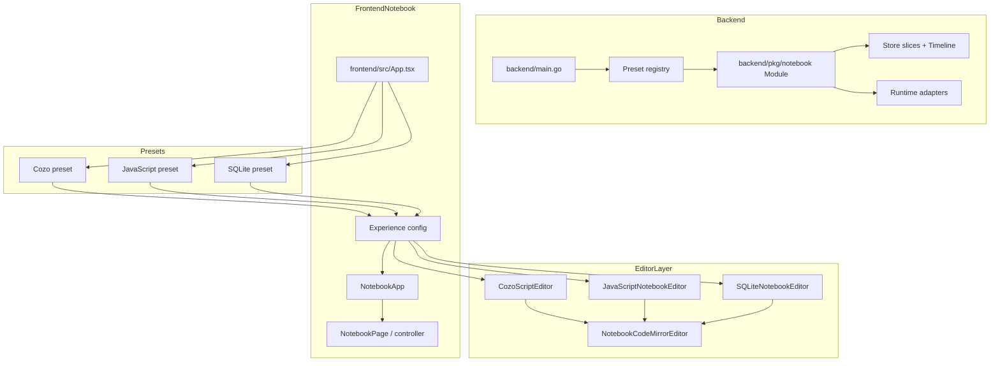
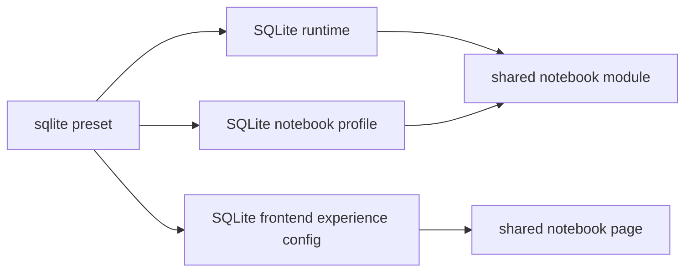

# CozoDB Editor - Merge Resolution, SQLite Preset, and Editor Highlighting

This note is the follow-up to yesterday's project report, not a replacement for it. The previous report described the notebook packaging arc through the JavaScript preset. The work after that report pushed the repository further in four directions: the repository survived a real merge against `origin/main`, the preset family grew to include SQLite, the editor system stopped being Cozo-only by gaining a reusable CodeMirror shell with JavaScript and SQL highlighting, and the backend notebook package was cleaned up again by splitting the store layer and moving preset selection behind a registry.

> [!summary]
> The new work after the previous report has four main outcomes:
> 1. the modular notebook architecture survived a meaningful frontend merge instead of only living on a clean branch
> 2. the shared notebook package now has a third runtime/preset family through SQLite
> 3. the frontend editor architecture is more honest now, because Cozo, JavaScript, and SQLite all render through the same reusable CodeMirror notebook editor pattern
> 4. the backend host/setup layer is cleaner now, because preset selection is registry-based and notebook persistence is split by concern instead of living in one oversized store file

## Relationship to the previous report

The previous project note is:

- [[Projects/2026/03/22/PROJ - CozoDB Editor - Notebook Packaging and JavaScript Preset]]

That note explained how the repository moved from a single Cozo-oriented app toward a reusable notebook package with a JavaScript sibling preset. This follow-up note covers the next phase:

- merge integration with the remote editor branch
- SQLite preset implementation
- editor modularization for JS and SQL syntax highlighting
- backend store split and backend preset registry cleanup
- ticket closeout after the implementation wave landed

The important theme is that the architecture is no longer only "designed" for multiple presets. It has now absorbed more real pressure:

- a conflicting upstream feature merge
- a third backend/frontend preset family
- a second and third CodeMirror-powered editing mode
- a backend cleanup pass that reorganized storage code and startup selection without changing the notebook service surface

## Why this follow-up matters

The most dangerous phase of a modularization effort is usually the one right after the architecture starts to look good on paper. That is when real work tends to reveal whether the abstractions are durable or merely tidy.

This follow-up matters because it answers three practical questions:

- Can the refactored notebook frontend survive upstream changes that landed on the old monolithic page/card structure?
- Can the backend/frontend preset pattern support another language family beyond Cozo and JavaScript?
- Can the frontend editor architecture support multiple highlighted languages without copying the original Cozo editor?

The answer to all three is now "yes," although a few cleanup opportunities are visible and should probably become a future ticket.

## Current project status

The repository is still active and still evolving, but it is materially stronger than it was at the time of the last report.

What now exists in addition to yesterday's state:

- merge conflict resolution between the modular notebook architecture and the upstream CozoScript CodeMirror editor work
- a full SQLite preset on backend and frontend
- isolation of preset bootstrap notebooks inside the shared application database
- a reusable notebook CodeMirror shell in the frontend editor layer
- JavaScript and SQLite editor adapters using that shared shell
- Storybook stories for the shared editor surface plus JS and SQLite editor adapters
- live manual verification that JS and SQLite notebook pages render CodeMirror in the app, not just in Storybook
- a split backend store layer under `backend/pkg/notebook`
- a backend preset registry used by `backend/main.go`
- closure of the completed packaging/preset/editor tickets so the remaining open tickets now represent the true backlog

What still looks incomplete or worth cleanup:

- frontend preset registration is still hand-written rather than registry-driven
- frontend bundle size is growing as more CodeMirror language packages are added
- Storybook mock backend code is becoming large enough to deserve some decomposition
- older notebook-era backlog tickets still need triage against the newer packaged architecture

## Ticket progression after the previous report

The work after the previous report flowed through four implementation tickets, followed by a closeout/documentation pass.

### `COZODB-015`

This ticket handled the merge against `origin/main` after the upstream branch landed a focused CozoScript editor feature set against the older notebook surface.

What actually happened:

- upstream added CodeMirror-based CozoScript editing and small notebook behavior fixes
- the local branch had already split notebook page/card logic into modular view/controller/container layers
- the merge conflicts were therefore semantic rather than textual

The resolution strategy was correct and worth remembering:

- keep the new modular notebook architecture
- transplant the upstream editor behavior into that architecture
- do not revert back to the old monolithic page/card files just because the remote branch landed there first

### `COZODB-016`

This ticket added the SQLite preset. That included:

- backend SQLite runtime
- backend current SQLite preset constructor
- frontend current SQLite preset wrapper and config
- Storybook/MSW coverage for the SQLite preset

The most important bug discovered during that ticket was not in SQLite execution itself. It was in the shared notebook store. A persisted app database was reusing a single "default notebook" identity across presets. That meant switching presets against the same app database could return the wrong starter notebook. The fix was to make preset default notebook IDs and seeded default cell IDs preset-aware.

### `COZODB-017`

This ticket dealt with frontend editor modularity. Before it, only Cozo had a proper CodeMirror editor. JavaScript and SQLite still used the textarea fallback. The ticket extracted the CodeMirror notebook shell into a reusable component and added thin JavaScript and SQLite adapters around it.

This matters because it turns editor syntax highlighting from a one-off feature into a repeatable preset capability.

### `COZODB-018`

This ticket cleaned up backend internals after the preset/editor work was already functioning. It did not add new user-facing notebook behavior. Instead, it made the backend shape more sustainable before the next preset lands.

It did two things:

- split the large notebook store implementation into responsibility-oriented files
- replace the hardcoded backend preset switch with a registry

The most important backend files now are:

- `/home/manuel/code/wesen/2026-03-14--cozodb-editor/backend/pkg/notebook/store_open.go`
- `/home/manuel/code/wesen/2026-03-14--cozodb-editor/backend/pkg/notebook/store_bootstrap.go`
- `/home/manuel/code/wesen/2026-03-14--cozodb-editor/backend/pkg/notebook/store_notebooks.go`
- `/home/manuel/code/wesen/2026-03-14--cozodb-editor/backend/pkg/notebook/store_cells.go`
- `/home/manuel/code/wesen/2026-03-14--cozodb-editor/backend/pkg/notebook/store_runs.go`
- `/home/manuel/code/wesen/2026-03-14--cozodb-editor/backend/pkg/notebook/preset_registry.go`
- `/home/manuel/code/wesen/2026-03-14--cozodb-editor/backend/main.go`

This is the transition from “the architecture can probably support more presets” to “the backend host and store layers are now shaped to keep supporting them.”

## Project shape now

The project now has four meaningful layers instead of three, and the backend host layer is cleaner than it was when this follow-up was first drafted:

1. **Shared backend notebook infrastructure**
2. **Shared frontend notebook infrastructure**
3. **Preset families**
4. **Editor adapter layer inside the frontend preset system**

That fourth layer did not really exist in the previous report. There was a custom Cozo editor, but it was not yet a reusable subsystem.



## Implementation details

This is the part a new engineer should read most carefully. It explains how the new work actually changed the system rather than just listing files or tickets.

### 1. Merge resolution validated the modular frontend structure

The merge problem was not "fix conflict markers." The real issue was that the upstream branch had added useful editor behavior in the old architecture, while the local branch had already moved that behavior into newer files.

The important files in that merge were:

- `/home/manuel/code/wesen/2026-03-14--cozodb-editor/frontend/src/notebook/NotebookCellCard.tsx`
- `/home/manuel/code/wesen/2026-03-14--cozodb-editor/frontend/src/notebook/NotebookCellCardView.tsx`
- `/home/manuel/code/wesen/2026-03-14--cozodb-editor/frontend/src/notebook/NotebookPage.tsx`
- `/home/manuel/code/wesen/2026-03-14--cozodb-editor/frontend/src/notebook/useNotebookPageController.ts`

The durable lesson is:

```pseudocode
if remote branch changes old structure
and local branch has already split that structure:
    keep local modular structure
    port remote behavior into new files
    do not regress architecture just to make merge easier
```

That decision preserved the value of the earlier decomposition work.

### 2. SQLite became a full sibling preset, not a side-channel feature

The SQLite ticket did not add "SQL support inside the Cozo app." It added a separate preset family using the same notebook package seams.

Backend files that mattered:

- `/home/manuel/code/wesen/2026-03-14--cozodb-editor/backend/pkg/notebook/sqlite_runtime.go`
- `/home/manuel/code/wesen/2026-03-14--cozodb-editor/backend/pkg/notebook/current_sqlite.go`
- `/home/manuel/code/wesen/2026-03-14--cozodb-editor/backend/main.go`

Frontend files that mattered:

- `/home/manuel/code/wesen/2026-03-14--cozodb-editor/frontend/src/notebook/currentSQLite.tsx`
- `/home/manuel/code/wesen/2026-03-14--cozodb-editor/frontend/src/notebook/currentSQLiteConfig.ts`
- `/home/manuel/code/wesen/2026-03-14--cozodb-editor/frontend/src/storybook/notebookApiHandlers.ts`

The mental model is:



The preset owns:

- runtime choice
- starter notebook profile
- fallback AI wording
- frontend placeholders and rendering config

The notebook package still owns:

- notebook document model
- execution flow
- transport mounting
- page/controller/store behavior

### 3. Preset bootstrap identity had to become preset-aware

The SQLite ticket revealed a subtle backend design bug. The notebook store originally assumed a single fixed default notebook ID and fixed seeded starter cell IDs. That worked as long as the app was effectively one notebook family. It failed once multiple presets shared the same application database.

The relevant file is:

- `/home/manuel/code/wesen/2026-03-14--cozodb-editor/backend/pkg/notebook/store.go`

The old model was effectively:

```pseudocode
defaultNotebookID = "nbk_default"
starter cells = ["cell_intro", "cell_query"]

if notebook "nbk_default" exists:
    return it
else:
    create it with starter cells
```

That is wrong in a multi-preset world, because the identity of the bootstrap notebook is part of the preset.

The fixed model is:

```pseudocode
profile.DefaultNotebookID = preset-specific id

EnsureDefaultNotebook():
    defaultID = profile.DefaultNotebookID
    if notebook defaultID exists:
        return it
    else:
        create preset-specific default notebook
        seed preset-specific intro/query cell IDs
```

This is a small-looking change, but it matters architecturally. It means presets are now isolated at the bootstrap identity level, not just at runtime selection level.

### 4. The frontend editor layer is now actually modular

Before the follow-up work, the editor system was only partially modular:

- notebook core allowed preset editor injection
- Cozo used that seam
- JavaScript and SQLite did not

The new files that matter are:

- `/home/manuel/code/wesen/2026-03-14--cozodb-editor/frontend/src/editor/NotebookCodeMirrorEditor.tsx`
- `/home/manuel/code/wesen/2026-03-14--cozodb-editor/frontend/src/editor/notebookCodeMirrorTheme.ts`
- `/home/manuel/code/wesen/2026-03-14--cozodb-editor/frontend/src/editor/CozoScriptEditor.tsx`
- `/home/manuel/code/wesen/2026-03-14--cozodb-editor/frontend/src/editor/JavaScriptNotebookEditor.tsx`
- `/home/manuel/code/wesen/2026-03-14--cozodb-editor/frontend/src/editor/SQLiteNotebookEditor.tsx`

The architectural change is easiest to understand as a reduction of responsibility.

Before:

```pseudocode
CozoScriptEditor:
    mount CodeMirror
    sync state
    own notebook keybindings
    own theme
    own language config
```

After:

```pseudocode
NotebookCodeMirrorEditor:
    mount CodeMirror
    sync state
    own notebook keybindings
    own shared theme

CozoScriptEditor:
    provide cozo language extensions

JavaScriptNotebookEditor:
    provide javascript language extension

SQLiteNotebookEditor:
    provide sql language extension
```

That is the right shape. The notebook shell behavior is now centralized, while language behavior is adapter-level.

### 5. Storybook now validates the editor surface more directly

The editor work also improved the Storybook surface. The project already had app stories, but the new work added isolated editor stories:

- `/home/manuel/code/wesen/2026-03-14--cozodb-editor/frontend/src/editor/NotebookCodeMirrorEditor.stories.tsx`
- `/home/manuel/code/wesen/2026-03-14--cozodb-editor/frontend/src/editor/JavaScriptNotebookEditor.stories.tsx`
- `/home/manuel/code/wesen/2026-03-14--cozodb-editor/frontend/src/editor/SQLiteNotebookEditor.stories.tsx`

That matters because it gives the project two complementary validation modes:

- **app stories** validate preset composition
- **editor stories** validate the editor surface itself

This reduces the feedback loop when changing keyboard handling, themes, or editor props.

### 6. Live manual smokes still mattered

The automated checks passed, but the follow-up work still did live app smokes for JavaScript and SQLite. That turned out to be worthwhile. One of the JavaScript manual test attempts initially failed only because the backend proxy pointed at the wrong Vite port after Vite auto-shifted to a different free port.

The point is not the port issue itself. The point is that Storybook and typecheck cannot validate the full backend-proxy-to-Vite dev loop. That still needs at least one real app pass for new preset/editor work.

### 7. Backend cleanup caught up with the new architecture

Once SQLite and the reusable editors landed, two backend cleanup needs were obvious:

- the store implementation had become too dense
- backend preset startup still lived in a switch inside `main.go`

The cleanup ticket fixed both without changing the notebook service contract.

Before:

```pseudocode
main():
    switch preset:
        case "cozo": open current cozo module
        case "javascript": open current js module
        case "sqlite": open current sqlite module

Store:
    open db
    migrate
    ensure default notebook
    create/update notebooks
    insert/move/delete cells
    persist runs
```

After:

```pseudocode
main():
    registry = DefaultPresetRegistry()
    module = registry.Open(preset, options)

Store files:
    store_open.go
    store_migrate.go
    store_bootstrap.go
    store_notebooks.go
    store_cells.go
    store_runs.go
```

This is not glamorous work, but it is exactly the kind of cleanup that prevents the next language/preset ticket from paying compounding complexity tax.

## Current commands that matter

These are the most useful commands for understanding or validating the new state.

### JavaScript preset app

```bash
cd /home/manuel/code/wesen/2026-03-14--cozodb-editor/backend
go run . --preset javascript --addr 127.0.0.1:8080 --app-db-path /tmp/cozodb-js-app.sqlite

cd /home/manuel/code/wesen/2026-03-14--cozodb-editor/frontend
VITE_NOTEBOOK_PRESET=javascript npm run dev
```

### SQLite preset app

```bash
cd /home/manuel/code/wesen/2026-03-14--cozodb-editor/backend
go run . --preset sqlite --addr 127.0.0.1:8080 --app-db-path /tmp/cozodb-sqlite-app.sqlite --sqlite-db-path /tmp/cozodb-sqlite-runtime.sqlite

cd /home/manuel/code/wesen/2026-03-14--cozodb-editor/frontend
VITE_NOTEBOOK_PRESET=sqlite npm run dev
```

### Frontend validation

```bash
cd /home/manuel/code/wesen/2026-03-14--cozodb-editor/frontend
npm test
npm run lint
npx tsc --noEmit
npm run build
npm run build-storybook
```

## Important project docs after the new work

The new documents that matter on top of the previous report are:

- merge conflict analysis:
  - `/home/manuel/code/wesen/2026-03-14--cozodb-editor/ttmp/2026/03/22/COZODB-015--resolve-origin-main-merge-conflicts-between-notebook-modularization-and-cozoscript-editor-integration/design-doc/01-merge-conflict-resolution-analysis-design-and-implementation-guide.md`
- SQLite preset guide:
  - `/home/manuel/code/wesen/2026-03-14--cozodb-editor/ttmp/2026/03/23/COZODB-016--sqlite-notebook-preset-with-backend-runtime-and-frontend-surface/design-doc/01-sqlite-notebook-preset-implementation-guide.md`
- reusable editor / JS+SQL highlighting guide:
  - `/home/manuel/code/wesen/2026-03-14--cozodb-editor/ttmp/2026/03/23/COZODB-017--reusable-codemirror-notebook-editor-with-javascript-and-sql-preset-highlighting/design-doc/01-codemirror-notebook-editor-extraction-and-javascript-sql-syntax-highlighting-guide.md`
- backend cleanup / preset registry guide:
  - `/home/manuel/code/wesen/2026-03-14--cozodb-editor/ttmp/2026/03/23/COZODB-018--split-notebook-store-layer-and-introduce-backend-preset-registry/design-doc/01-notebook-store-split-and-backend-preset-registry-implementation-guide.md`

Together with the previous report’s docs, those now describe:

- package architecture
- backend transport ownership
- JavaScript preset
- SQLite preset
- add-a-language workflow
- frontend editor modularization
- backend store cleanup and backend preset registration

## Ticket state now

The large implementation wave is mostly closed out at the ticket level.

Tickets now closed:

- `COZODB-001`
- `COZODB-003`
- `COZODB-007`
- `COZODB-008`
- `COZODB-009`
- `COZODB-010` (syntax-highlighting ticket)
- `COZODB-011`
- `COZODB-015`
- `COZODB-018`

Tickets still open because they still represent real remaining backlog:

- `COZODB-002`
- `COZODB-004`
- `COZODB-005`
- `COZODB-006`

## Open questions

- Should frontend preset registration in `frontend/src/App.tsx` move to a registry structure to match the backend cleanup?
- Should CodeMirror language packages remain eagerly bundled, or should some of them become lazy-loaded?
- Should the Storybook mock backend surface be decomposed before it grows into another monolith?
- Which of the remaining open tickets should be collapsed into a new cleanup/consolidation plan versus implemented directly?

## Near-term next steps

- frontend preset registry or equivalent config-table cleanup
- decide whether bundle-size control needs to become part of the language-preset playbook
- review the remaining open notebook-era tickets and decide which ones still align with the current packaged architecture
- continue using the new editor adapter pattern for future languages instead of special-casing editors in preset configs

## Project working rule

The main rule that emerged from this phase is:

**when a feature differs by language or runtime, prefer a preset adapter over changing notebook core behavior directly.**

That rule held up in all three pieces of new work:

- merge conflict resolution
- SQLite preset addition
- editor syntax highlighting for JS and SQL

That is a good sign that the project’s packaging direction is now structurally real, not just aspirational.

## KB reviews

- [[KB-BATCH13-cozo-editor-structured-browser-tools]] (2026-05-11) — Batch D analysis; confirmed that the packaged notebook/editor architecture survived merge pressure and a third preset family.

## Related KB entries

**Tribal candidates** (not yet written / needs review):
- Preset adapter over notebook core behavior (3/3 across the Cozo line).
- Language package as product, browser shell as consumer (2/3 with CozoScript Web UI).
- Keep modular architecture during merge; port behavior into new seams instead of regressing structure (1/3).

**On-Ramp candidates** (not yet written):
- CodeMirror 6 language package mental model (2/5 🌐).
- Notebook preset architecture (2/5).

