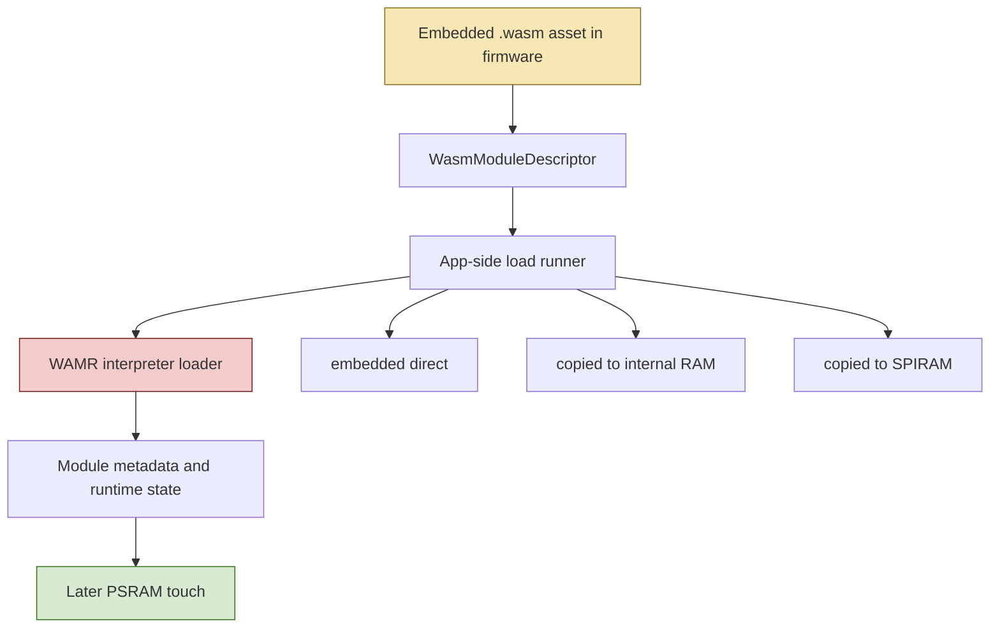
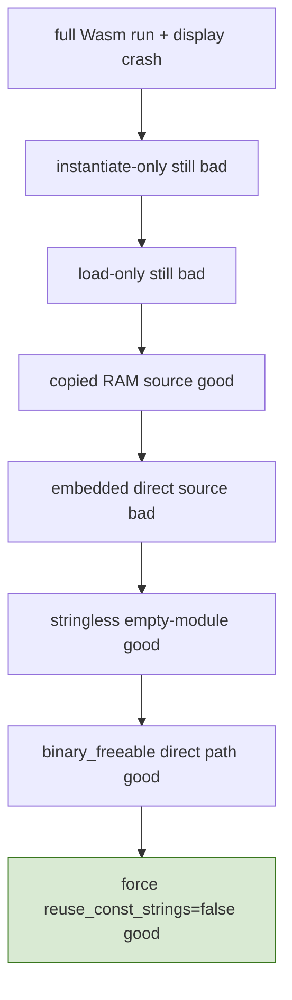

# PaperS3 WAMR Debugging

This project was a long debugging campaign inside the `esp32-s3-m5` workspace to explain why embedded WAMR modules on ESP32-S3 hardware appeared to poison later PSRAM use and crash with `Cache disabled but cached memory region accessed`. It started as a broad PaperS3 display and memory mystery and ended as a precise loader-contract bug inside WAMR’s interpreter path.

> [!summary]
> This project eventually turned into three things at once:
> 1. a PaperS3 firmware effort to run embedded AssemblyScript/Wasm programs from `esp_console`
> 2. a cross-board debugging campaign using PaperS3 and AtomS3R as controls
> 3. a root-cause investigation that proved WAMR was mutating flash-mapped embedded Wasm buffers in place

## Why this project exists

The original product goal was straightforward and attractive: compile a set of small AssemblyScript programs to Wasm, embed them into ESP32-S3 firmware, and run them from a console on small M5 devices. In practice, that required solving a much harder systems question: what exactly happens when an embedded runtime assumes its source buffer is writable, but the firmware delivers that buffer from flash-mapped read-only storage?

This project exists because that question turned out to be subtle, expensive, and worth preserving. It crossed multiple layers at once:

- ESP-IDF firmware structure
- WAMR runtime setup
- embedded Wasm asset handling
- PSRAM behavior
- board-level differences between PaperS3 and AtomS3R
- the difference between “this workaround ships” and “we actually understand the bug”

The final value is not only the fix. It is the reasoning trail.

## Current project status

The main debugging goal is complete enough to be considered a successful root-cause investigation.

What is now established:

- the crash is not a generic “WAMR on ESP32-S3 is broken” failure
- the crash is not fundamentally a PaperS3 e-ink display bug
- the trigger is not guest execution, host imports, or display replay by itself
- the critical unsafe path is WAMR’s in-place const-string reuse on embedded flash-mapped Wasm buffers
- copying the embedded Wasm into RAM before load prevents the bug
- forcing the loader not to reuse/mutate const strings prevents the bug
- the same essential failure can also be reproduced on AtomS3R, so the bug is not just a PaperS3 quirk

What remains open:

- whether to keep the RAM-copy mitigation as the long-term production behavior
- whether to upstream a cleaner fix to WAMR that separates buffer writability from `wasm_binary_freeable`

## Project shape

This debugging effort ended up distributed across several firmware projects and ticket workspaces.

The key firmware directories are:

- `/home/manuel/workspaces/2025-12-21/echo-base-documentation/esp32-s3-m5/0079-papers3-wamr-assemblyscript-console`
- `/home/manuel/workspaces/2025-12-21/echo-base-documentation/esp32-s3-m5/0081-atoms3r-wamr-probe-console`
- `/home/manuel/workspaces/2025-12-21/echo-base-documentation/esp32-s3-m5/0082-papers3-wamr-allocator-control`

The key ticket sequence is:

- `ESP-39`: migration to the Espressif WAMR component
- `ESP-40`: AtomS3R cross-check project
- `ESP-41`: PaperS3 Panel_EPD and PSRAM contamination narrowing
- `ESP-42`: minimal allocator-control firmware
- `ESP-43`: embedded-buffer mapping investigation
- `ESP-44`: flash-mapped load root-cause investigation
- `ESP-45`: PaperS3 vs AtomS3R comparison track
- `ESP-46`: reserved flash-source A/B track

## Architecture

At the highest level, the system under investigation looked like this:



The critical fact was that `EMBED_FILES` places module bytes into flash-mapped read-only firmware storage rather than a writable heap buffer. That matters because WAMR’s interpreter loader has an optimization path that assumes some input buffers are reusable and writable.

## Implementation details

The easiest mental model is:

- app code picks a Wasm source buffer
- WAMR parses the module
- WAMR sometimes tries to turn Wasm strings into C strings by rewriting bytes in place
- if those bytes live in writable RAM, this can work
- if those bytes live in embedded flash-mapped `.rodata`, this is the wrong contract
- the visible crash shows up later, often when PSRAM is touched

### The three relevant app-side layers

The main app-side files in `0082` are:

- `main/wasm_module_registry.cpp`
- `main/wasm_module_runner.cpp`
- `main/wasm_replay_control.cpp`

`wasm_module_registry.cpp` defines the embedded modules and exposes them as descriptors. `wasm_module_runner.cpp` decides how a descriptor should be loaded: direct embedded pointer, internal-RAM copy, or SPIRAM copy. `wasm_replay_control.cpp` provides deterministic host-side PSRAM probes so the system can test “did that earlier WAMR action poison later PSRAM writes?”

In simplified pseudocode, the runner logic became:

```text
if source_mode == embedded_direct:
    load_ptr = descriptor.start
elif source_mode == copy_internal:
    load_ptr = malloc_internal(descriptor.size)
    memcpy(load_ptr, descriptor.start, descriptor.size)
elif source_mode == copy_spiram:
    load_ptr = malloc_spiram(descriptor.size)
    memcpy(load_ptr, descriptor.start, descriptor.size)

module = wasm_runtime_load(load_ptr, size, ...)
```

That source-mode split was crucial. It converted a vague bug report into a strong A/B system.

### The key WAMR loader behavior

The critical WAMR code lives in:

- `/home/manuel/workspaces/2025-12-21/echo-base-documentation/esp32-s3-m5/0082-papers3-wamr-allocator-control/managed_components/espressif__wasm-micro-runtime/core/iwasm/interpreter/wasm_loader.c`
- `/home/manuel/workspaces/2025-12-21/echo-base-documentation/esp32-s3-m5/0082-papers3-wamr-allocator-control/managed_components/espressif__wasm-micro-runtime/core/iwasm/interpreter/wasm_runtime.c`

At a high level, the interpreter loader decides whether it can reuse the original source buffer for constant strings and related data. The important branch is conceptually:

```text
reuse_const_strings =
    is_load_from_file_buf && !wasm_binary_freeable
```

Then, deeper in the runtime, the const-string helper can rewrite the original bytes in place:

```text
c_str = str - 1
memmove(c_str, c_str + 1, len)
c_str[len] = '\0'
return c_str
```

That is clever for writable RAM because it avoids cloning extra strings. It is a contract violation for flash-mapped firmware bytes.

### Why the bug looked like PSRAM corruption instead of a loader write bug

The visible crash happened later, usually on a subsequent PSRAM write, not at the exact moment of the bad loader rewrite. That delayed symptom created a long false trail:

- maybe the e-ink driver is broken
- maybe PSRAM is unstable
- maybe instantiate leaks a cache state
- maybe PaperS3 board wiring is different

The investigation only got efficient when it asked a narrower question:

> What is the smallest successful runtime step after which a later PSRAM write becomes unsafe?

That led to a reduction ladder:



That ladder is the real heart of the project.

### The proof sequence that nailed the bug

The most important experiments were:

- Fresh-boot PSRAM touch with no WAMR: good.
- `load-only` from direct embedded `return-42.wasm`: later PSRAM touch crashes.
- `load-only` from copied internal RAM `return-42.wasm`: later PSRAM touch succeeds.
- `load-only` from copied SPIRAM `return-42.wasm`: later PSRAM touch succeeds.
- `load-only` from direct embedded `empty-module.wasm`: later PSRAM touch succeeds.
- `load-only` from direct embedded `return-42.wasm` with `binary_freeable=true`: later PSRAM touch succeeds.
- `load-only` from direct embedded `return-42.wasm` with forced `reuse_const_strings=false`: later PSRAM touch succeeds.

That means the practical bug is not simply “loading from flash is bad.” It is “loading from flash is bad when the interpreter chooses the in-place source-buffer reuse path.”

### Why `empty-module` mattered

`empty-module.wasm` is only the Wasm header:

```text
00 61 73 6d 01 00 00 00
```

No exports, no names, no strings to rewrite.

That control mattered because it preserved:

- direct embedded loading
- flash-mapped source bytes

while removing:

- the specific string-rewrite opportunity

So when `empty-module` stayed healthy, it told us direct embedded loading by itself was not sufficient to cause the failure.

### Why AtomS3R mattered

AtomS3R started as a control board because the original failures looked PaperS3-specific. Later, it became more important: it helped separate “board-specific display weirdness” from “generic runtime bug.”

By the end, AtomS3R reproduced the same essential failure and the same essential cure:

- direct embedded `return-42`: bad
- direct embedded `binary_freeable`: good
- direct embedded with const-string reuse disabled: good

That changed the story from:

- “PaperS3 must have some special cache or e-ink quirk”

to:

- “WAMR’s loader contract is wrong for embedded flash-mapped buffers, and PaperS3 was simply the first board where it became obvious”

### Tricky details and failure modes

This project had several failure modes that are worth remembering.

First, stale build configuration was a real source of confusion. Some early debugging time was wasted because `sdkconfig` variant overrides were not always landing where expected. That led to a repo-local skill for correctly forcing per-build `sdkconfig` variants and verifying them at runtime.

Second, serial-port ownership mattered. Running multiple tools against the same `/dev/tty*` created false negatives, fake prompt failures, and misleading crash evidence. That is now documented in the repo `AGENTS.md`.

Third, the crash site was often not the cause site. A later PSRAM or display write could crash even though the actual bug had happened earlier inside the loader.

Fourth, “fixes” had to be interpreted carefully. Copying to SPIRAM first working was not evidence that SPIRAM was always safe. It was evidence that the important property was buffer writability, not buffer placement.

## Important project docs

The durable ticket documentation for this debugging campaign is spread across:

- `/home/manuel/workspaces/2025-12-21/echo-base-documentation/esp32-s3-m5/ttmp/2026/03/23/ESP-44-PAPERS3-WAMR-FLASH-LOAD-ROOT-CAUSE--papers3-wamr-flash-mapped-load-root-cause-investigation/design/02-wamr-flash-mapped-embedded-load-postmortem-report.md`
- `/home/manuel/workspaces/2025-12-21/echo-base-documentation/esp32-s3-m5/ttmp/2026/03/23/ESP-44-PAPERS3-WAMR-FLASH-LOAD-ROOT-CAUSE--papers3-wamr-flash-mapped-load-root-cause-investigation/reference/01-diary.md`
- `/home/manuel/workspaces/2025-12-21/echo-base-documentation/esp32-s3-m5/ttmp/2026/03/23/ESP-45-PAPERS3-ATOMS3R-BOARD-CONFIG-COMPARISON--papers3-vs-atoms3r-board-and-sdkconfig-comparison-for-wamr-memory-behavior/reference/01-diary.md`

Supporting project tickets that were part of the narrowing:

- `ESP-39`
- `ESP-40`
- `ESP-41`
- `ESP-42`
- `ESP-43`
- `ESP-44`
- `ESP-45`
- `ESP-46`

## Public research context

After the local proof was complete, the project also checked whether the same problem was already publicly documented upstream.

What we found:

- no public report matching our exact final mechanism in the same terms
- ongoing upstream work around binary ownership and loader semantics
- an open upstream PR, `#4591`, that is not our exact bug but is clearly in the same `wasm_binary_freeable` ownership family

That means the project ended with two useful conclusions:

- we do understand the local bug
- this is probably worth reporting upstream because the broader ownership design area is still active

## Open questions

- Should the production path always copy embedded Wasm into RAM before load, even if a narrower loader patch exists?
- Should the repo carry a local WAMR patch that separates “buffer writable” from “buffer freeable”?
- Should the next step be an upstream issue, a local patch submission, or both?
- Is there a small upstream API change that would let embedded firmware declare a source buffer as read-only but non-freeable?

## Near-term next steps

- keep the current RAM-copy mitigation as the safe default for shipping work
- turn the local proof into an upstream-quality bug report
- propose a cleaner loader contract that distinguishes mutability from ownership
- preserve the current ticket/postmortem bundle as the canonical explanation

## Project working rule

> [!important]
> When debugging low-level runtime crashes, keep reducing the problem until the smallest toxic step is obvious. Do not let a later visible crash site define the theory of the bug.

## KB reviews

- [[KB-BATCH4-embedded-hardware]] (2026-05-11) — concept extraction + classification

## Related KB entries

- **microVM as execution boundary** (3/3) → **READY** — WAMR as execution boundary on ESP32-S3
