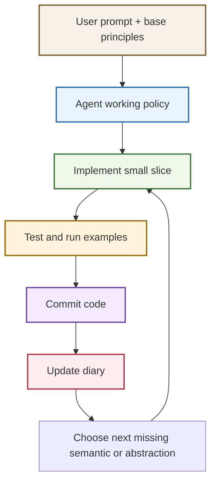
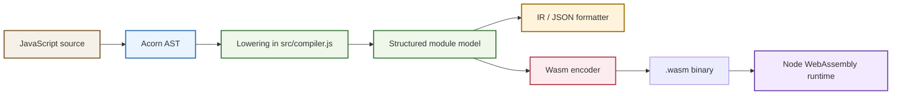

# GPT Base Principles Compiler Experiment

This project is an experiment in whether a small set of base principles can materially improve how GPT builds complex software over an extended session. The concrete artifact is a JavaScript-to-WebAssembly compiler, but the deeper subject is the interaction between prompting, iteration discipline, and software architecture quality.

> [!summary]
> The project currently has three important identities:
> 1. a prompt-design experiment about whether explicit base principles change agentic software behavior
> 2. a real compiler project that grew from a tiny subset into a broader JS-to-Wasm system
> 3. a process experiment in diary-driven, commit-heavy, reviewable software construction

## Why this project exists

The project exists because "make the model smarter" is too vague to be operational. A more useful question is whether a compact set of principles can shape the model's default engineering behavior in a repeatable way.

In this repository, the principles were deliberately simple:

- write code to solve problems
- write prototypes and experiments
- build tools that help build the system
- create simpler abstractions when they clarify the problem
- iterate instead of speculating

Those are not language-model tricks. They are software-building heuristics. The goal was to see whether giving GPT a stable bias toward those heuristics would produce better long-running behavior: smaller commits, less speculative overdesign, more real validation, and cleaner architectural moves under pressure.

## Current project status

The project is in an active exploratory state, but the experiment has already produced a useful result.

What already exists:

- a working JS-to-Wasm compiler with a coherent supported subset
- a CLI compiler entry point
- runtime tests, examples, demo scripts, and IR fixtures
- a detailed implementation diary documenting failures, decisions, and checkpoints
- a Git history that captures architecture growth in small, reviewable slices
- a concrete process record that can be inspected for evidence of whether the principles helped

What is still incomplete:

- the compiler is still far from full JavaScript semantics
- the experiment is not a scientific counterfactual comparison against a principle-free baseline
- richer runtime types are still narrow and deliberately constrained
- dynamic object behavior remains fixed-shape rather than open-ended JavaScript object semantics

## What this experiment suggests so far

The short answer is yes: the base principles appear to have helped.

Not because they made the model magically more capable, but because they gave it a durable bias toward productive engineering moves. The strongest evidence is in the shape of the repository, not in any single claim. The project did not stall in planning. It did not jump straight to an over-abstract runtime. It kept acquiring missing capabilities through small, test-backed, committed slices.

The principles especially seem to have improved four behaviors:

1. **Compression toward executable work**
   The session repeatedly chose implementation, tests, and verification over long speculative explanation.

2. **Architectural simplification before extension**
   Before adding features like expression branching, loop control, and capture-by-reference closures, the compiler was first refactored into smaller helpers or more explicit abstractions.

3. **Tool-building as a force multiplier**
   The project added IR dumping, JSON dumping, fixture regeneration, examples, and validation scripts early. Those tools paid for later features by making debugging and review cheaper.

4. **Iterative semantic widening**
   The compiler grew in a sequence that is unusually coherent for an AI-built system: control flow, expression branching, inspection tooling, loop control, fixtures, closures, arrays, objects, string values, and dynamic property dispatch.

## Current project status of the compiler itself

The compiler now supports a serious, though still narrow, JavaScript subset built around integer execution plus heap-backed aggregates.

Important supported areas include:

- top-level function declarations
- `let`, `const`, and hoisted `var`
- integer, boolean, and static string literals
- arithmetic, bitwise operations, comparisons, and short-circuit logic
- `if`, `switch`, `while`, `do...while`, and `for`
- labeled and unlabeled `break` and `continue`
- sequence expressions, ternaries, update expressions, and compound assignments
- closure creation and calls
- by-reference captured mutation through heap cells
- fixed-size arrays with bounds checks
- fixed-shape objects
- dynamic object property dispatch over known property sets
- `print(...)` for `i32` and string-valued expressions

This is no longer a toy emitter. It is a real compiler for a coherent subset.

## Project shape

At a high level, the project has four layers:

1. **Prompt layer**
   The base principles define the model's default engineering posture.

2. **Compiler layer**
   JavaScript is parsed with Acorn, lowered into an internal Wasm-oriented module structure, and encoded into binary WebAssembly.

3. **Verification layer**
   Runtime tests, examples, IR dumps, and fixtures make the compiler inspectable and regression-resistant.

4. **Process layer**
   Frequent commits and a detailed diary make the project auditable as a software-construction experiment.

## Architecture





Key code locations:

- `/home/manuel/code/wesen/2026-03-25--generic-agent-gpt/src/compiler.js`
- `/home/manuel/code/wesen/2026-03-25--generic-agent-gpt/src/wasm/encoder.js`
- `/home/manuel/code/wesen/2026-03-25--generic-agent-gpt/src/format.js`
- `/home/manuel/code/wesen/2026-03-25--generic-agent-gpt/src/cli.js`
- `/home/manuel/code/wesen/2026-03-25--generic-agent-gpt/test/compiler.test.js`
- `/home/manuel/code/wesen/2026-03-25--generic-agent-gpt/docs/diary.md`

## Implementation details

The most interesting part of this project is not only the compiler logic, but how the base principles influenced the compiler logic.

### 1. The principles were translated into process constraints

The model was not simply told to "be good at programming." It was repeatedly pushed toward a specific loop:

```text
pick the next concrete gap
-> implement it directly
-> test it against real runtime behavior
-> commit it
-> write down what failed and why
-> only then widen the design
```

That matters because many AI coding failures are really failures of default process:

- too much speculative design
- too much unverified code
- too many large, blurry diffs
- not enough introspection tooling
- not enough persistence when a bug becomes subtle

This repository shows the opposite pattern. The IR dump and fixture pipeline, for example, were not the end goal. They were tool-building moves that made later semantic work possible.

### 2. The compiler architecture stayed explicit instead of “smart”

The compiler is still mostly one large module, but it is explicit in the right places. It does not pretend to have a full JS runtime or a full type system. Instead it builds a strict subset with clear runtime layouts.

A simplified sketch of the core compile flow looks like this:

```text
compileSource(source):
  ast = acorn.parse(source)
  moduleState = createModuleState(ast)
  functions = compile top-level functions
  closureFunctions = compile lifted closure helpers
  module = {
    imports,
    functions,
    dataSegments,
    memory
  }
  return encodeModule(module)
```

That simplicity is one of the strongest signs that the principles helped. The session kept choosing architectures that could actually be finished.

### 3. Features were added by strengthening underlying models

Several of the later features were only possible because the session first simplified an abstraction.

Examples:

- `break` / `continue` support came after introducing explicit loop ids and branch placeholder resolution.
- by-reference closure capture came after binding loads/stores were unified instead of being special-cased in each expression form.
- dynamic object property access came after string values became first-class interned runtime values.
- top-level function return analysis widened from closures only to a generic value-kind summary so string/object/closure metadata could survive across calls.

This is the strongest technical evidence that the base principles were useful. The prompt did not merely produce more code. It repeatedly produced the move “simplify the model first, then add the feature.”

### 4. The runtime model grew in a disciplined way

The compiler currently has a small family of heap-backed runtime layouts.

#### Closures

Closures are heap records containing a closure tag and environment pointers. Captured mutable bindings are promoted to heap cells, so closures see live state rather than snapshots.

#### Arrays

Arrays are contiguous memory blocks with a length cell followed by element cells. Reads and writes use a shared address helper, and that helper now performs bounds checks.

#### Strings

Strings are interned static records in linear memory:

```text
[string length: i32][utf8 bytes...]
```

That design is simple but surprisingly powerful. It allows:

- string-valued locals
- top-level functions that return strings
- closures that print captured strings
- pointer-based dispatch for dynamic object property names

#### Objects

Objects are fixed-shape contiguous property cells. They are not dynamic dictionaries. The shape is compile-time known, but the selected property can be runtime dynamic as long as the key evaluates to one of the interned property names.

A simplified dynamic object dispatch path looks like this:

```text
compileDynamicObjectPropertyAddress(objectExpr, keyExpr, shape):
  objectPtr = eval(objectExpr)
  keyPtr = eval(keyExpr)

  for property in shape.properties:
    if keyPtr == intern(property.name):
      return objectPtr + property.offset

  trap unreachable
```

This is a good example of the experiment working well. Instead of trying to build “real JS objects” too early, the session found a smaller runtime model that still added meaningful dynamic behavior.

### 5. The project became reviewable because tooling was treated as part of the product

The repo contains more than source code:

- `scripts/check.sh` for full validation
- `scripts/update-ir-fixtures.sh` for regenerating representative lowered IR
- example programs and runners under `examples/`
- IR fixtures in `test/fixtures/ir/`
- a long implementation diary in `docs/diary.md`

That matters because reviewability is one of the real outcomes of the principle set. The project is not only functional; it is legible.

### 6. The failure modes are unusually well preserved

One of the best signals in the diary is the nature of the bugs that were fixed:

- stack discipline bugs in Wasm lowering
- value-vs-pointer corruption during closure capture promotion
- stale fixture mismatches when a shared abstraction changed
- address `0` accidentally colliding with the first interned string
- return-value summaries collapsing to `null`
- metadata gaps where string-valued expressions compiled correctly but were later treated as plain integers

These are not beginner-level mistakes. They are exactly the kinds of problems that appear when building real compilers and runtimes. The fact that the session kept isolating, explaining, and fixing them is part of the experiment result.

## Evidence that the principles helped

The best evidence is structural.

### Commit structure

The Git history is composed of narrow, meaningful steps rather than one giant undifferentiated implementation commit. Recent slices include:

- `3dd39de` `Add by-reference closure captures`
- `f17df87` `Add array bounds checks`
- `7426cba` `Add fixed-shape object literals`
- `82897a0` `Add string values and dynamic object dispatch`

### Tooling trajectory

The project repeatedly invested in tools that improved future work:

- IR dumping
- JSON dumping
- fixture regeneration
- examples and runtime runners
- `check.sh`
- the diary itself

### Architectural trajectory

The compiler did not grow randomly. It widened by moving through recognizable semantic layers:

1. numeric control flow
2. expression branching and logical semantics
3. inspection tooling
4. loop control
5. closures
6. arrays
7. object layout
8. string values and dynamic dispatch

That sequence is exactly what one would hope to see from a principles-guided coding session.

## Important project docs

The most important project-local docs are:

- `/home/manuel/code/wesen/2026-03-25--generic-agent-gpt/README.md`
- `/home/manuel/code/wesen/2026-03-25--generic-agent-gpt/docs/diary.md`
- `/home/manuel/code/wesen/2026-03-25--generic-agent-gpt/test/compiler.test.js`

These matter more than a separate design doc because they preserve the experiment in executable form.

## Open questions

- How much of the observed improvement came from the principles themselves versus the strong surrounding execution rules such as commit frequency, diary updates, and persistence?
- Would the same principles help as much on an existing large codebase instead of a greenfield compiler?
- Should the next expansion target richer runtime values, a more explicit IR pass, or a more general object/string runtime?
- How much broader can cross-scope value analysis become before it needs to be split into its own phase?
- What would a meaningful A/B comparison look like against a principle-free build of a similar project?

## Near-term next steps

- write a comparative reflection note on which principles were most visibly useful and which were mostly redundant with the surrounding agent instructions
- if the compiler continues, choose whether the next target is float support, broader string semantics, or a more general object model
- extract the generic value analysis from `src/compiler.js` if the compiler gains one more major runtime type
- consider a second experiment in a different problem domain to see whether the same principles generalize beyond compilers

## Project working rule

> [!important]
> When using GPT to build complex software, prefer principles that change the default work loop, not principles that merely describe desired outcomes.
> The useful prompt is not "be smart" but "solve the next real problem, simplify the model when needed, build the tool that makes the next step easier, and keep the work reviewable."
