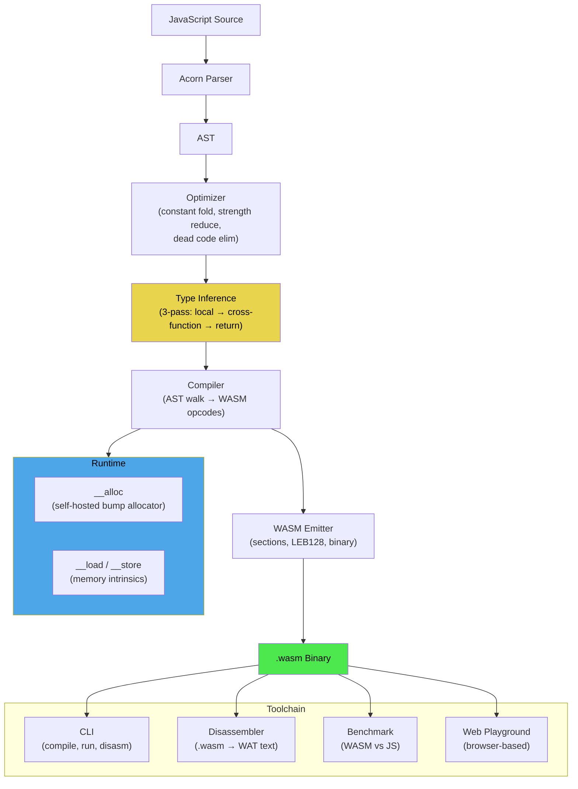

# Generic Agent — Principled Compiler Experiment

This project is an experiment in agent design: give Claude Code a small set of base principles in CLAUDE.md and a single open-ended instruction ("build a compiler from JS to WASM"), then observe whether those principles produce better, more autonomous software engineering than the default behavior. The artifact is a working JS-to-WASM compiler built from scratch across 35 commits and 14 implementation phases. The meta-goal is the observation: does principled self-direction work?

> [!summary]
> This project has two identities:
> 1. A **meta-experiment in agent design** — testing whether base principles improve Claude Code's autonomous software engineering
> 2. A **working JS-to-WASM compiler** with closures, type inference, higher-order functions, and 82 tests

## Why this project exists

The question behind this project is: what happens when you give an AI coding agent not specific instructions, but general principles about how to approach work?

The CLAUDE.md file for this project contains only six lines of actual content:

```
you can write code to solve problems
you can write code to build prototypes and experiments
you can write code to build tools (also tools to help you write code)
you can create new abstractions / new domain specific languages
you can iterate on all of these things
```

The hypothesis is that these principles, combined with a sufficiently open-ended task ("build a compiler"), would produce emergent behaviors that are hard to get from specific instructions: self-directed architecture decisions, building debugging tools before they're needed, refactoring toward simplicity, and recognizing when to apply a principle retroactively to existing code.

The user's additional behavioral directives — commit often, keep a diary, never use plan mode, repeat principles after each commit — were designed to keep the agent in a tight build-test-commit loop rather than spending tokens on analysis.

## The experiment: what actually happened

### Observed behaviors that the principles produced

**"Build tools to help you write code"** — The agent built a disassembler (Phase 3) before it was asked to, because it needed to debug WASM output. It built a benchmark tool, a CLI, and a web playground. Each tool was built proactively at the moment it became useful, not because the user requested it.

**"Create new abstractions to formulate problems simply"** — The agent recognized that its hand-assembled `__alloc` function (25 lines of raw WASM bytes) could be rewritten in the compiler's own JS subset. This self-hosting moment (Phase 7, commit 0efeb3a) was explicitly called out as "the create abstractions principle applied to itself." The agent also extracted `emitLoop()` to unify while/for loop compilation, and designed the closure struct representation as a clean abstraction over WASM's flat memory model.

**"Iterate on all of these things"** — The closure implementation went through three iterations in a single session: first capture-by-value with direct `__env` loads, then pre-loading into locals for read+write, then full boxing for shared mutable state. Each iteration was committed separately with its own tests. The agent never tried to design the final system upfront.

**"Apply principles retroactively"** — After each commit, the agent explicitly reviewed what it had just done against the principles. This led to concrete improvements: the `emitLoop` extraction happened because the agent noticed duplicate code during a retroactive review, not because it was planned.

### Observed behaviors compared to default Claude Code

Without these principles, the typical Claude Code pattern on a large open-ended task is:

- Ask clarifying questions before starting
- Propose a plan and wait for approval
- Build the minimum requested feature
- Stop and ask what to do next

With the principles, the observed pattern was:

- Start coding immediately (no plan mode was enforced)
- Build supporting tools proactively (disassembler, benchmark)
- Commit after each working increment (35 commits, ~1 per feature)
- Self-direct toward the next logical feature without asking
- Recognize and act on architectural opportunities (self-hosting, lambda lifting)
- Continue iterating until the system felt "complete"

The most notable difference was **sustained autonomous momentum**. The agent compiled 14 phases of increasing complexity — from basic arithmetic to cross-function type inference — across what would typically require multiple separate prompting sessions. The principles gave it permission to keep going.

### Where the principles didn't help

The principles don't provide domain expertise. The agent still had to figure out WASM binary encoding, LEB128, the section ordering constraint, and the `call_indirect` type index resolution problem through trial and error. Several bugs (the for-loop continue issue, the callee-skip in captured variable detection, the `7.0` float literal erasure) required debugging cycles that principles alone couldn't prevent.

The principles also don't prevent over-engineering. The type inference system (3-pass cross-function propagation) is arguably more complex than needed for a teaching compiler. A simpler annotation-based approach would have been faster to implement and easier to understand. The "iterate" principle sometimes led to adding sophistication rather than recognizing when to stop.

## Current project status

The compiler is feature-complete for its intended scope.

What exists:

- A 1,304-line compiler (`src/compiler.js`) that handles a substantial JS subset
- A 268-line WASM binary emitter (`src/wasm-emitter.js`)
- A 170-line AST optimizer with constant folding, strength reduction, dead code elimination
- A 271-line disassembler that renders WASM binaries as WAT-like text
- A CLI, benchmark tool, and browser-based web playground
- 82 tests across 3 test files (937 + 69 + 97 lines)
- 14 example programs including Mandelbrot, Game of Life, quicksort, and functional programming patterns
- A detailed implementation diary (`diary.md`, 279 lines)

Final line counts:

| Component | Lines |
|-----------|-------|
| Compiler | 1,304 |
| WASM Emitter | 268 |
| Optimizer | 170 |
| Disassembler | 271 |
| CLI + Benchmark | 154 |
| Tests | 1,103 |
| Examples | ~500 |
| Web playground | 177 |
| Diary | 279 |
| **Total** | **~4,200** |

## Project shape

The project has three layers that emerged naturally from the principles:

1. **The compiler pipeline** (the "solve problems" principle)
   - Parser (acorn) -> Optimizer -> Type Inference -> Compiler -> WASM Emitter
2. **The toolchain** (the "build tools" principle)
   - CLI, disassembler, benchmark, web playground
3. **The documentation** (the "iterate" principle applied to knowledge)
   - Diary, commit messages, inline comments at tricky spots

## Architecture



## Implementation details

### The WASM binary emitter

The emitter produces valid `.wasm` binaries from scratch — no toolchain dependency, no text format intermediate. A WASM binary is a sequence of typed sections, each prefixed by a section ID byte and a LEB128-encoded size. The emitter handles eight section types: Type (1), Import (2), Function (3), Table (4), Memory (5), Export (7), Element (9), and Code (10). Sections must appear in ID order — this was a source of a real bug when the Table section was initially placed after Memory.

LEB128 encoding is used everywhere WASM needs an integer. The unsigned variant (`encodeULEB128`) emits 7 bits per byte with a continuation flag in the high bit. The signed variant (`encodeSLEB128`) sign-extends. Float constants use IEEE 754 little-endian 8-byte encoding. The emitter is 268 lines and has no dependencies.

### The compilation strategy

The compiler takes a two-pass approach. The first pass collects all function names so that forward references work (function A can call function B even if B is defined after A). The second pass compiles each function body by walking the AST and emitting WASM stack machine opcodes.

Every expression pushes exactly one value onto the WASM stack. Every statement consumes whatever its contained expressions pushed. Expression statements (like `x = 5` used as a statement) emit a `drop` to discard the produced value. This invariant — "one expression, one value" — is what makes the stack machine compilation tractable. It was arrived at through debugging, not designed upfront.

Functions always end with a default return value (`i32.const 0` or `f64.const 0.0`) to satisfy WASM's requirement that all control paths produce a value. This was the fix for the first major WASM validation error encountered in Phase 5.

### Closure implementation via lambda lifting

Closures were the most architecturally significant feature. WASM has no notion of closures, nested functions, or captured variables. The compiler implements them through lambda lifting — transforming inner functions into top-level functions with an explicit environment parameter.

The closure representation is a heap-allocated struct:

```
offset 0: table_index (i32) — index into the WASM funcref table
offset 4: captured_var_0 (i32 or f64 value, or box pointer)
offset 8: captured_var_1
...
```

When a closure is created, the compiler:
1. Lifts the inner function to a top-level WASM function with a hidden `__env` first parameter
2. Allocates the struct on the heap via `__alloc`
3. Stores the table index and current values of all captured variables
4. The closure value is just the struct pointer (an i32)

When a closure is called, the compiler:
1. Pushes the closure pointer as `__env` (first argument)
2. Pushes the actual arguments
3. Loads the table index from offset 0 of the struct
4. Emits `call_indirect` to dispatch through the WASM table

The `call_indirect` instruction requires a type signature index. These are pre-registered by scanning the entire AST for all closure arities before compilation begins. This avoids the need to patch type indices after the fact — a much cleaner approach than the first attempt, which tried to defer and backpatch bytes in the output array.

### Boxing for shared mutable captures

A variable that is both captured by a closure AND mutated somewhere needs "boxing" — indirection through a heap cell so that the outer scope and the closure share the same storage. The compiler detects this with `findBoxedVars`, which intersects the set of captured variables with the set of mutated variables.

For a boxed variable:
- At function entry, a 4-byte heap cell is allocated and the pointer stored in the local
- Every read becomes `local.get ptr; i32.load` (dereference)
- Every write becomes `local.get ptr; value; i32.store` (store through pointer)
- The closure struct stores the heap pointer, not the value

This gives correct reference semantics. The counter pattern `let count = 0; let inc = () => { count++; return count; }; inc(); inc(); inc();` returns 1, 2, 3 — the outer scope's `count` is 3 after three calls.

### Type inference without annotations

The compiler supports two numeric types (i32 and f64) without any type annotations. The inference works in three passes:

1. **Local inference**: Scan each function body for float literals. A literal is float if its acorn `raw` text contains a decimal point (this catches `7.0`, which JavaScript's `Number.isInteger` treats as an integer). Variables initialized from float expressions are marked as f64.
2. **Cross-function propagation**: If a call site passes a float argument, the callee's corresponding parameter is marked as f64. This propagates across function boundaries.
3. **Return type propagation**: If a function has any f64 variables, it returns f64. Variables that store the result of calling a float function are marked as f64.

At every boundary where types don't match, the compiler inserts `f64.convert_i32_s` or `i32.trunc_f64_s`. This happens at call sites, variable initializations, and return statements.

The Mandelbrot example exercises this fully: `mandelbrot(cx, cy, maxIter)` takes float params inferred from the call site in `test()`, does float arithmetic internally, and returns an integer iteration count that the caller stores in an i32 variable.

### The self-hosting allocator

The heap allocator (`__alloc`) is written in the compiler's own JS subset:

```js
function __alloc(bytes) {
  let ptr = __load(0);
  if (ptr == 0) { ptr = 4; }
  __store(0, ptr + bytes);
  return ptr;
}
```

`__load` and `__store` are compiler intrinsics that map directly to `i32.load` and `i32.store`. Address 0 stores the heap pointer. The allocator is prepended to the user's source code and compiled by the compiler itself — the compiler compiles its own runtime.

This is a bump allocator: it never frees memory. For long-running programs this leaks, but for the scope of this project it keeps the runtime simple (6 lines of JS, zero lines of hand-written WASM).

### Tricky bugs and their fixes

**For-loop `continue` infinite loop** (Phase 10): `continue` in a for-loop must execute the update expression (`i++`) before jumping back to the test. The initial implementation jumped directly to the loop header, skipping the update. Fix: wrap the loop body in an extra WASM block so that `continue` (a `br` to the block end) falls through to the update code before the back-edge.

**Callee identity in captured variable detection** (Phase 12): `findCapturedVars` was skipping identifiers in callee position (`f` in `f(x)`), assuming they were function names. But in `(x) => f(g(x))`, `f` and `g` are captured closure variables being called. Removing the skip and relying on `resolveLocal` to filter out actual function names fixed the issue.

**Float literal `7.0` treated as integer** (Phase 14): JavaScript's `Number.isInteger(7.0)` returns `true` because `7.0 === 7`. The compiler couldn't distinguish `7` from `7.0` in the parsed AST. Fix: check acorn's `raw` property on literal nodes, which preserves the source text including the decimal point.

**Cross-function type mismatch** (Phase 14): A function with float params inferred locally would receive i32 values from callers that didn't know about the callee's types. Fix: 3-pass global inference that propagates type information across call sites before compilation begins.

## Commit history and phase progression

The 35 commits tell the story of incremental construction:

```mermaid
flowchart LR
    P1["Phase 1\nWASM Emitter"] --> P2["Phases 2-4\nArithmetic\nParams, Calls"]
    P2 --> P5["Phase 5\nControl Flow"]
    P5 --> P6["Phase 6\nFor Loops\nTernary"]
    P6 --> P7["Phase 7\nArrays\nLinear Memory"]
    P7 --> SH["Self-Hosting\nRuntime"]
    SH --> P8["Phase 8\nLogical Ops"]
    P8 --> P9["Phase 9\nOptimizer"]
    P9 --> P10["Phase 10\nbreak/continue"]
    P10 --> P11["Phase 11\nHost Imports"]
    P11 --> P12["Phase 12\nClosures"]
    P12 --> P13["Phase 13\nBoxing"]
    P13 --> P14["Phase 14\nFloat (f64)"]
    P14 --> SW["Switch\nStatements"]

    style SH fill:#4da6e8,color:#000
    style P12 fill:#e8d44d,color:#000
    style P14 fill:#e8d44d,color:#000
```



Tooling commits (CLI, disassembler, benchmark, web playground, examples) are interspersed throughout — they were built when needed, not batched at the end. The diary was updated incrementally after significant phases.

## Benchmark results

| Program | WASM vs JS | WASM bytes |
|---------|-----------|-----------|
| fibonacci(30) | 1.9x faster | 95 |
| sieve(10000) | 2.4x faster | 346 |
| quicksort(10) | 1.3x faster | 523 |
| matrix 4x4 | 2.3x faster | -- |

## Important project files

- `/home/manuel/code/wesen/2026-03-25--generic-agent/src/compiler.js` — the main compiler (1,304 lines)
- `/home/manuel/code/wesen/2026-03-25--generic-agent/src/wasm-emitter.js` — WASM binary generation
- `/home/manuel/code/wesen/2026-03-25--generic-agent/src/optimizer.js` — AST optimization passes
- `/home/manuel/code/wesen/2026-03-25--generic-agent/src/disassembler.js` — WASM binary to text
- `/home/manuel/code/wesen/2026-03-25--generic-agent/diary.md` — detailed implementation narrative
- `/home/manuel/code/wesen/2026-03-25--generic-agent/CLAUDE.md` — the six-line principled prompt
- `/home/manuel/code/wesen/2026-03-25--generic-agent/web/index.html` — browser playground
- `/home/manuel/code/wesen/2026-03-25--generic-agent/examples/` — 14 example programs

## Open questions

- Would the same principles produce equally good results on a different domain (not compilers)?
- Does the "iterate" principle cause over-engineering when there's no external stopping signal?
- Would adding a "know when to stop" principle improve outcomes, or would it make the agent too cautious?
- How much of the observed quality came from the principles vs. from the "commit often, diary, no plan mode" behavioral directives?
- Would a less capable model (Sonnet, Haiku) benefit equally from the same principles, or do they require a certain capability floor to be useful?

## Conclusions on the meta-experiment

The principled approach produced a qualitatively different kind of output compared to default Claude Code behavior. The key differences:

1. **Sustained autonomy** — The agent worked through 14 phases without needing to be re-prompted for each feature. The principles gave it permission and direction to keep going.
2. **Proactive tooling** — The disassembler, benchmark, and web playground were built without being asked. "Build tools to help you write code" manifested as concrete engineering decisions.
3. **Architectural coherence** — The closure design (heap struct + table + call_indirect) emerged from the "create abstractions" principle. The agent explicitly referenced the principles when making design choices.
4. **Self-correction through iteration** — The closure implementation went through three iterations in one session. The "iterate" principle made the agent comfortable shipping imperfect code and improving it.
5. **Retroactive improvement** — The self-hosting moment (rewriting `__alloc` in the compiler's own language) came from the "apply principles retroactively" directive. The agent recognized it could eat its own dogfood.

The biggest limitation: the principles don't prevent the agent from going deep rather than broad. The 3-pass type inference system is impressive but arguably unnecessary. A "know when the investment exceeds the return" principle might help, but risks making the agent too conservative.

Overall, this experiment suggests that **base principles are a better steering mechanism than detailed instructions** for open-ended software engineering tasks. They produce more coherent architecture, better tooling, and more sustained momentum than the default ask-plan-implement-ask cycle.

## Project working rule

> [!important]
> This project is an experimental artifact, not a production tool.
> Its value is in the process (the commit history, diary, and observable agent behaviors), not just the final code.
> Preserve the commit history and diary as primary documentation of the experiment.
