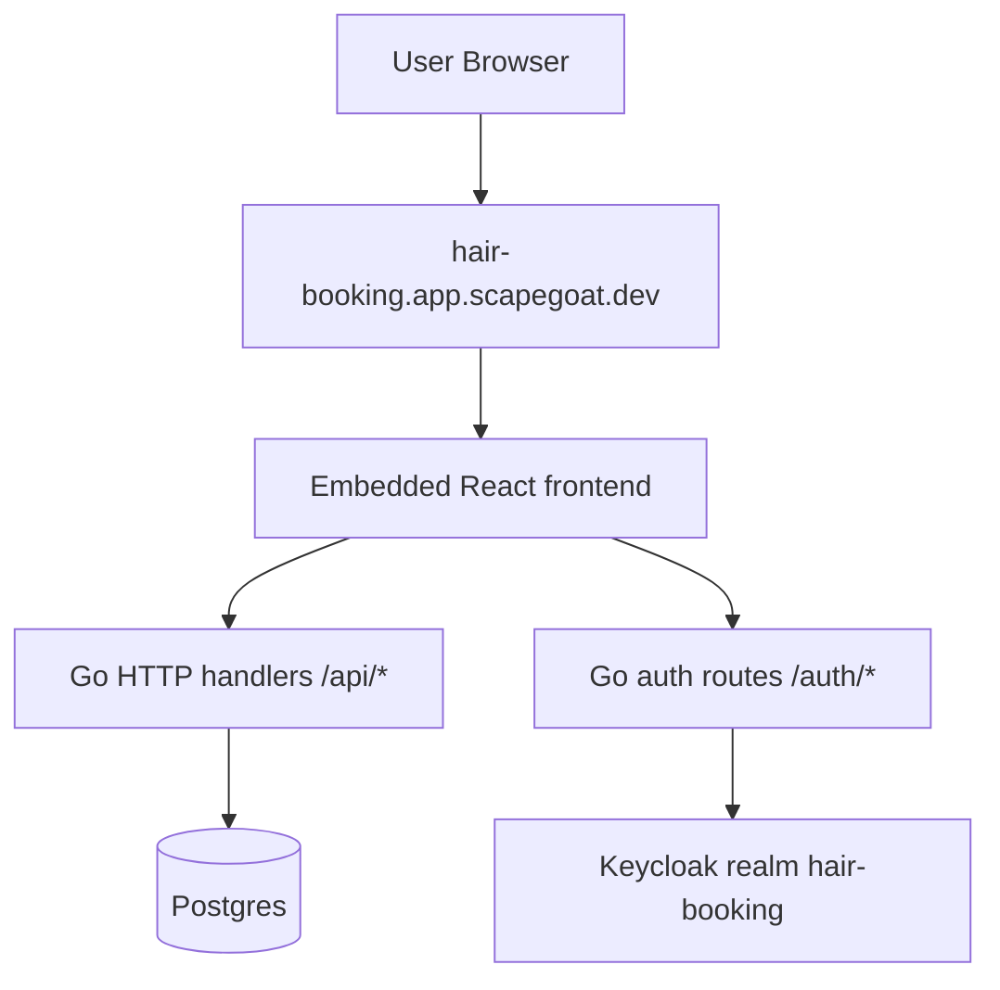
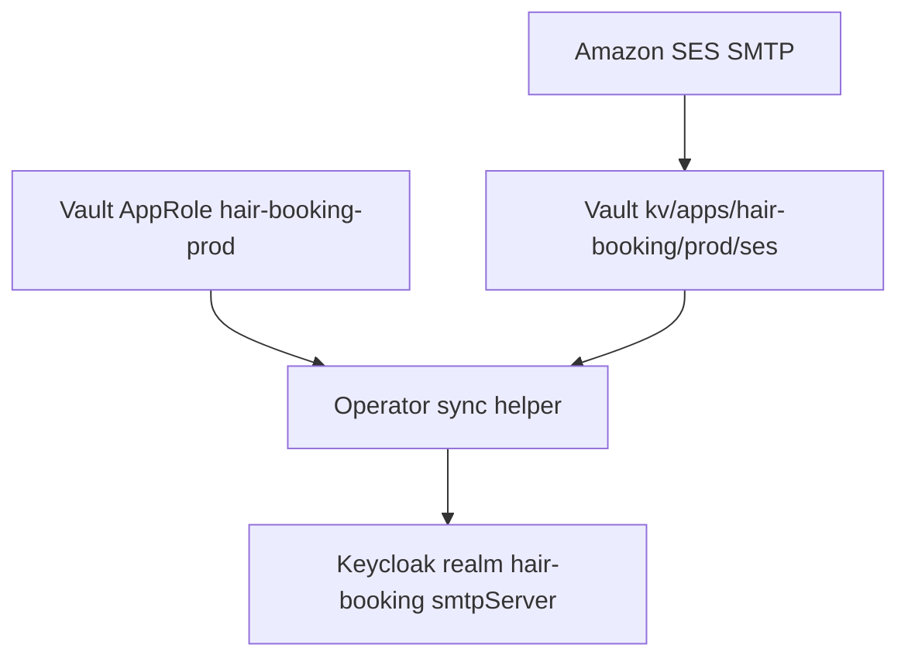
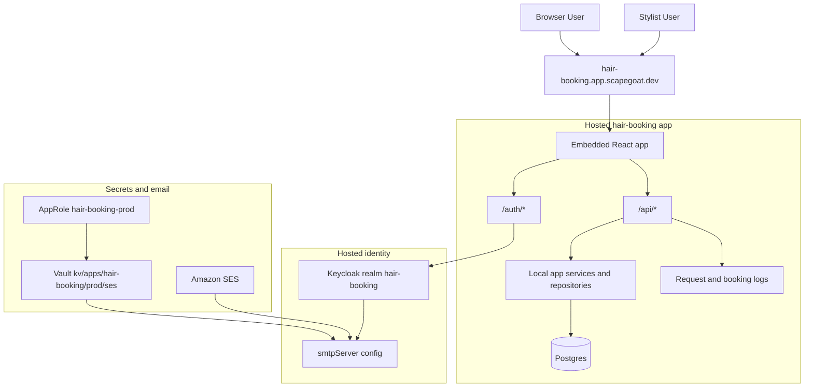

# Hair Booking - MVP Buildout, Hosted Auth, Vault, and Production Fixes

This note is the project-level report for the work completed in the `hair-booking` effort across the app repo and the shared Terraform repo during this session arc. It is not a single-ticket summary. It is the stitched-together story of the backend MVP design, the frontend integration, the stylist workflow buildout, the hosted deployment, the Keycloak realm separation, SES and Vault integration, and the first production debugging cycle after going live.

> [!summary]
> This session pushed `hair-booking` across five thresholds:
> 1. the imported Storybook-driven frontend stopped being mostly mock data and became a real Go + React + Postgres MVP with booking, portal, and stylist flows
> 2. the app stopped depending on a shared `smailnail` Keycloak setup and moved to its own hosted realm `hair-booking`
> 3. transactional email became real through SES, then safer through Vault-backed SMTP secret retrieval
> 4. the app stopped being a local-only prototype and was deployed to Coolify with the React frontend embedded into the Go binary
> 5. the first real production booking bug was diagnosed and fixed, and the app now has materially better request and booking error logging

## Related ticket bundles

The main session arc ran through these tickets in the app repo:

- `HAIR-002`: backend MVP design
- `HAIR-003`: frontend RTK Query integration
- `HAIR-004`: MVP readiness review
- `HAIR-005`: app shell, auth routing, and runtime scope cleanup
- `HAIR-006`: stylist backend operations MVP
- `HAIR-007`: stylist frontend operations MVP
- `HAIR-008`: MVP photo workflows
- `HAIR-009`: embed React in Go and deployment cleanup
- `HAIR-010`: separate Keycloak realm, signup, SES, Vault, and social-login planning
- `HAIR-011`: production booking failure and production logging

The infra side of the session also relied on Terraform tickets, especially:

- `TF-002-SES-TERRAFORM`
- `TF-008-VAULT-AUTH-HARDENING`
- `TF-010-HAIR-BOOKING-VAULT-SES`

## Why this report exists

The session touched too many different layers to leave the durable story only inside ticket docs. If someone starts from the repo alone, they will see a functioning Go backend, an embedded React frontend, a hosted Keycloak realm, SES-backed email, Vault scripts, deployment playbooks, and a large amount of documentation, but they will not automatically understand:

- what changed first and what depended on what
- which repo owns which part of the system
- which parts are real production infrastructure and which are still operator scripts
- what went wrong while deploying and debugging
- what is complete versus still deferred

This note is meant to be the answer to: “what did this session actually accomplish, how does the system hang together now, and what should the next engineer know before touching it?”

## Scope and evidence

This report is based on:

- Git work in:
  - `/home/manuel/workspaces/2026-03-19/hair-signup/hair-booking`
  - `/home/manuel/code/wesen/terraform`
- ticket docs and diaries under:
  - `/home/manuel/workspaces/2026-03-19/hair-signup/hair-booking/ttmp/`
  - `/home/manuel/code/wesen/terraform/ttmp/`
- deployment and operator docs under:
  - `/home/manuel/workspaces/2026-03-19/hair-signup/hair-booking/docs/`
- live hosted verification against:
  - `https://hair-booking.app.scapegoat.dev`
  - `https://auth.scapegoat.dev/realms/hair-booking`

## Current project status

The app is now a real hosted MVP, not just a design or Storybook import.

### What now exists

- A Go backend with PostgreSQL persistence for:
  - clients
  - intake submissions
  - intake photos
  - services
  - appointments
  - maintenance plans
  - stylist intake reviews
  - stylist client and appointment views
- A React frontend embedded into the Go app for:
  - public booking flow
  - authenticated client portal
  - authenticated stylist workspace
- A dedicated hosted Keycloak realm:
  - `hair-booking`
- Local password signup and login
- Verify-email and forgot-password flows backed by SES
- Vault-backed SMTP credential retrieval for hosted Keycloak SMTP sync
- A Coolify deployment path serving:
  - `/booking`
  - `/portal`
  - `/stylist`
  - `/api/*`
  - `/auth/*`
- Better production request/error logging for booking flows

### What is still incomplete

- Google identity provider rollout
- Facebook identity provider rollout
- final shared-operator delivery model for Vault AppRole bootstrap material
- broader cleanup of legacy/non-MVP demo state that is now hidden but not fully deleted everywhere

## Workstream summary

The easiest way to understand the session is as six workstreams rather than one flat list.

### 1. Backend MVP design and implementation

The first workstream converted a route/schema sketch into a real backend design and then into code. The app ended up with a clear PostgreSQL-backed domain model for:

- clients
- services
- intake submissions
- photos
- appointments
- maintenance plans
- stylist review workflows

This work started as ticketed design and then became concrete handlers and repositories under:

- `/home/manuel/workspaces/2026-03-19/hair-signup/hair-booking/pkg/`
- `/home/manuel/workspaces/2026-03-19/hair-signup/hair-booking/pkg/db/migrations/`

### 2. Frontend integration and app-shell cleanup

The imported widget-heavy frontend originally behaved more like a design playground than a product. That changed in two steps:

1. RTK Query and real API integration replaced mocked read and write paths.
2. The app shell was cleaned up so runtime routes behave like a real application while leaving non-MVP/demo material available for Storybook/reference usage.

This produced a frontend with real data flows for:

- booking
- profile and notification preferences
- portal appointments
- stylist dashboard and workflow screens

Key frontend areas are:

- `/home/manuel/workspaces/2026-03-19/hair-signup/hair-booking/web/src/stylist/`
- `/home/manuel/workspaces/2026-03-19/hair-signup/hair-booking/web/src/stylist/store/api/`

### 3. Hosted deployment and Go-embedded frontend

The next threshold was deployment. The system stopped being “Go backend plus local Vite” and became “one hosted Go app with embedded frontend assets.”

The steady-state hosted model now looks like:



The important architectural consequence is that the runtime no longer depends on a separate frontend origin in production. `/` now redirects to `/booking`, and the hosted binary serves the SPA shell directly.

Key files:

- `/home/manuel/workspaces/2026-03-19/hair-signup/hair-booking/pkg/server/http.go`
- `/home/manuel/workspaces/2026-03-19/hair-signup/hair-booking/cmd/hair-booking/cmds/serve.go`
- `/home/manuel/workspaces/2026-03-19/hair-signup/hair-booking/docs/deployments/hair-booking-coolify-playbook.md`

### 4. Keycloak realm separation and hosted auth hardening

At the start of the session arc, `hair-booking` was not yet isolated from the broader identity experimentation happening around `smailnail`. That changed. The hosted app now uses:

- issuer: `https://auth.scapegoat.dev/realms/hair-booking`
- hosted app: `https://hair-booking.app.scapegoat.dev`

This work included:

- creating a dedicated realm
- aligning the app to the new issuer
- stabilizing login/logout redirect behavior
- documenting the Terraform-based realm ownership path

One important policy decision was to do a hard pre-production cutover rather than maintain a temporary shared-realm bridge. That simplified the final model significantly.

### 5. SES and Vault-backed SMTP integration

The realm work made local password signup possible, but not complete. The next threshold was real email.

The session first established SES delivery, then hardened the secret path by moving SMTP material into Vault and using an AppRole-based helper to read the secret and update Keycloak SMTP configuration.

The live shape is:



This is not “Keycloak reads Vault directly.” It is “Vault is the source of truth for the SMTP secret, and a helper syncs that secret into Keycloak.”

### 6. Production debugging and logging

After deployment, the app hit its first real production booking failure:

- photo retry behavior exposed a booking finalization problem
- `POST /api/appointments` returned a `500 appointment-create-failed`
- logs were too thin to diagnose the failure properly

This led to:

- a concrete production bug fix
- request logging with request IDs
- more explicit booking error logging
- a replayable production debug playbook

This was the first point where the project had to behave like a real production application rather than a local prototype.

## Architecture

The current mental model for the full system is:



The most important repo boundary is:

- app repo owns product code, runtime docs, and app-facing ticket docs
- Terraform repo owns realm/Vault/IAM scaffolding and infra-facing ticket docs

## Key implementation details

### Booking and intake model

The booking flow is centered around:

1. create intake
2. upload photos
3. fetch availability
4. create appointment

Pseudo-flow:

```text
POST /api/intake
  -> validate intake payload
  -> compute estimate
  -> insert intake_submissions row

POST /api/intake/:id/photos
  -> validate image type
  -> write local storage blob
  -> insert intake_photos row

GET /api/availability
  -> combine schedule blocks, overrides, existing appointments

POST /api/appointments
  -> find or create client
  -> validate slot and policy
  -> create appointment
  -> return appointment payload
```

Relevant code areas:

- `/home/manuel/workspaces/2026-03-19/hair-signup/hair-booking/pkg/server/handlers_public.go`
- `/home/manuel/workspaces/2026-03-19/hair-signup/hair-booking/pkg/appointments/`
- `/home/manuel/workspaces/2026-03-19/hair-signup/hair-booking/pkg/intake/`

### Stylist workflow model

The stylist side is deliberately modeled as single-stylist MVP, not multi-staff scheduling. That means:

- no `staff_users` table
- no `appointments.stylist_id`
- stylist review state is carried through intake review and appointment/status notes

This matters because the backend and frontend were both simplified around one operator rather than a salon team platform.

### Frontend integration strategy

The frontend integration chose RTK Query as the API boundary. That was the right choice because the imported widget/UI system had a lot of local mock state, and RTK Query provided a clean path to replace that with:

- explicit backend DTOs
- query/mutation hooks
- cache invalidation
- real browser-visible state transitions

Key files:

- `/home/manuel/workspaces/2026-03-19/hair-signup/hair-booking/web/src/stylist/store/api/base.ts`
- `/home/manuel/workspaces/2026-03-19/hair-signup/hair-booking/web/src/stylist/store/api/types.ts`
- `/home/manuel/workspaces/2026-03-19/hair-signup/hair-booking/web/src/stylist/store/api/stylistApi.ts`

### Storage model for photos

Photo storage is still local-storage-backed, not S3-backed. Uploads currently write to:

- `./var/uploads`

through the local storage implementation in:

- `/home/manuel/workspaces/2026-03-19/hair-signup/hair-booking/pkg/storage/local.go`

That is good enough for MVP and testing, but it is an important future scaling/data-durability boundary.

## Operational playbook map

The session left behind a much better operator-documentation surface.

Important app-repo docs now include:

- `/home/manuel/workspaces/2026-03-19/hair-signup/hair-booking/docs/deployments/hair-booking-coolify-playbook.md`
- `/home/manuel/workspaces/2026-03-19/hair-signup/hair-booking/docs/smoke-testing-playbook.md`
- `/home/manuel/workspaces/2026-03-19/hair-signup/hair-booking/docs/keycloak-ses-verification-playbook.md`
- `/home/manuel/workspaces/2026-03-19/hair-signup/hair-booking/docs/keycloak-vault-smtp-sync-playbook.md`

These are durable operations docs, not only ticket artifacts.

## What went wrong

Several failures during the session are worth preserving because they explain why the system looks the way it does now.

### 1. Hostname mixing in auth flows

The app initially mixed:

- `localhost`
- `127.0.0.1`

in OIDC flows. That broke state/cookie expectations and produced “invalid oauth state” callbacks.

Lesson:

- local auth flows must use one consistent host
- this was solved by standardizing local testing around `127.0.0.1`

### 2. Wrong runtime shell assumptions

The imported frontend defaulted to the wrong runtime entrypoints and still exposed non-MVP/demo concepts. This created confusion during testing until:

- route-based shell behavior was cleaned up
- `/` and auth return targets were made coherent
- hidden runtime-only scope decisions were enforced while leaving Storybook/demo assets intact

### 3. Coolify deployment auth friction

The deployment path was not blocked by app code. It was blocked by Coolify API token and scope confusion. The actual deployment succeeded only after:

- pushing the branch
- using the correct host-side/Coolify context
- redeploying the existing app

This is why the repo now has a stronger Coolify playbook.

### 4. Keycloak SMTP ownership ambiguity

At first it was tempting to make Terraform own everything, including SMTP password injection. That turned out to be the wrong mental model because secret-bearing realm configuration and Terraform state do not mix cleanly.

The resulting compromise was:

- Terraform owns non-secret realm configuration and Vault policy/AppRole scaffolding
- Vault owns the SMTP secret
- a helper syncs SMTP configuration into Keycloak

This is more awkward than “one tool owns everything,” but it is the safer shape.

### 5. Production booking bug plus poor logs

The first real hosted booking bug was hard to diagnose because logs only showed startup noise. That exposed a real gap:

- the app had enough functionality to fail in production
- but not enough request/error instrumentation to debug production efficiently

This led directly to the logging improvements in `HAIR-011`.

## Important fixes and lessons

### Design lesson: cut scope aggressively

The project improved once non-MVP features were treated as:

- preserved reference material
- but hidden from runtime and delivery scope

That prevented the frontend from presenting a wider product than the backend actually supported.

### Architecture lesson: one stylist is a feature

The single-stylist assumption simplified the domain significantly. It is not a missing feature. It is a correct product boundary for MVP.

### Ops lesson: hosted auth changes need runbooks

The most fragile work in the session was not the React UI or even the database schema. It was:

- identity provider boundaries
- SMTP secret handling
- hosted deployment behavior

Those areas now have explicit playbooks because ad hoc memory is not enough.

### Production lesson: logging is a feature

The production booking bug made it obvious that request and error logging are part of the MVP, not post-MVP polish.

## Current hosted verification state

As of the end of the session:

- `https://hair-booking.app.scapegoat.dev/` redirects to `/booking`
- the embedded React app is live in production
- the hosted issuer is:
  - `https://auth.scapegoat.dev/realms/hair-booking`
- local signup works
- verify-email works with a real mailbox
- forgot-password works with a real mailbox
- SES SMTP works
- Vault-backed SMTP sync works
- the original production booking `500` was fixed and replaced by correct slot validation behavior

## Files a new engineer should read first

If someone new has to continue this project, I would start them with:

### App repo

- `/home/manuel/workspaces/2026-03-19/hair-signup/hair-booking/README.md`
- `/home/manuel/workspaces/2026-03-19/hair-signup/hair-booking/docs/smoke-testing-playbook.md`
- `/home/manuel/workspaces/2026-03-19/hair-signup/hair-booking/docs/deployments/hair-booking-coolify-playbook.md`
- `/home/manuel/workspaces/2026-03-19/hair-signup/hair-booking/docs/keycloak-ses-verification-playbook.md`
- `/home/manuel/workspaces/2026-03-19/hair-signup/hair-booking/docs/keycloak-vault-smtp-sync-playbook.md`

### Ticket docs

- `/home/manuel/workspaces/2026-03-19/hair-signup/hair-booking/ttmp/2026/03/24/HAIR-010--separate-hair-booking-keycloak-realm-and-add-signup-social-login/design/03-hair-booking-keycloak-auth-postmortem.md`
- `/home/manuel/workspaces/2026-03-19/hair-signup/hair-booking/ttmp/2026/03/24/HAIR-010--separate-hair-booking-keycloak-realm-and-add-signup-social-login/design/04-hair-booking-ses-vault-cutover-postmortem.md`
- `/home/manuel/workspaces/2026-03-19/hair-signup/hair-booking/ttmp/2026/03/25/HAIR-011--debug-prod-booking-finalization-and-add-production-logging/design/01-prod-booking-bug-and-logging-guide.md`

### Infra repo

- `/home/manuel/code/wesen/terraform/ttmp/2026/03/25/TF-010-HAIR-BOOKING-VAULT-SES--integrate-hair-booking-with-vault-for-ses-smtp-credentials/playbooks/01-hair-booking-vault-ses-developer-handoff.md`
- `/home/manuel/code/wesen/terraform/ttmp/2026/03/24/TF-002-SES-TERRAFORM--set-up-ses-with-terraform/playbook/02-ses-smtp-integration-playbook.md`
- `/home/manuel/code/wesen/terraform/ttmp/2026/03/25/TF-008-VAULT-AUTH-HARDENING--implement-vault-auth-hardening-with-keycloak-and-a-go-end-to-end-example/playbooks/02-vault-approle-go-example-developer-guide.md`

## Open questions

- Should Google and Facebook identity providers be configured manually first and only later codified in Terraform, or should that codification happen immediately after rollout?
- Should the local photo storage remain local for MVP, or should object storage become part of the next operational hardening wave?
- What is the final operator delivery model for Vault AppRole bootstrap material?
- How much of the legacy hidden frontend/demo state should be deleted versus simply left hidden?

## Near-term next steps

The most sensible next sequence is:

1. add Google identity provider
2. add Facebook identity provider
3. decide whether provider configuration becomes Terraform-managed immediately afterward
4. improve the operator secret-delivery story for AppRole bootstrap material
5. continue operational hardening around logs, storage, and cleanup

## Project working rule

> [!important]
> Treat `hair-booking` as a real hosted product now. Changes to auth, booking creation, SMTP, deployment, and logging need playbooks and validation steps, not just code changes.

## KB reviews

- [[KB-BATCH8-hosted-auth]] (2026-05-11) — concept extraction + classification
