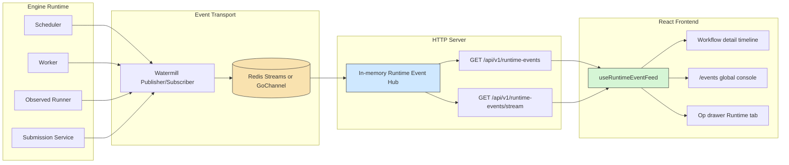
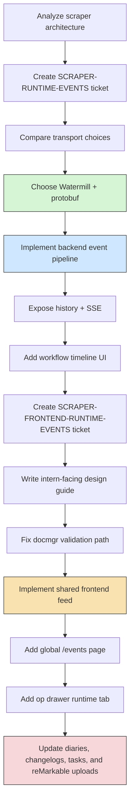

# Scraper Runtime Events Session Report

This is the runtime-events branch of the [[scraper]] project map.

This session turned the scraper repository from a mostly backend-oriented workflow engine into a system that now has a coherent runtime-event architecture, a documented transport/design decision trail, and the first operator-facing frontend surfaces for live monitoring. The work was not one single patch. It was a sequence: architecture analysis, ticket creation, transport/schema decisions, backend event-pipeline implementation, frontend follow-up design, validation/tooling cleanup, and then actual frontend implementation against that new design.

The repository now has a much clearer mental model: workers and server components emit protobuf-defined runtime events through Watermill, the API server keeps a replayable in-memory hub and exposes both history and SSE endpoints, and the React frontend has a reusable live-event data layer that powers a global `/events` view plus an op-scoped runtime tab in the workflow drawer.

> [!summary]
> This session had three major outputs:
> 1. a documented runtime-event architecture for scraper, including option analysis, schema decisions, and ticket history
> 2. a working backend-to-frontend runtime-event pipeline using protobuf, Watermill, Redis-capable transport, HTTP history, and SSE
> 3. the first reusable operator UI for live monitoring: a global event console and an op-scoped runtime-event drawer tab

## Why this project exists

The scraper repository is building a workflow-oriented scraping engine rather than a one-off script runner. The important problem is not only "run a scraper," but "run many workflow ops, track them, retry them, inspect them, and operate the system while it is live." That makes observability part of the product, not just an implementation detail.

Before this session, the repository already had a scheduler, worker, API server, SQLite-backed engine state, and a React frontend for workflows and queues. What it did not yet have was a mature runtime-event story that connected those layers in a way operators could actually use. Logs and operational state were still too implicit.

## Current project status

The repo is still in active buildout, but it is meaningfully more complete after this session.

What now exists:

- shared protobuf runtime-event schema across Go and TypeScript
- Watermill-backed event publishing and subscription
- Redis-capable event transport with a local GoChannel path for non-Redis use
- backend replay plus live SSE delivery
- workflow detail runtime event timeline
- global `/events` page in the frontend
- op-scoped runtime-event tab in the workflow drawer
- detailed ticket docs in `ttmp/` and corresponding reMarkable uploads

What remains incomplete:

- post-submit live progress on the submit page
- dashboard and queue widgets derived from runtime events
- a final product decision on whether `DEBUG` events should be shown by default in local views
- deeper frontend test coverage for stream behavior and component rendering

## Session scope

This session covered more than just a single UI patch. The major workstreams were:

1. analyze the existing scraper architecture and create a runtime-events ticket
2. evaluate transport choices, including Redis, merged server/worker topology, and Watermill
3. settle on Watermill plus protobuf as the first implementation direction
4. implement the backend runtime-event pipeline and first workflow timeline UI
5. create a second ticket focused on frontend runtime-event surfaces, with a detailed intern-facing implementation guide
6. file a `docmgr` GitHub issue when `docmgr doctor` panicked, then later revalidate once `docmgr` was fixed
7. implement Phase 1 and Phase 3 of the frontend runtime-event ticket
8. keep ticket docs, changelogs, diaries, and reMarkable uploads in sync with each implementation slice

## Project shape

At a high level, the repository now has five relevant areas for understanding the runtime-event work:

1. **Engine and scheduler backend**
   - `pkg/engine/`
   - `pkg/runtimeevents/`
   - `pkg/services/`
2. **HTTP/API layer**
   - `pkg/api/server/`
   - `pkg/api/handlers/`
3. **Shared schema**
   - `proto/`
   - `gen/`
   - `web/src/pb/`
4. **React frontend**
   - `web/src/pages/`
   - `web/src/components/`
   - `web/src/features/runtime-events/`
5. **Ticketed documentation**
   - `ttmp/2026/03/24/SCRAPER-RUNTIME-EVENTS--runtime-event-pipeline-for-worker-server-and-frontend/`
   - `ttmp/2026/03/24/SCRAPER-FRONTEND-RUNTIME-EVENTS--frontend-runtime-event-surfaces-for-operators/`

## Architecture

The core runtime-event architecture that emerged in this session looks like this:



The useful simplification is this: the backend emits and republishes typed events, while the frontend does not talk to Redis or Watermill directly. It only talks to the HTTP server, which offers a bounded replay window and a live SSE stream.

## Implementation details

The most important technical result from this session is that runtime events are now treated as a first-class cross-process contract instead of ad hoc logs. The implementation starts with the protobuf schema in `proto/scraper/runtime/v1/events.proto`, where `RuntimeEventV1` defines the shared shape: IDs, source, kind, severity, timestamp, workflow/op/site/worker identifiers, and a structured `payload`. That schema is then generated into both Go and TypeScript, which avoids the usual drift between backend event producers and frontend consumers.

Watermill became the organizing abstraction rather than the final product in itself. The repo now uses Watermill to normalize publish/subscribe mechanics while keeping Redis as the real cross-process transport option. That made it easier to wire backend producers incrementally. Instead of forcing every subsystem to understand Redis Streams directly, the code can publish typed runtime events through a Watermill wrapper and let the backend runtime-event resources decide whether the actual backend is Redis or an in-memory GoChannel path.

On the backend, there are three key technical moves:

1. map scheduler and runner activity into `RuntimeEventV1`
2. publish those events through a shared runtime-event publisher abstraction
3. subscribe on the API side into an in-memory hub that supports recent-history replay and live subscription

The API hub matters because it decouples frontend UX from transport topology. The frontend does not need to replay from Redis itself, and it does not need to understand Watermill. It can ask the API server for a short history and then merge in SSE messages as they arrive.

In pseudocode, the backend event path now looks like this:

```text
worker loop:
  scheduler emits scheduler.Event
  runtimeevents.FromSchedulerEvent(...) -> RuntimeEventV1
  publisher.Publish(event)

runner wrapper:
  emit "runner started" log event
  run actual op
  emit completion/error log event with payload
  publisher.Publish(event)

api server startup:
  open runtime-event subscriber
  start Watermill router
  for each incoming message:
    decode protobuf event
    add cloned event to in-memory hub

http request:
  GET /runtime-events      -> hub.Recent(filter)
  GET /runtime-events/stream -> hub.Subscribe(filter) -> SSE
```

On the frontend, the main design improvement was to stop treating `WorkflowDetailPage` as a special case. Originally it owned its own `EventSource`, decode logic, and merge/dedupe function. That worked for one page, but it would have led to duplication the moment `/events`, the op drawer, the submit page, or dashboard widgets wanted similar behavior.

The shared hook in `web/src/features/runtime-events/runtimeEventFeed.ts` is the new frontend center of gravity. It takes server filters such as `workflowId`, `opId`, `site`, and `workerId`, fetches recent history through the RTK Query API client, opens an SSE stream for the same filter, decodes each protobuf JSON event, merges by event ID, sorts by descending event time, and exposes connection state plus the last event timestamp. That makes page components thinner and more uniform.

In pseudocode, the frontend feed logic now looks like this:

```text
useRuntimeEventFeed(serverFilters, clientFilters, stream=true):
  query recent events with RTK Query
  build SSE query string from same server filters
  reset local event state when filter set changes

  on history response:
    merge history into local event map/list

  if stream enabled:
    open EventSource("/api/v1/runtime-events/stream?...filters...")
    on open -> connectionState = "live"
    on runtime-event:
      decode protobuf JSON
      merge event into local state
    on error -> connectionState = "error"

  return:
    filtered events
    all events
    loading state
    connection state
    last event timestamp
```

That shared hook then feeds three concrete frontend surfaces implemented in this session:

- the workflow detail page runtime timeline
- the global `/events` operator console
- the op drawer runtime tab

The op drawer work is especially valuable because it shows that the abstraction scales down as well as up. The drawer only streams while it is open and while the `Runtime` tab is active, and it filters by both `workflowId` and `opId`. That turns the drawer into a focused live inspection surface rather than a second copy of the global event page.

Another useful detail from this session is that payload rendering became meaningfully richer. The event list is no longer just a timestamp and one message line. It now surfaces the actual structured payload fields emitted by backend code: retry attempts, error codes, retryability, runner kind, emitted/record counts, HTTP method/path/status, workflow status, command path, site DB path, request IDs, artifact IDs, and queue names. That is a significant UX upgrade because it converts the event stream from "some logs" into an operator tool.

The repo-level failure modes that mattered most during this work were not algorithmic bugs so much as integration and tooling sharp edges:

- `docmgr doctor` originally crashed with a nil-pointer dereference, which forced a GitHub issue and temporary frontmatter-validation fallback
- topic vocabulary drift caused the frontend ticket to fail validation until `react` and `events` were restored in `ttmp/vocabulary.yaml`
- the first TypeScript test implementation used raw timestamp objects, but generated protobuf types required actual `Timestamp` message instances
- the op drawer patch initially failed because TypeScript could not prove the selected op spec was non-null across hook setup and render usage

Those are the kinds of problems that do not look important in a changelog but matter a lot when resuming work later.

## Session deliverables

### Ticket and documentation work

The session created and advanced two major ticket tracks:

- `/home/manuel/workspaces/2026-03-23/js-scraper/scraper/ttmp/2026/03/24/SCRAPER-RUNTIME-EVENTS--runtime-event-pipeline-for-worker-server-and-frontend/`
- `/home/manuel/workspaces/2026-03-23/js-scraper/scraper/ttmp/2026/03/24/SCRAPER-FRONTEND-RUNTIME-EVENTS--frontend-runtime-event-surfaces-for-operators/`

Those tickets contain:

- option analysis and implementation planning
- detailed design docs for a new engineer
- task lists
- changelogs
- chronological diaries

They were also uploaded to reMarkable under:

- `/ai/2026/03/24/SCRAPER-RUNTIME-EVENTS`
- `/ai/2026/03/24/SCRAPER-FRONTEND-RUNTIME-EVENTS`

### Backend implementation work

The backend runtime-event work completed in this session included:

- protobuf/Buf schema scaffolding
- Watermill wrapper and runtime-event codec helpers
- scheduler-to-runtime-event mapping
- worker, runner, submission, and server wiring
- HTTP history and SSE delivery
- Docker Compose support for Redis transport

### Frontend implementation work

The frontend work completed in this session included:

- extracting the shared runtime-event feed hook
- adding a global `/events` page
- adding route and navigation wiring
- expanding the shared runtime-event renderer
- adding an op-scoped runtime tab in the workflow drawer
- adding unit tests for feed helper behavior

## Session architecture map



## Important project docs

The most important repo-local documents produced or advanced in this session are:

- `/home/manuel/workspaces/2026-03-23/js-scraper/scraper/ttmp/2026/03/24/SCRAPER-RUNTIME-EVENTS--runtime-event-pipeline-for-worker-server-and-frontend/index.md`
- `/home/manuel/workspaces/2026-03-23/js-scraper/scraper/ttmp/2026/03/24/SCRAPER-RUNTIME-EVENTS--runtime-event-pipeline-for-worker-server-and-frontend/design-doc/01-event-transport-options-and-implementation-plan-for-worker-server-and-frontend.md`
- `/home/manuel/workspaces/2026-03-23/js-scraper/scraper/ttmp/2026/03/24/SCRAPER-FRONTEND-RUNTIME-EVENTS--frontend-runtime-event-surfaces-for-operators/index.md`
- `/home/manuel/workspaces/2026-03-23/js-scraper/scraper/ttmp/2026/03/24/SCRAPER-FRONTEND-RUNTIME-EVENTS--frontend-runtime-event-surfaces-for-operators/design-doc/01-frontend-runtime-event-surfaces-architecture-and-intern-implementation-guide.md`
- `/home/manuel/workspaces/2026-03-23/js-scraper/scraper/ttmp/2026/03/24/SCRAPER-FRONTEND-RUNTIME-EVENTS--frontend-runtime-event-surfaces-for-operators/reference/01-investigation-diary.md`

The related tooling issue filed during the session was:

- `https://github.com/go-go-golems/docmgr/issues/36`

## Commits from this session

The most relevant commits from the session are:

- `448d450` `Add protobuf runtime event schema scaffold`
- `33a9073` `Add Watermill runtime event wrapper`
- `a217cbf` `Map scheduler events to runtime events`
- `5e2808c` `Wire runtime events through worker and API server`
- `47c2c55` `Add runtime event timeline to workflow detail UI`
- `499f2a0` `Add frontend runtime event design ticket`
- `3dc241d` `Add shared frontend runtime event feed`
- `3ff5422` `Document frontend runtime event phase 1 progress`
- `bb8043a` `Add op-scoped runtime event drawer tab`
- `072075b` `Document op runtime drawer progress`

## Validation and review

The session repeatedly validated both code and docs. The relevant commands included:

```bash
go test ./... -count=1
npm run test:unit
npm run build
docmgr doctor --ticket SCRAPER-RUNTIME-EVENTS --stale-after 30
docmgr doctor --ticket SCRAPER-FRONTEND-RUNTIME-EVENTS --stale-after 30
```

The main residual warning is not a broken build, but a product/UX one: the frontend bundle is now large enough that Vite warns about the client chunk exceeding 500 kB after minification. That is not a blocker for this session’s work, but it is a real future cleanup target.

## Open questions

- Should `DEBUG` runtime events be shown by default in workflow-local and op-local views, or hidden behind a toggle?
- Should the submit page become the next primary live runtime-event surface, or should dashboard/queue widgets come first?
- Should the frontend eventually centralize event state further, or keep the current hook-plus-page-local-state approach?
- How much history should the API hub retain for the operator workflows the product wants to support?

## Near-term next steps

- add post-submit live progress to `web/src/pages/SubmitWorkflowPage.tsx`
- add overview and queue widgets derived from runtime events
- add stream-hook and component-level frontend tests
- decide the default visibility policy for `DEBUG` events
- consider chunk splitting for the frontend build if the operator UI continues to expand

## Project working rule

> [!important]
> Keep runtime-event work schema-first and continuation-friendly.
> That means: protobuf before ad hoc payload drift, shared frontend feed logic before page-specific SSE code, and ticket diary/changelog updates every time a new implementation slice lands.
