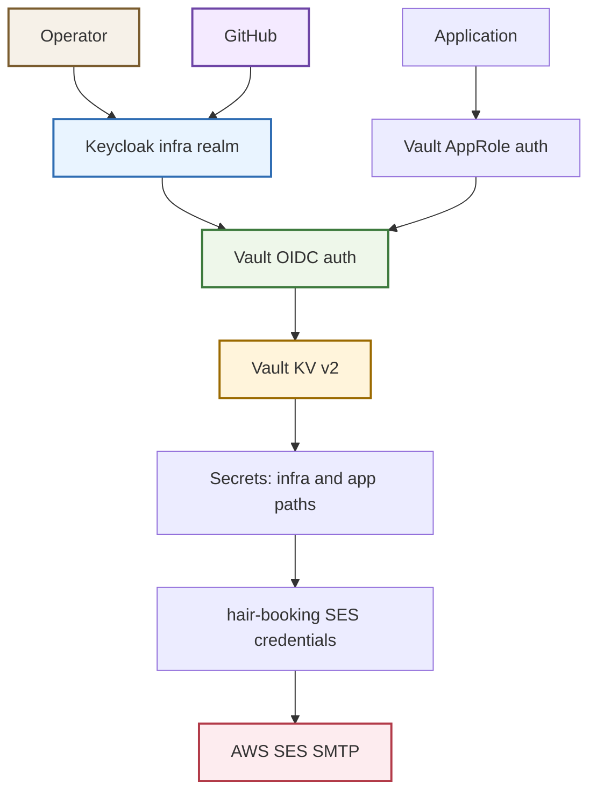
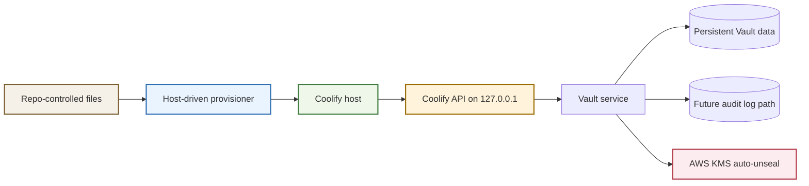

# Terraform Infra Vault Platform Bring-Up

This note records one long infrastructure session in `/home/manuel/code/wesen/terraform` that took the shared Vault system from "documented plan" to "live service with real human auth, first machine auth, first app handoff shape, and follow-up tickets." It is not a generic project description for the whole Terraform repo. It is a session-scoped report covering the specific platform work done around Vault, Keycloak, SES, and the first real app integration target.

> [!summary]
> This session had three main outcomes:
> 1. Vault was deployed on the Coolify host, initialized, auto-unsealed through AWS KMS, and validated end to end.
> 2. Vault was hardened with Keycloak-backed OIDC for humans, AppRole for machines, a KV layout, a Go example, GitHub SSO, and explicit group-gated access.
> 3. The next operational and app-integration steps were turned into real tracked tickets: backups, audit logging, a JS operator API follow-up, and a concrete hair-booking Vault + SES handoff.

## Why this report exists

This was not a small "flip one config value" session. The work crossed four control planes at once:

- repo-owned Terraform and ticket docs
- the live Coolify host and its locally bound API
- the running Vault service and its bootstrap material
- the hosted Keycloak realm and GitHub identity provider

That kind of session is exactly where subtle operational knowledge gets lost if it only survives in terminal scrollback. The point of this report is to preserve the actual shape of the work, the debugging route, and the resulting platform model in prose that a future operator can read without replaying the entire session.

## Current project status

The Vault platform is now real, not aspirational.

What exists after this session:

- Vault is deployed at `https://vault.app.scapegoat.dev`
- Vault is initialized and unsealed with AWS KMS auto-unseal
- bootstrap material exists in encrypted local storage and in 1Password
- operator auth exists through Keycloak OIDC in the `infra` realm
- GitHub login exists as an upstream identity provider for that realm
- Vault access is gated by explicit Keycloak group membership rather than generic GitHub login
- machine auth exists through AppRole
- KV v2 exists at `kv/`
- a working Go example proves positive and negative policy behavior
- hair-booking now has a dedicated handoff ticket for consuming SES SMTP credentials from Vault
- backup and audit logging are now tracked as explicit follow-up tickets rather than vague future work

What still remains:

- Vault-native snapshots to Hetzner object storage
- Vault audit logging to a persistent local file plus later off-host shipping
- real operator onboarding discipline beyond the single current operator
- full app adoption beyond the first handoff and initial follow-up work

There is one important session boundary to keep in mind: by the time I wrote this note, `main` contained one newer commit (`30355f6`) that was not part of the earlier Vault bring-up/hardening work. I am treating this report as "the session that established the Vault platform and its immediate follow-ups," not as a claim about every later change on the branch.

## Project shape

This work ended up with five layers:

1. **Platform runtime**
   - Vault on Coolify, single-node, integrated storage, KMS auto-unseal

2. **Human auth**
   - Keycloak `infra` realm
   - `vault-oidc` confidential client
   - GitHub as upstream IdP into Keycloak
   - Keycloak groups mapped to Vault policies

3. **Machine auth**
   - Vault `approle/`
   - app-specific least-privilege policies
   - Go example as the reference implementation

4. **Secret operations**
   - encrypted bootstrap bundle
   - 1Password escrow
   - future snapshot and audit-log work tracked in dedicated tickets

5. **App integration**
   - hair-booking chosen as the first real app target
   - SES SMTP chosen as the first real secret flow

## Architecture





Key repo locations:

- `/home/manuel/code/wesen/terraform/coolify/services/vault/`
- `/home/manuel/code/wesen/terraform/keycloak/apps/infra-access/envs/hosted/`
- `/home/manuel/code/wesen/terraform/ttmp/2026/03/25/TF-004-VAULT-COOLIFY--plan-single-node-vault-deployment-on-coolify/`
- `/home/manuel/code/wesen/terraform/ttmp/2026/03/25/TF-008-VAULT-AUTH-HARDENING--implement-vault-auth-hardening-with-keycloak-and-a-go-end-to-end-example/`
- `/home/manuel/code/wesen/terraform/ttmp/2026/03/25/TF-010-HAIR-BOOKING-VAULT-SES--integrate-hair-booking-with-vault-for-ses-smtp-credentials/`

## Implementation details

The important thing to understand about this session is that Vault was not "just deployed." The system had to become operable across bootstrap, human auth, machine auth, and app handoff.

### 1. Provisioning Vault required a host-driven model

The repo already contained canonical Vault service definitions, but Coolify's live API was effectively local to the host. That made the clean control-plane distinction:

- the repo owns the desired service files
- the Coolify host owns the live runtime object
- the operator path is host-driven rather than pure repo-to-API from a random laptop

The resulting provisioning shape looked like this:

```text
prepare canonical compose + vault.hcl
-> reach the Coolify host
-> call the local Coolify API from the host context
-> create/update the service in project "infra"
-> deploy
-> initialize Vault
-> encrypt bootstrap material to GPG
```

That model is why the session kept circling around questions like "is there a Coolify CLI?", "could this be an ideal JS API?", and "should we tunnel to the host API?" Those were not distractions. They were attempts to understand the true control boundary.

### 2. The live deployment failed for operational reasons, not conceptual ones

The first real failures were concrete:

- Vault could not write `/vault/data/vault.db` because of volume ownership
- Vault was loading config twice because the image entrypoint already injected a config path and the compose command added another one

Those are classic examples of why postmortems matter. The design was fine. The runtime details were wrong.

A simplified version of the debugging route:

```text
deploy service
-> health check fails
-> inspect logs
-> see permission error on raft data path
-> fix volume ownership / mount assumptions
-> redeploy
-> see duplicate config load problem
-> remove redundant -config argument
-> redeploy
-> confirm initialized=true and sealed=false
```

The lesson is that most first-deploy failures live in container lifecycle details, volume semantics, and default entrypoint behavior rather than in the high-level service design.

### 3. Bootstrap material had to be handled like an operator workflow, not a file dump

After initialization, the cluster produced high-value bootstrap material:

- initial root token
- recovery keys

That material was not left in plaintext in the repo. Instead the flow was:

```text
init Vault
-> capture JSON
-> encrypt to operator GPG key
-> store local encrypted bundle
-> later upload encrypted bundle + metadata to 1Password
```

The 1Password step ended up revealing another practical operations detail: the `op` CLI session was shell-scoped, so a persistent tmux session was the most reliable way to avoid re-auth friction while performing the upload. That is a small thing, but it is exactly the sort of small thing that causes people to make unsafe shortcuts if it is not written down.

### 4. Human auth hardening was really a group-mapping problem

Once Vault itself was healthy, the next job was to stop normalizing root-token usage.

The chosen model was:

- Keycloak realm: `infra`
- Keycloak client: `vault-oidc`
- Vault auth method: `oidc/`
- Vault role: `operators`
- Keycloak groups:
  - `infra-admins`
  - `infra-readonly`
- Vault identity groups and aliases mapping those Keycloak groups to Vault ACL policies

The non-obvious part was not just "enable OIDC." It was making group-based authorization explicit so the identity provider answers "who are you?" and Vault policies answer "what can you do?"

There was also one ugly implementation detail: Vault CLI writes for the OIDC role rejected `bound_claims` as a stringified map. The correct way to express the group constraint was a JSON API payload, not the simpler CLI syntax.

Conceptually:

```text
user logs into Vault
-> Vault redirects to Keycloak
-> Keycloak authenticates the user
-> OIDC token returns with groups claim
-> Vault role requires groups claim to contain infra-admins or infra-readonly
-> Vault identity group aliases attach policies
```

That distinction mattered later when GitHub SSO was added.

### 5. GitHub SSO was added, then deliberately constrained

GitHub login was added to Keycloak because it is the cleanest human login path for the current environment. But GitHub authentication alone was not allowed to become authorization.

The final posture was:

- GitHub is an upstream identity provider into the `infra` realm
- generic GitHub login does not grant Vault access
- only explicit Keycloak group membership grants Vault access

That is why the session later removed the blanket mapper that assigned every new GitHub login to `infra-readonly`. The first version proved the plumbing. The second version fixed the security boundary.

This is the clean mental model:

```text
GitHub proves identity
Keycloak groups grant operator status
Vault bound claims require those groups
Vault policies control secret access
```

### 6. Machine auth and the Go example turned Vault from “alive” into “usable”

The first machine auth path was intentionally conservative:

- `approle/`
- a demo role
- a least-privilege policy
- a Go example that both succeeds and fails in expected ways

The key idea was not the demo secret itself. It was the pattern:

```text
app has VAULT_ADDR + role_id + secret_id
-> write auth/approle/login
-> receive client token
-> read allowed kv path
-> attempt denied read outside policy boundary
-> require that denial to prove least privilege
```

The negative test is the important part. A positive read only proves connectivity. A denied read proves the policy model is doing real work.

### 7. Hair-booking became the first real app target

Once the platform was proven with a Go example, the next honest step was not "more examples." It was choosing a real app.

`hair-booking` was chosen as the first real adoption target because:

- it already has adjacent infrastructure in this repo
- the SES platform already exists for `mail.scapegoat.dev`
- SMTP credentials are a good example of "secret material that should not be passed around ad hoc"

The target secret shape is now explicit:

- secret path: `kv/apps/hair-booking/prod/ses`
- data includes SMTP host, port, username, derived SMTP password, sender address, and SES configuration set

And the target runtime shape is explicit:

```text
hair-booking receives Vault bootstrap env vars
-> authenticates with its own AppRole
-> reads kv/apps/hair-booking/prod/ses
-> configures SMTP from returned secret
-> preserves X-SES-CONFIGURATION-SET header
```

This matters because it turns the Vault platform into an app contract rather than just an ops artifact.

## Important project docs

Core Vault deployment and postmortem docs:

- `/home/manuel/code/wesen/terraform/ttmp/2026/03/25/TF-004-VAULT-COOLIFY--plan-single-node-vault-deployment-on-coolify/index.md`
- `/home/manuel/code/wesen/terraform/ttmp/2026/03/25/TF-004-VAULT-COOLIFY--plan-single-node-vault-deployment-on-coolify/design-doc/02-vault-on-coolify-deployment-postmortem-and-operator-system-guide.md`
- `/home/manuel/code/wesen/terraform/ttmp/2026/03/25/TF-004-VAULT-COOLIFY--plan-single-node-vault-deployment-on-coolify/reference/01-vault-on-coolify-investigation-diary.md`

Auth hardening and developer guidance:

- `/home/manuel/code/wesen/terraform/ttmp/2026/03/25/TF-008-VAULT-AUTH-HARDENING--implement-vault-auth-hardening-with-keycloak-and-a-go-end-to-end-example/index.md`
- `/home/manuel/code/wesen/terraform/ttmp/2026/03/25/TF-008-VAULT-AUTH-HARDENING--implement-vault-auth-hardening-with-keycloak-and-a-go-end-to-end-example/playbooks/01-vault-oidc-operator-playbook.md`
- `/home/manuel/code/wesen/terraform/ttmp/2026/03/25/TF-008-VAULT-AUTH-HARDENING--implement-vault-auth-hardening-with-keycloak-and-a-go-end-to-end-example/playbooks/02-vault-approle-go-example-developer-guide.md`

Follow-up tickets created in or immediately after this session:

- `/home/manuel/code/wesen/terraform/ttmp/2026/03/25/TF-006-COOLIFY-JS-API--design-ideal-javascript-api-for-coolify-and-vault-operator-workflows/index.md`
- `/home/manuel/code/wesen/terraform/ttmp/2026/03/25/TF-007-COOLIFY-BACKUPS--design-backup-strategy-for-vault-snapshots-and-coolify-hosted-stateful-services/index.md`
- `/home/manuel/code/wesen/terraform/ttmp/2026/03/25/TF-009-VAULT-AUDIT-LOGGING--enable-vault-audit-logging-and-plan-off-host-shipping/index.md`
- `/home/manuel/code/wesen/terraform/ttmp/2026/03/25/TF-010-HAIR-BOOKING-VAULT-SES--integrate-hair-booking-with-vault-for-ses-smtp-credentials/index.md`

SES context for the first real app integration:

- `/home/manuel/code/wesen/terraform/ttmp/2026/03/24/TF-002-SES-TERRAFORM--set-up-ses-with-terraform/playbook/02-ses-smtp-integration-playbook.md`

## Session outputs

The most important repo-level outcomes from this session were:

- live Vault deployment on Coolify
- Keycloak `infra` realm and `vault-oidc` client
- Vault OIDC and AppRole auth methods
- admin and readonly operator policies
- a working Go AppRole reference example
- GitHub SSO into Keycloak with explicit group-gated Vault access
- encrypted bootstrap bundle stored locally and in 1Password
- reMarkable uploads for the major ticket bundles
- new follow-up tickets for JS operator API, backups, audit logging, and hair-booking SES through Vault

Representative session commits:

- `0f1ca1d` Deploy Vault on Coolify via host-driven provisioner
- `e492759` Add follow-up ticket for Coolify JS operator API
- `c7f3eb0` Document bootstrap storage and backup follow-ups
- `0cdb2f2` Add Vault postmortem guide and auth hardening ticket
- `42106cc` Create Keycloak infra realm for Vault OIDC
- `bf59749` Apply Vault auth hardening and add Go example
- `cd87de7` Add GitHub SSO for infra realm
- `1a86969` Restrict GitHub-backed Vault access
- `a9c06ae` Add Vault audit logging follow-up ticket
- `dbb37f4` Add hair-booking Vault SES integration ticket
- `437e117` Record TF-010 reMarkable upload

## Open questions

- Should the long-term operator workflow call the Coolify host API through SSH tunneling, a first-class CLI wrapper, or the future JS operator API from `TF-006`?
- What is the best long-term off-host target for Vault audit logs once the local file audit device is enabled?
- Should later machine auth remain on AppRole for most apps, or should some workloads move to JWT/OIDC-backed machine identity?
- How should AppRole material be rotated and delivered for production apps under Coolify?
- Which app after `hair-booking` should become the second real Vault consumer?

## Near-term next steps

- Implement `TF-009` so Vault has a real audit device
- Implement `TF-007` so Vault snapshots are taken and tested against restore
- Finish the first real app adoption by moving hair-booking SES credentials into Vault
- Remove any remaining day-to-day operational dependence on bootstrap-era credentials
- Expand human onboarding from "single current operator" to a deliberate multi-operator model

## Project working rule

> [!important]
> Treat Vault changes as multi-plane work. Repo files, host-level deployment behavior, live Vault auth/policy state, and secret-handling workflows must all be documented together. If one of those planes is changed without updating the matching ticket docs and diary, the system will quickly become difficult to reason about and unsafe to operate.
