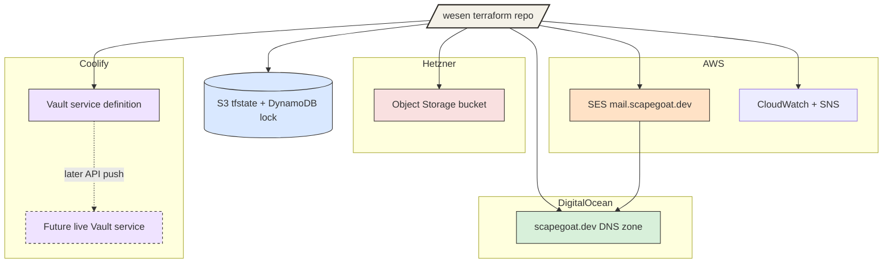
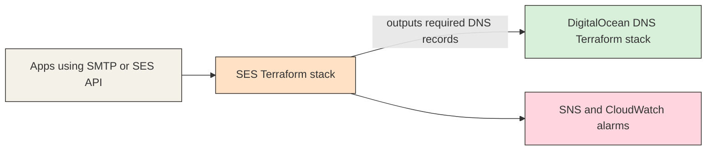

> [!warning] Partly superseded — the platform moved to k3s
> The Vault-on-Coolify and Coolify-deployment parts of this note are historical. Vault now
> runs on Hetzner k3s under Argo CD, and `hair-booking` has an Argo CD package at
> `gitops/kustomize/hair-booking`. See
> [[Projects/2026/03/27/PROJ - K3s Migration Program - From Coolify to GitOps Platform]] and
> [[Projects/2026/03/27/PROJ - Vault on K3s - Auth and Secret Delivery Platform]].
>
> The **SES credential model** described here is also superseded. One shared, hand-created
> SMTP credential served every consumer, so it could not be rotated for one application
> without breaking the others. The current standard is a per-application IAM principal with
> `ses:SendRawEmail` scoped to one identity —
> [[Projects/2026/07/26/PROJECT REPORT - ZITADEL SES SMTP - Vault Backed Verification and Recovery]]
> sets the rule and
> [[Projects/2026/07/31/PROJECT REPORT - Hyperslop Mailing List - Double Opt-In Service from Zero to Production]]
> is the first application to have one.
>
> The **DNS** here is DigitalOcean (`digitalocean_record`). Newer zones are Cloudflare
> (`cloudflare_dns_record`), where the value field is `content`, MX `priority` is separate,
> `tags` cannot be set, and values carry no trailing dot. A record map does not port between
> the two.

# wesen terraform

This repository is the shared infrastructure control plane for the hosted `wesen`
application surfaces that should not live inside individual app repos. During
this session, it moved from being mostly Keycloak-focused Terraform into a
broader multi-provider infrastructure repo that now also owns live DNS on
DigitalOcean, live SES setup on AWS, a planned Vault-on-Coolify service
definition path, and a live Hetzner Object Storage bucket for `hair-booking`
photo uploads.

> [!summary]
> The session had four concrete outcomes:
> 1. `scapegoat.dev` DNS is now modeled and imported in Terraform on DigitalOcean
> 2. `mail.scapegoat.dev` SES is implemented and production-ready on AWS
> 3. Vault-on-Coolify is documented with a canonical repo-owned service definition path
> 4. `scapegoat-hair-booking-photos` now exists as a live Hetzner Object Storage bucket with versioning

## Why this project exists

The main purpose of this repository is to keep shared infrastructure out of
application repos while still making it operable by one person without losing
the system model. The repo is not just a Terraform dump. It tries to be an
operator-facing control plane with:

- stable environment layouts
- shared backend conventions
- repo-local `Makefile` entrypoints
- ticket-based design and investigation docs in `ttmp/`
- explicit boundaries between infrastructure code, operator secrets, and app
  repos

That matters because the hosted system now spans multiple providers:

- AWS for SES and remote Terraform state
- DigitalOcean for authoritative DNS
- Hetzner for object storage and likely other hosting concerns
- Coolify as a runtime deployment plane for selected stateful services

## Current project status

The repository is no longer just an early Terraform skeleton. It now has live
infrastructure in multiple areas, plus one major documented plan that is not yet
deployed.

What is live after this session:

- DigitalOcean DNS for `scapegoat.dev` is under Terraform
- AWS SES for `mail.scapegoat.dev` is under Terraform
- SES production access is granted
- SES event destinations and alarms are configured
- Hetzner Object Storage bucket `scapegoat-hair-booking-photos` exists and has
  versioning enabled

What is documented but not deployed:

- single-node Vault on Coolify
- Coolify API-based service-definition sync path

What remains unresolved:

- how app runtime secrets should be distributed long-term
- how `hair-booking` should authenticate to Hetzner Object Storage
- whether stricter bucket scoping should use raw S3 bucket policies later

## Session outcomes

### 1. DigitalOcean DNS

The session established that `scapegoat.dev` remains delegated to DigitalOcean
nameservers and that this is fine because Terraform now manages the zone in
place instead of requiring a nameserver move.

Important result:

- the zone is authoritative on DigitalOcean
- Terraform is the management plane
- no registrar NS change is required for SES or normal DNS operations

Key repo locations:

- `/home/manuel/code/wesen/terraform/dns/zones/scapegoat-dev/envs/prod`
- `/home/manuel/code/wesen/terraform/ttmp/2026/03/24/TF-003-DO-DNS-TERRAFORM--manage-digitalocean-dns-with-terraform/`

### 2. AWS SES

The session implemented SES for `mail.scapegoat.dev` as a dedicated sending
subdomain rather than using the zone apex directly. DNS for DKIM, verification,
and MAIL FROM now lives in the repo-controlled DigitalOcean Terraform.

Important result:

- SES identity exists for `mail.scapegoat.dev`
- DNS records are published via the DNS stack
- SES production access is granted
- SMTP integration guidance exists
- bounce/complaint alerting and event plumbing exist

Key repo locations:

- `/home/manuel/code/wesen/terraform/ses/domains/mail-scapegoat-dev/envs/prod`
- `/home/manuel/code/wesen/terraform/ses/modules/domain-identity`
- `/home/manuel/code/wesen/terraform/ttmp/2026/03/24/TF-002-SES-TERRAFORM--set-up-ses-with-terraform/`

### 3. Vault on Coolify

This part of the session did not deploy Vault, but it resolved an important repo
boundary question: the canonical Vault service definition should live in this
repo under a stable `coolify/services/vault/` path, while Coolify remains the
runtime control plane.

Important result:

- repo-owned canonical service definition exists
- API push helper exists for later sync into Coolify
- `.envrc` now derives Coolify auth from `~/.config/coolify/config.json`
- the design is documented in a ticket and operator playbook

Key repo locations:

- `/home/manuel/code/wesen/terraform/coolify/services/vault`
- `/home/manuel/code/wesen/terraform/ttmp/2026/03/25/TF-004-VAULT-COOLIFY--plan-single-node-vault-deployment-on-coolify/`

### 4. Hetzner Object Storage for hair-booking

This was the most direct live infrastructure creation in the later part of the
session. A new top-level `storage/` tree was added to the repo, and the
`hair-booking` photo bucket was created on Hetzner Object Storage.

Important result:

- bucket name: `scapegoat-hair-booking-photos`
- endpoint: `https://fsn1.your-objectstorage.com`
- versioning is enabled
- final Terraform plan is zero drift

Key repo locations:

- `/home/manuel/code/wesen/terraform/storage/apps/hair-booking/photos/envs/prod`
- `/home/manuel/code/wesen/terraform/ttmp/2026/03/25/TF-005-HAIR-BOOKING-PHOTOS-STORAGE--configure-hair-booking-photo-upload-bucket/`

## Project shape

After this session, the repository has five main operational areas:

1. **Identity**
   - Keycloak realms and clients for hosted apps
2. **DNS**
   - DigitalOcean-managed public zone for `scapegoat.dev`
3. **Email**
   - SES identity, DNS records, SMTP guidance, and alerting
4. **Storage**
   - Hetzner Object Storage bucket infrastructure for uploaded assets
5. **Service definitions**
   - canonical Coolify-side service definitions for shared services

## Architecture



## Implementation details

The most important structural change in this session was that the repo became a
multi-control-plane repository rather than a single-product Terraform repo. The
key design rule is:

- each provider-specific area gets a stable top-level tree
- each live environment gets its own remote state key
- cross-system integration happens either through explicit outputs or through
  DNS records managed in the DNS stack
- operator reasoning is preserved in ticket docs and diaries

That produced a repository shape like this:

```text
wesen/terraform
  -> keycloak/
  -> dns/
  -> ses/
  -> storage/
  -> coolify/
  -> ttmp/
```

### DNS mental model

The DNS shift was not “move to Route53.” It was “leave authoritative DNS on
DigitalOcean, but manage it declaratively from Terraform.”

Pseudocode for that design:

```text
if zone_is_on_digitalocean:
  keep_nameservers_as_is()
  manage_zone_with_digitalocean_provider()
else:
  do_not_assume_route53_is_required()
```

That unlocked SES because SES only needs the right DNS records, not Route53
specifically.

### SES mental model

SES was implemented as a dedicated sending domain:

```text
mail.scapegoat.dev
  -> SES identity
  -> DKIM records
  -> MAIL FROM records
  -> production access request
  -> event destinations
  -> CloudWatch alarms + SNS alerts
```

The stack boundary looks like this:



The practical result is that app integration can now choose:

- SES API
- SES SMTP via `email-smtp.us-east-1.amazonaws.com`

and the operator docs now cover the SMTP path explicitly.

### Vault-on-Coolify mental model

Vault was not deployed, but the repo boundary was clarified. The important
design distinction is:

```text
repo owns canonical service definition files
Coolify owns live runtime deployment state
```

That sounds small, but it is actually the difference between durable operator
infrastructure and one-off UI clicks. The repo now contains:

- canonical Compose file
- example `vault.hcl` files
- API push helper
- local `.envrc` logic deriving Coolify auth from the Coolify CLI config

The intended later sync looks like:

```text
coolify/services/vault/docker-compose.yaml
  -> push_service_to_coolify.sh
  -> Coolify API
  -> live service object
```

### Hetzner Object Storage mental model

The bucket work revealed a useful provider/platform mismatch.

The first design tried to do this:

```text
create bucket
enable versioning
create MinIO IAM policy
```

The actual live result was:

```text
bucket creation: success
versioning: success
MinIO IAM policy: AccessDenied
```

So the final supported shape became:

```text
create bucket
enable versioning
export advisory policy JSON only
do not claim MinIO admin IAM works on Hetzner
```

This is the kind of detail that matters because the provider schema makes the
unsupported path look plausible. The diary captured the exact failure and the
cleanup path that followed.

### Session algorithm

At a process level, the session followed the same algorithm repeatedly:

```text
for each infrastructure area:
  inspect current state
  verify provider/platform boundary
  create or update Terraform layout
  validate locally
  apply only when credentials and live preconditions exist
  record findings in ttmp diary/docs
  upload long-form bundles when requested
```

That working loop is now one of the main strengths of the repo.

## Commands and validation

Representative commands that became important in this session:

```bash
make validate-dns-scapegoat
make plan-dns-scapegoat AWS_PROFILE=manuel
make validate-ses-mail-scapegoat-dev
make plan-ses-mail-scapegoat-dev AWS_PROFILE=manuel
make validate-storage-hair-booking-photos AWS_PROFILE=manuel
make plan-storage-hair-booking-photos AWS_PROFILE=manuel

AWS_PROFILE=manuel direnv exec . \
  terraform -chdir=storage/apps/hair-booking/photos/envs/prod output

docmgr doctor --ticket TF-005-HAIR-BOOKING-PHOTOS-STORAGE --stale-after 30
```

Session commit:

- `218c3f3` — `Add SES, Vault, and Hetzner storage infrastructure`

## Important project docs

Main stable repo docs:

- `/home/manuel/code/wesen/terraform/README.md`
- `/home/manuel/code/wesen/terraform/docs/shared-keycloak-platform-playbook.md`
- `/home/manuel/code/wesen/terraform/dns/README.md`
- `/home/manuel/code/wesen/terraform/ses/README.md`
- `/home/manuel/code/wesen/terraform/storage/README.md`
- `/home/manuel/code/wesen/terraform/coolify/README.md`

Main ticket outputs from this session:

- `/home/manuel/code/wesen/terraform/ttmp/2026/03/24/TF-002-SES-TERRAFORM--set-up-ses-with-terraform/index.md`
- `/home/manuel/code/wesen/terraform/ttmp/2026/03/24/TF-003-DO-DNS-TERRAFORM--manage-digitalocean-dns-with-terraform/index.md`
- `/home/manuel/code/wesen/terraform/ttmp/2026/03/25/TF-004-VAULT-COOLIFY--plan-single-node-vault-deployment-on-coolify/index.md`
- `/home/manuel/code/wesen/terraform/ttmp/2026/03/25/TF-005-HAIR-BOOKING-PHOTOS-STORAGE--configure-hair-booking-photo-upload-bucket/index.md`

## Open questions

- How should `hair-booking` authenticate to Hetzner Object Storage in
  production?
- Should stricter bucket scoping use raw S3 bucket policies later?
- Should Vault become the long-term secret store for SES SMTP and object-storage
  credentials?
- When Vault is eventually deployed, should this repo also own more of the
  Coolify env/secret sync path?
- How much of the infrastructure should eventually be normalized into a shared
  module layer instead of per-environment code?

## Near-term next steps

- wire the live bucket outputs into the `hair-booking` deployment environment
- decide on the app-side object storage auth story
- add the first real consumer of SES SMTP or SES API
- decide whether to deploy the planned single-node Vault on Coolify
- keep using ticket-based diaries whenever a new control-plane area is added

## Project working rule

> [!important]
> Treat provider schema as a hint, not proof.
> The durable rule for this repo is to validate live provider/platform behavior,
> then update the Terraform and docs to match the real supported subset rather
> than the most ambitious-looking one.
