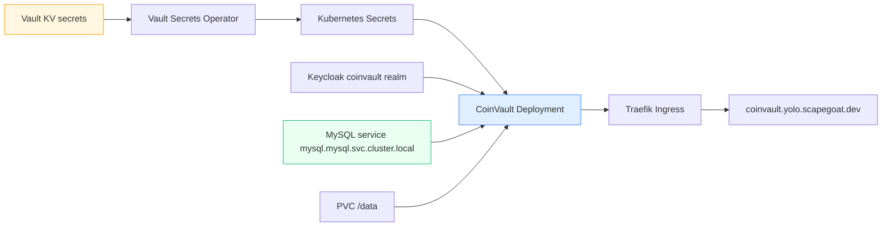

# CoinVault on K3s

This project is the first real application migration on top of [[PROJ - Hetzner K3s Platform - Single-Node GitOps Bring-Up]] and [[PROJ - Vault on K3s - Auth and Secret Delivery Platform]]. Its purpose was not merely to deploy a demo app. Its purpose was to prove that the new platform can carry an actual application with authentication, secret-managed runtime config, a shared MySQL dependency, persistent local files, and a public HTTPS ingress.

CoinVault was the right test case because it was already a real hosted application, not just a toy. It had a Docker image path, Keycloak auth, Vault-backed runtime material, a nontrivial provider/profile system, and a real MySQL data dependency. That made it much more valuable than a smaller but less representative app.

> [!summary]
> This migration proved five things:
> 1. a real app can receive secrets through Vault + VSO rather than manual env handling
> 2. a shared MySQL service on K3s can replace a Coolify-internal database hostname
> 3. Argo CD can own the application package end to end
> 4. application-runtime bugs still matter even when the cluster is healthy
> 5. data migration is part of app migration, not a follow-up detail

## Why this project exists

A platform is only real once a real workload lands on it. Before this project, the cluster and Vault stack existed, but they were still mostly platform abstractions. CoinVault is where the whole stack had to prove itself:

- Argo CD had to own the manifests
- VSO had to deliver the runtime config
- Vault Kubernetes auth had to work for an application namespace
- the app had to authenticate users through Keycloak
- the app had to talk to a cluster-local MySQL service
- the app had to keep its local SQLite timeline/turns data on a PVC

That combination is what makes this project more valuable than a smaller smoke app.

## Current project status

The K3s deployment is live and publicly reachable at `https://coinvault.yolo.scapegoat.dev`.

What exists today:

- Argo-managed CoinVault application
- VSO-managed runtime and Pinocchio secrets
- Keycloak redirect/origin path reconciled for the K3s hostname
- shared cluster MySQL deployed and populated
- app health and login redirect validated
- quick-stats data restored by importing the local MySQL dataset into the cluster schema
- intern-facing deployment playbooks in both repos

What is still open:

- explicit cutover and rollback boundaries against the older parallel environment
- eventual replacement of local node image import with a registry-backed release path

## Project shape

This migration spans two repositories:

1. **Application repo**
   - Go binary
   - entrypoint
   - bootstrap compatibility
   - config/profile parsing
2. **Infrastructure repo**
   - Argo `Application`
   - Kustomize package
   - VSO resources
   - PVC, service, ingress
   - image build/import helper
   - validation scripts

This split is one of the main lessons of the project. “Deploying CoinVault” is not purely an infrastructure task and not purely an app task. It is a runtime-contract task that crosses both.

## Architecture



The application’s runtime dependencies are therefore:

- Vault-delivered secrets
- Keycloak OIDC
- MySQL
- local SQLite files on a PVC
- ingress/TLS

That is exactly why it was a good first “real app” candidate.

## Implementation details

The migration sequence ended up looking like this:

```text
choose first real app
  -> map its hosted runtime contract into Vault/VSO + K8s resources
  -> seed K3s Vault with app secrets
  -> build and import image into node
  -> create Argo application
  -> fix runtime mismatches exposed by the live pod
  -> stand up shared MySQL
  -> import real app data
  -> validate browser-visible behavior
```

### Why CoinVault was chosen

The main competing candidate was `hair-booking`. It had a smaller secret surface, but it was not yet a comparably complete hosted workload. CoinVault, by contrast, already had:

- a Dockerfile
- a real authentication model
- an existing Vault runtime contract
- a health endpoint
- a real database dependency

That made it the right first migration target because it could prove more of the platform in one pass.

### Secret delivery model

The old hosted CoinVault deployment used an off-cluster Vault bootstrap path. On K3s, that was deliberately replaced with a Kubernetes-native secret path:

- runtime secret from Vault -> `coinvault-runtime`
- Pinocchio provider/config secret from Vault -> `coinvault-pinocchio`

Those are then wired into:

- env vars
- mounted files under `/run/secrets/pinocchio`

This was the first real reuse of the VSO platform from the previous project.

### Shared MySQL was not optional

An important turning point in the migration was realizing that CoinVault’s old MySQL host only existed inside Coolify networking. The old host looked like a private Docker alias. That is not a thing the K3s cluster can or should resolve.

So the project had to pause and create a shared MySQL service on the cluster first. That happened through a separate platform slice, but it was still part of making CoinVault truly real on K3s.

The resulting runtime contract became:

```text
host = mysql.mysql.svc.cluster.local
port = 3306
database = gec
user = coinvault_ro
```

### The app-runtime bugs were as important as the YAML

This project exposed a useful truth: a GitOps deployment can be perfectly healthy at the Kubernetes level and still be semantically wrong.

Two examples mattered a lot:

#### 1. Kubernetes service-link env collisions

Because the service was named `coinvault`, Kubernetes auto-injected variables like:

```text
COINVAULT_PORT=tcp://10.43.x.y:80
```

CoinVault uses `COINVAULT_*` for its own config parsing, so the application tried to parse that as its own port setting. The fix was not “change YAML only” and not “change app only”; it was both:

- disable service links in the pod spec
- use an app-specific `COINVAULT_SERVE_PORT`
- harden the entrypoint against inherited `PORT`

#### 2. Profile registry parsing bug

The app was supposed to use the mounted hosted profile registry:

- `/run/secrets/pinocchio/profiles.yaml`

But the live runtime fell back to `./profile-registry.yaml` because the setting arrived from both env and CLI flag, Glazed merged it into a list-like shape, and CoinVault decoded it like a plain string. That produced secondary failures such as OpenAI 401s that looked like provider problems but were actually config-resolution problems.

This is a good example of why migration reports need both:

- infrastructure explanation
- application internals explanation

### Data migration mattered

Even after the app started correctly, the quick-stats view still failed because the cluster MySQL schema existed but did not contain the application tables. The fix was to import the existing local MySQL dataset from the repo-local compose service into the cluster `gec` schema.

That was the final proof that “app healthy” and “app behavior healthy” are different milestones.

## Current operator commands

```bash
cd /home/manuel/code/wesen/2026-03-27--hetzner-k3s
export KUBECONFIG=$PWD/kubeconfig-91.98.46.169.yaml
kubectl -n argocd get application coinvault
kubectl -n coinvault get pods,secrets,vaultauth,vaultstaticsecret
kubectl -n coinvault logs deploy/coinvault --tail=200
./scripts/validate-coinvault-k3s.sh
```

```bash
cd /home/manuel/code/gec/2026-03-16--gec-rag
go test ./cmd/coinvault/... ./internal/bootstrap/... -count=1
```

## Important project docs

- existing product/project note:
  - [[PROJ - CoinVault - RAG Web Chat for Gold Coin Inventory]]
- infra-side guide:
  - `/home/manuel/code/wesen/2026-03-27--hetzner-k3s/docs/coinvault-k3s-deployment-playbook.md`
- app-side guide:
  - `/home/manuel/code/gec/2026-03-16--gec-rag/docs/deployments/coinvault-argocd-deployment-playbook.md`
- migration ticket:
  - `/home/manuel/code/wesen/2026-03-27--hetzner-k3s/ttmp/2026/03/27/HK3S-0007--recreate-the-first-application-on-k3s-using-vault-managed-secrets/index.md`
- MySQL prerequisite ticket:
  - `/home/manuel/code/wesen/2026-03-27--hetzner-k3s/ttmp/2026/03/27/HK3S-0009--add-cluster-level-postgres-mysql-and-redis-under-argo-cd/index.md`

## Open questions

- When should user traffic or operator preference actually switch from the older parallel deployment to the K3s deployment?
- Should CoinVault continue using local SQLite files for timeline/turns, or should those eventually move to a more explicitly managed service?
- When should the image delivery path move from direct node import to a registry-backed release pipeline?

## Near-term next steps

- write the explicit cutover and rollback boundaries
- keep the app-side and infra-side playbooks updated together as the runtime contract changes
- use the same migration template for the next real application rather than inventing a new one

## Project working rule

> [!important]
> Treat application migration as both an infrastructure problem and an application-runtime problem. A `Healthy` pod is only the midpoint; the real finish line is correct authenticated behavior with real data.
