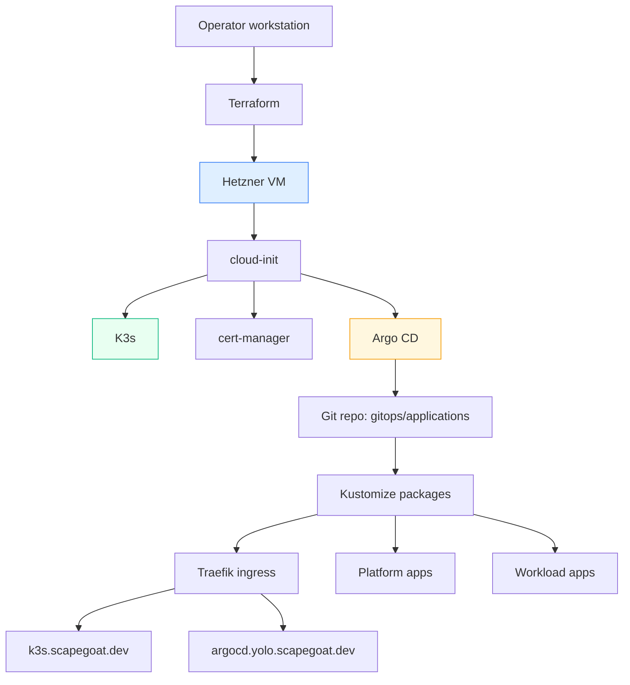

# Hetzner K3s Platform

This project is the new single-node deployment platform on Hetzner for `scapegoat.dev`. It replaces the earlier “one manually nurtured host plus Coolify” mental model with a narrower but cleaner stack: Terraform creates the machine, cloud-init bootstraps K3s, Argo CD becomes the steady-state cluster reconciler, and real applications are expected to land through GitOps rather than through one-off shell state.

It is the foundation for the two follow-on reports in this folder: [[PROJ - Vault on K3s - Auth and Secret Delivery Platform]] and [[PROJ - CoinVault on K3s - First Real GitOps App]]. Without this note, those later two projects are harder to understand because they both depend on the cluster contract defined here.

> [!summary]
> This platform currently has three important identities:
> 1. a single-node Hetzner VM created by Terraform
> 2. a K3s cluster bootstrapped once by cloud-init
> 3. a GitOps platform where Argo CD owns the long-term Kubernetes state

## Why this project exists

The earlier hosting setup worked, but it mixed too many responsibilities into one operational surface. The machine, the deployment controller, the application manifests, and the secret stories were all partially coupled to manual operator steps. That is fine for exploration, but it makes repeatability and later migrations harder than they need to be.

This project exists to make the platform itself legible:

- infrastructure provisioning is Terraform
- first-boot cluster bring-up is cloud-init
- long-term cluster state is Argo CD
- public exposure is Traefik + cert-manager
- application packaging is Kustomize

That separation is the real value. It is not about “having Kubernetes” for its own sake. It is about making the deployment stack decomposable enough that an operator can tell whether a failure belongs to Hetzner, Terraform, bootstrap, Kubernetes, DNS, TLS, or GitOps.

## Current project status

The platform is live and healthy.

What exists today:

- Hetzner VM in `fsn1`
- K3s on the node
- Argo CD exposed at `https://argocd.yolo.scapegoat.dev`
- primary app hostname `https://k3s.scapegoat.dev`
- Terraform reconciled to `No changes`
- CoreDNS reverted to the default upstream path after proving the temporary workaround was no longer needed
- the live app source path migrated from the bootstrap Helm path to `gitops/kustomize/demo-stack`

What is intentionally still imperfect:

- the node is single-machine and non-HA
- first boot still carries a legacy compatibility layer so Terraform does not try to replace the server
- the current image story for private apps is still local build/import rather than a real registry pipeline

## Project shape

The platform has four layers:

1. **Infrastructure layer**
   - Hetzner VM
   - firewall
   - uploaded SSH key
2. **Bootstrap layer**
   - cloud-init
   - K3s install
   - cert-manager install
   - Argo CD install
3. **GitOps layer**
   - Argo CD `Application` resources
   - Kustomize packages
   - repo-owned manifests
4. **Runtime layer**
   - application ingress
   - certificates
   - platform services such as Vault and MySQL

## Architecture



The most important architectural rule is that `user_data` is not the right long-term configuration surface. It is only the first-boot surface. Once the cluster exists, more and more configuration should move out of bootstrap and into Argo-owned Git state.

## Implementation details

The simplest mental model is:

```text
terraform apply
  -> create Hetzner server + firewall + SSH key
  -> inject cloud-init user_data

first boot
  -> install K3s
  -> install cert-manager
  -> install Argo CD
  -> seed first application

steady state
  -> Argo CD watches gitops/applications/*
  -> Argo CD reconciles Kustomize packages
  -> operator validates via kubectl, TLS endpoints, and terraform plan
```

The repo shape reflects that split:

- infrastructure files:
  - `/home/manuel/code/wesen/2026-03-27--hetzner-k3s/main.tf`
  - `/home/manuel/code/wesen/2026-03-27--hetzner-k3s/variables.tf`
  - `/home/manuel/code/wesen/2026-03-27--hetzner-k3s/terraform.tfvars.example`
- bootstrap file:
  - `/home/manuel/code/wesen/2026-03-27--hetzner-k3s/cloud-init.yaml.tftpl`
- GitOps entrypoints:
  - `/home/manuel/code/wesen/2026-03-27--hetzner-k3s/gitops/applications/demo-stack.yaml`
  - `/home/manuel/code/wesen/2026-03-27--hetzner-k3s/gitops/kustomize/demo-stack/kustomization.yaml`

One of the most important implementation lessons from the ticket trail was the `user_data` boundary. Hetzner treats `hcloud_server.user_data` as replacement-triggering. That means a seemingly innocent bootstrap change can make Terraform want to recreate the machine. The cleanup work therefore followed this pattern:

```text
bootstrap creates initial cluster
  -> live cluster is corrected manually once if needed
  -> source of truth is moved into Kustomize / Argo CD
  -> bootstrap is left alone unless a real reprovision is desired
```

That is why the repo still contains both:

- a live Kustomize source path
- a legacy bootstrap compatibility path

The compatibility layer is not elegant, but it is operationally correct for an already-running server.

Another important detail was DNS and TLS sequencing. The platform only became “finished” once:

1. the server existed
2. `k3s.scapegoat.dev` and `*.yolo.scapegoat.dev` pointed at the new IP
3. cert-manager could solve HTTP-01 challenges
4. Argo CD and the demo app both served `HTTP/2 200`

Without that sequence, you can end up with a cluster that is internally healthy but externally unusable.

## Current operator commands

```bash
cd /home/manuel/code/wesen/2026-03-27--hetzner-k3s
terraform init
terraform validate
terraform apply
./scripts/get-kubeconfig.sh 91.98.46.169
export KUBECONFIG=$PWD/kubeconfig-91.98.46.169.yaml
kubectl get nodes
kubectl -n argocd get applications
terraform plan -no-color
```

## Important project docs

- `/home/manuel/code/wesen/2026-03-27--hetzner-k3s/docs/hetzner-k3s-server-setup.md`
- `/home/manuel/code/wesen/2026-03-27--hetzner-k3s/docs/argocd-app-setup.md`
- `/home/manuel/code/wesen/2026-03-27--hetzner-k3s/ttmp/2026/03/27/HK3S-0001--deploy-hetzner-k3s-demo/index.md`
- `/home/manuel/code/wesen/2026-03-27--hetzner-k3s/ttmp/2026/03/27/HK3S-0001--deploy-hetzner-k3s-demo/reference/01-diary.md`

## Open questions

- Should bootstrap eventually seed the Kustomize application path directly so the legacy Helm compatibility path can be removed?
- At what point should image build/import move from local operator workflow to CI plus a real registry?
- Which additional cluster services should become platform primitives versus per-app manifests?

## Near-term next steps

- keep the cluster reconciled while more platform pieces move into Argo
- land more shared services, but only when a real app needs them
- continue to treat the cluster as a platform project, not as a random bag of YAML

## Project working rule

> [!important]
> Treat cloud-init as first-boot only. After the cluster exists, prefer moving configuration into GitOps rather than modifying bootstrap and risking Terraform-driven server replacement.
