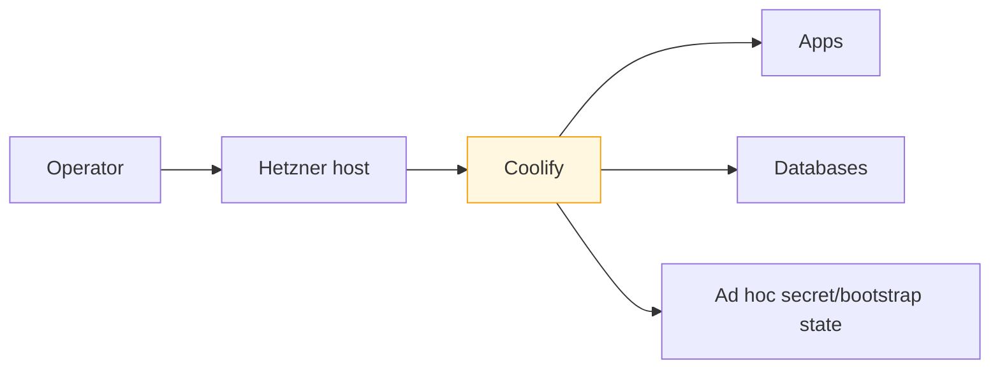
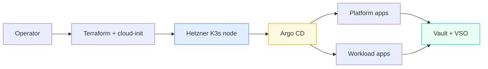

# K3s Migration Program

This note is the umbrella report for the current platform transition from the older Coolify-centered hosting model to the newer Hetzner + K3s + Argo CD + Vault model. The important point is that this is not one project with one deploy command. It is a staged migration program with several layers that have to become real in the right order: infrastructure first, then secrets and auth, then real applications.

The core reports for the new platform are:

- [[PROJ - Hetzner K3s Platform - Single-Node GitOps Bring-Up]]
- [[PROJ - Vault on K3s - Auth and Secret Delivery Platform]]
- [[PROJ - CoinVault on K3s - First Real GitOps App]]
- [[PROJ - MySQL IDE on K3s - Authenticated CoinVault SQL Debug Surface]]

This note exists so that those three do not float as isolated documents. It gives the “why are we doing all this?” frame and ties the new K3s work back to the older Coolify-era platform notes that still matter historically.

> [!summary]
> The migration program currently has five major phases:
> 1. establish a clean K3s platform on Hetzner
> 2. establish Vault, operator auth, workload auth, and VSO
> 3. prove the platform with one real application, CoinVault
> 4. add narrowly scoped operator tooling on top of the migrated workloads
> 5. continue migrating additional services without falling back into ad hoc secret or deploy workflows

## Why this migration program exists

The older Coolify platform was good enough to get services online quickly, but it concentrated too much operational state in one place. Application deployment, runtime secret wiring, and service-specific bootstrap logic were all too tightly coupled to one host and one hosting interface. That is workable when there are only a few services and one operator who remembers everything, but it is not a good long-term platform story.

The K3s program exists to improve the shape of the system, not just the hosting technology. The target qualities are:

- infrastructure is reproducible
- first boot is explicit
- long-term cluster state is Git-owned
- secret values stay out of Git
- workloads get a standard secret delivery path
- applications become repeatable migrations instead of bespoke hosting projects

## What changed conceptually

The older model looked roughly like this:



The new model looks like this:



This is the real migration. “Coolify to K3s” is shorthand, but the deeper shift is:

- from hosting-interface state to Git-managed state
- from mixed secret stories to one Vault-based platform story
- from app-specific deploy folklore to repeatable operator playbooks

## Relationship to the older Coolify notes

The Coolify-era notes are still important because they describe the earlier control plane and the services that originally lived there.

Key older notes:

- [[PROJ - Coolify Hetzner - Self-Hosted Deployment Platform]]
- [[PROJ - Keycloak Identity Platform on Coolify]]
- [[PROJ - CoinVault - RAG Web Chat for Gold Coin Inventory]]

These are not obsolete. They are the historical baseline. The new K3s notes should be read as the next phase of that same infrastructure story, not as unrelated greenfield work.

A good way to think about the relationship is:

```text
Coolify notes
  -> explain how services first came online
K3s notes
  -> explain how the platform is being restructured for longer-term operation
```

## Program structure

The migration program currently breaks into three concrete active subprojects and a longer tail of follow-on work.

### 1. Platform bring-up

Covered by:

- [[PROJ - Hetzner K3s Platform - Single-Node GitOps Bring-Up]]

This phase answered:

- can we bring up a clean K3s host on Hetzner?
- can Terraform stay reconciled?
- can Argo CD own the long-term cluster state?
- can public DNS/TLS work cleanly?

### 2. Secret and identity platform

Covered by:

- [[PROJ - Vault on K3s - Auth and Secret Delivery Platform]]

This phase answered:

- can Vault run on K3s?
- can humans log in through Keycloak?
- can workloads authenticate through Kubernetes auth?
- can VSO turn Vault values into Kubernetes secrets for GitOps-managed apps?

### 3. First real application

Covered by:

- [[PROJ - CoinVault on K3s - First Real GitOps App]]

This phase answered:

- can a real app consume the new platform correctly?
- can a nontrivial auth + DB + secret + ingress workload land successfully?
- what bugs appear only when a real application is migrated?

### 4. Follow-on migrations

These are implied by the current work but not all finished yet:

- add operator tooling where real migrations need observability without introducing ad hoc admin surfaces
- move more applications
- decide what becomes a shared cluster service
- eventually decide whether Keycloak should also live on K3s
- refine cutover and rollback boundaries for each migrated app

### 5. Operator tooling on the new platform

Covered by:

- [[PROJ - MySQL IDE on K3s - Authenticated CoinVault SQL Debug Surface]]

This phase answered:

- how should operators inspect real application data safely?
- how do we port a prototype tool into the same GitOps and OIDC model as the rest of the platform?
- how do we avoid turning “debug tooling” into a second unmanaged admin plane?

## Implementation details

The migration program is easiest to understand as a dependency chain:

```text
K3s infrastructure
  -> Vault platform
    -> Kubernetes auth + OIDC + VSO
      -> shared data services where needed
        -> first real app
          -> later app migrations
```

That order matters because each stage removes a future excuse for doing something manually.

### Why Vault had to come before real app migration

Without Vault + Kubernetes auth + VSO, each app migration would have had to invent its own secret-delivery story. That would have reproduced the exact problem the platform is trying to escape.

So the program intentionally did this:

1. create the cluster
2. create the secrets plane
3. migrate the first app using that plane

### Why CoinVault was the first real app

CoinVault was not the smallest app, but it was the smallest **real** app with enough moving parts to test the platform honestly:

- Keycloak auth
- Vault-managed runtime values
- MySQL
- mounted config/profile files
- persistence
- public HTTPS ingress

That made it a far better proof point than a simpler but less representative service.

### Why “recreate” matters more than “move”

One important framing change during today’s work was that the goal was not to drag old deployments over mechanically. The goal was to recreate the deployments in the new platform model.

That is an important distinction:

- “move” suggests preserving old deployment mechanics
- “recreate” suggests preserving the application contract while changing the platform contract

That framing produced better results. For example, CoinVault did not carry over its older off-cluster Vault bootstrap path. It was re-expressed through Vault Secrets Operator instead.

## Current repo and ticket anchors

Main new-platform repo:

- `/home/manuel/code/wesen/2026-03-27--hetzner-k3s`

Key tickets:

- `/home/manuel/code/wesen/2026-03-27--hetzner-k3s/ttmp/2026/03/27/HK3S-0001--deploy-hetzner-k3s-demo/index.md`
- `/home/manuel/code/wesen/2026-03-27--hetzner-k3s/ttmp/2026/03/27/HK3S-0003--implement-vault-on-k3s-via-argo-cd/index.md`
- `/home/manuel/code/wesen/2026-03-27--hetzner-k3s/ttmp/2026/03/27/HK3S-0004--enable-vault-kubernetes-auth-and-baseline-workload-policies/index.md`
- `/home/manuel/code/wesen/2026-03-27--hetzner-k3s/ttmp/2026/03/27/HK3S-0005--enable-vault-keycloak-oidc-operator-login-on-k3s/index.md`
- `/home/manuel/code/wesen/2026-03-27--hetzner-k3s/ttmp/2026/03/27/HK3S-0006--deploy-vault-secrets-operator-on-k3s-and-prove-secret-sync/index.md`
- `/home/manuel/code/wesen/2026-03-27--hetzner-k3s/ttmp/2026/03/27/HK3S-0007--recreate-the-first-application-on-k3s-using-vault-managed-secrets/index.md`
- `/home/manuel/code/wesen/2026-03-27--hetzner-k3s/ttmp/2026/03/27/HK3S-0009--add-cluster-level-postgres-mysql-and-redis-under-argo-cd/index.md`

## Open questions

- Which future apps should migrate next now that CoinVault proved the pattern?
- When should the K3s environment stop being “parallel” and become the primary operational endpoint for migrated services?
- Which shared cluster services belong in the platform, and which should stay app-local?
- When should older Coolify-hosted services be retired versus left alone?

## Near-term next steps

- finish explicit cutover/rollback notes for CoinVault
- choose the next real application migration
- keep extending the platform by solving real blockers, not by speculating too far ahead

## Project working rule

> [!important]
> Every migration step should reduce hidden operator state. If a new platform slice still depends on memory, shell history, or copied secrets, it is not actually finished yet.
