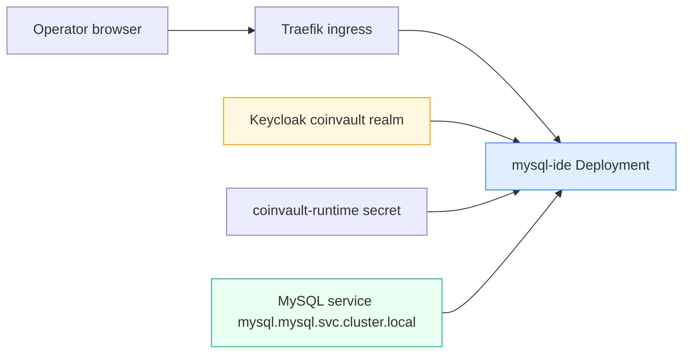

# MySQL IDE on K3s

This project is the operator-facing SQL debugging surface built on top of [[PROJ - CoinVault on K3s - First Real GitOps App]], which itself depends on [[PROJ - Hetzner K3s Platform - Single-Node GitOps Bring-Up]] and [[PROJ - Vault on K3s - Auth and Secret Delivery Platform]]. The goal was not to ship a general-purpose database administration tool. The goal was to give operators a safe, authenticated, browser-based way to inspect the real CoinVault schema and run read-only SQL against the same MySQL service the application uses in production.

The starting point was a small prototype in `/home/manuel/code/wesen/2026-03-27--mysql-ide` consisting of a single HTML file and a permissive Node proxy. The finished system is different in all the ways that matter operationally: it is now a Go service, it is deployed under Argo CD as part of the CoinVault package, it logs users in through Keycloak, and it is hard-wired to CoinVault’s read-only MySQL contract instead of accepting browser-supplied credentials.

> [!summary]
> This project proved five specific things:
> 1. a small operator tool can be promoted from prototype to real platform workload without becoming a shadow admin console
> 2. CoinVault’s runtime contract can be reused for debugging instead of reinventing a second DB/config path
> 3. the right boundary is authenticated browser access plus server-owned DB settings, not client-owned credentials
> 4. live browser smoke tests still find bugs that YAML and `/healthz` will never catch
> 5. operator tooling needs the same rollout, rollback, and identity discipline as user-facing apps

## Why this project exists

When CoinVault moved onto K3s, one of the first practical problems was operational visibility. The application could be healthy at the Kubernetes level and still be wrong in ways that only showed up in real database behavior: missing tables, bad data imports, schema mismatches, or application logic pointing at the wrong config path. That makes an internal SQL inspection surface valuable.

But the obvious bad version of this tool is dangerous:

- a browser asks for arbitrary host/user/password
- the backend acts as a generic SQL proxy
- there is little or no auth
- the tool can mutate production data

That is not a debug surface. That is an accidentally public admin console. So this project exists to make the safe version explicit.

The safe version has three rules:

- the server owns the DB connection contract
- users authenticate through the existing CoinVault identity path
- ad hoc SQL stays read-only and narrow

## Current project status

The service is live at `https://coinvault-sql.yolo.scapegoat.dev`.

What exists today:

- Go service in `/home/manuel/code/wesen/2026-03-27--mysql-ide`
- QueryMac-style HTML UI embedded into the Go binary
- OIDC login through the `coinvault` Keycloak realm
- Deployment, Service, and Ingress under the existing CoinVault Kustomize package
- fixed MySQL target:
  - `mysql.mysql.svc.cluster.local:3306`
  - schema `gec`
  - read-only user from `coinvault-runtime`
- server-owned schema browsing endpoints
- read-only query execution with write rejection
- rollout and rollback playbook in the K3s ticket docs

The important remaining caveat is release hygiene:

- the app repo implementation is committed locally
- but `/home/manuel/code/wesen/2026-03-27--mysql-ide` currently has no Git remote configured

So the code is real and deployed, but its app-repo publication story is not finished yet.

## Project shape

This project crosses three repositories.

### 1. App repo

This is where the actual service lives:

- `/home/manuel/code/wesen/2026-03-27--mysql-ide`

Important files:

- [`cmd/mysql-ide/main.go`](/home/manuel/code/wesen/2026-03-27--mysql-ide/cmd/mysql-ide/main.go)
- [`internal/httpapi/server.go`](/home/manuel/code/wesen/2026-03-27--mysql-ide/internal/httpapi/server.go)
- [`internal/httpapi/static/index.html`](/home/manuel/code/wesen/2026-03-27--mysql-ide/internal/httpapi/static/index.html)
- [`internal/sqlguard/schema.go`](/home/manuel/code/wesen/2026-03-27--mysql-ide/internal/sqlguard/schema.go)
- [`README.md`](/home/manuel/code/wesen/2026-03-27--mysql-ide/README.md)

### 2. GitOps repo

This is where the cluster deployment lives:

- `/home/manuel/code/wesen/2026-03-27--hetzner-k3s`

Important files:

- [`gitops/kustomize/coinvault/mysql-ide-deployment.yaml`](/home/manuel/code/wesen/2026-03-27--hetzner-k3s/gitops/kustomize/coinvault/mysql-ide-deployment.yaml)
- [`gitops/kustomize/coinvault/mysql-ide-service.yaml`](/home/manuel/code/wesen/2026-03-27--hetzner-k3s/gitops/kustomize/coinvault/mysql-ide-service.yaml)
- [`gitops/kustomize/coinvault/mysql-ide-ingress.yaml`](/home/manuel/code/wesen/2026-03-27--hetzner-k3s/gitops/kustomize/coinvault/mysql-ide-ingress.yaml)
- [`scripts/build-and-import-mysql-ide-image.sh`](/home/manuel/code/wesen/2026-03-27--hetzner-k3s/scripts/build-and-import-mysql-ide-image.sh)

### 3. Identity repo

This is where the public redirect coverage for the debug hostname was added:

- [`keycloak/apps/coinvault/envs/hosted/main.tf`](/home/manuel/code/wesen/terraform/keycloak/apps/coinvault/envs/hosted/main.tf)

That split is important. This was not “just a UI port.” It was an app-code change, a GitOps deployment change, and a Keycloak/OIDC redirect change.

## Architecture



The core architectural constraint is:

```text
browser authenticates user
  but
browser does not choose database credentials

server authenticates operator
  and
server owns the DB connection contract
```

That one decision is what keeps this tool from becoming an uncontrolled admin surface.

## Implementation details

The implementation broke down into four real phases.

### Phase 1: reframe the prototype correctly

The prototype was not a small app waiting to be ported. It was:

- one HTML UI shell
- one Node proxy

That meant the project was really:

```text
preserve the useful UX shell
  ->
replace the entire backend and runtime contract
```

This is why the work focused on auth, DB safety, and deployment instead of visual redesign.

### Phase 2: replace the generic proxy with a bounded Go service

The Go service now does three different jobs that the prototype collapsed into one:

1. serve the UI
2. authenticate the operator
3. enforce a narrow DB access model

The backend API was split intentionally:

- server-owned schema endpoints
- read-only ad hoc query endpoint

That is a much safer design than “let the browser issue arbitrary `SHOW` or write statements.”

The rough control flow is:

```text
GET /
  -> if not logged in, redirect to OIDC login
  -> if logged in, render embedded UI

GET /api/schema
  -> run server-owned metadata SQL
  -> return table list and summaries

POST /api/query
  -> parse SQL
  -> reject writes / unsafe statements
  -> execute with row/time/size limits
  -> return rows + metadata
```

### Phase 3: deploy beside CoinVault instead of inside it

The user originally asked for a “debug pod” in the CoinVault deployment. After inspecting the live manifests, the better answer was not a sidecar. It was a sibling workload inside the same namespace and GitOps package.

Why that was better:

- simpler lifecycle
- cleaner logs
- separate rollout and rollback surface
- same namespace-level trust context
- same DB/secret contract reuse

So the final deployment shape became:

- namespace: `coinvault`
- app name: `mysql-ide`
- public host: `coinvault-sql.yolo.scapegoat.dev`
- parent Argo app: `coinvault`

### Phase 4: authenticated smoke tests found a real bug

One of the most useful lessons from this project is that the first meaningful failure only appeared after real browser login and real schema browsing.

The service was already:

- deployed
- passing `/healthz`
- reachable through ingress
- redirecting to Keycloak correctly

But the first authenticated schema load failed because the metadata query results did not scan cleanly into the `sqlx` target struct. The bug was fixed in [`schema.go`](/home/manuel/code/wesen/2026-03-27--mysql-ide/internal/sqlguard/schema.go) by aliasing metadata columns explicitly.

This is a good reminder that:

- deployment health is not behavioral health
- browser-visible operator tooling must be smoke-tested as a real user

## Security and safety model

The best way to understand this tool is to separate what the user controls from what the server controls.

### User-controlled

- login session
- which table to inspect
- which read-only query to attempt

### Server-controlled

- MySQL host
- MySQL port
- database name
- DB username and password
- auth mode
- OIDC issuer/client settings
- query validation policy
- row/time/response limits

That split means a user cannot turn the tool into “connect to any database I want” from the browser.

The query safety rule is:

```text
schema browsing
  -> server-owned metadata queries

ad hoc SQL
  -> single statement
  -> read-only
  -> bounded rows/time/response
```

## Operational lessons

This small project surfaced several bigger platform lessons.

### 1. Operator tools need the same discipline as apps

It would have been easy to treat this as a throwaway pod and wire it up with manual credentials. Doing that would have reintroduced exactly the kind of hidden operator state the K3s migration is trying to remove.

### 2. Reuse the app contract where it is already correct

The deployment reuses `coinvault-runtime` for:

- OIDC client secret
- session secret
- MySQL host/port/schema/user/password

That is better than inventing a second secret subtree for the same read-only runtime contract.

### 3. Terraform defaults can be dangerous in shared repos

The Keycloak redirect change looked tiny, but it came with a real operational hazard: the Terraform repo root `.envrc` had defaults for another realm. Applying without explicit overrides would have targeted the wrong environment. That is exactly the kind of subtle operator trap good playbooks need to capture.

## Current operator commands

```bash
cd /home/manuel/code/wesen/2026-03-27--hetzner-k3s
export KUBECONFIG=$PWD/kubeconfig-91.98.46.169.yaml
kubectl -n argocd get application coinvault
kubectl -n coinvault get deploy,pods,svc,ingress mysql-ide
kubectl -n coinvault logs deploy/mysql-ide --tail=200
curl -ksS https://coinvault-sql.yolo.scapegoat.dev/healthz
```

```bash
cd /home/manuel/code/wesen/2026-03-27--mysql-ide
go test ./...
go build ./cmd/mysql-ide
docker build -t mysql-ide:hk3s-0010 .
```

## Important project docs

- implementation ticket:
  - `/home/manuel/code/wesen/2026-03-27--hetzner-k3s/ttmp/2026/03/27/HK3S-0010--port-mysql-ide-to-go-and-deploy-a-coinvault-debug-pod/index.md`
- rollout playbook:
  - `/home/manuel/code/wesen/2026-03-27--hetzner-k3s/ttmp/2026/03/27/HK3S-0010--port-mysql-ide-to-go-and-deploy-a-coinvault-debug-pod/playbook/02-mysql-ide-rollout-and-rollback-playbook.md`
- app repo README:
  - `/home/manuel/code/wesen/2026-03-27--mysql-ide/README.md`
- related app migration note:
  - [[PROJ - CoinVault on K3s - First Real GitOps App]]

## Open questions

- Should the tool eventually get its own dedicated Keycloak client instead of reusing `coinvault-web`?
- Should the service keep reusing `coinvault-runtime`, or should it eventually get a dedicated secret path once the release story is cleaner?
- When the image delivery path moves to a registry-backed workflow, should this tool ride the same release mechanism as CoinVault or stay more manual?
- Should the service remain read-only forever, or is there ever a legitimate reason for a more privileged internal variant?

## Near-term next steps

- add a real Git remote for `/home/manuel/code/wesen/2026-03-27--mysql-ide`
- keep the rollout playbook updated if the auth or image-delivery path changes
- use this project as the template for future small operator surfaces on K3s

## Project working rule

> [!important]
> Treat internal tools like production workloads. If a debugging surface skips auth, GitOps ownership, or rollback discipline because it is “just for operators,” it will become the next source of hidden operational risk.
