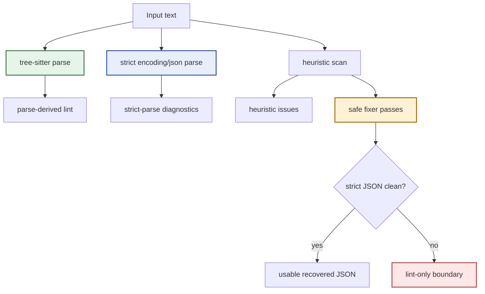

# Sanitize: JSON Recovery Experiments and Limits

This note is the companion to the YAML deep dive and to [[PROJ - Sanitize - Tree-sitter Structured Text Sanitizer]]. It focuses on the JSON side of the repository, especially the long arc from "maybe we can sanitize malformed LLM JSON" to the much narrower and more defensible shipped result: selective recovery for wrappers, comments, commas, and Python literals, plus a lot of linting for everything else.

The short version is that the JSON work was useful, but less effective than the original ambition implied. The codebase learned a lot about malformed JSON, built a good research corpus, generalized the CLI and UI, and shipped a conservative repair layer. What it did not discover was a broad, trustworthy way to auto-repair structural JSON breakage.

> [!summary]
> The JSON work produced a strong investigation and a decent first release, but not a general sanitizer.
> 1. The research artifacts are excellent: parse matrices, heuristic probes, detection buckets, overlap studies, and a repair matrix all make the boundary of the problem unusually legible.
> 2. The effective fixer set is narrow: wrapper stripping, prose extraction, Python-literal normalization, comment removal, duplicate-comma collapse, and trailing-comma removal.
> 3. The hard cases remain hard: missing commas, missing colons, unquoted keys, single quotes, duplicate keys, multiple top-level values, and missing closing delimiters still mostly stop at linting.

## Current project status

As of `2026-03-27`, the JSON side of `sanitize` is implemented across the package, CLI, HTTP API, and browser playground, and `go test ./...` passes in the repo. The important qualifier is that the implementation is strongest as a malformed-LLM JSON recovery layer for wrapper and punctuation cleanup, not as a general structural JSON repair engine.

## Why JSON turned out to be harder than YAML

At first glance JSON looks easier than YAML. The grammar is smaller. The parser rules are stricter. The syntax is less context-sensitive. But that simplicity is exactly why recovery is harder.

When malformed YAML is close to valid YAML, there are often local edits that are both obvious and safe enough to automate. In malformed JSON, the boundary between "obvious typo" and "invented structure" is thinner. A missing comma, missing colon, or missing closing delimiter often leaves multiple plausible intended documents behind it.

That is why the JSON work naturally split into two tracks:

- a research track that asked what kinds of malformed LLM JSON actually appear,
- and an implementation track that tried to define a safe first-release boundary.

The research track was broad. The safe implementation boundary stayed narrow.

## The research work was better than the repair story

One of the best things in this repository is the `SANITIZE-007` ticket folder:

- `reference/03-diary.md`
- `design-doc/01-json-support-outline-and-malformed-llm-json-error-taxonomy.md`
- `sources/01-json-parse-error-replication-matrix.md`
- `sources/02-json-heuristic-probe.md`
- `sources/04-json-detection-buckets.md`
- `sources/05-json-repair-matrix.md`
- `sources/07-json-overlap-study.md`

Those files show a project doing the right kind of investigation before overcommitting to automation.

### The parse-error replication matrix

The parse matrix compares strict `encoding/json` failures against tree-sitter JSON error nodes across common malformed cases. The results immediately explain why this problem is awkward:

- some cases are parser-friendly and structurally localizable,
- some cases are strict-parser failures with no useful tree-sitter error nodes,
- some cases are easy to describe but not easy to repair,
- and some cases are malformed in ways that are obvious to a human but not obvious to a small local fixer.

The matrix also shows one important asymmetry: tree-sitter and strict parsing are related, but not interchangeable. Comments and multiple top-level objects are especially illustrative. The tree may still look structurally plausible while strict JSON semantics still reject the document.

### The heuristic probe

The file `sources/02-json-heuristic-probe.md` is blunt in a helpful way. It shows which malformed classes are even detectable by cheap heuristics before structural reasoning:

- detectable:
  - trailing commas
  - single quotes
  - unquoted keys
  - prose wrappers
  - comments
  - multiple top-level objects
  - Python literals
  - Markdown fences
  - ellipses / placeholders
  - duplicate commas
- not detectable by simple heuristics:
  - missing commas
  - missing colons
  - unescaped quotes
  - invalid escape sequences
  - unterminated strings
  - mismatched delimiters
  - invalid numbers
  - unicode / control-character issues

That list already hints at the final story. The easy detections cluster around wrappers and token normalization. The hard failures are structural.

### Detection buckets

The detection-bucket document sharpens the picture further:

- parser-driven:
  - missing comma
  - missing colon
- heuristic-driven:
  - comments
  - multiple top-level objects
  - duplicate keys
- hybrid:
  - trailing commas
  - single quotes
  - unquoted keys
  - prose wrappers
  - Markdown fences
  - Python literals
  - duplicate commas
  - missing closing delimiters
  - unterminated strings

The important conclusion is that hybrid detection did not automatically become hybrid repair. Detection and repair are different products.

### Overlap study

The overlap study is maybe the most revealing report in the ticket. It counted `34` heuristic issues across the JSON corpus, with `30` having byte-span overlap and `31` having same-row overlap with parse errors.

That is a strong result if the question is "do heuristics and parser spans generally point at the same trouble?" It is a weak result if the hope was "can heuristics meaningfully open up lots of new repair territory?" Mostly, the heuristics reinforce what the parser already knows. They improve labeling and confidence. They do not suddenly make ambiguous structure safe to rewrite.

## Implementation details

The JSON pipeline is structurally cleaner than the YAML backstory, but its practical repair boundary is tighter:



That diagram explains most of the ticket in one glance. Tree-sitter, strict parsing, and heuristics all contribute evidence, but only a small subset of heuristic findings are allowed to cross into automatic repair.

## What actually shipped in code

The JSON package is real. It is not vaporware. `pkg/json` now has:

- tree-sitter parsing in `pkg/json/parse.go`,
- strict-parse validation in `pkg/json/analysis.go`,
- parse-aware lint assembly in `pkg/json/lint.go`,
- heuristic detection in `pkg/json/heuristics.go`,
- a conservative fixer pipeline in `pkg/json/fix.go`,
- and iterative result assembly in `pkg/json/sanitize.go`.

The CLI, server, and browser UI were also generalized around this work:

- `sanitize parse --format json`
- `sanitize lint --format json`
- `sanitize fix --format json`
- `/api/sanitize` and `/api/parse` now accept `{ "format": "...", "input": "..." }`
- the browser app became a shared YAML/JSON playground

That is meaningful progress. The problem is not that nothing shipped. The problem is that the reliable auto-fix surface remained much smaller than the surrounding research and rule catalog might suggest.

## The current fixer boundary is narrow

The most important file is `pkg/json/fix.go`. As of the current code, `applyFixes` only runs these transforms:

1. Markdown fence stripping
2. leading or trailing prose extraction
3. Python-literal normalization
4. comment removal
5. duplicate-comma collapse
6. trailing-comma removal

That is a useful set for LLM wrapper cleanup. It is not a broad JSON repair engine.

The code does **not** currently apply fixers for:

- single quotes
- unquoted keys
- missing commas
- missing colons
- multiple top-level values
- duplicate keys
- missing closing delimiters

That boundary matters because the surrounding docs and rule metadata can feel more ambitious than the actual fixer pipeline. For example, the public rule table in `README.md` marks `single_quotes` as fixable, but the current `applyFixes` implementation does not include a single-quote rewrite pass.

## The repair matrix makes the limitation concrete

The generated `sources/05-json-repair-matrix.md` is the best reality check in the repo.

Cases that recover successfully:

- leading prose
- Markdown fence wrappers
- Python literals
- trailing commas
- duplicate commas
- comments
- combined wrapper-plus-literal-plus-comma cases

Cases that remain broken after the sanitize pass:

- single quotes
- unquoted keys
- missing commas
- missing colons
- missing closing delimiters
- multiple top-level values
- duplicate keys

That split is not a documentation artifact. It matches the current CLI behavior.

### Current command evidence

`sanitize` successfully repairs the deliberately multi-step example `examples/json/24-llm-wrapper-multi-step.json`:

```text
{"ok": true, "items": [1,2]}
4 fix(es) applied
  leading_or_trailing_prose: Extracted the likely JSON payload from surrounding prose
  python_literals: Normalized Python literal "True" to "true"
  trailing_comma: Removed trailing comma before closing delimiter
  trailing_comma: Removed trailing comma before closing delimiter
```

But the same CLI still fails on `examples/json/11-single-quotes.json`:

```text
{'name':'Alice','age':30}
exit status 1
```

And `examples/json/13-missing-comma.json` still degrades to structural lint only:

```text
Line 1: JSON structure could not be parsed cleanly
exit status 1
```

That is the practical meaning of "not very effective." The system is useful for a narrow cluster of malformed-LLM wrappers and punctuation accidents, but it still does not cross the line into reliable structural JSON reconstruction.

## Why the project stopped where it did

This was the correct engineering choice.

The repository repeatedly arrives at the same principle: if intent is ambiguous, lint instead of guessing. That is easy to say in the abstract, but JSON makes the tradeoff harsher than YAML does.

Consider these cases:

- `{"name":"Alice" "age":30}`
- `{"name" "Alice"}`
- `{name:"Alice",age:30}`
- `{'name':'Alice'}`

A human can often imagine a repair. The tool cannot safely assume one without crossing into semantic invention. The moment the engine rewrites these aggressively, it stops being a conservative sanitizer and starts becoming a speculative JSON author.

The JSON work is therefore best understood as a deliberate refusal to overclaim.

## The JSON architecture is still good engineering

Even though the repair coverage is limited, the JSON implementation is not a failed detour. It delivered several durable improvements.

### It forced a better API contract

The server and browser UI had to stop pretending the world was YAML-only. The format-aware request body:

```json
{
  "format": "json",
  "input": "{\"ok\": true}"
}
```

is a cleaner surface for the whole repo, not just for JSON work.

### It separated structural validity from strict validity

`pkg/json` tracks both tree-sitter parse health and strict `encoding/json` validity. That was the right move. The two signals answer different questions:

- "does the document have structural parser breakage?"
- "would a real strict JSON consumer accept this?"

This distinction is visible in `pkg/json/types.go` through `StrictParseClean` and `OriginalStrictParseClean`, and it is one of the most useful ideas that came out of the JSON ticket.

### It built an evidence loop

The JSON corpus and generated reports mean future work no longer has to start from anecdotes. The repository now has concrete examples, categorized failures, and a repeatable way to study overlap between strict parsing, tree-sitter parsing, heuristics, and fixes.

That is a better outcome than a flashy but untrustworthy "AI JSON fixer."

## The code tells a slightly more cautious story than the docs

One subtle but important takeaway from reading both the diaries and the code is that the ticket narrative is broader than the live fixer pipeline. The project documentation often speaks in terms of "JSON support" or "conservative recovery," which is fair. But if someone reads only the high-level docs, they could still come away thinking more malformed cases are auto-fixable than the current package actually handles.

The code is clearer:

- `pkg/json/lint.go` is broad,
- `pkg/json/heuristics.go` is broad,
- `pkg/json/fix.go` is intentionally narrow.

That asymmetry is not a bug. It is the real state of the subsystem.

## Important repo-local documents

The strongest references for the JSON side are:

- `ttmp/2026/03/13/SANITIZE-007--add-json-support-with-focus-on-malformed-llm-json-recovery/reference/03-diary.md`
- `ttmp/2026/03/13/SANITIZE-007--add-json-support-with-focus-on-malformed-llm-json-recovery/design-doc/01-json-support-outline-and-malformed-llm-json-error-taxonomy.md`
- `ttmp/2026/03/13/SANITIZE-007--add-json-support-with-focus-on-malformed-llm-json-recovery/sources/01-json-parse-error-replication-matrix.md`
- `ttmp/2026/03/13/SANITIZE-007--add-json-support-with-focus-on-malformed-llm-json-recovery/sources/02-json-heuristic-probe.md`
- `ttmp/2026/03/13/SANITIZE-007--add-json-support-with-focus-on-malformed-llm-json-recovery/sources/04-json-detection-buckets.md`
- `ttmp/2026/03/13/SANITIZE-007--add-json-support-with-focus-on-malformed-llm-json-recovery/sources/05-json-repair-matrix.md`
- `ttmp/2026/03/13/SANITIZE-007--add-json-support-with-focus-on-malformed-llm-json-recovery/sources/07-json-overlap-study.md`

## Open questions

- Should `single_quotes` become a real fixer, or is that too semantically risky in mixed-content inputs?
- Should there be an explicitly more aggressive `llm-recovery` preset separate from the conservative default?
- Should the project keep JSON and YAML as parallel engines, or eventually extract shared analysis/fix scaffolding?
- How should the docs present the current repair boundary so they do not overstate automatic recovery?

## Working conclusion

The JSON work did not fail. It did something more useful than a flashy failure and less dramatic than a breakthrough.

It mapped the problem carefully.
It built a realistic corpus.
It generalized the public surfaces.
It shipped a small set of trustworthy fixes.
And it showed, with unusually good evidence, that broad automatic JSON sanitizing is much less tractable than it first sounds.

That is why the JSON side of `sanitize` reads less like "we built a sanitizer" and more like "we learned exactly where a conservative sanitizer has to stop."

## KB reviews

- [[KB-BATCH9-tree-sitter-structured-text]] (2026-05-11) — Batch C analysis; contributed to [[On-Ramp/tree-sitter-for-go-tools]] and clarified repair-boundary candidates.

## Related KB entries

- [[On-Ramp/tree-sitter-for-go-tools]] — Tree-sitter recovery as a diagnostic signal that still needs strict validation before trusting output.

**Tribal candidates** (not yet written / needs review):
- Conservative repair boundary (3/3, review before creating) — JSON proves why lint-only is sometimes the correct product behavior.
- Strict-parser plus Tree-sitter dual validation (1/3) — tree shape and strict `encoding/json` acceptance answer different questions.
- Detection vs repair separation (1/3) — detectable malformed patterns are not necessarily safe to rewrite.
- Repair matrix as engineering artifact (1/3) — generated evidence prevents overclaiming.
