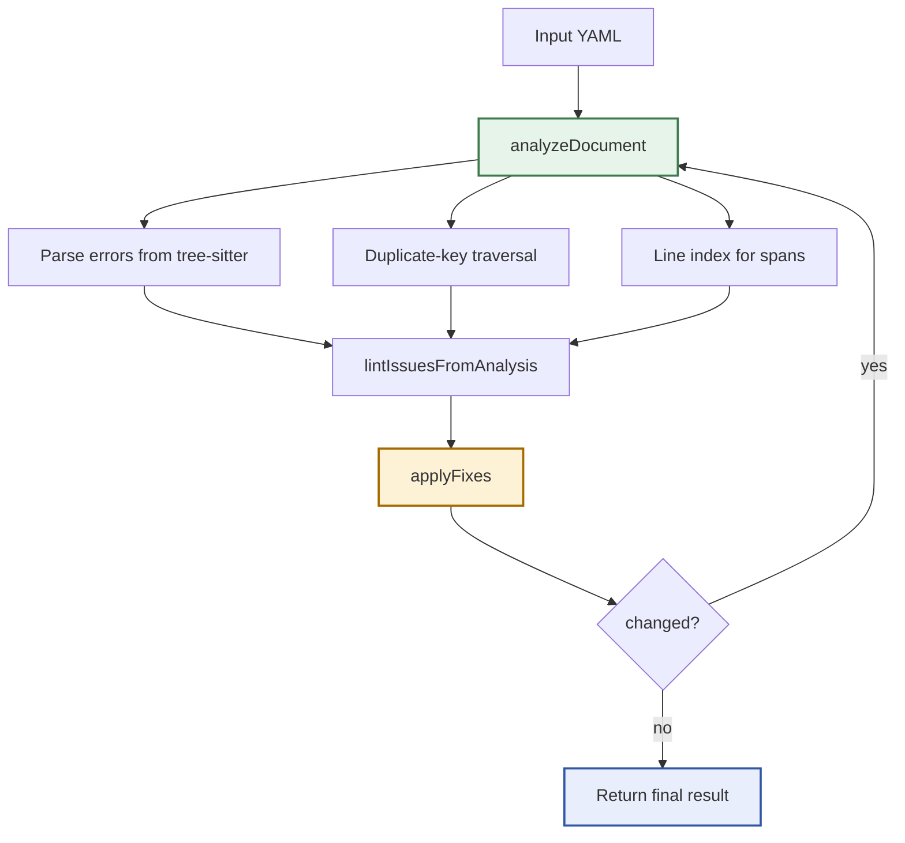

# Sanitize: YAML Sanitizing Deep Dive

This note is a focused follow-up to [[PROJ - Sanitize - Tree-sitter Structured Text Sanitizer]]. It concentrates on the YAML side of the repository, which is still the clearest expression of what the project is actually good at: taking almost-valid structured text, combining parser signals with line heuristics, and iterating toward something a strict downstream tool can consume.

> [!summary]
> The YAML path is where `sanitize` became a real system instead of a loose pile of regexes.
> 1. Tree-sitter provides structural evidence, but the project only became effective once that evidence was blended with heuristic lint and fix rules.
> 2. The key architectural move was the shared `documentAnalysis` pass in `pkg/yaml/analysis.go`, which lets parse, lint, duplicate-key handling, and fix orchestration reuse the same structural facts.
> 3. The current YAML engine can repair genuinely messy examples, including mixed indentation, tab-indented lines, missing spaces after colons, duplicate keys, and plain scalars that need quoting.

## Current project status

As of `2026-03-27`, the YAML side of the repository is the most mature subsystem in `sanitize`. `go test ./...` passes in the repo, the YAML package has dedicated tests for parse-aware diagnostics and repair behavior, and the CLI can still clean up deeply broken fixture files such as `examples/yaml/24-deeply-nested-mixed-errors.yaml`.

## Why the YAML work matters

The repository started as a YAML sanitizing experiment, and that history still shows in the code. YAML is permissive enough that some bad-looking inputs still parse, but brittle enough that tiny formatting mistakes can push the document over the edge. That makes it a good format for this project:

- parse errors are common enough to be worth surfacing,
- local repairs are often explainable,
- and the difference between "parseable" and "healthy" is large enough that linting still matters.

That last point is the important one. A pure parser-only approach would miss duplicate keys, missing spaces after colons, and several style-shaped mistakes that remain semantically dangerous. A pure regex fixer would miss genuine structural breakage. The YAML work only became convincing once the code stopped pretending it had to choose one side.

## Implementation details

### The before-and-after architecture

The most useful framing from `SANITIZE-004` is that the YAML engine moved from "tree-sitter exists somewhere in the codebase" to "tree-sitter participates in every iteration of the sanitize loop."

Earlier, the package had separate passes:

- `ParseTree` in `pkg/yaml/parse.go` parsed and collected `ERROR` / `MISSING` nodes,
- `Lint` in `pkg/yaml/lint.go` mostly walked raw lines with regexes,
- duplicate-key detection in `pkg/yaml/duplicate_keys.go` reparsed again,
- and `Sanitize` in `pkg/yaml/sanitize.go` had to stitch these worlds together repeatedly.

The refactor documented in `ttmp/2026/03/13/SANITIZE-004--improve-yaml-linting-and-sanitizing-with-tree-sitter-aware-analysis/` tightened that into one reusable analysis object:

```go
type documentAnalysis struct {
    TreeText      string
    ParseErrors   []ErrorNode
    DuplicateKeys []duplicateKeyOccurrence
    LineIndex     lineIndex
}
```

That is a small type, but it changes the project’s shape. The parser is no longer a sidecar. It is the source of truth for structural spans, duplicate-key traversal, and fix targeting.

### The simplest mental model

The YAML pipeline now reads best as a layered loop:



Or in pseudocode:

```text
doc = analyzeDocument(src)
issues = parse-derived issues
issues += heuristic line issues
issues += duplicate-key issues
issues += mixed-indentation issues

if no parse errors and no lint issues:
    return clean result

fixed = applyFixes(src, doc)
if no fixes:
    return current result
repeat
```

That pseudocode is simple on purpose. The elegance of the YAML path is not in exotic algorithms. It is in the discipline of keeping one parse-aware analysis object alive all the way through the loop.

### Why tree-sitter alone was not enough

The best part of the `SANITIZE-004` design work is the classification of failures into three groups:

1. parse-only failures,
2. heuristic-only failures,
3. hybrid failures.

That classification is not just documentation. It explains why the code looks the way it does.

### Parse-only failures

Some documents fail structurally, and the parser is the only reliable witness. The example called out repeatedly in the ticket docs is `examples/yaml/20-mixed-indent.yaml`. The current CLI still shows that pattern clearly:

```text
Line 1: YAML structure could not be parsed cleanly
Line 3: indentation is not a multiple of the dominant 2-space unit
```

The first line is parser-derived. The second line is the project translating structural evidence into a human-useful lint message.

### Heuristic-only failures

Other documents still parse, but are bad in ways the parser will not condemn. Duplicate keys are the cleanest example. YAML will often accept them; the project chooses not to. Missing spaces after colons and some flow-collection quirks fall into the same category.

This is why `pkg/yaml/lint.go` still contains explicit line rules. The parser is necessary, but it does not define the whole quality model.

### Hybrid failures

The most interesting cases are the ones where tree-sitter knows the document is broken but cannot quite point to the exact human fix. The `SANITIZE-004` diary uses tab indentation as the proof case: the parser may anchor the error on a parent mapping line, while the actionable problem is one or two child lines away.

That is exactly why `extra_colon_in_value` is guarded by parse proximity rather than by pure regex detection. The rule only becomes actionable when the surrounding structural context says, "yes, this suspicious colon probably matters."

### The code paths that make the YAML engine work

### `pkg/yaml/analysis.go`

This file is the real center of gravity. `analyzeDocument` parses once, builds the S-expression text, collects parser errors, traverses duplicate keys, and builds byte-to-row mapping. Everything else becomes easier because this file exists.

### `pkg/yaml/lint.go`

This file is where the project’s blended philosophy is most visible. `lintIssuesFromAnalysis` does three things in order:

1. convert parser failures into first-class lint issues,
2. scan line-oriented heuristics,
3. add mixed-indentation diagnostics when structural breakage suggests that indentation is the real story.

This file also upgraded `LintIssue` from a simple row marker into a span-carrying diagnostic shape. That matters for both CLI clarity and the bundled web UI.

### `pkg/yaml/duplicate_keys.go`

This is one of the quiet successes in the codebase. Duplicate-key handling is not based on fragile text matching. It walks mapping nodes and only flags duplicates inside the same mapping scope. Tests in `pkg/yaml/sanitize_test.go` make that scoping explicit by checking that duplicate names in different parents or different sequence items are not treated as collisions.

### `pkg/yaml/fix.go`

The fixer layer is conservative and surprisingly effective because each rule is narrow:

- `tab_indent` replaces leading tabs,
- `missing_space_after_colon` normalizes `key:value`,
- `list_dash_no_space` turns `-item` into `- item`,
- `trailing_comma` removes commas in flow collections,
- `extra_colon_in_value` quotes suspicious plain scalars,
- `duplicate_key` renames later duplicates with suffixes,
- `mixed_indent` normalizes odd indentation to the dominant unit.

Nothing here is magical. The package succeeds by stacking a lot of small, defensible edits.

### `pkg/yaml/sanitize.go`

This is the orchestration layer. It captures original state, iterates up to a configurable cap, accumulates fixes, and returns both original and final diagnostics. That is what turns the package into an inspection tool rather than a blind rewriting utility.

### A concrete example: the engine repairing a genuinely messy document

The most convincing YAML example in the current repository is `examples/yaml/24-deeply-nested-mixed-errors.yaml`. Running the current CLI against it produces a result that looks like this:

```text
pipeline:
  stages:
    - build
    - test
  metadata:
    owner: "team: infra"
    image: { name: app, tag: latest}
11 fix(es) applied
  tab_indent: Line 2: replaced leading tab(s) with 2 spaces each
  list_dash_no_space: Line 3: added space after list dash
  missing_space_after_colon: Line 7: added space after colon
  trailing_comma: Line 7: removed trailing comma in flow collection
  extra_colon_in_value: Line 6: quoted value containing extra colon
```

That output is worth studying because it shows the package at its best:

- the file is not repaired by one clever rule,
- it is repaired by a sequence of local, explainable transforms,
- and the final document is materially more valid without the sanitizer having to invent entirely new structure.

This is the core YAML lesson of the project: successful sanitizing is often additive and iterative, not heroic.

### What changed in the data model

One underappreciated improvement is the shape of `LintIssue` in `pkg/yaml/types.go`. It now carries:

- `Rule`
- `Source`
- byte spans
- row and column spans
- and a convenience `Row`

That change sounds boring, but it is exactly the sort of boring that pays off. Once parser-derived and heuristic-derived problems share a common diagnostic language, the CLI and UI no longer need to special-case "real parse errors" versus "everything else."

## Why the YAML path feels more mature than the JSON path

The YAML code has a stronger center. It has one analysis object, one clear iterative loop, and a set of fixers that mostly match the rule catalog. There are still open questions around how much of that should become public API, and whether `pkg/yaml` should keep growing or stabilize, but the engine itself already has a coherent mental model.

That coherence is visible in the tests too. `pkg/yaml/sanitize_test.go` does not just test happy paths. It tests scope boundaries, parse-derived issues, mixed indentation, and span-carrying diagnostics. The package is behaving like a maintained subsystem rather than a spike.

## Important repo-local documents

The most useful supporting material for the YAML side is:

- `ttmp/2026/03/13/SANITIZE-004--improve-yaml-linting-and-sanitizing-with-tree-sitter-aware-analysis/reference/01-diary.md`
- `ttmp/2026/03/13/SANITIZE-004--improve-yaml-linting-and-sanitizing-with-tree-sitter-aware-analysis/design-doc/01-tree-sitter-driven-yaml-linting-and-sanitizing-analysis.md`
- `ttmp/2026/03/13/SANITIZE-004--improve-yaml-linting-and-sanitizing-with-tree-sitter-aware-analysis/sources/01-example-corpus-parse-vs-lint-matrix.md`

Those docs are unusually valuable because they capture not just the code that landed, but the reasoning that produced the shared-analysis design.

## Open questions

- Should `documentAnalysis` remain internal, or eventually become a public inspection API?
- Should duplicate-key rewriting remain the default behavior, or become a selectable policy?
- How much further should parser-derived structure shape future fix rules?
- Should the UI expose more of the YAML-specific fix-targeting logic, especially for span-rich diagnostics?

## Working conclusion

The YAML half of `sanitize` is the part of the repository where the original idea already works. Not perfectly, and not with some grand universal parser architecture, but with a very grounded engineering pattern:

1. parse once,
2. keep the structural facts,
3. layer heuristics on top,
4. fix only what can be explained,
5. stop when the document converges.

That is why the YAML work reads less like experimentation now and more like a small, credible text-repair engine.
