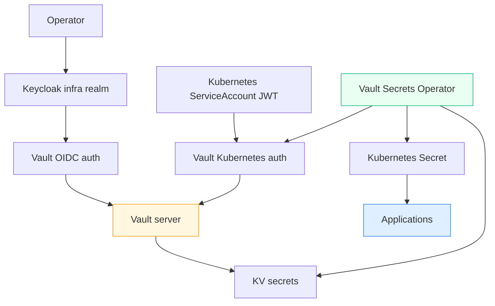

# Vault on K3s

This project is the secret and identity plane built on top of [[PROJ - Hetzner K3s Platform - Single-Node GitOps Bring-Up]]. It starts with a K3s-hosted Vault server under Argo CD, then layers in Kubernetes workload auth, human operator login through Keycloak OIDC, and finally Vault Secrets Operator as the standard bridge from Vault to Kubernetes `Secret` objects.

The important change from the older setup is not merely “Vault moved hosts.” The important change is that secret delivery now has an explicit architecture. The cluster has a clear answer for both of these questions:

- how should a human operator log into Vault?
- how should an in-cluster workload receive secrets without `.envrc` drift or copied credentials?

> [!summary]
> This project currently has four important slices:
> 1. Vault server on K3s with Raft and AWS KMS auto-unseal
> 2. Kubernetes auth for machine identity
> 3. Keycloak OIDC for human operators
> 4. Vault Secrets Operator for GitOps-friendly secret delivery

## Why this project exists

The old state of the world had working secrets, but not a stable platform story. Some secrets lived in local operator state, some deployment stories depended on semi-manual steps, and some apps were still shaped around the hosting platform they were born on. That makes later migrations much harder, because every app brings its own special-case secret workflow.

This project exists to make secret management a platform concern rather than an app-specific accident. The real outcome is not “there is a Vault pod.” The real outcome is a reusable contract:

```text
humans -> Keycloak OIDC -> Vault
workloads -> Kubernetes auth -> Vault
apps -> Vault Secrets Operator -> Kubernetes Secret
```

Once that exists, later applications can migrate onto the cluster without inventing a new secret story each time.

## Current project status

The platform is operational.

What exists today:

- Vault at `https://vault.yolo.scapegoat.dev`
- single-node Raft storage
- AWS KMS auto-unseal
- off-cluster recovery material stored in 1Password
- Kubernetes auth mount configured at `auth/kubernetes`
- baseline workload policies and roles
- Keycloak OIDC login for operators via the shared `infra` realm
- Vault Secrets Operator installed and proven with a smoke namespace

What is still intentionally deferred:

- full migration of older external services into the cluster
- broader dynamic-secret workflows
- richer multi-env secret governance

## Project shape

This project is really three nested subprojects:

1. **Vault server deployment**
   - Argo-managed app
   - Raft storage
   - KMS auto-unseal
   - TLS ingress
2. **Authentication plane**
   - OIDC for humans
   - Kubernetes auth for workloads
3. **Secret delivery plane**
   - Vault policies and roles
   - VSO CRDs
   - sync from Vault KV into Kubernetes secrets

## Architecture



The point of this architecture is not simply to add more components. It is to separate trust boundaries:

- humans authenticate through an identity provider
- workloads authenticate through Kubernetes-issued identity
- applications consume native Kubernetes secrets instead of all learning Vault API behavior

## Implementation details

The implementation happened in stages across several tickets:

- `HK3S-0003`: Vault server bring-up
- `HK3S-0004`: Kubernetes auth and baseline roles
- `HK3S-0005`: Keycloak OIDC operator login
- `HK3S-0006`: Vault Secrets Operator and first secret sync

### Stage 1: Vault server

The server itself is defined in the GitOps repo, but one critical bootstrap secret is intentionally not in Git:

- Argo app:
  - `/home/manuel/code/wesen/2026-03-27--hetzner-k3s/gitops/applications/vault.yaml`
- local secret bootstrap:
  - `/home/manuel/code/wesen/2026-03-27--hetzner-k3s/scripts/bootstrap-vault-aws-kms-secret.sh`

The important design choice was:

```text
Git manages deployment shape
  but
local operator step manages AWS credential material
```

That split keeps AWS keys out of Git while preserving a declarative server definition.

### Stage 2: Kubernetes auth

This is the machine identity layer.

The platform now has:

- `auth/kubernetes`
- policy files under:
  - `/home/manuel/code/wesen/2026-03-27--hetzner-k3s/vault/policies/kubernetes/`
- role files under:
  - `/home/manuel/code/wesen/2026-03-27--hetzner-k3s/vault/roles/kubernetes/`

The key mental model is:

```text
service account token
  -> Vault validates token with TokenReview
  -> Vault maps namespace/serviceaccount to role
  -> role attaches one or more policies
  -> resulting token can read only that app subtree
```

That is what later enabled application-specific roles like `coinvault-prod`.

### Stage 3: human operator login

Rather than invent a new identity system for the K3s Vault, the work reused the existing Keycloak control plane. The shared Keycloak `infra` realm already existed. The migration only needed to:

- allow the K3s Vault callback URL
- configure a new `oidc/` mount and `operators` role in the new Vault
- map Keycloak groups to Vault policies

This is why Vault login now works through the same identity provider instead of through long-lived root-token habits.

### Stage 4: Vault Secrets Operator

VSO is where the platform became useful for application migrations.

The central design decision was:

```text
Vault should remain the source of truth
  but
apps should usually consume ordinary Kubernetes Secrets
```

That gives a much more GitOps-friendly workflow:

- Git stores the secret sync intent
- Vault stores the secret values
- VSO writes Kubernetes `Secret` objects
- app pods consume those secrets conventionally

The smoke-test path used:

- controller app:
  - `/home/manuel/code/wesen/2026-03-27--hetzner-k3s/gitops/applications/vault-secrets-operator.yaml`
- smoke app:
  - `/home/manuel/code/wesen/2026-03-27--hetzner-k3s/gitops/applications/vault-secrets-operator-smoke.yaml`

The internal object flow looks like this:

```text
VaultConnection
  -> tells VSO where Vault is
VaultAuth
  -> tells VSO how to authenticate
VaultStaticSecret
  -> tells VSO which Vault path to read and which Kubernetes Secret to write
```

That is the pattern later reused by CoinVault.

### Failure modes and tricky details

The project hit several subtle but important design constraints:

- Vault server config should be Git-managed, but KMS credentials should not be
- machine auth and human auth should be separate systems even if they terminate in the same Vault
- using the in-cluster Vault service for the first VSO smoke path simplified debugging by avoiding ingress and DNS as variables
- the valuable unit is not “a login succeeded”; the valuable unit is “identity is mapped to bounded policy and bounded secret paths”

These details matter because secret systems fail most dangerously when they appear to work while silently widening trust.

## Current operator commands

```bash
cd /home/manuel/code/wesen/2026-03-27--hetzner-k3s
export KUBECONFIG=$PWD/kubeconfig-91.98.46.169.yaml
kubectl -n argocd get applications
kubectl -n vault get pods
kubectl -n vault-secrets-operator-system get pods
vault login -method=oidc role=operators
./scripts/validate-vault-kubernetes-auth.sh
./scripts/validate-vault-secrets-operator.sh
```

## Important project docs

- `/home/manuel/code/wesen/2026-03-27--hetzner-k3s/ttmp/2026/03/27/HK3S-0003--implement-vault-on-k3s-via-argo-cd/index.md`
- `/home/manuel/code/wesen/2026-03-27--hetzner-k3s/ttmp/2026/03/27/HK3S-0004--enable-vault-kubernetes-auth-and-baseline-workload-policies/index.md`
- `/home/manuel/code/wesen/2026-03-27--hetzner-k3s/ttmp/2026/03/27/HK3S-0005--enable-vault-keycloak-oidc-operator-login-on-k3s/index.md`
- `/home/manuel/code/wesen/2026-03-27--hetzner-k3s/ttmp/2026/03/27/HK3S-0006--deploy-vault-secrets-operator-on-k3s-and-prove-secret-sync/design-doc/01-vault-secrets-operator-architecture-and-implementation-guide.md`

## Open questions

- Should more apps consume VSO-managed Kubernetes secrets by default, or are there future cases where direct Vault API or dynamic secrets are better?
- When Keycloak eventually moves to K3s, how should break-glass operator access remain decoupled enough to survive cluster trouble?
- Which secret paths should become formalized as platform conventions versus app-local decisions?

## Near-term next steps

- use the VSO path for more real applications
- keep Vault policy and role boundaries narrow as the number of workloads grows
- avoid reintroducing `.envrc` or copied secret workflows once the platform path exists

## Project working rule

> [!important]
> Keep secret **intent** in Git and secret **values** in Vault. If a deployment fix depends on copying secrets by hand into Kubernetes, the platform story has regressed.
