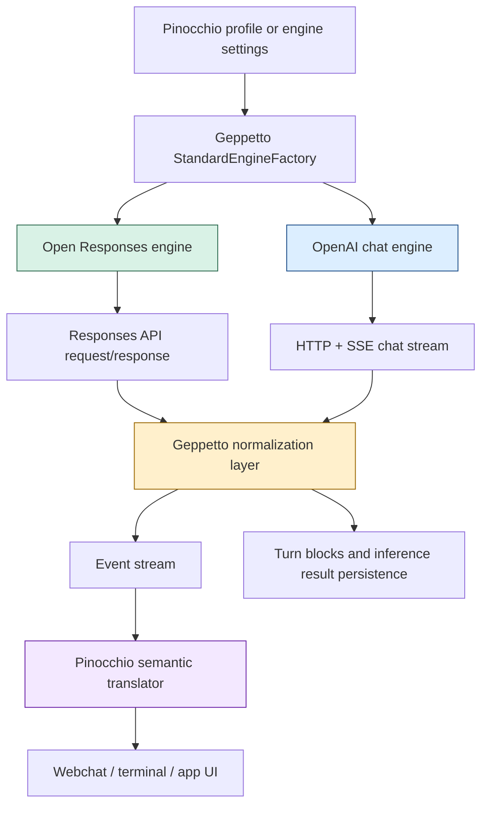

# Geppetto Open Responses and Chat Boundary Cutover

This note is a branch report for the Geppetto work in `/home/manuel/workspaces/2026-03-27/use-open-responses/geppetto`. It covers one coherent stream of work that started as “add Open Responses support,” turned into a real Together/Qwen thinking-stream investigation, and ended with a structural cleanup: Geppetto now owns the OpenAI-compatible chat-completions boundary instead of delegating critical request and stream semantics to `go-openai`.

> [!summary]
> This project slice has three tightly related outcomes:
> 1. a first-class Open Responses path in Geppetto with better reasoning-block persistence
> 2. a real fix for missing Together Qwen thinking deltas in the Geppetto/Pinocchio stack
> 3. a hard cutover of the OpenAI chat layer to Geppetto-owned request/message/tool structs while leaving embeddings and transcription on `go-openai`

## What this report is based on

This report is synthesized from the ticket workspaces and code changes for:

- `GP-56-OPEN-RESPONSES`
- `GP-57-TOGETHER-THINKING`
- `GP-58-CHAT-STREAM-NORMALIZATION`

The most important repo-local documents are:

- `/home/manuel/workspaces/2026-03-27/use-open-responses/geppetto/ttmp/2026/03/27/GP-56-OPEN-RESPONSES--add-open-responses-support-to-geppetto-with-raw-reasoning-traces-and-semantic-streaming/design-doc/01-intern-guide-to-adding-open-responses-support-and-raw-reasoning-traces-in-geppetto.md`
- `/home/manuel/workspaces/2026-03-27/use-open-responses/geppetto/ttmp/2026/03/27/GP-57-TOGETHER-THINKING--investigate-missing-together-qwen-thinking-stream-in-openai-compatible-chat-completions/design-doc/02-postmortem-and-intern-guide-to-the-together-qwen-thinking-stream-bug.md`
- `/home/manuel/workspaces/2026-03-27/use-open-responses/geppetto/ttmp/2026/03/27/GP-58-CHAT-STREAM-NORMALIZATION--extract-chat-streaming-from-go-openai-and-add-provider-aware-reasoning-delta-normalization/design-doc/01-intern-guide-to-extracting-chat-streaming-from-go-openai-and-normalizing-provider-reasoning-deltas.md`

The most important code locations are:

- `/home/manuel/workspaces/2026-03-27/use-open-responses/geppetto/pkg/steps/ai/openai_responses/engine.go`
- `/home/manuel/workspaces/2026-03-27/use-open-responses/geppetto/pkg/steps/ai/openai/chat_types.go`
- `/home/manuel/workspaces/2026-03-27/use-open-responses/geppetto/pkg/steps/ai/openai/chat_stream.go`
- `/home/manuel/workspaces/2026-03-27/use-open-responses/geppetto/pkg/steps/ai/openai/helpers.go`
- `/home/manuel/workspaces/2026-03-27/use-open-responses/geppetto/pkg/steps/ai/openai/engine_openai.go`
- `/home/manuel/workspaces/2026-03-27/use-open-responses/geppetto/pkg/inference/engine/factory/factory.go`
- `/home/manuel/workspaces/2026-03-27/use-open-responses/pinocchio/pkg/webchat/sem_translator.go`

## Why this project exists

This branch exists because “OpenAI-compatible” is not a real compatibility guarantee once you care about streamed reasoning traces, event naming, or provider-specific deltas. Geppetto already had a broad inference abstraction and Pinocchio already had a semantic/UI event layer, but the seam between provider output and application-visible thinking was still too fragile.

There were really two product goals hiding inside the original request:

- support the newer Responses-style reasoning model well enough that raw reasoning blocks, summaries, and encrypted content can be represented intentionally
- make legacy chat-completions streaming reliable enough that a provider like Together can expose thinking deltas without Geppetto silently dropping them

Those goals are related because they both force the same architectural conclusion: Geppetto must own the normalization boundary for reasoning-aware inference instead of trusting third-party SDK struct models.

## Current project status

The branch is in a strong intermediate state.

What already exists:

- a first-class `open-responses` provider path in Geppetto
- richer reasoning block persistence for Responses-style engines
- a Geppetto-owned SSE decoder for OpenAI-compatible chat streaming
- normalization for both `delta.reasoning` and `delta.reasoning_content`
- a real fix for the Together/Qwen missing-thinking bug
- Geppetto-local chat request/message/tool structs that replace `go-openai` in the chat runtime
- detailed ticket docs, experiment artifacts, diaries, and reMarkable bundles

What is intentionally still separate:

- embeddings still use `go-openai`
- transcription still uses `go-openai`
- the remaining odd behavior of `go-openai` on Together streams is now historical context, not a blocker for the chat path

## Project shape

At a high level, this work spans four layers:

1. **Provider-facing inference runtimes**
   - Open Responses runtime
   - OpenAI-compatible chat-completions runtime
2. **Turn and event normalization**
   - convert provider deltas into Geppetto events and turn blocks
   - preserve reasoning separately from saying text
3. **Application translation**
   - Pinocchio translates Geppetto events into semantic/webchat/UI events
4. **Documentation and experiment capture**
   - ticket workspaces
   - probe scripts
   - long-form postmortems and diaries

## Architecture

```text
profiles / runtime config
  -> engine factory
  -> provider-specific engine
  -> request construction
  -> provider stream / responses payload
  -> Geppetto normalization
  -> events + turn blocks
  -> Pinocchio semantic translation
  -> UI / logs / persisted traces
```



## Why the work split into three tickets

The ticket split actually mirrors the architecture:

### 1. `GP-56`: Open Responses support

This ticket established the newer provider/runtime model. The important result was not just “add one more API type,” but “teach Geppetto that reasoning content is a first-class payload with multiple representations.”

That meant:

- provider registration for `open-responses`
- factory routing between chat-completions and Responses-style engines
- reasoning block persistence beyond a single opaque field
- response normalization that can preserve summaries, text, and encrypted content separately

### 2. `GP-57`: Together/Qwen thinking investigation

This ticket started as a bug report against the `together-qwen-3.5-9b` profile. The user could not see the thinking stream even though the provider and model were believed to support it.

The key contribution of this ticket was methodological:

- compare raw provider SSE
- compare `go-openai`
- compare Geppetto

That experiment matrix proved that:

- Together really does emit `delta.reasoning`
- Geppetto initially had a request-shape bug (`stream=true` missing at the real SSE boundary)
- the SDK boundary was also too rigid for provider-specific reasoning aliases

### 3. `GP-58`: Chat-stream normalization and cutover

This ticket turned the debugging lesson into architecture. Once it was clear that “OpenAI-compatible” providers diverge at the streamed delta level, the only durable answer was to own the streaming boundary.

That first meant a custom SSE decoder and alias normalization. The later follow-up in `GP-57` finished the job by replacing `go-openai` request/message/tool structs with local Geppetto types in the chat runtime.

## Implementation details

The simplest mental model is that Geppetto now has two different but related “reasoning-aware” inference paths:

- a **Responses path**, where the provider protocol already acknowledges reasoning blocks as first-class output
- a **chat-completions path**, where Geppetto must reconstruct that meaning from streamed SSE deltas

The design rule behind both paths is the same:

> Geppetto should not let a provider SDK decide which reasoning fields are real.

### Factory routing

The first decision point is engine selection in `/home/manuel/workspaces/2026-03-27/use-open-responses/geppetto/pkg/inference/engine/factory/factory.go`.

Conceptually:

```go
switch settings.Chat.ApiType {
case "open-responses", "openai-responses":
    return newOpenResponsesEngine(settings)
case "openai":
    return newOpenAIChatEngine(settings)
default:
    return otherProviderEngine(settings)
}
```

This split matters because the two paths operate on different provider contracts. The Responses engine expects structured response items and reasoning blocks. The chat engine expects a streaming `/chat/completions` protocol and must normalize provider drift itself.

### Open Responses path

The Responses engine lives in `/home/manuel/workspaces/2026-03-27/use-open-responses/geppetto/pkg/steps/ai/openai_responses/engine.go`.

The important design move here is that reasoning is not reduced to one string anymore. The engine and helpers persist richer reasoning block payloads, including:

- `text`
- `summary`
- `encrypted_content`

That gives Geppetto a more honest internal representation for providers that expose “thinking” as formal output rather than as ad hoc chat deltas.

Pseudocode:

```go
for item in response.output:
    switch item.type:
    case "reasoning":
        appendReasoningBlock(
            text=item.text,
            summary=item.summary,
            encrypted=item.encrypted_content,
        )
        publishReasoningEvents(item)
    case "message":
        appendAssistantText(item.text)
        publishTextEvents(item)
    case "tool_call":
        appendToolCall(item)
```

### Chat-completions path before the fix

Before the Together work, the chat-completions path had two separate problems.

First, Geppetto’s custom SSE path was opening a streaming reader without always forcing `stream=true` in the actual outgoing request body. That meant the runtime could believe it was in streaming mode while the provider returned a non-streaming JSON response.

Second, the old typed boundary still assumed SDK-owned structs for request and tool modeling. That was not the source of the `stream=true` bug, but it meant the chat path was still coupled to a library whose stream type model had already proven too narrow for Together’s `delta.reasoning`.

### Chat-completions path after the fix and cutover

The current chat runtime is spread across:

- `/home/manuel/workspaces/2026-03-27/use-open-responses/geppetto/pkg/steps/ai/openai/chat_types.go`
- `/home/manuel/workspaces/2026-03-27/use-open-responses/geppetto/pkg/steps/ai/openai/helpers.go`
- `/home/manuel/workspaces/2026-03-27/use-open-responses/geppetto/pkg/steps/ai/openai/chat_stream.go`
- `/home/manuel/workspaces/2026-03-27/use-open-responses/geppetto/pkg/steps/ai/openai/engine_openai.go`

The critical point is that Geppetto now owns both sides of the wire:

- **request encoding**
  - local `ChatCompletionRequest`
  - local `ChatCompletionMessage`
  - local `ChatToolCall`
  - local structured-output response format types
- **stream decoding**
  - raw HTTP + SSE frame reader
  - alias normalization for provider-specific reasoning fields

This is the current pipeline:

```mermaid
flowchart LR
    A[Turn blocks] --> B[MakeCompletionRequestFromTurn]
    B --> C[ChatCompletionRequest]
    C --> D[openChatCompletionStream]
    D --> E[readSSEFrame]
    E --> F[normalizeChatStreamEvent]
    F --> G[reasoning-text-delta / partial / tool-call events]
    G --> H[Persist turn blocks and inference result]

    style B fill:#dceeff,stroke:#1d4e89
    style F fill:#fff0cc,stroke:#9a6700
    style H fill:#d9f2e6,stroke:#2d6a4f
```



### Why local chat structs matter

This was the final architectural lesson of the ticket. Once the stream decoder was already custom, leaving request/message/tool structs on `go-openai` bought less and less.

Owning local chat structs solved several problems:

- it removed the last chat-runtime dependency on the SDK’s struct model
- it let Geppetto preserve exact JSON semantics that matter to providers
- it made explicit testing possible for tricky wire-shape details

Two details are especially important:

1. **polymorphic message content**

OpenAI-compatible chat messages can encode `content` as:

- a string
- an array of structured parts

Geppetto now handles that intentionally with a custom `MarshalJSON` on `ChatCompletionMessage`.

2. **explicit `parallel_tool_calls=false`**

If you rely on plain `omitempty` booleans, you can accidentally erase an explicit false choice. The local request type preserves explicit false via `*bool`.

Pseudocode:

```go
type ChatCompletionMessage struct {
    Role string
    Content string
    MultiContent []ChatMessagePart
}

func (m ChatCompletionMessage) MarshalJSON() {
    raw["role"] = m.Role
    if len(m.MultiContent) > 0 {
        raw["content"] = m.MultiContent
    } else {
        raw["content"] = m.Content
    }
}
```

### Together thinking fix

The concrete Together bug came from the combination of:

- a provider that emits `delta.reasoning`
- a runtime that was not reliably forcing `stream=true`
- a historical assumption that an SDK would preserve all relevant streamed fields

The bug-fix sequence was:

1. prove raw Together SSE emits reasoning
2. prove Geppetto receives zero chunks when `stream=true` is missing
3. force `stream=true` in the real runtime path
4. normalize both `reasoning` and `reasoning_content`
5. verify live `reasoning-text-delta` and `partial-thinking` events
6. later remove the remaining chat-layer request/tool struct dependency on the SDK

That logic is captured in this simplified loop:

```go
req := makeCompletionRequest(turn)
req.Stream = true
req.StreamOptions = &ChatStreamOptions{IncludeUsage: true}

stream := openChatCompletionStream(req)

for {
    event := stream.Recv()
    reasoning := firstNonEmpty(event.delta.reasoning, event.delta.reasoning_content)
    text := event.delta.content

    if reasoning != "" {
        publishReasoningDelta(reasoning)
        reasoningBuf += reasoning
    }
    if text != "" {
        publishTextDelta(text)
        textBuf += text
    }
}
```

### Pinocchio semantic translation

Pinocchio is still important because the user does not see raw Geppetto events. The semantic translation layer in `/home/manuel/workspaces/2026-03-27/use-open-responses/pinocchio/pkg/webchat/sem_translator.go` is what makes the repaired reasoning stream visible at the application surface.

That means the final observable success condition is not just “provider stream exists,” but:

- Geppetto publishes `reasoning-text-delta`
- Geppetto publishes `partial-thinking`
- Pinocchio translates that into its webchat/semantic event model
- the UI displays reasoning incrementally

### Tricky details and failure modes

This branch has a few details that are easy to miss if you only skim the code.

- A system can say it is “using streaming mode” and still send a non-streaming request body if `stream=true` is not forced at the actual wire boundary.
- Provider compatibility claims are too coarse for reasoning features; field names matter.
- Test-only helpers can leak into production refactors if you move too quickly. One of the chat cutover compile failures came from accidentally reusing `boolPtr` from tests.
- Ticket-local scripts matter. The GP-57 probe script caught one of the follow-on compile mismatches after the local chat types landed.
- Documentation toolchains have their own failure modes. The reMarkable/Pandoc path broke on a literal `\n` sequence in a diary entry even though the markdown looked fine for local reading.

## Current user-facing commands

The most relevant local validation commands for this branch were:

```bash
cd /home/manuel/workspaces/2026-03-27/use-open-responses/geppetto
go test ./pkg/steps/ai/openai -count=1
go test ./... -count=1
docmgr doctor --ticket GP-57-TOGETHER-THINKING --stale-after 30
```

The most important profile-backed Together probes were:

```bash
cd /home/manuel/workspaces/2026-03-27/use-open-responses/geppetto
go run ./ttmp/2026/03/27/GP-57-TOGETHER-THINKING--investigate-missing-together-qwen-thinking-stream-in-openai-compatible-chat-completions/scripts/together_qwen_probe.go \
  --mode raw-sse \
  --profile together-qwen-3.5-9b \
  --profiles /home/manuel/.config/pinocchio/profiles.yaml
```

and:

```bash
go run ./ttmp/2026/03/27/GP-57-TOGETHER-THINKING--investigate-missing-together-qwen-thinking-stream-in-openai-compatible-chat-completions/scripts/together_qwen_probe.go \
  --mode geppetto \
  --profile together-qwen-3.5-9b \
  --profiles /home/manuel/.config/pinocchio/profiles.yaml
```

## Important project docs

The key ticket artifacts are:

- `/home/manuel/workspaces/2026-03-27/use-open-responses/geppetto/ttmp/2026/03/27/GP-56-OPEN-RESPONSES--add-open-responses-support-to-geppetto-with-raw-reasoning-traces-and-semantic-streaming/index.md`
- `/home/manuel/workspaces/2026-03-27/use-open-responses/geppetto/ttmp/2026/03/27/GP-57-TOGETHER-THINKING--investigate-missing-together-qwen-thinking-stream-in-openai-compatible-chat-completions/index.md`
- `/home/manuel/workspaces/2026-03-27/use-open-responses/geppetto/ttmp/2026/03/27/GP-58-CHAT-STREAM-NORMALIZATION--extract-chat-streaming-from-go-openai-and-add-provider-aware-reasoning-delta-normalization/index.md`

The most important diaries and reports are:

- `/home/manuel/workspaces/2026-03-27/use-open-responses/geppetto/ttmp/2026/03/27/GP-57-TOGETHER-THINKING--investigate-missing-together-qwen-thinking-stream-in-openai-compatible-chat-completions/reference/01-investigation-diary.md`
- `/home/manuel/workspaces/2026-03-27/use-open-responses/geppetto/ttmp/2026/03/27/GP-57-TOGETHER-THINKING--investigate-missing-together-qwen-thinking-stream-in-openai-compatible-chat-completions/design-doc/02-postmortem-and-intern-guide-to-the-together-qwen-thinking-stream-bug.md`
- `/home/manuel/workspaces/2026-03-27/use-open-responses/geppetto/ttmp/2026/03/27/GP-58-CHAT-STREAM-NORMALIZATION--extract-chat-streaming-from-go-openai-and-add-provider-aware-reasoning-delta-normalization/reference/01-diary.md`

The most important experiment artifacts are:

- `/home/manuel/workspaces/2026-03-27/use-open-responses/geppetto/ttmp/2026/03/27/GP-57-TOGETHER-THINKING--investigate-missing-together-qwen-thinking-stream-in-openai-compatible-chat-completions/sources/experiments/raw-sse.txt`
- `/home/manuel/workspaces/2026-03-27/use-open-responses/geppetto/ttmp/2026/03/27/GP-57-TOGETHER-THINKING--investigate-missing-together-qwen-thinking-stream-in-openai-compatible-chat-completions/sources/experiments/go-openai.txt`
- `/home/manuel/workspaces/2026-03-27/use-open-responses/geppetto/ttmp/2026/03/27/GP-57-TOGETHER-THINKING--investigate-missing-together-qwen-thinking-stream-in-openai-compatible-chat-completions/sources/experiments/geppetto.txt`

## Open questions

- Should Geppetto also remove `go-openai` from embeddings and transcription, or is the current split the right pragmatic stopping point?
- Should the local chat request types gain an explicit provider-extension escape hatch for Together-style or router-specific extras?
- How much of the Responses-style reasoning representation should be normalized into a cross-provider canonical model versus preserved as provider-specific payload?
- What is the right long-term contract between Geppetto reasoning events and Pinocchio semantic/webchat events?

## Near-term next steps

- keep using the local chat structs as the default path for OpenAI-compatible chat providers
- preserve the Together probe scripts and artifacts as regression infrastructure
- decide whether the non-chat `go-openai` surfaces are worth replacing
- keep evolving the Responses path so reasoning summaries and raw traces stay explicit in turn persistence

## Project working rule

> [!important]
> Treat “OpenAI-compatible” as a transport hint, not a semantic guarantee.
> Own the reasoning-aware normalization boundary in Geppetto whenever streamed meaning matters.
