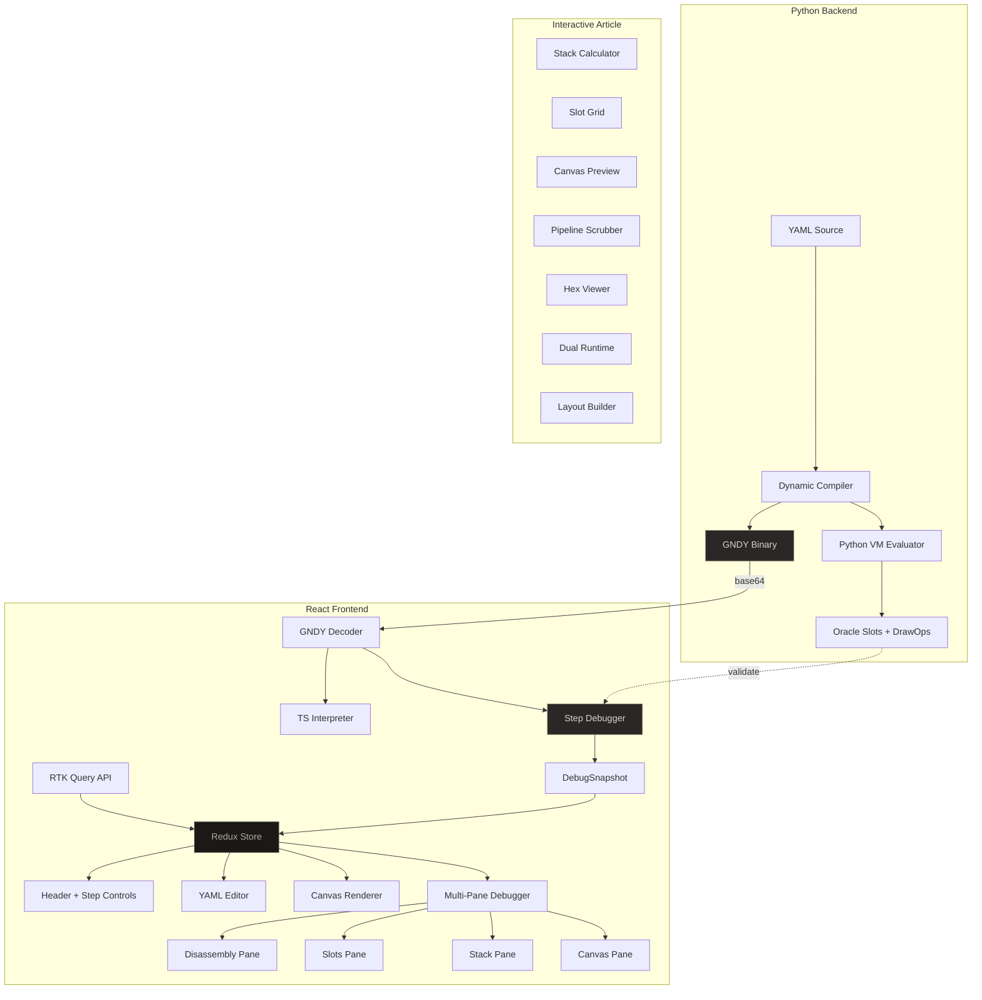

# Gnosis Dynamic VM: Stack Machine Debugger and Interactive Explorer

This project is the second generation of the GNOSIS workbench, building on [[PROJ - Gnosis Compiler - Python Rebuild and Web Experimentation Tool]]. Where the original project built a static compiler with compile-time props and a monolithic HTML frontend, this phase replaces the static pipeline with a **dynamic VM** — a stack-based virtual machine that evaluates compiled layouts at runtime with live data bindings. The static compiler and its 12-opcode ISA are gone. In their place is a new dynamic compiler (Python), a new GNDY bytecode format (17 opcodes, big-endian), a browser-side TypeScript interpreter that mirrors the Python VM instruction-for-instruction, a step debugger with undo history and breakpoints, a multi-pane debugger UI, and seven Bret Victor-style interactive article widgets for teaching the VM.

The React frontend was rebuilt from a single-file `index.html` into a proper Vite + React + Redux Toolkit application with typed slices, RTK Query for the backend API, a panel registry for the tabbed inspector, and a CSS variable theme system using `data-part` selectors.

> [!summary]
> The project has three important identities:
> 1. A **dynamic layout VM** for e-ink displays — compile once, evaluate with different sensor data at runtime
> 2. A **multi-pane step debugger** — see disassembly, slots, stack, and canvas simultaneously while stepping
> 3. An **interactive explorable article** — seven self-contained widgets teaching VM concepts in the Bret Victor tradition

## Why this project exists

The static compiler ([[PROJ - Gnosis Compiler - Python Rebuild and Web Experimentation Tool]]) proved that YAML-to-bytecode compilation works. But it had a fundamental limitation: every piece of runtime data (sensor readings, titles, timestamps) had to be resolved at compile time through the `{{props}}` system. Changing a temperature reading meant recompiling the entire program. On an MCU refreshing an e-ink display every 30 seconds, this means re-running the Python compiler on the host and transmitting a new binary — unacceptable for real sensor dashboards.

The dynamic VM solves this by moving data binding to **evaluation time**. The compiler emits `MEASURE_TEXT_BIND` and `DRAW_TEXT_BIND` instructions that reference runtime values by name. The same compiled bytecode can be evaluated thousands of times with different data, producing different pixel output each time. The compiler runs once (during development or OTA update); the VM runs every refresh cycle.

## Current project status

The repository is in an active implementation phase. The dynamic compiler, VM, debugger, and web workbench are all functional.

What already exists:

- Python dynamic compiler (`gnosis_dynamic_vm/`) with YAML parsing, expression DAG, topological sort, bytecode emission, GNDY binary serialization
- Flask backend (`web_server.py`) with `/api/compile-dynamic`, `/api/presets`, `/api/preset/<name>` endpoints
- TypeScript GNDY decoder (`web/src/engine/gndy/decode.ts`) — parses the binary format and decodes all 17 opcodes
- TypeScript interpreter (`web/src/engine/gndy/interpreter.ts`) — mirrors the Python VM exactly, produces identical slot values and draw ops
- TypeScript step debugger (`web/src/engine/gndy/debugger.ts`) — single-step execution, snapshot capture, bounded undo history (1000 steps), breakpoints, oracle validation
- React workbench with Redux Toolkit — `compilerSlice`, `dynamicSlice`, `inspectorSlice`, `debuggerSlice`, RTK Query `compilerApi`
- Multi-pane debugger layout (`web/src/components/Debugger/`) — CSS grid with canvas, disassembly, slots, stack panes and resizable splitters
- Seven interactive explorer widgets (`web/src/components/Explorer/widgets/`) with Storybook stories
- Storybook coverage for all new components plus backfilled stories for Header, Canvas, Editor, Inspector
- Four preset dashboards: `dynamic_hbox`, `dynamic_nav`, `sensor_dashboard`, `vbox_shrink_wrap`

What is still incomplete:

- Connected highlighting across panes (clicking canvas element → highlight instruction)
- Keyboard shortcuts for stepping (N=step, B=back, R=run)
- Runtime value editor in the workbench UI
- localStorage persistence for pane sizes
- The interactive article as a full scrollable mode within the workbench (widgets exist as Storybook stories but not as an integrated route)

## Architecture



Key code locations:

- `gnosis_dynamic_vm/gnosis_dynamic/compiler.py` — Dynamic compiler (760 lines)
- `gnosis_dynamic_vm/gnosis_dynamic/vm.py` — Python VM evaluator (187 lines)
- `gnosis_dynamic_vm/gnosis_dynamic/bytecode.py` — Binary format and CodeBuilder (231 lines)
- `web_server.py` — Flask backend
- `web/src/engine/gndy/decode.ts` — GNDY binary decoder (346 lines)
- `web/src/engine/gndy/interpreter.ts` — TypeScript VM (253 lines)
- `web/src/engine/gndy/debugger.ts` — Step debugger (399 lines)
- `web/src/store/slices/debuggerSlice.ts` — Redux debugger state
- `web/src/components/Debugger/DebuggerLayout.tsx` — Multi-pane container
- `web/src/components/Explorer/widgets/` — Seven interactive article widgets

## Implementation details

### The stack machine

The GNOSIS Dynamic VM is a stack machine with 17 opcodes. There are no registers — just a stack for temporary arithmetic and a flat slot array for persistent layout state. Six opcodes are arithmetic (`ADD`, `SUB`, `MUL`, `DIV`, `MAX`, `MIN`), two move data between the stack and slots (`PUSH_SLOT`, `STORE_SLOT`), one pushes a constant (`PUSH_CONST`), one measures text from runtime data (`MEASURE_TEXT_BIND`), six draw to the screen (`DRAW_TEXT_CONST`, `DRAW_TEXT_BIND`, `DRAW_BAR_CONST`, `DRAW_BAR_BIND`, `DRAW_HLINE`, `DRAW_VLINE`), and one halts (`HALT`).

All arithmetic is unsigned 16-bit integer. Division truncates toward zero. Division by zero returns zero. No floating-point, no negative numbers, no overflow traps. This matches the target hardware: e-ink display modules with no FPU.

Computing `(42 + 10) * 3` and storing the result:

```
PUSH_CONST  42      stack: [42]
PUSH_CONST  10      stack: [42, 10]
ADD                  stack: [52]
PUSH_CONST  3       stack: [52, 3]
MUL                  stack: [156]
STORE_SLOT  n0.x    stack: []   slots: {n0.x = 156}
```

> **[WIDGET: StackCalculator]**
> An interactive stack machine. Six instructions with editable numeric constants. Press STEP to advance one instruction — the stack animates, the explanation column narrates. Edit `42` to `100` and the final result updates instantly. Press RUN ALL to execute everything.
> *Storybook: `Explorer/1 — The Stack Machine/Article`*

### The slot model

Every layout node has six slots: `mw` (measured width), `mh` (measured height), `x`, `y`, `w` (final width), `h` (final height). Addressing is flat: `node_index × 6 + field_offset`. A 16-node screen has 96 slots — 192 bytes of layout state.

The distinction between **measured** and **final** dimensions is key. `mw`/`mh` are intrinsic (content-derived). `w`/`h` are what the layout algorithm assigns after distributing space in hbox/vbox containers. The compiler's expression system generates arithmetic to compute final values from measured values, emitted as `PUSH_SLOT`/arithmetic/`STORE_SLOT` sequences.

The VM has no concept of a tree. The tree was consumed by the compiler to generate the flat instruction sequence. By the time the bytecode runs, it operates on a flat slot array. This makes the VM trivially portable to microcontrollers and FPGAs.

> **[WIDGET: SlotGrid]**
> A single node's slot grid showing all six fields. Edit the title text and font size — watch MEASURE_TEXT_BIND write to `mw` and `mh`, then PUSH_SLOT and STORE_SLOT copy the measured width to the final `w` slot. The formula bar shows: `mw = len("LAB-01") × 8 × 2 = 96`.
> *Storybook: `Explorer/2 — Slots and the Node Grid/Article`*

### From slots to pixels

Draw instructions read slot values (`x`, `y`, `w`, `h`) and emit **draw operations** — structured commands like "draw text 'TEMP:' at (8, 33) with width 40." The VM produces a list of draw ops; a separate renderer turns them into pixels. This indirection supports multiple targets: browser `<canvas>`, e-ink framebuffer, PNG, terminal.

The five-color palette (`bg=#d8d4cc`, `fg=#2a2826`, `mid=#7a7668`, `light=#b0aa9e`, `ghost=#e0dcd4`) maps to e-ink grayscale levels. Color indices are stored as single bytes in instructions.

Text rendering uses an 8×8 bitmap font with integer size multipliers. The measured width formula is `len(text) × 8 × size`. No font files, no rasterizer, no anti-aliasing — deterministic and identical across all targets.

Bar fill width is `trunc(w × value / max)` — linear interpolation clamped to the bar's width. Track and fill colors are baked into the instruction.

> **[WIDGET: CanvasPreview]**
> A live 280×120 canvas with draggable x/y/w/h sliders. The text renders with a dashed bounding box. Change text, font size, or color and see the bounding box resize. The formula bar shows the glyph calculation.
> *Storybook: `Explorer/3 — From Slots to Pixels/Article`*

### The three-phase execution model

The compiler emits instructions in three phases (a convention, not enforced by the VM):

1. **MEASURE** — `MEASURE_TEXT_BIND` reads runtime data, computes intrinsic dimensions, writes `mw`/`mh` slots
2. **COMPUTE** — Stack arithmetic computes final `x`/`y`/`w`/`h` from measured values
3. **RENDER** — `DRAW_*` instructions read computed slots and emit draw operations

This separation has practical consequences: if runtime data changes but layout structure doesn't, only MEASURE and RENDER produce different results. The COMPUTE phase is deterministic given the same measured values.

> **[WIDGET: Pipeline]**
> Phase timeline with clickable MEASURE, COMPUTE, RENDER, DONE buttons. Each phase shows its instructions, slot changes, and canvas state. An editable temperature slider shows how runtime data only affects RENDER output.
> *Storybook: `Explorer/4 — The Full Pipeline/Article`*

### The GNDY binary format

The compiled program serializes as a GNDY binary. The format is designed for compactness and zero-allocation decoding:

```
MAGIC "GNDY" (4B) → VERSION (1B) → HEADER (12B: counts + code_len)
→ BIND TABLE (length-prefixed UTF-8 strings)
→ STRING POOL (length-prefixed UTF-8 strings)
→ SLOT INIT (U16 values per slot)
→ CODE (flat bytecode)
```

All multi-byte values are big-endian. The typical sensor dashboard compiles to ~326 bytes total (84B code + 50B header/tables + 192B slot init). This fits in a single 512-byte flash sector.

Each opcode has a fixed size (1–9 bytes), so the decoder can step through without ambiguity. The instruction set table:

| Opcode | Hex | Size | Operands |
|--------|-----|------|----------|
| MEASURE_TEXT_BIND | 0x01 | 6 | node(2), bind(2), fontSize(1) |
| PUSH_CONST | 0x02 | 3 | value(2) |
| PUSH_SLOT | 0x03 | 3 | slot(2) |
| ADD–MIN | 0x04–0x09 | 1 | — |
| STORE_SLOT | 0x0a | 3 | slot(2) |
| DRAW_TEXT_CONST | 0x0b | 7 | node(2), stringId(2), fontSize(1), color(1) |
| DRAW_TEXT_BIND | 0x0c | 7 | node(2), bind(2), fontSize(1), color(1) |
| DRAW_BAR_BIND | 0x0d | 9 | node(2), bind(2), maxValue(2), track(1), fill(1) |
| DRAW_BAR_CONST | 0x0e | 9 | node(2), value(2), maxValue(2), track(1), fill(1) |
| DRAW_HLINE | 0x0f | 4 | node(2), color(1) |
| DRAW_VLINE | 0x10 | 4 | node(2), color(1) |
| HALT | 0xff | 1 | — |

> **[WIDGET: HexViewer]**
> Interactive hex dump of a sample GNDY file. Hover any byte for a tooltip. Click to pin annotations. Region legend highlights MAGIC, HEADER, BIND TABLE, STRING POOL, SLOT INIT, CODE sections.
> *Storybook: `Explorer/5 — The Binary Format/Article`*

### Runtime binding — the dynamic part

The bytecode is a **template**. It encodes layout structure but injects data at evaluation time through bind paths — dot-notation references into a nested runtime object (`"sensor.temp"` → `22`). `MEASURE_TEXT_BIND` reads a text bind to compute dimensions. `DRAW_TEXT_BIND` reads it again to render. `DRAW_BAR_BIND` reads a numeric bind to compute fill ratio.

This means: compile once, evaluate thousands of times. The MCU stores bytecode in flash (stable) and runtime data in RAM (updated from sensors). Each refresh: read sensors → evaluate bytecode (50–200μs) → convert draw ops → push to e-ink controller. No parsing, no tree traversal, no GC.

> **[WIDGET: DualRuntime]**
> Two runtime panels side by side, same bytecode. Left: "LAB-01", temp 22, humidity 45. Right: "REACTOR-7", temp 95, humidity 88. Drag sliders, watch only that canvas update. Click "show diff" to see slot differences. SWAP exchanges datasets.
> *Storybook: `Explorer/6 — Runtime Binding/Article`*

### The compiler pipeline

The Python compiler transforms YAML layout descriptions into GNDY bytecode through six phases:


The expression system uses a DAG of `Const`, `SlotRef`, and `BinOp` nodes. Constant folding simplifies `Const(8) + Const(4)` → `Const(12)`. Constants are stored as slot initializers rather than emitted as instructions. The topological sort determines evaluation order so dependent slots are computed after their dependencies.

### The step debugger

The `GNDYDebugger` class wraps the interpreter with:

- **Snapshots**: complete VM state at each step (pc, instrIndex, phase, stack, slots, drawOps, changedSlots)
- **History**: bounded array of pre-step snapshots (max 1000) for undo
- **Breakpoints**: `Set<number>` of PC offsets; `run()` and `runToBreakpoint()` stop at breakpoints
- **Oracle validation**: run to completion, compare final slots and draw op count against Python backend — mismatch count of 0 means perfect parity

The debugger instance lives as a **module-level singleton** (not in React state or refs) because inspector panels unmount on tab switch. The multi-pane debugger may allow moving it into a React context since all panes are mounted simultaneously.

### The multi-pane debugger UI

When the debugger loads, `App.tsx` switches from the normal `Canvas + TabBar + Inspector` layout to a `DebuggerLayout` CSS grid:

- **Canvas pane** (top ~40%) — live e-ink rendering with draw_ops status bar
- **Disassembly pane** (bottom-left) — breakpoint markers, current PC highlight, auto-scroll, phase/step status
- **Slots pane** (top-right) — node grid with change highlighting and hide-zero-nodes toggle
- **Stack pane** (bottom-right) — top-of-stack first display with context hints ("after STORE_SLOT")

Three `Splitter` components allow resizing. Layout percentages persist in Redux (`debuggerSlice.layout`). Step controls (STEP, BACK, RUN, RUN▶BP, RESET, VALIDATE, CLOSE) live in the Header, always visible.

### The interactive explorer widgets

Seven self-contained React components, each with its own mini-interpreter (no Redux, no backend). Built as Storybook stories with article prose wrapping the widget:

| # | Widget | Teaches | Storybook path |
|---|--------|---------|----------------|
| 1 | StackCalculator | Push/pop, arithmetic, STORE_SLOT | `Explorer/1 — The Stack Machine` |
| 2 | SlotGrid | 6 slots per node, MEASURE→STORE flow | `Explorer/2 — Slots and the Node Grid` |
| 3 | CanvasPreview | DRAW instructions, slot→pixel mapping | `Explorer/3 — From Slots to Pixels` |
| 4 | Pipeline | MEASURE→COMPUTE→RENDER phases | `Explorer/4 — The Full Pipeline` |
| 5 | HexViewer | GNDY binary format, byte-level structure | `Explorer/5 — The Binary Format` |
| 6 | DualRuntime | Same bytecode, different runtime data | `Explorer/6 — Runtime Binding` |
| 7 | LayoutBuilder | Visual element→YAML→bytecode pipeline | `Explorer/7 — Building a Layout` |

> **[WIDGET: LayoutBuilder]**
> Click palette buttons to add Label, Bar, or HLine elements. Select and edit properties. The YAML and bytecode listing update live. Each element maps to exactly one DRAW instruction.
> *Storybook: `Explorer/7 — Building a Layout/Article`*

### The hardware target

Every design decision traces back to constraints of the target hardware: e-ink display modules with limited compute.

- **No floating-point** → All arithmetic is 16-bit unsigned integer
- **No dynamic memory** → Fixed-size slot array, bounded stack, bounded draw op list
- **No tree traversal** → Flat instruction sequence, switch-case inner loop
- **Deterministic execution** → Same inputs always produce same outputs, testable via oracle
- **Compact encoding** → Complete dashboard in 300–500 bytes, fits one BLE MTU or flash sector

The tradeoff is expressiveness: no conditionals, no loops, no function calls. The instruction set covers exactly the operations needed for layout computation and rendering. If you need conditional layouts, compile two programs and select between them on the host.

## How to run

```bash
cd /home/manuel/code/wesen/2026-03-22--gnosis-compiler

# Backend
python web_server.py --port 8085

# Dev server (hot reload)
cd web && npx vite --port 3000

# Production build
cd web && npx vite build

# Storybook (all widgets + debugger panes)
cd web && npx storybook dev

# TypeScript check
cd web && npx tsc --noEmit
```

Test flow: open http://localhost:8085 → select "sensor_dashboard" → COMPILE → click DEBUGGER tab → LOAD → STEP through → VALIDATE → should show ORACLE: PASS.

## Important project docs

- `ttmp/2026/03/27/GNOSIS-005--react-dynamic-vm-debugger-implementation-guide/design-doc/01-react-dynamic-vm-debugger-analysis-design-and-implementation-guide.md` — Full system architecture analysis
- `ttmp/2026/03/27/GNOSIS-005--react-dynamic-vm-debugger-implementation-guide/design-doc/02-multi-pane-debugger-and-interactive-vm-explorer-design.md` — Multi-pane debugger design with ASCII layouts and 7 interactive article screen specs
- `ttmp/2026/03/27/GNOSIS-005--react-dynamic-vm-debugger-implementation-guide/reference/01-investigation-diary.md` — Chronological development diary (5 steps)
- `ttmp/2026/03/27/GNOSIS-005--react-dynamic-vm-debugger-implementation-guide/reference/03-handoff-multi-pane-debugger-implementation-instructions.md` — Handoff guide for new implementers
- `ttmp/2026/03/28/inside-the-gnosis-dynamic-vm.md` — Long-form technical article (5,200 words) with widget placement markers

## Open questions

- Should the interactive article be a route within the workbench (`/explorer`) or a separate Storybook-only artifact?
- Should the module-level debugger singleton move to a React context now that multi-pane keeps all panes mounted?
- How should conditional compilation work — multiple bytecode variants selected by runtime predicates, or a branch opcode?
- Should the Verilog FPGA experiment (documented in `reference/04-experiment-verilog-gnosis-vm-for-vector-graphics-control.md`) use the GNDY format or a hardware-optimized variant?

## Near-term next steps

- Wire up connected highlighting: click canvas element → highlight instruction in disassembly → highlight slots
- Add keyboard shortcuts for debugging (N=step, B=back, R=run, space=step, Esc=close)
- Persist pane sizes to localStorage
- Add runtime value editor to the workbench (editable JSON panel for runtime data)
- Explore integrating the explorer article as a scrollable mode within the workbench

## Project working rule

> [!important]
> The Python VM is the oracle. The TypeScript interpreter must produce identical slot values and draw operations for every input. Any divergence is a bug in the browser code, not a feature. Run VALIDATE on every preset before shipping.
