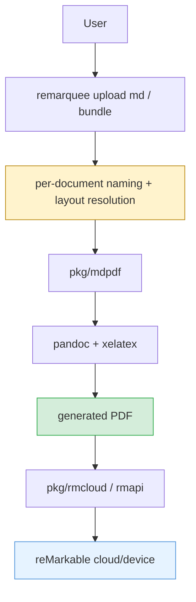

# Remarquee - Markdown Upload Polish

This note captures a focused March 28 iteration on Remarquee's markdown upload path. The work was not a broad architecture rewrite. It was a careful refinement of the user-facing upload workflow: first adding an editor-friendly layout preset for markdown uploads, then adding a custom naming override for single-file `upload md` runs.

> [!summary]
> 1. `remarquee upload md` and `remarquee upload bundle` now support an annotation-friendly `--layout editor` preset for wider margins and looser spacing.
> 2. `remarquee upload md` now supports `--name` when exactly one markdown file is selected, so a user can choose the output document name without renaming the source file.
> 3. The work was executed through two ticketed slices, `RMQ-0014` and `RMQ-0015`, with explicit task lists, commit boundaries, and implementation diaries.

## Why this project exists

[[PROJ - Remarquee - reMarkable Toolkit]] already described the broader project: a Go CLI that unifies reMarkable cloud access, document rendering, markdown upload, and related tooling. This note is narrower. It exists because the markdown upload path had become useful enough that small UX mismatches started to matter:

- uploaded prose was readable but not ideal for on-device editorial markup
- choosing a remote document name still required renaming the local markdown file
- the upload workflow was good enough to deserve product-level flags instead of relying on low-level escape hatches

This is the stage where a CLI stops being merely functional and starts accumulating user-shaped affordances.

## Current project status

What exists now in this branch/worktree:

- a named `--layout editor` preset for markdown upload and markdown bundle upload
- a custom `--name` flag for `remarquee upload md` in the single-document case
- embedded help/reference docs updated for both features
- detailed ticket docs for both changes under `ttmp/2026/03/28/`
- clean focused validation for the upload-related packages

What is still rough:

- the repository pre-commit hook still assumes missing frontend artifacts and old rmdoc fixture paths are present, so whole-repo `test`/`lint` is not a reliable gate for narrow upload work in this checkout
- the current UI/web side of the repo still appears unfinished compared to the CLI/library path
- the upload surface is becoming richer, but planning/output naming logic is still spread through the command implementation rather than being modeled as an explicit plan struct

## Project shape

This slice of Remarquee has four important layers:

1. user-facing upload commands
   - `remarquee upload md`
   - `remarquee upload bundle`
2. markdown-to-PDF rendering
   - `pkg/mdpdf`
   - pandoc + xelatex
3. cloud upload path
   - `pkg/rmcloud`
   - rmapi-backed remote directory and document operations
4. ticketed engineering documentation
   - `ttmp/2026/03/28/RMQ-0014--add-editor-friendly-markdown-upload-layout/`
   - `ttmp/2026/03/28/RMQ-0015--add-custom-name-flag-to-upload-md/`

The notable thing about this work is that the code and the docs evolved together. The tickets are not after-the-fact summaries; they are part of the actual implementation workflow.

## Architecture



Key code locations for this work:

- `cmd/remarquee/cmds/upload/md.go`
- `cmd/remarquee/cmds/upload/bundle.go`
- `cmd/remarquee/cmds/upload/layout.go`
- `pkg/mdpdf/layout.go`
- `pkg/mdpdf/pandoc.go`
- `pkg/doc/upload/02-remarquee-upload-reference.md`
- `pkg/doc/upload/03-remarquee-upload-bundle.md`

## Implementation details

The March 28 work touched two related but distinct parts of the markdown upload flow:

1. layout policy for prose PDFs
2. naming policy for single-document markdown uploads

### 1. Editor-friendly layout preset

Before this change, markdown upload already had raw typography controls such as `--geometry` and `--latex-header-file`, but it had no product-level way to say "render this like an editable review document." The actual user problem was not "let me write TeX." It was "leave enough margin room that I can revise and comment on this on the tablet."

The implementation solved that by adding a named layout catalog in `pkg/mdpdf/layout.go` and supporting an extra layered LaTeX header in `pkg/mdpdf/pandoc.go`.

The mental model is:

```text
default pandoc options
  -> apply named layout preset
  -> reapply explicit overrides only if the user actually changed those flags
  -> render markdown to PDF
```

That precedence rule matters. If the preset were applied too late, explicit flags would be ignored. If it were applied too early but then the command copied Cobra defaults back over it unconditionally, the preset would never take effect.

The final `editor` layout does two things:

- widens the usable margin area, especially on the right side
- loosens prose spacing so markup and comments do not feel crowded

### 2. Single-document custom naming for `upload md`

The second improvement is smaller but very practical. `upload md` used to derive every output name from the source markdown basename. That was internally consistent and externally annoying. If the file on disk was `note.md`, the output wanted to be `note.pdf` unless the user renamed the file first.

The fix was intentionally narrow:

- add `--name`
- allow it only when exactly one markdown file is selected after directory expansion
- normalize the value to a PDF name (`foo` -> `foo.pdf`)
- use that resolved name everywhere

The reason for the single-file restriction is that the obvious alternatives are all bad:

- apply the same name to every generated file
- apply the name only to the first file
- invent templating behavior the command does not otherwise have

This is the actual algorithm shape:

```text
collect markdown inputs
if override name is set and total inputs != 1:
  error

resolvedName = overrideName or basename(input)+".pdf"

use resolvedName for:
  collision detection
  dry-run output
  pdf-only output path
  upload temp path -> remote document name
```

### 3. Why this work matters more than it looks

Neither feature is huge in line count, but both sharpen the command surface in the same direction: the upload path is turning into a tool people are expected to use deliberately rather than a wrapper that assumes they will adapt to its internal defaults.

That is the useful mental shift:

- `--layout editor` says the CLI now recognizes a review-oriented prose workflow
- `--name` says the CLI now recognizes that the local filename and the uploaded document identity are not always the same thing

### 4. Failure modes and current repo constraints

The most important non-obvious implementation detail is not in the feature logic itself. It is in the repo environment.

The local pre-commit hook runs whole-repo `test` and `lint`. In this checkout, those fail for reasons unrelated to the upload changes:

- `cmd/remarquee-ui/embed.go` expects `frontend/dist`
- multiple `rmdoc` tests expect fixture files from older workspace paths or sibling repos

That means focused upload work must currently be validated with package-level tests:

```bash
go test ./pkg/mdpdf ./cmd/remarquee/cmds/upload
```

and then committed with a conscious understanding that the repo-wide hook is not yet trustworthy for this slice.

## Current user-facing commands

The commands most directly affected by this work are:

```bash
go run ./cmd/remarquee upload md --dry-run --pdf-only --layout editor /abs/path/to/doc.md
go run ./cmd/remarquee upload bundle --dry-run --layout editor /abs/path/to/dir
go run ./cmd/remarquee upload md --dry-run --pdf-only --name "editor-copy" /abs/path/to/doc.md
```

The current naming rule for `upload md --name` is:

- valid for exactly one selected markdown file
- invalid for multi-file or expanded-directory multi-file selections

## Important project docs

Main repo path:

- `/home/manuel/workspaces/2026-03-28/remarquee-draft-layout/remarquee`

Relevant ticket docs from this work:

- `/home/manuel/workspaces/2026-03-28/remarquee-draft-layout/remarquee/ttmp/2026/03/28/RMQ-0014--add-editor-friendly-markdown-upload-layout/`
- `/home/manuel/workspaces/2026-03-28/remarquee-draft-layout/remarquee/ttmp/2026/03/28/RMQ-0015--add-custom-name-flag-to-upload-md/`

Key commits from this iteration:

- `14858d3` `upload: add editor layout preset for markdown PDFs`
- `6c83347` `docs: record RMQ-0014 editor layout work`
- `63dedc6` `upload: add custom name override for upload md`
- `69c692c` `docs: record RMQ-0015 upload md naming work`

## Open questions

- Should `upload md` eventually support naming templates for multi-file directory uploads, or is the single-file rule enough?
- Should `upload src` gain a similar `--name` override for its single-file mode?
- Should the upload commands move toward an explicit "document plan" layer that resolves names, destinations, and output paths before any rendering starts?
- When should the repo-wide hook be fixed so that focused CLI work can use normal commit verification again?

## Near-term next steps

- test the `editor` layout on longer real markdown documents on-device and tune margins if needed
- decide whether the current upload command surface needs one more round of naming/output cleanup
- fix or isolate the whole-repo hook failures so feature work in `cmds/upload` no longer requires `--no-verify`

## Project working rule

> [!important]
> When refining Remarquee's upload workflow, keep the semantics narrow and explicit.
> Prefer one clear rule with focused validation over a flexible flag that silently invents behavior for multi-file edge cases.
