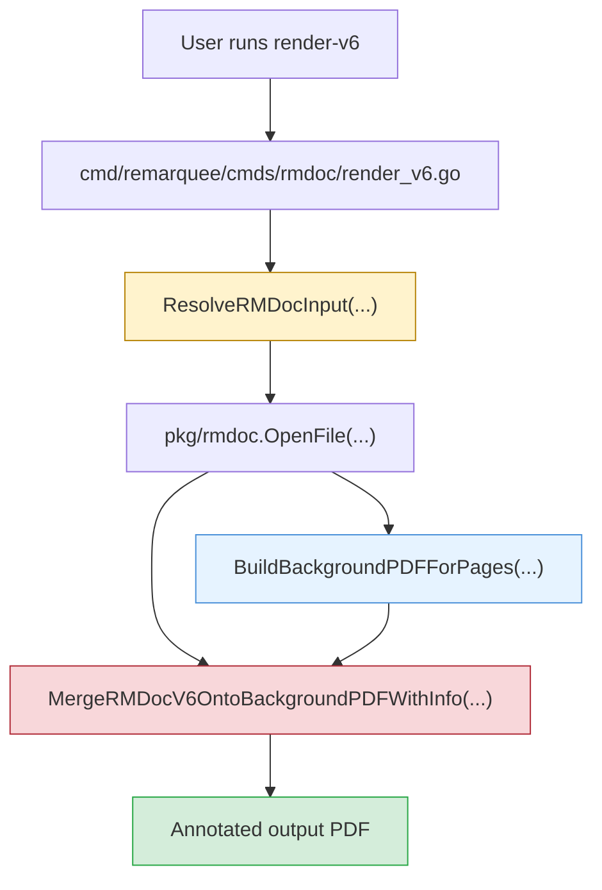

# Remarquee - V6 Render Overlay Y-Placement Bug

This note captures a focused debugging and documentation pass for a rendering regression in Remarquee's V6 PDF-backed annotation pipeline. The immediate user-visible issue was simple to describe but subtle to diagnose: handwritten notes that should have been attached to text near the top of a page were rendering much lower, especially on later pages of a PDF-backed document. The work ended with both a code fix and a detailed ticket document intended for future onboarding and debugging.

> [!summary]
> 1. The bug was not in `--cloud`; it was in the V6 PDF merge math after the archive was already local.
> 2. The renderer had copied `remarks`' top-origin vertical placement logic into a bottom-origin PDF content-stream implementation without converting coordinate systems.
> 3. The final fix was a narrow Y-coordinate conversion in `pkg/rmdoc/render/v6_merge_background.go`, backed by tests, rerenders, and ticket documentation in `RMQ-0016`.

## Why this report exists

[[PROJ - Remarquee - reMarkable Toolkit]] already describes the broader project: a Go CLI for reMarkable upload, cloud sync, annotation rendering, OCR, and related workflows. This note is narrower. It exists because the rendering bug is exactly the sort of issue that becomes difficult to understand a week later if all that survives is the commit message.

The bug matters for three reasons:

- it affected a user-facing workflow that had just become more convenient via `--cloud`
- it sat in a part of the codebase where several coordinate systems meet
- the failure looked plausible enough that someone unfamiliar with graphics math could waste time debugging the wrong layer

This note is therefore both a project report and a debugging guide. It is meant to preserve the mental model of the renderer, not just the fact that "a Y bug happened."

## Current project status

What exists now in this branch/worktree:

- `remarquee rmdoc render-v6` supports local input and direct cloud-backed input via `--cloud`
- the V6 merge path now correctly places overlays on PDF-backed pages after commit `24eeb98`
- RMQ-0016 now contains both the original cloud-render design docs and a follow-up bug report/fix guide
- the specific user repro using `/Articles/claude-code-v3.md` was reproduced, diagnosed, fixed, and rerendered successfully

What is still rough:

- the repo-wide pre-commit hook still fails because `cmd/remarquee-ui/frontend/dist` is not present, so narrow renderer work still requires targeted validation and occasional `--no-verify` commits
- the V6 renderer has more coordinate and transform logic than its current tests fully explain
- the cloud folder used for ticket bundle uploads now appears to contain two entries with the same visible bundle name, which is unrelated to the renderer bug but worth cleaning up separately

## Project shape

This debugging slice of Remarquee has five important layers:

1. user-facing command layer
   - `remarquee rmdoc render-v6`
2. input normalization
   - local file paths or cloud download to a local temp `.rmdoc`
3. archive parsing
   - `.content`, `.pagedata`, payload `.pdf`, and page-level `.rm` files
4. background assembly
   - construct the UI-ordered PDF pages that serve as the visual base
5. V6 overlay merge
   - extract strokes/highlights and place them into the merged PDF page coordinate system

The important debugging lesson is that a user can report the bug through the command layer, but the real problem can live much deeper in the pipeline.

## Architecture



Key code locations:

- `cmd/remarquee/cmds/rmdoc/render_v6.go`
- `cmd/remarquee/cmds/rmdoc/input_resolver.go`
- `pkg/rmdoc/open.go`
- `pkg/rmdoc/render/background.go`
- `pkg/rmdoc/render/v6_merge_background.go`
- `pkg/rmdoc/render/v6_merge_background_test.go`

## Implementation details

### 1. How V6 rendering works at a high level

The V6 render command does not draw directly from the cloud. It first resolves the user's input into a local archive path. That can be either:

- a path the user already had on disk, or
- a temporary local `.rmdoc` downloaded from the reMarkable cloud

Once that local path exists, the renderer behaves the same way in both cases. This was the first important debugging boundary because it let the investigation prove that the bug was not in the `--cloud` download step.

The archive-opening layer in `pkg/rmdoc/open.go` reads the zip structure and turns it into a `Document` object with:

- the parsed `.content` page plan
- optional `.pagedata`
- optional payload `.pdf`
- page IDs that map to `.rm` annotation files

For PDF-backed documents, the next stage creates a background PDF in UI page order by copying or duplicating pages out of the payload PDF. That stage lives in `pkg/rmdoc/render/background.go`. The resulting background PDF is visually correct even when the overlay later turns out to be misaligned.

The final stage is the V6 merge algorithm in `pkg/rmdoc/render/v6_merge_background.go`. It walks page by page, extracts strokes and smart highlights from the page's `.rm` file, computes a bounding box for the annotation content, decides how the background and overlay should sit in a merged page canvas, and then emits the final PDF page.

The mental model is:

```text
input path
  -> local .rmdoc
  -> parsed Document
  -> background PDF
  -> per-page V6 overlay
  -> merged annotated PDF
```

### 2. Why this bug only showed up in the PDF-backed case

Notebook-style pages and PDF-backed pages do not behave the same way.

For notebook-style pages:

- there is no payload PDF
- the renderer is effectively producing an overlay-only page
- the canvas is already close to the reMarkable screen model

For PDF-backed pages:

- the background page may be letter-sized or otherwise larger than the overlay's natural reMarkable-screen-derived bounding box
- the merge code must decide where the background sits inside the merged page canvas
- and where the overlay sits inside that same canvas

That is the exact point where a coordinate-origin mismatch becomes dangerous.

### 3. The coordinate-system problem

The core bug was not "the numbers were random." The numbers were internally consistent inside the wrong coordinate model.

There are three coordinate ideas that matter:

1. **reMarkable screen space**
   - used by the scene data
   - Y increases downward
2. **`remarks` / MuPDF placement space**
   - the Python algorithm thinks in a top-origin page layout style
   - `topY = 0` means "touch the top of the page"
3. **raw PDF content stream space**
   - Y increases upward from the bottom
   - `pdfY = 0` means "touch the bottom of the page"

ASCII sketch:

```text
Top-origin page layout                Bottom-origin PDF placement

top of page                           top of page
Y = 0                                 Y = pageHeight
|                                     ^
|                                     |
v                                     |
lower on page                         |
                                      |
                                      |
bottom of page                        bottom of page
                                      Y = 0
```

The renderer had carried over the semantic idea of:

- "place the overlay `topY` units below the top"

but then directly used that value as a raw PDF Y placement. That is wrong because those two coordinate systems are mirror images vertically.

### 4. The exact algorithmic mistake

The broken logic lived in the PDF-backed branch of `MergeRMDocV6OntoBackgroundPDFWithInfo(...)`.

Conceptually, the old code did something like this:

```text
if overlay is shorter than background:
    ySvg = yShift

if background is shorter than overlay:
    yBg = -yShift
```

That is a reasonable expression if `ySvg` and `yBg` are interpreted as **top-origin layout positions**.

It is not correct if the later rendering machinery interprets them as **bottom-origin PDF coordinates**.

The correct conversion is:

```text
pdfBottomY = pageHeight - topY - objectHeight
```

This is why the patch added:

```go
func remarksTopYToPDFBottomY(pageHeight, topY, objectHeight float64) float64 {
    return pageHeight - topY - objectHeight
}
```

and then used that helper before calling `buildMergedPage(...)`.

### 5. Why the visual shift was so obvious on letter pages

The issue becomes easy to understand numerically once you look at the heights.

For the reported document:

- the PDF background page height was `792 pt`
- the reMarkable-screen-derived overlay height was about `596 pt`

If the code says "put the overlay at Y = 0" in top-origin thinking, that means "flush with the top." But if the PDF renderer reads `Y = 0` as a bottom-origin coordinate, the overlay lands at the bottom instead.

The correct bottom-origin value should be:

```text
792 - 0 - 596 = 196
```

That missing `196 pt` vertical conversion is almost exactly the visible drift the user reported: notes that belonged near the top of the page slid downward into the middle.

### 6. Reproduction and diagnosis flow

The useful debugging sequence was:

1. reproduce the bad render
2. inspect the produced PDF visually
3. download the underlying `.rmdoc`
4. rerender from the local `.rmdoc`
5. confirm the bug is still present
6. inspect the `.rm` page data separately
7. compare the renderer's merge assumptions against the original `remarks` semantics

That process eliminated several false leads:

- cloud auth problems
- bad temporary file cleanup
- corrupted archive download
- missing annotation files
- wrong page order in `.content`

The eventual diagnosis was not "the parser is broken." It was "the merge algorithm copied a top-origin placement idea into a bottom-origin implementation."

### 7. Pseudocode for the corrected merge logic

```text
for each page:
    bgPage = backgroundPdf[page]
    overlay = parse rm scene

    bbox = compute overlay bbox
    wSvg, hSvg = overlay dimensions
    wBg, hBg = background dimensions

    width = max(wSvg, wBg)
    height = max(hSvg, hBg)

    compute x placement in shared canvas

    compute top-origin y intent:
        ySvgTop = ...
        yBgTop = ...

    convert to PDF bottom-origin:
        ySvg = height - ySvgTop - hSvg
        yBg  = height - yBgTop  - hBg

    build merged page from:
        background at (xBg, yBg)
        overlay at (xSvg, ySvg)
```

### 8. Why the bug guide in the ticket matters

The repo ticket now contains a detailed analysis document at:

- `/home/manuel/workspaces/2026-03-28/remarquee-render-cloud/remarquee/ttmp/2026/03/28/RMQ-0016--add-cloud-flag-to-rmdoc-render-commands/analysis/02-v6-overlay-y-placement-bug-report-and-fix-guide.md`

That doc is useful because it is much more detailed than this vault note. It is the right place for:

- file-by-file code references
- precise line anchors
- command transcripts
- reproduction details
- ticket history

This Obsidian note is the durable project-level summary. The ticket doc is the engineer-facing deep dive.

## User-facing commands involved

The commands that matter for this debugging slice are:

```bash
go run ./cmd/remarquee rmdoc render-v6 --cloud "/Articles/claude-code-v3.md"
remarquee cloud get "/Articles/claude-code-v3.md" --out-dir /tmp/claude-code-v3-cloud --non-interactive
go run ./cmd/remarquee rmdoc render-v6 /tmp/claude-code-v3-cloud/claude-code-v3.md.rmdoc --out /tmp/claude-code-v3-fixed.pdf --force
go test ./pkg/rmdoc/render ./cmd/remarquee/cmds/rmdoc
```

The important lesson is that the cloud command is part of the reproduction story, but not part of the root cause.

## Important project docs

Broader project note:

- `[[PROJ - Remarquee - reMarkable Toolkit]]`

Related follow-up note:

- `[[PROJ - Remarquee - Markdown Upload Polish]]`

Main repo path:

- `/home/manuel/workspaces/2026-03-28/remarquee-render-cloud/remarquee`

Most relevant ticket docs:

- `/home/manuel/workspaces/2026-03-28/remarquee-render-cloud/remarquee/ttmp/2026/03/28/RMQ-0016--add-cloud-flag-to-rmdoc-render-commands/index.md`
- `/home/manuel/workspaces/2026-03-28/remarquee-render-cloud/remarquee/ttmp/2026/03/28/RMQ-0016--add-cloud-flag-to-rmdoc-render-commands/design-doc/01-design-and-implementation-guide-for-cloud-backed-rmdoc-rendering.md`
- `/home/manuel/workspaces/2026-03-28/remarquee-render-cloud/remarquee/ttmp/2026/03/28/RMQ-0016--add-cloud-flag-to-rmdoc-render-commands/analysis/02-v6-overlay-y-placement-bug-report-and-fix-guide.md`

Main code locations for this bug:

- `/home/manuel/workspaces/2026-03-28/remarquee-render-cloud/remarquee/cmd/remarquee/cmds/rmdoc/render_v6.go`
- `/home/manuel/workspaces/2026-03-28/remarquee-render-cloud/remarquee/pkg/rmdoc/open.go`
- `/home/manuel/workspaces/2026-03-28/remarquee-render-cloud/remarquee/pkg/rmdoc/render/background.go`
- `/home/manuel/workspaces/2026-03-28/remarquee-render-cloud/remarquee/pkg/rmdoc/render/v6_merge_background.go`
- `/home/manuel/workspaces/2026-03-28/remarquee-render-cloud/remarquee/pkg/rmdoc/render/v6_merge_background_test.go`

## Open questions

- Are there other places in the V6 renderer where `remarks`-style formulas were carried over semantically but still need explicit coordinate conversion?
- Do we want a more integrated visual regression test for PDF-backed V6 pages, instead of relying mainly on a helper-level regression test plus manual rerender checks?
- Should the project grow a small internal renderer-debug playbook for "compare top-origin layout assumptions vs bottom-origin PDF output" since this class of bug is likely to recur?
- Why does the ticket upload folder currently show two visible entries with the same bundle name after refresh uploads, and should that be cleaned up in the cloud tooling?

## Near-term next steps

- add at least one more fixture-driven regression around PDF-backed V6 page placement
- audit other merge formulas, especially any branch that translates `remarks` logic more or less directly
- keep the new RMQ-0016 bug guide current if the merge algorithm is refactored again
- eventually fix the repo-wide hook so renderer-focused work does not need `--no-verify` due unrelated UI build artifacts

## Project working rule

> [!important]
> When debugging Remarquee rendering problems, split the pipeline into transport, archive parsing, background construction, and overlay merge before changing code. A user can hit the bug through `--cloud`, but the correct fix may live entirely inside page-space coordinate math.
