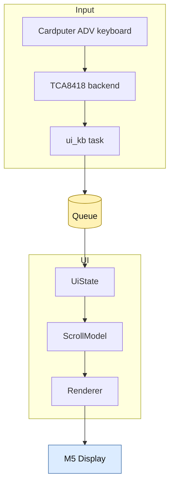
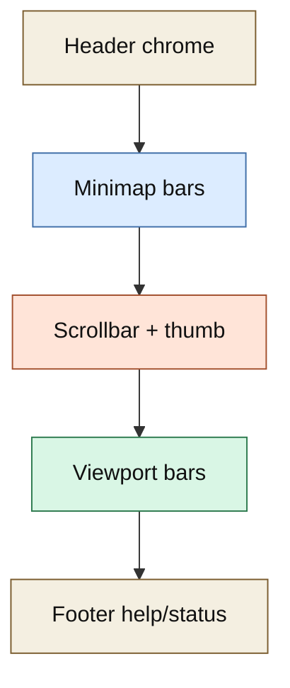

# Cardputer ADV Animation UI

This project is a small experimental firmware for the Cardputer ADV that tries to answer a very specific question: what is the simplest embedded architecture for a keyboard-driven, animated, visually intentional UI on this device? Instead of building a utility app first, the project starts with motion, overview, and input feel. The result is a minimal firmware that renders a full-screen minimap-style interface, animates a virtual scroll position with easing, and uses the Cardputer ADV keyboard to drive that motion.

> [!summary]
> The project currently has three important identities:
> 1. a hardware experiment for Cardputer ADV display and keyboard interaction
> 2. a UI architecture study for animated `M5GFX`-based firmware
> 3. a documented prototype that turns prior repo research into a real runnable firmware

## Why this project exists

Most of the Cardputer work in this repository proves individual ingredients: display bring-up, keyboard scanning, list views, console interfaces, LED simulations, and event-driven rendering. What did not exist yet was a small project whose main purpose is the feel of animated navigation itself.

This project exists to close that gap. The imported donor prototype was a retro Mac-style minimap sketch in HTML, and the experiment here is whether that interaction model can survive a port to a tiny embedded display without dragging along a browser architecture. The answer appears to be yes, as long as the firmware keeps the model small: one canonical scroll state, one target state, one render owner, and one keyboard event queue.

The other reason this project exists is pedagogical. It is meant to be understandable to someone new to the codebase. The firmware is intentionally narrower and easier to reason about than a larger multi-feature app, so it can serve as a reference for future Cardputer ADV UI experiments.

## Current project status

The project is in an active experimental state, but it is no longer just a design note.

What already exists:

- a standalone firmware project at `/home/manuel/workspaces/2025-12-21/echo-base-documentation/esp32-s3-m5/0083-cardputer-adv-animation-ui`
- Cardputer ADV display bring-up through `M5Unified`
- Cardputer ADV keyboard autodetect through `cardputer_kb::UnifiedScanner`
- a queue-driven semantic input layer for left, right, up, down, enter, tab, back, delete, space, and text input
- a scroll model with `pos_px`, `target_px`, easing, snap threshold, and autoplay
- a full-screen `M5Canvas` renderer with title bar, minimap bars, viewport bars, scrollbar thumb, and help overlay
- a working tmux-based flash and monitor workflow on USB Serial/JTAG
- ticket documentation and implementation diary in `ttmp/2026/03/29/ESP-47-CARDPUTER-ADV-ANIMATION-UI--cardputer-adv-modern-dynamic-animation-ui-with-keyboard-controlled-scroll-motion/`

What is still incomplete:

- a richer content model than synthetic bars
- any second-stage polish pass on typography, animation tuning, or visual language
- a reusable widget abstraction for the minimap if this UI idea gets promoted into other firmware
- a broader product goal beyond "prove the embedded interaction works and feels good"

## Project shape

At a high level the project has four layers:

1. **Board and display bring-up**
   - initialize `M5Unified`
   - allocate a full-screen sprite
   - establish one display owner in `app_main.cpp`
2. **Keyboard normalization**
   - scan hardware with `UnifiedScanner`
   - normalize physical keys into semantic events
   - push those events through a queue
3. **Animation model**
   - maintain current and target scroll position
   - apply easing over time
   - derive selection and autoplay state
4. **Visual composition**
   - render header chrome
   - render minimap overview and viewport bars
   - render scrollbar position from the same state
   - render help and status overlays

## Architecture

The firmware is intentionally simple. It does not try to split rendering across multiple tasks, and it does not let the keyboard task mutate display state directly.

```text
Cardputer ADV keyboard
  -> UnifiedScanner backend autodetect
  -> semantic key event queue
  -> UI model update
  -> animation tick
  -> full-screen canvas redraw
  -> pushSprite to M5 display
```

The important code locations are:

- `/home/manuel/workspaces/2025-12-21/echo-base-documentation/esp32-s3-m5/0083-cardputer-adv-animation-ui/main/app_main.cpp`
- `/home/manuel/workspaces/2025-12-21/echo-base-documentation/esp32-s3-m5/0083-cardputer-adv-animation-ui/main/ui_kb.cpp`
- `/home/manuel/workspaces/2025-12-21/echo-base-documentation/esp32-s3-m5/0083-cardputer-adv-animation-ui/main/ui_model.cpp`
- `/home/manuel/workspaces/2025-12-21/echo-base-documentation/esp32-s3-m5/0083-cardputer-adv-animation-ui/main/ui_render.cpp`
- `/home/manuel/workspaces/2025-12-21/echo-base-documentation/esp32-s3-m5/0083-cardputer-adv-animation-ui/build.sh`

The research and rationale live here:

- `/home/manuel/workspaces/2025-12-21/echo-base-documentation/esp32-s3-m5/ttmp/2026/03/29/ESP-47-CARDPUTER-ADV-ANIMATION-UI--cardputer-adv-modern-dynamic-animation-ui-with-keyboard-controlled-scroll-motion/design-doc/01-cardputer-adv-dynamic-animation-ui-analysis-design-and-implementation-guide.md`
- `/home/manuel/workspaces/2025-12-21/echo-base-documentation/esp32-s3-m5/ttmp/2026/03/29/ESP-47-CARDPUTER-ADV-ANIMATION-UI--cardputer-adv-modern-dynamic-animation-ui-with-keyboard-controlled-scroll-motion/reference/01-investigation-diary.md`

## Implementation details

The core design decision is that the project treats scrolling as model state, not as a rendering side effect. That sounds trivial, but it is the difference between a UI that is easy to extend and a UI that becomes a pile of ad hoc offsets. The keyboard code never says "draw the view 20 pixels to the right." It only says "the target scroll position should move." The animation system then eases the current position toward that target. Finally, the renderer derives every visual representation from the current scroll state.

That one idea lets the project stay small. The minimap bars, the large viewport bars, and the scrollbar thumb are all shadows of the same number. If the project later wants to add a numeric ruler, a current-item marker, or velocity-based animation, those can also be derived from the same model rather than invented separately.

### Mental model

Think of the project as a virtual horizontal document made of evenly spaced bars.

- `line_count` decides how many virtual items exist
- `line_step_px` decides how far apart those items are in the world
- `scroll.pos_px` is where the camera currently is
- `scroll.target_px` is where the camera wants to go
- the renderer asks, for each virtual item, where it falls relative to the viewport

The interesting part is that there is no actual document underneath yet. The bars are synthetic. That is intentional. The experiment is about the motion system and UI architecture first. Real content can replace the synthetic bars later without requiring a new input or animation design.

### Data flow

```mermaid
flowchart LR
    A[Physical key press] --> B[UnifiedScanner]
    B --> C[ui_kb semantic event]
    C --> D[FreeRTOS queue]
    D --> E[ui_model_handle_event]
    E --> F[UiState target update]
    F --> G[ui_model_tick easing step]
    G --> H[ui_render_frame]
    H --> I[M5Canvas pushSprite]

    style A fill:#f4efe1,stroke:#7a5c2e,color:#222
    style F fill:#dcecff,stroke:#3f6ea8,color:#111
    style G fill:#d9f6e5,stroke:#2d7a4e,color:#111
    style I fill:#ffe4d8,stroke:#a34f2d,color:#111
```



### Runtime ownership

The project follows a strict ownership model:

- the keyboard task owns scanning and semantic translation
- the queue owns handoff
- the UI loop owns state mutation and all drawing

This rule is more important than any individual visual decision. Cardputer UI projects get much easier to reason about when one task owns `M5GFX`. The existing repository had already shown that pattern in other projects, and this firmware keeps it.



### Input handling

`ui_kb.cpp` is adapted from the more ADV-aware keyboard work elsewhere in the repo. The scanner autodetects whether it is talking to the Cardputer ADV path or the original Cardputer-style matrix path, and it emits semantic edge events rather than raw key states. That choice matters because animations should be triggered by meaningful actions, not by every scan cycle.

In practice the semantic layer means the rest of the app can think in terms like:

- left and right adjust the horizontal target
- up and down make a larger jump
- enter toggles autoplay
- tab toggles help
- delete or `r` resets
- `1`, `2`, `3` tune the easing

The app loop logs those semantic events to serial now, which makes physical-device validation much easier. That logging was added after the first successful hardware flash, because once the UI was visibly running the remaining uncertainty was input observability, not board bring-up.

### Animation model

The animation system is intentionally small. It is not a physics simulation. It is an eased interpolation loop with explicit clamps and a snap threshold.

Pseudocode for the core model looks like this:

```text
on_key_event(event):
  if event is LEFT:
    target_px -= step_size(event.mods)
  if event is RIGHT:
    target_px += step_size(event.mods)
  if event is UP:
    target_px -= 4 * step_size(event.mods)
  if event is DOWN:
    target_px += 4 * step_size(event.mods)
  if event is ENTER or SPACE:
    autoplay = !autoplay
  if event is RESET:
    pos_px = 0
    target_px = 0

each_frame(now_us):
  if autoplay and enough_time_passed:
    target_px += autoplay_dir * 20
    clamp_and_maybe_reverse_direction()

  delta = target_px - pos_px
  pos_px += delta * easing

  if abs(delta) < snap_epsilon:
    pos_px = target_px
    animating = false
  else:
    animating = true
```

This design is a good fit for a microcontroller UI because it is predictable, cheap, and easy to tune. It also avoids the failure mode where input and rendering disagree about what "the current position" means. There is only one current position.

### Rendering model

The renderer uses one full-screen `M5Canvas`. That is the correct choice for the project stage it is in now. It keeps the frame logic simple and makes it easy to change the entire visual hierarchy without first designing a partial-redraw invalidation system.

The frame is conceptually split into three visual bands:

1. title and status chrome
2. minimap and scrollbar
3. large viewport bars and help/status text

The minimap and the larger viewport are coupled. Both are looking at the same synthetic world; they are just drawn at different scales. The scrollbar thumb is also derived from the same normalized position. This keeps the UI coherent: if the thumb moves but the minimap does not, that would indicate a model bug.



### Device workflow

The project also proved a small but important operational rule: for this repo, the reliable tmux flash/monitor path should source the repository `.envrc` instead of trying to reconstruct the ESP-IDF shell environment by hand.

The working live pattern was:

```bash
source /home/manuel/workspaces/2025-12-21/echo-base-documentation/esp32-s3-m5/.envrc
idf.py -p /dev/serial/by-id/usb-Espressif_USB_JTAG_serial_debug_unit_AC:A7:04:04:88:F4-if00 flash monitor
```

Inside tmux, this mattered because earlier launch paths could build successfully but still fail to start `idf.py monitor` correctly. The firmware itself was fine; the shell environment around the monitor path was the real issue.

### Tricky details and failure modes

This project already uncovered a few subtle but useful rules:

- the strict compiler flags are worth keeping because even a harmless-looking `snprintf` label buffer was caught before hardware testing
- detached tmux plus pane capture is a safer way to run monitor sessions from an automation environment that cannot fully attach to tmux
- the USB Serial/JTAG device should be treated as single-owner; parallel monitor or probe processes create misleading failures
- the current i2c deprecation warning comes from older driver usage in the vendor stack and is not itself evidence that the new app is broken
- the current firmware version string shows the repo commit plus `-dirty` when unrelated files are modified elsewhere in the worktree; that is expected in this monorepo context

The most important non-obvious lesson is that the project’s complexity is not in the animation formula. The complexity is in preserving clean boundaries between hardware scanning, semantic input, model updates, and rendering. Once those boundaries are respected, the motion logic is actually the easy part.

## Current user-facing commands

The current most useful commands are:

```bash
cd /home/manuel/workspaces/2025-12-21/echo-base-documentation/esp32-s3-m5/0083-cardputer-adv-animation-ui
./build.sh build
./build.sh tmux-flash-monitor
```

The firmware-side keyboard controls are currently:

- `Fn+,` and `Fn+/` for left and right movement
- `Fn+;` and `Fn+.` for larger jump movement
- `Enter` or `Space` to toggle autoplay
- `Tab` to toggle help
- `Del` or `r` to reset
- `1`, `2`, `3` to change easing presets

## Important project docs

The two most important project documents are outside the vault and live in the repo:

- `/home/manuel/workspaces/2025-12-21/echo-base-documentation/esp32-s3-m5/ttmp/2026/03/29/ESP-47-CARDPUTER-ADV-ANIMATION-UI--cardputer-adv-modern-dynamic-animation-ui-with-keyboard-controlled-scroll-motion/design-doc/01-cardputer-adv-dynamic-animation-ui-analysis-design-and-implementation-guide.md`
- `/home/manuel/workspaces/2025-12-21/echo-base-documentation/esp32-s3-m5/ttmp/2026/03/29/ESP-47-CARDPUTER-ADV-ANIMATION-UI--cardputer-adv-modern-dynamic-animation-ui-with-keyboard-controlled-scroll-motion/reference/01-investigation-diary.md`

The donor prototype that started the whole experiment is here:

- `/home/manuel/workspaces/2025-12-21/echo-base-documentation/esp32-s3-m5/ttmp/2026/03/29/ESP-47-CARDPUTER-ADV-ANIMATION-UI--cardputer-adv-modern-dynamic-animation-ui-with-keyboard-controlled-scroll-motion/imports/retro_macos_line_minimap.html`

## Open questions

- Should the next iteration keep the synthetic bars and focus on visual polish, or replace them with real content immediately?
- Should the motion model stay horizontal-only for clarity, or grow into a two-axis camera?
- Should the minimap become a reusable widget shared with other Cardputer ADV UI work?
- How much visual complexity can be added before a full-screen redraw stops feeling cheap enough on-device?
- Is the real future of this project a toy UI experiment, or the seed of a more ambitious Cardputer ADV interface system?

## Near-term next steps

- tune easing and per-modifier step sizes based on more device feel testing
- decide whether to enrich the current visual language or keep it intentionally minimal
- replace the synthetic content bars with one more realistic content layer
- clean up the tmux helper so the `.envrc`-based launch path is the default documented workflow
- decide whether this experiment should remain a one-off prototype or become a reusable UI reference

## Project working rule

> [!important]
> Keep one canonical scroll state, one canonical display owner, and one clean semantic event boundary.
> If a new feature violates one of those rules, it should probably be redesigned before being added.
