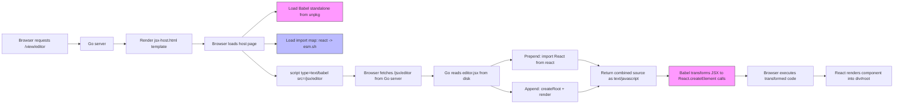

# Serve Artifacts

This project is a standalone Go HTTP server that serves Claude.ai artifacts — interactive web applications generated by Claude — from a local directory. It handles two fundamentally different artifact types: self-contained HTML files (served as-is) and JSX React components (transformed in-browser via Babel standalone and React loaded from ESM CDN). The tool uses the Glazed command framework for structured CLI output and integrated help.

> [!summary]
> The project has three roles:
> 1. a local artifact browser with a Mac-style index page
> 2. a JSX runtime environment that serves React components without a Node.js build step
> 3. a Glazed CLI tool for listing and inspecting artifact metadata

## Why this project exists

Claude.ai generates two kinds of interactive artifacts: complete HTML documents and React JSX components. There was no convenient way to browse and interact with these locally. Opening HTML files via `file://` URLs loses proper HTTP behavior, and JSX files require a full Node.js/Vite setup to render. This project solves both problems with a single Go binary that requires no external tooling.

The key insight is that JSX artifacts can be served without a build step by using Babel standalone for in-browser transformation and ES module import maps for React resolution. This means dropping a new `.jsx` file into the directory makes it immediately available — no compilation, no restart.

## Current project status

The server is functional and handles all four initial artifacts correctly.

What already exists:

- `serve-artifacts serve` — HTTP server with index, view, and raw endpoints
- `serve-artifacts list` — Glazed command for structured artifact metadata output
- HTML artifact serving with nav bar injection
- JSX artifact serving via dedicated `/jsx/` endpoint + Babel + React CDN
- File watcher with SSE-based auto-reload (`--watch`)
- Mac-style index page with human-readable file sizes
- Glazed help system with embedded tutorial (`help adding-artifacts`)
- Comprehensive design doc and investigation diary

What is still incomplete:

- Playwright browser tests for verifying artifact rendering
- Offline mode (bundling Babel and React into the binary)
- Support for artifact subdirectories or multi-file artifacts
- Support for `.tsx` (TypeScript JSX) files

## Project shape

The project has three layers:

1. **Artifact scanner** — reads a directory, classifies files by extension, extracts titles from HTML `<title>` tags or JSX `export default function Name()` patterns
2. **HTTP server** — serves artifacts with type-specific handling, injects navigation and reload scripts, manages SSE watcher connections
3. **CLI layer** — Glazed-based `list` command for structured output, Cobra-based `serve` command for the long-running server, integrated help system

## Architecture

```text
browser
  -> GET /              -> index handler -> scan directory -> render template
  -> GET /view/{name}   -> view handler  -> HTML: read + inject nav
                                         -> JSX: render host page template
  -> GET /jsx/{name}    -> jsx handler   -> read file + prepend React import + append mount code
  -> GET /events        -> SSE handler   -> fsnotify watcher -> broadcast reload
```

Key code locations:

- `cmd/serve-artifacts/main.go` — root Cobra command, Glazed help system wiring
- `cmd/serve-artifacts/cmds/serve.go` — serve command (plain Cobra)
- `cmd/serve-artifacts/cmds/list.go` — list command (Glazed)
- `cmd/serve-artifacts/doc/adding-artifacts.md` — embedded help tutorial
- `pkg/artifacts/scanner.go` — directory scanning, title extraction
- `pkg/server/server.go` — HTTP handlers, template rendering
- `pkg/server/watcher.go` — fsnotify file watcher, SSE broadcaster
- `pkg/server/templates/index.html` — Mac-style index page
- `pkg/server/templates/jsx-host.html` — JSX artifact host page with import map

## Implementation details

The most interesting technical challenge in this project is serving JSX artifacts without any build tooling. Here is how the pipeline works end to end.

### HTML artifact pipeline

HTML artifacts follow a simple path: the server reads the file, injects a floating navigation bar (a `<div>` with inline styles) before the `</body>` tag, and writes the modified content to the response. When watch mode is active, a small `<script>` block is also injected that connects to the `/events` SSE endpoint and calls `location.reload()` on change events.

The nav bar uses `z-index: 99999` and fixed positioning so it floats above artifact content without conflicting with the artifact's own CSS. It uses inline `onmouseover`/`onmouseout` handlers to avoid adding a `<style>` block that might conflict with the artifact.

### JSX artifact pipeline

JSX artifacts require a more involved pipeline because browsers cannot parse JSX syntax directly. The solution avoids any server-side compilation by delegating all transformation to the browser:



The host page (`jsx-host.html`) declares an import map that maps `"react"` to `https://esm.sh/react@18.3.1` and similar entries for `react-dom` and `react-dom/client`. It loads Babel standalone from unpkg. Then it includes a `<script type="text/babel" data-type="module" src="/jsx/{name}">` tag.

When the browser encounters this tag, Babel fetches the source from the `/jsx/` endpoint, transforms JSX syntax into `React.createElement()` calls, resolves imports via the import map, and executes the result.

The `/jsx/{name}` endpoint serves the raw file with two additions:

```go
preamble := "import React from \"react\";\n"
// ... read jsxSource from disk ...
componentName := artifact.Title  // extracted from "export default function Name()"
mountCode := fmt.Sprintf(`
import { createRoot } from "react-dom/client";
const root = createRoot(document.getElementById("root"));
root.render(<%s />);
`, componentName)

w.Write([]byte(preamble))
w.Write(jsxSource)
w.Write([]byte(mountCode))
```

The React import is prepended because Babel's classic JSX transform compiles `<div>` into `React.createElement("div", ...)`, which requires `React` to be in scope. The artifact files only import named exports like `useState` and `useEffect`, not the default `React` export.

### Component name extraction

The server determines the correct component name for the auto-mount code by scanning each JSX file for the `export default function` pattern:

```go
var exportDefaultRe = regexp.MustCompile(`export\s+default\s+function\s+(\w+)`)

func extractJSXComponentName(path string) string {
    scanner := bufio.NewScanner(f)
    for scanner.Scan() {
        if m := exportDefaultRe.FindStringSubmatch(scanner.Text()); len(m) > 1 {
            return m[1]  // e.g., "App" or "EditorApp"
        }
    }
    return ""
}
```

This runs at scan time and the extracted name is stored as the artifact's title. For `editor.jsx` which has `export default function EditorApp()`, the mount code becomes `root.render(<EditorApp />)`. This means each artifact gets the correct component name automatically, but anonymous arrow function exports (`export default () => ...`) are not supported.

### The template escaping bug and its fix

An important design decision was how to get JSX source into the browser. The initial approach inlined the source inside a `<script type="text/babel">` tag in a Go `html/template`. This failed because Go's contextual auto-escaping does not recognize `type="text/babel"` as a JavaScript context — it treats the content as HTML text and escapes `"` to `&#34;`, `<` to `&lt;`, etc. The `template.JS` type hint only works in contexts Go recognizes as JavaScript.

The fix was to serve JSX source from a separate endpoint (`/jsx/{name}`) that returns raw text, bypassing templates entirely. The host page references the source via the `src` attribute on the Babel script tag.

### File watcher and SSE

The watch system uses `fsnotify` to monitor the artifacts directory. When a file changes, the watcher broadcasts to all connected SSE clients via a set of Go channels. Each browser tab maintains an `EventSource` connection to `/events`. The reconnect logic is minimal — on error, the browser waits 2 seconds and reloads the page, which re-establishes the SSE connection.

```go
// Broadcast to all connected clients (non-blocking)
func (w *watcher) broadcast() {
    w.mu.Lock()
    defer w.mu.Unlock()
    for ch := range w.clients {
        select {
        case ch <- struct{}{}:
        default: // client not ready, skip
        }
    }
}
```

The non-blocking send means rapid file changes are coalesced — if a client hasn't consumed the previous event, the new one is dropped. This is intentional to avoid flooding the browser with reload requests.

## Current user-facing commands

```bash
# Serve artifacts with auto-reload
serve-artifacts serve --dir ./imports --port 8080 --watch

# List artifacts
serve-artifacts list --dir ./imports
serve-artifacts list --dir ./imports --output json
serve-artifacts list --dir ./imports --type jsx --fields name,title

# Help
serve-artifacts help adding-artifacts
```

## Important project docs

- `/home/manuel/code/wesen/2026-03-29--serve-claude-experiments/ttmp/2026/03/29/SERVE-ARTIFACTS--standalone-go-server-for-claude-ai-artifacts/design-doc/01-artifact-server-design-and-implementation-guide.md` — comprehensive design and implementation guide
- `/home/manuel/code/wesen/2026-03-29--serve-claude-experiments/ttmp/2026/03/29/SERVE-ARTIFACTS--standalone-go-server-for-claude-ai-artifacts/reference/01-diary.md` — investigation diary with 5 steps
- `/home/manuel/code/wesen/2026-03-29--serve-claude-experiments/ttmp/2026/03/29/SERVE-ARTIFACTS--standalone-go-server-for-claude-ai-artifacts/reference/02-jsx-template-escaping-bug-analysis.md` — analysis of the html/template escaping bug
- `/home/manuel/code/wesen/2026-03-29--serve-claude-experiments/cmd/serve-artifacts/doc/adding-artifacts.md` — embedded help tutorial

## Open questions

- Should the server support `.tsx` files? Babel standalone can handle TypeScript, but the import map might need additional entries.
- Should artifacts be able to reference local assets (images, data files)? Currently they must be self-contained.
- Should Babel and React be bundled into the Go binary for offline use? They are ~300 KB gzipped total.
- Should the server add debouncing to the file watcher? Editors that do save-rename-replace trigger multiple events.

## Near-term next steps

- add Playwright browser tests to verify artifact rendering
- test with a wider variety of Claude artifacts
- consider bundling CDN dependencies for offline use
- add syntax-highlighted source view

## Project working rule

> [!important]
> Keep the server as a zero-dependency tool from the user's perspective.
> No Node.js, no build step, no configuration files. Drop files in, run the binary, open a browser.
