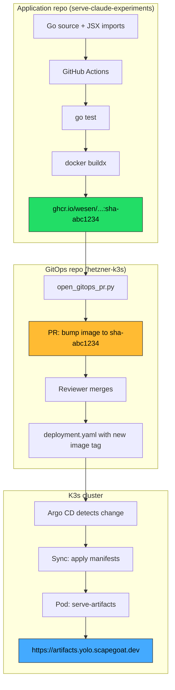

# Deploying the Claude Artifact Server to K3s with Full GitOps

This is a detailed account of deploying the `serve-claude-experiments` Go application as a public web service at `https://artifacts.yolo.scapegoat.dev`. The deployment follows the platform's established CI/CD pattern: GitHub Actions builds and publishes a container image to GHCR, then opens a pull request against the GitOps infrastructure repository, and Argo CD reconciles the desired state into the K3s cluster.

The project is interesting as a deployment case study because it exercises the simplest possible deployment category (public stateless app, no secrets, no database) while still hitting two real build-time surprises and one CI pipeline design bug.

> [!summary]
> 1. Full CI/CD pipeline: push to main -> GHCR image -> automated GitOps PR -> Argo CD rollout
> 2. Two build lessons: CGO requirement from transitive sqlite3 dependency, and the importance of failing loudly on missing CI secrets
> 3. End-to-end: from zero deployment infrastructure to a live HTTPS endpoint in a single session

## Why this deployment matters

The artifact server was already working locally — `go run ./cmd/serve-artifacts serve --dir ./imports` renders a gallery of Claude-generated interactive web applications. But "works on my machine" is not a deployment story.

Making it available at a public URL means:
- colleagues can browse the artifact gallery without running Go locally
- new artifacts pushed to `main` are automatically deployed
- the deployment follows the same patterns as every other app on the platform, making it easy to maintain

The deployment also served as a validation that the platform's standardized packaging playbook works for a new app with non-trivial build requirements (the `go generate` step for JSX precompilation).

## The deployment architecture

The system has three control planes that communicate through immutable artifacts and Git commits:



Each arrow is a contract boundary. The app repo never touches the cluster directly. The GitOps repo never builds images. The cluster never pulls source code. This separation is the whole point — when something breaks, you know which layer to inspect.

## The Dockerfile: two surprises in a multi-stage build

The application has a non-trivial build requirement: `go generate ./pkg/server` runs a precompile tool that transforms JSX files into JavaScript bundles using esbuild. This happens at compile time, not runtime. The precompiled bundles are then embedded into the binary via `go:embed`.

Here is the Dockerfile that works:

```dockerfile
FROM golang:1.25-bookworm AS build
WORKDIR /src
COPY go.mod go.sum ./
RUN go mod download
COPY cmd ./cmd
COPY pkg ./pkg
COPY imports ./imports

# Precompile JSX bundles (esbuild is a Go dependency, no Node.js needed)
RUN go generate ./pkg/server

RUN CGO_ENABLED=1 GOOS=linux GOARCH=amd64 \
    go build -o /out/serve-artifacts ./cmd/serve-artifacts

FROM gcr.io/distroless/base-debian12:nonroot
WORKDIR /app
COPY --from=build /out/serve-artifacts /app/serve-artifacts
COPY --from=build /src/imports /app/imports
EXPOSE 8080
ENTRYPOINT ["/app/serve-artifacts"]
CMD ["serve", "--dir", "/app/imports", "--port", "8080"]
```

### Surprise 1: esbuild works without Node.js

The `go generate` step runs `cmd/precompile-jsx-bundle`, which calls esbuild's Go API directly. esbuild is `github.com/evanw/esbuild`, a Go dependency — not a Node.js tool. This means the JSX-to-JS transformation runs inside the standard `golang:1.25-bookworm` image without installing Node.js or npm. The build step produces 15 precompiled artifacts in about 10 seconds.

### Surprise 2: CGO_ENABLED must be 1

The first Dockerfile used `CGO_ENABLED=0`, which is the default for small, statically-linked Go binaries. The container built successfully but crashed immediately on startup:

```json
{"level":"fatal","error":"failed to create tables: Binary was compiled with 'CGO_ENABLED=0', go-sqlite3 requires cgo to work. This is a stub","message":"Failed to create in-memory store"}
```

The app doesn't directly use SQLite, but Glazed (the CLI framework) pulls in `go-sqlite3` as a transitive dependency. The `go-sqlite3` package uses a conditional compilation trick: with `CGO_ENABLED=0`, it compiles a stub that panics with this error message instead of failing at build time.

The fix is `CGO_ENABLED=1`. The `distroless/base-debian12` runtime image includes glibc, so the dynamically-linked binary works. The `distroless/static` variant would not work because it lacks glibc.

This is the kind of bug that is invisible during `go build` (which succeeds) and only shows up at container runtime. The lesson: always test the container before pushing to CI, especially when changing CGO settings.

### Why imports/ is copied into the runtime image

The binary embeds precompiled JavaScript bundles via `go:embed`, but it still needs the `imports/` directory at runtime. The embedded bundles are an optimization for known artifacts — they avoid the Babel in-browser transformation. But the server discovers artifacts by scanning the directory, and new or modified JSX files fall back to the runtime Babel path. Without `imports/`, the server starts but has nothing to serve.

## The CI pipeline

The GitHub Actions workflow has two jobs:

**Job 1: `docker`** — runs on every push and PR:
- checks out the code
- runs `go test ./...`
- builds the Docker image with `docker/build-push-action`
- pushes to GHCR on `main` (skips push on PRs)
- tags: `sha-<7-char-hash>`, `main`, `latest`

**Job 2: `gitops-pr`** — runs only on `main` push, after `docker` succeeds:
- checks out the code
- runs `scripts/open_gitops_pr.py`
- the script clones the GitOps repo, patches the deployment manifest's image field, creates a branch, pushes, and opens a PR

The `open_gitops_pr.py` script is completely generic — it reads target metadata from `deploy/gitops-targets.json` and patches exactly one YAML field. No app-specific logic. It was copied verbatim from the mysql-ide repo.

### The GITOPS_PR_TOKEN lesson

The original workflow, copied from the platform playbook, had this guard:

```bash
if [ -z "${GH_TOKEN}" ]; then
    echo "GITOPS_PR_TOKEN is not configured; skipping GitOps PR creation."
    exit 0
fi
```

This `exit 0` is **dangerous for a required step**. During the initial deployment, the token was not yet configured, so the workflow:
1. Built the image successfully
2. Pushed it to GHCR successfully
3. Silently skipped the GitOps PR
4. Reported overall success (green checkmark)

The deployment appeared to work, but no automated PR was opened to update the cluster. The image existed in GHCR but the cluster was still running the initial image tag from the manual GitOps commit.

The fix was to change this to `exit 1`:

```bash
if [ -z "${GH_TOKEN}" ]; then
    echo "::error::GITOPS_PR_TOKEN is not configured. Add it as a repository secret."
    exit 1
fi
```

This is a design principle worth remembering: **silent skips are appropriate for optional features, not for required steps.** The GitOps PR is the entire point of the CI pipeline — if it can't run, the workflow should fail loudly so someone notices.

The corrected implementation order is:
1. Configure `GITOPS_PR_TOKEN` in repo settings
2. *Then* push to `main`

Not the other way around.

## The GitOps manifests

The Kubernetes manifests follow the platform's "Category 1: Public stateless app" pattern. This is the simplest possible deployment — no secrets, no database, no Vault/VSO integration, no persistent volumes.

The complete manifest set is five files:

```
gitops/kustomize/artifacts/
├── kustomization.yaml    # lists the four resources below
├── namespace.yaml        # artifacts namespace, sync-wave -1
├── deployment.yaml       # single replica, port 8080, IfNotPresent
├── service.yaml          # port 80 -> targetPort http
└── ingress.yaml          # artifacts.yolo.scapegoat.dev, letsencrypt-prod
```

Plus the Argo CD Application:

```yaml
# gitops/applications/artifacts.yaml
apiVersion: argoproj.io/v1alpha1
kind: Application
metadata:
  name: artifacts
  namespace: argocd
spec:
  project: default
  destination:
    server: https://kubernetes.default.svc
    namespace: artifacts
  source:
    repoURL: https://github.com/wesen/2026-03-27--hetzner-k3s.git
    targetRevision: main
    path: gitops/kustomize/artifacts
  syncPolicy:
    automated:
      prune: true
      selfHeal: true
    syncOptions:
      - CreateNamespace=true
      - ServerSideApply=true
```

### Design decisions in the deployment manifest

**`enableServiceLinks: false`** — Kubernetes auto-injects environment variables for every Service in the namespace (e.g., `SERVE_ARTIFACTS_PORT=tcp://10.43.x.x:80`). The CoinVault deployment was bitten by this: Kubernetes injected `COINVAULT_PORT` which collided with the app's own config parsing. Adding `enableServiceLinks: false` prevents this class of bug.

**`imagePullPolicy: IfNotPresent`** — The deployment uses GHCR SHA-tagged images, which are immutable. `IfNotPresent` avoids redundant pulls while still pulling new tags correctly. The old `imagePullPolicy: Never` was for locally-imported images and must not be used with registry-backed deployments.

**No `/healthz` endpoint** — The app doesn't have a dedicated health route. The readiness and liveness probes hit `/` (the index page), which returns HTTP 200. This works but is slightly noisier in logs than a dedicated health endpoint. Adding `/healthz` is a future improvement.

**Memory limit 256Mi** — This is generous for a static file server. The real usage is likely under 64Mi. It can be tuned down after observing actual consumption.

## The Argo CD Application must be manually applied

One non-obvious step: the Argo CD Application manifest lives in `gitops/applications/artifacts.yaml` and is committed to Git, but Argo CD doesn't auto-discover new Application resources from the repository. The first apply must be manual:

```bash
kubectl apply -f gitops/applications/artifacts.yaml
kubectl -n argocd annotate application artifacts \
    argocd.argoproj.io/refresh=hard --overwrite
```

After that, Argo CD manages the Application's lifecycle. Future changes to the manifests (including the Application itself) are picked up automatically from Git.

## The end-to-end flow in practice

Here is what actually happened during the deployment, in chronological order:

1. Created `Dockerfile`, `.github/workflows/publish-image.yaml`, `deploy/gitops-targets.json`, `scripts/open_gitops_pr.py` in the app repo
2. Committed and pushed to `main` (commit `0f000f7`)
3. GitHub Actions built the image in 4m27s and pushed to GHCR
4. The GitOps PR job silently skipped (token not configured yet)
5. Created the Kustomize package and Argo Application in the GitOps repo
6. Committed and pushed the GitOps changes (commit `700de99`)
7. Manually applied the Argo Application: `kubectl apply -f gitops/applications/artifacts.yaml`
8. Argo synced: pod came up `Running` with the initial image tag
9. Noticed the GitOps PR was never opened — found the silent skip
10. Configured `GITOPS_PR_TOKEN` in the app repo
11. Fixed the workflow to `exit 1` on missing token (commit `c2f7237`)
12. Pushed the fix — CI built a new image and this time opened PR #4
13. Merged PR #4 — Argo rolled the pod to the new image in 21 seconds
14. Verified: `curl https://artifacts.yolo.scapegoat.dev/` returns HTTP/2 200

The TLS certificate was issued automatically by cert-manager via Let's Encrypt. No manual certificate work was needed — the wildcard DNS for `*.yolo.scapegoat.dev` was already configured.

## What the automated GitOps PR looks like

When CI opens a PR, the diff is exactly one line:

```diff
- image: ghcr.io/wesen/2026-03-29--serve-claude-experiments:sha-0f000f7
+ image: ghcr.io/wesen/2026-03-29--serve-claude-experiments:sha-c2f7237
```

The PR body includes:
- the exact image reference
- the source commit SHA
- a link to the GitHub Actions workflow run
- rollback instructions

This is the contract: one image line change, reviewable in seconds, revertable by reverting the merge commit.

## Deployment target metadata

The app repo declares where it should be deployed via a JSON data file:

```json
{
  "targets": [
    {
      "name": "artifacts-prod",
      "gitops_repo": "wesen/2026-03-27--hetzner-k3s",
      "gitops_branch": "main",
      "manifest_path": "gitops/kustomize/artifacts/deployment.yaml",
      "container_name": "serve-artifacts"
    }
  ]
}
```

This keeps deployment destinations as data, not hardcoded workflow logic. Adding a staging environment later means adding another entry to the `targets` array — no workflow changes needed.

## Validation

After the deployment, these checks all pass:

```bash
# Argo CD status
kubectl -n argocd get application artifacts
# -> Synced Healthy

# Pod status
kubectl -n artifacts get pods
# -> serve-artifacts-799dbf69fd-w644c   1/1   Running

# Live endpoint
curl -sI https://artifacts.yolo.scapegoat.dev/
# -> HTTP/2 200

# Image verification
kubectl -n artifacts get deploy serve-artifacts \
    -o jsonpath='{.spec.template.spec.containers[0].image}'
# -> ghcr.io/wesen/2026-03-29--serve-claude-experiments:sha-c2f7237
```

## Lessons learned

1. **Always test the container before pushing to CI.** The CGO/sqlite3 crash was invisible during `go build` and only appeared at container runtime. A 30-second `docker run` would have caught it.

2. **Silent skips are bugs for required steps.** The `exit 0` on missing GITOPS_PR_TOKEN created a false positive where the CI appeared successful but the deployment pipeline was broken. Required steps should fail loudly.

3. **Configure credentials before the first push.** The implementation guide originally had "configure GITOPS_PR_TOKEN" as a post-deployment step. It should be a pre-deployment step because the workflow now fails without it.

4. **The `go generate` chain works in Docker without Node.js.** esbuild as a Go dependency means JSX precompilation runs entirely within the Go build container. No multi-language build tooling needed.

5. **`distroless/base` has glibc, `distroless/static` does not.** When CGO is required, use `base`, not `static`.

## Repository references

- App repo: `/home/manuel/code/wesen/2026-03-29--serve-claude-experiments`
- GitOps repo: `/home/manuel/code/wesen/2026-03-27--hetzner-k3s`
- Deployment ticket: `HK3S-0016` in `/home/manuel/code/wesen/2026-03-27--hetzner-k3s/ttmp/2026/03/29/HK3S-0016--deploy-serve-claude-experiments-as-artifacts-yolo-scapegoat-dev/`
- Implementation guide: `design/01-implementation-guide-deploy-serve-claude-experiments.md`
- Investigation diary: `reference/01-investigation-diary.md`

## Open questions

- Should a `/healthz` endpoint be added to the server for cleaner probe behavior?
- Should the container run with `--watch`? It adds fsnotify overhead in production but enables live updates.
- Should the GHCR package visibility be explicitly set to public, or does the public repo handle it automatically?

## Near-term next steps

- Monitor memory and CPU usage to right-size the resource limits
- Add `/healthz` endpoint to the server
- Consider adding a Dockerfile `.dockerignore` to exclude `ttmp/` and `.git/` from the build context
- Add the deployment to the platform's standard onboarding checklist as a reference example
