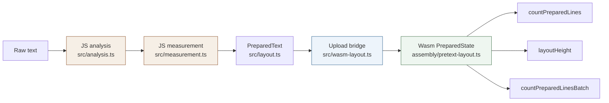

# Pretext Current AssemblyScript Implementation

This note describes the current AssemblyScript and WebAssembly slice inside the Pretext repo. The important truth is that the port is real but narrow: it handles the arithmetic line-counting core over already-prepared numeric arrays, while text analysis, segmentation, measurement, and rich line materialization still live in JavaScript.

> [!summary]
> The current AssemblyScript work should be understood as:
> 1. a wasm port of the numeric resize-hot-path layout core
> 2. a JavaScript-to-wasm upload boundary built around prepared arrays and engine-profile flags
> 3. a partial implementation on the way toward a more portable pipeline, not a full raw-text renderer yet

## Why this project exists

Pretext is designed around a sharp split: expensive preparation happens once, and cheap arithmetic layout happens repeatedly on resize. That makes the arithmetic layout core an attractive target for AssemblyScript and wasm. If the prepared-state walker can run in wasm, the repo gains a portable numeric core and a concrete way to explore browser-plus-wasm rendering architectures.

This port also serves as a reality check. Instead of speculating about whether the layout core is portable, the repo now contains an actual AssemblyScript module, a generated wasm binding layer, a browser wrapper, and demos that compare results and performance.

## Current project status

The AssemblyScript implementation exists and works for the numeric layout core.

What already exists:

- `assembly/pretext-layout.ts` with a wasm-side `PreparedState`
- exported functions for upload, line counting, height, batch count, and state count
- generated bindings in `src/generated/pretext-layout.d.ts` and `src/generated/pretext-layout.js`
- a browser-side wrapper in `src/wasm-layout.ts`
- demo usage in the wasm explorer and surrounding docs

What is still incomplete:

- raw-text analysis in wasm
- segmentation in wasm
- measurement in wasm or via a formal portable host callback system
- rich line materialization and cursor-oriented outputs in wasm
- a fully portable browser-plus-WASI pipeline

## Project shape

At a high level, the current implementation has four layers:

1. **JavaScript preparation**
   - `src/analysis.ts`
   - `src/measurement.ts`
   - `src/layout.ts`
2. **Upload bridge**
   - `src/wasm-layout.ts`
   - flatten JS arrays into typed arrays
   - pass engine-profile flags
3. **Wasm numeric core**
   - `assembly/pretext-layout.ts`
   - count lines and compute height
4. **Generated bindings and demos**
   - `src/generated/pretext-layout.d.ts`
   - wasm explorer demos and trace tooling

## Architecture



The key fact in this diagram is that wasm starts after the prepared numeric state already exists. The current port does not own the front half of the pipeline.

## Implementation details

The current AssemblyScript implementation is easiest to understand if you start from the upload boundary, not from the wasm file itself. `src/wasm-layout.ts` receives a normal `PreparedText`, casts it to the internal richer structure, flattens the relevant arrays, and uploads them into wasm in one `createPreparedState(...)` call.

### Upload boundary and flattened data

The upload bridge in `src/wasm-layout.ts` copies several arrays into typed arrays:

- `widths`
- `lineEndFitAdvances`
- `kinds`
- `breakableMeta`
- `breakableFlat`
- `breakablePrefixFlat`
- `chunks`

It also passes behavior flags and numeric tuning facts:

- `simpleLineWalkFastPath`
- `discretionaryHyphenWidth`
- `tabStopAdvance`
- `lineFitEpsilon`
- `preferPrefixWidthsForBreakableRuns`
- `preferEarlySoftHyphenBreak`

This is significant because the wasm module is not discovering browser behavior for itself. JavaScript measures and decides those profile details first, then uploads them.

Pseudocode:

```text
internal = prepared as InternalPreparedText
widths = Float64Array.from(internal.widths)
kinds = Int32Array.from(kind codes)
breakableMeta = flatten per-segment breakable offsets and lengths
breakableFlat = flatten per-grapheme widths
chunks = flatten hard-break chunk ranges
engineProfile = getEngineProfile()

handle = wasm.createPreparedState(
  widths,
  lineEndFitAdvances,
  kinds,
  breakableMeta,
  breakableFlat,
  breakablePrefixFlat,
  chunks,
  simpleLineWalkFastPath,
  discretionaryHyphenWidth,
  tabStopAdvance,
  engineProfile.lineFitEpsilon,
  engineProfile.preferPrefixWidthsForBreakableRuns,
  engineProfile.preferEarlySoftHyphenBreak
)
```

### Wasm-side state model

Inside `assembly/pretext-layout.ts`, each uploaded state becomes a `PreparedState` object containing exactly the arrays and flags needed for line counting. There is no source string, no segmentation object graph, and no measurement backend in wasm. The data model is intentionally numeric and compact.

Important fields stored in wasm:

- segment widths and line-end fit advances
- segment kind codes
- per-segment breakable metadata
- flat grapheme-width arrays
- chunk boundaries for hard breaks
- fast-path and soft-hyphen policy flags

This is the core architectural decision of the current port: wasm receives an already-compiled layout IR.

### Simple path versus general path

The wasm module mirrors the same broad split as the JavaScript engine:

- a `countPreparedLinesSimple(...)` fast path
- a `countPreparedLinesGeneral(...)` path for harder cases

The simple path handles the common case efficiently:

- walk segment widths left to right
- add widths until the line overflows
- ignore collapsible spaces at overflow boundaries
- break inside breakable runs only when a segment itself exceeds the width

The general path carries more state:

- current line width
- whether the line has content
- pending break position
- pending break fit width
- pending break kind
- segment and grapheme cursor positions

That path is what lets the wasm module handle:

- tabs
- preserved spaces
- hard-break chunks
- soft hyphen behavior
- prefix-width-sensitive breakable runs

### Soft hyphen and breakable run handling

One of the more important pieces is `continueSoftHyphenBreakableSegment(...)`. This function handles the case where a soft hyphen created a pending break and the following breakable segment may be partially consumed while accounting for discretionary hyphen width.

The key insight is that the current port does not only count whole segments. It can also step through breakable grapheme widths inside a segment and decide where a line should end.

That is why the upload bridge has to flatten `breakableFlat` and `breakablePrefixFlat`. Without those per-grapheme widths, the wasm module would not be able to mimic the JS arithmetic line walker closely enough.

### Exported ABI

The generated `.d.ts` file shows the actual public wasm ABI today:

- `clearPreparedStates()`
- `createPreparedState(...)`
- `countPreparedLines(handle, maxWidth)`
- `layoutHeight(handle, maxWidth, lineHeight)`
- `countPreparedLinesBatch(handles, widths, repeats)`
- `getPreparedStateCount()`

This list is revealing. What is absent is just as important as what is present:

- no `prepare(text)`
- no segmentation API
- no measurement API
- no `layoutWithLines()`
- no cursor- or range-oriented rich output

### Why the current scope is still valuable

Even though this is not a full raw-text wasm renderer, the current port is not trivial. It proves several important things:

- the resize-hot-path arithmetic core can live in wasm
- the prepared-state interface can be expressed as flat numeric arrays
- engine-profile shims can be passed across the boundary
- batch line counting is a natural wasm-side operation

This makes the current implementation a strong foundation for future portability work, even if the front half of the pipeline remains JavaScript for now.

## Current user-facing commands

The main local entry points are:

```bash
bun run wasm:build
bun start
```

Typical local workflow:

```bash
# rebuild wasm artifacts
bun run wasm:build

# serve demos
bun start

# browser
open http://127.0.0.1:3000/demos/explorer-wasm
```

For narrow validation:

```bash
bun test
bun run check
```

## Important project docs

Repo-local references:

- `/home/manuel/code/wesen/2026-03-30--pretext-wasm/assembly/pretext-layout.ts`
- `/home/manuel/code/wesen/2026-03-30--pretext-wasm/src/wasm-layout.ts`
- `/home/manuel/code/wesen/2026-03-30--pretext-wasm/src/generated/pretext-layout.d.ts`
- `/home/manuel/code/wesen/2026-03-30--pretext-wasm/ttmp/2026/03/30/PRETEXT-20260330--assemblyscript-wasm-render-pipeline--complete-the-assemblyscript-wasm-port-of-the-pretext-layout-engine/design-doc/01-assemblyscript-and-wasm-render-pipeline-analysis-and-implementation-guide.md`
- `/home/manuel/code/wesen/2026-03-30--pretext-wasm/ttmp/2026/03/30/PRETEXT-20260330--interactive-article-trace-server--interactive-article-design-for-assemblyscript-trace-server/design-doc/01-interactive-article-guide-for-the-trace-server-and-trace-pipeline.md`

Key broader pipeline files:

- `/home/manuel/code/wesen/2026-03-30--pretext-wasm/src/analysis.ts`
- `/home/manuel/code/wesen/2026-03-30--pretext-wasm/src/measurement.ts`
- `/home/manuel/code/wesen/2026-03-30--pretext-wasm/src/layout.ts`
- `/home/manuel/code/wesen/2026-03-30--pretext-wasm/src/line-break.ts`

## Open questions

- Should the next wasm step be richer layout outputs, or prepared-state compilation inside wasm?
- Should the long-term portable design keep segmentation as a host capability instead of porting `Intl.Segmenter` behavior?
- How should a future WASI-friendly measurement boundary be designed?
- Should the current `src/wasm-layout.ts` loader and wrapper become more formal and less demo-oriented?

## Near-term next steps

- keep using the current port to validate arithmetic parity and measure boundary costs
- define a clearer host-to-wasm contract for future portable prepare work
- decide whether the next milestone is richer line-range output or broader preparation logic

## Project working rule

> [!important]
> Do not describe the current AssemblyScript work as "the full Pretext engine in wasm."
> It is the numeric arithmetic layout core over a JavaScript-prepared state, and keeping that boundary explicit is essential for making good architectural decisions.
