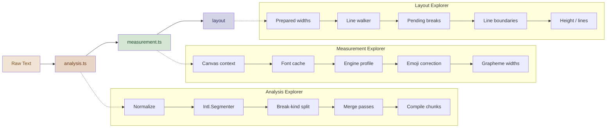

# Pretext Interactive Article Demo Pages

This project is a suite of three interactive technical articles that explain Pretext's text layout pipeline from the inside. Each article is a self-contained browser page with live, editable demos, narrative prose, and curated multilingual examples. Together they form a deep-dive trilogy: how raw text becomes semantic segments (analysis), how segments become cached width facts (measurement), and how cached widths become line breaks and heights with pure arithmetic (layout).

> [!summary]
> The project produced three new demo pages for the Pretext repository:
> 1. **Analysis Explorer** — the segmentation and merge-pass pipeline
> 2. **Measurement Explorer** — the canvas width oracle and correction layers
> 3. **Layout Explorer** — the arithmetic line-breaking state machine

## Why this project exists

Pretext is a two-phase text layout engine: `prepare()` does one-time analysis and canvas measurement, while `layout()` does pure arithmetic on cached widths. The existing Explorer demo page covered the full pipeline at a surface level, but lacked the depth needed for a technical reader to truly understand how each phase works and why the architecture splits the way it does.

The interactive articles were designed from detailed UX/writer-facing design briefs stored in docmgr tickets. Each ticket contained a full algorithm walkthrough, suggested demo modules, pseudocode, visual grammar guidance, narrative structure recommendations, and file reference maps. The implementation work translated those briefs into working browser demos.

## Current project status

All three interactive article pages are implemented, typechecked, and deployed to the dev server. They are accessible at:

- `http://localhost:3000/demos/analysis-explorer`
- `http://localhost:3000/demos/measurement-explorer`
- `http://localhost:3000/demos/layout-explorer`

Each page is linked from the demos index page and cross-linked to the others. All three pages follow the visual language and CSS patterns established by the original `explorer.html` page.

What exists:

- Three complete HTML pages with article structure, narrative prose, and CSS
- Three complete TypeScript files with interactive demo modules
- Updated demos index with cards for all three pages
- Updated docmgr ticket tasks and investigation diaries for all three tickets
- Six git commits tracking the implementation and documentation

What is still possible:

- Step-through animation mode for the line-breaking demo
- Diff highlighting between pipeline stages in the analysis explorer
- Multi-font cache demo in the measurement explorer
- Side-by-side grapheme vs prefix width comparison mode

## Project shape

The project has a clear layered structure:

1. **Design briefs** — detailed docmgr tickets with algorithm walkthroughs, demo module specs, and UX guidance
2. **HTML articles** — article-style pages with narrative prose, visual grammar, and demo containers
3. **TypeScript demos** — interactive modules that use the real Pretext library APIs
4. **Presentation helpers** — local explainer functions that mirror internal pipeline stages for visualization

## Architecture

The three pages form a sequential narrative that mirrors Pretext's actual pipeline:



Each page imports from the real Pretext library rather than mocking behavior. The analysis explorer uses a presentation-layer `explainAnalysisStages()` helper that mirrors the internal pipeline stages using `Intl.Segmenter` and a local break-kind classifier. The measurement and layout explorers import internal functions directly from `src/measurement.ts` and `src/layout.ts`.

## Implementation details

### Analysis Explorer — the segmentation story

The analysis explorer explains how `analysis.ts` transforms raw text into a semantic segment stream. The key architectural insight it communicates is that most correctness fixes in Pretext live in analysis, not in the line breaker — script-specific rules, punctuation attachment, URL grouping, and glue merging are all preprocessing decisions.

The page uses a presentation-layer approach to show intermediate pipeline stages. Rather than importing private helpers from `analysis.ts`, it builds a local `explainAnalysisStages()` function that mirrors the three main stages:

```typescript
function explainAnalysisStages(text: string, mode: WhiteSpaceMode): AnalysisStage[] {
  // Stage 1: Raw Intl.Segmenter output
  // Stage 2: Break-kind split (spaces, NBSP, SHY, ZWSP classified)
  // Stage 3: Final merged result from analyzeText()
}
```

The merge-pass gallery is the most educational module. It uses nine curated presets that each justify a different merge-pass family:

| Preset | Merge family | Key behavior |
|--------|-------------|--------------|
| URL + query | Product-shaped runs | `https://...?q=...` splits at `?` |
| Arabic punctuation | Script-specific | Colon stays attached to Arabic text |
| CJK kinsoku | Script-specific | Line-start-prohibited punctuation merges |
| Numeric/time | Product-shaped runs | `7:00-9:00` stays as one unit |
| NBSP glue | Non-breaking glue | `foo\u00A0bar` becomes unbreakable |
| Soft hyphens | Break kinds | Invisible until chosen as break |
| pre-wrap spaces | Whitespace mode | Spaces/tabs/newlines preserved |
| Escaped quotes | Product-shaped runs | `\"word\"` clusters merge |
| Mixed script | All families | Shows different treatments per script |

Each preset shows a before/after comparison: the break-kind split stage (before any merging) versus the final analysis result.

### Measurement Explorer — the width oracle story

The measurement explorer explains how `measurement.ts` turns semantic segments into cached, browser-grounded width facts. The central claim it communicates is that canvas measurement gives a cheap, corrected width oracle that makes `layout()` arithmetic-only.

The emoji correction microscope is the flagship demo. It compares canvas vs DOM width for five different emoji types at a user-controlled font size:

- Simple emoji (grinning face)
- Object emoji (rocket)
- Heart with variation selector
- Flag emoji (regional indicators)
- ZWJ family emoji (family group)

The demo creates a temporary hidden DOM span for each emoji, measures its `getBoundingClientRect().width`, compares against `canvas.measureText().width`, and displays paired ruler bars showing the delta. On Chrome/Firefox on macOS at small font sizes, the correction is typically 2-4px per emoji. On Safari, it's usually zero.

The grapheme vs prefix width demo reveals a subtle but important measurement design decision. When a word needs to break at grapheme boundaries, Pretext keeps two width arrays:

```
"Hello" grapheme widths: [H: 8.9, e: 7.5, l: 3.3, l: 3.3, o: 8.0]
"Hello" prefix widths:   [H: 8.9, He: 16.3, Hel: 19.7, Hell: 23.0, Hello: 31.0]
```

Summing individual grapheme widths (31.0) may not exactly equal the prefix width (31.0) due to floating-point accumulation. Some browsers (Safari) fit text more accurately with prefix measurements. The demo shows both representations with their sum-vs-total comparison.

### Layout Explorer — the arithmetic payoff

The layout explorer explains the final phase: how cached widths become line breaks with pure arithmetic. The central claim is that `layout()` is a small state machine, not a browser clone.

The fit-width vs paint-width demo is the most non-obvious module. It accesses internal prepared data (`lineEndFitAdvances`, `lineEndPaintAdvances`) by casting to the internal type:

```typescript
const internal = prepared as unknown as {
  widths: number[]
  lineEndFitAdvances: number[]
  lineEndPaintAdvances: number[]
  kinds: string[]
}
```

This reveals the distinction that makes trailing whitespace work correctly:

- A trailing space: fit advance = 0, paint advance = 0 (hangs invisibly)
- A tab: fit advance = 0, paint advance = tab width (paints but doesn't push)
- A soft hyphen: fit advance = hyphen width (counts for fit), paint advance = hyphen width (paints the dash)

The API ladder benchmark runs 200 texts at 3 widths through `layout()`, `walkLineRanges()`, and `layoutWithLines()`, showing the cost progression from the hot path (microseconds) to the rich path (still fast, but measurably more expensive due to text materialization).

The shrink-wrap demo animates a binary search over `layout()` calls. It precomputes all binary search steps, then animates through them with 250ms delays, showing the text box width change at each step and logging the search state. This demonstrates the core value proposition: because `layout()` is pure arithmetic, you can call it hundreds of times in a binary search without any performance concern.

### Visual grammar

All three pages share a consistent visual grammar inherited from the original `explorer.html`:

- Segment chips with color-coded backgrounds per break kind
- Width bars showing segment measurements
- Slider controls for dynamic parameters
- Stats rows with labeled counters
- Callout boxes for key insights
- Pipeline step diagrams with arrow connectors
- Line render views with width markers

The color palette is stable across all pages:

| Break kind | Color | CSS variable |
|-----------|-------|-------------|
| text | warm neutral | `--seg-text: #e8d5c4` |
| space | pale green | `--seg-space: #d4e5d4` |
| glue | indigo | `--seg-glue: #d4d4e8` |
| soft-hyphen | magenta | `--seg-shy: #e8d4e8` |
| zero-width-break | yellow | `--seg-zwb: #e8e8d4` |
| hard-break | coral | `--seg-hard: #f0c4c4` |
| tab | blue | `--seg-tab: #c4e0f0` |
| preserved-space | teal | `--seg-pspace: #c4f0e0` |

## Key code locations

Demo pages:

- `pages/demos/analysis-explorer.html` — analysis article structure (~27KB)
- `pages/demos/analysis-explorer.ts` — analysis demo modules (~23KB)
- `pages/demos/measurement-explorer.html` — measurement article structure (~27KB)
- `pages/demos/measurement-explorer.ts` — measurement demo modules (~24KB)
- `pages/demos/layout-explorer.html` — layout article structure (~24KB)
- `pages/demos/layout-explorer.ts` — layout demo modules (~19KB)

Source files the articles explain:

- `src/analysis.ts` — normalization, segmentation, merge passes, chunk compilation
- `src/measurement.ts` — canvas measurement, caching, emoji correction, grapheme widths
- `src/layout.ts` — public layout APIs and prepared state assembly
- `src/line-break.ts` — arithmetic line-walking algorithms

Design briefs (docmgr tickets):

- `ttmp/2026/03/30/PRETEXT-20260330--interactive-article-analysis-ts--interactive-article-design-for-pretext-analysis-ts/`
- `ttmp/2026/03/30/PRETEXT-20260330--interactive-article-measurement-ts--interactive-article-design-for-pretext-measurement-ts/`
- `ttmp/2026/03/30/PRETEXT-20260330--interactive-article-arithmetic-layout--interactive-article-design-for-pretext-arithmetic-layout/`

## Demo module inventory

### Analysis Explorer (6 modules)

1. **Normalization** — side-by-side raw vs normalized text with invisible character reveal toggle and normal/pre-wrap mode switch
2. **Pipeline stepper** — three stages (Intl.Segmenter, break-kind split, final merged) with clickable stage buttons
3. **Break-kind classifier** — eight break kinds with color-coded segment chips and per-kind counts
4. **Merge-pass gallery** — nine multilingual presets with before/after merge comparison
5. **Analysis object inspector** — parallel arrays table (texts[], kinds[], starts[], isWordLike[]) plus chunk visualization
6. **Bridge to measurement** — segment width bars and live line breaking with width slider

### Measurement Explorer (8 modules)

1. **Canvas vs DOM benchmark** — DOM reflow vs canvas.measureText timing for 200 texts
2. **Cache warm-up** — cold/warm cache with hit/miss/unique/total segment counters
3. **Engine profile inspector** — four runtime-detected EngineProfile flags with descriptions
4. **Segment widths** — click-to-inspect detail panel with raw/corrected width, grapheme/prefix splits
5. **Emoji correction microscope** — font-size slider comparing 5 emoji across canvas vs DOM
6. **Grapheme vs prefix widths** — toggle between bar and staircase views with sum-vs-total error
7. **Prepared state inspector** — table of segment/kind/width/breakable
8. **Bridge to layout** — live line breaking with width slider

### Layout Explorer (7 modules)

1. **Live line breaking** — width slider with segment chips and real-time line render
2. **Fit width vs paint width** — per-segment paired bars for lineEndFitAdvance vs lineEndPaintAdvance
3. **Overwide word breaking** — long word with slider forcing grapheme-level breaks
4. **Soft hyphen decisions** — slider showing hyphen activation/deactivation
5. **Shrink-wrap binary search** — animated search with live text box width and step log
6. **Variable-width obstacle flow** — draggable obstacle with canvas layoutNextLine() streaming
7. **API ladder benchmark** — performance comparison: layout() vs walkLineRanges() vs layoutWithLines()

## Git history

```
fd700a6 :books: Update investigation diary and tasks for layout-explorer demo
c6ac56f :art: Add layout-explorer interactive demo page
c3ffdd4 :books: Update investigation diary and tasks for measurement-explorer demo
f82aac4 :art: Add measurement-explorer interactive demo page
71b192f :books: Update investigation diary and tasks for analysis-explorer demo
4cef397 :art: Add analysis-explorer interactive demo page
```

## Important project docs

- `/home/manuel/code/wesen/2026-03-30--pretext-wasm/ttmp/2026/03/30/PRETEXT-20260330--interactive-article-analysis-ts--interactive-article-design-for-pretext-analysis-ts/design-doc/01-interactive-article-guide-for-analysis-ts-algorithms.md` — full UX/writer brief for the analysis article
- `/home/manuel/code/wesen/2026-03-30--pretext-wasm/ttmp/2026/03/30/PRETEXT-20260330--interactive-article-measurement-ts--interactive-article-design-for-pretext-measurement-ts/design-doc/01-interactive-article-guide-for-measurement-ts-algorithms.md` — full UX/writer brief for the measurement article
- `/home/manuel/code/wesen/2026-03-30--pretext-wasm/ttmp/2026/03/30/PRETEXT-20260330--interactive-article-arithmetic-layout--interactive-article-design-for-pretext-arithmetic-layout/design-doc/01-interactive-article-guide-for-arithmetic-layout-algorithms.md` — full UX/writer brief for the layout article

## Open questions

- Should the analysis explorer expose more than three pipeline stages, showing individual merge passes?
- Should the measurement emoji correction demo add browser-specific notes for Safari (where correction is typically zero)?
- Should the layout explorer add a step-through animation mode for the line walker state machine?
- Should the three articles be combined into one long-form page, or kept as separate deep dives?
- Should the demos be usable for automated regression testing, or stay purely educational?

## Near-term next steps

- Review the gallery preset texts for Arabic and CJK with a native speaker for naturalness
- Consider adding animation/transition between pipeline stages in the analysis explorer
- Add a diff-highlight mode showing which segments changed between stages
- The layout explorer could show the running width accumulator bar advancing per-segment in step mode
- Consider extracting the shared visual grammar (segment chips, stats rows, width bars) into a shared demo-components module to reduce duplication across the three pages

## Project working rule

> [!important]
> These are educational demo pages, not the library's public API surface. They import internal library functions for visualization purposes. Do not treat demo code patterns as endorsed public API usage, and do not expand the library's public API just to support article instrumentation.
