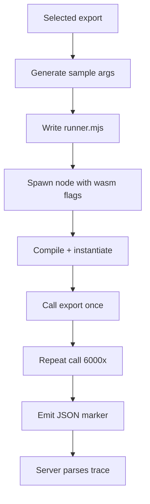

# Pretext Trace Server

This project note covers the local trace-server stack added to the Pretext repo on 2026-03-30. It is a tooling and teaching subsystem rather than part of the production text-layout runtime. Its job is to let a reader type small AssemblyScript programs and inspect the full visible path from source to WAT to wasm bytes to V8 compile events to native assembly.

> [!summary]
> The trace-server work currently has three important identities:
> 1. a local compiler-and-trace service for small AssemblyScript snippets
> 2. a browser demo that teaches how wasm code reaches native execution in V8
> 3. an explanatory bridge between Pretext's current AssemblyScript port and the underlying runtime/toolchain behavior

## Why this project exists

The repo already had a real but narrow AssemblyScript port of the numeric layout hot path. What was missing was a way to inspect that work beyond parity numbers and benchmark tables. The trace server exists to expose the hidden middle of the system: the compiler artifacts, the wasm export metadata, the V8 compilation events, and the native machine-code output that the local engine actually generates.

This matters because the existing wasm demo answers "does the AssemblyScript version behave similarly and how fast is it?" The trace server answers a different question: "what does the runtime pipeline actually do with this code?" That makes it valuable both for engineers and for future technical writing and demo work.

## Current project status

The trace stack is functional and publicly visible in the demo catalog.

What already exists:

- a local HTTP server in `scripts/assemblyscript-trace-server.mjs`
- an interactive browser page in `pages/demos/assemblyscript-trace.html`
- package and demo-site integration in `package.json`, `pages/demos/index.html`, and `scripts/build-demo-site.ts`
- a structured JSON response that includes WAT, wasm bytes, compile events, and disassembly

What is still incomplete:

- a richer article-grade visual explanation layer on top of the raw engineering demo
- more explicit structured warning fields in the API
- tracing of real Pretext AssemblyScript exports as a first-class guided scenario

## Project shape

At a high level, the trace-server subsystem has four layers:

1. **Browser UI**
   - editable source
   - export picker
   - health check
   - staged rendering of artifacts and trace output
2. **Local HTTP server**
   - route handling
   - request parsing
   - compile orchestration
   - response shaping
3. **Compiler and runtime inspection pipeline**
   - in-memory AssemblyScript compile
   - wasm metadata extraction
   - child Node process with V8 trace flags
   - raw trace parsing
4. **Presentation and teaching output**
   - summarized stats and pills
   - WAT and wasm dump
   - Liftoff and TurboFan panes
   - raw trace appendix

## Architecture

```mermaid
flowchart LR
    A[Browser page<br/>assemblyscript-trace.html] -->|POST source + exportName| B[Trace server<br/>assemblyscript-trace-server.mjs]
    B --> C[asc.main()<br/>AssemblyScript compile]
    C --> D[WAT + wasm buffer]
    D --> E[WebAssembly.Module<br/>imports and exports]
    D --> F[Child Node process<br/>with V8 wasm flags]
    F --> G[Raw stdout/stderr trace]
    E --> H[Structured JSON response]
    G --> H
    H --> A

    style A fill:#f6efe6,stroke:#955f3b
    style B fill:#edf4fb,stroke:#3b6d95
    style F fill:#f8eef4,stroke:#8d4662
```

Key code locations:

- `scripts/assemblyscript-trace-server.mjs`
- `pages/demos/assemblyscript-trace.html`
- `package.json`
- `pages/demos/index.html`
- `scripts/build-demo-site.ts`

## Implementation details

The most useful mental model is that the trace server turns one small AssemblyScript source string into a sequence of increasingly concrete artifacts. It is not a general build system. It is a tight educational pipeline with one API endpoint and one main browser client.

### HTTP and route model

The server binds to `127.0.0.1:3037` by default and exposes only three meaningful routes:

- `GET /` or `/demos/assemblyscript-trace`
- `GET /health`
- `POST /api/assemblyscript-trace`

That small surface is deliberate. The system is meant for local interactive inspection, not remote multi-file project compilation.

```text
browser page
  -> GET /health to confirm server, Node, and V8 identity
  -> POST /api/assemblyscript-trace with source + optional exportName
  -> render returned artifacts and trace summary
```

### In-memory compile stage

The compile stage uses `assemblyscript/asc` directly from Node rather than invoking a shell command. The server builds a tiny in-memory filesystem around `input.ts`, captures `out.wat` and `out.wasm`, and times the compile.

That design is good for a demo server because:

- it avoids process-management overhead for the compile step,
- it keeps the implementation self-contained,
- and it gives the server direct access to the emitted artifacts as buffers and strings.

The compiler options are intentionally tuned for compact inspectable output:

- `--runtime stub`
- `--optimizeLevel 3`
- `--shrinkLevel 1`
- `--noAssert`
- `--noExportMemory`

Pseudocode:

```text
files = { "input.ts": source }
written = {}

asc.main([
  "input.ts",
  "-t", "out.wat",
  "-o", "out.wasm",
  "--runtime", "stub",
  "--optimizeLevel", "3",
  "--shrinkLevel", "1",
  "--noAssert",
  "--noExportMemory"
], hostHooks)

wasm = written["out.wasm"]
wat = written["out.wat"]
module = new WebAssembly.Module(wasm)
```

### Export metadata recovery

One subtle part of the implementation is that the server does not rely only on `WebAssembly.Module.exports(...)`. It also parses the generated WAT to reconstruct:

- export names,
- internal wasm function symbols,
- numeric function indices,
- parameter lists,
- result lists.

That matters because the UI and the tracing flags need more than just "there is an export named `add`." The server needs a numeric function index for the `--print-wasm-code-function-index` flag, and the page needs a human-readable signature for the export picker.

This is one of the clearest examples of the system doing real interpretation work rather than just passing through compiler output.

### Child-process trace stage

After compilation, the server writes a temporary `module.wasm` and a generated `runner.mjs` into a temp directory. It then spawns a fresh Node process with explicit V8 wasm flags to make the compilation pipeline visible.

The runner:

- loads `module.wasm`,
- compiles and instantiates it,
- stubs imported functions with trivial return values,
- picks the selected exported function,
- calls it once,
- then calls it thousands more times when the parameter types are simple enough.

That repeated call loop exists to encourage tier-up so the trace can capture not only Liftoff baseline code but sometimes TurboFan optimized code as well.



### V8 flags and determinism

The trace process uses a very intentional flag bundle:

- `--no-wasm-lazy-compilation`
- `--print-wasm-code`
- `--print-wasm-code-function-index=<n>`
- `--trace-wasm-compilation-times`
- `--wasm-sync-tier-up`
- `--wasm-tiering-budget=10`
- `--no-wasm-dynamic-tiering`

These flags are not "normal production defaults." They are educational and diagnostic settings chosen to make the pipeline easier to observe and less timing-sensitive.

### Trace parsing and reduction

The raw output from the traced Node process is noisy and mixed. The server therefore performs several reduction steps before returning JSON:

- strip ANSI sequences
- extract the `__TRACE_JSON__` runtime marker
- parse compile-event lines
- split `--- WebAssembly code ---` blocks
- filter sections down to the selected function index
- separate Liftoff and TurboFan disassembly

This reduction step is a major part of the project. Without it, the browser page would have to scrape opaque text, and the result would be much less reliable.

### Browser rendering model

The browser page is a renderer and orchestrator, not the place where the compiler or trace logic lives. Its main responsibilities are:

- loading example programs,
- remembering source and API origin in `localStorage`,
- checking server health,
- posting source to the API,
- formatting the returned artifacts,
- presenting a staged narrative.

The page already encodes a strong three-stage educational flow:

1. source to WAT and wasm bytes
2. engine compilation trace
3. native assembly

That is why this subsystem is a good basis for a later interactive article rather than only a debugging page.

## Current user-facing commands

The main local entry points are:

```bash
bun run trace:start
bun start
```

Typical local workflow:

```bash
# terminal 1
bun run trace:start

# terminal 2
bun start

# browser
open http://127.0.0.1:3000/demos/assemblyscript-trace
```

The page can also be served directly by the trace server at `http://127.0.0.1:3037/demos/assemblyscript-trace`.

## Important project docs

Repo-local references:

- `/home/manuel/code/wesen/2026-03-30--pretext-wasm/scripts/assemblyscript-trace-server.mjs`
- `/home/manuel/code/wesen/2026-03-30--pretext-wasm/pages/demos/assemblyscript-trace.html`
- `/home/manuel/code/wesen/2026-03-30--pretext-wasm/ttmp/2026/03/30/PRETEXT-20260330--interactive-article-trace-server--interactive-article-design-for-assemblyscript-trace-server/design-doc/01-interactive-article-guide-for-the-trace-server-and-trace-pipeline.md`
- `/home/manuel/code/wesen/2026-03-30--pretext-wasm/ttmp/2026/03/30/PRETEXT-20260330--interactive-article-trace-server--interactive-article-design-for-assemblyscript-trace-server/reference/01-investigation-diary.md`

Related broader wasm context:

- `/home/manuel/code/wesen/2026-03-30--pretext-wasm/src/wasm-layout.ts`
- `/home/manuel/code/wesen/2026-03-30--pretext-wasm/assembly/pretext-layout.ts`
- `/home/manuel/code/wesen/2026-03-30--pretext-wasm/ttmp/2026/03/30/PRETEXT-20260330--assemblyscript-wasm-render-pipeline--complete-the-assemblyscript-wasm-port-of-the-pretext-layout-engine/design-doc/01-assemblyscript-and-wasm-render-pipeline-analysis-and-implementation-guide.md`

## Open questions

- Should the API return the active V8 flags as structured response data?
- Should the browser page expose a more explicit explanation of why TurboFan might be absent?
- Should a future version trace one real function from `assembly/pretext-layout.ts` as a guided example?
- Should the page surface the generated runner source in an advanced panel?

## Near-term next steps

- turn the current engineering demo into a stronger article-grade experience with diagrams and stage annotations
- consider one or two structured warning fields in the API response
- connect the trace page more explicitly to the existing wasm layout demo so readers understand why both exist

## Project working rule

> [!important]
> Treat the trace server as a local explanatory tool, not a production execution path.
> Optimize it for inspectability and truthfulness about the local engine rather than for generality or remote hosting.
