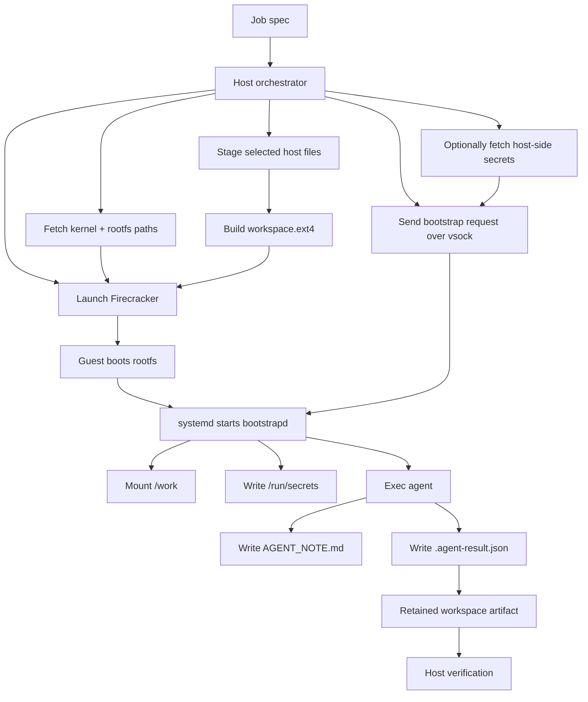

# Firecracker VM

This project is a local reference runtime for "one microVM per job" coding-agent execution. The repository combines a Go-based host orchestrator, a small guest bootstrap daemon, a mock coding agent, a reproducible guest-image path, and a growing set of design documents about how to make the guest more capable without eroding the isolation boundary that makes the whole exercise worthwhile.

The short version is that this project now works as a local MVP. It can build a guest image, boot Firecracker, attach a workspace ext4 image, connect to the guest over vsock, inject host-provided secret files, run a mock agent in the guest, and verify the resulting artifact on the host. The more interesting part, though, is what the project is trying to grow into: a comfortable but still disciplined execution substrate for an LLM-driven coding agent.

> [!summary]
> The project currently has three strong identities:
> 1. a working local Firecracker bring-up path with a real guest rootfs and retained workspace image
> 2. a host-mediated secret-delivery design that keeps Vault on the host and secrets in `/run/secrets` inside the guest
> 3. a design program for the next layer of isolation: tooling disks, guest SELinux, and later host SELinux on a dedicated host

## Why this project exists

The problem here is not simply "run code in a VM." A container or even a local subprocess could already do that. The real problem is how to give an autonomous coding agent enough room to explore, build, test, and manipulate files while keeping the host system out of scope, especially the parts of the host that should never become ambient capabilities: home directories, cloud credentials, SSH material, browser sessions, and general-purpose developer state.

That is why the repository naturally gravitates toward Firecracker. Firecracker gives the project a crisp host/guest boundary, a resource model that is explicit rather than magical, and a way to think in terms of prepared images, attached drives, and narrow runtime channels instead of shared process state. That resource model has turned out to be one of the most important design anchors in the repo.

The project also exists because "agent isolation" is often discussed vaguely. This repo is trying to make it concrete. Instead of hand-waving about sandboxes, it asks specific engineering questions:

- What exactly does the host prepare?
- What exactly does the guest see?
- How do files cross the boundary?
- Where do secrets live?
- What gets retained after the run?
- Which parts should be immutable, which should be writable, and which should be ephemeral?

Those questions now shape both the current implementation and the next design tickets.

## What exists today

The repository is no longer only a sketch. The current state is a working local reference implementation with validated smoke paths.

At the moment, the codebase includes:

- a host orchestrator in Go
- a guest bootstrap daemon in Go
- a mock agent in Go
- a rootfs build pipeline
- a pinned kernel fetch path
- a Firecracker fetch path
- a no-Vault end-to-end smoke test
- a host-Vault end-to-end smoke test
- a local Docker Compose Vault test bed
- host-side artifact verification for the retained workspace ext4 image
- a set of ticket-based design documents and investigation diaries under `ttmp/`

More importantly, those pieces are not only present in source form. They have been exercised locally in the repository’s documented bring-up path.

### What is already working

- build guest binaries with `./scripts/build-guest-binaries.sh`
- build a Debian-based guest rootfs with `./scripts/build-rootfs.sh`
- fetch Firecracker and a pinned guest kernel with repo-managed scripts
- launch a VM through `cmd/orchestrator`
- auto-start `bootstrapd` inside the guest
- mount `/work` from a per-job ext4 image
- write `/work/AGENT_NOTE.md`
- write `/work/.agent-result.json`
- verify the retained workspace image from the host
- read secrets from host-side Vault and materialize them inside the guest under `/run/secrets`

### What is not finished yet

- a formal multi-disk filesystem contract with `/opt/tools`
- richer rootfs/tool-profile composition
- cleaner sync and unmount behavior before artifact inspection
- guest SELinux implementation
- host SELinux implementation on a SELinux-native host
- a full tool-rich guest profile that maximizes agent comfort without host exposure

## The simplest mental model

The best mental model for the project is:

**The host prepares sealed inputs, the guest consumes them, and the output comes back as a filesystem artifact.**

That is a more useful model than thinking of the VM as "a more isolated shell." The host is not supposed to give the guest live host directories. Instead, the host composes a specific execution environment out of:

- a kernel
- a rootfs image
- one or more extra block devices
- a bootstrap request over vsock
- optional network setup

The guest, in turn, is not supposed to discover the host. It is supposed to:

- boot
- receive a request
- mount the intended filesystems
- materialize the intended secrets
- run the workload
- leave a bounded output artifact behind

## Project shape

At a high level, the repository now has four layers.

### 1. Host control plane

This is where the repo decides what the guest gets. The orchestrator:

- reads the job spec
- stages host files into a temporary tree
- turns that tree into an ext4 image
- launches Firecracker
- attaches the kernel, rootfs, workspace drive, and vsock
- optionally fetches secrets from Vault
- sends one bootstrap request to the guest

### 2. Guest bootstrap layer

This is the minimal guest-side coordination layer. `bootstrapd` is responsible for:

- listening on vsock
- receiving the bootstrap payload
- mounting the workspace
- writing secret files into `/run/secrets`
- launching the agent command

### 3. Guest workload

The current workload is intentionally simple. `mock-agent` is not the final workload model; it is a proving tool. Its job is to demonstrate that the guest sees the correct workspace and secret files and can write a result artifact back into the mounted workspace image.

### 4. Design and operations layer

The repository now has a serious documentation spine. The `ttmp/` ticket workspaces track:

- rootfs and bootstrap bring-up
- host-mediated secret design
- rootfs/mount/tooling evolution
- guest SELinux design
- host SELinux design

That matters because the project is now half implementation and half architectural refinement.

## Architecture

The current system can be drawn as a staged pipeline from host prep to guest execution to host verification.



The most important architectural property is that the guest does not get live access to the host filesystem. Instead, host-visible files become guest-visible only after deliberate staging and repackaging.

## Implementation details

This is the part a new contributor needs to understand before trying to modify the project.

### The current host flow

The host orchestrator is already structurally correct for this kind of system. It does not need a redesign so much as a gradual enrichment of the resource model.

The host currently does the following:

1. Load a job spec from `examples/` or a smoke-test-generated input.
2. Stage host files and directories into a temporary tree.
3. Convert that tree into an ext4 image for the guest workspace.
4. Start Firecracker and configure:
   - the kernel
   - the rootfs drive
   - the workspace drive
   - vsock
   - optional networking
5. Wait for the guest bootstrap listener on vsock.
6. Send one bootstrap request containing mount and secret information.
7. Wait for streamed logs and final agent completion.
8. Verify the retained workspace artifact on the host side.

Pseudocode for the host path:

```text
spec = load_spec()
workspace_tree = stage_host_inputs(spec.workspace.entries)
workspace_img = build_ext4_image(workspace_tree, label="JOBFS")

vm = start_firecracker(
  kernel=spec.vm.kernel_image,
  rootfs=spec.vm.rootfs_image,
  extra_drives=[workspace_img],
  vsock=true,
  network=spec.network
)

secret_files = resolve_host_secret_files(spec.vault)
req = build_bootstrap_request(spec, secret_files)
send_vsock_request(vm, req)
stream_logs_until_exit(vm)
verify_workspace_artifact(workspace_img)
```

### The guest side is deliberately minimal

The guest is intentionally not a large service mesh or a general-purpose long-running OS environment. It is a focused execution endpoint. That design keeps the guest legible and easier to harden later.

The guest startup model is:

```text
boot rootfs
systemd starts bootstrapd
bootstrapd listens on vsock :7000
host sends request
bootstrapd mounts /work
bootstrapd writes /run/secrets
bootstrapd runs the agent
agent writes files back to /work
host verifies retained image
```

The important design choice is that `bootstrapd` owns the transition from "booted guest" to "job-specific environment." That means:

- the rootfs can stay generic
- host-side preparation remains explicit
- future mount models can evolve in one place
- guest SELinux later has a single primary bootstrap domain to anchor on

### Why the workspace is an ext4 artifact instead of a live mount

This is one of the most valuable ideas in the project so far.

A container-style mindset would say: just mount the host directory you want and let the agent work there. That is operationally convenient, but it is architecturally weak. It means the guest sees a live host path, and once that starts happening, it becomes much easier for convenience to outrun the security model.

The current repo instead follows a safer pattern:

- select the host files
- stage them
- package them
- attach them as a guest drive
- treat the resulting ext4 image as the boundary artifact

That gives you reproducibility and reviewability. You can ask: exactly what did the guest receive? The answer is: whatever was in the workspace image, nothing more.

### The host-mediated Vault pivot was the right move

One of the major design clarifications in the repo was removing the legacy guest-side Vault path and standardizing on host-mediated secrets.

The old conceptual option was:

- host launches guest
- guest runs Vault Agent
- guest authenticates against Vault
- guest renders secret files locally

The adopted design is:

- Vault runs on the host
- the host reads the required secret material
- the host turns those into concrete secret files
- the guest receives them over vsock
- the guest writes them into `/run/secrets`

That simplification matters for several reasons.

First, it keeps the guest smaller. The guest no longer needs a `vault` binary or guest-side secret bootstrap process just to start a job.

Second, it keeps the trust model cleaner. The host already has to decide what the guest is allowed to know. Pulling that decision up to the host means the guest receives exactly the secret material it needs, not a more general Vault capability surface.

Third, it reduces operational complexity. Guest networking is no longer a prerequisite for the secret path.

The design can be summarized like this:

```mermaid
flowchart LR
    A[Host Vault] --> B[orchestrator]
    B --> C[secret_files payload]
    C --> D[vsock]
    D --> E[bootstrapd]
    E --> F[/run/secrets]
    F --> G[guest workload]
```

### Artifact verification reveals the real boundary

Another subtle but important part of the implementation is the host-side verification script. The output of a run is not merely a log line or a returned JSON blob. The meaningful output is the retained workspace image that contains the files the guest wrote.

That choice is good because it matches the architectural reality. A microVM should leave a bounded artifact, not a live, shared, mutable host tree.

The verification process currently looks like this:

```text
copy workspace image
replay journal if needed
inspect files with debugfs
confirm AGENT_NOTE.md exists
confirm .agent-result.json exists
optionally confirm expected secret-derived behavior
```

That verification script is one of the clearest expressions of what the system actually is: not a remote shell, but a controlled build-and-return pipeline.

### The key non-obvious implementation details

Several practical details from the implementation work are worth recording because they would otherwise be rediscovered painfully.

#### Binary naming mismatch

`go build ./...` emits `mockagent`, but the guest runtime expects `/usr/local/bin/mock-agent`. The rootfs installation path must therefore rename the binary during guest installation. This is exactly the kind of small mismatch that can make a guest image look "almost right" while still failing at runtime.

#### Boot args matter more than they seem

The original default boot args were enough to boot toward a serial console but not explicit enough about the actual root device. Real guest-image work needs the boot path to reflect the guest’s real rootfs attachment model, not only Firecracker’s generic boot recommendations.

#### Sync behavior is a real follow-up item

Artifact verification works today, but the project still wants a cleaner "guest syncs and unmounts before host inspection" flow. That is not polish. It is part of making the filesystem boundary explicit and trustworthy.

#### The resource model should continue to get more explicit, not less

Almost every good design decision in the repo has come from making the model more explicit:

- explicit kernel
- explicit rootfs
- explicit workspace drive
- explicit vsock bootstrap
- explicit secret files
- explicit retained artifact

The next stage should preserve that direction.

## Current filesystem model and next filesystem model

Right now the guest sees:

```text
Guest
├─ /            <- rootfs.ext4
├─ /work        <- workspace.ext4
└─ /run/secrets <- runtime-only secret files
```

That is already a clean design for a first implementation. The next design track is about making it more capable without sacrificing that clarity.

The proposed next model adds a read-only tooling disk:

```mermaid
flowchart LR
    subgraph Host
        A[rootfs.ext4]
        B[tools.ext4]
        C[workspace.ext4]
        D[secret_files payload]
    end

    subgraph Guest
        E[/]
        F[/opt/tools]
        G[/work]
        H[/run/secrets]
    end

    A --> E
    B --> F
    C --> G
    D --> H
```

This is a much better answer to "how do we give the agent more tools?" than host bind mounts. Instead of exposing the live host, the project can:

- build richer rootfs profiles
- attach read-only tooling images
- keep mutable work in `/work`
- keep secrets in `/run/secrets`

That lets the guest become more comfortable without becoming more dangerous.

## Current user-facing commands

The stable entrypoints today are:

```bash
make smoke-no-vault
make smoke-host-vault
```

The supporting bring-up path is:

```bash
./scripts/build-guest-binaries.sh
./scripts/fetch-firecracker.sh --version v1.15.0
./scripts/fetch-kernel.sh --metadata guest/kernel-x86_64-v1.15.env
./scripts/build-rootfs.sh \
  --build-mode docker \
  --rootfs-out artifacts/rootfs/rootfs.ext4 \
  --staging-dir /tmp/fcvm-rootfs-docker \
  --dist-dir dist/guest
```

And the local Vault smoke path is:

```bash
docker compose -f dev/vault/compose.yml up -d vault
COMPOSE_PROFILES=init docker compose -f dev/vault/compose.yml run --rm vault-init
VAULT_ADDR=http://127.0.0.1:8200 VAULT_TOKEN=root make smoke-host-vault
```

## Important project docs

The repo now has a serious internal document trail. The most important current references are:

### Main implementation/baseline ticket

- `/home/manuel/code/wesen/2026-03-31--firecracker-vm/ttmp/2026/03/31/guest-image-bootstrap-setup--guest-image-kernel-and-bootstrap-setup/index.md`
- `/home/manuel/code/wesen/2026-03-31--firecracker-vm/ttmp/2026/03/31/guest-image-bootstrap-setup--guest-image-kernel-and-bootstrap-setup/design-doc/01-guest-image-build-kernel-selection-and-bootstrap-wiring-guide.md`

### Next-stage filesystem and isolation tickets

- `/home/manuel/code/wesen/2026-03-31--firecracker-vm/ttmp/2026/03/31/rootfs-mount-and-tooling--rootfs-mount-and-tooling-image-architecture/index.md`
- `/home/manuel/code/wesen/2026-03-31--firecracker-vm/ttmp/2026/03/31/guest-selinux-design--guest-selinux-design-and-tool-confinement/index.md`
- `/home/manuel/code/wesen/2026-03-31--firecracker-vm/ttmp/2026/03/31/host-selinux-design--host-selinux-design-for-firecracker-jailer-and-brokers/index.md`

### Root onboarding doc

- `/home/manuel/code/wesen/2026-03-31--firecracker-vm/README.md`

## Open questions

The project now has better questions than it did at the start, which is a sign of progress.

- How should the final multi-disk `mounts` model be represented in the job spec and bootstrap protocol?
- Should tooling be one large read-only image or a composable set of profile disks?
- How far should host-side secret rendering go beyond field-to-file mapping?
- What is the cleanest guest-side finalization flow before artifact verification?
- Which guest capability classes deserve their own SELinux domains first?
- What should the dedicated SELinux-native host for the later host-policy phase be?

## Near-term next steps

The next concrete implementation work should happen in this order:

1. implement the rootfs/mount/tool-disk ticket
2. formalize the multi-disk spec and bootstrap contract
3. add read-only tooling-image support and `/opt/tools`
4. improve guest sync and unmount behavior
5. then implement guest SELinux on top of the clearer filesystem model
6. defer host SELinux to a dedicated SELinux-native host instead of forcing it onto the current Ubuntu machine

## Why this project matters

This repository is interesting because it has already moved beyond toy sandbox rhetoric and into real engineering choices. It does not just say "use a VM." It is beginning to answer the harder follow-up question: what does a disciplined, agent-friendly, host-protective VM runtime actually look like in code, filesystems, and secret flows?

The current MVP is already useful because it proves the baseline:

- the host can prepare a bounded guest environment
- the guest can execute within it
- the output can come back as a bounded artifact
- secrets can be delivered without making the guest a general Vault client

The next phase is where the project becomes more ambitious. If the tooling-disk model, guest SELinux model, and later host SELinux model land cleanly, this repo becomes much more than a boot demo. It becomes a real design study in how to build a comfortable but intentionally constrained runtime for autonomous coding work.

## Project working rule

> [!important]
> Prefer explicit images, explicit mounts, and explicit secret delivery over convenience shortcuts.
> If a guest-visible path is not intentionally built into an image or sent through a narrow runtime interface, it probably should not be exposed at all.
