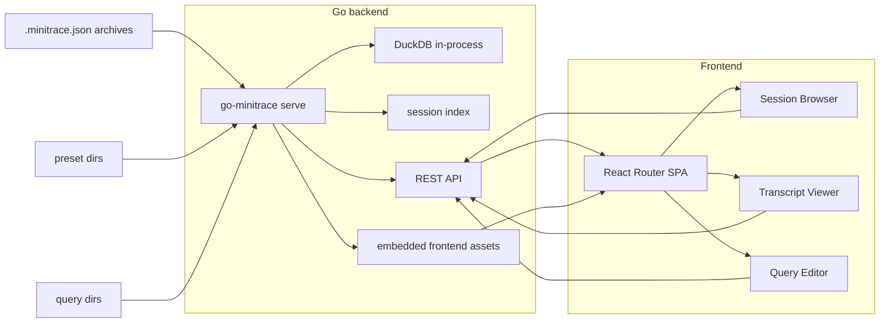
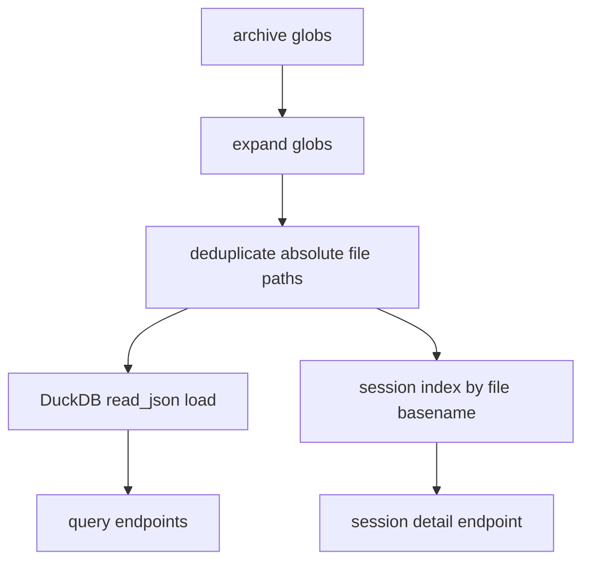

# go-minitrace Web UI and Transcript Explorer

The `go-minitrace` web UI is a browser front-end for exploring converted `.minitrace.json` archives without dropping into a shell for every question. It turns the existing CLI pipeline into an interactive system: load an archive once, browse sessions in a table, open a transcript as structured conversation blocks, and run ad hoc DuckDB SQL in the same process.

> [!summary]
> The web UI currently has three closely related identities:
> 1. a session browser for scanning a loaded archive quickly
> 2. a transcript reader that reconstructs sessions into human blocks and artifact summaries
> 3. a file-backed SQL workbench with preset queries, saved queries, and live-ish file reload behavior

## Why this project exists

The original `go-minitrace` CLI is already strong at machine-oriented workflows:

- discover sessions
- convert them into a common archive format
- query them with DuckDB

What it lacked was a tight human analysis loop. During the WESEN-OS deployment investigation, the painful parts were obvious:

- finding an interesting session in SQL was easy, but reading the transcript behind it was slow
- drilling from a session list into the actual conversation required writing a second query
- iterating on SQL meant going back to the terminal repeatedly
- saved queries were just `.sql` files in directories, with no interface for browsing or loading them

The web UI exists to close that loop. It does not replace the CLI pipeline. It wraps it in a long-running server with a resident DuckDB connection and a small SPA that sits on top of the same archive.

## Current project status

The UI is implemented and usable today.

What already exists:

- `go-minitrace serve` as a Glazed command
- an embedded React SPA served by the Go binary outside `--dev`
- a session browser with filtering and session-level metrics
- a transcript viewer with block decomposition, tool-call expansion, and artifact badges
- a query editor with CodeMirror, RTK Query-backed execution, and file-backed preset/saved query libraries
- multi-root support for `--archive-glob`, `--preset-dir`, and `--query-dir`
- non-destructive hot reload for file-backed queries loaded into the editor

What is still incomplete or still prototype-grade:

- the server is intentionally small and standard-library based; there is no auth, pagination, or multi-user model
- query editor hot reload is polling-based rather than push-based
- some of the UX is still implementation-first rather than deeply polished
- the Storybook/test toolchain is stable enough to build, but still emits a transitive Vite peer warning through Storybook internals

## What the UI does

At a user level, the UI has three screens.

### 1. Session Browser

The Session Browser loads `GET /api/sessions` and renders a filterable table of archive summaries. Each row exposes:

- session ID
- start time
- wall duration and active duration
- active percentage badge
- title
- turn count
- tool call count
- model
- working directory

This is the fastest way to answer "what sessions are in this archive?" and "which ones look worth reading?"

### 2. Transcript Viewer

The Transcript Viewer loads `GET /api/sessions/:id` and renders the session as blocks rather than raw turns.

Each block is anchored on a user turn and then contains the following assistant turns and tool calls until the next user turn. This makes the transcript read like an investigation log rather than a flat event stream.

It also annotates blocks with artifact summaries:

- commit messages
- created ticket IDs
- added document titles
- diary-write counts

This matters because the real goal is usually not "read every token" but "find the moments where work products were created."

### 3. Query Editor

The Query Editor is both an ad hoc SQL runner and a browser for query files.

It supports:

- built-in presets exposed by the Go backend
- external preset roots via repeated `--preset-dir`
- writable saved query roots via repeated `--query-dir`
- CodeMirror editing with `Ctrl+Enter` / `Cmd+Enter`
- result rendering in a table
- click-through from result rows into session details
- loading a session-specific starter query via `/query?session=<id>`
- polling-based query-file reload so changes made by another editor or coding agent show up without reloading the page

## Project shape

At a high level the system has four layers:

1. **archive layer**
   - converted `.minitrace.json` files on disk
   - one or more archive globs
2. **backend layer**
   - Glazed command
   - DuckDB connection
   - HTTP API
   - static asset serving
3. **frontend layer**
   - React router pages
   - RTK Query API client
   - MUI layout/components
   - CodeMirror SQL editor
4. **query/library layer**
   - built-in embedded presets
   - external preset directories
   - writable saved query directories

## Architecture



The important design constraint is that DuckDB lives in-process inside the Go server. The browser is not talking to a separate DB service. The browser is talking to a small API server that happens to keep the archive loaded in memory.

## Route and screen structure

The browser-side route tree is intentionally small:

```text
/                  -> redirect to /sessions
/sessions          -> SessionBrowserPage
/sessions/:id      -> TranscriptViewerPage
/query             -> QueryEditorPage
```

The shell layout is defined in:

- `/home/manuel/code/wesen/corporate-headquarters/go-minitrace/web/src/App.tsx`
- `/home/manuel/code/wesen/corporate-headquarters/go-minitrace/web/src/components/AppLayout/AppLayout.tsx`

The app bar does very little:

- show the project identity
- switch between Sessions and Query
- display the number of currently loaded sessions

That simplicity is correct for this tool. The interesting behavior is in the page bodies, not in shell navigation.

## Backend design

The backend is implemented in the `serve` command package:

- `/home/manuel/code/wesen/corporate-headquarters/go-minitrace/cmd/go-minitrace/cmds/serve/serve.go`
- `/home/manuel/code/wesen/corporate-headquarters/go-minitrace/cmd/go-minitrace/cmds/serve/server.go`
- `/home/manuel/code/wesen/corporate-headquarters/go-minitrace/cmd/go-minitrace/cmds/serve/handlers_sessions.go`
- `/home/manuel/code/wesen/corporate-headquarters/go-minitrace/cmd/go-minitrace/cmds/serve/handlers_queries.go`
- `/home/manuel/code/wesen/corporate-headquarters/go-minitrace/cmd/go-minitrace/cmds/serve/blocks.go`
- `/home/manuel/code/wesen/corporate-headquarters/go-minitrace/cmd/go-minitrace/cmds/serve/badges.go`

### Command model

The server is launched through a Glazed bare command. The interesting point is that it uses Glazed for flag/schema definition, but not for row output.

The important flags are all repeatable string-list flags:

- `--archive-glob`
- `--preset-dir`
- `--query-dir`

That means the server can merge:

- multiple archive trees into one DuckDB table
- multiple preset roots into one library
- multiple saved-query roots into one writable library view

This is a good example of using Glazed as configuration schema, not just as pretty CLI output.

### Startup flow

At startup, the server does three things:

1. open DuckDB
2. load all archive matches into one table
3. build a session ID → file path index for direct session detail reads

The mental model is:

```go
settings := decodeGlazedFlags()
conn := OpenConnection(":memory:")
LoadArchive(conn, archiveGlobs, tableName)
sessionIndex := buildSessionIndex(archiveGlobs)
ListenAndServe(conn, sessionIndex, presetDirs, queryDirs)
```

The split between DuckDB and the session index is intentional:

- list queries are fast when they come from DuckDB
- full transcript detail is easier and safer when it comes from the original converted JSON file

This avoids flattening everything into SQL when what the UI really wants is the nested session shape.

### HTTP layer

The HTTP layer uses `net/http` and `http.ServeMux`, not a bigger framework. That is a good fit here because the API surface is narrow.

The current API surface is:

```text
GET    /api/sessions
GET    /api/sessions/:id
GET    /api/sessions/:id/blocks
POST   /api/query
GET    /api/presets
GET    /api/queries
POST   /api/queries
PUT    /api/queries/:path...
DELETE /api/queries/:path...
```

The backend returns explicit DTOs rather than reusing the raw minitrace schema directly. That normalization layer matters because the underlying Go schema is pointer-heavy while the frontend expects stable required fields.

## Frontend design

The frontend is a React + TypeScript + MUI SPA with Redux Toolkit and RTK Query.

Key code locations:

- `/home/manuel/code/wesen/corporate-headquarters/go-minitrace/web/src/main.tsx`
- `/home/manuel/code/wesen/corporate-headquarters/go-minitrace/web/src/api/minitrace.ts`
- `/home/manuel/code/wesen/corporate-headquarters/go-minitrace/web/src/pages/SessionBrowserPage.tsx`
- `/home/manuel/code/wesen/corporate-headquarters/go-minitrace/web/src/pages/TranscriptViewerPage.tsx`
- `/home/manuel/code/wesen/corporate-headquarters/go-minitrace/web/src/pages/QueryEditorPage.tsx`

The division of labor is clean:

- **RTK Query** owns network access and caching
- **Redux UI slice** owns a small amount of shared UI state like filter text and the current editor SQL
- **pages** adapt API hooks into component props
- **components** render the actual interaction model

The UI is not doing heavy client-side data modeling. Most of the structure comes from the backend already normalized.

## Implementation details

This is the part that matters if someone needs to change the system.

### 1. Archive loading and session indexing

The server needs both relational access and nested access.

DuckDB is used for relational work:

- session list
- arbitrary query editor SQL
- result sets

But session detail still comes from the underlying JSON archive files.

Why not read session detail from DuckDB too? Because the transcript view needs a nested, semantically rich structure:

- turns
- tool calls
- badges
- blocks
- artifact summaries

That is easier to construct from the original `minitrace.Session` than from ad hoc SQL reconstruction.

The backend therefore uses a two-track load:



The session index uses the filename stem as the session ID:

```text
019d376d-0103-7dc3-a96d-650c7c2e1cf7.minitrace.json
-> 019d376d-0103-7dc3-a96d-650c7c2e1cf7
```

That is simple, but it is also a deliberate constraint: duplicate session IDs across archive roots are treated as an error.

### 2. DTO normalization instead of raw schema reuse

The backend does not simply marshal `minitrace.Session` to JSON.

Instead it defines response structs like:

- `SessionSummaryResponse`
- `SessionDetailResponse`
- `SessionTimingResponse`
- `SessionMetricsResponse`
- `SessionOperationalContextResponse`

That normalization step solves a real mismatch:

- the Go schema uses many pointers and optional fields
- the frontend types want predictable values for common fields

Without this layer, the React components would become full of `?.` checks and schema conditionals. That would be the wrong side of the system to absorb format ambiguity.

### 3. Block decomposition as the core transcript abstraction

The transcript viewer does not render raw turns first and then style them. It renders **blocks**, and blocks are computed on the backend.

The algorithm in `/cmd/go-minitrace/cmds/serve/blocks.go` is conceptually:

```go
for each turn in session.turns:
    if turn.role == "user":
        close previous block
        start new block anchored on this user turn

    append normalized turn to current block

    if turn.role != "user":
        current.agentTurns++

    current.toolCalls += len(turn.ToolCallsInTurn)

after loop:
    close final block

for each block after the first:
    compute gapMinutes from previous user timestamp
```

This gives the transcript a human reading structure:

- a user asks for something
- the agent responds
- the agent uses tools
- the block ends when the human interrupts with a new request

That block model is substantially better than a flat event stream for real session archaeology.

### 4. Artifact detection is heuristic on purpose

The badge/artifact system in `/cmd/go-minitrace/cmds/serve/badges.go` is not trying to be a full semantic parser. It is a light heuristic layer over tool calls.

It recognizes patterns like:

- `git commit -m "..."`
- `docmgr ticket create`
- `docmgr doc add`
- diary writes

From that it derives:

- per-tool-call badges
- per-block artifact summaries

That means a transcript block can say "this is where a ticket was created" or "this is where the commit happened" without needing a second analysis query.

This is exactly the kind of value a UI should add over raw logs: not just prettier rendering, but lightweight semantic indexing.

### 5. Query library merging and deterministic write behavior

The query library is more interesting than it first appears because it has to merge multiple roots.

Current behavior:

- built-in presets come first
- external preset dirs are loaded in configured order
- saved query dirs are loaded in configured order
- duplicate relative paths are shadowed by earlier roots
- creating a new saved query writes into the first `query-dir`
- updating or deleting a saved query resolves the first matching file across the query roots

That gives the server a deterministic rule set instead of "whichever file happened to be seen first on disk."

The path-handling code also explicitly sanitizes relative paths so query CRUD does not become a directory traversal bug.

### 6. File-backed query hot reload

One of the more useful recent pieces is the editor-side hot reload behavior for file-backed queries.

The backend side already rescanned preset and query directories on each API fetch. The missing piece was client-side ownership tracking.

The query page now keeps:

- which file the editor content came from
- the SQL that was last loaded from disk
- whether the file has changed since load

The reconciliation logic is roughly:

```ts
if latestSql === lastLoadedSql:
    nothing changed on disk
else if currentEditorSql === lastLoadedSql:
    safe to auto-reload
else:
    mark "external update available"
    do not overwrite local edits
```

That matters because the intended workflow is collaborative:

- load a query from disk
- edit it in an external editor or coding agent
- let the browser pick up the change
- do not clobber manual edits already in the browser

This is a small feature, but it changes the feel of the tool from "static SQL library" to "live analysis workbench."

### 7. CodeMirror integration

The SQL editor is implemented with CodeMirror rather than a plain `<textarea>`.

The `SqlEditor` component wires:

- SQL language support
- active line highlighting
- line numbers
- `Ctrl+Enter` / `Cmd+Enter` execution
- an explicit synchronization path from external Redux state into the editor buffer

The external value sync matters because the editor is not purely local-state driven. It needs to react to:

- selecting a preset
- selecting a saved query
- opening `/query?session=<id>`
- reloading the buffer from an externally changed file

That means the editor must support both local editing and controlled external replacement.

### 8. Embedded frontend + Vite-first dev mode

The project intentionally supports two modes:

#### Production / single-binary mode

```bash
go run ./cmd/go-minitrace serve --archive-glob '/tmp/minitrace-output/active/*/*.minitrace.json'
```

In this mode the Go binary serves:

- the REST API
- the embedded frontend assets
- SPA fallback routing

#### Development mode

```bash
go run ./cmd/go-minitrace serve \
  --archive-glob '/tmp/minitrace-output/active/*/*.minitrace.json' \
  --dev

cd web
npm run dev
```

In dev mode:

- Go serves only `/api`
- Vite serves the frontend
- Vite proxies `/api` to `http://localhost:8080`

This is the correct split for frontend iteration because it preserves hot module replacement while keeping the Go server simple.

### 9. Mock service worker handling

There is a subtle but important implementation detail in `/web/src/main.tsx`: mock service worker support is **opt-in** in dev mode, and the app actively unregisters stale mock workers if they were left behind by earlier runs.

This solved a real confusion case:

- the frontend looked wired to the real backend
- but a previously registered MSW worker was still intercepting `/api`
- deep links and session IDs looked broken because the mock catalog did not contain the real session data

The current rule is much safer:

- use the real backend by default
- only enable MSW when `VITE_USE_MSW=true`
- unregister stale workers when not using mocks

## How to use it

### Basic single-binary run

```bash
go run ./cmd/go-minitrace serve \
  --archive-glob '/tmp/minitrace-output/active/*/*.minitrace.json'
```

Then open `http://127.0.0.1:8080`.

### With multiple archive roots

```bash
go run ./cmd/go-minitrace serve \
  --archive-glob '/tmp/minitrace-output/active/*/*.minitrace.json' \
  --archive-glob '/tmp/other-archive/**/*.minitrace.json'
```

### With extra preset and saved-query roots

```bash
go run ./cmd/go-minitrace serve \
  --archive-glob '/tmp/minitrace-output/active/*/*.minitrace.json' \
  --preset-dir ./queries/team \
  --preset-dir ./queries/investigations \
  --query-dir ./queries/shared \
  --query-dir ./queries/private
```

### Frontend development loop

```bash
go run ./cmd/go-minitrace serve \
  --archive-glob '/tmp/minitrace-output/active/*/*.minitrace.json' \
  --dev

cd web
npm run dev
```

### Refreshing embedded assets

```bash
make frontend
```

## Main user workflows

The most natural workflows right now are:

### Session triage

1. open `/sessions`
2. filter by title, model, working directory, or session ID
3. scan active percentage, turn count, and duration
4. open a promising session

### Transcript archaeology

1. open a session
2. scan block headers for gaps and artifact chips
3. expand blocks around commits, ticket creation, or diary writes
4. inspect the surrounding tool calls

### Query-driven drilldown

1. open `/query`
2. load a preset or saved query
3. run it
4. click a session ID in results
5. jump into transcript view

### External-editor query iteration

1. load a saved query from disk in the browser
2. edit the `.sql` file from another editor or coding agent
3. wait for the polling refresh
4. either accept the auto-reload or use the warning banner to reload manually if the browser buffer has diverged

## Important project docs

The most important current docs for this subsystem are repo-local:

- `/home/manuel/code/wesen/corporate-headquarters/go-minitrace/ttmp/2026/04/01/WESEN-OS-001--inspect-wesen-os-deployment-via-go-minitrace-codex-session-analysis/design-doc/03-minitrace-transcript-explorer-ui.md`
- `/home/manuel/code/wesen/corporate-headquarters/go-minitrace/ttmp/2026/04/01/WESEN-OS-001--inspect-wesen-os-deployment-via-go-minitrace-codex-session-analysis/design-doc/04-backend-implementation-guide-go-minitrace-serve.md`
- `/home/manuel/code/wesen/corporate-headquarters/go-minitrace/ttmp/2026/04/01/WESEN-OS-001--inspect-wesen-os-deployment-via-go-minitrace-codex-session-analysis/reference/01-diary.md`

They represent:

- the original screen design
- the backend implementation contract
- the actual implementation diary, fixes, and validation steps

## Tricky details and failure modes

These are the details most likely to trip up future work.

### Archive duplication is treated as a correctness error

If two archive roots contain the same session ID, the startup session index fails. That is the right failure mode. Silent "last one wins" behavior would make transcript reads non-deterministic.

### Query root ordering matters

Earlier preset/query roots shadow later roots on the same relative path. That is intentional, but it means root order is part of configuration semantics.

### Browser hot reload is polling, not filesystem subscription

The system does not push file changes over websockets or watch the filesystem continuously. The query page polls the existing APIs. That is good enough for the current workflow, but the latency is bounded by the poll interval.

### Storybook is now aligned, but a transitive warning remains

The stale `@storybook/test` 8.x package was removed and story helpers were migrated to `storybook/test`, which fixed `npm ci` and `make frontend`. There is still a non-fatal Vite peer warning from a transitive Storybook package. It is not blocking, but it is a signal that the UI toolchain is still one layer away from fully clean dependency resolution.

## Open questions

- Should the transcript viewer eventually support stronger navigation between query results and exact transcript positions, not just session-level jumps?
- Should block decomposition remain heuristic and backend-side, or become configurable with alternate grouping modes?
- Should query hot reload move from polling to explicit push notifications or a lightweight websocket channel?
- Should saved query metadata grow beyond `name`, `folder`, `description`, and raw SQL?
- Should the frontend stay MUI-first, or eventually move toward a more custom visual language once the analysis workflow stabilizes?

## Near-term next steps

- add richer query CRUD in the frontend, including rename/move and maybe duplicate
- improve transcript navigation for very large sessions
- add more artifact recognizers beyond commits/docmgr/diary heuristics
- expose more session-level filtering on the backend if the session catalog becomes much larger
- clean up the remaining Storybook/Vite transitive warning if the toolchain starts to drift again

## Project working rule

> [!important]
> Keep the web UI thin where possible.
> Put transcript semantics, query-library rules, and archive loading rules in the backend, and let the frontend focus on navigation, inspection, and iteration rather than reconstructing domain logic client-side.
