# Playbook: Self-Contained Go/Wasm + JavaScript Browser Applications

This is a practical playbook for building browser applications that combine Go compiled to WebAssembly with JavaScript. It covers project structure, the Go/JS interop model, build tooling, dev server setup, worker integration, and the failure modes you will actually hit. The reference implementation is the [[PROJ - SQLide Browser - Go Wasm SQL IDE|SQLide Browser]] project.

The target audience is someone who already writes Go and JavaScript and wants to know how to wire them together in the browser without a framework.

## When to use this pattern

Use Go/Wasm in the browser when:

- you have existing Go logic (parsers, protocol handlers, validators, data transforms) that you want to reuse in a browser app without rewriting it in JavaScript
- you need a computation kernel that benefits from Go's type system and standard library but does not need DOM access
- you want to share code between a Go CLI and a browser UI
- you are exploring whether a Go library works under `GOOS=js GOARCH=wasm`

Do not use this pattern when:

- the Go module would be a thin wrapper around `syscall/js` calls — you are just writing JavaScript in Go syntax
- binary size matters critically (the Go runtime adds ~2–4 MB to the Wasm binary)
- you need multi-threaded computation (Go's browser Wasm is single-threaded)
- the computation must run off the main thread (Go's `syscall/js` only works on the main thread, not in workers)

## Project layout

A clean layout separates Go source from web source. Vite expects `public/` for static assets that are copied as-is, and `src/` for modules it will bundle.

```
project-root/
├── cmd/myapp/main.go        # Go/Wasm entry point
├── go.mod
├── scripts/
│   └── build-go.mjs         # Go compile + wasm_exec.js copy
├── public/
│   └── go/
│       ├── main.wasm         # (generated)
│       └── wasm_exec.js      # (generated, copied from GOROOT)
├── src/
│   ├── main.js               # application entry point
│   ├── go-bridge.js          # Go/Wasm loader
│   ├── some-worker.js        # optional Web Worker
│   └── style.css
├── index.html
├── package.json
├── vite.config.mjs
└── .gitignore                # must include node_modules
```

Rules:

- Go code goes under `cmd/` (or a top-level `main.go` if there is only one target)
- Built Wasm artifacts go in `public/go/` — Vite copies these to `dist/` verbatim
- JavaScript source goes in `src/` — Vite bundles and optimizes these
- The build script lives in `scripts/` and runs before Vite

## Step 1: The Go module

### go.mod

Keep it minimal. You usually do not need dependencies beyond the standard library.

```go
module example.com/myapp

go 1.23.0
```

### The Go entry point

The Go program's job is to register functions on a global JavaScript object, then block forever.

```go
package main

import (
    "encoding/json"
    "syscall/js"
)

func main() {
    api := js.Global().Get("Object").New()
    api.Set("doSomething", js.FuncOf(doSomethingJS))
    api.Set("transform", js.FuncOf(transformJS))
    js.Global().Set("myApp", api)

    // Block forever. Without this, the Go runtime exits
    // and all exported functions become invalid.
    select {}
}
```

> [!important]
> The `select {}` at the end of `main()` is not optional. When `main()` returns, the Go runtime tears down and all `js.FuncOf` callbacks become dead. The program must block forever.

### The interop contract

The cleanest pattern for Go↔JS data exchange is: **strings in, strings out**.

Go functions receive `js.Value` arguments and return `any` (which Go marshals to a JS value). For complex data, marshal to JSON in Go and parse in JavaScript:

```go
func doSomethingJS(_ js.Value, args []js.Value) any {
    input := args[0].String()
    result := doSomething(input)
    bytes, err := json.Marshal(result)
    if err != nil {
        return ""  // or return an error JSON
    }
    return string(bytes)
}
```

On the JavaScript side:

```javascript
const raw = globalThis.myApp.doSomething(inputString);
const result = raw ? JSON.parse(raw) : null;
```

Why strings instead of constructing JS objects from Go?

- `js.Global().Get("Object").New()` / `.Set()` / `.Call()` is verbose and error-prone
- you lose Go's type safety the moment you touch `js.Value`
- JSON serialization is cheap for the data sizes typical in browser apps
- the JS side gets normal objects it can destructure, spread, and type-check

> [!tip]
> For functions that return simple scalars (a string, a number, a boolean), return them directly. Use JSON only for structured data.

### What Go can and cannot access

Go with `syscall/js` can:

- read and write JS globals
- call JS functions
- register Go functions as JS callbacks
- manipulate the DOM (via `js.Global().Get("document").Call(...)`)
- access `localStorage`, `fetch`, `console`, `URL`, etc.

Go with `syscall/js` cannot:

- use cgo (`import "C"` fails on `GOOS=js`)
- run in a Web Worker (the `js/wasm` target assumes main-thread execution)
- spawn real OS threads or use `os/exec`
- access the filesystem (`os.Open` etc. do not work)
- use `net/http` for serving (no sockets)

If you need to call complex browser APIs, it is almost always better to write a thin JS function and call it from Go than to replicate the API surface in `syscall/js` calls.

## Step 2: The build script

The build script compiles Go to Wasm and copies the matching `wasm_exec.js` from the Go installation.

### scripts/build-go.mjs

```javascript
import { spawnSync } from 'node:child_process';
import { copyFileSync, existsSync, mkdirSync } from 'node:fs';
import { dirname, join } from 'node:path';
import { fileURLToPath } from 'node:url';
import process from 'node:process';

const rootDir = dirname(dirname(fileURLToPath(import.meta.url)));
const publicGoDir = join(rootDir, 'public', 'go');
mkdirSync(publicGoDir, { recursive: true });

function run(command, args, extraEnv = {}) {
  const result = spawnSync(command, args, {
    cwd: rootDir,
    env: { ...process.env, ...extraEnv },
    encoding: 'utf8',
    stdio: ['ignore', 'pipe', 'pipe'],
  });
  if (result.status !== 0) {
    throw new Error(
      [command, ...args].join(' ') + ' failed.\n' +
      (result.stderr?.trim() || result.stdout?.trim() || '')
    );
  }
  return result.stdout.trim();
}

// 1. Find wasm_exec.js
const goRoot = run('go', ['env', 'GOROOT']);
const candidates = [
  join(goRoot, 'misc', 'wasm', 'wasm_exec.js'),  // Go ≤1.23
  join(goRoot, 'lib', 'wasm', 'wasm_exec.js'),    // older layout
];
const wasmExecPath = candidates.find(existsSync);
if (!wasmExecPath) {
  throw new Error(`Cannot find wasm_exec.js under ${goRoot}`);
}

// 2. Compile Go to Wasm
run('go', ['build', '-o', join(publicGoDir, 'main.wasm'), './cmd/myapp'], {
  GOOS: 'js',
  GOARCH: 'wasm',
});

// 3. Copy wasm_exec.js
copyFileSync(wasmExecPath, join(publicGoDir, 'wasm_exec.js'));
console.log('Go/Wasm build complete.');
```

> [!warning]
> **`wasm_exec.js` must match the Go version that compiled the binary.** A Go 1.23 binary requires Go 1.23's `wasm_exec.js`. Mixing versions causes silent runtime failures — the Wasm module may appear to load but functions return garbage or panic.

### Wiring into package.json

```json
{
  "scripts": {
    "build:go": "node scripts/build-go.mjs",
    "dev": "npm run build:go && vite",
    "build": "npm run build:go && vite build",
    "preview": "vite preview"
  }
}
```

`npm run dev` recompiles Go, then starts Vite. During development, if you change Go code, restart `npm run dev`. Vite HMR does not know about Go files.

> [!tip]
> For faster iteration during Go development, run `node scripts/build-go.mjs` in a separate terminal and let Vite pick up the changed `.wasm` file. Vite serves `public/` files without bundling, so the new binary is available immediately on refresh.

## Step 3: The JavaScript bridge

### Loading wasm_exec.js

`wasm_exec.js` is a classic script (not an ES module). It defines `window.Go`, which is the bootstrap constructor. In a Vite project using ES modules, you must inject it dynamically:

```javascript
// src/go-bridge.js

const wasmScriptPath = '/go/wasm_exec.js';
const wasmBinaryPath = '/go/main.wasm';

function loadClassicScript(src) {
  return new Promise((resolve, reject) => {
    if (document.querySelector(`script[data-wasm="${src}"]`)) {
      if (window.Go) return resolve();
    }
    const script = document.createElement('script');
    script.src = src;
    script.async = true;
    script.dataset.wasm = src;
    script.onload = () => resolve();
    script.onerror = () => reject(new Error(`Failed to load ${src}`));
    document.head.appendChild(script);
  });
}
```

### Instantiating the Go runtime

```javascript
async function instantiateGo() {
  await loadClassicScript(wasmScriptPath);

  if (typeof window.Go !== 'function') {
    throw new Error('wasm_exec.js loaded but window.Go is not available.');
  }

  const go = new window.Go();

  // Prefer streaming instantiation; fall back to ArrayBuffer.
  let result;
  try {
    result = await WebAssembly.instantiateStreaming(
      fetch(wasmBinaryPath),
      go.importObject,
    );
  } catch {
    const response = await fetch(wasmBinaryPath);
    const bytes = await response.arrayBuffer();
    result = await WebAssembly.instantiate(bytes, go.importObject);
  }

  // go.run() returns a promise that resolves when main() returns.
  // Since our Go main() blocks forever, this promise never settles.
  go.run(result.instance);

  // Poll for the global that Go registers.
  const deadline = performance.now() + 3000;
  while (!globalThis.myApp) {
    if (performance.now() > deadline) {
      throw new Error('Go/Wasm bridge did not register in time.');
    }
    await new Promise((r) => setTimeout(r, 10));
  }

  return globalThis.myApp;
}
```

### The polling step

This is the part that catches people off guard. `go.run(instance)` starts the Go goroutine, but the promise it returns resolves when `main()` exits — which is never, because of `select {}`. The Go `main()` function runs its setup code asynchronously (from JavaScript's perspective), so you must poll for the global object that Go registers.

A 3-second timeout with 10ms polling is practical. The Go `main()` function typically completes in under 100ms. If it takes longer, something is wrong.

### Wrapping exported functions

Create a clean JavaScript API object instead of exposing the raw globals:

```javascript
let bridge;

export async function loadGoBridge() {
  if (!bridge) {
    const raw = await instantiateGo();
    bridge = {
      doSomething(input) {
        const result = raw.doSomething(input);
        return result ? JSON.parse(result) : null;
      },
      getVersion() {
        return raw.getVersion();
      },
    };
  }
  return bridge;
}
```

This gives you a single async entry point that the rest of the application can `await`. The raw `globalThis.myApp` stays an implementation detail.

## Step 4: The Vite config

### Minimal config

```javascript
import { defineConfig } from 'vite';

export default defineConfig({
  // nothing — Vite's defaults handle .js, .css, and public/ assets
});
```

### With cross-origin isolation headers

If you use Web Workers that need `SharedArrayBuffer` (required for SQLite OPFS, useful for other Wasm libraries), you need cross-origin isolation:

```javascript
import { defineConfig } from 'vite';

const isolationHeaders = {
  'Cross-Origin-Embedder-Policy': 'require-corp',
  'Cross-Origin-Opener-Policy': 'same-origin',
};

export default defineConfig({
  server: { headers: isolationHeaders },
  preview: { headers: isolationHeaders },
});
```

> [!warning]
> Cross-origin isolation means **all** resources on the page must be same-origin or served with appropriate CORS headers. This breaks CDN fonts, analytics scripts, and embedded iframes that do not set `Cross-Origin-Resource-Policy: cross-origin`. Only enable this if you actually need `SharedArrayBuffer`.

### Excluding Wasm-heavy npm packages

Some npm packages (like `@sqlite.org/sqlite-wasm`) contain their own `.wasm` files that must be loaded at runtime, not bundled by Vite. Exclude them from dependency optimization:

```javascript
optimizeDeps: {
  exclude: ['@sqlite.org/sqlite-wasm'],
},
```

## Step 5: The HTML entry point

```html
<!doctype html>
<html lang="en">
  <head>
    <meta charset="UTF-8" />
    <meta name="viewport" content="width=device-width, initial-scale=1.0" />
    <title>My App</title>
  </head>
  <body>
    <div id="app"></div>
    <script type="module" src="/src/main.js"></script>
  </body>
</html>
```

Note what is **not** here: no `<script src="wasm_exec.js">`. The bridge loader injects it dynamically. This keeps the HTML clean and avoids load-order issues.

## Step 6: Adding a Web Worker

If your application has an expensive runtime (database engine, image processor, crypto library), run it in a dedicated Web Worker to avoid blocking the main thread.

### The pattern

```mermaid
flowchart LR
    subgraph Main Thread
        JS[main.js]
        GO[Go/Wasm]
    end

    subgraph Worker Thread
        W[worker.js]
        LIB[heavy library]
    end

    JS <--> GO
    JS <-->|postMessage RPC| W
    W --> LIB

    style GO fill:#2d4a22,stroke:#4a7c3f
    style LIB fill:#1a3a5c,stroke:#3a7cbd
```



Go/Wasm stays on the main thread (it needs `syscall/js`). The heavy computation runs in the worker. JavaScript on the main thread brokers between them.

### Creating the worker in Vite

Vite handles worker URLs correctly if you use `new URL` with `import.meta.url`:

```javascript
const worker = new Worker(
  new URL('./some-worker.js', import.meta.url),
  { type: 'module' },
);
```

This tells Vite to bundle the worker as a separate entry point. The `type: 'module'` enables `import` statements inside the worker.

### Promise-wrapping the RPC

A reusable RPC client for talking to any message-based worker:

```javascript
class WorkerRPC {
  constructor(worker) {
    this.worker = worker;
    this.pending = new Map();
    this.nextId = 1;

    this.worker.addEventListener('message', (event) => {
      const { id, ok, result, error } = event.data;
      const deferred = this.pending.get(id);
      if (!deferred) return;
      this.pending.delete(id);
      if (ok) {
        deferred.resolve(result);
      } else {
        const err = new Error(error?.message || 'Worker request failed');
        err.name = error?.name || 'WorkerError';
        deferred.reject(err);
      }
    });
  }

  call(type, payload = {}, transferables = []) {
    return new Promise((resolve, reject) => {
      const id = this.nextId++;
      this.pending.set(id, { resolve, reject });
      this.worker.postMessage({ id, type, payload }, transferables);
    });
  }
}
```

### The worker side

```javascript
// src/some-worker.js

self.onmessage = async (event) => {
  const { id, type, payload } = event.data;
  try {
    const result = await dispatch(type, payload);

    // Support transferable ArrayBuffers for large data
    const transferables = [];
    if (result?.__transferables) {
      transferables.push(...result.__transferables);
      delete result.__transferables;
    }

    self.postMessage({ id, ok: true, result }, transferables);
  } catch (error) {
    self.postMessage({
      id,
      ok: false,
      error: { name: error.name, message: error.message, stack: error.stack },
    });
  }
};

async function dispatch(type, payload) {
  switch (type) {
    case 'compute': return compute(payload);
    case 'export':  return exportData(payload);
    default: throw new Error(`Unknown action: ${type}`);
  }
}
```

> [!important]
> **Error objects are not structured-clonable.** You must serialize them as plain `{ name, message, stack }` objects before sending through `postMessage`. Reconstruct on the other side.

### Transferables for large data

When sending `ArrayBuffer` between threads, use the transferables list to move the memory instead of copying it:

```javascript
// Worker side — exporting bytes
const buffer = serializeToArrayBuffer();
return {
  data: { filename: 'export.bin', size: buffer.byteLength },
  bytes: buffer,
  __transferables: [buffer],
};

// Main thread side — importing bytes
const fileBuffer = await file.arrayBuffer();
const result = await rpc.call('import', { buffer: fileBuffer }, [fileBuffer]);
// fileBuffer is now detached — you cannot use it after transfer
```

After transfer, the source `ArrayBuffer` is detached (zero-length). This is faster than copying for buffers larger than ~1 KB.

## Step 7: Boot sequence

Wire everything together in `src/main.js`:

```javascript
import { loadGoBridge } from './go-bridge.js';

async function boot() {
  // 1. Load Go/Wasm
  const go = await loadGoBridge();

  // 2. Initialize worker (if you have one)
  const rpc = new WorkerRPC(
    new Worker(new URL('./some-worker.js', import.meta.url), { type: 'module' })
  );
  const workerState = await rpc.call('init');

  // 3. Hydrate UI
  renderApp(go, rpc, workerState);
}

boot().catch((error) => {
  document.body.innerHTML = `<pre>Boot failed: ${error.message}</pre>`;
});
```

The order matters:

1. **Go first** — the Go bridge is needed before the UI can function
2. **Worker second** — worker initialization may be slow (loading a Wasm library)
3. **UI last** — render only after both computation layers are ready

Show a loading indicator in the HTML that gets replaced when `boot()` completes.

## Common patterns and recipes

### Returning errors from Go

Two approaches:

**Return empty string on error** (simple, for non-critical functions):

```go
func transformJS(_ js.Value, args []js.Value) any {
    result, err := transform(args[0].String())
    if err != nil {
        return ""
    }
    bytes, _ := json.Marshal(result)
    return string(bytes)
}
```

**Return a JSON envelope with error field** (explicit, for critical functions):

```go
type response struct {
    OK    bool   `json:"ok"`
    Data  any    `json:"data,omitempty"`
    Error string `json:"error,omitempty"`
}

func transformJS(_ js.Value, args []js.Value) any {
    result, err := transform(args[0].String())
    if err != nil {
        bytes, _ := json.Marshal(response{OK: false, Error: err.Error()})
        return string(bytes)
    }
    bytes, _ := json.Marshal(response{OK: true, Data: result})
    return string(bytes)
}
```

### Calling JavaScript functions from Go

Sometimes Go needs to call back into JavaScript — for logging, DOM updates, or accessing browser APIs:

```go
func init() {
    // Store a reference to console.log for use in Go
    consoleLog := js.Global().Get("console").Get("log")

    // Call it
    consoleLog.Invoke("Hello from Go")
}
```

For more complex callbacks, define helper functions in JavaScript and call them from Go:

```javascript
// In main.js, before loading Go:
window.appHelpers = {
  showNotification(message) { /* ... */ },
  readClipboard() { return navigator.clipboard.readText(); },
};
```

```go
helpers := js.Global().Get("appHelpers")
helpers.Call("showNotification", "Processing complete")
```

### Persisting state in localStorage

Go can access `localStorage` directly:

```go
func saveState(key string, data any) {
    bytes, err := json.Marshal(data)
    if err != nil { return }
    storage := js.Global().Get("localStorage")
    if storage.Truthy() {
        storage.Call("setItem", key, string(bytes))
    }
}

func loadState(key string, target any) error {
    storage := js.Global().Get("localStorage")
    if !storage.Truthy() { return fmt.Errorf("localStorage unavailable") }
    raw := storage.Call("getItem", key)
    if raw.Type() != js.TypeString { return fmt.Errorf("key not found") }
    return json.Unmarshal([]byte(raw.String()), target)
}
```

### File upload handling

File uploads require JavaScript `FileReader` because Go cannot access `File` objects directly. Define a JS helper:

```javascript
window.appHelpers = {
  readFileAsText(file) {
    return new Promise((resolve, reject) => {
      const reader = new FileReader();
      reader.onload = () => resolve(reader.result);
      reader.onerror = () => reject(reader.error);
      reader.readAsText(file);
    });
  },
  readFileAsArrayBuffer(file) {
    return new Promise((resolve, reject) => {
      const reader = new FileReader();
      reader.onload = () => resolve(reader.result);
      reader.onerror = () => reject(reader.error);
      reader.readAsArrayBuffer(file);
    });
  },
};
```

Then wire the `<input type="file">` change event in JavaScript and pass the result to Go or the worker.

## Failure modes and debugging

### "wasm_exec.js loaded but Go runtime is unavailable"

**Cause**: `wasm_exec.js` loaded but `window.Go` is undefined.  
**Fix**: check the browser console for errors in `wasm_exec.js`. This usually means the file is corrupted, truncated, or from the wrong Go version.

### "Go/Wasm bridge did not register in time"

**Cause**: `go.run()` started but the Go `main()` never reached the `js.Global().Set(...)` line.  
**Fix**: check for panics in the browser console. Common causes: an `init()` function in an imported package that calls an unsupported syscall, or a dependency that tries to open a file.

### The Wasm binary loads but functions return undefined

**Cause**: `wasm_exec.js` version mismatch.  
**Fix**: always copy `wasm_exec.js` from `$(go env GOROOT)/misc/wasm/wasm_exec.js` during the build. Never use a cached or vendored copy from a different Go version.

### "CompileError: WebAssembly.instantiate()" or similar

**Cause**: the server is not serving `.wasm` files with the correct `Content-Type: application/wasm` header.  
**Fix**: Vite handles this correctly by default. If using a custom server, add the MIME type. Python's `http.server` gets it right on most systems. Nginx needs an explicit `types { application/wasm wasm; }`.

### "SharedArrayBuffer is not defined" in a worker

**Cause**: the page is not cross-origin isolated.  
**Fix**: set `Cross-Origin-Embedder-Policy: require-corp` and `Cross-Origin-Opener-Policy: same-origin` on the server. Check with `self.crossOriginIsolated` in the console.

### Binary size is too large

The Go runtime adds ~2–4 MB to any Wasm binary. Strategies:

| Strategy | Savings | Tradeoff |
|---|---|---|
| `go build -ldflags="-s -w"` | ~10–15% | strips debug info |
| Remove `encoding/json`, use manual serialization | minor | more code, less safe |
| Use TinyGo (`tinygo build -target wasm`) | 50–80% | incomplete stdlib, no `syscall/js` (uses own API) |
| Move logic to JavaScript | 100% | defeats the purpose |

For most projects, `-ldflags="-s -w"` is the only practical optimization. If size is critical, evaluate TinyGo, but expect a different interop API and stdlib gaps.

### Go panics crash silently

A Go panic in a `js.FuncOf` callback does not throw a JavaScript error. It prints to the console and the Go runtime dies. All subsequent calls to Go functions return undefined or hang.

Wrap exported functions defensively:

```go
func safeWrapper(fn func(js.Value, []js.Value) any) js.Func {
    return js.FuncOf(func(this js.Value, args []js.Value) (result any) {
        defer func() {
            if r := recover(); r != nil {
                result = fmt.Sprintf(`{"ok":false,"error":"%v"}`, r)
            }
        }()
        return fn(this, args)
    })
}
```

## Deployment checklist

- [ ] `npm run build` produces a `dist/` directory with all assets
- [ ] `dist/` contains `go/main.wasm` and `go/wasm_exec.js`
- [ ] the production server sets `Content-Type: application/wasm` for `.wasm` files
- [ ] if using workers with `SharedArrayBuffer`: COOP and COEP headers are set
- [ ] the `wasm_exec.js` in `dist/go/` was copied from the same Go version that compiled `main.wasm`
- [ ] `public/go/` is in `.gitignore` (generated artifacts)
- [ ] `node_modules/` is in `.gitignore`

## Minimal starter from scratch

For reference, here is the complete file set to bootstrap a new project:

### 1. Initialize

```bash
mkdir myapp && cd myapp
go mod init example.com/myapp
npm init -y
npm install --save-dev vite
```

### 2. Create files

**cmd/myapp/main.go** — register one function, block forever  
**scripts/build-go.mjs** — compile Go, copy wasm_exec.js  
**src/go-bridge.js** — load classic script, instantiate, poll  
**src/main.js** — await bridge, use Go functions, render UI  
**index.html** — shell with `<script type="module" src="/src/main.js">`  
**vite.config.mjs** — empty or with COOP/COEP if needed  
**package.json** — `"dev": "node scripts/build-go.mjs && vite"`

### 3. Run

```bash
npm run dev
```

Open the Vite URL. If the Go bridge loads and the console shows no errors, you are in business.

## Related notes

- [[PROJ - SQLide Browser - Go Wasm SQL IDE]] — the reference implementation this playbook is based on
- [[ARTICLE - SQLide Browser - Building a Browser SQL IDE with Go Wasm and SQLite]] — detailed writeup of the SQLide experiment and its architecture decisions
