# Building a Browser SQL IDE with Go/Wasm and SQLite

The question that started this project was simple enough: can I build a browser SQL IDE using Go and SQLite, both compiled to WebAssembly?

The answer turned out to be "yes, but not in the way you expect." The interesting part is not the final running application — it is the series of constraints that forced the architecture into a particular shape, and what that shape reveals about the current state of Go in the browser.

## The naive plan and why it fails

The most natural Go approach to SQLite is `mattn/go-sqlite3`, which uses cgo to bind directly to the C SQLite library. If you could compile that to Wasm, you would have a single Go binary that runs SQL in the browser with no JavaScript plumbing at all.

This does not work. Go's `GOOS=js GOARCH=wasm` target does not support cgo. A build that imports `"C"` pulls in `runtime/cgo`, which requires a C toolchain and OS-level threading primitives that do not exist in the browser Wasm environment. This is not a temporary limitation — it reflects a fundamental difference between Go's browser Wasm target and its native targets.

There is also `GOOS=wasip1 GOARCH=wasm`, which is Go's WASI target. WASI does have some cgo-adjacent work happening, and Go 1.24 added `go:wasmexport` for WASI modules. But WASI targets are not browser targets. They lack `syscall/js`, they do not have access to the DOM, and they run in a very different execution model. For a browser application, `GOOS=js GOARCH=wasm` is the only game in town.

## The pure-Go alternative and its uncertainty

The next idea is `modernc.org/sqlite`, which is a transpiled pure-Go SQLite implementation with no cgo dependency. It exposes a standard `database/sql` driver. In theory, this should compile to `GOOS=js GOARCH=wasm` because it has no C dependencies.

In practice, the situation is ambiguous. The package's own support matrix lists specific OS/arch pairs and does **not** include `js/wasm`. But pkg.go.dev renders the documentation for `js/wasm`, which implies it at least parses. Whether it boots, runs queries, and does not hit OS-level syscall stubs at runtime is a different question.

Even if `modernc.org/sqlite` compiles and runs, there is a harder problem: persistence. SQLite in a browser needs somewhere to store data between page loads. The official SQLite Wasm project uses OPFS (Origin Private File System) for this, but OPFS is only available from Web Worker contexts, and Go's browser Wasm runtime is single-threaded and runs on the main thread. Writing a custom VFS that maps to IndexedDB or OPFS from Go would be substantial custom work.

This ambiguity is what pushed the project toward a split architecture instead of an all-Go approach.

## The architecture that actually works

The design that emerged has three layers with clean boundaries:

```mermaid
flowchart TD
    subgraph Main["Browser Main Thread"]
        direction TB
        HTML[HTML/CSS Shell]
        APP[main.js — UI + RPC]
        WASM[Go/Wasm — SQL splitter]
    end

    subgraph Worker["Web Worker"]
        direction TB
        WJS[db-worker.js — RPC handler]
        SQLIB["@sqlite.org/sqlite-wasm"]
    end

    subgraph Storage["Browser Storage"]
        OPFS[(OPFS virtual filesystem)]
        MEM[(In-memory fallback)]
    end

    APP <-->|postMessage| WJS
    APP --> WASM
    WJS --> SQLIB
    SQLIB --> OPFS
    SQLIB -.->|fallback| MEM

    style WASM fill:#2d4a22,stroke:#4a7c3f
    style SQLIB fill:#1a3a5c,stroke:#3a7cbd
    style OPFS fill:#3a2a1a,stroke:#7c5a3a
```



**Go/Wasm** handles the parts of the application that are about text processing and editor intelligence: splitting a SQL script into individual statements, picking the statement under the cursor, classifying statement types. These are the things Go is naturally good at, and they do not require any browser-specific APIs beyond `syscall/js` for interop.

**JavaScript** handles the parts that are about the browser: DOM manipulation, event handling, file picker integration, `ArrayBuffer` transfer, keyboard shortcuts. It also runs the RPC client that talks to the worker.

**The SQLite worker** handles the parts that need deep Wasm integration: initializing the SQLite module, opening databases with OPFS persistence, executing queries, exporting database bytes. This is the official `@sqlite.org/sqlite-wasm` package doing what it was designed to do.

The important insight is that **Go and SQLite never talk directly**. Go talks to JavaScript, JavaScript talks to the worker, the worker talks to SQLite. The boundaries are clean and each layer does what it is actually good at.

## What Go does in the browser

The Go module is small — 332 lines — and it does exactly one thing well: SQL statement splitting.

This sounds trivial until you think about what "splitting" actually means for a SQL editor. You cannot just split on semicolons. You have to handle:

- single-quoted strings with escaped quotes (`'it''s a string'`)
- double-quoted identifiers (`"column name"`)
- backtick identifiers (`` `table` ``)
- bracket identifiers (`[column name]`)
- line comments (`-- comment`)
- block comments (`/* comment */`)
- nested combinations of all the above

The splitter is a character-by-character state machine with seven modes (normal, line comment, block comment, single quote, double quote, backtick, bracket). It tracks line and column numbers for each statement, classifies statements by their leading keyword, and handles CTE awareness — a `WITH ... SELECT` is a `select`, not a `with`.

Here is the core of the state machine, simplified:

```go
for i := 0; i < len(script); i++ {
    ch := script[i]
    switch mode {
    case modeLineComment:
        if ch == '\n' { mode = modeNormal }
    case modeBlockComment:
        if ch == '*' && next == '/' { mode = modeNormal; i++ }
    case modeSingleQuote:
        if ch == '\'' {
            if next == '\'' { i++ } else { mode = modeNormal }
        }
    // ... other modes
    case modeNormal:
        if ch == ';' { flush(i + 1) }
    }
}
```

This is the kind of code that is natural to write in Go and awkward in JavaScript. Not because JavaScript cannot do it, but because Go's explicit byte-by-byte iteration, simple switch statements, and strong typing make the intent much clearer.

The `pickStatement` function builds on the splitter to implement cursor-aware statement selection:

1. If there is a selection, split within the selection
2. If the cursor is inside a statement, return that statement
3. If the cursor is between statements, return the next one
4. If nothing matches, return the last statement

This enables the "Ctrl+Enter runs the current statement" behavior that makes a SQL editor feel interactive instead of batch-oriented.

## What the worker does with SQLite

The SQLite worker wraps the official `@sqlite.org/sqlite-wasm` package's OO1 (object-oriented) API with a message-passing protocol. The worker receives `{ id, type, payload }` messages and responds with `{ id, ok, result }` or `{ id, ok: false, error }`.

The most interesting part of the worker is how it handles persistence. On initialization, it tries to open an OPFS-backed database:

```javascript
if (supportsOpfs()) {
    try {
        db = new sqlite3.oo1.OpfsDb(DEFAULT_DB_PATH, 'c');
        // ... set metadata, configure pragmas
    } catch (error) {
        console.warn('falling back to in-memory:', error);
        closeDb();
    }
}
// fallback
db = new sqlite3.oo1.DB(':memory:');
```

OPFS support depends on two things the application cannot control:

1. **The browser must support OPFS.** Modern Chrome, Edge, and Firefox do. Safari support is partial.
2. **The page must be cross-origin isolated.** This requires two HTTP headers: `Cross-Origin-Embedder-Policy: require-corp` and `Cross-Origin-Opener-Policy: same-origin`.

The project's Vite config sets these headers for development, but any production deployment must also set them. Without them, `sqlite3.oo1.OpfsDb` is simply `undefined`, and the worker falls back to in-memory mode without error. The database still works — you just lose persistence between page loads.

Database import is where the two storage paths diverge most sharply:

**OPFS import** uses `OpfsDb.importDb(path, arrayBuffer)`, which writes raw bytes into the OPFS virtual filesystem and then opens the database normally. This is a clean path because OPFS handles the file-level storage.

**Memory import** uses `sqlite3_deserialize`, which is SQLite's C API for loading a database from a byte array into an existing connection's `main` schema. The bytes must first be copied into Wasm linear memory via `sqlite3.wasm.allocFromTypedArray(bytes)`, and the `SQLITE_DESERIALIZE_FREEONCLOSE` flag tells SQLite to free the allocated memory when the database is closed. The `SQLITE_DESERIALIZE_RESIZEABLE` flag allows the database to grow beyond the initial import size.

Export always goes through `sqlite3_js_db_export`, which serializes the complete database regardless of storage mode. The resulting `ArrayBuffer` is transferred back to the main thread using the `postMessage` transferables mechanism, which moves the memory instead of copying it.

## The RPC protocol between threads

Browser workers and main threads communicate through `postMessage`, which only supports structured-clonable data. You cannot send functions, DOM elements, or class instances. This means the protocol between `main.js` and the worker must be pure data.

The pattern used here is a standard promise-wrapping approach:

```javascript
class DbClient {
    call(type, payload = {}, transferables = []) {
        return new Promise((resolve, reject) => {
            const id = this.nextId++;
            this.pending.set(id, { resolve, reject });
            this.worker.postMessage({ id, type, payload }, transferables);
        });
    }
}
```

Each call gets a unique ID, stores a `{ resolve, reject }` pair in a `Map`, and sends the message. When a response arrives, the handler looks up the pending promise by ID and resolves or rejects it.

Error serialization is important because `Error` objects are not structured-clonable. The worker serializes errors as plain objects with `name`, `message`, and `stack` fields. The main thread reconstructs `Error` instances on receipt. This loses the prototype chain but preserves the diagnostic information.

## The CSS and why it matters for the experiment

The project uses a dark-themed CSS layout (~436 lines) with no framework. This is worth mentioning because the styling actually affects the experiment's value. A SQL IDE that looks like a default HTML page does not feel like a real application. The dark theme, rounded panels, gradient backgrounds, and monospace editor font make the prototype feel usable enough to actually try writing queries in it.

The layout uses CSS Grid for the three-panel workspace:

```css
.workspace {
    display: grid;
    grid-template-columns: 320px minmax(0, 1fr);
    gap: 1rem;
}

.editor-results {
    display: grid;
    grid-template-rows: minmax(320px, 46vh) minmax(220px, 1fr) minmax(160px, 0.55fr);
    gap: 1rem;
}
```

This gives you a fixed-width schema sidebar on the left and a vertically stacked editor/results/log column on the right. The editor takes roughly half the viewport height, results take most of the remaining space, and the log gets a compact strip at the bottom.

## The build pipeline

The build has two phases that run in sequence:

1. **Go compilation**: `GOOS=js GOARCH=wasm go build -o public/go/main.wasm ./cmd/sqlide`
2. **Vite build**: bundles `src/` modules, copies `public/` assets, produces `dist/`

The Go build also copies `wasm_exec.js` from the Go installation. This file must match the exact Go version used to compile the Wasm binary — a Go 1.23 binary requires the Go 1.23 `wasm_exec.js`. Mixing versions causes subtle runtime failures.

The build script at `scripts/build-go.mjs` handles finding `wasm_exec.js` by checking both `$(go env GOROOT)/misc/wasm/wasm_exec.js` (Go ≤1.23) and `$(go env GOROOT)/lib/wasm/wasm_exec.js` (older layout). This is the kind of detail that burns an hour if you get it wrong and is invisible when you get it right.

## What I learned about Go in the browser

### Go/Wasm binary size is large

The Go module exports three functions. The compiled Wasm binary is 3.3 MB. This is the Go runtime plus `encoding/json`, `strings`, `syscall/js`, and a 332-line program. An equivalent JavaScript implementation would be perhaps 3 KB.

This is the biggest practical problem with Go/Wasm for browser applications. The runtime overhead is fixed and substantial. It makes sense for applications where Go is doing heavy computation (crypto, parsing, simulation), but for thin bridge logic, the cost-benefit is questionable.

### `syscall/js` works but feels low-level

The Go `syscall/js` package gives you raw access to JavaScript values: `js.Global().Get("document").Call("getElementById", "editor")`. It works, but it is manual, untyped, and verbose. There are no convenience wrappers for common patterns like event listeners, DOM queries, or JSON bridging.

The project uses a pattern where Go returns JSON strings and JavaScript parses them:

```go
func splitScriptJS(_ js.Value, args []js.Value) any {
    stmts := splitStatements(args[0].String())
    b, _ := json.Marshal(stmts)
    return string(b)
}
```

This keeps the interop surface minimal: strings go in, strings come out. The alternative — constructing JavaScript objects from Go using `js.Global().Get("Object").New()` — is much more verbose and error-prone.

### Go's browser runtime is single-threaded

Go's `js/wasm` target runs all goroutines on a single thread. This means you cannot use Go for long-running computation without blocking the UI. For this project, the SQL splitter runs fast enough that it does not matter. But if the Go module were doing something expensive — like running `modernc.org/sqlite` queries — it would freeze the browser tab.

This is the fundamental reason the database engine runs in a separate worker: the main thread must stay responsive. Even if Go could run SQLite directly, it would need to be in a worker to avoid blocking the UI. And Go's browser Wasm runtime does not currently support running in a worker context with the same `syscall/js` API.

### OPFS is the real persistence story for browser databases

IndexedDB is the traditional answer to "how do I persist data in the browser." SQLite Wasm initially targeted IndexedDB as a VFS backend, but the performance characteristics were poor because IndexedDB is transactional and async, while SQLite expects synchronous file I/O.

OPFS (Origin Private File System) changed this. It provides a synchronous file access API in worker contexts, which maps naturally to SQLite's VFS model. The result is near-native SQLite performance in the browser, with real persistence that survives page reloads and browser restarts.

The catch is the cross-origin isolation requirement. Setting `Cross-Origin-Embedder-Policy: require-corp` means **all** cross-origin resources on the page must explicitly opt in with CORS headers or `crossorigin` attributes. This can break CDN resources, third-party scripts, and embedded content. For a standalone tool like this IDE, it is fine. For a page embedded in a larger application, it requires careful planning.

## The ChatGPT conversation behind this project

This project has an unusual provenance. Before any code was written, there was an extended ChatGPT conversation exploring the feasibility of browser Go + SQLite. That conversation — exported as a 55-minute thinking log — documents the research process in real time:

- investigating whether cgo works under `GOOS=js GOARCH=wasm` (it does not)
- checking `modernc.org/sqlite`'s support matrix (ambiguous)
- exploring the official SQLite Wasm package structure on jsDelivr
- discovering that the ChatGPT sandbox has no internet access for npm
- attempting multiple download strategies (npm pack, curl, CDN URL guessing)
- settling on the split architecture: Go for UI shell, SQLite Wasm in a worker

The conversation then produced a complete scaffold — `main.go` (~900 lines), `app.mjs`, `sqlite-worker.mjs`, `index.html`, `styles.css`, `build.sh`, `serve.py` — which was a different implementation than the one in this repository. That scaffold used Go for all UI rendering (building HTML strings in Go, setting `innerHTML` from `syscall/js`), while this repository uses JavaScript for UI and limits Go to text processing helpers.

The shift from the ChatGPT scaffold to the final implementation reflects a practical lesson: **Go/Wasm is better as a computation backend than as a DOM rendering engine.** The ChatGPT version had Go building HTML for result tables, schema panels, and history lists. That worked, but it meant every UI change required a Go recompile, the Go binary was larger, and the code was harder to iterate on than equivalent JavaScript.

The final implementation puts Go where it adds genuine value — the SQL parser — and lets JavaScript do what it was designed for.

## What this experiment proves

The experiment proves three things clearly:

1. **Go/Wasm works in the browser for computation.** The `syscall/js` bridge, while low-level, is functional. You can compile Go code, load it in a page, and call exported functions from JavaScript.

2. **SQLite Wasm is production-quality for browser databases.** The official package handles initialization, persistence, import/export, and worker execution cleanly. OPFS persistence with automatic fallback is straightforward to implement.

3. **The split architecture is the right shape for this kind of application.** Go handles text processing, JavaScript handles the browser, SQLite handles the database. Each layer talks through well-defined data boundaries. No layer tries to do what another layer does better.

It also reveals one clear tension: **the Go module's value does not yet justify its size.** A 3.3 MB download for a SQL statement splitter is hard to defend on performance grounds alone. The justification is architectural — it demonstrates that Go/Wasm can participate in a browser application — but a production version would need to either give Go substantially more work to do (perhaps the all-Go SQLite experiment, if it works) or switch to a lighter Wasm toolchain.

The project is a working prototype, not a shipped product. But the architecture it demonstrates — Go/Wasm for computation, official SQLite Wasm in a worker for persistence, vanilla JS for the browser layer — is the shape I would start from for any serious browser-based data tool that wants Go in the stack.
