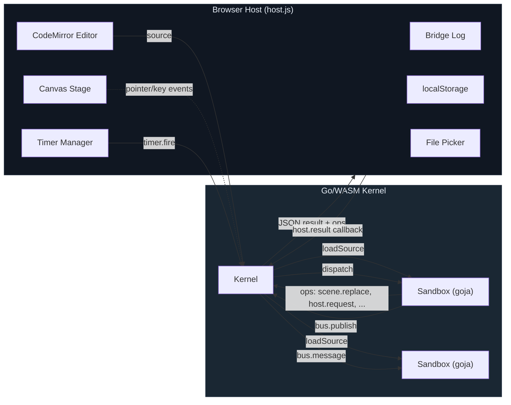

# Capsule Lab: A Sandboxed JS Capsule Runtime in the Browser

Capsule Lab is a browser-based playground for writing and running small JavaScript programs — called *capsules* — inside a sandboxed runtime. The twist: capsules don't run in the browser's native JS engine. They execute inside **goja** (a Go-native ECMAScript 5.1 interpreter) compiled to WebAssembly, with a host-mediated API that controls everything the capsule can see and do. The browser provides the canvas, the timers, and the file system access; the Go/WASM kernel provides isolation, permission enforcement, and a deterministic execution model.

The result is a three-panel IDE with a code editor, a canvas stage, and an inspector — plus a bridge log that shows every operation crossing the sandbox boundary in real time.

> [!summary]
> 1. A **Go/WASM kernel** using goja to run capsule JS in a controlled sandbox
> 2. A **browser host shell** that mediates all side effects (canvas, timers, storage, files, cross-capsule bus)
> 3. A real-time **bridge log** showing the full op stream between kernel and host

## Why this project exists

The motivating question is: what does it look like to run untrusted JavaScript in a browser while keeping the host in complete control of side effects?

Browser-native approaches to JS sandboxing (iframes, Web Workers, `ShadowRealm`) all leak capabilities or impose awkward restrictions. Capsule Lab takes a different path: compile a Go JS interpreter to WASM and use it as the sandbox boundary. The capsule's JS code runs inside goja, which has no access to the DOM, network, or filesystem. Every side effect — drawing to canvas, setting a timer, reading a file — must go through an explicit API that the host mediates and the kernel enforces permissions on.

This isn't a production sandboxing solution. It's a laboratory for exploring the design space: what APIs should a capsule have? What does the permission model look like? How do you debug the boundary between host and sandbox? How do you make it feel interactive despite the serialization overhead?

## Architecture

The system has three layers with a strict unidirectional data flow:



### The conversation protocol

Every interaction between the host and the kernel follows a strict request-response pattern. The host calls kernel methods (`createSandbox`, `loadSource`, `dispatch`) and receives a JSON string back. That JSON always contains `ok: boolean` and optionally an array of `ops` — operations the capsule wants the host to perform.

```
Host → Kernel:  loadSource(sandboxId, jsSource)
Kernel → Host:  { ok: true, manifest: {...}, ops: [...] }

Host → Kernel:  dispatch(sandboxId, { type: "pointer.down", payload: {x, y} })
Kernel → Host:  { ok: true, ops: [
                    { type: "scene.replace", payload: { layer: "main", tree: {...} } },
                    { type: "host.request", payload: { kind: "timer.set", ms: 30 } }
                  ] }
```

The ops are the only way a capsule can affect the outside world. The host inspects each op and decides whether to fulfill it. This is the key architectural invariant: **the capsule never calls the host directly**. It enqueues ops, and the host processes them after the kernel returns.

### Data types crossing the boundary

All data crosses the WASM boundary as JSON strings. The kernel's `main.go` is thin glue:

```go
bridge.Set("dispatch", js.FuncOf(func(this js.Value, args []js.Value) any {
    var event capsule.EventEnvelope
    json.Unmarshal([]byte(argString(args, 1)), &event)
    return capsuleJSON(kernel.Dispatch(argString(args, 0), event))
}))
```

On the Go side, event payloads are `map[string]any`. Scene trees exported from goja are also `map[string]any` after `goja.Value.Export()`. This works but has a sharp edge: goja faithfully exports JS `NaN` as Go `math.NaN()`, and Go's `json.Marshal` rejects NaN per the JSON spec. The kernel had to add recursive NaN sanitization in `flushOps()` to prevent this from crashing the entire dispatch cycle.

## The sandbox runtime

Each capsule runs in its own `Sandbox` struct, which owns a fresh `goja.Runtime`. The sandbox installs a controlled API object before evaluating the capsule source:

```go
func (s *Sandbox) installRuntime() error {
    api := s.rt.NewObject()
    s.installEventsAPI(api)
    s.installSceneAPI(api)
    s.installUIAPI(api)
    s.installStateAPI(api)
    s.installBusAPI(api)
    s.installClockAPI(api)
    s.installBrowserAPI(api)
    s.installGeomAPI(api)
    s.installMathAPI(api)
    s.installTextAPI(api)
    // ...
    capsuleObj.Set("define", func(call goja.FunctionCall) goja.Value {
        s.define(call)
        return goja.Undefined()
    })
    s.rt.Set("Capsule", capsuleObj)
}
```

A capsule registers itself through `Capsule.define()`:

```javascript
Capsule.define({
  id: "constellation-brush",
  name: "Constellation Brush",
  permissions: ["scene.write", "clock", "storage.local", "bus"],
  setup: function(api) {
    api.scene.ensureLayer("main");
    api.events.on("pointer.down", function(evt) {
      // draw on canvas...
    });
  }
});
```

The `setup` function receives the `api` object and registers event handlers. Everything after that is event-driven: the host dispatches events, the capsule processes them synchronously and enqueues ops.

### Permission enforcement

Every side-effecting API call checks a permission first:

```go
func (s *Sandbox) requirePermission(permission, action string) bool {
    if _, ok := s.permissions[permission]; ok {
        return true
    }
    s.log("error", fmt.Sprintf("permission denied for %s", action),
          map[string]any{"permission": permission})
    return false
}
```

The permission set is declared in the capsule's manifest and locked at define-time. A capsule that doesn't declare `clock` cannot set timers. A capsule without `bus` cannot publish or subscribe. Permission denials appear in the bridge log.

### The callback bridge

Asynchronous operations (timers, file picks, storage, fetch) use a callback bridge. When a capsule calls `api.clock.setInterval(handler, 30)`, the kernel:

1. Registers the handler function in a callback map, keyed by a generated ID
2. Enqueues a `host.request` op with `kind: "timer.set"` and the callback ID
3. Returns the ops to the host

The host sets up a real `setInterval`. When it fires, the host dispatches a `timer.fire` event back to the kernel with the callback ID. The kernel looks up the function and invokes it inside goja.

```
Capsule: api.clock.setInterval(handler, 30)
  → Kernel enqueues: { type: "host.request",
                        payload: { kind: "timer.set", ms: 30, repeat: true, callbackId: "cb-capsule-1-3" } }
  → Host: window.setInterval(() => dispatch("timer.fire", "cb-capsule-1-3"), 30)
  → Every 30ms: Host → Kernel → goja invokes handler → ops returned → Host renders
```

This is the fundamental design choice: the capsule's JS never "calls out" to the host. It describes what it wants, and the host fulfills it asynchronously.

### Cross-capsule communication

Capsules can communicate through a topic-based bus. One capsule publishes:

```javascript
api.bus.publish("pulse", { shift: 5 });
```

The kernel enqueues a `bus.publish` op. The host iterates all other capsules and dispatches `bus.message` events to those subscribed to the topic. This enables composable capsule constellations — the Constellation Brush sample publishes a pulse every 1.4 seconds, and the Orbit Pulse sample subscribes to it and shifts its color palette in response.

## The scene graph renderer

Capsules draw by replacing a retained scene tree on a named layer. The tree is a simple JSON-describable structure:

```javascript
api.scene.replace("main", {
  type: "group",
  children: [
    { type: "polyline", points: [...], stroke: "hsla(210,92%,67%,0.85)", width: 2.6 },
    { type: "circle", cx: 100, cy: 100, r: 10, fill: "#fff" },
    { type: "text", x: 22, y: 22, text: "Hello", fill: "#fff", font: "14px sans-serif" }
  ]
});
```

The host's `SceneRenderer` class maintains a `Map<key, tree>` of layers ordered by insertion. On every `scene.replace`, it re-renders all layers to the canvas. Each node type (`group`, `polyline`, `circle`, `line`, `rect`, `text`, `points`) maps to a Canvas 2D drawing call with transform support (translate, rotate, scale, opacity).

Layers are namespaced by sandbox ID, so multiple capsules can draw to the same canvas without interfering. `scene.clear` removes a layer, and destroying a sandbox clears all its layers.

## The browser host shell

The host (`web/host.js`, ~650 lines) is a single ES module that orchestrates:

- **WASM loading**: fetches `capsule-kernel.wasm`, instantiates it, falls back to a pure-JS preview kernel if WASM isn't available
- **Kernel logging**: registers a `setLogHandler` callback so Go-side logs appear in the bridge log
- **Event routing**: pointer events, keyboard events → `dispatch()` to the active capsule
- **Op routing**: processes each op from the kernel's response — scene updates, toast notifications, timer setup, storage I/O, fetch, bus forwarding
- **Timer management**: tracks all active timers per sandbox, clears them on sandbox reset/destroy
- **File picking**: wraps the browser's file input API and delivers results through the callback bridge
- **Scene rendering**: delegates to `SceneRenderer` for canvas drawing

### The CodeMirror editor

The editor pane uses CodeMirror 6 with JavaScript syntax highlighting and the One Dark theme. Getting this working in a no-bundler project was harder than expected.

The initial approach used CDN ESM imports from `esm.sh`, but `codemirror@6` on that CDN resolved to CodeMirror **5** legacy (version 6.65.7 — confusingly versioned). Switching to `jsdelivr/+esm` fixed the package identity but introduced Lezer parser version mismatches (`@lezer/lr` vs `@lezer/javascript`). The final solution: a local esbuild bundle. A 5-line entry point re-exports the four needed symbols, esbuild resolves the full dependency tree from `node_modules` and produces a single 489kb ESM file.

```javascript
// editor-bundle-src.js
export { EditorView, basicSetup } from "codemirror";
export { javascript } from "@codemirror/lang-javascript";
export { oneDark } from "@codemirror/theme-one-dark";
```

The lesson: CDN ESM imports for multi-package ecosystems with deep transitive dependencies are unreliable. Package identity (`codemirror@6` = CM5 or CM6?), version resolution (each CDN import gets its own dep tree), and parser table format compatibility (Lezer grammar + runtime must match) all conspire against you.

## The bridge log and the overflow saga

The bridge log shows every op crossing the sandbox boundary — scene updates, host requests, timer fires, bus messages, permission denials, kernel-level events. It's the primary debugging tool for understanding what a capsule is doing.

### The problem

The log was originally inside the sidebar panel, which was one of three columns in a CSS grid. Every log entry added to the DOM expanded the sidebar, which pushed the grid row taller, which expanded the stage panel. A capsule running a 30ms timer could add hundreds of entries per second, causing the stage to grow from ~490px to nearly 10,000px.

### The failed fixes (a CSS archaeology lesson)

**Attempt 1:** Add `overflow: hidden` to `.panel-block`, set `min-height: 0` on `.log-list`, cap entries at 200 in JS.

*Result:* The JS cap worked but the CSS fix was incomplete. The grid row track was still `auto` (implicit), so it sized to content regardless of flex overflow settings.

**Attempt 2:** Add `grid-template-rows: minmax(0, 1fr)` to `.layout`, `overflow: hidden` to `.sidebar-panel`.

*Result:* Still grew. The `.app-shell` used `min-height: 100vh`, which sets a *floor* but no *ceiling*. The grid container could still grow beyond the viewport.

**Attempt 3:** Move the log out of the grid entirely.

*Result:* Fixed.

The fundamental insight: in a CSS grid, content sizing propagates upward through every container that uses `min-height` instead of `height`, `auto` instead of constrained tracks, or `flex: 1` without a capped ancestor. You must constrain at **every** level of the nesting chain, or the content wins. The simplest solution is to not put unbounded content inside a grid cell that shares a row with fixed-layout content.

### The final layout

```
┌─ header ──────────────────────── (auto) ─┐
│                                           │
├─ editor │ stage │ sidebar ─────── (1fr) ──┤
│                                           │
├─ bridge log ──────────────────── (200px) ─┤
└───────────────────────────────────────────┘
```

`.app-shell` uses `height: 100vh` (not `min-height`) and `overflow: hidden`. The three-row grid (`auto 1fr auto`) ensures the header and log have fixed sizes and the main content takes whatever remains. The log panel has a fixed 200px height with internal scroll.

### Proving it with Playwright

The fix was verified with automated tests that start a Python HTTP server, inject a 30ms-timer capsule, wait 3 seconds, and assert:

```javascript
// After 3 seconds of 30ms timer flood:
expect(logCount).toBeLessThanOrEqual(80);
expect(Math.abs(afterHeight - initialHeight)).toBeLessThan(3);
// Result: 489px → 489px ✓
```

## The NaN boundary problem

When a capsule computes a scene tree, the values flow through three type systems:

1. **JavaScript** (inside goja): numbers are IEEE 754 doubles, NaN is a valid value
2. **Go** (kernel): `goja.Value.Export()` produces `float64`, which can be `math.NaN()`
3. **JSON** (the wire format): NaN is not a valid JSON number

Go's `json.Marshal` strictly rejects NaN and Infinity. If any value in the scene tree's `map[string]any` export contains NaN, the entire marshal fails and the dispatch returns an error.

The fix is a recursive sanitizer that walks every op payload before marshaling:

```go
func sanitizeValue(v any) any {
    switch val := v.(type) {
    case float64:
        if math.IsNaN(val) || math.IsInf(val, 0) {
            return 0
        }
        return val
    case map[string]any:
        return sanitizeMap(val)
    case []any:
        for i, inner := range val {
            val[i] = sanitizeValue(inner)
        }
        return val
    default:
        return v
    }
}
```

This runs on every `flushOps()` call, covering all ops regardless of origin. It replaces NaN with 0 — pragmatic but lossy. A future improvement would log a warning so capsule authors can find their math bugs.

## WASM kernel logging

The Go kernel needed a way to send diagnostic messages to the browser. The approach: a `LogFunc` callback type that the host registers after WASM initialization.

```go
type LogFunc func(level, message string, detail map[string]any)

// In main.go:
kernel.LogFn = func(level, message string, detail map[string]any) {
    if logHandler.IsUndefined() || logHandler.IsNull() {
        js.Global().Get("console").Call("log", "[kernel]", level, message)
        return
    }
    detailJSON, _ := json.Marshal(detail)
    logHandler.Invoke(level, message, string(detailJSON))
}
```

The host registers the callback and routes messages into the bridge log with a `[kernel]` prefix. This makes sandbox lifecycle events (create, destroy), source loading, and dispatch failures visible in the UI alongside capsule-emitted ops.

The detail map is JSON-serialized in Go and parsed in JS — simpler than building JS objects through `syscall/js`, and the bridge log already displays JSON.

## The sample capsules

### Constellation Brush

Pointer-driven trail rendering. Tracks pointer events, smooths the trail with Chaikin subdivision, scatters glow points using Perlin-style noise. Stores the current hue in `localStorage` through the callback bridge. Publishes a `pulse` bus event every 1.4 seconds. Demonstrates: pointer events, retained scene graph, Chaikin geometry, storage, bus publishing, keyboard shortcuts.

### Orbit Pulse

Animated ring system. Uses `setInterval` at 90ms to advance a phase counter. Generates concentric rings of polar coordinates with noise-based wobble. Subscribes to the `pulse` bus topic and shifts its hue in response. Demonstrates: timer-driven animation, polar geometry, noise functions, bus subscription, multi-capsule composition.

### Keyword Radar

Text analysis visualization. Opens a local text file through the browser's file picker API (mediated through the callback bridge), extracts keywords using the kernel's `api.text.keywords()` function, and plots them on a radar chart using polar coordinates. Demonstrates: host-mediated file picking, kernel-side text processing, async callback bridge, permission model (`files.open`).

## The preview kernel

When the WASM kernel isn't available (build not run, or WASM fails to load), the host falls back to `preview-kernel.js` — a ~300-line pure-JS reimplementation of the kernel API. It uses `new Function()` to evaluate capsule source and provides the same API surface, but without the goja isolation boundary. It's deliberately marked as a development fallback; the production path is always Go/WASM.

The preview kernel is useful for UI development: you can iterate on the host shell, layout, and rendering without rebuilding the Go binary. It also serves as executable documentation of the kernel protocol.

## Project structure

```
capsule-lab/
├── kernel/
│   ├── cmd/capsulekernel/main.go    # WASM entry point, JSON bridge
│   ├── internal/capsule/
│   │   ├── kernel.go                # Kernel struct, sandbox lifecycle, logging
│   │   ├── sandbox.go               # Sandbox: goja runtime, API installation,
│   │   │                            #   event dispatch, callback bridge, permissions,
│   │   │                            #   NaN sanitization
│   │   ├── types.go                 # Op, Result, EventEnvelope, Manifest
│   │   ├── geom.go                  # Chaikin, polar, noise2
│   │   └── text.go                  # Keyword extraction, fuzzy scoring
│   ├── go.mod
│   └── go.sum
├── web/
│   ├── index.html                   # Three-row layout: header, 3-col main, log
│   ├── host.js                      # Host shell: WASM loading, event routing,
│   │                                #   op processing, scene rendering, timers
│   ├── app.css                      # Dark theme, grid layout, CM6 overrides
│   ├── preview-kernel.js            # Pure-JS fallback kernel
│   ├── editor-bundle-src.js         # CM6 esbuild entry point
│   ├── editor-bundle.js             # Pre-built CM6 bundle (489kb)
│   ├── capsule-kernel.wasm          # Compiled Go kernel
│   ├── wasm_exec.js                 # Go WASM runtime support
│   ├── samples/
│   │   ├── constellation.capsule.js
│   │   ├── orbit-pulse.capsule.js
│   │   └── keyword-radar.capsule.js
│   ├── tests/
│   │   └── bridge-log.spec.mjs      # Playwright: log cap + stage stability
│   └── playwright.config.mjs
├── scripts/
│   ├── build.sh                     # Builds WASM kernel + editor bundle
│   └── serve.sh                     # Python HTTP server on port 8000
├── DIARY.md                         # Implementation diary (7 steps)
└── README.md
```

## Running it

```bash
# Quick start (preview kernel, no Go build needed):
python3 -m http.server 8000 -d web

# Full build (Go/WASM kernel + editor bundle):
cd web && npm install
./scripts/build.sh

# Run tests:
cd web && npx playwright test
```

## Open questions

- **Permission granularity**: Should `scene.write` be split into `scene.read` and `scene.write`? Should there be per-layer permissions?
- **Capsule persistence**: Capsules are ephemeral. Should the host persist capsule source, state, and layer configuration across page reloads?
- **Capsule communication**: The bus is fire-and-forget. Should there be request-response patterns between capsules?
- **Performance**: Every dispatch serializes to JSON and back. For 30ms timers this is ~33 round-trips per second per capsule. At what point does the serialization overhead become the bottleneck?
- **Security model**: goja provides isolation at the JS level, but the kernel runs in the same WASM memory space. Is this sufficient for actual untrusted code?
- **Custom node types**: The scene graph supports a fixed set of primitives. Should capsules be able to register custom renderers?

## What I'd do next

- Add a drag-to-resize handle on the log panel
- Persist capsule source in localStorage so reloads don't lose work
- Add a capsule-specific CodeMirror lint mode that flags unknown `api.*` calls
- Log a warning when NaN sanitization fires
- Add more kernel-level logging: permission denials, callback lifecycle, timer management
- Explore multiple canvases or off-screen rendering for capsule isolation
- Build a capsule package format for sharing and importing
