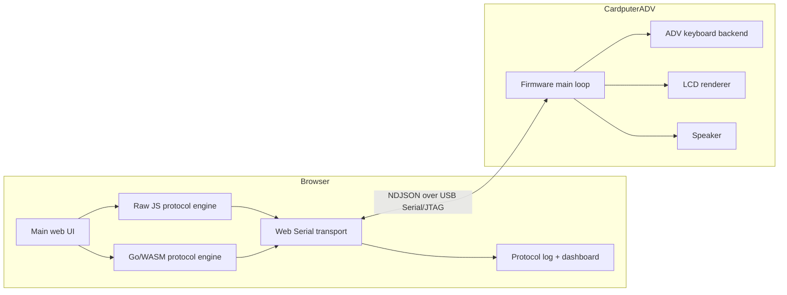
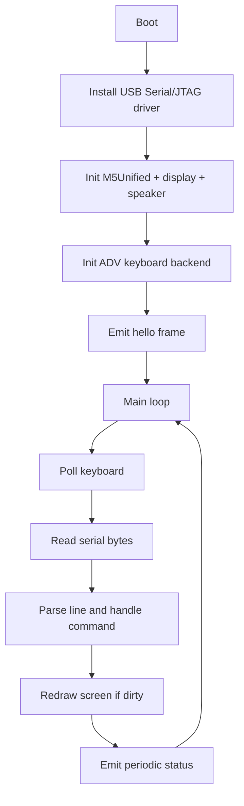
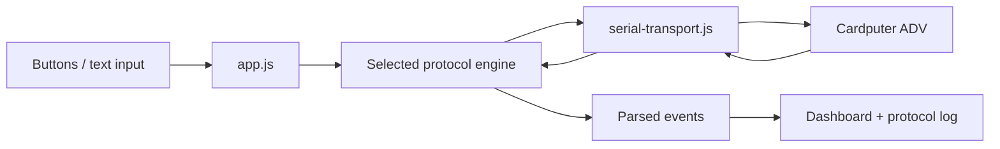

# Cardputer Web Serial Demo

This is the Web Serial transport branch of the [[esp32]] project map.

This project turns an M5Stack Cardputer ADV into a browser-connected physical terminal. The Cardputer runs ESP-IDF firmware on an ESP32-S3, exports a tiny newline-delimited JSON protocol over USB Serial/JTAG, and becomes a bidirectional companion for a web app that can render state, receive keyboard events, and send commands back to the device.

What makes it interesting is not only that it works, but that it draws a clean line through four different environments without getting bloated: embedded C++, Web Serial, browser JavaScript, and Go compiled to WebAssembly. The result is a compact project that feels like an interface prototype, a transport experiment, and a protocol architecture demo at the same time.

> [!summary]
> This project is compelling for three reasons:
> 1. it makes a Cardputer ADV feel like a browser-native peripheral without a desktop helper app
> 2. it runs the same UI against two protocol-engine implementations: Raw JS and Go + WASM
> 3. it stays understandable because every layer is explicit, inspectable, and intentionally simple

## Why this project is cool

Most hardware demos either collapse everything into firmware or push the device behind a native host bridge. This project takes a different route: the browser is the host, the Cardputer is the physical interface, and the protocol between them is simple enough to reason about by eye.

That creates a satisfying split of responsibilities:

- the **device** owns physical interaction
  - keyboard
  - small display
  - buzzer
- the **browser** owns orchestration
  - transport session
  - higher-level UI
  - protocol visualization
  - engine switching

The project is also a clean demonstration of a very practical idea: if a protocol is line-oriented and explicit enough, it can move freely between implementation environments. In this repo, the browser can either parse/build frames directly in JavaScript or hand the same job to Go/WASM. The UI does not need to care.

## Project shape

The repository has three main implementation zones and one support area:

1. **Firmware** in `firmware/`
2. **Browser app** in `web/`
3. **Go/WASM engine** in `wasm/`
4. **Support scripts and docs** in `scripts/` and `ttmp/`

The most important code locations are:

- `/home/manuel/code/wesen/2026-04-02--cardputer-web-demo/firmware/main/main.cpp`
- `/home/manuel/code/wesen/2026-04-02--cardputer-web-demo/firmware/main/cardputer_keyboard.cpp`
- `/home/manuel/code/wesen/2026-04-02--cardputer-web-demo/wasm/main.go`
- `/home/manuel/code/wesen/2026-04-02--cardputer-web-demo/web/app.js`
- `/home/manuel/code/wesen/2026-04-02--cardputer-web-demo/web/serial-transport.js`
- `/home/manuel/code/wesen/2026-04-02--cardputer-web-demo/web/raw-protocol-engine.js`
- `/home/manuel/code/wesen/2026-04-02--cardputer-web-demo/web/wasm-loader.js`
- `/home/manuel/code/wesen/2026-04-02--cardputer-web-demo/web/smoke.html`

## High-level architecture



The clean idea here is that the protocol is the seam. Every layer above or below it can evolve independently as long as it keeps speaking the same line-oriented message contract.

## The wire protocol

The system speaks newline-delimited JSON. Each frame is one JSON object followed by `\n`.

That decision is deceptively powerful:

- it is trivial to inspect in the browser log
- it is trivial to inspect in a serial monitor or Python script
- the firmware can emit frames with string builders
- the browser can parse a stream incrementally without a binary framing scheme
- the Go/WASM engine can work line by line without understanding the transport internals

Typical outbound browser commands:

```json
{"type":"cmd","name":"get_info"}
{"type":"cmd","name":"set_ui_state","connection":"connected","engine":"go-wasm"}
{"type":"cmd","name":"set_screen_text","text":"hello from web"}
{"type":"cmd","name":"ping","nonce":"example-123"}
{"type":"cmd","name":"beep","frequency_hz":880,"duration_ms":120}
```

Typical device events:

```json
{"type":"hello","device":"m5stack-cardputer","fw":"0.1.0","transport":"serial","protocol":"ndjson","usb_console":"usb-serial-jtag"}
{"type":"status","uptime_ms":12345,"connection":"connected","engine":"raw-js","screen_text":"Open the browser UI","typed_text":"","last_submitted_text":"","last_key":"-"}
{"type":"key","chars":"a","typed_text":"abc","submitted_text":"","last_key":"a","enter":false,"del":false,"tab":false,"space":false,"shift":false,"ctrl":false,"alt":false,"fn":false}
```

This is the heart of the project. Everything else is just a different way of producing or consuming those lines.

## Firmware design

The firmware lives in `firmware/` and targets `esp32s3`. The core loop is in `firmware/main/main.cpp`.

The firmware owns three jobs:

1. read the Cardputer ADV keyboard
2. maintain a small UI state model and render it to the display
3. translate between device state and serial NDJSON messages

The firmware state model is intentionally compact:

- current connection label
- current engine label
- screen text
- typed text
- last submitted text
- last key

That state is enough for the device to act like a self-describing endpoint. The browser is not just sending commands blindly; the device can show its own understanding of the session.

### Firmware control flow



The implementation is deliberately straightforward. Instead of introducing an embedded JSON library and a large state machine, the firmware does exactly what the project needs:

- accumulate received bytes
- split on newlines
- extract known fields from small JSON objects
- mutate local state
- emit response lines

That simplicity is a feature. It keeps the firmware easy to inspect and easy to adapt.

### Why the firmware feels good

The device is not reduced to a dumb display target. It continuously reports:

- uptime
- connection mode
- active engine
- typed text
- last submitted text
- last key

That makes the Cardputer feel like an active participant in the session rather than a passive sink for commands.

## Cardputer ADV keyboard integration

One of the most interesting parts of the project is that it is specifically built for the **Cardputer ADV**, not just the original Cardputer layout.

The keyboard backend lives in:

- `/home/manuel/code/wesen/2026-04-02--cardputer-web-demo/firmware/main/cardputer_keyboard.cpp`
- `/home/manuel/code/wesen/2026-04-02--cardputer-web-demo/firmware/main/cardputer_keyboard.h`
- `/home/manuel/code/wesen/2026-04-02--cardputer-web-demo/firmware/main/Adafruit_TCA8418.cpp`
- `/home/manuel/code/wesen/2026-04-02--cardputer-web-demo/firmware/main/Adafruit_TCA8418.h`

That backend does more than map raw button presses. It turns the ADV keyboard into semantic browser-facing events:

- printable characters
- `enter`
- `del`
- `tab`
- `space`
- modifier flags like `shift`, `ctrl`, `alt`, and `fn`

The end result is that the browser can treat the Cardputer as a compact hardware text-and-keys frontend without caring how the physical key controller works.

## Browser app design

The main browser app is intentionally **no-build** and direct. The primary files are:

- `web/index.html`
- `web/app.js`
- `web/serial-transport.js`
- `web/state.js`
- `web/raw-protocol-engine.js`
- `web/wasm-loader.js`

That choice matters. A no-build browser app makes experimentation fast:

- edit a JS file
- reload the page
- test immediately

For a hardware-facing demo, that feedback loop is exactly what you want.

### Browser responsibilities

The browser does five things:

1. open the serial port with `navigator.serial`
2. route text from the transport into the selected protocol engine
3. route UI actions into command frames
4. maintain a dashboard of latest device state
5. render a detailed log of traffic and events

The app is not only a controller. It is also the observability layer for the whole system.

### Main app data flow



The nice part is that the engine boundary is explicit. The transport does not need to know whether the parser/builder is JS or Go/WASM, and the UI does not need to know either.

## Raw JS protocol engine

The Raw JS engine is the baseline implementation. It lives in `web/raw-protocol-engine.js`.

Its responsibilities are intentionally small:

- receive text chunks
- buffer incomplete lines
- emit parsed events when full lines arrive
- build outgoing commands from a name and payload
- expose lightweight debug state

This mode is useful because it is transparent. If you want to understand the protocol behavior with the fewest moving parts, this is the path.

## Go + WASM protocol engine

The Go/WASM mode is what turns the project from a nice demo into a compelling systems experiment.

The source lives in `wasm/main.go`, and `build-wasm.sh` compiles it into:

- `web/app.wasm`
- `web/wasm_exec.js`

The browser dynamically loads that runtime when the user selects the Go/WASM mode.

### What the WASM engine does

The Go engine mirrors the Raw JS engine's responsibilities:

- incremental line buffering
- line parsing into event objects
- command building from name + payload
- debug-state reporting

Conceptually it works like this:

```go
type Engine struct {
    buffer string
    emit   js.Value
}

func (e *Engine) ReceiveText(text string) {
    e.buffer += text
    for newline-delimited line available {
        e.processLine(line)
    }
}

func (e *Engine) BuildCommand(name string, payloadJSON string) string {
    cmd := map[string]any{"type": "cmd", "name": name}
    merge payload keys
    return marshal(cmd) + "\n"
}
```

The engine is not trying to outperform JavaScript. Its value is architectural:

- it proves the protocol logic can live in Go and still run inside the browser
- it creates a realistic path toward protocol reuse across environments
- it keeps the UI and transport constant while swapping the parser/builder layer

That is a genuinely interesting pattern for tool-building: browser UI, but protocol brains in Go.

## The smoke page

`web/smoke.html` is a minimal serial page that strips the system down to its essentials:

- connect
- read chunks
- split lines
- log what arrived
- send a few commands

In many projects this kind of page would be a temporary debugging artifact. Here it is part of the architecture story, because it demonstrates how cleanly the transport layer can stand on its own.

It also shows that the project was built with inspectability in mind. There is a strong difference between "a demo that works once" and "a demo whose layers can each be tested directly." This repo aims for the second.

## How to build it

The build story is pleasantly compact.

### Firmware

```bash
cd /home/manuel/code/wesen/2026-04-02--cardputer-web-demo/firmware
source ~/esp/esp-5.4.1/export.sh
idf.py set-target esp32s3
idf.py build
idf.py -p '/dev/serial/by-id/usb-Espressif_USB_JTAG_serial_debug_unit_D8:85:AC:A4:FB:7C-if00' -b 115200 flash
```

### WASM engine

```bash
cd /home/manuel/code/wesen/2026-04-02--cardputer-web-demo
./build-wasm.sh
```

### Web app

```bash
cd /home/manuel/code/wesen/2026-04-02--cardputer-web-demo/web
python3 -m http.server 8081
```

Then open:

- `http://localhost:8081`
- `http://localhost:8081/smoke.html`

This build path reflects the project’s whole philosophy: minimal glue, minimal ceremony, maximum inspectability.

## How it works at runtime

The runtime story is simple and satisfying:

1. the browser opens the ESP32-S3 serial device
2. the device starts streaming `status` frames
3. the browser sends `set_ui_state` so the device knows what mode the UI thinks it is in
4. the browser can request `get_info`, `ping`, `beep`, `clear_screen`, or `set_screen_text`
5. key presses on the device become browser-visible `key` events
6. the Cardputer screen always reflects the local device-side view of the session

This creates a loop that feels interactive in both directions:

- device -> browser: key and status events
- browser -> device: screen and control commands

That two-way loop is why the project feels more like a tiny distributed system than a one-direction serial demo.

## Why the architecture works

The project works well because it makes a series of disciplined choices:

- **line-oriented wire protocol**
  - easy to debug and portable across implementations
- **small device state model**
  - enough to be expressive without becoming complicated
- **explicit transport layer**
  - browser serial logic is isolated from the protocol engine
- **swappable protocol engine**
  - Raw JS and Go/WASM share the same UI and transport
- **no-build web app**
  - keeps iteration fast
- **purpose-built smoke page**
  - keeps the transport directly testable

None of these decisions are individually flashy. Together, they produce a project that is elegant because it stays legible.

## What this could become

This repo already works as a demo, but it also suggests a family of future directions:

- a more capable browser-hosted Cardputer control surface
- richer text editing or command-palette interactions
- device-side mini-app protocols over the same NDJSON transport
- protocol reuse across browser, CLI, and other Go hosts
- alternative hardware endpoints that implement the same message contract

The underlying idea is strong: treat small serially attached hardware as a browser-managed interactive endpoint with a protocol that is simple enough to migrate across runtimes.

## Project working rule

> [!important]
> Keep the protocol boring and the layers explicit. The reason the project feels good is that the boundaries are visible: firmware, transport, protocol engine, and UI each have a small understandable job.
